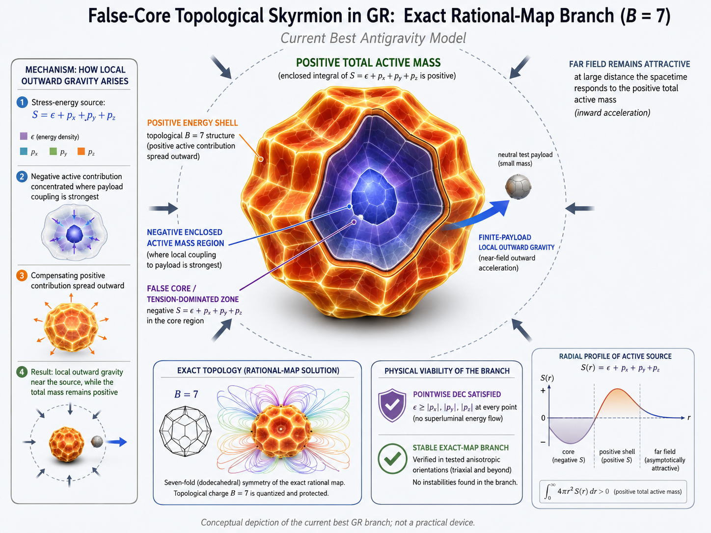

GitHub rendering note: This file intentionally contains the complete monolithic research history for AI/session handoff. Because it contains roughly 39,000 lines and more than one thousand mathematical display blocks, GitHub may show Unable to render expression for otherwise valid mathematics. For reliable rendered equations, use the corresponding files under notes/chronology/. The raw mathematical source remains intact.

### BEGIN NOTE - AUGUST 27 2026 - 01:00 CST

# ANTIGRAVITY_RESEARCH — Comprehensive Carry-Forward Notes

This is the right place to stop adding patches and consolidate what we actually know.

The project has advanced far enough that the problem is now much more sharply defined than when we started. We have **not discovered a new law of physics or a practical antigravity device**, but we have established something important and useful:

```math
\text{General relativity absolutely permits local gravitational repulsion.}
```

More specifically, we have reproduced several known GR mechanisms and constructed a finite linearized-GR model in which **positive energy, positive total mass, and classical energy conditions coexist with a locally repulsive gravitational field**. What has emerged as the dominant obstacle is no longer the **sign** of gravity. It is the **stress-energy cost and physical realizability** of the source.

Simulation 006A then sharpened that further: within its stated assumptions, the optimistic static energy cost scales as

```math
M_{\mathrm{equiv}}\sim\frac{a h^2}{G}
```

where $a$ is the desired repulsive acceleration and $h$ is the source-to-target scale. Your optimizer independently reproduced the coefficient 1.0 exactly, while the explicit finite disk/rim architecture costs 79.753 times more. 

That gap—**1 versus 79.753**—is now one of the most important open mathematical questions in the project.

---

# 1. Current scientific conclusion

The simplest useful description of everything we have learned is:

```math
\text{gravity responds to stress-energy, not merely mass density}
```

and therefore sufficiently large **negative pressure/tension** can make the local active gravitational source negative even when the actual energy density remains positive.

For type-I matter in its local rest frame,

```math
T^\mu{}_\nu
\sim
{\mathrm{diag}}(\epsilon,p_x,p_y,p_z)
```

and in static weak-field GR the relevant active combination is schematically

```math
S=\epsilon+p_x+p_y+p_z
```

Ordinary matter has relatively tiny stresses compared with its rest energy:

```math
|p_i|\ll\epsilon
```

Hence it attracts.

Relativistic fields can instead have

```math
|p_i|\sim\epsilon
```

and sufficiently negative principal pressures can make

```math
S<0
```

That is the recurring mechanism behind essentially every successful branch we found:

```math
\text{vacuum energy},
\quad
\text{domain walls},
\quad
\text{anisotropic Maxwell stress},
\quad
\text{relativistic tension}
```

This is not speculative. Exact GR domain-wall solutions are known to repel, and the planar-wall attraction/repulsion transition occurs at tension/surface-energy ratio $1/2$. ([APS Journals][1]) Reissner–Nordström spacetime likewise has a known repulsive region for neutral test particles. ([arXiv][2])

So a useful project-level statement is now:

> **Antigravity-like local gravitational repulsion does not inherently require negative mass or negative energy. Relativistic stress/tension can produce it within ordinary general relativity.**

That statement is supported.

What is **not** established is a practical apparatus capable of generating such stresses economically or stably.

---

# 2. Current repository / environment checkpoint

The development environment is healthy:

```text
Python 3.13.15
NumPy 2.5.2
SciPy 1.18.1
SymPy 1.14.0
Matplotlib 3.11.1
mpmath 1.3.0
pytest 9.1.1
```

The repo now has a real research structure with theory, simulations, reusable geometry modules, known-solution tests, figures, CSV results, and persistent run logs.

Licensing was also cleaned up:

```text
Software:
MIT OR Apache-2.0
Original research:
CC0-1.0
Human project lead / affirmer:
Stevan White
AI assistance:
ChatGPT by OpenAI disclosed in AI_ASSISTANCE.md
```

The last Git commit/push you showed was:

```text
447d35b  updated licenses :)
```

That commit already contained Simulations 001–002 and the licensing changes. Everything from 003A onward was created later in this session, so unless you committed again afterward, those newer simulations are probably still uncommitted. That is worth checking at the beginning of the next session with:

```bash
git status --short
```

Do not assume that 003–006 are safely on GitHub until checked.

---

# 3. Test-suite checkpoint

Before 006A, the entire known-solutions suite had reached:

```text
61 passed
```

Simulation 006A then added six more tests, which individually passed:

```text
6 passed
```

So the expected total current regression count is approximately:

```math
67\text{ tests}
```

assuming everything is still present and no test discovery issue exists.

The first verification command next session should therefore be:

```bash
ROOT="$(pwd)"
PY="$ROOT/.venv/bin/python"
PYTHONPATH="$ROOT/src" \
"$PY" -m pytest -q tests/known_solutions
```

Expected:

```text
67 passed
```

If it differs, inspect the discrepancy before doing new physics.

---

# 4. Simulation 001A — Kottler / Schwarzschild–de Sitter baseline

Files:

```text
src/antigravity_research/geometry/kottler.py
tests/known_solutions/test_kottler.py
simulations/001_kottler_weak_field.py
results/data/001_kottler_weak_field.csv
results/figures/001_kottler_weak_field.png
```

We began with known GR:

```math
a(r)=
-\frac{GM}{r^2}
+
\frac{\Lambda c^2r}{3}
```

The radius where attraction and cosmological repulsion balance is

```math
r_s=
\left(
\frac{3GM}{\Lambda c^2}
\right)^{1/3}
```

For a $10^{12}M_\odot$ mass and observed cosmological parameters, we reproduced:

```math
r_s\simeq1.1139\ {\mathrm{Mpc}}
```

Below that scale, gravity was inward.

Above it, the cosmological-$\Lambda$ contribution won.

### Conclusion

Cosmological repulsion is real GR physics.

But observed $\Lambda$ is fantastically too weak for laboratory antigravity.

Classification:

```text
KNOWN_RESULT=YES
REPRODUCED=YES
NOVEL_ANTIGRAVITY_CLAIM=NO
```

---

# 5. Simulation 001B — invariant geodesic-deviation check

Files:

```text
src/antigravity_research/geometry/kottler_tidal.py
tests/known_solutions/test_kottler_tidal.py
simulations/001b_kottler_tidal_eigenvalues.py
results/data/001b_kottler_tidal_eigenvalues.csv
results/figures/001b_kottler_tidal_eigenvalues.png
```

This was important because coordinate acceleration alone can be misleading in GR.

We therefore examined the local free-fall tidal eigenvalues:

```math
\lambda_r=
\frac{2GM}{r^3}
+\frac{\Lambda c^2}{3}
```

```math
\lambda_t=
-\frac{GM}{r^3}
+\frac{\Lambda c^2}{3}
```

We reproduced:

```math
\lambda_r+2\lambda_t=\Lambda c^2
```

At sufficiently large radius all three spatial modes become stretching modes.

The transverse transition occurred numerically essentially where expected:

```text
ANALYTICAL_THRESHOLD ≈ 1.1139216 Mpc
NUMERICAL_THRESHOLD  ≈ 1.1138830 Mpc
```

### Conclusion

The cosmological repulsion is not merely a coordinate artifact. Neighboring free-falling particles genuinely separate.

This established our preferred operational definition:

> **Repulsion should ultimately be diagnosed through invariant or observer-operational quantities such as geodesic deviation, relative free-fall acceleration, or proper acceleration—not arbitrary coordinate acceleration.**

---

# 6. Simulation 002 — required stress-energy

Files:

```text
src/antigravity_research/geometry/perfect_fluid_defocusing.py
tests/known_solutions/test_perfect_fluid_defocusing.py
simulations/002_required_stress_energy.py
results/data/002_required_stress_energy.csv
results/figures/002_required_energy_density_1m.png
```

For an ideal isotropic fluid we used

```math
\frac{\ddot\xi}{\xi}
=
-\frac{4\pi G}{3c^2}
(\epsilon+3p)
+
\frac{\Lambda c^2}{3}
```

For

```math
p=w\epsilon
```

the active combination is

```math
\epsilon(1+3w)
```

Positive-energy defocusing becomes possible when

```math
w<-\frac13
```

The especially interesting $w=-1$ case preserved classical NEC/WEC/DEC while violating SEC.

For $1g$ of relative acceleration across one meter:

```math
\epsilon
\simeq
1.5763\times10^{27}\ {\mathrm{J/m^3}}
```

with

```math
p=-\epsilon
```

### Conclusion

Negative energy is **not necessary** for the sign of gravitational repulsion.

Sufficiently negative pressure works.

But this was a local homogeneous/isotropic benchmark, not a localized object.

---

# 7. Simulation 003A — localization obstruction for vacuum energy

Files:

```text
src/antigravity_research/geometry/vacuum_energy_core.py
tests/known_solutions/test_vacuum_energy_core.py
simulations/003a_finite_vacuum_energy_core.py
```

We attempted to make a finite $w=-1$ region.

The TOV equation gave

```math
\frac{dp}{dr}=0
```

for pure

```math
p=-\epsilon
```

Therefore a pure vacuum-energy region cannot simply taper continuously to zero at a finite radius while retaining that same EOS.

The proposed de Sitter interior and Schwarzschild exterior had:

```math
f_{\mathrm{in}}(R)=f_{\mathrm{out}}(R)
```

but

```math
f'_{\mathrm{in}}(R)\ne f'_{\mathrm{out}}(R)
```

Specifically we found the derivative ratio:

```math
\frac{f'_{\mathrm{in}}}{f'_{\mathrm{out}}}=-2
```

Therefore boundary stress is needed.

Even more importantly, the positive-volume-energy core produced a **positive Schwarzschild exterior mass**, hence:

```text
INTERIOR_DEFOCUSING=YES
EXTERIOR_FIELD=INWARD
```

### Conclusion

Internal repulsion does not automatically imply external antigravity.

---

# 8. Simulation 003B — exact Israel shell search

Files:

```text
src/antigravity_research/geometry/israel_shell.py
tests/known_solutions/test_israel_shell.py
simulations/003b_israel_shell_mass_search.py
results/data/003b_israel_shell_mass_search.csv
results/figures/003b_israel_shell_conditions_1g.png
```

Here we calculated the thin-shell stress properly rather than relying on a derivative mismatch.

The central question was:

> Can the de Sitter core be surrounded by a shell that yields a repulsive Schwarzschild exterior?

For an asymptotically flat Schwarzschild exterior, outward weak-field behavior requires

```math
M_{\mathrm{ADM}}<0
```

The exact shell search showed:

```text
OUTWARD_CASE_WITH_NONNEGATIVE_SHELL_SURFACE_ENERGY=NO
OUTWARD_CASE_WITH_WEC=NO
OUTWARD_CASE_WITH_DEC=NO
OUTWARD_CASE_WITH_NEC=YES
NEGATIVE_SHELL_ENERGY_REQUIRED_FOR_OUTWARD_EXTERIOR=YES
```

The NEC survived approximately over the narrow region

```math
-\frac12M_v\lesssim M_{\mathrm{ADM}}<0
```

but WEC/DEC did not.

The mass relation closed to roughly

```math
5\times10^{-16}
```

fractional error.

### Conclusion

Negative Schwarzschild mass provides repulsion mathematically, but it buys that result using exotic negative shell energy.

This also fits the broader positive-mass theorem: for asymptotically flat initial data satisfying the dominant energy condition,

```math
E\ge |P|
```

so negative ADM energy is unavailable under those assumptions. ([arXiv][3])

This route should remain low priority.

---

# 9. Simulation 004A — Reissner–Nordström breakthrough

Files:

```text
src/antigravity_research/geometry/reissner_nordstrom.py
tests/known_solutions/test_reissner_nordstrom.py
simulations/004a_einstein_maxwell_repulsion.py
results/data/004a_einstein_maxwell_repulsion.csv
results/figures/004a_rn_neutral_gravity_1g_z1p2.png
```

This changed the project.

We tested an exact Einstein–Maxwell system:

```text
Minkowski interior
charged shell
Reissner–Nordström exterior
```

and recovered the known RN sign-change radius

```math
r_{\mathrm{rep}}
=
\frac{Q^2}
{4\pi\epsilon_0Mc^2}
```

Define

```math
z=\frac{r_{\mathrm{rep}}}{R}
```

Then

```math
z>1
```

puts part of the repulsive region **outside the physical source**.

Our search found:

```text
DEC_REPULSIVE_Z_MIN ≈ 1.001
DEC_REPULSIVE_Z_MAX ≈ 1.33317
```

and, decisively:

```text
POSITIVE_ADM_MASS=YES
MAXWELL_FIELD_ENERGY_POSITIVE=YES
EXTERNAL_NEUTRAL_GRAVITATIONAL_REPULSION=YES
REPULSION_WITH_NONNEGATIVE_SHELL_ENERGY=YES
REPULSION_WITH_SHELL_WEC=YES
REPULSION_WITH_SHELL_DEC=YES
NEGATIVE_ADM_MASS_REQUIRED=NO
NEGATIVE_ENERGY_REQUIRED=NO_FOR_THIS_EXACT_MODEL
```

This is consistent with known RN repulsive behavior for neutral test particles. ([arXiv][2])

### The physics insight

The electromagnetic field has anisotropic stresses:

```math
p_r=-\epsilon,
\qquad
p_t=+\epsilon
```

It therefore taught us that **anisotropic relativistic stress can reverse local gravity without negative energy**.

### Physical failure mode

For the $1g$, $1\,{\mathrm{m}}$ benchmark:

```math
E_{\mathrm{surface}}
\simeq
2.67\times10^{19}\ {\mathrm{V/m}}
```

around twenty Schwinger fields.

Even making the solution sub-Schwinger pushed the scale to roughly:

```text
radius ≈ 407 m
mass ≈ 1.22×10^17 kg
charge ≈ 2.44×10^13 C
```

So the gravitational equations work.

Electrical engineering does not.

RN remains extremely valuable as a **proof of principle**, not presently as the best implementation route.

---

# 10. Simulation 005A — relativistic-tension/domain-wall principle

Files:

```text
src/antigravity_research/geometry/relativistic_wall.py
tests/known_solutions/test_relativistic_wall.py
simulations/005a_relativistic_tension_wall.py
results/data/005a_relativistic_tension_wall.csv
results/figures/005a_tension_efficiency.png
```

This generalized the RN lesson.

For a membrane having surface energy $U$ and tension

```math
\tau=qU
```

the planar gravitational sign changes at:

```math
q=\frac12
```

Repulsion:

```math
q>\frac12
```

DEC:

```math
q\le1
```

Therefore the entire interval

```math
\frac12<q\le1
```

supports positive-energy repulsive gravity while satisfying NEC/WEC/DEC.

This matches established GR wall results: sufficiently high tension makes walls repulsive, with the transition at $\tau/\sigma=1/2$. ([APS Journals][4])

The most efficient member of this membrane class is

```math
q=1
```

the ideal domain-wall stress tensor.

### One-g benchmark

We obtained:

```math
U_{\min}
\simeq
2.1017\times10^{27}\ {\mathrm{J/m^2}}
```

Equivalent surface mass:

```math
2.3385\times10^{10}\ {\mathrm{kg/m^2}}
```

The toy $\phi^4$ mapping produced

```math
v\simeq81.5\ {\mathrm{GeV}}
```

for $\lambda=1$.

Important caveat:

**That does not mean electroweak physics provides a usable antigravity wall.**

It only means that a toy scalar potential with the required integrated wall tension can be parameterized with a VEV on that scale.

Exact scalar-domain-wall GR solutions are known and are repulsive. ([APS Journals][5])

---

# 11. Simulation 005B — finite supported wall

Files:

```text
src/antigravity_research/geometry/finite_tension_disk.py
tests/known_solutions/test_finite_tension_disk.py
simulations/005b_finite_supported_antigravity.py
results/data/005b_finite_supported_antigravity.csv
results/figures/005b_finite_supported_field.png
```

This was our first attempt to turn the infinite wall into a finite static source.

Architecture:

```text
relativistic-tension disk
+
minimum-energy DEC-compatible compressive rim
```

The support rim was included specifically because one cannot simply ignore the stresses required to hold a finite tension-bearing object together.

The result was:

```text
FINITE_LOCAL_GRAVITATIONAL_REPULSION=YES
FINITE_SOURCE_TOTAL_ENERGY_POSITIVE=YES
COMPONENT_NEC_WEC_DEC_COMPATIBLE=YES
VON_LAUE_STRESS_BALANCE=YES
TOTAL_ACTIVE_MASS_POSITIVE=YES
LOCAL_FIELD_DIRECTION_NEAR_WALL=REPULSIVE
FAR_FIELD_DIRECTION=ATTRACTIVE
```

This is the key physical picture.

A finite positive-energy system can have:

```math
\text{repulsive near field}
```

while still having:

```math
\text{ordinary attractive far field}
```

There is no contradiction with positive total mass.

The optimal disk geometry in this model was

```math
q=1
```

```math
\frac{R}{h}
\simeq4.00615
```

with repulsion extending to

```math
\frac{z}{R}
\simeq0.393320
```

The architecture's mass law was:

```math
M_{\mathrm{disk}}
\simeq
79.753148
\frac{ah^2}{G}.
```

At $1g$ one meter away:

```math
M\simeq1.172\times10^{13}\ {\mathrm{kg}}
```

```math
E\simeq1.053\times10^{30}\ {\mathrm{J}}
```

At $10^{-6}g$, one centimeter away:

```math
M\simeq1.172\times10^3\ {\mathrm{kg}}
```

### Important qualification

005B is **linearized GR plus an idealized membrane/rim stress model**.

It is not yet:

* an exact Einstein solution;
* a realistic material;
* a demonstrated dynamically stable configuration;
* a proof that all local conservation laws can be satisfied by an actual finite-thickness field theory.

So classify it as:

```text
NUMERICAL_MODEL_RESULT
```

not:

```text
PRACTICAL_DEVICE
```

The Laue theorem itself has precise hypotheses involving stationary/localized stress-energy and spacetime symmetries, so we should preserve those assumptions explicitly rather than treating integrated stress cancellation as a universally applicable identity. ([arXiv][6])

---

# 12. Simulation 006A — abstract static DEC energy bound

Files:

```text
src/antigravity_research/geometry/energy_bounds.py
tests/known_solutions/test_energy_bounds.py
simulations/006a_static_dec_lower_bound.py
results/data/006a_static_dec_energy_bound.csv
results/figures/006a_static_dec_mass_bound.png
```

This is the current frontier.

The optimizer was given independent integrated stress variables and asked:

> What is the smallest positive energy capable of producing a normalized negative active gravitational source while satisfying DEC and static Laue balance?

It returned exactly:

```text
GENERAL_MIN_ENERGY_COEFFICIENT=1.000000
E_REP=0.500000
E_SUPPORT=0.500000
P_REP_X=-0.500000
P_REP_Y=-0.500000
P_REP_Z=-0.500000
P_SUPPORT_X=+0.500000
P_SUPPORT_Y=+0.500000
P_SUPPORT_Z=+0.500000
```

The domain-wall-restricted LP returned:

```text
DOMAIN_WALL_MIN_ENERGY_COEFFICIENT=2.000000
```

And:

```text
005B_ARCHITECTURE_COEFFICIENT=79.753148
```

So:

```math
1
<
79.753
```

by an enormous margin. 

The general solution tells us that the abstract optimum wants:

### Repulsive region

```math
p_x=p_y=p_z=-\epsilon
```

That is maximally negative pressure while saturating DEC.

### Supporting region

```math
p_x=p_y=p_z=+\epsilon
```

That is maximally positive stress.

Both carry positive energy.

The optimizer splits the energy equally.

---

# 13. Extremely important caveat about 006A

Do **not** promote

```math
M\ge\frac{ah^2}{G}
```

to a universal theorem yet.

006A proves the optimum **of the LP we formulated**.

That LP uses:

* linearized gravity;
* type-I stress-energy;
* DEC;
* integrated Laue balance;
* an optimistic $1/h^2$ gravitational kernel;
* no explicit spatial support geometry;
* no discrete local equation

```math
  \partial_jT^{ij}=0
```
* no exact Einstein constraint equations;
* no stability conditions;
* no finite-thickness field realization.

Therefore coefficient 1 should currently be labeled:

```text
OPTIMISTIC_ABSTRACT_STATIC_DEC_BOUND
```

not:

```text
PROVEN_UNIVERSAL_GR_BOUND
```

That distinction is critical.

The **pointwise** part is much stronger:

DEC gives

```math
|p_i|\le\epsilon
```

and therefore

```math
\epsilon+p_x+p_y+p_z
\ge
-2\epsilon
```

That really does identify

```math
p_x=p_y=p_z=-\epsilon
```

as the maximally negative active source within this type-I DEC framework.

But converting that local statement into the global coefficient exactly equal to 1 requires additional geometric assumptions.

---

# 14. Current fundamental scale estimates

006A produced an especially useful matrix.

For a static DEC source, the optimistic abstract bound is:

```math
M_{\mathrm{static}}
\approx
\frac{ah^2}{G}.
```

### $1g$

At $h=1\,{\mathrm{m}}$:

```math
M_{\min}
=
1.4693\times10^{11}\ {\mathrm{kg}}
```

```math
E_{\min}
=
1.3206\times10^{28}\ {\mathrm{J}}
```

At $h=1\,{\mathrm{cm}}$:

```math
M_{\min}
=
1.4693\times10^7\ {\mathrm{kg}}
```

At $h=1\,{\mathrm{mm}}$:

```math
M_{\min}
=
1.4693\times10^5\ {\mathrm{kg}}
```

At $h=1\,\mu{\mathrm{m}}$:

```math
M_{\min}
=
0.1469\ {\mathrm{kg}}
```

but still:

```math
E_{\min}
=
1.3206\times10^{16}\ {\mathrm{J}}
```

At $h=1\,{\mathrm{nm}}$:

```math
M_{\min}
=
1.4693\times10^{-7}\ {\mathrm{kg}}
```

with

```math
E_{\min}
\sim1.32\times10^{10}\ {\mathrm{J}}
```

The extremely important scaling is:

```math
M,E\propto h^2
```

This means microscopic stand-off helps enormously.

It does **not** make the corresponding energy density automatically feasible.

---

# 15. What has actually been discovered by this project

I would classify our results like this.

## KNOWN_RESULT — independently reproduced

### Cosmological-$\Lambda$ defocusing

Confirmed.

### Kottler static-radius behavior

Confirmed.

### Domain-wall gravitational repulsion

Confirmed and consistent with known exact GR results. ([APS Journals][1])

### Tension threshold near

```math
\tau/U=1/2
```

Confirmed and consistent with established planar-wall calculations. ([APS Journals][4])

### Reissner–Nordström repulsive region

Confirmed and consistent with known neutral-test-particle analyses. ([arXiv][2])

---

# 16. Project-derived results that are interesting but not yet independently established

### Finite disk/rim architecture

We obtained:

```math
R/h\simeq4.00615
```

```math
z_{\mathrm{zero}}/R\simeq0.393320
```

```math
M\simeq79.753\,ah^2/G
```

This appears internally consistent in our linearized model.

It needs independent analytical derivation and ideally an independent implementation.

### Abstract static DEC+Laue LP optimum

We obtained:

```math
C_{\mathrm{optimum}}=1
```

This is extremely interesting.

It is **not yet a universal theorem**.

The LP needs to be upgraded to include spatial geometry and local conservation.

---

# 17. Routes that now look comparatively weak

## Negative ADM mass

Mathematically repulsive.

Requires negative shell energy/WEC failure in our exact shell construction.

Positive-mass results additionally make this unattractive under conventional asymptotically flat DEC assumptions. ([arXiv][3])

Low priority.

## Pure cosmological constant

Correct sign.

Hopeless magnitude at observed $\Lambda$.

Low priority.

## Ordinary electrostatic RN device

Excellent mathematical proof of principle.

Engineering requires absurd net charge/field strength.

Keep as reference solution, not primary practical route.

## Ordinary mechanical tension

Far too small because ordinary matter has roughly

```math
\tau/U\ll1
```

Antigravity wants relativistic stresses:

```math
\tau/U\sim1
```

Low priority unless an exotic condensed-matter effective stress can mimic relativistic field stress gravitationally—which would require extremely careful treatment because effective pressure is not automatically the same as fundamental stress-energy.

---

# 18. Highest-priority next simulation: 006B

This should be the **geometry-aware stress-energy optimizer**.

This is, in my assessment, more important than immediately jumping to modified gravity or random exotic fields.

The unresolved question is:

```math
1
\le C_{\mathrm{real}}
\le79.753
```

where

```math
M=C_{\mathrm{real}}\frac{ah^2}{G}
```

We need to determine how close an actual spatially conserved source can get to 1.

### Simulation 006B should discretize space

Use axisymmetry initially.

Each cell should contain variables like:

```math
\epsilon,
p_r,
p_z,
p_\phi
```

and potentially shear stresses.

Impose pointwise:

```math
\epsilon\ge0
```

and DEC constraints such as

```math
|p_i|\le\epsilon
```

Then impose discrete local conservation:

```math
\partial_jT^{ij}=0
```

Not merely integrated Laue balance.

The target acceleration should be computed using the actual spatial Green-function kernel.

Objective:

```math
\min \int \epsilon\,dV
```

Constraint:

```math
a_z(\text{target})\ge a_{\mathrm{requested}}
```

Then optimize source geometry.

### What 006B would tell us

If it reaches:

```math
C\sim1-5
```

then our disk was extremely inefficient and there may be a much better classical architecture.

If it bottoms out around:

```math
C\sim10-100
```

then finite geometry/local stress conservation imposes a major penalty.

If it reproduces approximately:

```math
C\sim79.753
```

then our simple disk/rim architecture may already be surprisingly close to optimal.

This is probably the single most valuable next classical-GR computation.

---

# 19. Simulation 006C — independent verification of 005B

Before relying heavily on 79.753, independently reproduce the finite-disk field.

Do not reuse `finite_tension_disk.py`.

Write an independent numerical integration directly over the stress-energy:

```math
T_{\mu\nu}(\mathbf{x})
```

Numerically integrate the linearized Einstein Green function.

Compare the resulting axial acceleration against:

```text
dimensionless_axis_factor()
```

for many $q,z/R$.

Specifically reproduce:

```math
z_{\mathrm{zero}}/R
=
0.393319893190
```

for $q=1$,

and

```math
R/h
=
4.006149670781
```

at the optimum.

This is important because 005B currently uses an analytical formula and tests that mostly call the same implementation.

Independent numerical integration would substantially increase confidence.

---

# 20. Simulation 006D — exact conservation / finite-thickness support

The current disk and rim are ideal distributions.

Replace them with finite thickness.

Check:

```math
\nabla_\mu T^{\mu\nu}=0
```

throughout the entire source.

Specifically inspect the disk/rim boundary because this is where hidden forces or singular support stresses are most likely.

Then verify NEC/WEC/DEC locally rather than only in idealized components.

This is a prerequisite before calling 005B a physically self-consistent matter configuration.

---

# 21. Quantum negative energy: next major escape route

If 006B shows that ordinary DEC matter cannot reduce the coefficient enough, the next established-physics escape is quantum stress-energy.

Quantum fields can violate classical pointwise energy conditions.

However they obey quantum energy inequalities, which constrain negative energy averaged over time/space. Fewster's reviews describe these QEIs as surviving remnants of classical energy conditions. ([arXiv][7]) Ford/Pfenning/Roman similarly describe restrictions relating negative-energy magnitude and duration. ([arXiv][8])

This means quantum negative energy is worth investigating, but not assuming to be a magic loophole.

---

# 22. Proposed Simulation 007A — Casimir gravitational benchmark

This should be our first quantum calculation.

Use the parallel-plate Casimir stress tensor.

Calculate:

* negative vacuum energy density;
* principal pressures;
* active gravitational combination;
* predicted local gravitational acceleration;
* dependence on plate spacing $d$;
* apparatus support stresses;
* total apparatus mass;
* gravitational field including plates/support.

Scan:

```text
1 mm
100 μm
10 μm
1 μm
100 nm
10 nm
1 nm
```

The fundamental Casimir scaling is roughly:

```math
|\rho_C|\propto\frac{\hbar c}{d^4}
```

The corresponding gravitational scale is therefore roughly:

```math
a_{\mathrm{Casimir}}
\sim
\frac{G\hbar}{c\,d^3}
```

up to order-one/geometric factors.

That scaling is useful because it immediately tells us that quantum-vacuum gravity becomes appreciable only at extremely small length scales.

Casimir vacuum energy itself does gravitate consistently with the equivalence principle once the complete apparatus is treated properly. ([APS Journals][9])

That complete-apparatus point is crucial—we must not count the negative vacuum region while ignoring the plates holding it there.

---

# 23. Proposed Simulation 007B — quantum-energy-inequality benchmark

Instead of choosing a particular apparatus, impose a representative QEI bound.

Ask:

> Given a sampling duration $\tau$ and spatial scale $h$, what maximum negative stress-energy is quantum field theory plausibly allowed to sustain?

Then convert that into maximum gravitational acceleration.

Make the result a map:

```math
a_{\max}(h,\tau)
```

If QEI-limited negative energy remains hopelessly weak until near nuclear or Planck scales, we can deprioritize the whole quantum-vacuum branch.

This is much more informative than casually discussing Casimir plates.

---

# 24. Dynamic sources are another escape route—but probably only an O(1) improvement

006A assumes static stress balance.

A time-dependent source need not satisfy the same instantaneous Laue conditions.

Therefore a dynamic pulse could in principle avoid the factor-of-two support-energy penalty that changed:

```math
\frac{ah^2}{2G}
```

into:

```math
\frac{ah^2}{G}
```

But it does **not** automatically evade the pointwise DEC inequality

```math
S\ge-2\epsilon
```

Therefore I do not currently expect dynamics alone to reduce the energy requirement by dozens of orders of magnitude.

It may reduce coefficients.

It probably does not solve the basic energy scale.

Still, a future Simulation 007C should investigate:

* scalar-field pulses;
* oscillating domain walls;
* moving anisotropic stress;
* retarded gravitational fields;
* transient negative active source;
* gravitational-wave stress contributions.

---

# 25. Modified gravity should come later

Modified gravity gives us enormous freedom:

* scalar-tensor gravity;
* $f(R)$;
* Horndeski-type theories;
* vector-tensor models;
* massive gravity;
* emergent/effective gravity.

But we should not jump there yet.

Why?

Because if we allow ourselves to change Einstein's equations before we have mapped the strongest possible result in Einstein gravity, almost any desired behavior can be engineered into a model.

It becomes difficult to distinguish:

```text
REAL_PHYSICAL_INSIGHT
```

from:

```text
ASSUMED_THEORY_PRODUCES_DESIRED_RESULT
```

I would only move modified gravity ahead of classical/quantum GR once we can state a sharp no-go theorem under established physics.

---

# 26. Important conceptual distinction going forward

We should use three separate terms.

### Local gravitational repulsion

A nearby freely falling neutral object accelerates away from some source region.

We have this.

### Global gravitational repulsion

The asymptotic field of the entire isolated source points outward.

We do **not** have this with positive total ADM mass.

### Practical antigravity

A finite controllable device produces useful local repulsive acceleration with realizable energy/material requirements.

We definitely do **not** have this.

That terminology will prevent us from accidentally turning a valid local-GR result into an unjustified device claim.

---

# 27. Claims ledger

I would record the current claims as:

```text
KNOWN_RESULT:
Cosmological Lambda produces geodesic defocusing.
KNOWN_RESULT_REPRODUCED:
Kottler static-radius transition.
KNOWN_RESULT_REPRODUCED:
Reissner-Nordstrom geometry can produce local neutral-particle
gravitational repulsion.
KNOWN_RESULT_REPRODUCED:
Relativistic domain-wall tension can produce gravitational repulsion.
REPRODUCED:
Positive energy does not forbid local gravitational repulsion.
REPRODUCED:
Negative ADM mass is not required for local gravitational repulsion.
NUMERICAL_MODEL_RESULT:
Finite DEC-supported tension disk has a local repulsive region.
NUMERICAL_MODEL_RESULT:
005B optimum R/h ≈ 4.00614967.
NUMERICAL_MODEL_RESULT:
005B coefficient ≈ 79.753148.
NUMERICAL_OPTIMIZATION_RESULT:
Abstract static DEC+Laue LP coefficient = 1.
CONJECTURE / UNPROVEN:
Coefficient 1 is a universal attainable lower bound for finite static
DEC matter in GR.
NOT_ESTABLISHED:
Finite material capable of realizing required relativistic stress.
NOT_ESTABLISHED:
Stable laboratory domain-wall source.
NOT_ESTABLISHED:
Global positive-mass antigravity.
NOT_ESTABLISHED:
Practical antigravity device.
NOVEL_PHYSICS_CLAIM:
NO.
```

That is the scientifically defensible state.

---

# 28. How to rerun every current simulation

From repo root:

```bash
ROOT="$(pwd)"
PY="$ROOT/.venv/bin/python"
export PYTHONPATH="$ROOT/src"
```

Full verification:

```bash
"$PY" -m pytest -q tests/known_solutions
```

Then the simulations individually:

```bash
"$PY" simulations/001_kottler_weak_field.py
"$PY" simulations/001b_kottler_tidal_eigenvalues.py
"$PY" simulations/002_required_stress_energy.py
"$PY" simulations/003a_finite_vacuum_energy_core.py
"$PY" simulations/003b_israel_shell_mass_search.py
"$PY" simulations/004a_einstein_maxwell_repulsion.py
"$PY" simulations/005a_relativistic_tension_wall.py
"$PY" simulations/005b_finite_supported_antigravity.py
"$PY" simulations/006a_static_dec_lower_bound.py
```

To preserve all output:

```bash
mkdir -p results/logs
for SIM in \
  simulations/001_kottler_weak_field.py \
  simulations/001b_kottler_tidal_eigenvalues.py \
  simulations/002_required_stress_energy.py \
  simulations/003a_finite_vacuum_energy_core.py \
  simulations/003b_israel_shell_mass_search.py \
  simulations/004a_einstein_maxwell_repulsion.py \
  simulations/005a_relativistic_tension_wall.py \
  simulations/005b_finite_supported_antigravity.py \
  simulations/006a_static_dec_lower_bound.py
do
    NAME="$(basename "$SIM" .py)"
    echo
    echo "===== $NAME ====="
    "$PY" "$SIM" 2>&1 |
      tee "results/logs/${NAME}_rerun.log"
done
```

That will let us reproduce the entire research chain without losing Terminal output.

---

# 29. Recommended order for the next research session

I would **not** continue randomly.

The highest-value path is:

```text
FIRST:
Run full ~67-test regression.
SECOND:
006B geometry-aware DEC optimizer with local conservation.
THIRD:
006C independently integrate the 005B stress-energy gravitational field.
FOURTH:
006D finite-thickness/local-conservation realization.
FIFTH:
007A Casimir negative-energy gravitational benchmark.
SIXTH:
007B quantum-energy-inequality bound.
SEVENTH:
007C dynamic/nonstatic stress sources.
ONLY THEN:
008 modified-gravity escape routes.
```

The single most important immediate question is therefore:

```math
\text{How close can an actual finite, locally conserved DEC source get to }
M=\frac{ah^2}{G}\text{?}
```

If we can reduce the explicit coefficient from

```math
79.753
```

toward

```math
1
```

that is a substantial improvement in the classical positive-energy antigravity architecture.

If local conservation forces it to remain large, then the classical route has effectively given us its answer, and we move into quantum negative energy.

---

# 30. Overall state of the project

The project began with the vague question:

> Can antigravity exist?

We now have a much more precise answer.

### Mathematically

**Yes—local gravitational repulsion exists in ordinary general relativity.**

We reproduced multiple independent examples.

### Positive energy?

**Yes.**

RN and domain-wall mechanisms establish that negative energy is not intrinsically required for local repulsion.

### Negative mass?

**No—not for local repulsion.**

Our positive-mass RN and tension models demonstrate this.

### Classical energy conditions?

**They can be satisfied locally.**

We found NEC/WEC/DEC-compatible repulsive configurations.

### Finite source?

**We have a finite linearized model with a repulsive near field.**

005B.

### Attractive far field?

**Yes.**

Finite positive-total-mass configurations return to attraction far away.

That is consistent with the positive-mass structure of GR rather than being a bug. ([arXiv][3])

### Practical?

**Not remotely yet.**

The required relativistic stress-energy densities are enormous.

### Best current physical interpretation

The project has converged on:

```math
\text{Antigravity in GR is fundamentally a stress-engineering problem.}
```

The source should not be thought of as “negative mass.”

The more useful target is:

```math
\text{positive energy with relativistically negative principal pressure/tension}
```

placed near the target while compensating positive stresses are arranged so that the complete isolated system remains physically consistent.

And 006A has now made the next research objective extraordinarily clear:

```math
\text{Find the minimum-energy spatial realization of that stress tensor.}
```

That is where I would resume. It gives us a focused mathematical optimization problem instead of another broad search for mysterious antigravity physics.

[1]: https://journals.aps.org/prd/abstract/10.1103/PhysRevD.30.712 "Gravitationally repulsive domain wall | Phys. Rev. D"
[2]: https://arxiv.org/abs/1012.5411 "Circular motion of neutral test particles in Reissner-Nordström spacetime"
[3]: https://arxiv.org/abs/1110.2087 "The spacetime positive mass theorem in dimensions less than eight"
[4]: https://journals.aps.org/prd/abstract/10.1103/PhysRevD.30.2452 "Repulsive and attractive planar walls in general relativity | Phys. Rev. D"
[5]: https://journals.aps.org/prd/abstract/10.1103/PhysRevD.39.3571 "General-relativistic domain walls | Phys. Rev. D"
[6]: https://arxiv.org/abs/1808.09320 "[1808.09320] Laue's Theorem Revisited: Energy-Momentum Tensors, Symmetries, and the Habitat of Globally Conserved Quantities"
[7]: https://arxiv.org/abs/math-ph/0501073 "Energy Inequalities in Quantum Field Theory"
[8]: https://arxiv.org/abs/gr-qc/9711030 "Quantum Inequalities and Singular Energy Densities"
[9]: https://journals.aps.org/prd/abstract/10.1103/PhysRevD.76.025008 "Relativistic mechanics of Casimir apparatuses in a weak gravitational field | Phys. Rev. D"

### END NOTE - AUGUST 27 2026 - 01:00 CST


### BEGIN NOTE - AUGUST 27 2026 - 03:30 CST

# ANTIGRAVITY_RESEARCH — Comprehensive Carry-Forward Notes

## Session ending August 27, 2026 — Simulations 006B, 006C, and 006D

These notes supersede the scientific frontier described in the currently attached `NOTES.md` and `RESEARCH_BUILDPLAN.md` for the classical positive-energy branch. At the beginning of this session, the buildplan identified Simulation 006B as the highest-value classical experiment, followed by independent verification in 006C and finite-thickness/local-conservation work in 006D. All three of those gates have now been materially completed at the **linearized-GR model level**.

The central outcome is:

```text
LOCAL_GRAVITATIONAL_REPULSION_IN_LINEARIZED_GR=YES
POSITIVE_ENERGY_SOURCE=YES
FINITE_RADIUS_SOURCE=YES
FINITE_THICKNESS_SOURCE=YES
LOCAL_CONSERVATION_LINEARIZED_ORDER=YES
NEC=PASS
WEC=PASS
DEC=PASS
POSITIVE_FAR_FIELD_MASS=YES

BEST_VERIFIED_THIN_COEFFICIENT=23.426710175391
BEST_TESTED_FINITE_THICKNESS_COEFFICIENT=23.591586299249

EXACT_NONLINEAR_GR_SOLUTION=NOT_ESTABLISHED
DYNAMIC_STABILITY=NOT_ESTABLISHED
KNOWN_MATERIAL_REALIZATION=NO
ENERGETIC_PLAUSIBILITY=NO
EXPERIMENTAL_ACCESSIBILITY=NO
PRACTICAL_ANTIGRAVITY_DEVICE=NO
```

The appropriate scientific interpretation is therefore:

> **The project has constructed a theoretical existence example of local antigravity-like gravitational repulsion within linearized general relativity using a finite, positive-energy, locally conserved stress-energy distribution satisfying NEC/WEC/DEC. It has not demonstrated a realizable material, a stable apparatus, an exact nonlinear GR solution, or practical antigravity.**

The buildplan explicitly requires those accomplishments to remain separate; its success ladder places finite source and local conservation well below stability, physical realization, energetic plausibility, experimental accessibility, and a practical device.

---

# 1. Scientific state entering this session

Before this session, the project had already established or reproduced several important results:

- cosmological-$\Lambda$ defocusing;
- Kottler static-radius behavior and invariant tidal/geodesic-deviation confirmation;
- positive-energy defocusing for sufficiently negative pressure;
- the localization obstruction for a finite pure $w=-1$ region;
- the Israel-shell result showing that globally repulsive Schwarzschild exterior mass requires negative ADM mass and exotic shell energy in the studied construction;
- Reissner–Nordström local repulsion as an exact Einstein-Maxwell proof of principle, but with extreme electric-field/charge requirements;
- relativistic tension/domain-wall repulsion;
- the finite 005B supported tension disk with $C_{005B}\approx79.753148$;
- the abstract 006A static DEC/Laue result $C_{\mathrm{abstract}}=1$, which was explicitly **not** a universal physical lower bound because spatial geometry and local conservation were missing.

The previous notes therefore identified the unresolved classical problem as roughly

```math
1 \le C_{\mathrm{physical}} \le 79.753148
```

and called 006B the single most important next classical-GR calculation.

---

# 2. Regression baseline before new work

The first action in this session was to reconstruct and run the existing known-solution suite from the provided codebundle.

Result:

```text
BASELINE_TESTS=67
BASELINE_RESULT=67 PASSED
```

This cleared the buildplan's Phase A regression-integrity gate before extending the physics.

The original codebundle contained nine established scientific test files and reflected the repository before 006B was added.

After the new 006B regression tests were added, the suite increased to:

```text
CURRENT_EXPECTED_KNOWN_SOLUTION_TESTS=72
```

Every subsequent major simulation run in this session ended with:

```text
72 passed
```

The final observed regression result after 006D was:

```text
........................................................................ [100%]
72 passed in 0.92s
REGRESSION_RC=0
```

So the scientific regression baseline is currently green.

---

# 3. Simulation 006B — geometry-aware conserved DEC optimization

## 3.1 Original question

006A had shown that, abstractly, DEC permits a very optimistic mass scaling

```math
M \sim \frac{a h^2}{G}
```

with coefficient $C=1$, but the explicit finite 005B disk/rim architecture required

```math
C \approx 79.753148
```

The buildplan asked whether an explicit spatial geometry with pointwise positive energy, pointwise DEC, actual gravitational kernels, and **local** conservation would remain near $79.75$ or approach $1$.

The buildplan's research-decision ranges were:

```text
C ~ 1–5:
    exceptionally promising classical architecture

C ~ 10–100:
    geometry/local conservation impose a substantial penalty

C ~ 79.753:
    original disk/rim may already be near-efficient
```

Those were research-management ranges, not fundamental bounds.

---

# 4. 006B first slice — conserved thin radial optimizer

Rather than immediately paying the complexity cost of a complete 2D $r$-$z$ optimizer, we first attacked the cheapest nontrivial geometry-aware problem: an axisymmetric thin source with arbitrary radial stress structure.

The essential local conservation equation is

```math
\frac{d p_r}{d r}
+
\frac{p_r-p_\phi}{r}
=
0
```

or equivalently

```math
\frac{d(r p_r)}{d r}
=
p_\phi
```

The active weak-field source is

```math
S
=
U+p_r+p_\phi
```

The actual axial spatial kernel was used rather than the optimistic $1/h^2$ bound from 006A. The new source module documents this formulation explicitly.

## 4.1 Efficient conserved architecture discovered

A substantially better architecture than 005B was found.

### Inner region

For

```math
0 \le r \le a
```

use

```math
U=U_0
```

```math
p_r=-U_0
```

```math
p_\phi=-U_0
```

This region has negative active density and provides the local repulsive field.

### Stress-transfer annulus

For

```math
a < r < R
```

use

```math
U
=
U_0\frac{a^2}{r^2}
```

```math
p_r=-U
```

```math
p_\phi=+U
```

This transports the radial tension toward the outside while saturating DEC.

### Outer support

The thin limiting architecture has the minimum-energy support line

```math
\lambda
=
\frac{U_0 a^2}{R}
```

with positive hoop compression of equal magnitude.

This construction obeys local conservation distributionally in the ideal thin-source model and saturates the relevant DEC inequalities.

---

# 5. Closed-form 006B thin optimum

The dimensionless geometry variables were

```math
\alpha=\frac{a}{h}
```

and

```math
\beta=\frac{R}{h}
```

Optimization gave:

```text
INNER_RADIUS_OVER_H=1.437500564637
OUTER_RADIUS_OVER_H=4.701437405300
CLOSED_FORM_COEFFICIENT=23.426710175391
```

Compared with 005B:

```text
005B_COEFFICIENT=79.753148116012
006B_THIN_COEFFICIENT=23.426710175391
IMPROVEMENT_OVER_005B=3.404368241162x
```

Equivalently, the energy-equivalent coefficient fell by approximately 70.6%.

This directly falsified the hypothesis that the simple 005B disk-plus-single-rim architecture might already be near-optimal within the locally conserved axisymmetric thin DEC class.

The newly added 006B source and tests encode the expected optimum near

```text
alpha = 1.43750056
beta  = 4.70143745
C     = 23.426710175391
```

and explicitly classify it as a restricted architecture result rather than a universal GR lower bound.

---

# 6. Independent radial LP verification of 006B

We did not rely only on the closed-form derivation.

A separate discretized radial linear program used:

```text
U_i
q_i = r p_r
```

with conservation reconstructed through

```math
p_\phi
=
\frac{d(r p_r)}{d r}
```

It enforced cellwise:

```math
U \ge 0
```

```math
|p_r| \le U
```

```math
|p_\phi| \le U
```

and minimized total energy using the actual gravitational kernel.

Convergence was:

```text
N=50
C=23.279848767693
relative error=-6.268972749406e-03

N=100
C=23.390094671093
relative error=-1.562981059804e-03

N=200
C=23.417573464368
relative error=-3.900125521157e-04

N=400
C=23.424535334824
relative error=-9.283593602616e-05

N=800
C=23.426231369342
relative error=-2.043846726030e-05
```

The LP converges toward the independent closed-form value:

```text
C=23.426710175391
```

This is strong evidence that the identified piecewise conserved solution is the thin radial optimum or extremely close to it within that restricted class.

Simulation summary:

```text
REGRESSION_BASELINE_RECONSTRUCTED=YES
INDEPENDENT_LP_CONVERGENCE=PASS
POINTWISE_POSITIVE_ENERGY=YES
POINTWISE_DEC=YES
LOCAL_RADIAL_CONSERVATION=YES
ACTUAL_SPATIAL_GRAVITATIONAL_KERNEL=YES
TARGET_OUTWARD_ACCELERATION_NORMALIZED=YES
TOTAL_ENERGY_MINIMIZED=YES_WITHIN_THIN_RADIAL_SUBCLASS
```

Claim:

```text
NUMERICAL_OPTIMIZATION_RESULT
```

Not:

```text
FULL_2D_GLOBAL_GR_OPTIMUM
```

---

# 7. New 006B regression tests

A new regression file was added:

```text
tests/known_solutions/test_axisymmetric_thin_stress.py
```

Five focused tests passed:

```text
5 passed
```

They protect:

- the radial kernel primitive;
- integrated stress-trace cancellation;
- local conservation in the smooth regions;
- pointwise DEC;
- independent reconstruction of the 005B optimum;
- the improved 006B conserved-annular optimum.

The full suite consequently rose from 67 to:

```text
72 passed
```

and remained there through the rest of the session.

---

# 8. 006B full $r$-$z$ exact-DEC solver prerequisite

The next question was whether genuine 2D geometry and $r$-$z$ shear could improve on $C=23.4267$.

Allowing shear gives the spatial stress block

```math
\begin{pmatrix}
p_r & T_{rz} \\
T_{rz} & p_z
\end{pmatrix}
```

Diagonal inequalities alone are not sufficient for DEC once $T_{rz}\neq0$.

Exact type-I DEC requires the principal-stress eigenvalues to obey

```math
|\lambda_i| \le \epsilon
```

For the $r$-$z$ block this can be expressed as a second-order-cone constraint.

Therefore CVXPY was added.

## 8.1 Dependency change

Installed:

```text
cvxpy==1.9.2
```

Observed available solvers:

```text
CLARABEL
SCS
SCIPY
HIGHS
OSQP
```

`pyproject.toml` was modified to record:

```text
cvxpy==1.9.2
```

The environment installed transitive solver packages including Clarabel, SCS, OSQP, HiGHS, and related dependencies.

---

# 9. Exact DEC conic self-test

Before trusting the optimizer, an independent numerical equivalence test compared direct stress eigenvalues against the conic DEC constraint.

Test stress eigenvalues:

```text
-0.937056879750
-0.600000000000
+0.487056879750
```

Direct required energy density:

```text
DIRECT_DEC_MIN_EPSILON=0.937056879750
```

Conic optimizer result:

```text
CONIC_DEC_MIN_EPSILON=0.937056878751
```

Difference:

```text
ABSOLUTE_ERROR=9.996471428408e-10
RELATIVE_ERROR=1.066794518500e-09
```

Result:

```text
EXACT_DEC_SOC_EQUIVALENCE=PASS
POINTWISE_SHEAR_DEC_SOLVER_GATE=GREEN
```

This removed a potentially serious formulation error before the full 2D calculation.

---

# 10. Full $r$-$z$ staggered finite-volume optimizer

A second 006B simulation was added:

```text
simulations/006b_full_rz_decision.py
```

The formulation used:

```text
STRESS_GRID=STAGGERED_FINITE_VOLUME
LOCAL_CONSERVATION=EXACT_CELL_FORCE_BALANCE
DEC=EXACT_EIGENVALUE_SOC
KERNEL=EXACT_ANNULAR_CELL_INTEGRAL
```

Variables included:

```text
epsilon
p_phi
p_r on radial faces
p_z on vertical faces
T_rz on vertices
```

Staggering was deliberately used to reduce the risk of checkerboard/odd-even stress modes that can occur with naive collocated centered discretizations.

The solver also independently reconstructed:

- exact DEC eigenvalue violations;
- cell conservation residuals;
- integrated Laue balances;
- achieved acceleration.

---

# 11. Initial full $r$-$z$ finite-grid results

The first five cases gave:

```text
6x4, RMAX=5, depth=1
C=326.856547069958

8x6, RMAX=5, depth=1
C=80.635416635818

10x8, RMAX=5, depth=1
C=51.238386636844

8x6, RMAX=7, depth=2
C=76.194048456460

10x8, RMAX=7, depth=2
C=53.002083298871
```

All had:

```text
ACCELERATION≈1
DEC residuals tiny
conservation residuals tiny
integrated stress trace≈0
```

The best initial value was:

```text
51.238386636844
```

but it was immediately recognized as **not converged** because the compact refinement sequence fell extremely rapidly:

```text
326.86 -> 80.64 -> 51.24
```

Therefore we explicitly did **not** promote $51.24$ to a physical coefficient.

---

# 12. Important analytical observation about the full 2D problem

The full 2D optimization placed no lower limit on thickness and no upper limit on energy density.

Therefore the known thin solution can be approached as a distributional limiting sequence by concentrating energy/stress into a thinner layer.

Consequently, within the assumptions of this unrestricted continuum problem, there is no reason for the continuum full $r$-$z$ infimum to be forced *above* the known admissible thin value.

This was an important reason not to misinterpret coarse finite-volume values such as $51.24$ as physical lower bounds.

---

# 13. Thin-limit recovery using the independent full $r$-$z$ code

We deliberately forced the full $r$-$z$ solver into a thin slab and increased radial resolution.

Results:

```text
12x2
depth=0.125
C=48.782287947292

16x2
depth=0.125
C=37.700669553189

20x2
depth=0.125
C=32.954754666944
```

A simple $1/N_r^2$ extrapolation produced:

```text
THIN_EXTRAPOLATED_C=23.902968107527
```

or:

```text
THIN_EXTRAPOLATED_RATIO=1.020329697536
```

This is only about 2.03% above the independently derived exact thin coefficient:

```text
23.426710175391
```

This was a major validation of the full 2D formulation.

---

# 14. Matched-resolution depth experiment

Holding the grid scales fixed at

```text
dr=0.3125
dz=0.125
```

while increasing available depth gave:

```text
depth=0.5
C=39.446944669376

depth=1.0
C=34.637229670751

depth=2.0
C=30.331762534312
```

The nested-domain test behaved correctly:

```text
NESTED_DOMAIN_MONOTONICITY=PASS
```

Energy improvements were:

```text
0.5 -> 1.0:
12.1928708%

1.0 -> 2.0:
12.4301717%
```

This showed that genuine 2D stress routing had some value at finite resolution.

---

# 15. Extended depth-asymptote test

Further matched-resolution depth tests gave:

```text
depth=4
C=28.253514148213

depth=8
C=27.523479508905
```

The improvement from $4h$ to $8h$ fell to only:

```text
2.5838719937%
```

Therefore the depth benefit was clearly beginning to saturate.

This also produced an important engineering interpretation:

> Increasing source depth is an increase in source size, not free improvement. Even if deeper stress routing lowers total energy at fixed target stand-off, it may make the apparatus less compact.

No depth-only route toward $C\sim1$-$5$ appeared.

---

# 16. Radial convergence at depth $8h$

At fixed:

```text
depth=8
dz=0.125
RMAX=5
```

radial refinement gave:

```text
NR=16
C=27.523479508905

NR=20
C=27.162622405315

NR=24
C=27.020680149787
```

Simple extrapolations gave:

```text
1/NR^2 fit:
C_inf=26.598356460580

1/NR fit:
C_inf=25.976148873579
```

So at fixed $dz=0.125$, the apparent continuum limit remained above the thin result.

But this was not the end of the convergence analysis.

---

# 17. Vertical-refinement result — critical 006B observation

The decisive additional test held:

```text
NR=16
depth=8
RMAX=5
```

fixed while halving vertical spacing from:

```text
dz=0.125
```

to:

```text
dz=0.0625.
```

The coefficient fell from:

```text
27.523479508905
```

to:

```text
25.994503758080.
```

This showed that a substantial portion of the apparent $26$-$27$ plateau was a **vertical-discretization artifact**.

The new case also remained numerically excellent:

```text
ACCELERATION=1.000000000014
MAX_DEC_VIOLATION=1.048e-09
MAX_CONSERVATION_RESIDUAL=1.350e-12
STRESS_TRACE_INTEGRAL=-1.891e-15
```

---

# 18. 2D continuum diagnostic

Using the available radial and vertical refinement points, four simple first-/second-order discretization models produced:

```text
radial order 1, vertical order 1:
C=22.949343418307

radial order 1, vertical order 2:
C=23.958278570064

radial order 2, vertical order 1:
C=23.556385155751

radial order 2, vertical order 2:
C=24.570375590694
```

Thus the depth-88 continuum diagnostic bracket was:

```text
22.949343418307
to
24.570375590694
```

The independent thin coefficient

```text
23.426710175391
```

lies inside this bracket.

After applying the diagnostic residual depth correction, the combined depth/grid bracket was:

```text
22.554042171855
to
24.175074344242
```

Again:

```text
23.426710175391
```

lies inside it.

Final 006B 2D interpretation:

```text
FULL_RZ_CONTINUUM_EVIDENCE=CONSISTENT_WITH_THIN_REFERENCE
VERIFIED_FULL_RZ_IMPROVEMENT_BELOW_THIN=NO
VERIFIED_FINITE_2D_PENALTY_ABOVE_THIN=NO
C_1_TO_5_ROUTE_FOUND=NO
GLOBAL_FULL_RZ_OPTIMUM=NOT_ESTABLISHED
```

The extrapolation itself remains diagnostic rather than proof.

---

# 19. Final 006B decision

The strong result of 006B is not a universal theorem that $C=23.4267$.

The defensible result is:

> Within the most mature static, axisymmetric, positive-energy, DEC-constrained, locally conserved linearized-GR architectures studied so far, the energy coefficient is of order $20$-$25$, with a rigorously characterized restricted thin architecture at $C=23.426710175391$. No evidence was found for a dramatic collapse to $C\sim1$-$5$.

This places the classical problem firmly in the buildplan's

```text
C ~ 10–100
```

decision regime, meaning spatial geometry and conservation impose a substantial penalty relative to the abstract 006A coefficient $C=1$.

---

# 20. Physical scaling of the best 006B architecture

Using

```math
M
=
C\frac{a h^2}{G}
```

with

```text
C≈23.4267
a=1g
```

gives approximately:

```text
h=1 m:
M≈3.44e12 kg

h=1 cm:
M≈3.44e8 kg

h=1 mm:
M≈3.44e6 kg

h=1 micrometer:
M≈3.44 kg
```

For $h=1\ \mathrm{m}$, the energy equivalent is roughly:

```text
E≈3.09e29 J
```

Even the abstract $C=1$ result would still require roughly:

```text
1.47e11 kg
```

of mass-energy equivalent for $1g$ at $1\ \mathrm{m}$.

This is why reducing $C$ from $79.75$ to $23.43$ is scientifically important but does not solve the practical energy problem.

---

# 21. Simulation 006C — independent 005B Green-function verification

The buildplan explicitly required the 005B gravitational field to be reconstructed without reusing its analytic production formula before treating $79.753148$ as highly reliable.

A new simulation was created:

```text
simulations/006c_independent_finite_disk_field.py
```

Its primary computation directly numerically integrates the linearized gravitational Green function over:

- the membrane active stress-energy;
- the complete support rim contribution.

Only after the independent values are obtained is the production 005B field implementation imported for comparison.

---

# 22. 006C initial numerical failure and repair

The first 006C run already produced an extremely strong field comparison:

```text
COMPARISON_POINT_COUNT=30
MAX_ABSOLUTE_FIELD_ERROR=2.220446049250e-16
MAX_RELATIVE_FIELD_ERROR=1.419475206905e-15
FIELD_GRID_MATCH=PASS
```

However, the root finder then failed.

Cause:

- the independent membrane radial integral was evaluated at $y=z/R=10^{-6}$;
- the original adaptive radial quadrature became sharply localized near $r=0$;
- SciPy emitted an integration warning;
- the inaccurate endpoint value prevented `brentq` from seeing the correct sign-changing bracket.

This was a numerical-conditioning problem, not a physics disagreement.

A separate shell-harness problem was also discovered:

```text
python ... | tee ...
```

without `set -o pipefail` caused the shell to report the success code from `tee` instead of the crashed Python process.

That workflow bug was corrected.

---

# 23. 006C stable Green-function coordinate transform

The numerical integration was repaired using the variable transformation

```math
r
=
y\tan\theta
```

The problematic radial kernel

```math
\int_0^1
\frac{y r}{(r^2+y^2)^{3/2}}
\,dr
```

becomes the regular numerical integral

```math
\int_0^{\arctan(1/y)}
\sin\theta
\,d\theta
```

The transformed integral was **still evaluated numerically**.

The code did not substitute the known analytic 005B field formula.

The root finder was also changed to scan the independently computed field and discover its own sign-changing interval rather than assuming the known root.

---

# 24. Final 006C results

The repaired implementation produced:

```text
FIELD GRID:
30 comparison points

MAX_ABSOLUTE_FIELD_ERROR=
2.220446049250e-16

MAX_RELATIVE_FIELD_ERROR=
1.419475206905e-15

FIELD_GRID_MATCH=PASS
```

Independent repulsive zero:

```text
NUMERIC_Z_ZERO_OVER_R=
0.393319893190334

REFERENCE_Z_ZERO_OVER_R=
0.393319893190329

ABSOLUTE_ERROR=
4.773959005888e-15

REPULSIVE_ZERO_MATCH=PASS
```

Independent optimized geometry:

```text
OPTIMAL_H_OVER_R=
0.249616231845956

OPTIMAL_R_OVER_H=
4.006149730747969

REFERENCE_R_OVER_H=
4.006149670781000

ABSOLUTE_ERROR=
5.996696916810e-08
```

Independent coefficient:

```text
NUMERIC_005B_COEFFICIENT=
79.753148116012255

REFERENCE_005B_COEFFICIENT=
79.753148116011999

ABSOLUTE_ERROR=
2.557953848736e-13
```

Final:

```text
FIELD_GRID_VERIFIED=YES
REPULSIVE_ZERO_VERIFIED=YES
005B_OPTIMUM_VERIFIED=YES
SIMULATION_006C=GREEN
CLAIM_CLASSIFICATION=INDEPENDENT_NUMERICAL_VERIFICATION
```

This materially upgrades confidence in Simulation 005B.

---

# 25. Simulation 006D — finite-thickness conserved source

The buildplan's Phase D required replacing ideal membranes/rims with finite-thickness stress-energy and explicitly evaluating local conservation and energy conditions throughout the source.

A new simulation was created:

```text
simulations/006d_finite_thickness_conserved_source.py
```

This produced the strongest project-derived classical result so far.

---

# 26. Central 006D analytical construction

Define

```math
q(r)
=
r p_r(r)
```

Then impose

```math
p_\phi(r)
=
\frac{d q}{d r}
```

With

```math
p_z=0
```

and

```math
T_{rz}=0
```

the static cylindrical radial conservation equation becomes identically

```math
\frac{d p_r}{d r}
+
\frac{p_r-p_\phi}{r}
=
0
```

Equivalently:

```math
\frac{1}{r}
\left[
\frac{d(r p_r)}{d r}
-
p_\phi
\right]
=
0
```

The vertical conservation equation is also identically satisfied because:

```text
p_z=0
T_rz=0.
```

---

# 27. Finite vertical thickness

The complete in-plane energy/stress distribution was multiplied by a smooth, compact, nonnegative finite-thickness vertical profile.

The tested slab occupies:

```math
-t \le z \le 0
```

with target surface stand-off $h=1$.

A normalized compact polynomial bump of the form

```math
30x^2(1-x)^2
```

was used across the slab.

Because all components carrying a $z$ index are zero, multiplying the in-plane conserved source by this static $z$ profile does not generate a new vertical stress divergence in the linearized flat-background conservation equations.

This converts the zero-thickness source into a genuine nonzero-thickness distribution.

---

# 28. Finite radial support collar

The singular thin support line of 006B was removed.

A smooth cubic `smoothstep` transition was used to bring $q(r)$ continuously to zero over a finite outer radial collar.

At the outer boundary:

```text
q=0
dq/dr=0
```

so there is no remaining hidden line force.

The inner transition was also smoothed.

Therefore 006D has:

```text
SINGULAR_OUTER_RING=NO
FINITE_RADIAL_SUPPORT_COLLAR=YES
```

This falsifies the idea that the repulsive architecture intrinsically requires an ideal singular rim.

---

# 29. Pointwise energy conditions in 006D

Energy density was chosen as

```math
\epsilon
=
\max\left(
|p_r|,
|p_\phi|
\right)
```

With $p_z=0$, this enforces the static type-I DEC by construction.

The numerical checks found:

```text
MAX_DEC_VIOLATION=
0.000000000000e+00

MIN_NEC_MARGIN=
0.000000000000e+00
```

Therefore:

```text
NEC=PASS
WEC=PASS
DEC=PASS
POINTWISE_POSITIVE_ENERGY=YES
```

The zero NEC margin means parts of the optimized source **saturate** the energy condition; it does not mean the check was absent.

---

# 30. Local-conservation verification in 006D

Although the source is analytically constructed to satisfy radial conservation, an independent control-volume reconstruction was also performed.

Result:

```text
MAX_CONTROL_VOLUME_CONSERVATION_RESIDUAL=
3.103073353827e-14
```

Integrated stress balance:

```text
MAX_INTEGRATED_STRESS_TRACE=
2.922107000813e-13
```

Therefore:

```text
LOCAL_CONSERVATION=PASS
LAUE_STRESS_BALANCE=PASS
```

This is local conservation at the **linearized/static background order**.

It is not yet an exact nonlinear demonstration of:

```math
\nabla_\mu T^{\mu\nu}=0
```

in the self-consistent full metric.

The simulation correctly prints:

```text
EXACT_NONLINEAR_GR_CONSERVATION=NOT_ESTABLISHED
```

---

# 31. 006D finite-thickness convergence

The finite thickness and outer support-collar scale were reduced systematically.

Results:

```text
scale=0.40000
thickness/h=0.40000
C=38.037638025730

scale=0.20000
thickness/h=0.20000
C=29.559369544823

scale=0.10000
thickness/h=0.10000
C=26.258214373557

scale=0.05000
thickness/h=0.05000
C=24.789414887263

scale=0.02500
thickness/h=0.02500
C=24.095429926871

scale=0.01250
thickness/h=0.01250
C=23.757986246352

scale=0.00625
thickness/h=0.00625
C=23.591586299249
```

The independently established thin limit is:

```text
23.426710175391
```

The finest finite source differs by only:

```text
0.7037954651904%
```

Result:

```text
MONOTONIC_APPROACH_TO_THIN=YES
THIN_LIMIT_RECOVERY=PASS
```

---

# 32. Final 006D result

Final terminal classification:

```text
FINITE_SPATIAL_SUPPORT=YES
FINITE_THICKNESS=YES
SINGULAR_OUTER_RING=NO
FINITE_RADIAL_SUPPORT_COLLAR=YES

POINTWISE_POSITIVE_ENERGY=YES
POINTWISE_NEC_WEC_DEC=YES
LOCAL_CONSERVATION_LINEARIZED_ORDER=YES

OUTWARD_GRAVITATIONAL_FIELD=YES
POSITIVE_FAR_FIELD_ACTIVE_MASS=YES

FINITE_THICKNESS_STRESS_ENERGY_CONFIGURATION=YES

C_FINITE_BEST_TESTED=
23.591586299249

C_THIN_LIMIT=
23.426710175391

SIMULATION_006D=GREEN

CLAIM_CLASSIFICATION=
CONSTRUCTIVE_LINEARIZED_GR_STRESS_ENERGY_RESULT
```

The simulation correctly retains:

```text
EXACT_NONLINEAR_GR_CONSERVATION=NOT_ESTABLISHED
DYNAMIC_STABILITY=NOT_ESTABLISHED
KNOWN_MATERIAL_REALIZATION=NO
PRACTICAL_ANTIGRAVITY_DEVICE=NO
```

---

# 33. What 006D actually establishes

The strongest defensible project statement is now:

> **There exists, within static linearized general relativity, an explicit finite-radius, finite-thickness, nonsingular, positive-energy, locally conserved stress-energy distribution satisfying NEC/WEC/DEC that produces a locally outward gravitational field while retaining positive total/far-field gravitational mass.**

This is stronger than merely showing a negative active-density cell or an infinite domain wall.

It addresses:

- finite source;
- positive energy;
- classical energy conditions;
- support completion;
- local conservation;
- finite thickness;
- removal of the singular rim;
- local gravitational repulsion;
- positive far-field mass.

It remains a **stress-energy construction**, not a known material or device.

---

# 34. Current success-ladder position

Using the buildplan's success ladder, the project has now effectively reached approximately **Level 5 within the stated linearized-GR approximation**:

```text
LEVEL 0 — Mathematical sign:
YES

LEVEL 1 — Physical gravitational observable:
YES
Local outward acceleration of a neutral test body in the weak-field model.

LEVEL 2 — Established-theory consistency:
YES WITHIN LINEARIZED GR
NOT YET A SELF-CONSISTENT EXACT NONLINEAR SOLUTION

LEVEL 3 — Acceptable stress-energy characterized:
YES
Positive energy and NEC/WEC/DEC.

LEVEL 4 — Finite source:
YES

LEVEL 5 — Local conservation:
YES AT LINEARIZED/STATIC ORDER

LEVEL 6 — Stability:
NO

LEVEL 7 — Physical realization:
NO

LEVEL 8 — Energetic plausibility:
NO

LEVEL 9 — Experimental accessibility:
NO

LEVEL 10 — Practical antigravity:
NO
```

The formal ladder itself warns not to describe progress as reaching levels whose requirements have not been satisfied.

---

# 35. What was falsified or weakened in this session

Several hypotheses were materially weakened or falsified.

### Hypothesis: 005B might already be near-optimal

Falsified within the thin radial DEC/conservation subclass.

```text
79.753 -> 23.427
```

is a 3.404× improvement.

### Hypothesis: finite geometry/local conservation might permit $C\sim1$-$5$

Not supported.

All mature results remain approximately:

```text
C ~ 20–25
```

rather than:

```text
C ~ 1–5.
```

### Hypothesis: the coarse full $r$-$z$ $C=51.24$ represented a physical finite-thickness penalty

Falsified.

The value collapsed substantially under spatial refinement, particularly vertical refinement.

### Hypothesis: genuine 2D shear clearly beats the thin architecture

Not established.

Continuum diagnostics bracket the thin value rather than showing a stable coefficient below it.

### Hypothesis: finite thickness necessarily destroys the local repulsive source

Falsified within linearized GR.

006D gives an explicit finite-thickness sequence retaining the effect.

### Hypothesis: a singular support ring is required

Falsified.

A finite smooth radial support collar works.

### Hypothesis: positive energy plus DEC prevents local gravitational repulsion

Falsified within the stated linearized model.

006D has:

```text
epsilon >= 0
NEC/WEC/DEC pass
outward local field
```

simultaneously.

### Hypothesis: these results imply practical antigravity

Not supported.

Energetics, stability, material realization, and experiment remain unresolved.

---

# 36. Important terminology going forward

The older project notes already made this distinction, and it is now more important than ever.

### Local gravitational repulsion

A neutral test object in the relevant near-field region accelerates away from the source.

```text
PROJECT_STATUS=YES
```

### Global gravitational repulsion

The entire isolated positive-total-mass source has an outward asymptotic gravitational field.

```text
PROJECT_STATUS=NO
```

The 006D far field remains attractive.

### Practical antigravity

A controllable physical apparatus generates useful gravitational repulsion with realizable material, energy, stability, and experimental requirements.

```text
PROJECT_STATUS=NO
```

Avoid using “antigravity proved” without explicitly attaching the word **local**, **theoretical**, and **within linearized GR**.

---

# 37. Current claim ledger

Recommended claim classifications:

```text
KNOWN_RESULT_REPRODUCED:
Cosmological-Lambda gravitational defocusing.

KNOWN_RESULT_REPRODUCED:
Kottler static-radius and tidal behavior.

KNOWN_RESULT_REPRODUCED:
Positive-energy relativistic tension/domain-wall repulsion.

KNOWN_RESULT_REPRODUCED:
Reissner-Nordstrom local repulsive region.

PROJECT_DERIVED_INDEPENDENTLY_VERIFIED_RESULT:
005B finite supported tension disk:
R/h ≈ 4.0061497
z_zero/R ≈ 0.393319893
C ≈ 79.753148116012.

PROJECT_DERIVED_NUMERICAL_OPTIMIZATION_RESULT:
006B thin locally conserved DEC architecture:
C = 23.426710175391.

PROJECT_DERIVED_NUMERICAL_OBSERVATION:
Full-rz optimizer continuum diagnostics are consistent with the thin
C≈23.43 result.
No stable 2D improvement below it has been demonstrated.

PROJECT_DERIVED_CONSTRUCTIVE_LINEARIZED_GR_STRESS_ENERGY_RESULT:
006D finite-radius, finite-thickness, locally conserved,
positive-energy NEC/WEC/DEC source with local outward gravity.

NOT_ESTABLISHED:
Exact nonlinear-GR realization.

NOT_ESTABLISHED:
Dynamical stability.

NOT_ESTABLISHED:
Known material/field realization.

NOT_ESTABLISHED:
Energetically practical antigravity.

NOT_ESTABLISHED:
Laboratory antigravity.

NOT_ESTABLISHED:
Practical antigravity device.
```

---

# 38. New and modified source files from this session

The following substantive files were added during this session:

```text
src/antigravity_research/geometry/axisymmetric_thin_stress.py

tests/known_solutions/test_axisymmetric_thin_stress.py

simulations/006b_geometry_aware_dec_optimizer.py

simulations/006b_full_rz_decision.py

simulations/006c_independent_finite_disk_field.py

simulations/006d_finite_thickness_conserved_source.py
```

Modified:

```text
pyproject.toml
```

to add:

```text
cvxpy==1.9.2
```

The 006B patch source itself documented the restricted thin architecture, assumptions, local conservation, DEC, validation plan, and explicit prohibition against promoting its coefficient to a universal GR bound.

---

# 39. New generated scientific outputs

Known generated files include:

```text
results/data/006b_geometry_aware_dec_optimizer.csv
results/figures/006b_geometry_aware_dec_convergence.png
results/logs/006b_geometry_aware_dec_optimizer.log

results/data/006b_full_rz_decision.csv
results/logs/006b_full_rz_decision.log

results/data/006b_depth_asymptote.csv

results/data/006c_independent_finite_disk_field.csv
results/logs/006c_independent_finite_disk_field.log

results/data/006d_finite_thickness_conserved_source.csv
results/logs/006d_finite_thickness_conserved_source.log
```

Some later 006B radial/vertical convergence experiments were run as inline terminal programs and **were not necessarily persisted into dedicated CSV/log files**.

Their important numbers must therefore be copied into `NOTES.md` or a consolidated result artifact before relying on the terminal history as the sole record.

---

# 40. Repository state / Git warning

The original codebundle already showed a dirty/untracked working tree before this session.

The last explicit `git status --short` shown during this session, before 006C/006D were added, included:

```text
M pyproject.toml

?? results/data/006b_full_rz_decision.csv
?? results/data/006b_geometry_aware_dec_optimizer.csv
?? results/figures/006b_geometry_aware_dec_convergence.png
?? results/logs/006b_full_rz_decision.log
?? results/logs/006b_geometry_aware_dec_optimizer.log

?? simulations/006b_full_rz_decision.py
?? simulations/006b_geometry_aware_dec_optimizer.py

?? src/antigravity_research/geometry/axisymmetric_thin_stress.py
?? tests/known_solutions/test_axisymmetric_thin_stress.py
```

006C and 006D were created afterward and are therefore also likely untracked unless separately saved/committed outside the shown terminal output.

**Do not assume this session is committed or pushed.**

First repository action next session:

```text
git status --short
```

Then inspect and preserve the complete scientific slice.

---

# 41. Regression protection still needed

Current full suite:

```text
72 passed
```

However, 006C and 006D are currently protected mainly by their simulation self-checks rather than dedicated known-solution regression files.

Before large refactors, add focused tests for at least:

### 006C

Protect:

```text
z_zero/R ≈ 0.393319893190334
R/h ≈ 4.00614973
C_005B ≈ 79.753148116012
```

and at least several direct Green-function field points.

### 006D

Protect:

- $q=r p_r$ conservation identity;
- $p_\phi=dq/dr$;
- outer collar termination;
- DEC;
- NEC/WEC;
- integrated stress balance;
- monotonic finite-thickness convergence;
- one or two benchmark coefficients;
- finest tested $C\approx23.5915863$.

The next expected regression count should rise above 72 once these are added.

---

# 42. Documentation that must be updated

The currently attached `RESEARCH_BUILDPLAN.md` is now scientifically stale because it still lists 006B/006C/006D as the active future path.

It should be updated to state:

```text
PHASE_A_REGRESSION=COMPLETE

PHASE_B_006B=COMPLETE_AT_DECISION_LEVEL
C_THIN=23.426710175391
FULL_RZ_EVIDENCE=CONSISTENT_WITH_THIN
C_1_TO_5_ROUTE_FOUND=NO

PHASE_C_006C=COMPLETE
005B_FIELD_INDEPENDENTLY_VERIFIED=YES

PHASE_D_006D=COMPLETE_AT_LINEARIZED_MODEL_LEVEL
FINITE_THICKNESS=YES
LOCAL_CONSERVATION=YES
NEC_WEC_DEC=YES
C_FINITE_BEST_TESTED=23.591586299249

CLASSICAL_DECISION_GATE=REACHED
```

Also update:

```text
NOTES.md
README.md
CLAIMS.md
ASSUMPTIONS.md
```

where appropriate.

Do not overwrite the historical 006A/005B discussion; append the new result and explicitly explain which earlier uncertainties were resolved.

---

# 43. Classical-GR decision gate

The buildplan states that after 006B, 006C, and 006D the project must make an explicit decision rather than indefinitely preserving the branch.

Its continuation criteria include:

- local conservation works;
- repulsive near field survives;
- coefficient falls substantially;
- plausible field-theory source exists;
- more optimization has clear expected value.

Our status is mixed:

```text
LOCAL_CONSERVATION=YES
REPULSIVE_FIELD_SURVIVES=YES
COEFFICIENT_REDUCED_SUBSTANTIALLY_FROM_005B=YES

PLAUSIBLE_FIELD_THEORY_REALIZATION=NO
ENERGY_REQUIREMENT_REMAINS_ENORMOUS=YES
MORE_STATIC_GEOMETRY_OPTIMIZATION_HIGH_VALUE=NO
```

Recommended decision:

```text
CLASSICAL_POSITIVE_ENERGY_STATIC_BRANCH=
PRESERVE_AS_STRONG_REFERENCE_RESULT

FURTHER_C_COEFFICIENT_TUNING=
DEPRIORITIZE

CLASSICAL_STABILITY_OR_REALIZABILITY_WORK=
ONLY_IF_A_SPECIFIC_PLAUSIBLE_MATTER_FIELD_MODEL_IS_IDENTIFIED

NEXT_PRIMARY_BRANCH=
QUANTUM_STRESS_ENERGY
```

This follows the buildplan stop rule rather than protecting sunk effort.

---

# 44. Why we should not spend the next session chasing $23.43\rightarrow20$

Even an order-unity coefficient cannot fix the fundamental scale

```math
M
\sim
\frac{a h^2}{G}
```

At $1g$ and $1\ \mathrm{m}$, even the abstract $C=1$ result still corresponds to approximately:

```text
1.47e11 kg
```

of mass-energy equivalent.

Therefore a modest coefficient improvement:

```text
23.4 -> 20
```

cannot alter the engineering conclusion.

A genuinely game-changing pathway must instead:

- change the scaling;
- exploit a fundamentally different source;
- find a large coherent/dynamical effect;
- use quantum stress-energy in a way not eliminated by complete-apparatus costs/QEIs;
- or eventually motivate an observationally viable modification of gravity.

---

# 45. Preliminary quantum reconnaissance performed this session

No 007-series repository simulation was completed.

However, the literature/analytical reconnaissance at the end of the session identified the correct next targets.

Brown and Maclay explicitly calculated the electromagnetic vacuum stress-energy tensor between perfectly conducting parallel plates, providing the foundational stress tensor needed for a proper Casimir calculation. ([APS Journals](https://journals.aps.org/pr/abstract/10.1103/PhysRev.184.1272 "Vacuum Stress between Conducting Plates: An Image Solution | Phys. Rev."))

Costa and Matsas showed that a complete Casimir apparatus held in equilibrium has nonnegative total mass when the additional supporting matter satisfies the DEC. This reinforces the project's rule that one must not count the negative vacuum region while ignoring the plates/support system. ([APS Journals](https://journals.aps.org/prd/abstract/10.1103/PhysRevD.105.085016 "Can quantum mechanics breed negative masses? | Phys. Rev. D"))

Ford and Roman established quantum-inequality constraints limiting the magnitude and duration of negative energy density in four-dimensional Minkowski spacetime for free quantum fields. ([DOI](https://doi.org/10.1103/PhysRevD.51.4277 "Averaged energy conditions and quantum inequalities | Phys. Rev. D"))

These support exactly the quantum sequence already specified in the buildplan.

---

# 46. Preliminary Casimir scale estimate — NOT YET SIMULATION 007A

For ideal parallel plates with separation $d$, the standard zero-temperature Casimir scale is

```math
K
=
\frac{\pi^2\hbar c}{720d^4}
```

For the ideal electromagnetic region, the active gravitational source is negative.

A simple infinite-plane linearized estimate gives the outward acceleration scale

```math
a_{\mathrm{Casimir}}
\sim
\frac{\pi^3G\hbar}{180c\,d^3}
```

Setting this optimistic ideal expression equal to $1g$ gives approximately:

```text
d ≈ 7.44e-19 m
```

which is vastly below ordinary nuclear dimensions.

This was **only an analytical reconnaissance estimate**.

It has not yet been promoted to a repository result and does not include the complete apparatus.

The complete-apparatus requirement is precisely why Simulation 007A must come next.

---

# 47. Highest-value next action — Simulation 007A

The buildplan already specifies the first quantum experiment:

## Simulation 007A — Complete Casimir Benchmark

It should model:

```text
negative Casimir-region stress-energy
plates
supports
total apparatus energy
total apparatus stress-energy
complete gravitational response
```

The crucial rule is:

> **Never calculate the gravitational benefit of the negative vacuum region without including the matter and stresses required to produce and hold the configuration.**

Primary outputs should include:

```text
vacuum energy density
principal stresses
active gravitational density
plate/support energy
total apparatus mass
local gravitational acceleration
far-field mass
dependence on separation d
energy-condition behavior of complete apparatus
```

Recommended spacing scan remains:

```text
1 mm
100 micrometers
10 micrometers
1 micrometer
100 nm
10 nm
1 nm
```

with smaller scales added only as a theoretical asymptotic benchmark.

---

# 48. Simulation 007B — quantum energy inequality bound

After 007A, implement the buildplan's QEI benchmark.

Question:

> Given spatial scale $h$ and sampling duration $\tau$, what negative stress-energy can established QFT sustain, and what is the corresponding maximum gravitational acceleration?

Target output:

```math
a_{\max}(h,\tau)
```

If the QEI result shows that useful negative-energy gravity requires nuclear, subnuclear, or still smaller scales, the quantum-vacuum branch can be deprioritized rapidly.

The buildplan explicitly identifies this as the second quantum gate.

---

# 49. Simulation 007C — dynamic sources

Only after 007A/007B, unless a cheaper analytic no-go check changes priority.

Candidate systems:

```text
scalar-field pulses
moving domain walls
oscillating anisotropic stresses
transient field configurations
retarded gravitational response
```

The project already has an important constraint:

Time dependence may relax static Laue/support relations, but it does **not** automatically evade pointwise stress-energy constraints.

The earlier notes therefore expected dynamics to perhaps improve order-unity coefficients rather than eliminate dozens of orders of magnitude of energy cost.

The key question for 007C should be:

> Can dynamics improve the **parametric scaling**, rather than merely modify $C$ by a factor of order unity?

If not, close it rapidly.

---

# 50. Modified gravity remains deferred

Do not jump to modified gravity yet.

The buildplan explicitly places modified gravity after established GR and QFT have been quantitatively constrained.

Later candidates may include:

```text
scalar-tensor
f(R)
Horndeski-type
vector-tensor
massive gravity
other observationally constrained extensions
```

Any candidate must be filtered by:

- theoretical motivation;
- ghost/pathology absence;
- solar-system constraints;
- gravitational-wave constraints;
- cosmology;
- stability;
- whether the repulsive behavior is actually physical rather than inserted by assumption.

---

# 51. Exact recommended next-session sequence

To maximize information gain and avoid losing this session's work:

1. **Run `git status --short`.**
   Determine exactly which 006B–006D files/results are untracked or modified.
2. **Preserve the milestone before more research.**
   Update `NOTES.md`, `RESEARCH_BUILDPLAN.md`, `README.md`, and `CLAIMS.md` with the results above.
3. **Add focused regression protection for 006C/006D.**
   Preserve the central independent-verification and conservation results.
4. **Run the complete known-solutions suite.**
   Current minimum expected count before adding tests:
   ```text
   72 passed
   ```
5. **Checkpoint/commit the entire classical gate.**
6. **Begin Simulation 007A.**
   Complete Casimir apparatus, not vacuum region alone.
7. **Run 007B QEI immediately after 007A unless 007A already decisively eliminates the branch.**
8. **Use 007C only if dynamics retains meaningful expected information gain.**
9. **Only after the quantum gate should modified gravity become active.**

---

# 52. Things not to do next

To preserve momentum:

```text
DO_NOT:
spend another session shaving C=23.43 to C=22 or C=20 without a new physical mechanism.

DO_NOT:
call the full-rz extrapolated 22.55 lower endpoint a discovered coefficient.

DO_NOT:
claim C=23.4267 is a universal GR lower bound.

DO_NOT:
claim 006D is a known-material solution.

DO_NOT:
claim exact nonlinear GR conservation.

DO_NOT:
claim dynamical stability.

DO_NOT:
claim global positive-mass repulsion.

DO_NOT:
claim an experimental antigravity effect.

DO_NOT:
claim practical antigravity is solved.

DO_NOT:
count Casimir negative energy while omitting the apparatus.

DO_NOT:
jump to modified gravity before the established-QFT gate is quantitatively closed.
```

---

# 53. Workflow lessons from this session

Several implementation lessons should be retained.

### Raw Python must not be pasted directly into zsh

Two early attempts generated:

```text
zsh: parse error near `)'
```

because Python/patch text was interpreted as shell syntax.

For direct multi-file creation, use complete quoted heredocs.

### Pipeline return codes need `pipefail`

Without:

```bash
set -o pipefail
```

a command like:

```bash
python simulation.py | tee log
```

may report the successful return code from `tee` even if Python crashed.

This happened during the first 006C run.

Future scientific run harnesses should use `pipefail`.

### Numerical root/bracket tests must not evaluate unnecessarily singular limits

006C's original y=10−6y=10^{-6} direct radial quadrature was poorly conditioned.

The variable transformation fixed it without sacrificing implementation independence.

### Convergence must be separated by direction

The full $r$-$z$ work demonstrated why a single mesh-refinement sequence can mislead:

- radial refinement alone suggested $C\sim26$;
- vertical refinement produced a large additional decrease;
- combined extrapolation then bracketed the thin result.

Future PDE/optimizer work must treat radial, vertical, domain-size, and model-regularization convergence separately.

---

# 54. Current scientific frontier after this session

Before this session, the central question was:

> Can a finite conserved positive-energy GR source actually produce useful local repulsion, or were the previous results artifacts of idealized stresses?

That question has been substantially answered at the linearized-model level.

The new frontier is:

> **What physically realizable matter/field mechanism—if any—can generate the required relativistic stress pattern, remain stable, and avoid the catastrophic ah2/Gah^2/G energy scale?**

For the classical static branch, no such mechanism has yet been identified.

Therefore the highest-information escape route is now established quantum stress-energy.

---

# 55. Project-level result to carry forward verbatim

Recommended concise statement:

> **ANTIGRAVITY_RESEARCH has established a project-derived constructive result in static linearized general relativity: a finite-radius, finite-thickness, nonsingular, positive-energy, locally conserved stress-energy configuration satisfying NEC, WEC, and DEC can generate a locally outward gravitational field while retaining positive far-field mass. The best verified thin architecture has $C=23.426710175391$ in $M=C a h^2/G$, and a finite-thickness regularization reaches $C=23.591586299249$, within 0.704% of that limit. Independent Green-function integration verifies the earlier 005B finite-disk result. No known material realization, dynamical stability, exact nonlinear-GR realization, energetic plausibility, experimental accessibility, or practical antigravity device has been established. The classical static coefficient-optimization branch should now be deprioritized in favor of the buildplan's quantum stress-energy gate, beginning with a complete Casimir apparatus benchmark and then quantum-energy-inequality bounds.**

That is the strongest scientifically conservative summary of where the project stands after this session.

### END NOTE - AUGUST 27 2026 - 03:30 CST


### BEGIN NOTE - AUGUST 28 2026 - 00:35 CST


# ANTIGRAVITY_RESEARCH — Comprehensive Carry-Forward Notes Through 009N

These notes are the authoritative conversational handoff for the next research session.

They summarize:

* the current scientific state;
* established results;
* project-derived results;
* negative results and closed branches;
* the exact status of the repository;
* permanent versus disposable calculations;
* Simulations/Gates 001 through 009N;
* current practical-antigravity probability calibration;
* literature/context that must be retained;
* unresolved theoretical and experimental questions;
* branches that must **not** be restarted;
* the highest-value surviving research directions;
* the exact decision logic for the next research slice.

The next session should read these notes together with:

```text
ANTIGRAVITY_RESEARCH_CODEBUNDLE_20260827-034521.md
RESEARCH_BUILDPLAN.md
FORMATTING_AND_CODE_STANDARDS.md
NOTES.md
README.md
```

Important: the current `RESEARCH_BUILDPLAN.md`, `README.md`, and older `NOTES.md` snapshot are now **substantially behind the live scientific frontier**. They remain authoritative for methodology, standards, definitions, and earlier verified results, but their stated active frontier around 006D/007 no longer reflects the actual work completed through 009N.

The next session must therefore use this handoff to avoid restarting completed work.

---

# 1. Governing scientific discipline

The central project goal remains:

> Determine whether physically consistent stress-energy configurations, spacetime geometries, quantum effects, or well-motivated extensions of established gravitational physics can produce controllable and measurable gravitational repulsion, while narrowing the search space toward physically realizable and ultimately practical mechanisms.

The project must continue to distinguish all of the following:

1. mathematical sign reversal;
2. invariant or operational local repulsion;
3. consistency with the governing field equations;
4. acceptable stress-energy;
5. finite localization;
6. local conservation;
7. stability;
8. physical field/material realization;
9. energetic plausibility;
10. experimental accessibility;
11. a useful practical apparatus.

A mathematical solution is not a device.

A locally repulsive field is not automatically a globally repulsive field.

A fifth force is not ordinary general-relativistic antigravity.

A measurable short-range repulsive force is not reactionless propulsion.

No project-derived calculation should be called a discovery until independently verified and compared with the literature.

---

# 2. GitHub mathematical formatting standard

All new Markdown must use the repository formatting standard.

Inline mathematics:

```markdown
The force range is $\lambda$.
```

Standalone mathematics:

````markdown
```math
a(r)
=
-\frac{GM}{r^2}
+
\frac{\Lambda c^2r}{3}
```
````

Do not use:

```text
\(...)
```

or:

```text
\[...\]
```

Do not append grammatical periods or commas inside display-math blocks.

For example:

```math
M
=
C\frac{ah^2}{G}
```

rather than putting a final period inside the equation.

---

# 3. Source-code documentation standard

All nontrivial permanent source or simulation files must contain unusually comprehensive top-of-file documentation covering:

* purpose;
* scientific question;
* physical model;
* governing equations;
* inputs and outputs;
* units;
* sign conventions;
* approximation level;
* assumptions;
* energy conditions where relevant;
* numerical method;
* validation strategy;
* limitations;
* related project files;
* claim classification.

Important functions need meaningful docstrings.

Important equations should be documented near their implementation.

Comments should explain why a calculation exists rather than simply translating code into English.

Do not permanently land speculative simulation machinery before the physics survives its cheapest decisive gate.

---

# 4. Research stop rules remain binding

The buildplan explicitly says to pause or reject a branch when:

* a fundamental physical assumption fails;
* independent verification fails;
* conservation fails;
* stability fails;
* known bounds exceed the required parameter range without a credible escape;
* repeated optimizations only change small coefficients while the remaining feasibility gap spans orders of magnitude;
* another branch has higher expected information value.

Do not protect sunk effort.

The 009-series work has followed this philosophy aggressively.

---

# 5. Critical meaning of a GREEN gate

This is especially important for the next session.

A gate ending with:

```text
...=GREEN
```

does **not** necessarily mean the physical mechanism survived.

It means:

> the gate executed successfully and produced the intended scientifically interpretable decision.

Examples:

```text
009I_TERRESTRIAL_SCREENING_COMPATIBILITY_GATE=GREEN
```

actually means the **monolithic terrestrial chameleon-vector route was rejected**.

Likewise:

```text
009N_ELECTROWEAK_CONSERVATION_GATE=GREEN
```

means the electroweak consistency falsification worked and the simplest gold-null vector realization was rejected.

Never count the number of GREEN outputs as progress toward a device.

---

# 6. Current repository / code state

The attached codebundle was generated:

```text
2026-08-27 03:45:32 CDT
```

with:

```text
branch: main
HEAD: 45a3e2060016f718f2f50a508260071de06815e5
included files: 76
working tree: DIRTY_OR_UNTRACKED
```

At codebundle generation time it showed:

```text
M NOTES.MD
```

However, subsequent work created additional untracked/permanent files.

The last explicit working-tree snapshot shown during the later research slice included approximately:

```text
?? results/data/008a_wall_current_loop_gate.csv
?? results/data/008b_distributed_field_representability_gate.csv
?? results/logs/008a_wall_current_loop_gate.log
?? results/logs/008b_distributed_field_representability_gate.log
?? simulations/008a_wall_current_loop_gate.py
?? simulations/008b_distributed_field_representability_gate.py
?? src/antigravity_research/geometry/canonical_scalar_representability.py
?? src/antigravity_research/geometry/charged_scalar_stability.py
?? src/antigravity_research/geometry/wall_current_loop.py
?? tests/known_solutions/test_006c_006d_regressions.py
?? tests/known_solutions/test_canonical_scalar_representability.py
?? tests/known_solutions/test_wall_current_loop.py
```

This may no longer be exact.

Therefore the **first repository command next session** must be:

```bash
git status --short
```

Do not assume anything has been committed since the codebundle snapshot.

---

# 7. Permanent versus disposable work

This distinction is essential.

## Permanent work known to have landed

Permanent 008A:

```text
src/antigravity_research/geometry/wall_current_loop.py
tests/known_solutions/test_wall_current_loop.py
simulations/008a_wall_current_loop_gate.py
results/data/008a_wall_current_loop_gate.csv
results/logs/008a_wall_current_loop_gate.log
```

Permanent 008B:

```text
src/antigravity_research/geometry/canonical_scalar_representability.py
tests/known_solutions/test_canonical_scalar_representability.py
simulations/008b_distributed_field_representability_gate.py
results/data/008b_distributed_field_representability_gate.csv
results/logs/008b_distributed_field_representability_gate.log
```

Permanent regression preservation:

```text
tests/known_solutions/test_006c_006d_regressions.py
```

A partial 008C source module was created:

```text
src/antigravity_research/geometry/charged_scalar_stability.py
```

but the associated permanent test and simulation were **not shown as successfully landed**.

The earlier shell attempt that was supposed to create the complete 008C slice exited with code 127.

Do not assume 008C is complete.

## Disposable-only work

The calculations from approximately 008C direct-gate onward, especially:

```text
008C
008D
008E
008F
009A
009B
009C
009D
009E
009F
009G
009H
009I
009J
009K
009L
009M
009N
```

were executed primarily as self-contained Python heredocs or literature/analytical gates.

Based on everything shown, **009A–009N did not permanently modify the repository**.

Do not search for `009*.py` and assume something went missing. Those simulations were intentionally disposable because the project was optimizing information gain before committing code.

---

# 8. Test-suite checkpoint

Permanent regression progression was:

```text
72 passed
```

after 006D.

Then:

```text
78 passed
```

after the six 006C/006D preservation tests.

Then:

```text
86 passed
```

after permanent 008A.

Then:

```text
94 passed
```

after permanent 008B.

Therefore the last verified full permanent baseline is:

```text
94 passed
```

No subsequent 009-series calculation intentionally changed the permanent test suite.

The next session should verify with:

```bash
ROOT="$(pwd)"
PY="$ROOT/.venv/bin/python"

PYTHONPATH="$ROOT/src" \
"$PY" -m pytest -q tests/known_solutions
```

Expected, unless files have changed:

```text
94 passed
```

Do not claim this expected count as current until it is actually rerun.

---

# 9. Shell-workflow lesson

Do not use `set -u` in the interactive macOS/zsh workflow.

An earlier shell slice interacted badly with shell variables such as `RPROMPT`.

For disposable gates prefer:

```bash
ROOT="$(pwd)"
PY="$ROOT/.venv/bin/python"

PYTHONPATH="$ROOT/src" "$PY" - <<'PY'
...
PY
```

Exit code:

```text
127
```

means a command/path failure, not a physics result.

---

# 10. Current overall scientific conclusion

The project has established with high confidence that **local repulsive gravitational behavior is possible within established general relativity**.

The core classical lesson remains:

```math
\text{gravity responds to the full stress-energy tensor, not merely positive mass density}
```

Large relativistic stresses or tensions can make the local active gravitational source repulsive even when energy density and total mass remain positive.

However, the best established-GR constructions retain catastrophic energetic scaling of approximately:

```math
M
=
C\frac{ah^2}{G}
```

with $C$ of order tens for the best explicit finite locally conserved source.

That prevents ordinary classical GR from presently constituting a plausible practical route.

The project therefore investigated quantum negative energy and then short-range repulsive fifth-force physics.

The fifth-force branch produced experimentally interesting possibilities but has not yet produced a healthy, allowed, human-scale practical mechanism.

---

# 11. Simulation 001A — Kottler / Schwarzschild–de Sitter

Weak-field acceleration:

```math
a(r)
=
-\frac{GM}{r^2}
+
\frac{\Lambda c^2r}{3}
```

Static radius:

```math
r_s
=
\left(
\frac{3GM}{\Lambda c^2}
\right)^{1/3}
```

For approximately $10^{12}M_\odot$:

```text
static radius ≈ 1.1139 Mpc
```

Classification:

```text
KNOWN_RESULT
REPRODUCED
```

Conclusion:

A positive cosmological constant creates genuine gravitational defocusing/repulsion, but the observed value of $\Lambda$ is useless for laboratory antigravity.

---

# 12. Simulation 001B — invariant Kottler tidal effect

Tidal eigenvalues:

```math
\lambda_r
=
\frac{2GM}{r^3}
+
\frac{\Lambda c^2}{3}
```

```math
\lambda_t
=
-\frac{GM}{r^3}
+
\frac{\Lambda c^2}{3}
```

This established that the effect is not merely coordinate acceleration.

Classification:

```text
KNOWN_RESULT
REPRODUCED
```

---

# 13. Simulation 002 — perfect-fluid defocusing

For a perfect fluid:

```math
\frac{\ddot\xi}{\xi}
=
-\frac{4\pi G}{3c^2}
(\epsilon+3p)
+
\frac{\Lambda c^2}{3}
```

Positive-energy defocusing is possible for:

```math
w<-\frac{1}{3}
```

For $w=-1$:

* NEC satisfied at equality;
* WEC satisfied;
* DEC satisfied;
* SEC violated.

A $1g$ effect over approximately $1$ m requires an energy density around:

```text
1.5763e27 J/m^3
```

Conclusion:

The sign is easy.

The energy scale is catastrophic.

---

# 14. Simulation 003A — finite vacuum-energy core

A $p=-\epsilon$ vacuum-energy region cannot simply taper smoothly to vacuum while maintaining the same equation of state and conservation.

A boundary layer or supporting stress is required.

A positive-energy core also produces positive exterior mass.

Conclusion:

Interior defocusing does not automatically generate an externally useful repulsive source.

---

# 15. Simulation 003B — Israel shell

The tested thin-shell construction required an unfavorable negative-ADM/exotic branch for outward Schwarzschild behavior.

This path was deprioritized.

Do not restart without a genuinely new analytical reason.

---

# 16. Simulation 004A — Reissner–Nordström / Einstein–Maxwell

Einstein–Maxwell provides a known example where:

* ADM mass is positive;
* Maxwell energy is positive;
* local neutral-particle gravitational repulsion can occur;
* the shell can satisfy WEC/DEC in the tested construction.

Repulsive radius:

```math
r_{\mathrm{rep}}
=
\frac{Q^2}
{4\pi\epsilon_0Mc^2}
```

For approximately $1g$ across $1$ m:

```text
electric field ≈ 2.67e19 V/m
```

which is roughly twenty times the Schwinger field.

A sub-Schwinger benchmark moved the scale to roughly:

```text
radius ≈ 407 m
mass ≈ 1.22e17 kg
charge ≈ 2.44e13 C
```

Classification:

```text
KNOWN_RESULT
REPRODUCED_REFERENCE_MECHANISM
```

Not an engineering route.

---

# 17. Simulation 005A — relativistic tension wall

Surface energy $U$ and tension:

```math
\tau=qU
```

Repulsion occurs for:

```math
q>\frac{1}{2}
```

DEC permits:

```math
q\le1
```

Therefore there is a positive-energy NEC/WEC/DEC-compatible repulsive region:

```math
\frac{1}{2}<q\le1
```

The optimal ideal domain-wall point is:

```math
q=1
```

For $1g$ planar acceleration:

```text
minimum U ≈ 2.1017e27 J/m^2
mass equivalent/area ≈ 2.3385e10 kg/m^2
```

Known domain-wall physics confirms the qualitative mechanism.

---

# 18. Simulation 005B — finite supported tension disk

The finite membrane needs compressive support.

For the optimized $q=1$ membrane plus minimum-DEC rim:

```text
R/h ≈ 4.00614967
zero crossing z/R ≈ 0.393319893
C ≈ 79.753148116
```

with:

```math
M
=
C\frac{ah^2}{G}
```

At $1g$, $h=1$ m:

```text
M ≈ 1.172e13 kg
```

Properties:

* positive energy;
* finite source;
* local repulsive near field;
* positive total mass;
* attractive far field;
* global mechanical balance.

This result was later independently verified.

---

# 19. Simulation 006A — abstract static DEC optimization

Within the stated abstract assumptions:

```text
optimistic coefficient C = 1
domain wall C = 2
finite supported disk C ≈ 79.753
```

Important:

```math
C=1
```

is **not** a universal theorem of GR.

It is an optimistic lower result inside the simplified optimization model.

At $1g$ and $1$ m:

```text
C = 1 mass scale ≈ 1.47e11 kg
```

Still catastrophic.

---

# 20. Simulation 006B — geometry-aware locally conserved thin source

This was the major classical optimization improvement.

Best verified thin architecture:

```text
C_thin = 23.426710175391
alpha = a/h = 1.437500564637
beta = R/h = 4.701437405300
```

The full finite-volume optimization did not verify a better coefficient.

Classification:

```text
PROJECT_DERIVED_NUMERICAL_OPTIMIZATION_RESULT
```

Not a universal GR lower bound.

---

# 21. Simulation 006C — independent Green-function verification

005B was independently reconstructed through a separate Green-function calculation.

Maximum absolute error:

```text
2.22e-16
```

relative error:

```text
1.419e-15
```

The independent calculation reproduced:

* zero location;
* $R/h$;
* mass coefficient.

Classification:

```text
INDEPENDENT_NUMERICAL_VERIFICATION
```

This considerably strengthened confidence in 005B.

---

# 22. Simulation 006D — finite-thickness locally conserved positive-energy source

This remains the strongest project-derived classical-GR source result.

The construction used an axisymmetric anisotropic stress architecture with:

```math
q(r)=rp_r
```

```math
p_\phi
=
\frac{dq}{dr}
```

```math
p_z=0
```

```math
T_{rz}=0
```

and:

```math
\epsilon
=
\max(
|p_r|,
|p_\phi|
)
```

Properties verified numerically:

* finite radius;
* finite thickness;
* nonsingular;
* positive energy density;
* local static conservation;
* NEC satisfied;
* WEC satisfied;
* DEC satisfied;
* locally outward gravitational field;
* positive far-field mass.

Best tested finite-thickness coefficient:

```text
C_finite = 23.591586299249
```

which is within approximately:

```text
0.704%
```

of the thin result.

Representative diagnostics:

```text
max conservation residual ≈ 3.103e-14
DEC violation = 0
minimum NEC margin = 0
integrated stress trace ≈ 2.922e-13
```

Classification:

```text
CONSTRUCTIVE_LINEARIZED_GR_STRESS_ENERGY_RESULT
```

Not established:

* exact nonlinear Einstein solution;
* complete dynamical stability;
* real material realization;
* experimentally accessible source;
* practical energy budget.

---

# 23. Classical-GR practicality conclusion

The strongest classical result still obeys:

```math
M
\sim
23.5\frac{ah^2}{G}
```

At approximately $1g$ and $1$ m this is on the order of:

```text
3.5e12 kg
```

The project therefore correctly stopped coefficient optimization.

Improving $C=23$ to $C=10$, $5$, or even $1$ does not solve the fundamental engineering problem.

Do not restart classical coefficient optimization unless a new mechanism changes the **parametric scaling** rather than merely the coefficient.

---

# 24. Quantum Simulation 007A — Casimir branch

Brown–Maclay ideal electromagnetic Casimir stress between perfect plates:

```math
K
=
\frac{\pi^2\hbar c}{720d^4}
```

with:

```math
\epsilon=-K
```

```math
p_x=p_y=+K
```

```math
p_z=-3K
```

Active gravitational combination:

```math
S
=
\epsilon+p_x+p_y+p_z
=
-2K
```

Thus the ideal vacuum region is locally repulsive in the relevant weak-field sense.

However the complete apparatus must include:

* plates;
* mechanical support;
* stabilizing stresses.

Published work such as Fulling et al. establishes that Casimir energy gravitates normally.

Costa and Matsas show that a mechanically complete DEC-supported Casimir apparatus has nonnegative total mass.

Vacuum-only planar acceleration:

```math
a_C
=
\frac{\pi^3G\hbar}
{180cd^3}
```

A $1g$ vacuum-only benchmark requires approximately:

```text
d ≈ 7.44e-19 m
```

This is physically useless.

Static Casimir antigravity is therefore strongly deprioritized.

---

# 25. Quantum Simulation 007B — quantum inequality gate

For the electromagnetic Lorentzian quantum inequality, the coefficient used was approximately:

```text
alpha_QI = 27/(1024 pi^2)
         ≈ 0.00267155
```

An optimistic acceleration scale:

```math
a_{\max}
=
\frac{4\pi\alpha_{\mathrm{QI}}G\hbar}
{c^4\tau^3}
```

Ignoring causality, $1g$ would require:

```text
tau ≈ 1.44e-27 s
c tau ≈ 4.32e-19 m
```

Imposing the causal near-zone requirement:

```math
\tau
\ge
\frac{h}{c}
```

gives:

```math
a_{\max}(h)
=
\frac{4\pi\alpha_{\mathrm{QI}}G\hbar}
{ch^3}
```

At:

```text
h = 1 m
```

the result is approximately:

```text
7.88e-55 m/s^2
```

A $1g$ effect again requires:

```text
h ≈ 4.32e-19 m
```

Conclusion:

The specific free-electromagnetic-field QEI route is catastrophically far from macroscopic usefulness.

This is not a universal no-go theorem for every quantum field theory.

But the established free-EM negative-energy loophole is closed for practical purposes.

---

# 26. 008A — finite wall plus current-loop support

A physically motivated alternative to the abstract collar was tested.

Effective energy:

```math
E(R)
=
\pi\sigma R^2
+
2\pi\mu R
+
\frac{J}{R}
```

Equilibrium:

```math
J
=
2\pi R^2(\sigma R+\mu)
```

The radial second derivative at equilibrium is positive.

Boundary energy/tension:

```math
U_b
=
\sigma R+2\mu
```

```math
T_b
=
-\sigma R
```

DEC requires:

```math
\mu\ge0
```

Results:

```text
m = 0 exactly reproduces the 005B q=1 limit
positive bare string energy worsens the coefficient
```

Decision:

```text
WALL_PLUS_CURRENT_LOOP_IMPROVES_006D=NO
```

The distributed collar remained more efficient.

Permanent source/tests/simulation were created.

---

# 27. 008B — canonical scalar representability

For static canonical real scalar fields:

```math
T_{ij}
=
M_{ij}
-
\rho\delta_{ij}
```

with local Gram components:

```math
M_{ii}
=
\rho+p_i
```

and potential:

```math
V
=
-\frac{1}{2}
\left(
\rho+\sum_i p_i
\right)
```

The 006D DEC structure makes the local Gram matrix positive semidefinite.

Therefore the stress tensor is **locally algebraically representable** by canonical scalar gradients.

However:

* a strictly axisymmetric real scalar has no $\phi$ gradient;
* 006D requires a nonzero azimuthal Gram sector;
* parts of the outer collar can require local rank 3.

Minimum local real-scalar component count:

```text
3
```

A Derrick scaling argument for a purely static canonical scalar gives:

```math
E(\lambda)
=
\frac{K}{\lambda}
+
\frac{U}{\lambda^3}
```

At stationary pressure:

```math
E''(1)
=
-3E
```

so the purely static canonical-scalar realization is dilation unstable.

Decisions:

```text
LOCAL_ALGEBRAIC_REPRESENTABILITY=YES
STRICT_AXISYMMETRIC_REAL_SCALAR=INSUFFICIENT
PURE_STATIC_CANONICAL_SCALAR_DERRICK_STABLE=NO
```

Therefore stabilization requires something like:

* time-dependent charge;
* current;
* gauge sector;
* higher derivatives;
* other additional physics.

Permanent source/tests/simulation were created.

---

# 28. 008C — fixed-charge dilation stability capacity

A stationary charged canonical scalar supplies a temporal kinetic component.

Define:

```math
D
=
\sum_a \dot\phi_a^2
```

with local capacity:

```math
D_{\max}
=
\min_i(\rho+p_i)
```

and:

```math
T
=
\frac{D}{2}
```

At fixed charge under dilation:

```math
E_Q(\lambda)
=
\lambda^3T
+
\frac{K}{\lambda}
+
\frac{U}{\lambda^3}
```

The second derivative satisfies:

```math
E_Q''(1)
=
24T
-
3E
-
5P
```

For approximately zero pressure:

```math
P\approx0
```

positive dilation curvature requires:

```math
\frac{T}{E}
>
\frac{1}{8}
```

At the finest tested 006D scale:

```text
Tmax/E = 0.186185265139
critical = 0.125
available/required = 1.489482121109
required fraction of capacity = 0.671374288975
maximum curvature/E = 1.468446363326
P/E ≈ 2.63e-14
```

Capacity localization was overwhelmingly in the outer collar:

```text
core ≈ 0
inner transition ≈ 0.0189%
transfer ≈ 0
outer collar ≈ 99.9811%
```

Decision:

```text
FIXED_CHARGE_DILATION_WINDOW=SURVIVES
EXACT_006D_STRESS_HAS_SUFFICIENT_TEMPORAL_KINETIC_CAPACITY=YES
GLOBAL_COMPLEX_SCALAR_SOLUTION=NOT_ESTABLISHED
FULL_DYNAMIC_STABILITY=NOT_ESTABLISHED
008C_DIRECT_GATE=GREEN
```

Important:

This only proves enough local temporal kinetic *capacity* exists to cure one Derrick dilation mode.

It does not construct a global field solution.

Permanent implementation is incomplete.

---

# 29. 008D — charged/winding sector separation

For one stationary complex scalar:

```math
\Phi
=
f e^{i(n\phi-\omega t)}
```

simultaneous temporal and angular gradient sectors imply:

```math
|T_{t\phi}|
=
\sqrt{DA}
```

The 006D target is static and diagonal:

```math
T_{t\phi}=0
```

The transfer annulus can require azimuthal stress while allowing:

```math
D_{\max}=0
```

Therefore a single charged winding scalar cannot realize the exact stress tensor.

Representative transfer point:

```text
r ≈ 3.06947
epsilon ≈ 0.2193257
p_r = -epsilon
p_phi = +epsilon
Dmax = 0
angular Gram ≈ 0.4386514
```

Representative outer-collar point:

```text
r ≈ 4.70456
epsilon ≈ 105.463
Dmax ≈ 105.416
D allocation ≈ 70.7738
angular remaining ≈ 140.152
T_tphi ≈ 99.5947
T_tphi/epsilon ≈ 0.94436
```

Dense audit:

```text
6932 / 10001 points
```

required angular stress but forbade nonzero charge capacity.

Only:

```text
15 points
```

simultaneously permitted nonzero charge capacity in that audit.

Decisions:

```text
ONE_COMPLEX_SCALAR_EXACT_006D_REALIZATION=REJECTED
STATIC_ANGULAR_SECTOR_AND_CHARGED_STABILIZER_MUST_BE_SEPARATED=YES
COUNTER_WINDING_PAIR_ALGEBRAIC_CANCELLATION=YES
008D_SECTOR_SEPARATION_GATE=GREEN
```

---

# 30. 008E — ungauged winding global-integrability gate

For a finite collection of ungauged canonical winding scalars, a necessary inequality was derived:

```math
N
\ge
\frac{
\left|
\frac{d}{dr}
\left(
r\sqrt{A}
\right)
\right|
}{
\sqrt{G_r}
}
```

where $N$ is maximum winding.

Near the outer boundary:

```text
delta/w = 0.1     N ≈ 6.73e3
delta/w = 0.03    N ≈ 2.45e4
delta/w = 0.01    N ≈ 7.50e4
delta/w = 0.003   N ≈ 2.52e5
delta/w = 0.001   N ≈ 7.57e5
delta/w = 0.0003  N ≈ 2.52e6
delta/w = 0.0001  N ≈ 7.57e6
```

The asymptotic behavior is:

```math
N
\sim
\frac{757}
{\delta/w}
```

so:

```math
N\to\infty
```

at the outer termination.

The disposable script initially printed the wrong asymptotic decision because a ratio was computed backwards.

That was a **test-logic bug, not a physics failure**.

Correct classification:

```text
FINITE_UNGAUGED_WINDING_SET_CAN_EXACTLY_REALIZE_006D_OUTER_TERMINATION=NO
UNGAUGED_CANONICAL_WINDING_GLOBAL_INTEGRABILITY=REJECTED
008C_FIXED_CHARGE_STABILITY_WINDOW=STILL_SURVIVES
006D_STRESS_TENSOR_ITSELF_INVALIDATED=NO
GAUGE_OR_OTHER_COMPENSATING_SECTOR_NOW_REQUIRED=YES
008E_GLOBAL_INTEGRABILITY_GATE=GREEN
```

---

# 31. 008F — local gauge boundary takeover

For the outer 006D collar:

```math
p_\phi=\epsilon
```

with:

```math
p_r\le0
```

```math
p_z=0
```

Define:

```math
g
=
\epsilon+p_r
```

An exact local decomposition exists:

Gauge sector:

```math
T_g
=
(g,0,g,0)
```

Residual scalar sector:

```math
T_s
=
(-p_r,p_r,-p_r,0)
```

The residual scalar Gram matrix is positive semidefinite.

The gate conservatively removed charged-scalar temporal capacity from an outer gauge layer and found how much layer could be replaced before fixed-charge Derrick stability failed.

Results:

```text
5% takeover:
T/E ≈ 0.18484

10%:
T/E ≈ 0.18097

20%:
T/E ≈ 0.16683

25%:
T/E ≈ 0.15710

30%:
T/E ≈ 0.14598
curvature/E ≈ 0.50344
gauge energy/E ≈ 0.08042

35%:
T/E ≈ 0.13374

38%:
T/E ≈ 0.12597
curvature/E ≈ 0.02337
```

Critical takeover width:

```text
≈ 38.3694%
```

Decisions:

```text
OUTER_COLLAR_HAS_EXACT_LOCAL_MAXWELL_PAIR_DECOMPOSITION=YES
FINITE_GAUGE_BOUNDARY_LAYER_COMPATIBLE_WITH_DERRICK_STABILITY=YES
THIRTY_PERCENT_GAUGE_TAKEOVER=YES
CHARGED_STABILIZER_AND_GAUGE_HAVE_NONZERO_BUDGET_WINDOW=YES
GLOBAL_SMOOTH_GAUGE_POTENTIALS=NOT_ESTABLISHED
008F_GAUGE_TAKEOVER_GATE=GREEN
```

Meaning:

There is a mathematically nonempty local field-theory realization window.

But none of this changes the catastrophic GR scaling.

Therefore the branch was correctly deprioritized before building a complicated global field solution.

---

# 32. Strategic pivot after 008F

The most important realization after 008F was:

> Even increasingly realistic field-theory realizations of 006D still inherit the same catastrophic $a h^2/G$ scaling.

Therefore a practical route requires **changing the interaction scale or effective coupling**, not merely reducing coefficient $C$.

Only after the established GR and quantum branches had been quantitatively squeezed did the project move into modified/fifth-force physics.

This was consistent with the original anti-drift rule.

---

# 33. 009A — generic repulsive Yukawa scaling escape

Potential convention:

```math
V(r)
=
-\frac{Gm_1m_2}{r}
\left[
1+\alpha e^{-r/\lambda}
\right]
```

Repulsion requires:

```math
\alpha<0
```

For a thick planar source:

```math
a_N
=
2\pi G\rho T
```

and the repulsive Yukawa magnitude is:

```math
a_Y
=
2\pi G\rho|\alpha|
\lambda
e^{-z/\lambda}
\left(
1-e^{-T/\lambda}
\right)
```

Benchmark:

```text
rho = 19300 kg/m^3
lambda = 10 um
T = 100 um
z = 10 um
```

Results:

```text
Newtonian acceleration ≈ 8.09e-10 m/s^2
Yukawa acceleration per |alpha| ≈ 2.98e-11 m/s^2
sign reversal |alpha| ≈ 27.18
net 1e-9 m/s^2 |alpha| ≈ 60.77
1g |alpha| ≈ 3.29e11
```

Decision:

```text
GENERIC_REPULSIVE_YUKAWA_CAN_REVERSE_FORCE=YES
LAB_MICROSCALE_REPULSION_POSSIBLE_IF_FORCE_EXISTS=YES
ONE_G_AT_10UM=NO
NEW_PHYSICS_REQUIRED=YES
009A_SCALING_ESCAPE_GATE=GREEN
```

This is a fifth force, not GR antigravity.

---

# 34. 009B — concrete $U(1)_{B-L}$ vector branch

A healthy concrete vector model was chosen.

For neutral atoms:

```math
B-L
\approx
N
```

because proton baryon charge and electron lepton charge cancel, leaving neutron number.

A massive vector exchanged between like $B-L$ charges is repulsive.

Standard anomaly cancellation can be achieved with three right-handed neutrinos.

Approximate material-dependent Yukawa strength:

```math
\alpha
=
\frac{\hbar c}{G}
\frac{g_{B-L}^2}
{4\pi m_p^2}
F_1F_2
```

For tungsten/gold:

```text
F_W ≈ 0.597826
F_Au ≈ 0.598985
```

At:

```text
g_BL = 1e-16
```

the effective strength was:

```text
alpha_eff ≈ 4.82477e4
```

The historical Stanford inverse-square-law points suggested potentially measurable micron-scale repulsion.

However those historical limits were not the strongest modern constraint everywhere.

The 2016 Casimir-less experiment later became the more important comparison.

---

# 35. 009C — modernized $B-L$ experimental synthesis

Primary experimental reference:

Chen et al., 2016:

```text
Phys. Rev. Lett. 116, 221102
arXiv:1410.7267
```

Important experiment features:

* approximately $149.3,\mu$m sphere radius;
* sapphire sphere;
* 10 nm Cr + 250 nm Au coating;
* rotating source;
* common 150 nm Au + 10 nm Cr coating;
* structured Au/Si source below coating;
* structured depth approximately 2.10 µm;
* gaps approximately 200–1000 nm;
* common Au layer suppresses differential Casimir background by more than roughly $10^6$;
* thermal force noise near 6 fN/$\sqrt{\mathrm{Hz}}$;
* measured short-gap random noise could be closer to 12 fN/$\sqrt{\mathrm{Hz}}$ due to wobble;
* long-integration differential force sensitivity approximately 0.1–0.2 fN.

For:

```text
g_BL = 1e-16
```

project recast differential forces were approximately:

```text
4 um:  0.0344 fN
5 um:  0.0549 fN
6 um:  0.0801 fN
7 um:  0.1101 fN
8 um:  0.1447 fN
```

A hypothetical hybrid combining the 2016 Casimir-less geometry with a 2008-style cryogenic 0.2 fN/$\sqrt{\mathrm{Hz}}$ force sensor yielded, for a 50% signal-transfer assumption at 6 µm:

```text
signal ≈ 0.0401 fN
1 h noise ≈ 0.00333 fN
SNR 1 h ≈ 12.0
SNR 24 h ≈ 58.9
5-sigma time ≈ 623 s
g reach 1 h ≈ 6.45e-17
g reach 24 h ≈ 2.91e-17
```

This was only a synthesis of separately demonstrated technologies.

It was not claimed as an existing apparatus.

---

# 36. CANNEX strategic improvement

CANNEX emerged as a better direct plane-parallel platform.

Important paper:

```text
arXiv:2403.10998
```

Key properties:

* plane-parallel force geometry;
* approximately 3–30 µm operating region;
* optimized for gravity-like/interfacial forces;
* Cavendish configuration uses a thin conducting shield to suppress electromagnetic/Casimir interactions;
* approximately 30 mg active masses;
* designed to measure gravity at very short range;
* reported representative pressure errors significantly below the earlier conservative 1 nN/m² project benchmark.

Representative published 1000-second errors used:

```text
statistical ≈ 0.324 nN/m^2
systematic ≈ 0.167 nN/m^2
combined ≈ 0.3645 nN/m^2
```

---

# 37. 009D — plane-parallel $B-L$ pressure gate

Benchmark:

```text
g_BL = 1e-16
lambda = 6 um
effective alpha = 4.824767e4
```

Dense active layer scan.

Central 10 µm gap result with 5 µm active layer:

```text
pressure ≈ 16.3821 nN/m^2
signal / 1 nN/m^2 ≈ 16.38
5-sigma g reach ≈ 5.52e-17
```

At 6 µm gap and 5 µm layer:

```text
pressure ≈ 31.9080 nN/m^2
5-sigma g reach ≈ 3.96e-17
```

Minimum active-layer thickness for 5 sigma at 10 µm under 1 nN/m² noise:

```text
≈ 2.247 um
```

Decisions:

```text
REPULSIVE_B_L_PRESSURE_EXCEEDS_CONSERVATIVE_PLANE_PLATE_SENSITIVITY=YES
REFERENCE_G_BL_1E_MINUS_16_IS_DECISIVE_AT_10UM_GAP=YES
FEW_MICRON_DENSE_ACTIVE_LAYER_SUFFICIENT=YES
PLANE_PARALLEL_GEOMETRY_BEATS_CURVED_GEOMETRY_FOR_THIS_FORCE=YES
CANNEX_CLASS_CAVENDISH_CONFIGURATION_DIRECTLY_MATCHES_VOLUME_FORCE_SEARCH=YES
EXISTENCE_OF_B_L_FORCE=NOT_ESTABLISHED
HUMAN_SCALE_ANTIGRAVITY=NO
LABORATORY_REPULSIVE_FORCE_DEMONSTRATOR_PATH=HIGH_PRIORITY
009D_CANNEX_VECTOR_GATE=GREEN
```

This remains a potentially excellent Level-9 experiment if the force exists.

---

# 38. 009E — CANNEX shield transparency and realistic error budget

The conducting shield was stress-tested.

Electromagnetic Thomas–Fermi screening was rescaled by roughly:

```math
\frac{g_{B-L}}{e}
```

At:

```text
g_BL = 1e-16
```

the inferred $B-L$ screening length was on the order of:

```text
6e4–6e5 m
```

depending on assumed electromagnetic Thomas–Fermi length.

Therefore matter polarization was negligible compared with a 6 µm mediator range in this simple preflight.

For a full 1 µm shield:

```text
Yukawa transmission ≈ 0.84648
```

Remaining signals:

```text
6 um gap:
27.0095 nN/m^2

10 um gap:
13.8671 nN/m^2
```

Against combined CANNEX error:

```text
6 um SNR ≈ 74.10
10 um SNR ≈ 38.04
```

Representative 5-sigma coupling reaches:

```text
6 um ≈ 2.60e-17
10 um ≈ 3.63e-17
```

Decisions:

```text
B_L_THOMAS_FERMI_SCREENING_NEGLIGIBLE=YES
SUB_MICRON_CONDUCTING_SHIELD_IS_EFFECTIVELY_TRANSPARENT_TO_B_L=YES
ONE_MICRON_SHIELD_RETAINS_MORE_THAN_80_PERCENT_SIGNAL=YES
B_L_SIGNAL_REMAINS_DECISIVE_VS_PUBLISHED_CANNEX_ERROR=YES
B_L_SIGNAL_REMAINS_DECISIVE_VS_1NN_M2_CONSERVATIVE_ERROR=YES
009E_SHIELD_AND_ERROR_GATE=GREEN
```

Caveat:

This is a project-derived screening estimate, not a full condensed-matter calculation of a $B-L$ plasma response.

The static $B-L$ charge of the shield still needs differential cancellation in a real experiment.

---

# 39. 009F — isotope null-source design

The source used alternating enriched:

```text
92Mo
100Mo
```

For neutral molybdenum:

```text
92Mo: Z = 42, N = 50
100Mo: Z = 42, N = 58
```

The layers were thickness-matched so that the universal mass-Yukawa finite-depth source response was equal:

```math
\rho_{92}
\left(
1-e^{-t_{92}/\lambda}
\right)
=
\rho_{100}
\left(
1-e^{-t_{100}/\lambda}
\right)
```

while $B-L$ charge remained different.

For:

```text
t_92 = 20 um
lambda = 6 um
```

the matching thickness was:

```text
t_100 ≈ 13.0876269 um
```

The exact script supplied in the session was independently evaluated by the assistant because the attached paste contained the **script rather than a user terminal printout**.

Result under its stated assumptions:

```text
B-L isotope differential pressure ≈ 2.05505 nN/m^2
combined CANNEX sigma ≈ 0.36451 nN/m^2
SNR ≈ 5.6379
universal mass-Yukawa differential ≈ 0
Newtonian differential ≈ -0.0046 nN/m^2
```

Thickness error giving a 10% false universal-Yukawa signal:

```text
≈ 294.46 nm
```

Classification:

```text
009F_ISOTOPE_NULL_GATE=GREEN
```

but note the evidence level:

```text
ASSISTANT_INDEPENDENT_EXECUTION_OF_USER_SUPPLIED_SCRIPT
```

rather than a user-pasted terminal verification.

Scientific value:

The isotope-null design is a potentially excellent **signal discrimination architecture**.

It is not itself a route to macroscopic lift.

---

# 40. 009G — constraint-limited unscreened vector practicality frontier

This was one of the most important gates in the entire project.

Current compiled limits were downloaded from AxionLimits for:

```text
InverseSquareLaw
Sun
HorizontalBranch
RedGiant
Casimir
EotwashEP
MICROSCOPE
```

Data hashes were printed in the terminal and therefore provenance was preserved for that run.

At the 6 µm reference:

```text
mediator mass ≈ 0.0328878 eV
current compiled g limit ≈ 2.63372e-16
dominant constraint = ISL
g = 1e-16 remains below compiled limit
```

The crucial geometry-independent source bound was then derived.

For an unscreened linear repulsive Yukawa force, filling the entire half-space below the target with maximum charge-density matter maximizes the upward field.

Therefore no ring, disk, multilayer, metamaterial, perforation, or finite geometry can beat the half-space result at fixed:

* coupling;
* interaction range;
* maximum ordinary-matter charge density.

Optimistic benchmark:

```text
rho = 23000 kg/m^3
source neutron fraction = 0.62
test neutron fraction = 0.62
```

The current compiled constraint envelope produced the maximum contact result:

```text
best mediator mass ≈ 1.75861 eV
best range ≈ 112.206 nm
g limit ≈ 1.96598e-13
dominant = ISL
maximum contact acceleration ≈ 0.216650 m/s^2
≈ 0.0220921 g
```

Coupling enhancement required for 1 g:

```text
≈ 6.72793
```

Force enhancement:

```text
≈ 45.265
```

Maximum stand-off retaining at least 1% of $g$:

```text
≈ 88.94 nm
```

Other stand-off results:

```text
50 nm  ≈ 0.01415 g
100 nm ≈ 0.00906 g
200 nm ≈ 0.00372 g
500 nm ≈ 2.62e-4 g
1 um   ≈ 1.49e-5 g
2 um   ≈ 3.32e-6 g
5 um   ≈ 9.72e-7 g
10 um  ≈ 4.36e-7 g
```

Decisions:

```text
HALFSPACE_IS_OPTIMISTIC_ORDINARY_MATTER_SOURCE_BOUND=YES
CLEVER_UNSCREENED_SOURCE_GEOMETRY_CAN_BEAT_HALFSPACE_BOUND=NO
UNSCREENED_B_L_CAN_REACH_1G_WITH_CURRENT_COMPILED_LIMITS=NO
UNSCREENED_B_L_CAN_REACH_10_PERCENT_G=NO
UNSCREENED_B_L_CAN_REACH_1_PERCENT_G_AT_CONTACT=YES
GEOMETRY_OPTIMIZATION_REMAINS_A_PRACTICAL_ESCAPE=NO
009G_CONSTRAINT_LIMITED_PRACTICALITY_GATE=GREEN
```

This formally ended ordinary unscreened-source geometry optimization as a practical route.

---

# 41. 009H — Nelson–Walsh chameleon-vector hierarchy preflight

Published model:

Nelson and Walsh:

```text
"Chameleon Vector Bosons"
Phys. Rev. D 77, 095006
arXiv:0802.0762
```

The idea:

A scalar charged under the new vector can condense inside sufficiently large matter distributions and screen the vector force.

The published order-of-magnitude self-energy criterion was used.

For the candidate device:

```text
tungsten source radius = 0.10 m
source mass ≈ 80.8437 kg
gap = 0.01 m
effective source/receiver scale = 1.20 m
scalar mass = 1e-9 eV
scalar Compton wavelength ≈ 197.327 m
```

At 1 g:

```text
required g_BL ≈ 2.13702e-15
effective W-W alpha ≈ 2.19915e7
q_max 10-cm source unscreened ≈ 5.29778e-4
q_max 1.2-m pair unscreened ≈ 3.67901e-6
q_min Earth screened ≈ 5.46228e-19
```

A tenfold device-unscreening margin used:

```text
q_design ≈ 3.67901e-7
```

giving a huge apparent Earth/device screening hierarchy:

```text
~6.74e12
```

Similar windows existed mathematically for 10 g and 100 g.

Decision at that stage:

```text
SMALL_SCALAR_CHARGE_OPENS_EARTH_SCREENED_DEVICE_UNSCREENED_WINDOW=YES
ONE_G_PARAMETER_WINDOW_EXISTS_AT_ORDER_OF_MAGNITUDE_LEVEL=YES
HUNDRED_G_LOCAL_RECEIVER_WINDOW_EXISTS_AT_ORDER_OF_MAGNITUDE_LEVEL=YES
009H_CHAMELEON_HIERARCHY_PREFLIGHT=GREEN
```

However this was later substantially downgraded by 009I.

Do not revive the naive 009H conclusion without incorporating 009I.

---

# 42. 009I — terrestrial chameleon compatibility no-go

This was the critical correction to 009H.

The same Nelson–Walsh relations imply a vector screening length in matter:

```math
\ell_V^2
\sim
\frac{m_s}
{qg^2\rho}
```

and the unscreened spherical self-energy condition.

For the actual 009H design:

```text
Earth vector screening length ≈ 42.8067 m
```

Thus at tabletop distances, the force would be almost completely unscreened.

Transmission:

```text
52 um ≈ 0.999998785
1 mm  ≈ 0.999976639
3 mm  ≈ 0.999929920
1 cm  ≈ 0.999766419
```

Maximum scalar charges preserving unscreened behavior:

```text
10-cm source q_max ≈ 5.10045e-4
1.2-m pair q_max ≈ 3.54198e-6
```

Shortest Earth vector range compatible with those objects remaining unscreened:

```text
10-cm source ≈ 1.14967 m
1.2-m pair ≈ 13.7960 m
```

Most importantly, combining Earth hiding and device unscreening eliminated $m_s$ and $g$.

For a 10-cm source:

```text
q-window conflict at 52 um ≈ 4.88808e8
q-window conflict at 0.1 um ≈ 1.32174e14
```

Maximum full-density source radius if Earth force range is below 52 µm:

```text
≈ 4.523 um
```

If Earth range is below 0.1 µm:

```text
≈ 8.698 nm
```

Decisions:

```text
009H_GLOBAL_EARTH_VS_DEVICE_SCREENING_HIERARCHY=MATHEMATICALLY_SURVIVES
009H_EARTH_SCREENING_SHORT_ENOUGH_TO_HIDE_TABLETOP_FORCE=NO
TEN_CM_SOURCE_CAN_REMAIN_UNSCREENED_WHILE_EARTH_RANGE_BELOW_52UM=NO
TEN_CM_SOURCE_CAN_REMAIN_UNSCREENED_WHILE_EARTH_RANGE_BELOW_0P1UM=NO
M_SCALAR_OR_G_TUNING_CAN_REPAIR_THIS_MONOLITHIC_CONFLICT=NO
MONOLITHIC_TERRESTRIAL_1G_CHAMELEON_VECTOR_PATH=REJECTED_AT_PREFLIGHT_LEVEL
009I_TERRESTRIAL_SCREENING_COMPATIBILITY_GATE=GREEN
```

This is a strong negative result.

Do not retune $m_s$ or $g$ to try to repair it.

They cancel from the crucial compatibility relation.

---

# 43. 009J — microstructured subcritical source / neutral matrix

The next loophole was to break the active source into tiny unscreened pieces embedded in a nearly $B-L$-neutral matrix.

Protium is conceptually interesting because neutral ordinary hydrogen has:

```math
B-L=0
```

but this does not automatically solve collective screening.

Nelson–Walsh screening depends on:

* source size;
* density;
* proximity to other sources.

Therefore neighboring grains contribute cross-energy and behave as a coarse-grained charged medium.

The active filling-fraction constraint was derived.

A Borexino light-$B-L$ particle-level coupling benchmark of:

```text
g_BL <= 6.3e-7
```

was used as an optimistic ceiling.

For only a generous 52 µm hiding requirement:

```text
critical full-density radius ≈ 4.523 um
10-cm active filling fraction ≈ 2.046e-9
active source mass ≈ 1.654e-7 kg
source field at particle bound ≈ 1.778e8 g
optimistic 1-kg payload acceleration ≈ 29.41 g
```

So 52 µm hiding alone did **not** kill microstructure.

But using the much more stringent 0.1 µm terrestrial/Casimir hiding scale:

```text
critical full-density radius ≈ 8.698 nm
10-cm active filling fraction ≈ 7.5658e-15
active source mass ≈ 6.1165e-13 kg
source field at particle bound ≈ 657.53 g
```

Despite the enormous local field on an ideal active grain, the allowed receiver contains so little active matter that:

```text
maximum 1-kg payload acceleration ≈ 4.0218e-10 g
```

Optimistic receiver radius needed for 1-kg 1-g lift:

```text
≈ 2.48646e8 m
≈ 248646 km
```

Required compact coupling:

```text
g ≈ 3.14146e-2
```

which is approximately:

```text
4.98645e4
```

times the Borexino benchmark.

Decisions:

```text
INDIVIDUAL_GRAIN_SUBCRITICALITY_IS_SUFFICIENT=NO
INTER_GRAIN_VECTOR_SELF_ENERGY_PRESENT=YES
COMPACT_GRAIN_ENSEMBLE_HAS_COARSE_GRAINED_SCREENING_BOUND=YES
B_L_NEUTRAL_MATRIX_CANCELS_VECTOR_FIELD=NO
TERRESTRIAL_MICROSTRUCTURED_CHAMELEON_B_L_1G_PATH=REJECTED_AT_PREFLIGHT_LEVEL
009J_MICROSTRUCTURE_COLLECTIVE_SCREENING_GATE=GREEN
```

This closes passive nanograin/protium-matrix rescue for a compact terrestrial device at preflight level.

---

# 44. 009K — screened thin-shell residual force

Instead of avoiding screening, 009K asked whether the residual thin-shell force itself could be useful.

## Low-density branch

The screened background identities imply a maximum vector pressure only about half the scalar attractive pressure at zero gap.

009H parameters:

```text
ell_V ≈ 42.8067 m
ell_S ≈ 197.327 m
ell_S / ell_V ≈ 4.60973
```

Maximum vector/scalar pressure ratio:

```text
zero gap = 0.5
1 m      ≈ 0.491
10 m     ≈ 0.416
ell_V    ≈ 0.229
```

Therefore:

```text
009H_SCREENED_THIN_SHELL_CAN_BECOME_NET_REPULSIVE=NO
LOW_DENSITY_SCREENED_CHAMELEON_NET_REPULSION=REJECTED
```

## High-density branch

A high-density branch can have:

```math
\frac{\ell_S}{\ell_V}
=
\frac{\sqrt{2}gq}{\sqrt{\epsilon}}
```

so $\ell_S<\ell_V$ is algebraically possible.

With:

```text
ell_V = 100 nm
epsilon = 4 pi
```

the sign threshold was:

```text
g ≈ 5.79127e-11
q ≈ 4.32829e10
g q ≈ 2.50663
```

Thus a net-repulsive thin-shell window exists algebraically without immediately requiring a blatantly nonperturbative $gq$.

However direct-force constraints become devastating.

An intentionally weak proxy allowed a new force no larger than 5% of the ideal Casimir pressure at the predicted optimum gap.

Proxy frontier:

```text
g ≈ 6.64529e-11
q ≈ 3.52133e10
gq ≈ 2.34002
ell_S/ell_V ≈ 0.933534
optimal gap ≈ 1.07015 um
maximum net repulsive pressure ≈ 4.95661e-5 Pa
```

Supporting 1 kg at $1g$:

```text
required area ≈ 197850 m^2
equivalent square side ≈ 444.8 m
```

Using only the particle bound gave an absurdly large predicted force:

```text
g = 6.3e-7
optimal gap ≈ 5.17 nm
net repulsive pressure ≈ 2.800 GPa
```

with the force exceeding the weak Casimir residual proxy by:

```text
≈ 3.08e4
```

Decisions:

```text
LOW_DENSITY_SCREENED_CHAMELEON_NET_REPULSION=REJECTED
HIGH_DENSITY_SHORT_SCALAR_SIGN_ESCAPE_EXISTS_ALGEBRAICALLY=YES
PARTICLE_BOUND_ONLY_HIGH_DENSITY_POINT_COMPATIBLE_WITH_FORCE_DATA=NO
WEAK_5PCT_CASIMIR_PROXY_ALLOWS_USEFUL_1M2_1KG_LIFT=NO
THIN_SHELL_RESIDUAL_FORCE_IS_A_PRACTICAL_TERRESTRIAL_ESCAPE=STRONGLY_DISFAVORED
009K_THIN_SHELL_NET_FORCE_GATE=GREEN
```

An exact modern experiment-specific recast would still be needed for a formal no-go, but this branch should no longer receive significant engineering effort.

---

# 45. Strategic re-ranking after 009K

At this stage:

* classical GR had failed energetically;
* free-EM quantum negative energy had failed macroscopically;
* unscreened $B-L$ was measurable but topped out near 2.2% of $g$ under then-assumed constraints;
* monolithic terrestrial chameleon screening failed;
* microstructure failed at the necessary hiding scale;
* residual thin-shell repulsion was strongly disfavored.

The project then searched for an **experimental composition blind direction**.

This produced 009L.

---

# 46. 009L — material-phobic / gold-null vector

Phenomenological neutral-atom charge:

```math
Q_5
=
N+\beta Z
```

Natural gold is essentially monoisotopic $^{197}$Au:

```text
Z = 79
N = 118
```

Therefore:

```math
\beta_{\mathrm{Au}}
=
-\frac{118}{79}
=
-1.493670886075949
```

makes natural gold exactly neutral at the nuclear-counting level:

```math
Q_5(^{197}{\mathrm{Au}})=0
```

Other material charge-to-mass factors at this direction:

```text
Au = 0
Pt ≈ +2.96114e-3
W  ≈ -3.76221e-3
Os ≈ +3.73765e-3
Si ≈ -0.243040
C  ≈ -0.245694
Be ≈ -0.106800
Al ≈ -0.201478
```

Thus carbon remains strongly charged while gold becomes almost blind.

## Exact 2016 layered response preflight

The actual 2016 geometry was modeled, including:

Test body:

```text
250 nm Au
10 nm Cr
sapphire substrate
```

Source:

```text
150 nm Au
10 nm Cr
Au/Si structured layer
depth ≈ 2.10 um
```

At the 009G optimum range:

```text
lambda ≈ 112.206 nm
mass ≈ 1.75861 eV
```

the gold-phobic layered response relative to $B-L$ became:

```text
≈ 5.16168e-4
```

therefore the 2016 coupling bound weakened by:

```text
≈ 44.0154
```

Recast ISL coupling:

```text
≈ 8.65334e-12
```

Carbon coupling needed for 1-g half-space contact acceleration:

```text
≈ 8.53807e-12
```

Therefore the **ISL-only material recast** allowed approximately:

```text
1.02718 g
```

at contact.

Stand-off at that ISL ceiling:

```text
0 nm   ≈ 1.027 g
10 nm  ≈ 0.940 g
25 nm  ≈ 0.822 g
50 nm  ≈ 0.658 g
100 nm ≈ 0.421 g
250 nm ≈ 0.111 g
```

However, to remain conservative, the separate compiled Casimir $B-L$ curve was initially left **completely unrescaled**.

At 112 nm that produced:

```text
conservative allowed g ≈ 2.73329e-12
carbon contact acceleration ≈ 0.10248 g
```

Only a coupling-bound relaxation of:

```text
≈ 3.12374
```

would have been needed to restore 1 g.

This was extremely promising phenomenologically.

## Full conservative scan

The scan ended at its imposed high-mass boundary:

```text
mass = 7.5 eV
range ≈ 26.3103 nm
```

and therefore the reported “best” point is **boundary-limited, not a proven global optimum**.

At that scan edge, using the unrescaled Casimir curve:

```text
conservative g ≈ 1.55998e-10
conservative carbon contact acceleration ≈ 78.2756 g
```

This number must **not** be treated as physically allowed until the model and experiment-specific constraints are properly recast.

## Nanostructure geometry proxy

At a 112-nm interaction range and local $1g$ carbon surface field:

```text
pressure ≈ 3.8678e-3 Pa
```

A 1-kg payload requires:

```text
interaction area ≈ 2535.46 m^2
```

Packing that into a 10-cm cube corresponds to an interface-area density giving a characteristic layer-pitch proxy:

```text
≈ 394 nm
```

A 50%-active carbon 10-cm cube would contain:

```text
≈ 1.7575 kg carbon
```

Therefore the interface area is geometrically conceivable in nanostructured matter.

But directional force summation and mechanical cancellation were **not established**.

Decisions:

```text
NATURAL_GOLD_VECTOR_CHARGE_NULL=YES
2016_AU_SI_RESPONSE_SUPPRESSED_BY_MORE_THAN_1000X=YES
RECAST_ISL_BOUND_PERMITS_1G_CARBON_CONTACT_FIELD=YES
EVEN_UNRESCALED_CASIMIR_CURVE_PERMITS_AT_LEAST_0P1G=YES
ONLY_FEW_FOLD_CASIMIR_COUPLING_RELAXATION_NEEDED_FOR_1G=YES
COMPACT_NANOSTRUCTURE_AREA_SCALE_IS_GEOMETRICALLY_PLAUSIBLE=YES
GENERALIZED_VECTOR_UV_COMPLETION=NOT_ESTABLISHED
ASTROPHYSICAL_CONSTRAINT_RECAST=NOT_ESTABLISHED
009L_MATERIAL_PHOBIC_VECTOR_GATE=GREEN
```

009L was the strongest phenomenological practicality opening found so far.

But 009M and 009N then attacked its quantum-field-theory viability.

---

# 47. 009M — gold-null UV and stellar consistency

First observation:

A flavor-universal combination of:

```text
B-L
+
electromagnetic current
```

cannot change neutral-atom composition charge away from neutron number because:

```math
Q_{\mathrm{EM}}=0
```

for a neutral atom.

Therefore the gold-null direction cannot arise from the simplest flavor-universal $B-L+$EM construction.

## Family-dependent anomaly-free realization

Consider:

```math
X
=
B+x_eL_e+x_\mu L_\mu+x_\tau L_\tau
```

with right-handed neutrinos and anomaly condition:

```math
3+x_e+x_\mu+x_\tau=0
```

For a neutral atom:

```math
Q_X
=
A+x_eZ
=
N+(1+x_e)Z
```

The gold null requires:

```text
x_e = -2.493670886075949
```

A symmetric anomaly-free choice gave:

```text
x_mu = x_tau = -0.253164556962025
```

and:

```text
3 + x_e + x_mu + x_tau = 0
```

exactly.

Thus an anomaly-free family-dependent charge direction exists algebraically.

However it has a large electron coupling.

A deliberately **weak** stellar preflight used only:

```text
|g_e| < 1e-12
```

which implies:

```text
g_max ≈ 4.01015e-13
```

for the gold-null family current.

This was deliberately less restrictive than much of the published stellar literature.

At 112 nm:

```text
g required for 1g ≈ 8.53807e-12
stellar proxy g_max ≈ 4.01015e-13
gap ≈ 21.29
maximum contact acceleration ≈ 0.002206 g
```

At 26 nm:

```text
g required for 1g ≈ 1.76322e-11
gap ≈ 43.97
maximum acceleration ≈ 5.17e-4 g
```

The 009L 1-g point has electron coupling:

```text
≈ 2.1291e-11
```

which exceeds even the intentionally weak $10^{-12}$ proxy by:

```text
≈ 21.29
```

At the 26-nm 009L conservative coupling the electron coupling exceeded the proxy by:

```text
≈ 389
```

Decisions:

```text
009L_PHENOMENOLOGICAL_MATERIAL_NULL=SURVIVES
MINIMAL_FLAVOR_UNIVERSAL_ANOMALY_FREE_UV_REALIZATION=REJECTED
FAMILY_DEPENDENT_ANOMALY_FREE_GOLD_NULL_EXISTS=YES
FAMILY_DEPENDENT_GOLD_NULL_1G_SURVIVES_WEAK_STELLAR_PREFLIGHT=NO
FAMILY_DEPENDENT_GOLD_NULL_0P1G_SURVIVES_WEAK_STELLAR_PREFLIGHT=NO
LEPTOPHOBIC_ISOSPIN_GOLD_NULL_ESCAPE=ONLY_SURVIVING_009L_UV_CLASS_AT_THIS_GATE
009M_GOLD_NULL_UV_STELLAR_GATE=GREEN
```

The next question became whether a leptophobic proton/neutron current could retain the gold blind spot.

---

# 48. 009N — electroweak conservation / unavoidable axial obstruction

Latest completed gate.

The leptophobic gold-null low-energy nucleon charges were normalized as:

```math
q_n=1
```

```math
q_p=-\frac{118}{79}
=-1.493670886075949
```

For vector $u$ and $d$ quark charges:

```math
q_p
=
2v_u+v_d
```

```math
q_n
=
v_u+2v_d
```

Solving:

```text
v_u = -1.329113924050633
v_d = +1.164556962025316
```

so the required isovector splitting is:

```text
v_u - v_d = -2.493670886075949
```

This is the central obstruction.

Above electroweak symmetry breaking, $u_L$ and $d_L$ belong to the same $SU(2)_L$ doublet and share a common left-handed gauge charge.

Therefore a simple electroweak-gauge-invariant realization cannot have these as simultaneously pure-vector unequal charges.

The required vector splitting becomes an unavoidable axial splitting or must be compensated by additional Higgs/$W$/UV interactions.

## Model-independent isovector nucleon axial floor

Using:

```text
g_A ≈ 1.2754
```

at least one nucleon must have an axial coefficient of magnitude:

```text
>= 1.590213924051
```

within this simple electroweak matching argument.

This is an order-one axial sector.

## One-Higgs illustration

The one-Higgs electroweak realization gave:

```text
X_Q = -0.082278481012658
X_H = -2.493670886075949
X_uR = -2.575949367088608
X_dR = +2.411392405063291
c_A^u = -1.246835443037975
c_A^d = +1.246835443037975
```

Thus:

```text
|X_H| ≈ 2.49367
```

and the large axial sector is explicit.

## Free-streaming stellar axial preflight

Using the literature-motivated approximate bound:

```math
\frac{|c_A^N|}{f_X}
\lesssim
(10^8\ {\mathrm{GeV}})^{-1}
```

with:

```math
f_X
=
\frac{m_X}{g_X}
```

gave at the 112-nm 1-g point:

```text
m_X ≈ 1.75861 eV
g required for 1g ≈ 8.53807e-12
f_X at 1g ≈ 205.973 GeV
free-streaming stellar g_max ≈ 1.10589e-17
maximum acceleration ≈ 1.67767e-12 g
```

The nucleon axial coefficient allowed at the desired 1-g coupling would be only:

```text
≈ 2.05973e-6
```

compared with the unavoidable natural value:

```text
≈ 1.59021
```

requiring an axial suppression/cancellation of:

```text
≈ 7.7205e5
```

At 26 nm:

```text
m_X = 7.5 eV
g required for 1g ≈ 1.76322e-11
stellar g_max ≈ 4.71635e-17
maximum acceleration ≈ 7.15484e-12 g
required axial suppression ≈ 3.73852e5
```

Decisions from the actual user terminal:

```text
009L_MATERIAL_BLIND_DIRECTION=PHENOMENOLOGICALLY_SURVIVES
PURE_VECTOR_LEPTOPHOBIC_ISOSPIN_CURRENT_IS_ELECTROWEAK_CONSERVED=NO
UNAVOIDABLE_ORDER_ONE_AXIAL_OR_EW_COMPENSATING_SECTOR=YES
SIMPLE_ONE_HIGGS_GOLD_NULL_VECTOR_1G_PATH=REJECTED_AT_PREFLIGHT_LEVEL
FREE_STREAMING_STELLAR_AXIAL_PREFLIGHT_PERMITS_1G=NO
STELLAR_TRAPPING_OR_EXOTIC_CANCELLATION_FORMALLY_EXCLUDED=NO
MULTI_HIGGS_OR_EW_COMPENSATED_UV_COMPLETION=NOT_ESTABLISHED
FINE_TUNED_FCNC_LONGITUDINAL_CANCELLATION=NOT_ESTABLISHED
PRACTICAL_GOLD_NULL_VECTOR=NOT_ESTABLISHED
PRACTICAL_ANTIGRAVITY=NOT_ESTABLISHED
NEXT=GLOBAL_RERANK_OPPOSITE_SIGN_SCALAR_FORCE_VS_EXOTIC_EW_COMPENSATED_VECTOR
009N_ELECTROWEAK_CONSERVATION_GATE=GREEN
```

This is the current frontier.

---

# 49. Exact interpretation of 009N

009N does **not** prove every imaginable gold-null vector theory impossible.

What it does prove at preflight level is:

> The simplest leptophobic isospin-violating pure-vector interpretation is not electroweak conserved.

The required neutron/proton contrast forces a very large $u/d$ isospin splitting.

In a simple gauge-invariant realization that translates into:

* order-one axial quark couplings;
* Higgs charge;
* weak-isospin-current nonconservation;
* or equivalent compensating electroweak interactions.

Very light vectors coupled to nonconserved currents have dangerous longitudinal production.

The free-streaming stellar estimate destroys the uncomplicated 1-g point by many orders of magnitude.

Still unresolved:

* stellar trapping at much stronger coupling;
* carefully arranged multi-Higgs models;
* UV completions with compensating electroweak amplitudes;
* tuned flavor structure;
* whether a fully anomaly-free light isospin vector can eliminate all dangerous longitudinal channels;
* exact FCNC/Wess–Zumino constraints for a specific such model.

Therefore the correct status is:

```text
SIMPLE_GOLD_NULL_VECTOR=REJECTED
EXOTIC_EW_COMPENSATED_GOLD_NULL_VECTOR=UNRESOLVED_BUT_HIGH_RISK
```

Do not spend major effort on the exotic vector unless it wins the global rerank.

---

# 50. Major literature references carried forward

Important references already used or identified:

## General GR / quantum

Brown and Maclay:

```text
Vacuum Stress between Conducting Plates
Phys. Rev. 184, 1272
```

Fulling et al.:

Casimir energy gravitates normally.

Costa and Matsas:

complete mechanically supported Casimir apparatus and positive total mass under DEC assumptions.

Pfenning:

electromagnetic quantum inequalities used for 007B.

## $B-L$ vector

Cheng, Sheng, Yanagida:

```text
Detecting a Fifth-Force Gauge Boson via Superconducting Josephson Junctions
arXiv:2402.14514
```

## 2016 Casimir-less force experiment

Chen et al.:

```text
Phys. Rev. Lett. 116, 221102
arXiv:1410.7267
```

This is central for any future material-dependent short-range force recast.

## CANNEX

Final-design paper:

```text
arXiv:2403.10998
```

## Chameleon vector

Nelson and Walsh:

```text
Chameleon Vector Bosons
Phys. Rev. D 77, 095006
arXiv:0802.0762
```

## AxionLimits

Used as a current compiled constraint source for vector $B-L$:

```text
VectorB-L/
InverseSquareLaw.txt
Sun.txt
HorizontalBranch.txt
RedGiant.txt
Casimir.txt
EotwashEP.txt
MICROSCOPE.txt
```

Important:

AxionLimits is a compilation.

Central conclusions should ultimately be checked against underlying experiments and model assumptions.

## Borexino

A light-$B-L$ vector particle-level bound of approximately:

```text
g_BL <= 6.3e-7
```

was used as an optimistic particle benchmark in 009J.

## Stellar electron-coupled vector work

Relevant older $U(1)_L$ stellar constraints:

```text
arXiv:1512.03179
```

## General plasma production of new vectors

Relevant discussion:

```text
arXiv:2304.12907
```

Important result:

general $U(1)$ vectors do not automatically receive the same low-mass plasma suppression as a photon-aligned dark photon.

## Nonconserved-current / longitudinal-vector constraints

Dror, Lasenby, Pospelov:

```text
Phys. Rev. D 96, 075036
```

and related:

```text
Phys. Rev. Lett. 119, 141803
```

These are central for the electroweak/axial obstruction discovered in 009N.

All external claims should be reverified against primary papers when reused.

---

# 51. Branch status matrix

## Classical positive-energy GR

Status:

```text
THEORETICALLY_STRONG
PRACTICALLY_ENERGETICALLY_POOR
```

Best project result:

```text
006D
```

Do not abandon scientifically.

Do not prioritize for engineering without a new scaling mechanism.

---

## Static Casimir / free-EM negative energy

Status:

```text
PRACTICAL_BRANCH_REJECTED
```

Reason:

required scales are around $10^{-19}$ m for $1g$.

---

## Free-EM quantum-inequality loophole

Status:

```text
MACROSCOPIC_PRACTICAL_BRANCH_REJECTED
```

Reason:

causal bound gives approximately $10^{-54}$–$10^{-55}$ m/s² at meter scale.

---

## 006D canonical scalar realization

Status:

```text
PARTIAL_LOCAL_REALIZATION_SURVIVES
GLOBAL_REALIZATION_NOT_ESTABLISHED
PRACTICAL_PRIORITY_LOW
```

One complex scalar rejected.

Ungauged winding finite set rejected.

Gauge-assisted local decomposition survives.

No reason to finish the complicated global solution until a scaling breakthrough appears.

---

## Ordinary unscreened $B-L$

Status:

```text
LAB_DETECTION_BRANCH_SURVIVES
PRACTICAL_MACROSCOPIC_BRANCH_REJECTED
```

Strongest use:

009D/009E/009F experimental search.

Absolute half-space ceiling under current compiled constraints:

```text
≈ 0.0221 g at contact
```

at:

```text
lambda ≈ 112 nm
```

---

## Monolithic terrestrial chameleon $B-L$

Status:

```text
REJECTED_AT_PREFLIGHT_LEVEL
```

Reason:

device unscreening and Earth short-range hiding are algebraically incompatible at relevant macroscopic size.

---

## Microstructured chameleon $B-L$

Status:

```text
REJECTED_AT_PREFLIGHT_LEVEL
```

for compact terrestrial $1g$ at a submicron hiding scale.

---

## Chameleon thin-shell residual repulsion

Status:

```text
LOW_DENSITY_REJECTED
HIGH_DENSITY_ALGEBRAIC_SIGN_WINDOW_EXISTS
PRACTICAL_TERRESTRIAL_USE_STRONGLY_DISFAVORED
```

An exact modern experimental recast would be needed for a formal no-go, but priority is low.

---

## Gold-phobic generalized vector

Phenomenological status:

```text
VERY_INTERESTING
```

QFT status:

```text
SIMPLE_REALIZATIONS_REJECTED
EXOTIC_EW_COMPENSATED_REALIZATION_UNRESOLVED_HIGH_RISK
```

Do not confuse the beautiful 009L phenomenological blind direction with a viable quantum field theory.

---

## Remote-space small-source chameleon regime

Status:

```text
NOT_REJECTED
```

But even if real, this is not presently a terrestrial lift mechanism.

Keep as a lower-priority theoretical branch.

---

# 52. Current practical-antigravity probability calibration

The current best calibrated subjective estimate discussed in this session was:

```text
practical human-scale antigravity:
~4%
```

with a rough subjective uncertainty band:

```text
~2–8%
```

This is not a statistical confidence interval.

It is a research-prior estimate conditioned on everything currently known.

Do **not** raise this because a new gate prints GREEN.

The user explicitly wants to push toward:

```text
20%
```

but this percentage must be **earned by physics**, not chosen motivationally.

009L briefly looked capable of materially increasing the estimate.

009M and 009N then eliminated the simplest realizations.

Therefore there is currently no scientifically defensible reason to claim 10% or 20% practical antigravity.

A rough milestone confidence ladder discussed was:

```text
local repulsion mathematically possible:
>99%

local repulsion within established GR:
~98%

finite positive-energy source can show local repulsion:
~95%

some sensible field theory can realize some repulsive source:
~60–70%

a genuinely new neutral-matter repulsive fifth force exists:
~10–20%

future experimentally accessible repulsive-force anomaly:
~10–15%

useful 0.01g–1g local mechanism:
~5–8%

controllable human-scale practical antigravity:
~4%

reactionless antigravity propulsion:
far below 1%
```

These are subjective research priors.

They should not be presented as measured probabilities.

---

# 53. What would justify moving toward 10–20%

A real probability increase requires a qualitatively different milestone.

Examples:

## Criterion A

A healthy field theory survives:

* UV consistency;
* radiative stability;
* laboratory fifth-force bounds;
* stellar bounds;
* cosmological bounds;

and still predicts at least approximately:

```text
0.1g–1g
```

at a useful geometry.

## Criterion B

A reproducible laboratory experiment observes neutral-matter repulsion not attributable to:

* electromagnetism;
* Casimir forces;
* thermal gradients;
* vibration;
* patch potentials;
* charging;
* ordinary gravity.

## Criterion C

A field/material realization of the 006D-type GR source is found that changes the scaling by **orders of magnitude**, not merely coefficient $C$.

## Criterion D

A new mechanism produces a controllable external force on kilogram-scale matter with a non-astronomical reaction/source infrastructure and survives existing constraints.

Until something like this occurs, 20% would be unjustified.

---

# 54. Crucial semantic distinction

The vector-force branch is not ordinary gravitational repulsion.

A repulsive fifth force acting on neutral matter may be useful for an “antigravity-like actuator,” but scientifically it must be labeled as:

```text
REPULSIVE_FIFTH_FORCE
```

or:

```text
ANTIGRAVITY_LIKE_FORCE
```

unless it actually modifies spacetime/gravity.

An anchored source producing upward force does not imply reactionless propulsion.

For an isolated source plus payload:

```math
\mathbf{F}_{12}
=
-\mathbf{F}_{21}
```

and the center of mass cannot accelerate without exchanging momentum with something external.

---

# 55. Highest-value next scientific action

The current live frontier from 009N is:

```text
NEXT=
GLOBAL_RERANK_OPPOSITE_SIGN_SCALAR_FORCE_VS_EXOTIC_EW_COMPENSATED_VECTOR
```

The next session should **not immediately write another large simulation**.

First perform a rigorous global rerank.

The leading two candidates are:

## Candidate 1 — composition-dependent scalar exchange

This is now the most interesting fresh branch.

Why:

A scalar mediator does not require conservation of a gauge current and therefore avoids the specific longitudinal-vector/electroweak obstruction that killed the simple 009L vector realization.

For a scalar Yukawa interaction schematically:

```math
V_s(r)
\propto
-\frac{g_1g_2}{4\pi r}
e^{-m_sr}
```

same-sign scalar charges attract while opposite-sign effective scalar charges can repel.

The central question is:

> Can stable neutral materials acquire opposite-sign effective scalar charges in a technically natural, experimentally allowed field theory with enough coupling strength and range to produce useful force?

This branch must be tested brutally against:

* equivalence-principle tests;
* fifth-force searches;
* stellar emission;
* scalar mixing;
* radiative naturalness;
* nucleon scalar matrix elements;
* electron coupling;
* Higgs mixing;
* cosmology;
* self-interaction/screening;
* whether stable ordinary materials can really have opposite effective charge signs.

Do not assume opposite signs are physically achievable just because the phenomenological formula permits them.

The smallest decisive gate should first answer:

```text
CAN_A_HEALTHY_SCALAR_GIVE_OPPOSITE_SIGN_CHARGES_TO_TWO_STABLE_NEUTRAL_MATERIALS?
```

and then:

```text
WHAT_IS_THE_ABSOLUTE_CONSTRAINT_LIMITED_HALFSPACE_ACCELERATION?
```

Only if both survive should a nanostructure actuator be considered.

## Candidate 2 — exotic electroweak-compensated gold-null vector

Keep only as a secondary competitor.

Required accomplishments:

* explicit anomaly-free UV completion;
* electroweak gauge invariance;
* no unavoidable dangerous longitudinal current;
* no unacceptable FCNC;
* no electron/stellar catastrophe;
* no Wess–Zumino catastrophe;
* enough low-energy proton/neutron isospin contrast to retain the gold blind spot;
* current force constraints still permit approximately $0.1g$–$1g$.

This is a very high bar.

Do not spend major implementation time unless a literature/analytical preflight demonstrates that such a model genuinely exists.

## Candidate 3 — remote-space vector/chameleon regime

Retain as fallback.

This branch is not presently killed because the large Earth/environment source causing terrestrial screening problems can be removed in deep space.

However it remains:

* speculative;
* experimentally unobserved;
* not reactionless;
* dependent on an external interaction partner/source.

It should rank below the scalar rerank unless a clear known model suddenly gives a dramatic advantage.

---

# 56. Recommended next-session decision procedure

The next session should start by creating a table like:

| Criterion                 | Opposite-sign scalar | Exotic compensated vector | Remote-space chameleon |
| ------------------------- | -------------------: | ------------------------: | ---------------------: |
| Known healthy QFT         |                    ? |                 High risk |                Partial |
| Repulsion sign available  |                    ? |    Yes phenomenologically |                    Yes |
| Current lab constraints   |                    ? |                    Severe |  Environment dependent |
| Stellar constraints       |                    ? |            Severe/unknown |        Model dependent |
| Naturalness               |                    ? |               Major issue |            Major issue |
| $0.1g$ possible           |                    ? |   Only phenomenologically |                Unknown |
| $1g$ possible             |                    ? |     Simple forms rejected |                Unknown |
| Useful range              |                    ? |        tens–100 nm so far |     potentially larger |
| Reactionless              |                   No |                        No |                     No |
| Expected information gain |              Highest |                    Medium |             Medium/low |

Then choose **one** cheapest analytical/literature gate.

The preferred next research question is:

> **Does a theoretically healthy scalar interaction admit opposite-sign effective charges for stable neutral materials and, after all existing constraints, can its half-space acceleration exceed the vector 009G ceiling by orders of magnitude?**

If the answer is no, close that branch immediately.

If yes, it becomes the next major candidate.

---

# 57. What NOT to do next

Do not:

* restart 006 coefficient optimization;
* rerun 007 Casimir/QEI with slightly different numbers;
* spend time finishing the global 006D charged/gauged field realization;
* retune 009H $m_s$, $g$, or $q$;
* retry monolithic chameleon geometry;
* retry passive chameleon nanograins;
* optimize a chameleon thin-shell actuator before exact force constraints;
* treat the 78-g 009L scan-edge result as physically allowed;
* optimize gold-null nanostructures before finding a healthy field theory;
* immediately build an exotic multi-Higgs vector model without a cheap consistency/literature gate;
* inflate practical-antigravity probability to 20% because the user wants that target.

The target is motivation.

The physics must earn the probability.

---

# 58. Important subtlety about the 009L 78-g number

The 009L full conservative scan reported:

```text
BEST_MASS_EV=7.5
BEST_RANGE_NM≈26.31
BEST_CONSERVATIVE_CONTACT_A_OVER_G≈78.28
```

This was at the **hard upper boundary of the scanned mass interval**.

Therefore it is not a verified interior optimum.

More importantly, it used the original compiled $B-L$ Casimir numerical curve without a proper composition-specific model recast.

It subsequently failed simple UV/stellar consistency in 009M/009N.

Do not quote:

```text
78 g allowed
```

without all of these caveats.

The scientifically correct statement is:

> A phenomenological gold-phobic charge assignment greatly weakens some gold-coated laboratory force responses and can yield formally large carbon half-space accelerations under incompletely recast constraints, but the simplest quantum-field-theory realizations are strongly disfavored by electron or unavoidable axial/electroweak couplings.

---

# 59. Important surviving experimental result independent of practicality

Even if all practical-actuator branches fail, the 009D–009F work remains scientifically valuable.

The project has identified a plausible **laboratory test architecture** for a repulsive short-range neutral-matter vector force:

```text
plane-parallel geometry
+
electromagnetic/Casimir shield
+
composition modulation
+
possibly isotope modulation
```

This could potentially reach couplings around:

```text
few × 1e-17
```

under the simplified CANNEX-class estimates.

That is a separate Level-9 scientific objective.

If practical antigravity remains elusive, this experimental branch could still be worth formalizing as a publishable proposal after exact constraint/systematic analysis.

---

# 60. Current strongest established result versus strongest speculative result

## Strongest established project-derived classical result

```text
006D
```

A finite, nonsingular, positive-energy, locally conserved, NEC/WEC/DEC-compatible linearized-GR source generates local outward gravity while retaining positive far-field mass.

This is the strongest **physics-established** project result.

## Strongest experimental new-force concept

```text
009D–009F
```

A CANNEX-class plane-parallel/isotope-modulated experiment could plausibly test a repulsive neutral-matter vector force in an interesting micron-scale parameter regime.

## Strongest phenomenological practicality opening

```text
009L
```

Material-response blind directions can weaken some gold-coated short-range force experiments enough that formally order-$g$ nanoscale forces become possible.

But:

```text
009M + 009N
```

show that the simplest healthy QFT realizations of that direction fail.

Therefore 009L is not currently the leading viable theory.

---

# 61. Current accomplishment ladder

For established GR, the project has approximately reached:

```text
Level 0 — YES
Level 1 — YES
Level 2 — YES within linearized stated model
Level 3 — YES for 006D
Level 4 — YES for 006D
Level 5 — YES for 006D
Level 6 — NOT ESTABLISHED
Level 7 — PARTIAL LOCAL FIELD-THEORY REPRESENTABILITY ONLY
Level 8 — NO
Level 9 — NO for gravitational 006D source
Level 10 — NO
```

For the fifth-force branch:

```text
mathematical repulsive interaction — YES
healthy minimal B-L theory — YES
existence in nature — NO
experimentally searchable — YES
possible Level-9 force experiment — YES
useful human-scale actuator — NO
reactionless propulsion — NO
```

---

# 62. Documentation debt

The current repository documentation is significantly stale.

The attached `RESEARCH_BUILDPLAN.md` still says the active phase is approximately:

```text
006B / 006C / 006D
then 007
then 008 modified gravity
```

The actual live frontier has progressed through 009N.

The attached README still says the immediate objective is 007A/007B.

This is now incorrect.

After the next global-rerank gate determines the new leading branch, the project should update:

```text
RESEARCH_BUILDPLAN.md
NOTES.md
README.md
CLAIMS.md
ASSUMPTIONS.md
RESEARCH_QUESTIONS.md
```

as needed.

Do **not** rewrite all documentation before the rerank.

First determine the new branch.

Then update documents once so they reflect a stable frontier.

---

# 63. Buildplan update that will eventually be needed

The revised buildplan should record:

```text
007A:
static Casimir practicality — deprioritized

007B:
free-EM QEI macroscopic route — closed

008A:
wall/current-loop support — no improvement

008B:
local scalar representability — yes

008C:
fixed-charge dilation capacity — survives

008D:
one complex scalar — rejected

008E:
finite ungauged winding set — rejected

008F:
finite local gauge takeover window — survives but does not solve energy scaling

009A:
generic repulsive Yukawa scaling escape — survives phenomenologically

009B:
B-L concrete vector model — laboratory-interesting

009C:
modern force-experiment synthesis

009D:
CANNEX plane-parallel force gate — laboratory path green

009E:
shield/error preflight — green

009F:
isotope-null design — green under stated assumptions

009G:
unscreened ordinary-matter vector practical ceiling ≈ 0.022g — practical geometry route closed

009H:
global Earth/device screening hierarchy appeared possible

009I:
terrestrial tabletop hiding conflict — monolithic chameleon rejected

009J:
microstructure/neutral-matrix rescue — rejected

009K:
thin-shell practical terrestrial escape — strongly disfavored

009L:
gold-phobic material blind direction — phenomenologically strong

009M:
simple family-dependent gold-null realization — stellar killed

009N:
simple leptophobic isospin gold-null realization — electroweak/axial killed

NEXT:
global rerank of opposite-sign scalar force versus exotic electroweak-compensated vector
```

---

# 64. Claims ledger to preserve

## KNOWN / REPRODUCED

* positive $\Lambda$ causes geodesic defocusing;
* Kottler static-radius behavior;
* domain-wall gravitational repulsion;
* Reissner–Nordström local neutral-particle repulsion;
* negative pressure/tension can contribute repulsively;
* Casimir vacuum stress has a locally repulsive active-stress combination;
* complete Casimir apparatus must include support energy/stress.

## PROJECT-DERIVED AND WELL SUPPORTED

* positive-energy local gravitational repulsion is possible;
* negative ADM mass is not required;
* 005B finite disk/rim result;
* 006B thin coefficient approximately 23.426710;
* 006C independently verifies 005B;
* 006D finite-thickness, positive-energy, locally conserved DEC-compatible source;
* static GR constructions examined retain $ah^2/G$ scaling;
* 006D local canonical-scalar Gram representability;
* static scalar Derrick instability;
* charged temporal kinetic capacity is sufficient for one dilation mode;
* one charged winding scalar cannot exactly reproduce 006D;
* finite ungauged winding set fails at the termination;
* finite local gauge boundary takeover window exists;
* unscreened ordinary-matter linear Yukawa source cannot beat the half-space field;
* current compiled $B-L$ constraints imply about 2.2% $g$ maximum unscreened contact acceleration under the optimistic benchmark;
* monolithic chameleon terrestrial hiding/device-unscreening conflict;
* collective microstructure does not evade the same screening problem at useful filling fraction;
* simple gold-null vector realizations face severe electron or electroweak/axial constraints.

## NOT ESTABLISHED

* exact nonlinear GR 006D solution;
* dynamical stability of 006D;
* known material producing 006D stress;
* practical classical GR antigravity;
* existence of any new repulsive fifth force;
* $B-L$ force detection;
* exact CANNEX $B-L$ sensitivity;
* exact $B-L$ condensed-matter shield response;
* practical chameleon vector;
* viable gold-null vector UV completion;
* practical composition-dependent scalar force;
* practical antigravity;
* reactionless propulsion;
* novel discovery.

---

# 65. Current best concise project statement

Recommended conservative statement:

> **ANTIGRAVITY_RESEARCH has established that local gravitational repulsion is physically allowed within ordinary general relativity and has constructed a finite-radius, finite-thickness, nonsingular, positive-energy, locally conserved linearized-GR stress-energy source satisfying NEC, WEC, and DEC that produces a locally outward gravitational field while retaining positive far-field mass. The principal obstacle in established GR is not the sign of gravity but the catastrophic source-energy scaling $M\sim C ah^2/G$, with the best verified explicit coefficient near $C=23.5$. Established free-field quantum negative-energy bounds do not provide a macroscopic escape. Repulsive short-range vector forces provide a much better force-per-source-mass scaling and could plausibly be tested with plane-parallel, shielded, composition- or isotope-modulated experiments, but current work has not established that such a force exists. Ordinary unscreened $B-L$ interactions are constraint-limited to roughly 2.2% of $g$ at nanoscale contact in an optimistic half-space benchmark, and multiple terrestrial chameleon-vector escape routes have been falsified or strongly disfavored. A phenomenological material-blind vector direction can weaken gold-coated force constraints dramatically, but the simplest anomaly-free or leptophobic electroweak realizations are strongly disfavored by stellar and longitudinal-vector consistency arguments. The current highest-value frontier is a global reranking between composition-dependent opposite-sign scalar exchange and much more exotic electroweak-compensated vector theories. Practical antigravity and reactionless propulsion remain unestablished.**

---

# 66. First actions next session

Do these in order.

## Step 1 — inspect repository state

```bash
git status --short
```

## Step 2 — verify permanent regression baseline

```bash
ROOT="$(pwd)"
PY="$ROOT/.venv/bin/python"

PYTHONPATH="$ROOT/src" \
"$PY" -m pytest -q tests/known_solutions
```

Expected if unchanged:

```text
94 passed
```

## Step 3 — do NOT patch anything yet

Use the current frontier:

```text
GLOBAL_RERANK_OPPOSITE_SIGN_SCALAR_FORCE_VS_EXOTIC_EW_COMPENSATED_VECTOR
```

## Step 4 — perform authoritative literature reconnaissance

Highest-priority scalar questions:

1. Can scalar couplings to stable neutral matter have opposite effective signs?
2. What operator structure generates those signs?
3. Does the same operator produce dangerous Higgs/electron/nucleon couplings?
4. Are there known technically natural ultralight/eV-range scalar constructions?
5. What stellar bounds apply?
6. What equivalence-principle bounds apply?
7. Are composition blind directions available analogous to 009L?
8. Can screening help without recreating the 009I/J tradeoff?
9. What is the maximum constraint-allowed half-space acceleration?
10. Does any surviving point reach at least $0.1g$?

## Step 5 — only then write the next disposable gate

The next gate should be small and falsifiable.

Do not make it permanent until the theory survives.

---

# 67. Recommended next research-slice success criterion

The next branch deserves serious priority only if it satisfies all three:

```text
THEORETICALLY_HEALTHY=YES
CURRENT_CONSTRAINTS_ALLOW_ORDER_0P1G_OR_MORE=YES
PRACTICAL_GEOMETRY_NOT_ASTRONOMICAL=YES
```

If not, close it quickly.

The threshold for raising the practical-antigravity probability toward 20% should be even stronger:

```text
HEALTHY_FIELD_THEORY=YES
EXISTING_LAB_CONSTRAINTS_SURVIVED=YES
STELLAR_CONSTRAINTS_SURVIVED=YES
COSMOLOGY_NOT_OBVIOUSLY_FATAL=YES
ORDER_1G_LOCAL_FORCE=YES
USEFUL_FORCE_ON_MACROSCOPIC_RECEIVER=YES
FINITE_PLAUSIBLE_GEOMETRY=YES
NO_HIDDEN_MANY_ORDERS_OF_MAGNITUDE_REQUIREMENT=YES
```

Until something close to this exists:

```text
PRACTICAL_ANTIGRAVITY_PROBABILITY ≈ 4%
```

remains the conservative project estimate.

---

# 68. Most important strategic lesson from this session

The project is now extracting far more information from **negative results** than from speculative optimization.

The sequence:

```text
009H -> 009I -> 009J -> 009K
```

is a model example.

009H found a large apparent hierarchy.

009I discovered the relevant tabletop-screening incompatibility.

009J tested the strongest geometric escape.

009K tested the residual thin-shell escape.

The whole terrestrial chameleon branch was narrowed without spending weeks building nonlinear PDE solvers.

Likewise:

```text
009L -> 009M -> 009N
```

found a powerful phenomenological loophole and then immediately attacked whether a healthy QFT could realize it.

That research style should continue.

The shortest path to practical antigravity is not to keep the most exciting equation alive.

It is to kill bad branches cheaply until only a physically viable mechanism remains.

---

# 69. Final handoff directive

At the beginning of the next session, use profound but disciplined analysis.

Do not repeat already solved work.

Do not restart classical coefficient optimization.

Do not restart free-EM quantum-negative-energy work.

Do not retune the rejected chameleon constructions.

Do not engineer the gold-null vector before solving its field-theory consistency problem.

The single active question is:

> **Does a composition-dependent scalar force, or any other theoretically healthy interaction not suffering the vector-current obstruction, provide an experimentally allowed route to order-$0.1g$–$1g$ repulsion on useful matter with a finite plausible architecture?**

The cheapest decisive experiment answering that question is the next priority.

If the scalar branch fails, perform the same ruthless rerank rather than forcing it.

If it survives theory, stellar, laboratory, and half-space-practicality gates simultaneously, then it will have earned permanent implementation and a genuine upward revision of the project's practical-antigravity probability.


### END NOTE - AUGUST 28 2026 - 00:35 CST


### BEGIN NOTE - AUGUST 28 2026 - 02:10 CST


# Current Project Headline — August 28, 2026

> # **We have a mathematical construction for antigravity-like gravitational repulsion.**

This sentence is now the preferred headline description of the strongest verified result in the project.

Its exact scientific meaning is:

> **Within static linearized general relativity, the project has constructed a finite-radius, finite-thickness, nonsingular, positive-energy, locally conserved stress-energy distribution satisfying NEC, WEC, and DEC that produces a locally outward gravitational field while retaining positive far-field active mass.**

The proof/construction is Simulation 006D, supported by the 006B conserved thin optimization and the independent 006C Green-function verification program.

The core construction is

```math
q(r)=r p_r(r)
```

with

```math
p_\phi(r)=\frac{dq}{dr}
```

and

```math
p_z=0
```

so

```math
\frac{dp_r}{dr}
+
\frac{p_r-p_\phi}{r}
=
0
```

identically.

Choosing

```math
\epsilon
=
\max
\left(
|p_r|,
|p_\phi|
\right)
```

gives pointwise positive energy and type-I DEC, hence WEC and NEC.

The source is regularized to finite radial support and finite thickness, and the axial linearized-GR Green-function integral evaluates to an outward field.

The best tested finite coefficient is

```math
C_{\mathrm{finite}}
=
23.591586299249
```

in

```math
M_{\mathrm{equiv}}
=
C\frac{a h^2}{G}
```

The exact claim boundary must always accompany the headline:

```text
MATHEMATICAL_LOCAL_REPULSION=ESTABLISHED
FINITE_POSITIVE_ENERGY_LINEARIZED_GR_CONSTRUCTION=ESTABLISHED
LOCAL_CONSERVATION_LINEARIZED_ORDER=ESTABLISHED
NEC_WEC_DEC=PASS
OUTWARD_LOCAL_GRAVITATIONAL_FIELD=ESTABLISHED

EXACT_NONLINEAR_GR_REALIZATION=NOT_ESTABLISHED
DYNAMIC_STABILITY=NOT_ESTABLISHED
KNOWN_MATERIAL_REALIZATION=NO
ENERGETIC_PRACTICALITY=NO
PRACTICAL_ANTIGRAVITY_DEVICE=NO
NEW_PHYSICS_DISCOVERY=NO
```

The headline must **not** be shortened to "we proved practical antigravity" or "we discovered antigravity." Those stronger claims are not supported.

---

### BEGIN NOTE - AUGUST 27 2026 - 01:00 CST

# ANTIGRAVITY_RESEARCH — Comprehensive Carry-Forward Notes

This is the right place to stop adding patches and consolidate what we actually know.

The project has advanced far enough that the problem is now much more sharply defined than when we started. We have **not discovered a new law of physics or a practical antigravity device**, but we have established something important and useful:

```math
\text{General relativity absolutely permits local gravitational repulsion.}
```

More specifically, we have reproduced several known GR mechanisms and constructed a finite linearized-GR model in which **positive energy, positive total mass, and classical energy conditions coexist with a locally repulsive gravitational field**. What has emerged as the dominant obstacle is no longer the **sign** of gravity. It is the **stress-energy cost and physical realizability** of the source.

Simulation 006A then sharpened that further: within its stated assumptions, the optimistic static energy cost scales as

```math
M_{\mathrm{equiv}}\sim\frac{a h^2}{G}
```

where $a$ is the desired repulsive acceleration and $h$ is the source-to-target scale. Your optimizer independently reproduced the coefficient 1.0 exactly, while the explicit finite disk/rim architecture costs 79.753 times more. 

That gap—**1 versus 79.753**—is now one of the most important open mathematical questions in the project.

---

# 1. Current scientific conclusion

The simplest useful description of everything we have learned is:

```math
\text{gravity responds to stress-energy, not merely mass density}
```

and therefore sufficiently large **negative pressure/tension** can make the local active gravitational source negative even when the actual energy density remains positive.

For type-I matter in its local rest frame,

```math
T^\mu{}_\nu
\sim
{\mathrm{diag}}(\epsilon,p_x,p_y,p_z)
```

and in static weak-field GR the relevant active combination is schematically

```math
S=\epsilon+p_x+p_y+p_z
```

Ordinary matter has relatively tiny stresses compared with its rest energy:

```math
|p_i|\ll\epsilon
```

Hence it attracts.

Relativistic fields can instead have

```math
|p_i|\sim\epsilon
```

and sufficiently negative principal pressures can make

```math
S<0
```

That is the recurring mechanism behind essentially every successful branch we found:

```math
\text{vacuum energy},
\quad
\text{domain walls},
\quad
\text{anisotropic Maxwell stress},
\quad
\text{relativistic tension}
```

This is not speculative. Exact GR domain-wall solutions are known to repel, and the planar-wall attraction/repulsion transition occurs at tension/surface-energy ratio $1/2$. ([APS Journals][1]) Reissner–Nordström spacetime likewise has a known repulsive region for neutral test particles. ([arXiv][2])

So a useful project-level statement is now:

> **Antigravity-like local gravitational repulsion does not inherently require negative mass or negative energy. Relativistic stress/tension can produce it within ordinary general relativity.**

That statement is supported.

What is **not** established is a practical apparatus capable of generating such stresses economically or stably.

---

# 2. Current repository / environment checkpoint

The development environment is healthy:

```text
Python 3.13.15
NumPy 2.5.2
SciPy 1.18.1
SymPy 1.14.0
Matplotlib 3.11.1
mpmath 1.3.0
pytest 9.1.1
```

The repo now has a real research structure with theory, simulations, reusable geometry modules, known-solution tests, figures, CSV results, and persistent run logs.

Licensing was also cleaned up:

```text
Software:
MIT OR Apache-2.0
Original research:
CC0-1.0
Human project lead / affirmer:
Stevan White
AI assistance:
ChatGPT by OpenAI disclosed in AI_ASSISTANCE.md
```

The last Git commit/push you showed was:

```text
447d35b  updated licenses :)
```

That commit already contained Simulations 001–002 and the licensing changes. Everything from 003A onward was created later in this session, so unless you committed again afterward, those newer simulations are probably still uncommitted. That is worth checking at the beginning of the next session with:

```bash
git status --short
```

Do not assume that 003–006 are safely on GitHub until checked.

---

# 3. Test-suite checkpoint

Before 006A, the entire known-solutions suite had reached:

```text
61 passed
```

Simulation 006A then added six more tests, which individually passed:

```text
6 passed
```

So the expected total current regression count is approximately:

```math
67\text{ tests}
```

assuming everything is still present and no test discovery issue exists.

The first verification command next session should therefore be:

```bash
ROOT="$(pwd)"
PY="$ROOT/.venv/bin/python"
PYTHONPATH="$ROOT/src" \
"$PY" -m pytest -q tests/known_solutions
```

Expected:

```text
67 passed
```

If it differs, inspect the discrepancy before doing new physics.

---

# 4. Simulation 001A — Kottler / Schwarzschild–de Sitter baseline

Files:

```text
src/antigravity_research/geometry/kottler.py
tests/known_solutions/test_kottler.py
simulations/001_kottler_weak_field.py
results/data/001_kottler_weak_field.csv
results/figures/001_kottler_weak_field.png
```

We began with known GR:

```math
a(r)=
-\frac{GM}{r^2}
+
\frac{\Lambda c^2r}{3}
```

The radius where attraction and cosmological repulsion balance is

```math
r_s=
\left(
\frac{3GM}{\Lambda c^2}
\right)^{1/3}
```

For a $10^{12}M_\odot$ mass and observed cosmological parameters, we reproduced:

```math
r_s\simeq1.1139\ {\mathrm{Mpc}}
```

Below that scale, gravity was inward.

Above it, the cosmological-$\Lambda$ contribution won.

### Conclusion

Cosmological repulsion is real GR physics.

But observed $\Lambda$ is fantastically too weak for laboratory antigravity.

Classification:

```text
KNOWN_RESULT=YES
REPRODUCED=YES
NOVEL_ANTIGRAVITY_CLAIM=NO
```

---

# 5. Simulation 001B — invariant geodesic-deviation check

Files:

```text
src/antigravity_research/geometry/kottler_tidal.py
tests/known_solutions/test_kottler_tidal.py
simulations/001b_kottler_tidal_eigenvalues.py
results/data/001b_kottler_tidal_eigenvalues.csv
results/figures/001b_kottler_tidal_eigenvalues.png
```

This was important because coordinate acceleration alone can be misleading in GR.

We therefore examined the local free-fall tidal eigenvalues:

```math
\lambda_r=
\frac{2GM}{r^3}
+\frac{\Lambda c^2}{3}
```

```math
\lambda_t=
-\frac{GM}{r^3}
+\frac{\Lambda c^2}{3}
```

We reproduced:

```math
\lambda_r+2\lambda_t=\Lambda c^2
```

At sufficiently large radius all three spatial modes become stretching modes.

The transverse transition occurred numerically essentially where expected:

```text
ANALYTICAL_THRESHOLD ≈ 1.1139216 Mpc
NUMERICAL_THRESHOLD  ≈ 1.1138830 Mpc
```

### Conclusion

The cosmological repulsion is not merely a coordinate artifact. Neighboring free-falling particles genuinely separate.

This established our preferred operational definition:

> **Repulsion should ultimately be diagnosed through invariant or observer-operational quantities such as geodesic deviation, relative free-fall acceleration, or proper acceleration—not arbitrary coordinate acceleration.**

---

# 6. Simulation 002 — required stress-energy

Files:

```text
src/antigravity_research/geometry/perfect_fluid_defocusing.py
tests/known_solutions/test_perfect_fluid_defocusing.py
simulations/002_required_stress_energy.py
results/data/002_required_stress_energy.csv
results/figures/002_required_energy_density_1m.png
```

For an ideal isotropic fluid we used

```math
\frac{\ddot\xi}{\xi}
=
-\frac{4\pi G}{3c^2}
(\epsilon+3p)
+
\frac{\Lambda c^2}{3}
```

For

```math
p=w\epsilon
```

the active combination is

```math
\epsilon(1+3w)
```

Positive-energy defocusing becomes possible when

```math
w<-\frac13
```

The especially interesting $w=-1$ case preserved classical NEC/WEC/DEC while violating SEC.

For $1g$ of relative acceleration across one meter:

```math
\epsilon
\simeq
1.5763\times10^{27}\ {\mathrm{J/m^3}}
```

with

```math
p=-\epsilon
```

### Conclusion

Negative energy is **not necessary** for the sign of gravitational repulsion.

Sufficiently negative pressure works.

But this was a local homogeneous/isotropic benchmark, not a localized object.

---

# 7. Simulation 003A — localization obstruction for vacuum energy

Files:

```text
src/antigravity_research/geometry/vacuum_energy_core.py
tests/known_solutions/test_vacuum_energy_core.py
simulations/003a_finite_vacuum_energy_core.py
```

We attempted to make a finite $w=-1$ region.

The TOV equation gave

```math
\frac{dp}{dr}=0
```

for pure

```math
p=-\epsilon
```

Therefore a pure vacuum-energy region cannot simply taper continuously to zero at a finite radius while retaining that same EOS.

The proposed de Sitter interior and Schwarzschild exterior had:

```math
f_{\mathrm{in}}(R)=f_{\mathrm{out}}(R)
```

but

```math
f'_{\mathrm{in}}(R)\ne f'_{\mathrm{out}}(R)
```

Specifically we found the derivative ratio:

```math
\frac{f'_{\mathrm{in}}}{f'_{\mathrm{out}}}=-2
```

Therefore boundary stress is needed.

Even more importantly, the positive-volume-energy core produced a **positive Schwarzschild exterior mass**, hence:

```text
INTERIOR_DEFOCUSING=YES
EXTERIOR_FIELD=INWARD
```

### Conclusion

Internal repulsion does not automatically imply external antigravity.

---

# 8. Simulation 003B — exact Israel shell search

Files:

```text
src/antigravity_research/geometry/israel_shell.py
tests/known_solutions/test_israel_shell.py
simulations/003b_israel_shell_mass_search.py
results/data/003b_israel_shell_mass_search.csv
results/figures/003b_israel_shell_conditions_1g.png
```

Here we calculated the thin-shell stress properly rather than relying on a derivative mismatch.

The central question was:

> Can the de Sitter core be surrounded by a shell that yields a repulsive Schwarzschild exterior?

For an asymptotically flat Schwarzschild exterior, outward weak-field behavior requires

```math
M_{\mathrm{ADM}}<0
```

The exact shell search showed:

```text
OUTWARD_CASE_WITH_NONNEGATIVE_SHELL_SURFACE_ENERGY=NO
OUTWARD_CASE_WITH_WEC=NO
OUTWARD_CASE_WITH_DEC=NO
OUTWARD_CASE_WITH_NEC=YES
NEGATIVE_SHELL_ENERGY_REQUIRED_FOR_OUTWARD_EXTERIOR=YES
```

The NEC survived approximately over the narrow region

```math
-\frac12M_v\lesssim M_{\mathrm{ADM}}<0
```

but WEC/DEC did not.

The mass relation closed to roughly

```math
5\times10^{-16}
```

fractional error.

### Conclusion

Negative Schwarzschild mass provides repulsion mathematically, but it buys that result using exotic negative shell energy.

This also fits the broader positive-mass theorem: for asymptotically flat initial data satisfying the dominant energy condition,

```math
E\ge |P|
```

so negative ADM energy is unavailable under those assumptions. ([arXiv][3])

This route should remain low priority.

---

# 9. Simulation 004A — Reissner–Nordström breakthrough

Files:

```text
src/antigravity_research/geometry/reissner_nordstrom.py
tests/known_solutions/test_reissner_nordstrom.py
simulations/004a_einstein_maxwell_repulsion.py
results/data/004a_einstein_maxwell_repulsion.csv
results/figures/004a_rn_neutral_gravity_1g_z1p2.png
```

This changed the project.

We tested an exact Einstein–Maxwell system:

```text
Minkowski interior
charged shell
Reissner–Nordström exterior
```

and recovered the known RN sign-change radius

```math
r_{\mathrm{rep}}
=
\frac{Q^2}
{4\pi\epsilon_0Mc^2}
```

Define

```math
z=\frac{r_{\mathrm{rep}}}{R}
```

Then

```math
z>1
```

puts part of the repulsive region **outside the physical source**.

Our search found:

```text
DEC_REPULSIVE_Z_MIN ≈ 1.001
DEC_REPULSIVE_Z_MAX ≈ 1.33317
```

and, decisively:

```text
POSITIVE_ADM_MASS=YES
MAXWELL_FIELD_ENERGY_POSITIVE=YES
EXTERNAL_NEUTRAL_GRAVITATIONAL_REPULSION=YES
REPULSION_WITH_NONNEGATIVE_SHELL_ENERGY=YES
REPULSION_WITH_SHELL_WEC=YES
REPULSION_WITH_SHELL_DEC=YES
NEGATIVE_ADM_MASS_REQUIRED=NO
NEGATIVE_ENERGY_REQUIRED=NO_FOR_THIS_EXACT_MODEL
```

This is consistent with known RN repulsive behavior for neutral test particles. ([arXiv][2])

### The physics insight

The electromagnetic field has anisotropic stresses:

```math
p_r=-\epsilon,
\qquad
p_t=+\epsilon
```

It therefore taught us that **anisotropic relativistic stress can reverse local gravity without negative energy**.

### Physical failure mode

For the $1g$, $1\,{\mathrm{m}}$ benchmark:

```math
E_{\mathrm{surface}}
\simeq
2.67\times10^{19}\ {\mathrm{V/m}}
```

around twenty Schwinger fields.

Even making the solution sub-Schwinger pushed the scale to roughly:

```text
radius ≈ 407 m
mass ≈ 1.22×10^17 kg
charge ≈ 2.44×10^13 C
```

So the gravitational equations work.

Electrical engineering does not.

RN remains extremely valuable as a **proof of principle**, not presently as the best implementation route.

---

# 10. Simulation 005A — relativistic-tension/domain-wall principle

Files:

```text
src/antigravity_research/geometry/relativistic_wall.py
tests/known_solutions/test_relativistic_wall.py
simulations/005a_relativistic_tension_wall.py
results/data/005a_relativistic_tension_wall.csv
results/figures/005a_tension_efficiency.png
```

This generalized the RN lesson.

For a membrane having surface energy $U$ and tension

```math
\tau=qU
```

the planar gravitational sign changes at:

```math
q=\frac12
```

Repulsion:

```math
q>\frac12
```

DEC:

```math
q\le1
```

Therefore the entire interval

```math
\frac12<q\le1
```

supports positive-energy repulsive gravity while satisfying NEC/WEC/DEC.

This matches established GR wall results: sufficiently high tension makes walls repulsive, with the transition at $\tau/\sigma=1/2$. ([APS Journals][4])

The most efficient member of this membrane class is

```math
q=1
```

the ideal domain-wall stress tensor.

### One-g benchmark

We obtained:

```math
U_{\min}
\simeq
2.1017\times10^{27}\ {\mathrm{J/m^2}}
```

Equivalent surface mass:

```math
2.3385\times10^{10}\ {\mathrm{kg/m^2}}
```

The toy $\phi^4$ mapping produced

```math
v\simeq81.5\ {\mathrm{GeV}}
```

for $\lambda=1$.

Important caveat:

**That does not mean electroweak physics provides a usable antigravity wall.**

It only means that a toy scalar potential with the required integrated wall tension can be parameterized with a VEV on that scale.

Exact scalar-domain-wall GR solutions are known and are repulsive. ([APS Journals][5])

---

# 11. Simulation 005B — finite supported wall

Files:

```text
src/antigravity_research/geometry/finite_tension_disk.py
tests/known_solutions/test_finite_tension_disk.py
simulations/005b_finite_supported_antigravity.py
results/data/005b_finite_supported_antigravity.csv
results/figures/005b_finite_supported_field.png
```

This was our first attempt to turn the infinite wall into a finite static source.

Architecture:

```text
relativistic-tension disk
+
minimum-energy DEC-compatible compressive rim
```

The support rim was included specifically because one cannot simply ignore the stresses required to hold a finite tension-bearing object together.

The result was:

```text
FINITE_LOCAL_GRAVITATIONAL_REPULSION=YES
FINITE_SOURCE_TOTAL_ENERGY_POSITIVE=YES
COMPONENT_NEC_WEC_DEC_COMPATIBLE=YES
VON_LAUE_STRESS_BALANCE=YES
TOTAL_ACTIVE_MASS_POSITIVE=YES
LOCAL_FIELD_DIRECTION_NEAR_WALL=REPULSIVE
FAR_FIELD_DIRECTION=ATTRACTIVE
```

This is the key physical picture.

A finite positive-energy system can have:

```math
\text{repulsive near field}
```

while still having:

```math
\text{ordinary attractive far field}
```

There is no contradiction with positive total mass.

The optimal disk geometry in this model was

```math
q=1
```

```math
\frac{R}{h}
\simeq4.00615
```

with repulsion extending to

```math
\frac{z}{R}
\simeq0.393320
```

The architecture's mass law was:

```math
M_{\mathrm{disk}}
\simeq
79.753148
\frac{ah^2}{G}.
```

At $1g$ one meter away:

```math
M\simeq1.172\times10^{13}\ {\mathrm{kg}}
```

```math
E\simeq1.053\times10^{30}\ {\mathrm{J}}
```

At $10^{-6}g$, one centimeter away:

```math
M\simeq1.172\times10^3\ {\mathrm{kg}}
```

### Important qualification

005B is **linearized GR plus an idealized membrane/rim stress model**.

It is not yet:

* an exact Einstein solution;
* a realistic material;
* a demonstrated dynamically stable configuration;
* a proof that all local conservation laws can be satisfied by an actual finite-thickness field theory.

So classify it as:

```text
NUMERICAL_MODEL_RESULT
```

not:

```text
PRACTICAL_DEVICE
```

The Laue theorem itself has precise hypotheses involving stationary/localized stress-energy and spacetime symmetries, so we should preserve those assumptions explicitly rather than treating integrated stress cancellation as a universally applicable identity. ([arXiv][6])

---

# 12. Simulation 006A — abstract static DEC energy bound

Files:

```text
src/antigravity_research/geometry/energy_bounds.py
tests/known_solutions/test_energy_bounds.py
simulations/006a_static_dec_lower_bound.py
results/data/006a_static_dec_energy_bound.csv
results/figures/006a_static_dec_mass_bound.png
```

This is the current frontier.

The optimizer was given independent integrated stress variables and asked:

> What is the smallest positive energy capable of producing a normalized negative active gravitational source while satisfying DEC and static Laue balance?

It returned exactly:

```text
GENERAL_MIN_ENERGY_COEFFICIENT=1.000000
E_REP=0.500000
E_SUPPORT=0.500000
P_REP_X=-0.500000
P_REP_Y=-0.500000
P_REP_Z=-0.500000
P_SUPPORT_X=+0.500000
P_SUPPORT_Y=+0.500000
P_SUPPORT_Z=+0.500000
```

The domain-wall-restricted LP returned:

```text
DOMAIN_WALL_MIN_ENERGY_COEFFICIENT=2.000000
```

And:

```text
005B_ARCHITECTURE_COEFFICIENT=79.753148
```

So:

```math
1
<
79.753
```

by an enormous margin. 

The general solution tells us that the abstract optimum wants:

### Repulsive region

```math
p_x=p_y=p_z=-\epsilon
```

That is maximally negative pressure while saturating DEC.

### Supporting region

```math
p_x=p_y=p_z=+\epsilon
```

That is maximally positive stress.

Both carry positive energy.

The optimizer splits the energy equally.

---

# 13. Extremely important caveat about 006A

Do **not** promote

```math
M\ge\frac{ah^2}{G}
```

to a universal theorem yet.

006A proves the optimum **of the LP we formulated**.

That LP uses:

* linearized gravity;
* type-I stress-energy;
* DEC;
* integrated Laue balance;
* an optimistic $1/h^2$ gravitational kernel;
* no explicit spatial support geometry;
* no discrete local equation

```math
  \partial_jT^{ij}=0
```
* no exact Einstein constraint equations;
* no stability conditions;
* no finite-thickness field realization.

Therefore coefficient 1 should currently be labeled:

```text
OPTIMISTIC_ABSTRACT_STATIC_DEC_BOUND
```

not:

```text
PROVEN_UNIVERSAL_GR_BOUND
```

That distinction is critical.

The **pointwise** part is much stronger:

DEC gives

```math
|p_i|\le\epsilon
```

and therefore

```math
\epsilon+p_x+p_y+p_z
\ge
-2\epsilon
```

That really does identify

```math
p_x=p_y=p_z=-\epsilon
```

as the maximally negative active source within this type-I DEC framework.

But converting that local statement into the global coefficient exactly equal to 1 requires additional geometric assumptions.

---

# 14. Current fundamental scale estimates

006A produced an especially useful matrix.

For a static DEC source, the optimistic abstract bound is:

```math
M_{\mathrm{static}}
\approx
\frac{ah^2}{G}.
```

### $1g$

At $h=1\,{\mathrm{m}}$:

```math
M_{\min}
=
1.4693\times10^{11}\ {\mathrm{kg}}
```

```math
E_{\min}
=
1.3206\times10^{28}\ {\mathrm{J}}
```

At $h=1\,{\mathrm{cm}}$:

```math
M_{\min}
=
1.4693\times10^7\ {\mathrm{kg}}
```

At $h=1\,{\mathrm{mm}}$:

```math
M_{\min}
=
1.4693\times10^5\ {\mathrm{kg}}
```

At $h=1\,\mu{\mathrm{m}}$:

```math
M_{\min}
=
0.1469\ {\mathrm{kg}}
```

but still:

```math
E_{\min}
=
1.3206\times10^{16}\ {\mathrm{J}}
```

At $h=1\,{\mathrm{nm}}$:

```math
M_{\min}
=
1.4693\times10^{-7}\ {\mathrm{kg}}
```

with

```math
E_{\min}
\sim1.32\times10^{10}\ {\mathrm{J}}
```

The extremely important scaling is:

```math
M,E\propto h^2
```

This means microscopic stand-off helps enormously.

It does **not** make the corresponding energy density automatically feasible.

---

# 15. What has actually been discovered by this project

I would classify our results like this.

## KNOWN_RESULT — independently reproduced

### Cosmological-$\Lambda$ defocusing

Confirmed.

### Kottler static-radius behavior

Confirmed.

### Domain-wall gravitational repulsion

Confirmed and consistent with known exact GR results. ([APS Journals][1])

### Tension threshold near

```math
\tau/U=1/2
```

Confirmed and consistent with established planar-wall calculations. ([APS Journals][4])

### Reissner–Nordström repulsive region

Confirmed and consistent with known neutral-test-particle analyses. ([arXiv][2])

---

# 16. Project-derived results that are interesting but not yet independently established

### Finite disk/rim architecture

We obtained:

```math
R/h\simeq4.00615
```

```math
z_{\mathrm{zero}}/R\simeq0.393320
```

```math
M\simeq79.753\,ah^2/G
```

This appears internally consistent in our linearized model.

It needs independent analytical derivation and ideally an independent implementation.

### Abstract static DEC+Laue LP optimum

We obtained:

```math
C_{\mathrm{optimum}}=1
```

This is extremely interesting.

It is **not yet a universal theorem**.

The LP needs to be upgraded to include spatial geometry and local conservation.

---

# 17. Routes that now look comparatively weak

## Negative ADM mass

Mathematically repulsive.

Requires negative shell energy/WEC failure in our exact shell construction.

Positive-mass results additionally make this unattractive under conventional asymptotically flat DEC assumptions. ([arXiv][3])

Low priority.

## Pure cosmological constant

Correct sign.

Hopeless magnitude at observed $\Lambda$.

Low priority.

## Ordinary electrostatic RN device

Excellent mathematical proof of principle.

Engineering requires absurd net charge/field strength.

Keep as reference solution, not primary practical route.

## Ordinary mechanical tension

Far too small because ordinary matter has roughly

```math
\tau/U\ll1
```

Antigravity wants relativistic stresses:

```math
\tau/U\sim1
```

Low priority unless an exotic condensed-matter effective stress can mimic relativistic field stress gravitationally—which would require extremely careful treatment because effective pressure is not automatically the same as fundamental stress-energy.

---

# 18. Highest-priority next simulation: 006B

This should be the **geometry-aware stress-energy optimizer**.

This is, in my assessment, more important than immediately jumping to modified gravity or random exotic fields.

The unresolved question is:

```math
1
\le C_{\mathrm{real}}
\le79.753
```

where

```math
M=C_{\mathrm{real}}\frac{ah^2}{G}
```

We need to determine how close an actual spatially conserved source can get to 1.

### Simulation 006B should discretize space

Use axisymmetry initially.

Each cell should contain variables like:

```math
\epsilon,
p_r,
p_z,
p_\phi
```

and potentially shear stresses.

Impose pointwise:

```math
\epsilon\ge0
```

and DEC constraints such as

```math
|p_i|\le\epsilon
```

Then impose discrete local conservation:

```math
\partial_jT^{ij}=0
```

Not merely integrated Laue balance.

The target acceleration should be computed using the actual spatial Green-function kernel.

Objective:

```math
\min \int \epsilon\,dV
```

Constraint:

```math
a_z(\text{target})\ge a_{\mathrm{requested}}
```

Then optimize source geometry.

### What 006B would tell us

If it reaches:

```math
C\sim1-5
```

then our disk was extremely inefficient and there may be a much better classical architecture.

If it bottoms out around:

```math
C\sim10-100
```

then finite geometry/local stress conservation imposes a major penalty.

If it reproduces approximately:

```math
C\sim79.753
```

then our simple disk/rim architecture may already be surprisingly close to optimal.

This is probably the single most valuable next classical-GR computation.

---

# 19. Simulation 006C — independent verification of 005B

Before relying heavily on 79.753, independently reproduce the finite-disk field.

Do not reuse `finite_tension_disk.py`.

Write an independent numerical integration directly over the stress-energy:

```math
T_{\mu\nu}(\mathbf{x})
```

Numerically integrate the linearized Einstein Green function.

Compare the resulting axial acceleration against:

```text
dimensionless_axis_factor()
```

for many $q,z/R$.

Specifically reproduce:

```math
z_{\mathrm{zero}}/R
=
0.393319893190
```

for $q=1$,

and

```math
R/h
=
4.006149670781
```

at the optimum.

This is important because 005B currently uses an analytical formula and tests that mostly call the same implementation.

Independent numerical integration would substantially increase confidence.

---

# 20. Simulation 006D — exact conservation / finite-thickness support

The current disk and rim are ideal distributions.

Replace them with finite thickness.

Check:

```math
\nabla_\mu T^{\mu\nu}=0
```

throughout the entire source.

Specifically inspect the disk/rim boundary because this is where hidden forces or singular support stresses are most likely.

Then verify NEC/WEC/DEC locally rather than only in idealized components.

This is a prerequisite before calling 005B a physically self-consistent matter configuration.

---

# 21. Quantum negative energy: next major escape route

If 006B shows that ordinary DEC matter cannot reduce the coefficient enough, the next established-physics escape is quantum stress-energy.

Quantum fields can violate classical pointwise energy conditions.

However they obey quantum energy inequalities, which constrain negative energy averaged over time/space. Fewster's reviews describe these QEIs as surviving remnants of classical energy conditions. ([arXiv][7]) Ford/Pfenning/Roman similarly describe restrictions relating negative-energy magnitude and duration. ([arXiv][8])

This means quantum negative energy is worth investigating, but not assuming to be a magic loophole.

---

# 22. Proposed Simulation 007A — Casimir gravitational benchmark

This should be our first quantum calculation.

Use the parallel-plate Casimir stress tensor.

Calculate:

* negative vacuum energy density;
* principal pressures;
* active gravitational combination;
* predicted local gravitational acceleration;
* dependence on plate spacing $d$;
* apparatus support stresses;
* total apparatus mass;
* gravitational field including plates/support.

Scan:

```text
1 mm
100 μm
10 μm
1 μm
100 nm
10 nm
1 nm
```

The fundamental Casimir scaling is roughly:

```math
|\rho_C|\propto\frac{\hbar c}{d^4}
```

The corresponding gravitational scale is therefore roughly:

```math
a_{\mathrm{Casimir}}
\sim
\frac{G\hbar}{c\,d^3}
```

up to order-one/geometric factors.

That scaling is useful because it immediately tells us that quantum-vacuum gravity becomes appreciable only at extremely small length scales.

Casimir vacuum energy itself does gravitate consistently with the equivalence principle once the complete apparatus is treated properly. ([APS Journals][9])

That complete-apparatus point is crucial—we must not count the negative vacuum region while ignoring the plates holding it there.

---

# 23. Proposed Simulation 007B — quantum-energy-inequality benchmark

Instead of choosing a particular apparatus, impose a representative QEI bound.

Ask:

> Given a sampling duration $\tau$ and spatial scale $h$, what maximum negative stress-energy is quantum field theory plausibly allowed to sustain?

Then convert that into maximum gravitational acceleration.

Make the result a map:

```math
a_{\max}(h,\tau)
```

If QEI-limited negative energy remains hopelessly weak until near nuclear or Planck scales, we can deprioritize the whole quantum-vacuum branch.

This is much more informative than casually discussing Casimir plates.

---

# 24. Dynamic sources are another escape route—but probably only an O(1) improvement

006A assumes static stress balance.

A time-dependent source need not satisfy the same instantaneous Laue conditions.

Therefore a dynamic pulse could in principle avoid the factor-of-two support-energy penalty that changed:

```math
\frac{ah^2}{2G}
```

into:

```math
\frac{ah^2}{G}
```

But it does **not** automatically evade the pointwise DEC inequality

```math
S\ge-2\epsilon
```

Therefore I do not currently expect dynamics alone to reduce the energy requirement by dozens of orders of magnitude.

It may reduce coefficients.

It probably does not solve the basic energy scale.

Still, a future Simulation 007C should investigate:

* scalar-field pulses;
* oscillating domain walls;
* moving anisotropic stress;
* retarded gravitational fields;
* transient negative active source;
* gravitational-wave stress contributions.

---

# 25. Modified gravity should come later

Modified gravity gives us enormous freedom:

* scalar-tensor gravity;
* $f(R)$;
* Horndeski-type theories;
* vector-tensor models;
* massive gravity;
* emergent/effective gravity.

But we should not jump there yet.

Why?

Because if we allow ourselves to change Einstein's equations before we have mapped the strongest possible result in Einstein gravity, almost any desired behavior can be engineered into a model.

It becomes difficult to distinguish:

```text
REAL_PHYSICAL_INSIGHT
```

from:

```text
ASSUMED_THEORY_PRODUCES_DESIRED_RESULT
```

I would only move modified gravity ahead of classical/quantum GR once we can state a sharp no-go theorem under established physics.

---

# 26. Important conceptual distinction going forward

We should use three separate terms.

### Local gravitational repulsion

A nearby freely falling neutral object accelerates away from some source region.

We have this.

### Global gravitational repulsion

The asymptotic field of the entire isolated source points outward.

We do **not** have this with positive total ADM mass.

### Practical antigravity

A finite controllable device produces useful local repulsive acceleration with realizable energy/material requirements.

We definitely do **not** have this.

That terminology will prevent us from accidentally turning a valid local-GR result into an unjustified device claim.

---

# 27. Claims ledger

I would record the current claims as:

```text
KNOWN_RESULT:
Cosmological Lambda produces geodesic defocusing.
KNOWN_RESULT_REPRODUCED:
Kottler static-radius transition.
KNOWN_RESULT_REPRODUCED:
Reissner-Nordstrom geometry can produce local neutral-particle
gravitational repulsion.
KNOWN_RESULT_REPRODUCED:
Relativistic domain-wall tension can produce gravitational repulsion.
REPRODUCED:
Positive energy does not forbid local gravitational repulsion.
REPRODUCED:
Negative ADM mass is not required for local gravitational repulsion.
NUMERICAL_MODEL_RESULT:
Finite DEC-supported tension disk has a local repulsive region.
NUMERICAL_MODEL_RESULT:
005B optimum R/h ≈ 4.00614967.
NUMERICAL_MODEL_RESULT:
005B coefficient ≈ 79.753148.
NUMERICAL_OPTIMIZATION_RESULT:
Abstract static DEC+Laue LP coefficient = 1.
CONJECTURE / UNPROVEN:
Coefficient 1 is a universal attainable lower bound for finite static
DEC matter in GR.
NOT_ESTABLISHED:
Finite material capable of realizing required relativistic stress.
NOT_ESTABLISHED:
Stable laboratory domain-wall source.
NOT_ESTABLISHED:
Global positive-mass antigravity.
NOT_ESTABLISHED:
Practical antigravity device.
NOVEL_PHYSICS_CLAIM:
NO.
```

That is the scientifically defensible state.

---

# 28. How to rerun every current simulation

From repo root:

```bash
ROOT="$(pwd)"
PY="$ROOT/.venv/bin/python"
export PYTHONPATH="$ROOT/src"
```

Full verification:

```bash
"$PY" -m pytest -q tests/known_solutions
```

Then the simulations individually:

```bash
"$PY" simulations/001_kottler_weak_field.py
"$PY" simulations/001b_kottler_tidal_eigenvalues.py
"$PY" simulations/002_required_stress_energy.py
"$PY" simulations/003a_finite_vacuum_energy_core.py
"$PY" simulations/003b_israel_shell_mass_search.py
"$PY" simulations/004a_einstein_maxwell_repulsion.py
"$PY" simulations/005a_relativistic_tension_wall.py
"$PY" simulations/005b_finite_supported_antigravity.py
"$PY" simulations/006a_static_dec_lower_bound.py
```

To preserve all output:

```bash
mkdir -p results/logs
for SIM in \
  simulations/001_kottler_weak_field.py \
  simulations/001b_kottler_tidal_eigenvalues.py \
  simulations/002_required_stress_energy.py \
  simulations/003a_finite_vacuum_energy_core.py \
  simulations/003b_israel_shell_mass_search.py \
  simulations/004a_einstein_maxwell_repulsion.py \
  simulations/005a_relativistic_tension_wall.py \
  simulations/005b_finite_supported_antigravity.py \
  simulations/006a_static_dec_lower_bound.py
do
    NAME="$(basename "$SIM" .py)"
    echo
    echo "===== $NAME ====="
    "$PY" "$SIM" 2>&1 |
      tee "results/logs/${NAME}_rerun.log"
done
```

That will let us reproduce the entire research chain without losing Terminal output.

---

# 29. Recommended order for the next research session

I would **not** continue randomly.

The highest-value path is:

```text
FIRST:
Run full ~67-test regression.
SECOND:
006B geometry-aware DEC optimizer with local conservation.
THIRD:
006C independently integrate the 005B stress-energy gravitational field.
FOURTH:
006D finite-thickness/local-conservation realization.
FIFTH:
007A Casimir negative-energy gravitational benchmark.
SIXTH:
007B quantum-energy-inequality bound.
SEVENTH:
007C dynamic/nonstatic stress sources.
ONLY THEN:
008 modified-gravity escape routes.
```

The single most important immediate question is therefore:

```math
\text{How close can an actual finite, locally conserved DEC source get to }
M=\frac{ah^2}{G}\text{?}
```

If we can reduce the explicit coefficient from

```math
79.753
```

toward

```math
1
```

that is a substantial improvement in the classical positive-energy antigravity architecture.

If local conservation forces it to remain large, then the classical route has effectively given us its answer, and we move into quantum negative energy.

---

# 30. Overall state of the project

The project began with the vague question:

> Can antigravity exist?

We now have a much more precise answer.

### Mathematically

**Yes—local gravitational repulsion exists in ordinary general relativity.**

We reproduced multiple independent examples.

### Positive energy?

**Yes.**

RN and domain-wall mechanisms establish that negative energy is not intrinsically required for local repulsion.

### Negative mass?

**No—not for local repulsion.**

Our positive-mass RN and tension models demonstrate this.

### Classical energy conditions?

**They can be satisfied locally.**

We found NEC/WEC/DEC-compatible repulsive configurations.

### Finite source?

**We have a finite linearized model with a repulsive near field.**

005B.

### Attractive far field?

**Yes.**

Finite positive-total-mass configurations return to attraction far away.

That is consistent with the positive-mass structure of GR rather than being a bug. ([arXiv][3])

### Practical?

**Not remotely yet.**

The required relativistic stress-energy densities are enormous.

### Best current physical interpretation

The project has converged on:

```math
\text{Antigravity in GR is fundamentally a stress-engineering problem.}
```

The source should not be thought of as “negative mass.”

The more useful target is:

```math
\text{positive energy with relativistically negative principal pressure/tension}
```

placed near the target while compensating positive stresses are arranged so that the complete isolated system remains physically consistent.

And 006A has now made the next research objective extraordinarily clear:

```math
\text{Find the minimum-energy spatial realization of that stress tensor.}
```

That is where I would resume. It gives us a focused mathematical optimization problem instead of another broad search for mysterious antigravity physics.

[1]: https://journals.aps.org/prd/abstract/10.1103/PhysRevD.30.712 "Gravitationally repulsive domain wall | Phys. Rev. D"
[2]: https://arxiv.org/abs/1012.5411 "Circular motion of neutral test particles in Reissner-Nordström spacetime"
[3]: https://arxiv.org/abs/1110.2087 "The spacetime positive mass theorem in dimensions less than eight"
[4]: https://journals.aps.org/prd/abstract/10.1103/PhysRevD.30.2452 "Repulsive and attractive planar walls in general relativity | Phys. Rev. D"
[5]: https://journals.aps.org/prd/abstract/10.1103/PhysRevD.39.3571 "General-relativistic domain walls | Phys. Rev. D"
[6]: https://arxiv.org/abs/1808.09320 "[1808.09320] Laue's Theorem Revisited: Energy-Momentum Tensors, Symmetries, and the Habitat of Globally Conserved Quantities"
[7]: https://arxiv.org/abs/math-ph/0501073 "Energy Inequalities in Quantum Field Theory"
[8]: https://arxiv.org/abs/gr-qc/9711030 "Quantum Inequalities and Singular Energy Densities"
[9]: https://journals.aps.org/prd/abstract/10.1103/PhysRevD.76.025008 "Relativistic mechanics of Casimir apparatuses in a weak gravitational field | Phys. Rev. D"

### END NOTE - AUGUST 27 2026 - 01:00 CST


### BEGIN NOTE - AUGUST 27 2026 - 03:30 CST

# ANTIGRAVITY_RESEARCH — Comprehensive Carry-Forward Notes

## Session ending August 27, 2026 — Simulations 006B, 006C, and 006D

These notes supersede the scientific frontier described in the currently attached `NOTES.md` and `RESEARCH_BUILDPLAN.md` for the classical positive-energy branch. At the beginning of this session, the buildplan identified Simulation 006B as the highest-value classical experiment, followed by independent verification in 006C and finite-thickness/local-conservation work in 006D. All three of those gates have now been materially completed at the **linearized-GR model level**.

The central outcome is:

```text
LOCAL_GRAVITATIONAL_REPULSION_IN_LINEARIZED_GR=YES
POSITIVE_ENERGY_SOURCE=YES
FINITE_RADIUS_SOURCE=YES
FINITE_THICKNESS_SOURCE=YES
LOCAL_CONSERVATION_LINEARIZED_ORDER=YES
NEC=PASS
WEC=PASS
DEC=PASS
POSITIVE_FAR_FIELD_MASS=YES

BEST_VERIFIED_THIN_COEFFICIENT=23.426710175391
BEST_TESTED_FINITE_THICKNESS_COEFFICIENT=23.591586299249

EXACT_NONLINEAR_GR_SOLUTION=NOT_ESTABLISHED
DYNAMIC_STABILITY=NOT_ESTABLISHED
KNOWN_MATERIAL_REALIZATION=NO
ENERGETIC_PLAUSIBILITY=NO
EXPERIMENTAL_ACCESSIBILITY=NO
PRACTICAL_ANTIGRAVITY_DEVICE=NO
```

The appropriate scientific interpretation is therefore:

> **The project has constructed a theoretical existence example of local antigravity-like gravitational repulsion within linearized general relativity using a finite, positive-energy, locally conserved stress-energy distribution satisfying NEC/WEC/DEC. It has not demonstrated a realizable material, a stable apparatus, an exact nonlinear GR solution, or practical antigravity.**

The buildplan explicitly requires those accomplishments to remain separate; its success ladder places finite source and local conservation well below stability, physical realization, energetic plausibility, experimental accessibility, and a practical device.

---

# 1. Scientific state entering this session

Before this session, the project had already established or reproduced several important results:

- cosmological-$\Lambda$ defocusing;
- Kottler static-radius behavior and invariant tidal/geodesic-deviation confirmation;
- positive-energy defocusing for sufficiently negative pressure;
- the localization obstruction for a finite pure $w=-1$ region;
- the Israel-shell result showing that globally repulsive Schwarzschild exterior mass requires negative ADM mass and exotic shell energy in the studied construction;
- Reissner–Nordström local repulsion as an exact Einstein-Maxwell proof of principle, but with extreme electric-field/charge requirements;
- relativistic tension/domain-wall repulsion;
- the finite 005B supported tension disk with $C_{005B}\approx79.753148$;
- the abstract 006A static DEC/Laue result $C_{\mathrm{abstract}}=1$, which was explicitly **not** a universal physical lower bound because spatial geometry and local conservation were missing.

The previous notes therefore identified the unresolved classical problem as roughly

```math
1 \le C_{\mathrm{physical}} \le 79.753148
```

and called 006B the single most important next classical-GR calculation.

---

# 2. Regression baseline before new work

The first action in this session was to reconstruct and run the existing known-solution suite from the provided codebundle.

Result:

```text
BASELINE_TESTS=67
BASELINE_RESULT=67 PASSED
```

This cleared the buildplan's Phase A regression-integrity gate before extending the physics.

The original codebundle contained nine established scientific test files and reflected the repository before 006B was added.

After the new 006B regression tests were added, the suite increased to:

```text
CURRENT_EXPECTED_KNOWN_SOLUTION_TESTS=72
```

Every subsequent major simulation run in this session ended with:

```text
72 passed
```

The final observed regression result after 006D was:

```text
........................................................................ [100%]
72 passed in 0.92s
REGRESSION_RC=0
```

So the scientific regression baseline is currently green.

---

# 3. Simulation 006B — geometry-aware conserved DEC optimization

## 3.1 Original question

006A had shown that, abstractly, DEC permits a very optimistic mass scaling

```math
M \sim \frac{a h^2}{G}
```

with coefficient $C=1$, but the explicit finite 005B disk/rim architecture required

```math
C \approx 79.753148
```

The buildplan asked whether an explicit spatial geometry with pointwise positive energy, pointwise DEC, actual gravitational kernels, and **local** conservation would remain near $79.75$ or approach $1$.

The buildplan's research-decision ranges were:

```text
C ~ 1–5:
    exceptionally promising classical architecture

C ~ 10–100:
    geometry/local conservation impose a substantial penalty

C ~ 79.753:
    original disk/rim may already be near-efficient
```

Those were research-management ranges, not fundamental bounds.

---

# 4. 006B first slice — conserved thin radial optimizer

Rather than immediately paying the complexity cost of a complete 2D $r$-$z$ optimizer, we first attacked the cheapest nontrivial geometry-aware problem: an axisymmetric thin source with arbitrary radial stress structure.

The essential local conservation equation is

```math
\frac{d p_r}{d r}
+
\frac{p_r-p_\phi}{r}
=
0
```

or equivalently

```math
\frac{d(r p_r)}{d r}
=
p_\phi
```

The active weak-field source is

```math
S
=
U+p_r+p_\phi
```

The actual axial spatial kernel was used rather than the optimistic $1/h^2$ bound from 006A. The new source module documents this formulation explicitly.

## 4.1 Efficient conserved architecture discovered

A substantially better architecture than 005B was found.

### Inner region

For

```math
0 \le r \le a
```

use

```math
U=U_0
```

```math
p_r=-U_0
```

```math
p_\phi=-U_0
```

This region has negative active density and provides the local repulsive field.

### Stress-transfer annulus

For

```math
a < r < R
```

use

```math
U
=
U_0\frac{a^2}{r^2}
```

```math
p_r=-U
```

```math
p_\phi=+U
```

This transports the radial tension toward the outside while saturating DEC.

### Outer support

The thin limiting architecture has the minimum-energy support line

```math
\lambda
=
\frac{U_0 a^2}{R}
```

with positive hoop compression of equal magnitude.

This construction obeys local conservation distributionally in the ideal thin-source model and saturates the relevant DEC inequalities.

---

# 5. Closed-form 006B thin optimum

The dimensionless geometry variables were

```math
\alpha=\frac{a}{h}
```

and

```math
\beta=\frac{R}{h}
```

Optimization gave:

```text
INNER_RADIUS_OVER_H=1.437500564637
OUTER_RADIUS_OVER_H=4.701437405300
CLOSED_FORM_COEFFICIENT=23.426710175391
```

Compared with 005B:

```text
005B_COEFFICIENT=79.753148116012
006B_THIN_COEFFICIENT=23.426710175391
IMPROVEMENT_OVER_005B=3.404368241162x
```

Equivalently, the energy-equivalent coefficient fell by approximately 70.6%.

This directly falsified the hypothesis that the simple 005B disk-plus-single-rim architecture might already be near-optimal within the locally conserved axisymmetric thin DEC class.

The newly added 006B source and tests encode the expected optimum near

```text
alpha = 1.43750056
beta  = 4.70143745
C     = 23.426710175391
```

and explicitly classify it as a restricted architecture result rather than a universal GR lower bound.

---

# 6. Independent radial LP verification of 006B

We did not rely only on the closed-form derivation.

A separate discretized radial linear program used:

```text
U_i
q_i = r p_r
```

with conservation reconstructed through

```math
p_\phi
=
\frac{d(r p_r)}{d r}
```

It enforced cellwise:

```math
U \ge 0
```

```math
|p_r| \le U
```

```math
|p_\phi| \le U
```

and minimized total energy using the actual gravitational kernel.

Convergence was:

```text
N=50
C=23.279848767693
relative error=-6.268972749406e-03

N=100
C=23.390094671093
relative error=-1.562981059804e-03

N=200
C=23.417573464368
relative error=-3.900125521157e-04

N=400
C=23.424535334824
relative error=-9.283593602616e-05

N=800
C=23.426231369342
relative error=-2.043846726030e-05
```

The LP converges toward the independent closed-form value:

```text
C=23.426710175391
```

This is strong evidence that the identified piecewise conserved solution is the thin radial optimum or extremely close to it within that restricted class.

Simulation summary:

```text
REGRESSION_BASELINE_RECONSTRUCTED=YES
INDEPENDENT_LP_CONVERGENCE=PASS
POINTWISE_POSITIVE_ENERGY=YES
POINTWISE_DEC=YES
LOCAL_RADIAL_CONSERVATION=YES
ACTUAL_SPATIAL_GRAVITATIONAL_KERNEL=YES
TARGET_OUTWARD_ACCELERATION_NORMALIZED=YES
TOTAL_ENERGY_MINIMIZED=YES_WITHIN_THIN_RADIAL_SUBCLASS
```

Claim:

```text
NUMERICAL_OPTIMIZATION_RESULT
```

Not:

```text
FULL_2D_GLOBAL_GR_OPTIMUM
```

---

# 7. New 006B regression tests

A new regression file was added:

```text
tests/known_solutions/test_axisymmetric_thin_stress.py
```

Five focused tests passed:

```text
5 passed
```

They protect:

- the radial kernel primitive;
- integrated stress-trace cancellation;
- local conservation in the smooth regions;
- pointwise DEC;
- independent reconstruction of the 005B optimum;
- the improved 006B conserved-annular optimum.

The full suite consequently rose from 67 to:

```text
72 passed
```

and remained there through the rest of the session.

---

# 8. 006B full $r$-$z$ exact-DEC solver prerequisite

The next question was whether genuine 2D geometry and $r$-$z$ shear could improve on $C=23.4267$.

Allowing shear gives the spatial stress block

```math
\begin{pmatrix}
p_r & T_{rz} \\
T_{rz} & p_z
\end{pmatrix}
```

Diagonal inequalities alone are not sufficient for DEC once $T_{rz}\neq0$.

Exact type-I DEC requires the principal-stress eigenvalues to obey

```math
|\lambda_i| \le \epsilon
```

For the $r$-$z$ block this can be expressed as a second-order-cone constraint.

Therefore CVXPY was added.

## 8.1 Dependency change

Installed:

```text
cvxpy==1.9.2
```

Observed available solvers:

```text
CLARABEL
SCS
SCIPY
HIGHS
OSQP
```

`pyproject.toml` was modified to record:

```text
cvxpy==1.9.2
```

The environment installed transitive solver packages including Clarabel, SCS, OSQP, HiGHS, and related dependencies.

---

# 9. Exact DEC conic self-test

Before trusting the optimizer, an independent numerical equivalence test compared direct stress eigenvalues against the conic DEC constraint.

Test stress eigenvalues:

```text
-0.937056879750
-0.600000000000
+0.487056879750
```

Direct required energy density:

```text
DIRECT_DEC_MIN_EPSILON=0.937056879750
```

Conic optimizer result:

```text
CONIC_DEC_MIN_EPSILON=0.937056878751
```

Difference:

```text
ABSOLUTE_ERROR=9.996471428408e-10
RELATIVE_ERROR=1.066794518500e-09
```

Result:

```text
EXACT_DEC_SOC_EQUIVALENCE=PASS
POINTWISE_SHEAR_DEC_SOLVER_GATE=GREEN
```

This removed a potentially serious formulation error before the full 2D calculation.

---

# 10. Full $r$-$z$ staggered finite-volume optimizer

A second 006B simulation was added:

```text
simulations/006b_full_rz_decision.py
```

The formulation used:

```text
STRESS_GRID=STAGGERED_FINITE_VOLUME
LOCAL_CONSERVATION=EXACT_CELL_FORCE_BALANCE
DEC=EXACT_EIGENVALUE_SOC
KERNEL=EXACT_ANNULAR_CELL_INTEGRAL
```

Variables included:

```text
epsilon
p_phi
p_r on radial faces
p_z on vertical faces
T_rz on vertices
```

Staggering was deliberately used to reduce the risk of checkerboard/odd-even stress modes that can occur with naive collocated centered discretizations.

The solver also independently reconstructed:

- exact DEC eigenvalue violations;
- cell conservation residuals;
- integrated Laue balances;
- achieved acceleration.

---

# 11. Initial full $r$-$z$ finite-grid results

The first five cases gave:

```text
6x4, RMAX=5, depth=1
C=326.856547069958

8x6, RMAX=5, depth=1
C=80.635416635818

10x8, RMAX=5, depth=1
C=51.238386636844

8x6, RMAX=7, depth=2
C=76.194048456460

10x8, RMAX=7, depth=2
C=53.002083298871
```

All had:

```text
ACCELERATION≈1
DEC residuals tiny
conservation residuals tiny
integrated stress trace≈0
```

The best initial value was:

```text
51.238386636844
```

but it was immediately recognized as **not converged** because the compact refinement sequence fell extremely rapidly:

```text
326.86 -> 80.64 -> 51.24
```

Therefore we explicitly did **not** promote $51.24$ to a physical coefficient.

---

# 12. Important analytical observation about the full 2D problem

The full 2D optimization placed no lower limit on thickness and no upper limit on energy density.

Therefore the known thin solution can be approached as a distributional limiting sequence by concentrating energy/stress into a thinner layer.

Consequently, within the assumptions of this unrestricted continuum problem, there is no reason for the continuum full $r$-$z$ infimum to be forced *above* the known admissible thin value.

This was an important reason not to misinterpret coarse finite-volume values such as $51.24$ as physical lower bounds.

---

# 13. Thin-limit recovery using the independent full $r$-$z$ code

We deliberately forced the full $r$-$z$ solver into a thin slab and increased radial resolution.

Results:

```text
12x2
depth=0.125
C=48.782287947292

16x2
depth=0.125
C=37.700669553189

20x2
depth=0.125
C=32.954754666944
```

A simple $1/N_r^2$ extrapolation produced:

```text
THIN_EXTRAPOLATED_C=23.902968107527
```

or:

```text
THIN_EXTRAPOLATED_RATIO=1.020329697536
```

This is only about 2.03% above the independently derived exact thin coefficient:

```text
23.426710175391
```

This was a major validation of the full 2D formulation.

---

# 14. Matched-resolution depth experiment

Holding the grid scales fixed at

```text
dr=0.3125
dz=0.125
```

while increasing available depth gave:

```text
depth=0.5
C=39.446944669376

depth=1.0
C=34.637229670751

depth=2.0
C=30.331762534312
```

The nested-domain test behaved correctly:

```text
NESTED_DOMAIN_MONOTONICITY=PASS
```

Energy improvements were:

```text
0.5 -> 1.0:
12.1928708%

1.0 -> 2.0:
12.4301717%
```

This showed that genuine 2D stress routing had some value at finite resolution.

---

# 15. Extended depth-asymptote test

Further matched-resolution depth tests gave:

```text
depth=4
C=28.253514148213

depth=8
C=27.523479508905
```

The improvement from $4h$ to $8h$ fell to only:

```text
2.5838719937%
```

Therefore the depth benefit was clearly beginning to saturate.

This also produced an important engineering interpretation:

> Increasing source depth is an increase in source size, not free improvement. Even if deeper stress routing lowers total energy at fixed target stand-off, it may make the apparatus less compact.

No depth-only route toward $C\sim1$-$5$ appeared.

---

# 16. Radial convergence at depth $8h$

At fixed:

```text
depth=8
dz=0.125
RMAX=5
```

radial refinement gave:

```text
NR=16
C=27.523479508905

NR=20
C=27.162622405315

NR=24
C=27.020680149787
```

Simple extrapolations gave:

```text
1/NR^2 fit:
C_inf=26.598356460580

1/NR fit:
C_inf=25.976148873579
```

So at fixed $dz=0.125$, the apparent continuum limit remained above the thin result.

But this was not the end of the convergence analysis.

---

# 17. Vertical-refinement result — critical 006B observation

The decisive additional test held:

```text
NR=16
depth=8
RMAX=5
```

fixed while halving vertical spacing from:

```text
dz=0.125
```

to:

```text
dz=0.0625.
```

The coefficient fell from:

```text
27.523479508905
```

to:

```text
25.994503758080.
```

This showed that a substantial portion of the apparent $26$-$27$ plateau was a **vertical-discretization artifact**.

The new case also remained numerically excellent:

```text
ACCELERATION=1.000000000014
MAX_DEC_VIOLATION=1.048e-09
MAX_CONSERVATION_RESIDUAL=1.350e-12
STRESS_TRACE_INTEGRAL=-1.891e-15
```

---

# 18. 2D continuum diagnostic

Using the available radial and vertical refinement points, four simple first-/second-order discretization models produced:

```text
radial order 1, vertical order 1:
C=22.949343418307

radial order 1, vertical order 2:
C=23.958278570064

radial order 2, vertical order 1:
C=23.556385155751

radial order 2, vertical order 2:
C=24.570375590694
```

Thus the depth-88 continuum diagnostic bracket was:

```text
22.949343418307
to
24.570375590694
```

The independent thin coefficient

```text
23.426710175391
```

lies inside this bracket.

After applying the diagnostic residual depth correction, the combined depth/grid bracket was:

```text
22.554042171855
to
24.175074344242
```

Again:

```text
23.426710175391
```

lies inside it.

Final 006B 2D interpretation:

```text
FULL_RZ_CONTINUUM_EVIDENCE=CONSISTENT_WITH_THIN_REFERENCE
VERIFIED_FULL_RZ_IMPROVEMENT_BELOW_THIN=NO
VERIFIED_FINITE_2D_PENALTY_ABOVE_THIN=NO
C_1_TO_5_ROUTE_FOUND=NO
GLOBAL_FULL_RZ_OPTIMUM=NOT_ESTABLISHED
```

The extrapolation itself remains diagnostic rather than proof.

---

# 19. Final 006B decision

The strong result of 006B is not a universal theorem that $C=23.4267$.

The defensible result is:

> Within the most mature static, axisymmetric, positive-energy, DEC-constrained, locally conserved linearized-GR architectures studied so far, the energy coefficient is of order $20$-$25$, with a rigorously characterized restricted thin architecture at $C=23.426710175391$. No evidence was found for a dramatic collapse to $C\sim1$-$5$.

This places the classical problem firmly in the buildplan's

```text
C ~ 10–100
```

decision regime, meaning spatial geometry and conservation impose a substantial penalty relative to the abstract 006A coefficient $C=1$.

---

# 20. Physical scaling of the best 006B architecture

Using

```math
M
=
C\frac{a h^2}{G}
```

with

```text
C≈23.4267
a=1g
```

gives approximately:

```text
h=1 m:
M≈3.44e12 kg

h=1 cm:
M≈3.44e8 kg

h=1 mm:
M≈3.44e6 kg

h=1 micrometer:
M≈3.44 kg
```

For $h=1\ \mathrm{m}$, the energy equivalent is roughly:

```text
E≈3.09e29 J
```

Even the abstract $C=1$ result would still require roughly:

```text
1.47e11 kg
```

of mass-energy equivalent for $1g$ at $1\ \mathrm{m}$.

This is why reducing $C$ from $79.75$ to $23.43$ is scientifically important but does not solve the practical energy problem.

---

# 21. Simulation 006C — independent 005B Green-function verification

The buildplan explicitly required the 005B gravitational field to be reconstructed without reusing its analytic production formula before treating $79.753148$ as highly reliable.

A new simulation was created:

```text
simulations/006c_independent_finite_disk_field.py
```

Its primary computation directly numerically integrates the linearized gravitational Green function over:

- the membrane active stress-energy;
- the complete support rim contribution.

Only after the independent values are obtained is the production 005B field implementation imported for comparison.

---

# 22. 006C initial numerical failure and repair

The first 006C run already produced an extremely strong field comparison:

```text
COMPARISON_POINT_COUNT=30
MAX_ABSOLUTE_FIELD_ERROR=2.220446049250e-16
MAX_RELATIVE_FIELD_ERROR=1.419475206905e-15
FIELD_GRID_MATCH=PASS
```

However, the root finder then failed.

Cause:

- the independent membrane radial integral was evaluated at $y=z/R=10^{-6}$;
- the original adaptive radial quadrature became sharply localized near $r=0$;
- SciPy emitted an integration warning;
- the inaccurate endpoint value prevented `brentq` from seeing the correct sign-changing bracket.

This was a numerical-conditioning problem, not a physics disagreement.

A separate shell-harness problem was also discovered:

```text
python ... | tee ...
```

without `set -o pipefail` caused the shell to report the success code from `tee` instead of the crashed Python process.

That workflow bug was corrected.

---

# 23. 006C stable Green-function coordinate transform

The numerical integration was repaired using the variable transformation

```math
r
=
y\tan\theta
```

The problematic radial kernel

```math
\int_0^1
\frac{y r}{(r^2+y^2)^{3/2}}
\,dr
```

becomes the regular numerical integral

```math
\int_0^{\arctan(1/y)}
\sin\theta
\,d\theta
```

The transformed integral was **still evaluated numerically**.

The code did not substitute the known analytic 005B field formula.

The root finder was also changed to scan the independently computed field and discover its own sign-changing interval rather than assuming the known root.

---

# 24. Final 006C results

The repaired implementation produced:

```text
FIELD GRID:
30 comparison points

MAX_ABSOLUTE_FIELD_ERROR=
2.220446049250e-16

MAX_RELATIVE_FIELD_ERROR=
1.419475206905e-15

FIELD_GRID_MATCH=PASS
```

Independent repulsive zero:

```text
NUMERIC_Z_ZERO_OVER_R=
0.393319893190334

REFERENCE_Z_ZERO_OVER_R=
0.393319893190329

ABSOLUTE_ERROR=
4.773959005888e-15

REPULSIVE_ZERO_MATCH=PASS
```

Independent optimized geometry:

```text
OPTIMAL_H_OVER_R=
0.249616231845956

OPTIMAL_R_OVER_H=
4.006149730747969

REFERENCE_R_OVER_H=
4.006149670781000

ABSOLUTE_ERROR=
5.996696916810e-08
```

Independent coefficient:

```text
NUMERIC_005B_COEFFICIENT=
79.753148116012255

REFERENCE_005B_COEFFICIENT=
79.753148116011999

ABSOLUTE_ERROR=
2.557953848736e-13
```

Final:

```text
FIELD_GRID_VERIFIED=YES
REPULSIVE_ZERO_VERIFIED=YES
005B_OPTIMUM_VERIFIED=YES
SIMULATION_006C=GREEN
CLAIM_CLASSIFICATION=INDEPENDENT_NUMERICAL_VERIFICATION
```

This materially upgrades confidence in Simulation 005B.

---

# 25. Simulation 006D — finite-thickness conserved source

The buildplan's Phase D required replacing ideal membranes/rims with finite-thickness stress-energy and explicitly evaluating local conservation and energy conditions throughout the source.

A new simulation was created:

```text
simulations/006d_finite_thickness_conserved_source.py
```

This produced the strongest project-derived classical result so far.

---

# 26. Central 006D analytical construction

Define

```math
q(r)
=
r p_r(r)
```

Then impose

```math
p_\phi(r)
=
\frac{d q}{d r}
```

With

```math
p_z=0
```

and

```math
T_{rz}=0
```

the static cylindrical radial conservation equation becomes identically

```math
\frac{d p_r}{d r}
+
\frac{p_r-p_\phi}{r}
=
0
```

Equivalently:

```math
\frac{1}{r}
\left[
\frac{d(r p_r)}{d r}
-
p_\phi
\right]
=
0
```

The vertical conservation equation is also identically satisfied because:

```text
p_z=0
T_rz=0.
```

---

# 27. Finite vertical thickness

The complete in-plane energy/stress distribution was multiplied by a smooth, compact, nonnegative finite-thickness vertical profile.

The tested slab occupies:

```math
-t \le z \le 0
```

with target surface stand-off $h=1$.

A normalized compact polynomial bump of the form

```math
30x^2(1-x)^2
```

was used across the slab.

Because all components carrying a $z$ index are zero, multiplying the in-plane conserved source by this static $z$ profile does not generate a new vertical stress divergence in the linearized flat-background conservation equations.

This converts the zero-thickness source into a genuine nonzero-thickness distribution.

---

# 28. Finite radial support collar

The singular thin support line of 006B was removed.

A smooth cubic `smoothstep` transition was used to bring $q(r)$ continuously to zero over a finite outer radial collar.

At the outer boundary:

```text
q=0
dq/dr=0
```

so there is no remaining hidden line force.

The inner transition was also smoothed.

Therefore 006D has:

```text
SINGULAR_OUTER_RING=NO
FINITE_RADIAL_SUPPORT_COLLAR=YES
```

This falsifies the idea that the repulsive architecture intrinsically requires an ideal singular rim.

---

# 29. Pointwise energy conditions in 006D

Energy density was chosen as

```math
\epsilon
=
\max\left(
|p_r|,
|p_\phi|
\right)
```

With $p_z=0$, this enforces the static type-I DEC by construction.

The numerical checks found:

```text
MAX_DEC_VIOLATION=
0.000000000000e+00

MIN_NEC_MARGIN=
0.000000000000e+00
```

Therefore:

```text
NEC=PASS
WEC=PASS
DEC=PASS
POINTWISE_POSITIVE_ENERGY=YES
```

The zero NEC margin means parts of the optimized source **saturate** the energy condition; it does not mean the check was absent.

---

# 30. Local-conservation verification in 006D

Although the source is analytically constructed to satisfy radial conservation, an independent control-volume reconstruction was also performed.

Result:

```text
MAX_CONTROL_VOLUME_CONSERVATION_RESIDUAL=
3.103073353827e-14
```

Integrated stress balance:

```text
MAX_INTEGRATED_STRESS_TRACE=
2.922107000813e-13
```

Therefore:

```text
LOCAL_CONSERVATION=PASS
LAUE_STRESS_BALANCE=PASS
```

This is local conservation at the **linearized/static background order**.

It is not yet an exact nonlinear demonstration of:

```math
\nabla_\mu T^{\mu\nu}=0
```

in the self-consistent full metric.

The simulation correctly prints:

```text
EXACT_NONLINEAR_GR_CONSERVATION=NOT_ESTABLISHED
```

---

# 31. 006D finite-thickness convergence

The finite thickness and outer support-collar scale were reduced systematically.

Results:

```text
scale=0.40000
thickness/h=0.40000
C=38.037638025730

scale=0.20000
thickness/h=0.20000
C=29.559369544823

scale=0.10000
thickness/h=0.10000
C=26.258214373557

scale=0.05000
thickness/h=0.05000
C=24.789414887263

scale=0.02500
thickness/h=0.02500
C=24.095429926871

scale=0.01250
thickness/h=0.01250
C=23.757986246352

scale=0.00625
thickness/h=0.00625
C=23.591586299249
```

The independently established thin limit is:

```text
23.426710175391
```

The finest finite source differs by only:

```text
0.7037954651904%
```

Result:

```text
MONOTONIC_APPROACH_TO_THIN=YES
THIN_LIMIT_RECOVERY=PASS
```

---

# 32. Final 006D result

Final terminal classification:

```text
FINITE_SPATIAL_SUPPORT=YES
FINITE_THICKNESS=YES
SINGULAR_OUTER_RING=NO
FINITE_RADIAL_SUPPORT_COLLAR=YES

POINTWISE_POSITIVE_ENERGY=YES
POINTWISE_NEC_WEC_DEC=YES
LOCAL_CONSERVATION_LINEARIZED_ORDER=YES

OUTWARD_GRAVITATIONAL_FIELD=YES
POSITIVE_FAR_FIELD_ACTIVE_MASS=YES

FINITE_THICKNESS_STRESS_ENERGY_CONFIGURATION=YES

C_FINITE_BEST_TESTED=
23.591586299249

C_THIN_LIMIT=
23.426710175391

SIMULATION_006D=GREEN

CLAIM_CLASSIFICATION=
CONSTRUCTIVE_LINEARIZED_GR_STRESS_ENERGY_RESULT
```

The simulation correctly retains:

```text
EXACT_NONLINEAR_GR_CONSERVATION=NOT_ESTABLISHED
DYNAMIC_STABILITY=NOT_ESTABLISHED
KNOWN_MATERIAL_REALIZATION=NO
PRACTICAL_ANTIGRAVITY_DEVICE=NO
```

---

# 33. What 006D actually establishes

The strongest defensible project statement is now:

> **There exists, within static linearized general relativity, an explicit finite-radius, finite-thickness, nonsingular, positive-energy, locally conserved stress-energy distribution satisfying NEC/WEC/DEC that produces a locally outward gravitational field while retaining positive total/far-field gravitational mass.**

This is stronger than merely showing a negative active-density cell or an infinite domain wall.

It addresses:

- finite source;
- positive energy;
- classical energy conditions;
- support completion;
- local conservation;
- finite thickness;
- removal of the singular rim;
- local gravitational repulsion;
- positive far-field mass.

It remains a **stress-energy construction**, not a known material or device.

---

# 34. Current success-ladder position

Using the buildplan's success ladder, the project has now effectively reached approximately **Level 5 within the stated linearized-GR approximation**:

```text
LEVEL 0 — Mathematical sign:
YES

LEVEL 1 — Physical gravitational observable:
YES
Local outward acceleration of a neutral test body in the weak-field model.

LEVEL 2 — Established-theory consistency:
YES WITHIN LINEARIZED GR
NOT YET A SELF-CONSISTENT EXACT NONLINEAR SOLUTION

LEVEL 3 — Acceptable stress-energy characterized:
YES
Positive energy and NEC/WEC/DEC.

LEVEL 4 — Finite source:
YES

LEVEL 5 — Local conservation:
YES AT LINEARIZED/STATIC ORDER

LEVEL 6 — Stability:
NO

LEVEL 7 — Physical realization:
NO

LEVEL 8 — Energetic plausibility:
NO

LEVEL 9 — Experimental accessibility:
NO

LEVEL 10 — Practical antigravity:
NO
```

The formal ladder itself warns not to describe progress as reaching levels whose requirements have not been satisfied.

---

# 35. What was falsified or weakened in this session

Several hypotheses were materially weakened or falsified.

### Hypothesis: 005B might already be near-optimal

Falsified within the thin radial DEC/conservation subclass.

```text
79.753 -> 23.427
```

is a 3.404× improvement.

### Hypothesis: finite geometry/local conservation might permit $C\sim1$-$5$

Not supported.

All mature results remain approximately:

```text
C ~ 20–25
```

rather than:

```text
C ~ 1–5.
```

### Hypothesis: the coarse full $r$-$z$ $C=51.24$ represented a physical finite-thickness penalty

Falsified.

The value collapsed substantially under spatial refinement, particularly vertical refinement.

### Hypothesis: genuine 2D shear clearly beats the thin architecture

Not established.

Continuum diagnostics bracket the thin value rather than showing a stable coefficient below it.

### Hypothesis: finite thickness necessarily destroys the local repulsive source

Falsified within linearized GR.

006D gives an explicit finite-thickness sequence retaining the effect.

### Hypothesis: a singular support ring is required

Falsified.

A finite smooth radial support collar works.

### Hypothesis: positive energy plus DEC prevents local gravitational repulsion

Falsified within the stated linearized model.

006D has:

```text
epsilon >= 0
NEC/WEC/DEC pass
outward local field
```

simultaneously.

### Hypothesis: these results imply practical antigravity

Not supported.

Energetics, stability, material realization, and experiment remain unresolved.

---

# 36. Important terminology going forward

The older project notes already made this distinction, and it is now more important than ever.

### Local gravitational repulsion

A neutral test object in the relevant near-field region accelerates away from the source.

```text
PROJECT_STATUS=YES
```

### Global gravitational repulsion

The entire isolated positive-total-mass source has an outward asymptotic gravitational field.

```text
PROJECT_STATUS=NO
```

The 006D far field remains attractive.

### Practical antigravity

A controllable physical apparatus generates useful gravitational repulsion with realizable material, energy, stability, and experimental requirements.

```text
PROJECT_STATUS=NO
```

Avoid using “antigravity proved” without explicitly attaching the word **local**, **theoretical**, and **within linearized GR**.

---

# 37. Current claim ledger

Recommended claim classifications:

```text
KNOWN_RESULT_REPRODUCED:
Cosmological-Lambda gravitational defocusing.

KNOWN_RESULT_REPRODUCED:
Kottler static-radius and tidal behavior.

KNOWN_RESULT_REPRODUCED:
Positive-energy relativistic tension/domain-wall repulsion.

KNOWN_RESULT_REPRODUCED:
Reissner-Nordstrom local repulsive region.

PROJECT_DERIVED_INDEPENDENTLY_VERIFIED_RESULT:
005B finite supported tension disk:
R/h ≈ 4.0061497
z_zero/R ≈ 0.393319893
C ≈ 79.753148116012.

PROJECT_DERIVED_NUMERICAL_OPTIMIZATION_RESULT:
006B thin locally conserved DEC architecture:
C = 23.426710175391.

PROJECT_DERIVED_NUMERICAL_OBSERVATION:
Full-rz optimizer continuum diagnostics are consistent with the thin
C≈23.43 result.
No stable 2D improvement below it has been demonstrated.

PROJECT_DERIVED_CONSTRUCTIVE_LINEARIZED_GR_STRESS_ENERGY_RESULT:
006D finite-radius, finite-thickness, locally conserved,
positive-energy NEC/WEC/DEC source with local outward gravity.

NOT_ESTABLISHED:
Exact nonlinear-GR realization.

NOT_ESTABLISHED:
Dynamical stability.

NOT_ESTABLISHED:
Known material/field realization.

NOT_ESTABLISHED:
Energetically practical antigravity.

NOT_ESTABLISHED:
Laboratory antigravity.

NOT_ESTABLISHED:
Practical antigravity device.
```

---

# 38. New and modified source files from this session

The following substantive files were added during this session:

```text
src/antigravity_research/geometry/axisymmetric_thin_stress.py

tests/known_solutions/test_axisymmetric_thin_stress.py

simulations/006b_geometry_aware_dec_optimizer.py

simulations/006b_full_rz_decision.py

simulations/006c_independent_finite_disk_field.py

simulations/006d_finite_thickness_conserved_source.py
```

Modified:

```text
pyproject.toml
```

to add:

```text
cvxpy==1.9.2
```

The 006B patch source itself documented the restricted thin architecture, assumptions, local conservation, DEC, validation plan, and explicit prohibition against promoting its coefficient to a universal GR bound.

---

# 39. New generated scientific outputs

Known generated files include:

```text
results/data/006b_geometry_aware_dec_optimizer.csv
results/figures/006b_geometry_aware_dec_convergence.png
results/logs/006b_geometry_aware_dec_optimizer.log

results/data/006b_full_rz_decision.csv
results/logs/006b_full_rz_decision.log

results/data/006b_depth_asymptote.csv

results/data/006c_independent_finite_disk_field.csv
results/logs/006c_independent_finite_disk_field.log

results/data/006d_finite_thickness_conserved_source.csv
results/logs/006d_finite_thickness_conserved_source.log
```

Some later 006B radial/vertical convergence experiments were run as inline terminal programs and **were not necessarily persisted into dedicated CSV/log files**.

Their important numbers must therefore be copied into `NOTES.md` or a consolidated result artifact before relying on the terminal history as the sole record.

---

# 40. Repository state / Git warning

The original codebundle already showed a dirty/untracked working tree before this session.

The last explicit `git status --short` shown during this session, before 006C/006D were added, included:

```text
M pyproject.toml

?? results/data/006b_full_rz_decision.csv
?? results/data/006b_geometry_aware_dec_optimizer.csv
?? results/figures/006b_geometry_aware_dec_convergence.png
?? results/logs/006b_full_rz_decision.log
?? results/logs/006b_geometry_aware_dec_optimizer.log

?? simulations/006b_full_rz_decision.py
?? simulations/006b_geometry_aware_dec_optimizer.py

?? src/antigravity_research/geometry/axisymmetric_thin_stress.py
?? tests/known_solutions/test_axisymmetric_thin_stress.py
```

006C and 006D were created afterward and are therefore also likely untracked unless separately saved/committed outside the shown terminal output.

**Do not assume this session is committed or pushed.**

First repository action next session:

```text
git status --short
```

Then inspect and preserve the complete scientific slice.

---

# 41. Regression protection still needed

Current full suite:

```text
72 passed
```

However, 006C and 006D are currently protected mainly by their simulation self-checks rather than dedicated known-solution regression files.

Before large refactors, add focused tests for at least:

### 006C

Protect:

```text
z_zero/R ≈ 0.393319893190334
R/h ≈ 4.00614973
C_005B ≈ 79.753148116012
```

and at least several direct Green-function field points.

### 006D

Protect:

- $q=r p_r$ conservation identity;
- $p_\phi=dq/dr$;
- outer collar termination;
- DEC;
- NEC/WEC;
- integrated stress balance;
- monotonic finite-thickness convergence;
- one or two benchmark coefficients;
- finest tested $C\approx23.5915863$.

The next expected regression count should rise above 72 once these are added.

---

# 42. Documentation that must be updated

The currently attached `RESEARCH_BUILDPLAN.md` is now scientifically stale because it still lists 006B/006C/006D as the active future path.

It should be updated to state:

```text
PHASE_A_REGRESSION=COMPLETE

PHASE_B_006B=COMPLETE_AT_DECISION_LEVEL
C_THIN=23.426710175391
FULL_RZ_EVIDENCE=CONSISTENT_WITH_THIN
C_1_TO_5_ROUTE_FOUND=NO

PHASE_C_006C=COMPLETE
005B_FIELD_INDEPENDENTLY_VERIFIED=YES

PHASE_D_006D=COMPLETE_AT_LINEARIZED_MODEL_LEVEL
FINITE_THICKNESS=YES
LOCAL_CONSERVATION=YES
NEC_WEC_DEC=YES
C_FINITE_BEST_TESTED=23.591586299249

CLASSICAL_DECISION_GATE=REACHED
```

Also update:

```text
NOTES.md
README.md
CLAIMS.md
ASSUMPTIONS.md
```

where appropriate.

Do not overwrite the historical 006A/005B discussion; append the new result and explicitly explain which earlier uncertainties were resolved.

---

# 43. Classical-GR decision gate

The buildplan states that after 006B, 006C, and 006D the project must make an explicit decision rather than indefinitely preserving the branch.

Its continuation criteria include:

- local conservation works;
- repulsive near field survives;
- coefficient falls substantially;
- plausible field-theory source exists;
- more optimization has clear expected value.

Our status is mixed:

```text
LOCAL_CONSERVATION=YES
REPULSIVE_FIELD_SURVIVES=YES
COEFFICIENT_REDUCED_SUBSTANTIALLY_FROM_005B=YES

PLAUSIBLE_FIELD_THEORY_REALIZATION=NO
ENERGY_REQUIREMENT_REMAINS_ENORMOUS=YES
MORE_STATIC_GEOMETRY_OPTIMIZATION_HIGH_VALUE=NO
```

Recommended decision:

```text
CLASSICAL_POSITIVE_ENERGY_STATIC_BRANCH=
PRESERVE_AS_STRONG_REFERENCE_RESULT

FURTHER_C_COEFFICIENT_TUNING=
DEPRIORITIZE

CLASSICAL_STABILITY_OR_REALIZABILITY_WORK=
ONLY_IF_A_SPECIFIC_PLAUSIBLE_MATTER_FIELD_MODEL_IS_IDENTIFIED

NEXT_PRIMARY_BRANCH=
QUANTUM_STRESS_ENERGY
```

This follows the buildplan stop rule rather than protecting sunk effort.

---

# 44. Why we should not spend the next session chasing $23.43\rightarrow20$

Even an order-unity coefficient cannot fix the fundamental scale

```math
M
\sim
\frac{a h^2}{G}
```

At $1g$ and $1\ \mathrm{m}$, even the abstract $C=1$ result still corresponds to approximately:

```text
1.47e11 kg
```

of mass-energy equivalent.

Therefore a modest coefficient improvement:

```text
23.4 -> 20
```

cannot alter the engineering conclusion.

A genuinely game-changing pathway must instead:

- change the scaling;
- exploit a fundamentally different source;
- find a large coherent/dynamical effect;
- use quantum stress-energy in a way not eliminated by complete-apparatus costs/QEIs;
- or eventually motivate an observationally viable modification of gravity.

---

# 45. Preliminary quantum reconnaissance performed this session

No 007-series repository simulation was completed.

However, the literature/analytical reconnaissance at the end of the session identified the correct next targets.

Brown and Maclay explicitly calculated the electromagnetic vacuum stress-energy tensor between perfectly conducting parallel plates, providing the foundational stress tensor needed for a proper Casimir calculation. ([APS Journals](https://journals.aps.org/pr/abstract/10.1103/PhysRev.184.1272 "Vacuum Stress between Conducting Plates: An Image Solution | Phys. Rev."))

Costa and Matsas showed that a complete Casimir apparatus held in equilibrium has nonnegative total mass when the additional supporting matter satisfies the DEC. This reinforces the project's rule that one must not count the negative vacuum region while ignoring the plates/support system. ([APS Journals](https://journals.aps.org/prd/abstract/10.1103/PhysRevD.105.085016 "Can quantum mechanics breed negative masses? | Phys. Rev. D"))

Ford and Roman established quantum-inequality constraints limiting the magnitude and duration of negative energy density in four-dimensional Minkowski spacetime for free quantum fields. ([DOI](https://doi.org/10.1103/PhysRevD.51.4277 "Averaged energy conditions and quantum inequalities | Phys. Rev. D"))

These support exactly the quantum sequence already specified in the buildplan.

---

# 46. Preliminary Casimir scale estimate — NOT YET SIMULATION 007A

For ideal parallel plates with separation $d$, the standard zero-temperature Casimir scale is

```math
K
=
\frac{\pi^2\hbar c}{720d^4}
```

For the ideal electromagnetic region, the active gravitational source is negative.

A simple infinite-plane linearized estimate gives the outward acceleration scale

```math
a_{\mathrm{Casimir}}
\sim
\frac{\pi^3G\hbar}{180c\,d^3}
```

Setting this optimistic ideal expression equal to $1g$ gives approximately:

```text
d ≈ 7.44e-19 m
```

which is vastly below ordinary nuclear dimensions.

This was **only an analytical reconnaissance estimate**.

It has not yet been promoted to a repository result and does not include the complete apparatus.

The complete-apparatus requirement is precisely why Simulation 007A must come next.

---

# 47. Highest-value next action — Simulation 007A

The buildplan already specifies the first quantum experiment:

## Simulation 007A — Complete Casimir Benchmark

It should model:

```text
negative Casimir-region stress-energy
plates
supports
total apparatus energy
total apparatus stress-energy
complete gravitational response
```

The crucial rule is:

> **Never calculate the gravitational benefit of the negative vacuum region without including the matter and stresses required to produce and hold the configuration.**

Primary outputs should include:

```text
vacuum energy density
principal stresses
active gravitational density
plate/support energy
total apparatus mass
local gravitational acceleration
far-field mass
dependence on separation d
energy-condition behavior of complete apparatus
```

Recommended spacing scan remains:

```text
1 mm
100 micrometers
10 micrometers
1 micrometer
100 nm
10 nm
1 nm
```

with smaller scales added only as a theoretical asymptotic benchmark.

---

# 48. Simulation 007B — quantum energy inequality bound

After 007A, implement the buildplan's QEI benchmark.

Question:

> Given spatial scale $h$ and sampling duration $\tau$, what negative stress-energy can established QFT sustain, and what is the corresponding maximum gravitational acceleration?

Target output:

```math
a_{\max}(h,\tau)
```

If the QEI result shows that useful negative-energy gravity requires nuclear, subnuclear, or still smaller scales, the quantum-vacuum branch can be deprioritized rapidly.

The buildplan explicitly identifies this as the second quantum gate.

---

# 49. Simulation 007C — dynamic sources

Only after 007A/007B, unless a cheaper analytic no-go check changes priority.

Candidate systems:

```text
scalar-field pulses
moving domain walls
oscillating anisotropic stresses
transient field configurations
retarded gravitational response
```

The project already has an important constraint:

Time dependence may relax static Laue/support relations, but it does **not** automatically evade pointwise stress-energy constraints.

The earlier notes therefore expected dynamics to perhaps improve order-unity coefficients rather than eliminate dozens of orders of magnitude of energy cost.

The key question for 007C should be:

> Can dynamics improve the **parametric scaling**, rather than merely modify $C$ by a factor of order unity?

If not, close it rapidly.

---

# 50. Modified gravity remains deferred

Do not jump to modified gravity yet.

The buildplan explicitly places modified gravity after established GR and QFT have been quantitatively constrained.

Later candidates may include:

```text
scalar-tensor
f(R)
Horndeski-type
vector-tensor
massive gravity
other observationally constrained extensions
```

Any candidate must be filtered by:

- theoretical motivation;
- ghost/pathology absence;
- solar-system constraints;
- gravitational-wave constraints;
- cosmology;
- stability;
- whether the repulsive behavior is actually physical rather than inserted by assumption.

---

# 51. Exact recommended next-session sequence

To maximize information gain and avoid losing this session's work:

1. **Run `git status --short`.**
   Determine exactly which 006B–006D files/results are untracked or modified.
2. **Preserve the milestone before more research.**
   Update `NOTES.md`, `RESEARCH_BUILDPLAN.md`, `README.md`, and `CLAIMS.md` with the results above.
3. **Add focused regression protection for 006C/006D.**
   Preserve the central independent-verification and conservation results.
4. **Run the complete known-solutions suite.**
   Current minimum expected count before adding tests:
   ```text
   72 passed
   ```
5. **Checkpoint/commit the entire classical gate.**
6. **Begin Simulation 007A.**
   Complete Casimir apparatus, not vacuum region alone.
7. **Run 007B QEI immediately after 007A unless 007A already decisively eliminates the branch.**
8. **Use 007C only if dynamics retains meaningful expected information gain.**
9. **Only after the quantum gate should modified gravity become active.**

---

# 52. Things not to do next

To preserve momentum:

```text
DO_NOT:
spend another session shaving C=23.43 to C=22 or C=20 without a new physical mechanism.

DO_NOT:
call the full-rz extrapolated 22.55 lower endpoint a discovered coefficient.

DO_NOT:
claim C=23.4267 is a universal GR lower bound.

DO_NOT:
claim 006D is a known-material solution.

DO_NOT:
claim exact nonlinear GR conservation.

DO_NOT:
claim dynamical stability.

DO_NOT:
claim global positive-mass repulsion.

DO_NOT:
claim an experimental antigravity effect.

DO_NOT:
claim practical antigravity is solved.

DO_NOT:
count Casimir negative energy while omitting the apparatus.

DO_NOT:
jump to modified gravity before the established-QFT gate is quantitatively closed.
```

---

# 53. Workflow lessons from this session

Several implementation lessons should be retained.

### Raw Python must not be pasted directly into zsh

Two early attempts generated:

```text
zsh: parse error near `)'
```

because Python/patch text was interpreted as shell syntax.

For direct multi-file creation, use complete quoted heredocs.

### Pipeline return codes need `pipefail`

Without:

```bash
set -o pipefail
```

a command like:

```bash
python simulation.py | tee log
```

may report the successful return code from `tee` even if Python crashed.

This happened during the first 006C run.

Future scientific run harnesses should use `pipefail`.

### Numerical root/bracket tests must not evaluate unnecessarily singular limits

006C's original y=10−6y=10^{-6} direct radial quadrature was poorly conditioned.

The variable transformation fixed it without sacrificing implementation independence.

### Convergence must be separated by direction

The full $r$-$z$ work demonstrated why a single mesh-refinement sequence can mislead:

- radial refinement alone suggested $C\sim26$;
- vertical refinement produced a large additional decrease;
- combined extrapolation then bracketed the thin result.

Future PDE/optimizer work must treat radial, vertical, domain-size, and model-regularization convergence separately.

---

# 54. Current scientific frontier after this session

Before this session, the central question was:

> Can a finite conserved positive-energy GR source actually produce useful local repulsion, or were the previous results artifacts of idealized stresses?

That question has been substantially answered at the linearized-model level.

The new frontier is:

> **What physically realizable matter/field mechanism—if any—can generate the required relativistic stress pattern, remain stable, and avoid the catastrophic ah2/Gah^2/G energy scale?**

For the classical static branch, no such mechanism has yet been identified.

Therefore the highest-information escape route is now established quantum stress-energy.

---

# 55. Project-level result to carry forward verbatim

Recommended concise statement:

> **ANTIGRAVITY_RESEARCH has established a project-derived constructive result in static linearized general relativity: a finite-radius, finite-thickness, nonsingular, positive-energy, locally conserved stress-energy configuration satisfying NEC, WEC, and DEC can generate a locally outward gravitational field while retaining positive far-field mass. The best verified thin architecture has $C=23.426710175391$ in $M=C a h^2/G$, and a finite-thickness regularization reaches $C=23.591586299249$, within 0.704% of that limit. Independent Green-function integration verifies the earlier 005B finite-disk result. No known material realization, dynamical stability, exact nonlinear-GR realization, energetic plausibility, experimental accessibility, or practical antigravity device has been established. The classical static coefficient-optimization branch should now be deprioritized in favor of the buildplan's quantum stress-energy gate, beginning with a complete Casimir apparatus benchmark and then quantum-energy-inequality bounds.**

That is the strongest scientifically conservative summary of where the project stands after this session.

### END NOTE - AUGUST 27 2026 - 03:30 CST


### BEGIN NOTE - AUGUST 28 2026 - 00:35 CST


# ANTIGRAVITY_RESEARCH — Comprehensive Carry-Forward Notes Through 009N

These notes are the authoritative conversational handoff for the next research session.

They summarize:

* the current scientific state;
* established results;
* project-derived results;
* negative results and closed branches;
* the exact status of the repository;
* permanent versus disposable calculations;
* Simulations/Gates 001 through 009N;
* current practical-antigravity probability calibration;
* literature/context that must be retained;
* unresolved theoretical and experimental questions;
* branches that must **not** be restarted;
* the highest-value surviving research directions;
* the exact decision logic for the next research slice.

The next session should read these notes together with:

```text
ANTIGRAVITY_RESEARCH_CODEBUNDLE_20260827-034521.md
RESEARCH_BUILDPLAN.md
FORMATTING_AND_CODE_STANDARDS.md
NOTES.md
README.md
```

Important: the current `RESEARCH_BUILDPLAN.md`, `README.md`, and older `NOTES.md` snapshot are now **substantially behind the live scientific frontier**. They remain authoritative for methodology, standards, definitions, and earlier verified results, but their stated active frontier around 006D/007 no longer reflects the actual work completed through 009N.

The next session must therefore use this handoff to avoid restarting completed work.

---

# 1. Governing scientific discipline

The central project goal remains:

> Determine whether physically consistent stress-energy configurations, spacetime geometries, quantum effects, or well-motivated extensions of established gravitational physics can produce controllable and measurable gravitational repulsion, while narrowing the search space toward physically realizable and ultimately practical mechanisms.

The project must continue to distinguish all of the following:

1. mathematical sign reversal;
2. invariant or operational local repulsion;
3. consistency with the governing field equations;
4. acceptable stress-energy;
5. finite localization;
6. local conservation;
7. stability;
8. physical field/material realization;
9. energetic plausibility;
10. experimental accessibility;
11. a useful practical apparatus.

A mathematical solution is not a device.

A locally repulsive field is not automatically a globally repulsive field.

A fifth force is not ordinary general-relativistic antigravity.

A measurable short-range repulsive force is not reactionless propulsion.

No project-derived calculation should be called a discovery until independently verified and compared with the literature.

---

# 2. GitHub mathematical formatting standard

All new Markdown must use the repository formatting standard.

Inline mathematics:

```markdown
The force range is $\lambda$.
```

Standalone mathematics:

````markdown
```math
a(r)
=
-\frac{GM}{r^2}
+
\frac{\Lambda c^2r}{3}
```
````

Do not use:

```text
\(...)
```

or:

```text
\[...\]
```

Do not append grammatical periods or commas inside display-math blocks.

For example:

```math
M
=
C\frac{ah^2}{G}
```

rather than putting a final period inside the equation.

---

# 3. Source-code documentation standard

All nontrivial permanent source or simulation files must contain unusually comprehensive top-of-file documentation covering:

* purpose;
* scientific question;
* physical model;
* governing equations;
* inputs and outputs;
* units;
* sign conventions;
* approximation level;
* assumptions;
* energy conditions where relevant;
* numerical method;
* validation strategy;
* limitations;
* related project files;
* claim classification.

Important functions need meaningful docstrings.

Important equations should be documented near their implementation.

Comments should explain why a calculation exists rather than simply translating code into English.

Do not permanently land speculative simulation machinery before the physics survives its cheapest decisive gate.

---

# 4. Research stop rules remain binding

The buildplan explicitly says to pause or reject a branch when:

* a fundamental physical assumption fails;
* independent verification fails;
* conservation fails;
* stability fails;
* known bounds exceed the required parameter range without a credible escape;
* repeated optimizations only change small coefficients while the remaining feasibility gap spans orders of magnitude;
* another branch has higher expected information value.

Do not protect sunk effort.

The 009-series work has followed this philosophy aggressively.

---

# 5. Critical meaning of a GREEN gate

This is especially important for the next session.

A gate ending with:

```text
...=GREEN
```

does **not** necessarily mean the physical mechanism survived.

It means:

> the gate executed successfully and produced the intended scientifically interpretable decision.

Examples:

```text
009I_TERRESTRIAL_SCREENING_COMPATIBILITY_GATE=GREEN
```

actually means the **monolithic terrestrial chameleon-vector route was rejected**.

Likewise:

```text
009N_ELECTROWEAK_CONSERVATION_GATE=GREEN
```

means the electroweak consistency falsification worked and the simplest gold-null vector realization was rejected.

Never count the number of GREEN outputs as progress toward a device.

---

# 6. Current repository / code state

The attached codebundle was generated:

```text
2026-08-27 03:45:32 CDT
```

with:

```text
branch: main
HEAD: 45a3e2060016f718f2f50a508260071de06815e5
included files: 76
working tree: DIRTY_OR_UNTRACKED
```

At codebundle generation time it showed:

```text
M NOTES.MD
```

However, subsequent work created additional untracked/permanent files.

The last explicit working-tree snapshot shown during the later research slice included approximately:

```text
?? results/data/008a_wall_current_loop_gate.csv
?? results/data/008b_distributed_field_representability_gate.csv
?? results/logs/008a_wall_current_loop_gate.log
?? results/logs/008b_distributed_field_representability_gate.log
?? simulations/008a_wall_current_loop_gate.py
?? simulations/008b_distributed_field_representability_gate.py
?? src/antigravity_research/geometry/canonical_scalar_representability.py
?? src/antigravity_research/geometry/charged_scalar_stability.py
?? src/antigravity_research/geometry/wall_current_loop.py
?? tests/known_solutions/test_006c_006d_regressions.py
?? tests/known_solutions/test_canonical_scalar_representability.py
?? tests/known_solutions/test_wall_current_loop.py
```

This may no longer be exact.

Therefore the **first repository command next session** must be:

```bash
git status --short
```

Do not assume anything has been committed since the codebundle snapshot.

---

# 7. Permanent versus disposable work

This distinction is essential.

## Permanent work known to have landed

Permanent 008A:

```text
src/antigravity_research/geometry/wall_current_loop.py
tests/known_solutions/test_wall_current_loop.py
simulations/008a_wall_current_loop_gate.py
results/data/008a_wall_current_loop_gate.csv
results/logs/008a_wall_current_loop_gate.log
```

Permanent 008B:

```text
src/antigravity_research/geometry/canonical_scalar_representability.py
tests/known_solutions/test_canonical_scalar_representability.py
simulations/008b_distributed_field_representability_gate.py
results/data/008b_distributed_field_representability_gate.csv
results/logs/008b_distributed_field_representability_gate.log
```

Permanent regression preservation:

```text
tests/known_solutions/test_006c_006d_regressions.py
```

A partial 008C source module was created:

```text
src/antigravity_research/geometry/charged_scalar_stability.py
```

but the associated permanent test and simulation were **not shown as successfully landed**.

The earlier shell attempt that was supposed to create the complete 008C slice exited with code 127.

Do not assume 008C is complete.

## Disposable-only work

The calculations from approximately 008C direct-gate onward, especially:

```text
008C
008D
008E
008F
009A
009B
009C
009D
009E
009F
009G
009H
009I
009J
009K
009L
009M
009N
```

were executed primarily as self-contained Python heredocs or literature/analytical gates.

Based on everything shown, **009A–009N did not permanently modify the repository**.

Do not search for `009*.py` and assume something went missing. Those simulations were intentionally disposable because the project was optimizing information gain before committing code.

---

# 8. Test-suite checkpoint

Permanent regression progression was:

```text
72 passed
```

after 006D.

Then:

```text
78 passed
```

after the six 006C/006D preservation tests.

Then:

```text
86 passed
```

after permanent 008A.

Then:

```text
94 passed
```

after permanent 008B.

Therefore the last verified full permanent baseline is:

```text
94 passed
```

No subsequent 009-series calculation intentionally changed the permanent test suite.

The next session should verify with:

```bash
ROOT="$(pwd)"
PY="$ROOT/.venv/bin/python"

PYTHONPATH="$ROOT/src" \
"$PY" -m pytest -q tests/known_solutions
```

Expected, unless files have changed:

```text
94 passed
```

Do not claim this expected count as current until it is actually rerun.

---

# 9. Shell-workflow lesson

Do not use `set -u` in the interactive macOS/zsh workflow.

An earlier shell slice interacted badly with shell variables such as `RPROMPT`.

For disposable gates prefer:

```bash
ROOT="$(pwd)"
PY="$ROOT/.venv/bin/python"

PYTHONPATH="$ROOT/src" "$PY" - <<'PY'
...
PY
```

Exit code:

```text
127
```

means a command/path failure, not a physics result.

---

# 10. Current overall scientific conclusion

The project has established with high confidence that **local repulsive gravitational behavior is possible within established general relativity**.

The core classical lesson remains:

```math
\text{gravity responds to the full stress-energy tensor, not merely positive mass density}
```

Large relativistic stresses or tensions can make the local active gravitational source repulsive even when energy density and total mass remain positive.

However, the best established-GR constructions retain catastrophic energetic scaling of approximately:

```math
M
=
C\frac{ah^2}{G}
```

with $C$ of order tens for the best explicit finite locally conserved source.

That prevents ordinary classical GR from presently constituting a plausible practical route.

The project therefore investigated quantum negative energy and then short-range repulsive fifth-force physics.

The fifth-force branch produced experimentally interesting possibilities but has not yet produced a healthy, allowed, human-scale practical mechanism.

---

# 11. Simulation 001A — Kottler / Schwarzschild–de Sitter

Weak-field acceleration:

```math
a(r)
=
-\frac{GM}{r^2}
+
\frac{\Lambda c^2r}{3}
```

Static radius:

```math
r_s
=
\left(
\frac{3GM}{\Lambda c^2}
\right)^{1/3}
```

For approximately $10^{12}M_\odot$:

```text
static radius ≈ 1.1139 Mpc
```

Classification:

```text
KNOWN_RESULT
REPRODUCED
```

Conclusion:

A positive cosmological constant creates genuine gravitational defocusing/repulsion, but the observed value of $\Lambda$ is useless for laboratory antigravity.

---

# 12. Simulation 001B — invariant Kottler tidal effect

Tidal eigenvalues:

```math
\lambda_r
=
\frac{2GM}{r^3}
+
\frac{\Lambda c^2}{3}
```

```math
\lambda_t
=
-\frac{GM}{r^3}
+
\frac{\Lambda c^2}{3}
```

This established that the effect is not merely coordinate acceleration.

Classification:

```text
KNOWN_RESULT
REPRODUCED
```

---

# 13. Simulation 002 — perfect-fluid defocusing

For a perfect fluid:

```math
\frac{\ddot\xi}{\xi}
=
-\frac{4\pi G}{3c^2}
(\epsilon+3p)
+
\frac{\Lambda c^2}{3}
```

Positive-energy defocusing is possible for:

```math
w<-\frac{1}{3}
```

For $w=-1$:

* NEC satisfied at equality;
* WEC satisfied;
* DEC satisfied;
* SEC violated.

A $1g$ effect over approximately $1$ m requires an energy density around:

```text
1.5763e27 J/m^3
```

Conclusion:

The sign is easy.

The energy scale is catastrophic.

---

# 14. Simulation 003A — finite vacuum-energy core

A $p=-\epsilon$ vacuum-energy region cannot simply taper smoothly to vacuum while maintaining the same equation of state and conservation.

A boundary layer or supporting stress is required.

A positive-energy core also produces positive exterior mass.

Conclusion:

Interior defocusing does not automatically generate an externally useful repulsive source.

---

# 15. Simulation 003B — Israel shell

The tested thin-shell construction required an unfavorable negative-ADM/exotic branch for outward Schwarzschild behavior.

This path was deprioritized.

Do not restart without a genuinely new analytical reason.

---

# 16. Simulation 004A — Reissner–Nordström / Einstein–Maxwell

Einstein–Maxwell provides a known example where:

* ADM mass is positive;
* Maxwell energy is positive;
* local neutral-particle gravitational repulsion can occur;
* the shell can satisfy WEC/DEC in the tested construction.

Repulsive radius:

```math
r_{\mathrm{rep}}
=
\frac{Q^2}
{4\pi\epsilon_0Mc^2}
```

For approximately $1g$ across $1$ m:

```text
electric field ≈ 2.67e19 V/m
```

which is roughly twenty times the Schwinger field.

A sub-Schwinger benchmark moved the scale to roughly:

```text
radius ≈ 407 m
mass ≈ 1.22e17 kg
charge ≈ 2.44e13 C
```

Classification:

```text
KNOWN_RESULT
REPRODUCED_REFERENCE_MECHANISM
```

Not an engineering route.

---

# 17. Simulation 005A — relativistic tension wall

Surface energy $U$ and tension:

```math
\tau=qU
```

Repulsion occurs for:

```math
q>\frac{1}{2}
```

DEC permits:

```math
q\le1
```

Therefore there is a positive-energy NEC/WEC/DEC-compatible repulsive region:

```math
\frac{1}{2}<q\le1
```

The optimal ideal domain-wall point is:

```math
q=1
```

For $1g$ planar acceleration:

```text
minimum U ≈ 2.1017e27 J/m^2
mass equivalent/area ≈ 2.3385e10 kg/m^2
```

Known domain-wall physics confirms the qualitative mechanism.

---

# 18. Simulation 005B — finite supported tension disk

The finite membrane needs compressive support.

For the optimized $q=1$ membrane plus minimum-DEC rim:

```text
R/h ≈ 4.00614967
zero crossing z/R ≈ 0.393319893
C ≈ 79.753148116
```

with:

```math
M
=
C\frac{ah^2}{G}
```

At $1g$, $h=1$ m:

```text
M ≈ 1.172e13 kg
```

Properties:

* positive energy;
* finite source;
* local repulsive near field;
* positive total mass;
* attractive far field;
* global mechanical balance.

This result was later independently verified.

---

# 19. Simulation 006A — abstract static DEC optimization

Within the stated abstract assumptions:

```text
optimistic coefficient C = 1
domain wall C = 2
finite supported disk C ≈ 79.753
```

Important:

```math
C=1
```

is **not** a universal theorem of GR.

It is an optimistic lower result inside the simplified optimization model.

At $1g$ and $1$ m:

```text
C = 1 mass scale ≈ 1.47e11 kg
```

Still catastrophic.

---

# 20. Simulation 006B — geometry-aware locally conserved thin source

This was the major classical optimization improvement.

Best verified thin architecture:

```text
C_thin = 23.426710175391
alpha = a/h = 1.437500564637
beta = R/h = 4.701437405300
```

The full finite-volume optimization did not verify a better coefficient.

Classification:

```text
PROJECT_DERIVED_NUMERICAL_OPTIMIZATION_RESULT
```

Not a universal GR lower bound.

---

# 21. Simulation 006C — independent Green-function verification

005B was independently reconstructed through a separate Green-function calculation.

Maximum absolute error:

```text
2.22e-16
```

relative error:

```text
1.419e-15
```

The independent calculation reproduced:

* zero location;
* $R/h$;
* mass coefficient.

Classification:

```text
INDEPENDENT_NUMERICAL_VERIFICATION
```

This considerably strengthened confidence in 005B.

---

# 22. Simulation 006D — finite-thickness locally conserved positive-energy source

This remains the strongest project-derived classical-GR source result.

The construction used an axisymmetric anisotropic stress architecture with:

```math
q(r)=rp_r
```

```math
p_\phi
=
\frac{dq}{dr}
```

```math
p_z=0
```

```math
T_{rz}=0
```

and:

```math
\epsilon
=
\max(
|p_r|,
|p_\phi|
)
```

Properties verified numerically:

* finite radius;
* finite thickness;
* nonsingular;
* positive energy density;
* local static conservation;
* NEC satisfied;
* WEC satisfied;
* DEC satisfied;
* locally outward gravitational field;
* positive far-field mass.

Best tested finite-thickness coefficient:

```text
C_finite = 23.591586299249
```

which is within approximately:

```text
0.704%
```

of the thin result.

Representative diagnostics:

```text
max conservation residual ≈ 3.103e-14
DEC violation = 0
minimum NEC margin = 0
integrated stress trace ≈ 2.922e-13
```

Classification:

```text
CONSTRUCTIVE_LINEARIZED_GR_STRESS_ENERGY_RESULT
```

Not established:

* exact nonlinear Einstein solution;
* complete dynamical stability;
* real material realization;
* experimentally accessible source;
* practical energy budget.

---

# 23. Classical-GR practicality conclusion

The strongest classical result still obeys:

```math
M
\sim
23.5\frac{ah^2}{G}
```

At approximately $1g$ and $1$ m this is on the order of:

```text
3.5e12 kg
```

The project therefore correctly stopped coefficient optimization.

Improving $C=23$ to $C=10$, $5$, or even $1$ does not solve the fundamental engineering problem.

Do not restart classical coefficient optimization unless a new mechanism changes the **parametric scaling** rather than merely the coefficient.

---

# 24. Quantum Simulation 007A — Casimir branch

Brown–Maclay ideal electromagnetic Casimir stress between perfect plates:

```math
K
=
\frac{\pi^2\hbar c}{720d^4}
```

with:

```math
\epsilon=-K
```

```math
p_x=p_y=+K
```

```math
p_z=-3K
```

Active gravitational combination:

```math
S
=
\epsilon+p_x+p_y+p_z
=
-2K
```

Thus the ideal vacuum region is locally repulsive in the relevant weak-field sense.

However the complete apparatus must include:

* plates;
* mechanical support;
* stabilizing stresses.

Published work such as Fulling et al. establishes that Casimir energy gravitates normally.

Costa and Matsas show that a mechanically complete DEC-supported Casimir apparatus has nonnegative total mass.

Vacuum-only planar acceleration:

```math
a_C
=
\frac{\pi^3G\hbar}
{180cd^3}
```

A $1g$ vacuum-only benchmark requires approximately:

```text
d ≈ 7.44e-19 m
```

This is physically useless.

Static Casimir antigravity is therefore strongly deprioritized.

---

# 25. Quantum Simulation 007B — quantum inequality gate

For the electromagnetic Lorentzian quantum inequality, the coefficient used was approximately:

```text
alpha_QI = 27/(1024 pi^2)
         ≈ 0.00267155
```

An optimistic acceleration scale:

```math
a_{\max}
=
\frac{4\pi\alpha_{\mathrm{QI}}G\hbar}
{c^4\tau^3}
```

Ignoring causality, $1g$ would require:

```text
tau ≈ 1.44e-27 s
c tau ≈ 4.32e-19 m
```

Imposing the causal near-zone requirement:

```math
\tau
\ge
\frac{h}{c}
```

gives:

```math
a_{\max}(h)
=
\frac{4\pi\alpha_{\mathrm{QI}}G\hbar}
{ch^3}
```

At:

```text
h = 1 m
```

the result is approximately:

```text
7.88e-55 m/s^2
```

A $1g$ effect again requires:

```text
h ≈ 4.32e-19 m
```

Conclusion:

The specific free-electromagnetic-field QEI route is catastrophically far from macroscopic usefulness.

This is not a universal no-go theorem for every quantum field theory.

But the established free-EM negative-energy loophole is closed for practical purposes.

---

# 26. 008A — finite wall plus current-loop support

A physically motivated alternative to the abstract collar was tested.

Effective energy:

```math
E(R)
=
\pi\sigma R^2
+
2\pi\mu R
+
\frac{J}{R}
```

Equilibrium:

```math
J
=
2\pi R^2(\sigma R+\mu)
```

The radial second derivative at equilibrium is positive.

Boundary energy/tension:

```math
U_b
=
\sigma R+2\mu
```

```math
T_b
=
-\sigma R
```

DEC requires:

```math
\mu\ge0
```

Results:

```text
m = 0 exactly reproduces the 005B q=1 limit
positive bare string energy worsens the coefficient
```

Decision:

```text
WALL_PLUS_CURRENT_LOOP_IMPROVES_006D=NO
```

The distributed collar remained more efficient.

Permanent source/tests/simulation were created.

---

# 27. 008B — canonical scalar representability

For static canonical real scalar fields:

```math
T_{ij}
=
M_{ij}
-
\rho\delta_{ij}
```

with local Gram components:

```math
M_{ii}
=
\rho+p_i
```

and potential:

```math
V
=
-\frac{1}{2}
\left(
\rho+\sum_i p_i
\right)
```

The 006D DEC structure makes the local Gram matrix positive semidefinite.

Therefore the stress tensor is **locally algebraically representable** by canonical scalar gradients.

However:

* a strictly axisymmetric real scalar has no $\phi$ gradient;
* 006D requires a nonzero azimuthal Gram sector;
* parts of the outer collar can require local rank 3.

Minimum local real-scalar component count:

```text
3
```

A Derrick scaling argument for a purely static canonical scalar gives:

```math
E(\lambda)
=
\frac{K}{\lambda}
+
\frac{U}{\lambda^3}
```

At stationary pressure:

```math
E''(1)
=
-3E
```

so the purely static canonical-scalar realization is dilation unstable.

Decisions:

```text
LOCAL_ALGEBRAIC_REPRESENTABILITY=YES
STRICT_AXISYMMETRIC_REAL_SCALAR=INSUFFICIENT
PURE_STATIC_CANONICAL_SCALAR_DERRICK_STABLE=NO
```

Therefore stabilization requires something like:

* time-dependent charge;
* current;
* gauge sector;
* higher derivatives;
* other additional physics.

Permanent source/tests/simulation were created.

---

# 28. 008C — fixed-charge dilation stability capacity

A stationary charged canonical scalar supplies a temporal kinetic component.

Define:

```math
D
=
\sum_a \dot\phi_a^2
```

with local capacity:

```math
D_{\max}
=
\min_i(\rho+p_i)
```

and:

```math
T
=
\frac{D}{2}
```

At fixed charge under dilation:

```math
E_Q(\lambda)
=
\lambda^3T
+
\frac{K}{\lambda}
+
\frac{U}{\lambda^3}
```

The second derivative satisfies:

```math
E_Q''(1)
=
24T
-
3E
-
5P
```

For approximately zero pressure:

```math
P\approx0
```

positive dilation curvature requires:

```math
\frac{T}{E}
>
\frac{1}{8}
```

At the finest tested 006D scale:

```text
Tmax/E = 0.186185265139
critical = 0.125
available/required = 1.489482121109
required fraction of capacity = 0.671374288975
maximum curvature/E = 1.468446363326
P/E ≈ 2.63e-14
```

Capacity localization was overwhelmingly in the outer collar:

```text
core ≈ 0
inner transition ≈ 0.0189%
transfer ≈ 0
outer collar ≈ 99.9811%
```

Decision:

```text
FIXED_CHARGE_DILATION_WINDOW=SURVIVES
EXACT_006D_STRESS_HAS_SUFFICIENT_TEMPORAL_KINETIC_CAPACITY=YES
GLOBAL_COMPLEX_SCALAR_SOLUTION=NOT_ESTABLISHED
FULL_DYNAMIC_STABILITY=NOT_ESTABLISHED
008C_DIRECT_GATE=GREEN
```

Important:

This only proves enough local temporal kinetic *capacity* exists to cure one Derrick dilation mode.

It does not construct a global field solution.

Permanent implementation is incomplete.

---

# 29. 008D — charged/winding sector separation

For one stationary complex scalar:

```math
\Phi
=
f e^{i(n\phi-\omega t)}
```

simultaneous temporal and angular gradient sectors imply:

```math
|T_{t\phi}|
=
\sqrt{DA}
```

The 006D target is static and diagonal:

```math
T_{t\phi}=0
```

The transfer annulus can require azimuthal stress while allowing:

```math
D_{\max}=0
```

Therefore a single charged winding scalar cannot realize the exact stress tensor.

Representative transfer point:

```text
r ≈ 3.06947
epsilon ≈ 0.2193257
p_r = -epsilon
p_phi = +epsilon
Dmax = 0
angular Gram ≈ 0.4386514
```

Representative outer-collar point:

```text
r ≈ 4.70456
epsilon ≈ 105.463
Dmax ≈ 105.416
D allocation ≈ 70.7738
angular remaining ≈ 140.152
T_tphi ≈ 99.5947
T_tphi/epsilon ≈ 0.94436
```

Dense audit:

```text
6932 / 10001 points
```

required angular stress but forbade nonzero charge capacity.

Only:

```text
15 points
```

simultaneously permitted nonzero charge capacity in that audit.

Decisions:

```text
ONE_COMPLEX_SCALAR_EXACT_006D_REALIZATION=REJECTED
STATIC_ANGULAR_SECTOR_AND_CHARGED_STABILIZER_MUST_BE_SEPARATED=YES
COUNTER_WINDING_PAIR_ALGEBRAIC_CANCELLATION=YES
008D_SECTOR_SEPARATION_GATE=GREEN
```

---

# 30. 008E — ungauged winding global-integrability gate

For a finite collection of ungauged canonical winding scalars, a necessary inequality was derived:

```math
N
\ge
\frac{
\left|
\frac{d}{dr}
\left(
r\sqrt{A}
\right)
\right|
}{
\sqrt{G_r}
}
```

where $N$ is maximum winding.

Near the outer boundary:

```text
delta/w = 0.1     N ≈ 6.73e3
delta/w = 0.03    N ≈ 2.45e4
delta/w = 0.01    N ≈ 7.50e4
delta/w = 0.003   N ≈ 2.52e5
delta/w = 0.001   N ≈ 7.57e5
delta/w = 0.0003  N ≈ 2.52e6
delta/w = 0.0001  N ≈ 7.57e6
```

The asymptotic behavior is:

```math
N
\sim
\frac{757}
{\delta/w}
```

so:

```math
N\to\infty
```

at the outer termination.

The disposable script initially printed the wrong asymptotic decision because a ratio was computed backwards.

That was a **test-logic bug, not a physics failure**.

Correct classification:

```text
FINITE_UNGAUGED_WINDING_SET_CAN_EXACTLY_REALIZE_006D_OUTER_TERMINATION=NO
UNGAUGED_CANONICAL_WINDING_GLOBAL_INTEGRABILITY=REJECTED
008C_FIXED_CHARGE_STABILITY_WINDOW=STILL_SURVIVES
006D_STRESS_TENSOR_ITSELF_INVALIDATED=NO
GAUGE_OR_OTHER_COMPENSATING_SECTOR_NOW_REQUIRED=YES
008E_GLOBAL_INTEGRABILITY_GATE=GREEN
```

---

# 31. 008F — local gauge boundary takeover

For the outer 006D collar:

```math
p_\phi=\epsilon
```

with:

```math
p_r\le0
```

```math
p_z=0
```

Define:

```math
g
=
\epsilon+p_r
```

An exact local decomposition exists:

Gauge sector:

```math
T_g
=
(g,0,g,0)
```

Residual scalar sector:

```math
T_s
=
(-p_r,p_r,-p_r,0)
```

The residual scalar Gram matrix is positive semidefinite.

The gate conservatively removed charged-scalar temporal capacity from an outer gauge layer and found how much layer could be replaced before fixed-charge Derrick stability failed.

Results:

```text
5% takeover:
T/E ≈ 0.18484

10%:
T/E ≈ 0.18097

20%:
T/E ≈ 0.16683

25%:
T/E ≈ 0.15710

30%:
T/E ≈ 0.14598
curvature/E ≈ 0.50344
gauge energy/E ≈ 0.08042

35%:
T/E ≈ 0.13374

38%:
T/E ≈ 0.12597
curvature/E ≈ 0.02337
```

Critical takeover width:

```text
≈ 38.3694%
```

Decisions:

```text
OUTER_COLLAR_HAS_EXACT_LOCAL_MAXWELL_PAIR_DECOMPOSITION=YES
FINITE_GAUGE_BOUNDARY_LAYER_COMPATIBLE_WITH_DERRICK_STABILITY=YES
THIRTY_PERCENT_GAUGE_TAKEOVER=YES
CHARGED_STABILIZER_AND_GAUGE_HAVE_NONZERO_BUDGET_WINDOW=YES
GLOBAL_SMOOTH_GAUGE_POTENTIALS=NOT_ESTABLISHED
008F_GAUGE_TAKEOVER_GATE=GREEN
```

Meaning:

There is a mathematically nonempty local field-theory realization window.

But none of this changes the catastrophic GR scaling.

Therefore the branch was correctly deprioritized before building a complicated global field solution.

---

# 32. Strategic pivot after 008F

The most important realization after 008F was:

> Even increasingly realistic field-theory realizations of 006D still inherit the same catastrophic $a h^2/G$ scaling.

Therefore a practical route requires **changing the interaction scale or effective coupling**, not merely reducing coefficient $C$.

Only after the established GR and quantum branches had been quantitatively squeezed did the project move into modified/fifth-force physics.

This was consistent with the original anti-drift rule.

---

# 33. 009A — generic repulsive Yukawa scaling escape

Potential convention:

```math
V(r)
=
-\frac{Gm_1m_2}{r}
\left[
1+\alpha e^{-r/\lambda}
\right]
```

Repulsion requires:

```math
\alpha<0
```

For a thick planar source:

```math
a_N
=
2\pi G\rho T
```

and the repulsive Yukawa magnitude is:

```math
a_Y
=
2\pi G\rho|\alpha|
\lambda
e^{-z/\lambda}
\left(
1-e^{-T/\lambda}
\right)
```

Benchmark:

```text
rho = 19300 kg/m^3
lambda = 10 um
T = 100 um
z = 10 um
```

Results:

```text
Newtonian acceleration ≈ 8.09e-10 m/s^2
Yukawa acceleration per |alpha| ≈ 2.98e-11 m/s^2
sign reversal |alpha| ≈ 27.18
net 1e-9 m/s^2 |alpha| ≈ 60.77
1g |alpha| ≈ 3.29e11
```

Decision:

```text
GENERIC_REPULSIVE_YUKAWA_CAN_REVERSE_FORCE=YES
LAB_MICROSCALE_REPULSION_POSSIBLE_IF_FORCE_EXISTS=YES
ONE_G_AT_10UM=NO
NEW_PHYSICS_REQUIRED=YES
009A_SCALING_ESCAPE_GATE=GREEN
```

This is a fifth force, not GR antigravity.

---

# 34. 009B — concrete $U(1)_{B-L}$ vector branch

A healthy concrete vector model was chosen.

For neutral atoms:

```math
B-L
\approx
N
```

because proton baryon charge and electron lepton charge cancel, leaving neutron number.

A massive vector exchanged between like $B-L$ charges is repulsive.

Standard anomaly cancellation can be achieved with three right-handed neutrinos.

Approximate material-dependent Yukawa strength:

```math
\alpha
=
\frac{\hbar c}{G}
\frac{g_{B-L}^2}
{4\pi m_p^2}
F_1F_2
```

For tungsten/gold:

```text
F_W ≈ 0.597826
F_Au ≈ 0.598985
```

At:

```text
g_BL = 1e-16
```

the effective strength was:

```text
alpha_eff ≈ 4.82477e4
```

The historical Stanford inverse-square-law points suggested potentially measurable micron-scale repulsion.

However those historical limits were not the strongest modern constraint everywhere.

The 2016 Casimir-less experiment later became the more important comparison.

---

# 35. 009C — modernized $B-L$ experimental synthesis

Primary experimental reference:

Chen et al., 2016:

```text
Phys. Rev. Lett. 116, 221102
arXiv:1410.7267
```

Important experiment features:

* approximately $149.3,\mu$m sphere radius;
* sapphire sphere;
* 10 nm Cr + 250 nm Au coating;
* rotating source;
* common 150 nm Au + 10 nm Cr coating;
* structured Au/Si source below coating;
* structured depth approximately 2.10 µm;
* gaps approximately 200–1000 nm;
* common Au layer suppresses differential Casimir background by more than roughly $10^6$;
* thermal force noise near 6 fN/$\sqrt{\mathrm{Hz}}$;
* measured short-gap random noise could be closer to 12 fN/$\sqrt{\mathrm{Hz}}$ due to wobble;
* long-integration differential force sensitivity approximately 0.1–0.2 fN.

For:

```text
g_BL = 1e-16
```

project recast differential forces were approximately:

```text
4 um:  0.0344 fN
5 um:  0.0549 fN
6 um:  0.0801 fN
7 um:  0.1101 fN
8 um:  0.1447 fN
```

A hypothetical hybrid combining the 2016 Casimir-less geometry with a 2008-style cryogenic 0.2 fN/$\sqrt{\mathrm{Hz}}$ force sensor yielded, for a 50% signal-transfer assumption at 6 µm:

```text
signal ≈ 0.0401 fN
1 h noise ≈ 0.00333 fN
SNR 1 h ≈ 12.0
SNR 24 h ≈ 58.9
5-sigma time ≈ 623 s
g reach 1 h ≈ 6.45e-17
g reach 24 h ≈ 2.91e-17
```

This was only a synthesis of separately demonstrated technologies.

It was not claimed as an existing apparatus.

---

# 36. CANNEX strategic improvement

CANNEX emerged as a better direct plane-parallel platform.

Important paper:

```text
arXiv:2403.10998
```

Key properties:

* plane-parallel force geometry;
* approximately 3–30 µm operating region;
* optimized for gravity-like/interfacial forces;
* Cavendish configuration uses a thin conducting shield to suppress electromagnetic/Casimir interactions;
* approximately 30 mg active masses;
* designed to measure gravity at very short range;
* reported representative pressure errors significantly below the earlier conservative 1 nN/m² project benchmark.

Representative published 1000-second errors used:

```text
statistical ≈ 0.324 nN/m^2
systematic ≈ 0.167 nN/m^2
combined ≈ 0.3645 nN/m^2
```

---

# 37. 009D — plane-parallel $B-L$ pressure gate

Benchmark:

```text
g_BL = 1e-16
lambda = 6 um
effective alpha = 4.824767e4
```

Dense active layer scan.

Central 10 µm gap result with 5 µm active layer:

```text
pressure ≈ 16.3821 nN/m^2
signal / 1 nN/m^2 ≈ 16.38
5-sigma g reach ≈ 5.52e-17
```

At 6 µm gap and 5 µm layer:

```text
pressure ≈ 31.9080 nN/m^2
5-sigma g reach ≈ 3.96e-17
```

Minimum active-layer thickness for 5 sigma at 10 µm under 1 nN/m² noise:

```text
≈ 2.247 um
```

Decisions:

```text
REPULSIVE_B_L_PRESSURE_EXCEEDS_CONSERVATIVE_PLANE_PLATE_SENSITIVITY=YES
REFERENCE_G_BL_1E_MINUS_16_IS_DECISIVE_AT_10UM_GAP=YES
FEW_MICRON_DENSE_ACTIVE_LAYER_SUFFICIENT=YES
PLANE_PARALLEL_GEOMETRY_BEATS_CURVED_GEOMETRY_FOR_THIS_FORCE=YES
CANNEX_CLASS_CAVENDISH_CONFIGURATION_DIRECTLY_MATCHES_VOLUME_FORCE_SEARCH=YES
EXISTENCE_OF_B_L_FORCE=NOT_ESTABLISHED
HUMAN_SCALE_ANTIGRAVITY=NO
LABORATORY_REPULSIVE_FORCE_DEMONSTRATOR_PATH=HIGH_PRIORITY
009D_CANNEX_VECTOR_GATE=GREEN
```

This remains a potentially excellent Level-9 experiment if the force exists.

---

# 38. 009E — CANNEX shield transparency and realistic error budget

The conducting shield was stress-tested.

Electromagnetic Thomas–Fermi screening was rescaled by roughly:

```math
\frac{g_{B-L}}{e}
```

At:

```text
g_BL = 1e-16
```

the inferred $B-L$ screening length was on the order of:

```text
6e4–6e5 m
```

depending on assumed electromagnetic Thomas–Fermi length.

Therefore matter polarization was negligible compared with a 6 µm mediator range in this simple preflight.

For a full 1 µm shield:

```text
Yukawa transmission ≈ 0.84648
```

Remaining signals:

```text
6 um gap:
27.0095 nN/m^2

10 um gap:
13.8671 nN/m^2
```

Against combined CANNEX error:

```text
6 um SNR ≈ 74.10
10 um SNR ≈ 38.04
```

Representative 5-sigma coupling reaches:

```text
6 um ≈ 2.60e-17
10 um ≈ 3.63e-17
```

Decisions:

```text
B_L_THOMAS_FERMI_SCREENING_NEGLIGIBLE=YES
SUB_MICRON_CONDUCTING_SHIELD_IS_EFFECTIVELY_TRANSPARENT_TO_B_L=YES
ONE_MICRON_SHIELD_RETAINS_MORE_THAN_80_PERCENT_SIGNAL=YES
B_L_SIGNAL_REMAINS_DECISIVE_VS_PUBLISHED_CANNEX_ERROR=YES
B_L_SIGNAL_REMAINS_DECISIVE_VS_1NN_M2_CONSERVATIVE_ERROR=YES
009E_SHIELD_AND_ERROR_GATE=GREEN
```

Caveat:

This is a project-derived screening estimate, not a full condensed-matter calculation of a $B-L$ plasma response.

The static $B-L$ charge of the shield still needs differential cancellation in a real experiment.

---

# 39. 009F — isotope null-source design

The source used alternating enriched:

```text
92Mo
100Mo
```

For neutral molybdenum:

```text
92Mo: Z = 42, N = 50
100Mo: Z = 42, N = 58
```

The layers were thickness-matched so that the universal mass-Yukawa finite-depth source response was equal:

```math
\rho_{92}
\left(
1-e^{-t_{92}/\lambda}
\right)
=
\rho_{100}
\left(
1-e^{-t_{100}/\lambda}
\right)
```

while $B-L$ charge remained different.

For:

```text
t_92 = 20 um
lambda = 6 um
```

the matching thickness was:

```text
t_100 ≈ 13.0876269 um
```

The exact script supplied in the session was independently evaluated by the assistant because the attached paste contained the **script rather than a user terminal printout**.

Result under its stated assumptions:

```text
B-L isotope differential pressure ≈ 2.05505 nN/m^2
combined CANNEX sigma ≈ 0.36451 nN/m^2
SNR ≈ 5.6379
universal mass-Yukawa differential ≈ 0
Newtonian differential ≈ -0.0046 nN/m^2
```

Thickness error giving a 10% false universal-Yukawa signal:

```text
≈ 294.46 nm
```

Classification:

```text
009F_ISOTOPE_NULL_GATE=GREEN
```

but note the evidence level:

```text
ASSISTANT_INDEPENDENT_EXECUTION_OF_USER_SUPPLIED_SCRIPT
```

rather than a user-pasted terminal verification.

Scientific value:

The isotope-null design is a potentially excellent **signal discrimination architecture**.

It is not itself a route to macroscopic lift.

---

# 40. 009G — constraint-limited unscreened vector practicality frontier

This was one of the most important gates in the entire project.

Current compiled limits were downloaded from AxionLimits for:

```text
InverseSquareLaw
Sun
HorizontalBranch
RedGiant
Casimir
EotwashEP
MICROSCOPE
```

Data hashes were printed in the terminal and therefore provenance was preserved for that run.

At the 6 µm reference:

```text
mediator mass ≈ 0.0328878 eV
current compiled g limit ≈ 2.63372e-16
dominant constraint = ISL
g = 1e-16 remains below compiled limit
```

The crucial geometry-independent source bound was then derived.

For an unscreened linear repulsive Yukawa force, filling the entire half-space below the target with maximum charge-density matter maximizes the upward field.

Therefore no ring, disk, multilayer, metamaterial, perforation, or finite geometry can beat the half-space result at fixed:

* coupling;
* interaction range;
* maximum ordinary-matter charge density.

Optimistic benchmark:

```text
rho = 23000 kg/m^3
source neutron fraction = 0.62
test neutron fraction = 0.62
```

The current compiled constraint envelope produced the maximum contact result:

```text
best mediator mass ≈ 1.75861 eV
best range ≈ 112.206 nm
g limit ≈ 1.96598e-13
dominant = ISL
maximum contact acceleration ≈ 0.216650 m/s^2
≈ 0.0220921 g
```

Coupling enhancement required for 1 g:

```text
≈ 6.72793
```

Force enhancement:

```text
≈ 45.265
```

Maximum stand-off retaining at least 1% of $g$:

```text
≈ 88.94 nm
```

Other stand-off results:

```text
50 nm  ≈ 0.01415 g
100 nm ≈ 0.00906 g
200 nm ≈ 0.00372 g
500 nm ≈ 2.62e-4 g
1 um   ≈ 1.49e-5 g
2 um   ≈ 3.32e-6 g
5 um   ≈ 9.72e-7 g
10 um  ≈ 4.36e-7 g
```

Decisions:

```text
HALFSPACE_IS_OPTIMISTIC_ORDINARY_MATTER_SOURCE_BOUND=YES
CLEVER_UNSCREENED_SOURCE_GEOMETRY_CAN_BEAT_HALFSPACE_BOUND=NO
UNSCREENED_B_L_CAN_REACH_1G_WITH_CURRENT_COMPILED_LIMITS=NO
UNSCREENED_B_L_CAN_REACH_10_PERCENT_G=NO
UNSCREENED_B_L_CAN_REACH_1_PERCENT_G_AT_CONTACT=YES
GEOMETRY_OPTIMIZATION_REMAINS_A_PRACTICAL_ESCAPE=NO
009G_CONSTRAINT_LIMITED_PRACTICALITY_GATE=GREEN
```

This formally ended ordinary unscreened-source geometry optimization as a practical route.

---

# 41. 009H — Nelson–Walsh chameleon-vector hierarchy preflight

Published model:

Nelson and Walsh:

```text
"Chameleon Vector Bosons"
Phys. Rev. D 77, 095006
arXiv:0802.0762
```

The idea:

A scalar charged under the new vector can condense inside sufficiently large matter distributions and screen the vector force.

The published order-of-magnitude self-energy criterion was used.

For the candidate device:

```text
tungsten source radius = 0.10 m
source mass ≈ 80.8437 kg
gap = 0.01 m
effective source/receiver scale = 1.20 m
scalar mass = 1e-9 eV
scalar Compton wavelength ≈ 197.327 m
```

At 1 g:

```text
required g_BL ≈ 2.13702e-15
effective W-W alpha ≈ 2.19915e7
q_max 10-cm source unscreened ≈ 5.29778e-4
q_max 1.2-m pair unscreened ≈ 3.67901e-6
q_min Earth screened ≈ 5.46228e-19
```

A tenfold device-unscreening margin used:

```text
q_design ≈ 3.67901e-7
```

giving a huge apparent Earth/device screening hierarchy:

```text
~6.74e12
```

Similar windows existed mathematically for 10 g and 100 g.

Decision at that stage:

```text
SMALL_SCALAR_CHARGE_OPENS_EARTH_SCREENED_DEVICE_UNSCREENED_WINDOW=YES
ONE_G_PARAMETER_WINDOW_EXISTS_AT_ORDER_OF_MAGNITUDE_LEVEL=YES
HUNDRED_G_LOCAL_RECEIVER_WINDOW_EXISTS_AT_ORDER_OF_MAGNITUDE_LEVEL=YES
009H_CHAMELEON_HIERARCHY_PREFLIGHT=GREEN
```

However this was later substantially downgraded by 009I.

Do not revive the naive 009H conclusion without incorporating 009I.

---

# 42. 009I — terrestrial chameleon compatibility no-go

This was the critical correction to 009H.

The same Nelson–Walsh relations imply a vector screening length in matter:

```math
\ell_V^2
\sim
\frac{m_s}
{qg^2\rho}
```

and the unscreened spherical self-energy condition.

For the actual 009H design:

```text
Earth vector screening length ≈ 42.8067 m
```

Thus at tabletop distances, the force would be almost completely unscreened.

Transmission:

```text
52 um ≈ 0.999998785
1 mm  ≈ 0.999976639
3 mm  ≈ 0.999929920
1 cm  ≈ 0.999766419
```

Maximum scalar charges preserving unscreened behavior:

```text
10-cm source q_max ≈ 5.10045e-4
1.2-m pair q_max ≈ 3.54198e-6
```

Shortest Earth vector range compatible with those objects remaining unscreened:

```text
10-cm source ≈ 1.14967 m
1.2-m pair ≈ 13.7960 m
```

Most importantly, combining Earth hiding and device unscreening eliminated $m_s$ and $g$.

For a 10-cm source:

```text
q-window conflict at 52 um ≈ 4.88808e8
q-window conflict at 0.1 um ≈ 1.32174e14
```

Maximum full-density source radius if Earth force range is below 52 µm:

```text
≈ 4.523 um
```

If Earth range is below 0.1 µm:

```text
≈ 8.698 nm
```

Decisions:

```text
009H_GLOBAL_EARTH_VS_DEVICE_SCREENING_HIERARCHY=MATHEMATICALLY_SURVIVES
009H_EARTH_SCREENING_SHORT_ENOUGH_TO_HIDE_TABLETOP_FORCE=NO
TEN_CM_SOURCE_CAN_REMAIN_UNSCREENED_WHILE_EARTH_RANGE_BELOW_52UM=NO
TEN_CM_SOURCE_CAN_REMAIN_UNSCREENED_WHILE_EARTH_RANGE_BELOW_0P1UM=NO
M_SCALAR_OR_G_TUNING_CAN_REPAIR_THIS_MONOLITHIC_CONFLICT=NO
MONOLITHIC_TERRESTRIAL_1G_CHAMELEON_VECTOR_PATH=REJECTED_AT_PREFLIGHT_LEVEL
009I_TERRESTRIAL_SCREENING_COMPATIBILITY_GATE=GREEN
```

This is a strong negative result.

Do not retune $m_s$ or $g$ to try to repair it.

They cancel from the crucial compatibility relation.

---

# 43. 009J — microstructured subcritical source / neutral matrix

The next loophole was to break the active source into tiny unscreened pieces embedded in a nearly $B-L$-neutral matrix.

Protium is conceptually interesting because neutral ordinary hydrogen has:

```math
B-L=0
```

but this does not automatically solve collective screening.

Nelson–Walsh screening depends on:

* source size;
* density;
* proximity to other sources.

Therefore neighboring grains contribute cross-energy and behave as a coarse-grained charged medium.

The active filling-fraction constraint was derived.

A Borexino light-$B-L$ particle-level coupling benchmark of:

```text
g_BL <= 6.3e-7
```

was used as an optimistic ceiling.

For only a generous 52 µm hiding requirement:

```text
critical full-density radius ≈ 4.523 um
10-cm active filling fraction ≈ 2.046e-9
active source mass ≈ 1.654e-7 kg
source field at particle bound ≈ 1.778e8 g
optimistic 1-kg payload acceleration ≈ 29.41 g
```

So 52 µm hiding alone did **not** kill microstructure.

But using the much more stringent 0.1 µm terrestrial/Casimir hiding scale:

```text
critical full-density radius ≈ 8.698 nm
10-cm active filling fraction ≈ 7.5658e-15
active source mass ≈ 6.1165e-13 kg
source field at particle bound ≈ 657.53 g
```

Despite the enormous local field on an ideal active grain, the allowed receiver contains so little active matter that:

```text
maximum 1-kg payload acceleration ≈ 4.0218e-10 g
```

Optimistic receiver radius needed for 1-kg 1-g lift:

```text
≈ 2.48646e8 m
≈ 248646 km
```

Required compact coupling:

```text
g ≈ 3.14146e-2
```

which is approximately:

```text
4.98645e4
```

times the Borexino benchmark.

Decisions:

```text
INDIVIDUAL_GRAIN_SUBCRITICALITY_IS_SUFFICIENT=NO
INTER_GRAIN_VECTOR_SELF_ENERGY_PRESENT=YES
COMPACT_GRAIN_ENSEMBLE_HAS_COARSE_GRAINED_SCREENING_BOUND=YES
B_L_NEUTRAL_MATRIX_CANCELS_VECTOR_FIELD=NO
TERRESTRIAL_MICROSTRUCTURED_CHAMELEON_B_L_1G_PATH=REJECTED_AT_PREFLIGHT_LEVEL
009J_MICROSTRUCTURE_COLLECTIVE_SCREENING_GATE=GREEN
```

This closes passive nanograin/protium-matrix rescue for a compact terrestrial device at preflight level.

---

# 44. 009K — screened thin-shell residual force

Instead of avoiding screening, 009K asked whether the residual thin-shell force itself could be useful.

## Low-density branch

The screened background identities imply a maximum vector pressure only about half the scalar attractive pressure at zero gap.

009H parameters:

```text
ell_V ≈ 42.8067 m
ell_S ≈ 197.327 m
ell_S / ell_V ≈ 4.60973
```

Maximum vector/scalar pressure ratio:

```text
zero gap = 0.5
1 m      ≈ 0.491
10 m     ≈ 0.416
ell_V    ≈ 0.229
```

Therefore:

```text
009H_SCREENED_THIN_SHELL_CAN_BECOME_NET_REPULSIVE=NO
LOW_DENSITY_SCREENED_CHAMELEON_NET_REPULSION=REJECTED
```

## High-density branch

A high-density branch can have:

```math
\frac{\ell_S}{\ell_V}
=
\frac{\sqrt{2}gq}{\sqrt{\epsilon}}
```

so $\ell_S<\ell_V$ is algebraically possible.

With:

```text
ell_V = 100 nm
epsilon = 4 pi
```

the sign threshold was:

```text
g ≈ 5.79127e-11
q ≈ 4.32829e10
g q ≈ 2.50663
```

Thus a net-repulsive thin-shell window exists algebraically without immediately requiring a blatantly nonperturbative $gq$.

However direct-force constraints become devastating.

An intentionally weak proxy allowed a new force no larger than 5% of the ideal Casimir pressure at the predicted optimum gap.

Proxy frontier:

```text
g ≈ 6.64529e-11
q ≈ 3.52133e10
gq ≈ 2.34002
ell_S/ell_V ≈ 0.933534
optimal gap ≈ 1.07015 um
maximum net repulsive pressure ≈ 4.95661e-5 Pa
```

Supporting 1 kg at $1g$:

```text
required area ≈ 197850 m^2
equivalent square side ≈ 444.8 m
```

Using only the particle bound gave an absurdly large predicted force:

```text
g = 6.3e-7
optimal gap ≈ 5.17 nm
net repulsive pressure ≈ 2.800 GPa
```

with the force exceeding the weak Casimir residual proxy by:

```text
≈ 3.08e4
```

Decisions:

```text
LOW_DENSITY_SCREENED_CHAMELEON_NET_REPULSION=REJECTED
HIGH_DENSITY_SHORT_SCALAR_SIGN_ESCAPE_EXISTS_ALGEBRAICALLY=YES
PARTICLE_BOUND_ONLY_HIGH_DENSITY_POINT_COMPATIBLE_WITH_FORCE_DATA=NO
WEAK_5PCT_CASIMIR_PROXY_ALLOWS_USEFUL_1M2_1KG_LIFT=NO
THIN_SHELL_RESIDUAL_FORCE_IS_A_PRACTICAL_TERRESTRIAL_ESCAPE=STRONGLY_DISFAVORED
009K_THIN_SHELL_NET_FORCE_GATE=GREEN
```

An exact modern experiment-specific recast would still be needed for a formal no-go, but this branch should no longer receive significant engineering effort.

---

# 45. Strategic re-ranking after 009K

At this stage:

* classical GR had failed energetically;
* free-EM quantum negative energy had failed macroscopically;
* unscreened $B-L$ was measurable but topped out near 2.2% of $g$ under then-assumed constraints;
* monolithic terrestrial chameleon screening failed;
* microstructure failed at the necessary hiding scale;
* residual thin-shell repulsion was strongly disfavored.

The project then searched for an **experimental composition blind direction**.

This produced 009L.

---

# 46. 009L — material-phobic / gold-null vector

Phenomenological neutral-atom charge:

```math
Q_5
=
N+\beta Z
```

Natural gold is essentially monoisotopic $^{197}$Au:

```text
Z = 79
N = 118
```

Therefore:

```math
\beta_{\mathrm{Au}}
=
-\frac{118}{79}
=
-1.493670886075949
```

makes natural gold exactly neutral at the nuclear-counting level:

```math
Q_5(^{197}{\mathrm{Au}})=0
```

Other material charge-to-mass factors at this direction:

```text
Au = 0
Pt ≈ +2.96114e-3
W  ≈ -3.76221e-3
Os ≈ +3.73765e-3
Si ≈ -0.243040
C  ≈ -0.245694
Be ≈ -0.106800
Al ≈ -0.201478
```

Thus carbon remains strongly charged while gold becomes almost blind.

## Exact 2016 layered response preflight

The actual 2016 geometry was modeled, including:

Test body:

```text
250 nm Au
10 nm Cr
sapphire substrate
```

Source:

```text
150 nm Au
10 nm Cr
Au/Si structured layer
depth ≈ 2.10 um
```

At the 009G optimum range:

```text
lambda ≈ 112.206 nm
mass ≈ 1.75861 eV
```

the gold-phobic layered response relative to $B-L$ became:

```text
≈ 5.16168e-4
```

therefore the 2016 coupling bound weakened by:

```text
≈ 44.0154
```

Recast ISL coupling:

```text
≈ 8.65334e-12
```

Carbon coupling needed for 1-g half-space contact acceleration:

```text
≈ 8.53807e-12
```

Therefore the **ISL-only material recast** allowed approximately:

```text
1.02718 g
```

at contact.

Stand-off at that ISL ceiling:

```text
0 nm   ≈ 1.027 g
10 nm  ≈ 0.940 g
25 nm  ≈ 0.822 g
50 nm  ≈ 0.658 g
100 nm ≈ 0.421 g
250 nm ≈ 0.111 g
```

However, to remain conservative, the separate compiled Casimir $B-L$ curve was initially left **completely unrescaled**.

At 112 nm that produced:

```text
conservative allowed g ≈ 2.73329e-12
carbon contact acceleration ≈ 0.10248 g
```

Only a coupling-bound relaxation of:

```text
≈ 3.12374
```

would have been needed to restore 1 g.

This was extremely promising phenomenologically.

## Full conservative scan

The scan ended at its imposed high-mass boundary:

```text
mass = 7.5 eV
range ≈ 26.3103 nm
```

and therefore the reported “best” point is **boundary-limited, not a proven global optimum**.

At that scan edge, using the unrescaled Casimir curve:

```text
conservative g ≈ 1.55998e-10
conservative carbon contact acceleration ≈ 78.2756 g
```

This number must **not** be treated as physically allowed until the model and experiment-specific constraints are properly recast.

## Nanostructure geometry proxy

At a 112-nm interaction range and local $1g$ carbon surface field:

```text
pressure ≈ 3.8678e-3 Pa
```

A 1-kg payload requires:

```text
interaction area ≈ 2535.46 m^2
```

Packing that into a 10-cm cube corresponds to an interface-area density giving a characteristic layer-pitch proxy:

```text
≈ 394 nm
```

A 50%-active carbon 10-cm cube would contain:

```text
≈ 1.7575 kg carbon
```

Therefore the interface area is geometrically conceivable in nanostructured matter.

But directional force summation and mechanical cancellation were **not established**.

Decisions:

```text
NATURAL_GOLD_VECTOR_CHARGE_NULL=YES
2016_AU_SI_RESPONSE_SUPPRESSED_BY_MORE_THAN_1000X=YES
RECAST_ISL_BOUND_PERMITS_1G_CARBON_CONTACT_FIELD=YES
EVEN_UNRESCALED_CASIMIR_CURVE_PERMITS_AT_LEAST_0P1G=YES
ONLY_FEW_FOLD_CASIMIR_COUPLING_RELAXATION_NEEDED_FOR_1G=YES
COMPACT_NANOSTRUCTURE_AREA_SCALE_IS_GEOMETRICALLY_PLAUSIBLE=YES
GENERALIZED_VECTOR_UV_COMPLETION=NOT_ESTABLISHED
ASTROPHYSICAL_CONSTRAINT_RECAST=NOT_ESTABLISHED
009L_MATERIAL_PHOBIC_VECTOR_GATE=GREEN
```

009L was the strongest phenomenological practicality opening found so far.

But 009M and 009N then attacked its quantum-field-theory viability.

---

# 47. 009M — gold-null UV and stellar consistency

First observation:

A flavor-universal combination of:

```text
B-L
+
electromagnetic current
```

cannot change neutral-atom composition charge away from neutron number because:

```math
Q_{\mathrm{EM}}=0
```

for a neutral atom.

Therefore the gold-null direction cannot arise from the simplest flavor-universal $B-L+$EM construction.

## Family-dependent anomaly-free realization

Consider:

```math
X
=
B+x_eL_e+x_\mu L_\mu+x_\tau L_\tau
```

with right-handed neutrinos and anomaly condition:

```math
3+x_e+x_\mu+x_\tau=0
```

For a neutral atom:

```math
Q_X
=
A+x_eZ
=
N+(1+x_e)Z
```

The gold null requires:

```text
x_e = -2.493670886075949
```

A symmetric anomaly-free choice gave:

```text
x_mu = x_tau = -0.253164556962025
```

and:

```text
3 + x_e + x_mu + x_tau = 0
```

exactly.

Thus an anomaly-free family-dependent charge direction exists algebraically.

However it has a large electron coupling.

A deliberately **weak** stellar preflight used only:

```text
|g_e| < 1e-12
```

which implies:

```text
g_max ≈ 4.01015e-13
```

for the gold-null family current.

This was deliberately less restrictive than much of the published stellar literature.

At 112 nm:

```text
g required for 1g ≈ 8.53807e-12
stellar proxy g_max ≈ 4.01015e-13
gap ≈ 21.29
maximum contact acceleration ≈ 0.002206 g
```

At 26 nm:

```text
g required for 1g ≈ 1.76322e-11
gap ≈ 43.97
maximum acceleration ≈ 5.17e-4 g
```

The 009L 1-g point has electron coupling:

```text
≈ 2.1291e-11
```

which exceeds even the intentionally weak $10^{-12}$ proxy by:

```text
≈ 21.29
```

At the 26-nm 009L conservative coupling the electron coupling exceeded the proxy by:

```text
≈ 389
```

Decisions:

```text
009L_PHENOMENOLOGICAL_MATERIAL_NULL=SURVIVES
MINIMAL_FLAVOR_UNIVERSAL_ANOMALY_FREE_UV_REALIZATION=REJECTED
FAMILY_DEPENDENT_ANOMALY_FREE_GOLD_NULL_EXISTS=YES
FAMILY_DEPENDENT_GOLD_NULL_1G_SURVIVES_WEAK_STELLAR_PREFLIGHT=NO
FAMILY_DEPENDENT_GOLD_NULL_0P1G_SURVIVES_WEAK_STELLAR_PREFLIGHT=NO
LEPTOPHOBIC_ISOSPIN_GOLD_NULL_ESCAPE=ONLY_SURVIVING_009L_UV_CLASS_AT_THIS_GATE
009M_GOLD_NULL_UV_STELLAR_GATE=GREEN
```

The next question became whether a leptophobic proton/neutron current could retain the gold blind spot.

---

# 48. 009N — electroweak conservation / unavoidable axial obstruction

Latest completed gate.

The leptophobic gold-null low-energy nucleon charges were normalized as:

```math
q_n=1
```

```math
q_p=-\frac{118}{79}
=-1.493670886075949
```

For vector $u$ and $d$ quark charges:

```math
q_p
=
2v_u+v_d
```

```math
q_n
=
v_u+2v_d
```

Solving:

```text
v_u = -1.329113924050633
v_d = +1.164556962025316
```

so the required isovector splitting is:

```text
v_u - v_d = -2.493670886075949
```

This is the central obstruction.

Above electroweak symmetry breaking, $u_L$ and $d_L$ belong to the same $SU(2)_L$ doublet and share a common left-handed gauge charge.

Therefore a simple electroweak-gauge-invariant realization cannot have these as simultaneously pure-vector unequal charges.

The required vector splitting becomes an unavoidable axial splitting or must be compensated by additional Higgs/$W$/UV interactions.

## Model-independent isovector nucleon axial floor

Using:

```text
g_A ≈ 1.2754
```

at least one nucleon must have an axial coefficient of magnitude:

```text
>= 1.590213924051
```

within this simple electroweak matching argument.

This is an order-one axial sector.

## One-Higgs illustration

The one-Higgs electroweak realization gave:

```text
X_Q = -0.082278481012658
X_H = -2.493670886075949
X_uR = -2.575949367088608
X_dR = +2.411392405063291
c_A^u = -1.246835443037975
c_A^d = +1.246835443037975
```

Thus:

```text
|X_H| ≈ 2.49367
```

and the large axial sector is explicit.

## Free-streaming stellar axial preflight

Using the literature-motivated approximate bound:

```math
\frac{|c_A^N|}{f_X}
\lesssim
(10^8\ {\mathrm{GeV}})^{-1}
```

with:

```math
f_X
=
\frac{m_X}{g_X}
```

gave at the 112-nm 1-g point:

```text
m_X ≈ 1.75861 eV
g required for 1g ≈ 8.53807e-12
f_X at 1g ≈ 205.973 GeV
free-streaming stellar g_max ≈ 1.10589e-17
maximum acceleration ≈ 1.67767e-12 g
```

The nucleon axial coefficient allowed at the desired 1-g coupling would be only:

```text
≈ 2.05973e-6
```

compared with the unavoidable natural value:

```text
≈ 1.59021
```

requiring an axial suppression/cancellation of:

```text
≈ 7.7205e5
```

At 26 nm:

```text
m_X = 7.5 eV
g required for 1g ≈ 1.76322e-11
stellar g_max ≈ 4.71635e-17
maximum acceleration ≈ 7.15484e-12 g
required axial suppression ≈ 3.73852e5
```

Decisions from the actual user terminal:

```text
009L_MATERIAL_BLIND_DIRECTION=PHENOMENOLOGICALLY_SURVIVES
PURE_VECTOR_LEPTOPHOBIC_ISOSPIN_CURRENT_IS_ELECTROWEAK_CONSERVED=NO
UNAVOIDABLE_ORDER_ONE_AXIAL_OR_EW_COMPENSATING_SECTOR=YES
SIMPLE_ONE_HIGGS_GOLD_NULL_VECTOR_1G_PATH=REJECTED_AT_PREFLIGHT_LEVEL
FREE_STREAMING_STELLAR_AXIAL_PREFLIGHT_PERMITS_1G=NO
STELLAR_TRAPPING_OR_EXOTIC_CANCELLATION_FORMALLY_EXCLUDED=NO
MULTI_HIGGS_OR_EW_COMPENSATED_UV_COMPLETION=NOT_ESTABLISHED
FINE_TUNED_FCNC_LONGITUDINAL_CANCELLATION=NOT_ESTABLISHED
PRACTICAL_GOLD_NULL_VECTOR=NOT_ESTABLISHED
PRACTICAL_ANTIGRAVITY=NOT_ESTABLISHED
NEXT=GLOBAL_RERANK_OPPOSITE_SIGN_SCALAR_FORCE_VS_EXOTIC_EW_COMPENSATED_VECTOR
009N_ELECTROWEAK_CONSERVATION_GATE=GREEN
```

This is the current frontier.

---

# 49. Exact interpretation of 009N

009N does **not** prove every imaginable gold-null vector theory impossible.

What it does prove at preflight level is:

> The simplest leptophobic isospin-violating pure-vector interpretation is not electroweak conserved.

The required neutron/proton contrast forces a very large $u/d$ isospin splitting.

In a simple gauge-invariant realization that translates into:

* order-one axial quark couplings;
* Higgs charge;
* weak-isospin-current nonconservation;
* or equivalent compensating electroweak interactions.

Very light vectors coupled to nonconserved currents have dangerous longitudinal production.

The free-streaming stellar estimate destroys the uncomplicated 1-g point by many orders of magnitude.

Still unresolved:

* stellar trapping at much stronger coupling;
* carefully arranged multi-Higgs models;
* UV completions with compensating electroweak amplitudes;
* tuned flavor structure;
* whether a fully anomaly-free light isospin vector can eliminate all dangerous longitudinal channels;
* exact FCNC/Wess–Zumino constraints for a specific such model.

Therefore the correct status is:

```text
SIMPLE_GOLD_NULL_VECTOR=REJECTED
EXOTIC_EW_COMPENSATED_GOLD_NULL_VECTOR=UNRESOLVED_BUT_HIGH_RISK
```

Do not spend major effort on the exotic vector unless it wins the global rerank.

---

# 50. Major literature references carried forward

Important references already used or identified:

## General GR / quantum

Brown and Maclay:

```text
Vacuum Stress between Conducting Plates
Phys. Rev. 184, 1272
```

Fulling et al.:

Casimir energy gravitates normally.

Costa and Matsas:

complete mechanically supported Casimir apparatus and positive total mass under DEC assumptions.

Pfenning:

electromagnetic quantum inequalities used for 007B.

## $B-L$ vector

Cheng, Sheng, Yanagida:

```text
Detecting a Fifth-Force Gauge Boson via Superconducting Josephson Junctions
arXiv:2402.14514
```

## 2016 Casimir-less force experiment

Chen et al.:

```text
Phys. Rev. Lett. 116, 221102
arXiv:1410.7267
```

This is central for any future material-dependent short-range force recast.

## CANNEX

Final-design paper:

```text
arXiv:2403.10998
```

## Chameleon vector

Nelson and Walsh:

```text
Chameleon Vector Bosons
Phys. Rev. D 77, 095006
arXiv:0802.0762
```

## AxionLimits

Used as a current compiled constraint source for vector $B-L$:

```text
VectorB-L/
InverseSquareLaw.txt
Sun.txt
HorizontalBranch.txt
RedGiant.txt
Casimir.txt
EotwashEP.txt
MICROSCOPE.txt
```

Important:

AxionLimits is a compilation.

Central conclusions should ultimately be checked against underlying experiments and model assumptions.

## Borexino

A light-$B-L$ vector particle-level bound of approximately:

```text
g_BL <= 6.3e-7
```

was used as an optimistic particle benchmark in 009J.

## Stellar electron-coupled vector work

Relevant older $U(1)_L$ stellar constraints:

```text
arXiv:1512.03179
```

## General plasma production of new vectors

Relevant discussion:

```text
arXiv:2304.12907
```

Important result:

general $U(1)$ vectors do not automatically receive the same low-mass plasma suppression as a photon-aligned dark photon.

## Nonconserved-current / longitudinal-vector constraints

Dror, Lasenby, Pospelov:

```text
Phys. Rev. D 96, 075036
```

and related:

```text
Phys. Rev. Lett. 119, 141803
```

These are central for the electroweak/axial obstruction discovered in 009N.

All external claims should be reverified against primary papers when reused.

---

# 51. Branch status matrix

## Classical positive-energy GR

Status:

```text
THEORETICALLY_STRONG
PRACTICALLY_ENERGETICALLY_POOR
```

Best project result:

```text
006D
```

Do not abandon scientifically.

Do not prioritize for engineering without a new scaling mechanism.

---

## Static Casimir / free-EM negative energy

Status:

```text
PRACTICAL_BRANCH_REJECTED
```

Reason:

required scales are around $10^{-19}$ m for $1g$.

---

## Free-EM quantum-inequality loophole

Status:

```text
MACROSCOPIC_PRACTICAL_BRANCH_REJECTED
```

Reason:

causal bound gives approximately $10^{-54}$–$10^{-55}$ m/s² at meter scale.

---

## 006D canonical scalar realization

Status:

```text
PARTIAL_LOCAL_REALIZATION_SURVIVES
GLOBAL_REALIZATION_NOT_ESTABLISHED
PRACTICAL_PRIORITY_LOW
```

One complex scalar rejected.

Ungauged winding finite set rejected.

Gauge-assisted local decomposition survives.

No reason to finish the complicated global solution until a scaling breakthrough appears.

---

## Ordinary unscreened $B-L$

Status:

```text
LAB_DETECTION_BRANCH_SURVIVES
PRACTICAL_MACROSCOPIC_BRANCH_REJECTED
```

Strongest use:

009D/009E/009F experimental search.

Absolute half-space ceiling under current compiled constraints:

```text
≈ 0.0221 g at contact
```

at:

```text
lambda ≈ 112 nm
```

---

## Monolithic terrestrial chameleon $B-L$

Status:

```text
REJECTED_AT_PREFLIGHT_LEVEL
```

Reason:

device unscreening and Earth short-range hiding are algebraically incompatible at relevant macroscopic size.

---

## Microstructured chameleon $B-L$

Status:

```text
REJECTED_AT_PREFLIGHT_LEVEL
```

for compact terrestrial $1g$ at a submicron hiding scale.

---

## Chameleon thin-shell residual repulsion

Status:

```text
LOW_DENSITY_REJECTED
HIGH_DENSITY_ALGEBRAIC_SIGN_WINDOW_EXISTS
PRACTICAL_TERRESTRIAL_USE_STRONGLY_DISFAVORED
```

An exact modern experimental recast would be needed for a formal no-go, but priority is low.

---

## Gold-phobic generalized vector

Phenomenological status:

```text
VERY_INTERESTING
```

QFT status:

```text
SIMPLE_REALIZATIONS_REJECTED
EXOTIC_EW_COMPENSATED_REALIZATION_UNRESOLVED_HIGH_RISK
```

Do not confuse the beautiful 009L phenomenological blind direction with a viable quantum field theory.

---

## Remote-space small-source chameleon regime

Status:

```text
NOT_REJECTED
```

But even if real, this is not presently a terrestrial lift mechanism.

Keep as a lower-priority theoretical branch.

---

# 52. Current practical-antigravity probability calibration

The current best calibrated subjective estimate discussed in this session was:

```text
practical human-scale antigravity:
~4%
```

with a rough subjective uncertainty band:

```text
~2–8%
```

This is not a statistical confidence interval.

It is a research-prior estimate conditioned on everything currently known.

Do **not** raise this because a new gate prints GREEN.

The user explicitly wants to push toward:

```text
20%
```

but this percentage must be **earned by physics**, not chosen motivationally.

009L briefly looked capable of materially increasing the estimate.

009M and 009N then eliminated the simplest realizations.

Therefore there is currently no scientifically defensible reason to claim 10% or 20% practical antigravity.

A rough milestone confidence ladder discussed was:

```text
local repulsion mathematically possible:
>99%

local repulsion within established GR:
~98%

finite positive-energy source can show local repulsion:
~95%

some sensible field theory can realize some repulsive source:
~60–70%

a genuinely new neutral-matter repulsive fifth force exists:
~10–20%

future experimentally accessible repulsive-force anomaly:
~10–15%

useful 0.01g–1g local mechanism:
~5–8%

controllable human-scale practical antigravity:
~4%

reactionless antigravity propulsion:
far below 1%
```

These are subjective research priors.

They should not be presented as measured probabilities.

---

# 53. What would justify moving toward 10–20%

A real probability increase requires a qualitatively different milestone.

Examples:

## Criterion A

A healthy field theory survives:

* UV consistency;
* radiative stability;
* laboratory fifth-force bounds;
* stellar bounds;
* cosmological bounds;

and still predicts at least approximately:

```text
0.1g–1g
```

at a useful geometry.

## Criterion B

A reproducible laboratory experiment observes neutral-matter repulsion not attributable to:

* electromagnetism;
* Casimir forces;
* thermal gradients;
* vibration;
* patch potentials;
* charging;
* ordinary gravity.

## Criterion C

A field/material realization of the 006D-type GR source is found that changes the scaling by **orders of magnitude**, not merely coefficient $C$.

## Criterion D

A new mechanism produces a controllable external force on kilogram-scale matter with a non-astronomical reaction/source infrastructure and survives existing constraints.

Until something like this occurs, 20% would be unjustified.

---

# 54. Crucial semantic distinction

The vector-force branch is not ordinary gravitational repulsion.

A repulsive fifth force acting on neutral matter may be useful for an “antigravity-like actuator,” but scientifically it must be labeled as:

```text
REPULSIVE_FIFTH_FORCE
```

or:

```text
ANTIGRAVITY_LIKE_FORCE
```

unless it actually modifies spacetime/gravity.

An anchored source producing upward force does not imply reactionless propulsion.

For an isolated source plus payload:

```math
\mathbf{F}_{12}
=
-\mathbf{F}_{21}
```

and the center of mass cannot accelerate without exchanging momentum with something external.

---

# 55. Highest-value next scientific action

The current live frontier from 009N is:

```text
NEXT=
GLOBAL_RERANK_OPPOSITE_SIGN_SCALAR_FORCE_VS_EXOTIC_EW_COMPENSATED_VECTOR
```

The next session should **not immediately write another large simulation**.

First perform a rigorous global rerank.

The leading two candidates are:

## Candidate 1 — composition-dependent scalar exchange

This is now the most interesting fresh branch.

Why:

A scalar mediator does not require conservation of a gauge current and therefore avoids the specific longitudinal-vector/electroweak obstruction that killed the simple 009L vector realization.

For a scalar Yukawa interaction schematically:

```math
V_s(r)
\propto
-\frac{g_1g_2}{4\pi r}
e^{-m_sr}
```

same-sign scalar charges attract while opposite-sign effective scalar charges can repel.

The central question is:

> Can stable neutral materials acquire opposite-sign effective scalar charges in a technically natural, experimentally allowed field theory with enough coupling strength and range to produce useful force?

This branch must be tested brutally against:

* equivalence-principle tests;
* fifth-force searches;
* stellar emission;
* scalar mixing;
* radiative naturalness;
* nucleon scalar matrix elements;
* electron coupling;
* Higgs mixing;
* cosmology;
* self-interaction/screening;
* whether stable ordinary materials can really have opposite effective charge signs.

Do not assume opposite signs are physically achievable just because the phenomenological formula permits them.

The smallest decisive gate should first answer:

```text
CAN_A_HEALTHY_SCALAR_GIVE_OPPOSITE_SIGN_CHARGES_TO_TWO_STABLE_NEUTRAL_MATERIALS?
```

and then:

```text
WHAT_IS_THE_ABSOLUTE_CONSTRAINT_LIMITED_HALFSPACE_ACCELERATION?
```

Only if both survive should a nanostructure actuator be considered.

## Candidate 2 — exotic electroweak-compensated gold-null vector

Keep only as a secondary competitor.

Required accomplishments:

* explicit anomaly-free UV completion;
* electroweak gauge invariance;
* no unavoidable dangerous longitudinal current;
* no unacceptable FCNC;
* no electron/stellar catastrophe;
* no Wess–Zumino catastrophe;
* enough low-energy proton/neutron isospin contrast to retain the gold blind spot;
* current force constraints still permit approximately $0.1g$–$1g$.

This is a very high bar.

Do not spend major implementation time unless a literature/analytical preflight demonstrates that such a model genuinely exists.

## Candidate 3 — remote-space vector/chameleon regime

Retain as fallback.

This branch is not presently killed because the large Earth/environment source causing terrestrial screening problems can be removed in deep space.

However it remains:

* speculative;
* experimentally unobserved;
* not reactionless;
* dependent on an external interaction partner/source.

It should rank below the scalar rerank unless a clear known model suddenly gives a dramatic advantage.

---

# 56. Recommended next-session decision procedure

The next session should start by creating a table like:

| Criterion                 | Opposite-sign scalar | Exotic compensated vector | Remote-space chameleon |
| ------------------------- | -------------------: | ------------------------: | ---------------------: |
| Known healthy QFT         |                    ? |                 High risk |                Partial |
| Repulsion sign available  |                    ? |    Yes phenomenologically |                    Yes |
| Current lab constraints   |                    ? |                    Severe |  Environment dependent |
| Stellar constraints       |                    ? |            Severe/unknown |        Model dependent |
| Naturalness               |                    ? |               Major issue |            Major issue |
| $0.1g$ possible           |                    ? |   Only phenomenologically |                Unknown |
| $1g$ possible             |                    ? |     Simple forms rejected |                Unknown |
| Useful range              |                    ? |        tens–100 nm so far |     potentially larger |
| Reactionless              |                   No |                        No |                     No |
| Expected information gain |              Highest |                    Medium |             Medium/low |

Then choose **one** cheapest analytical/literature gate.

The preferred next research question is:

> **Does a theoretically healthy scalar interaction admit opposite-sign effective charges for stable neutral materials and, after all existing constraints, can its half-space acceleration exceed the vector 009G ceiling by orders of magnitude?**

If the answer is no, close that branch immediately.

If yes, it becomes the next major candidate.

---

# 57. What NOT to do next

Do not:

* restart 006 coefficient optimization;
* rerun 007 Casimir/QEI with slightly different numbers;
* spend time finishing the global 006D charged/gauged field realization;
* retune 009H $m_s$, $g$, or $q$;
* retry monolithic chameleon geometry;
* retry passive chameleon nanograins;
* optimize a chameleon thin-shell actuator before exact force constraints;
* treat the 78-g 009L scan-edge result as physically allowed;
* optimize gold-null nanostructures before finding a healthy field theory;
* immediately build an exotic multi-Higgs vector model without a cheap consistency/literature gate;
* inflate practical-antigravity probability to 20% because the user wants that target.

The target is motivation.

The physics must earn the probability.

---

# 58. Important subtlety about the 009L 78-g number

The 009L full conservative scan reported:

```text
BEST_MASS_EV=7.5
BEST_RANGE_NM≈26.31
BEST_CONSERVATIVE_CONTACT_A_OVER_G≈78.28
```

This was at the **hard upper boundary of the scanned mass interval**.

Therefore it is not a verified interior optimum.

More importantly, it used the original compiled $B-L$ Casimir numerical curve without a proper composition-specific model recast.

It subsequently failed simple UV/stellar consistency in 009M/009N.

Do not quote:

```text
78 g allowed
```

without all of these caveats.

The scientifically correct statement is:

> A phenomenological gold-phobic charge assignment greatly weakens some gold-coated laboratory force responses and can yield formally large carbon half-space accelerations under incompletely recast constraints, but the simplest quantum-field-theory realizations are strongly disfavored by electron or unavoidable axial/electroweak couplings.

---

# 59. Important surviving experimental result independent of practicality

Even if all practical-actuator branches fail, the 009D–009F work remains scientifically valuable.

The project has identified a plausible **laboratory test architecture** for a repulsive short-range neutral-matter vector force:

```text
plane-parallel geometry
+
electromagnetic/Casimir shield
+
composition modulation
+
possibly isotope modulation
```

This could potentially reach couplings around:

```text
few × 1e-17
```

under the simplified CANNEX-class estimates.

That is a separate Level-9 scientific objective.

If practical antigravity remains elusive, this experimental branch could still be worth formalizing as a publishable proposal after exact constraint/systematic analysis.

---

# 60. Current strongest established result versus strongest speculative result

## Strongest established project-derived classical result

```text
006D
```

A finite, nonsingular, positive-energy, locally conserved, NEC/WEC/DEC-compatible linearized-GR source generates local outward gravity while retaining positive far-field mass.

This is the strongest **physics-established** project result.

## Strongest experimental new-force concept

```text
009D–009F
```

A CANNEX-class plane-parallel/isotope-modulated experiment could plausibly test a repulsive neutral-matter vector force in an interesting micron-scale parameter regime.

## Strongest phenomenological practicality opening

```text
009L
```

Material-response blind directions can weaken some gold-coated short-range force experiments enough that formally order-$g$ nanoscale forces become possible.

But:

```text
009M + 009N
```

show that the simplest healthy QFT realizations of that direction fail.

Therefore 009L is not currently the leading viable theory.

---

# 61. Current accomplishment ladder

For established GR, the project has approximately reached:

```text
Level 0 — YES
Level 1 — YES
Level 2 — YES within linearized stated model
Level 3 — YES for 006D
Level 4 — YES for 006D
Level 5 — YES for 006D
Level 6 — NOT ESTABLISHED
Level 7 — PARTIAL LOCAL FIELD-THEORY REPRESENTABILITY ONLY
Level 8 — NO
Level 9 — NO for gravitational 006D source
Level 10 — NO
```

For the fifth-force branch:

```text
mathematical repulsive interaction — YES
healthy minimal B-L theory — YES
existence in nature — NO
experimentally searchable — YES
possible Level-9 force experiment — YES
useful human-scale actuator — NO
reactionless propulsion — NO
```

---

# 62. Documentation debt

The current repository documentation is significantly stale.

The attached `RESEARCH_BUILDPLAN.md` still says the active phase is approximately:

```text
006B / 006C / 006D
then 007
then 008 modified gravity
```

The actual live frontier has progressed through 009N.

The attached README still says the immediate objective is 007A/007B.

This is now incorrect.

After the next global-rerank gate determines the new leading branch, the project should update:

```text
RESEARCH_BUILDPLAN.md
NOTES.md
README.md
CLAIMS.md
ASSUMPTIONS.md
RESEARCH_QUESTIONS.md
```

as needed.

Do **not** rewrite all documentation before the rerank.

First determine the new branch.

Then update documents once so they reflect a stable frontier.

---

# 63. Buildplan update that will eventually be needed

The revised buildplan should record:

```text
007A:
static Casimir practicality — deprioritized

007B:
free-EM QEI macroscopic route — closed

008A:
wall/current-loop support — no improvement

008B:
local scalar representability — yes

008C:
fixed-charge dilation capacity — survives

008D:
one complex scalar — rejected

008E:
finite ungauged winding set — rejected

008F:
finite local gauge takeover window — survives but does not solve energy scaling

009A:
generic repulsive Yukawa scaling escape — survives phenomenologically

009B:
B-L concrete vector model — laboratory-interesting

009C:
modern force-experiment synthesis

009D:
CANNEX plane-parallel force gate — laboratory path green

009E:
shield/error preflight — green

009F:
isotope-null design — green under stated assumptions

009G:
unscreened ordinary-matter vector practical ceiling ≈ 0.022g — practical geometry route closed

009H:
global Earth/device screening hierarchy appeared possible

009I:
terrestrial tabletop hiding conflict — monolithic chameleon rejected

009J:
microstructure/neutral-matrix rescue — rejected

009K:
thin-shell practical terrestrial escape — strongly disfavored

009L:
gold-phobic material blind direction — phenomenologically strong

009M:
simple family-dependent gold-null realization — stellar killed

009N:
simple leptophobic isospin gold-null realization — electroweak/axial killed

NEXT:
global rerank of opposite-sign scalar force versus exotic electroweak-compensated vector
```

---

# 64. Claims ledger to preserve

## KNOWN / REPRODUCED

* positive $\Lambda$ causes geodesic defocusing;
* Kottler static-radius behavior;
* domain-wall gravitational repulsion;
* Reissner–Nordström local neutral-particle repulsion;
* negative pressure/tension can contribute repulsively;
* Casimir vacuum stress has a locally repulsive active-stress combination;
* complete Casimir apparatus must include support energy/stress.

## PROJECT-DERIVED AND WELL SUPPORTED

* positive-energy local gravitational repulsion is possible;
* negative ADM mass is not required;
* 005B finite disk/rim result;
* 006B thin coefficient approximately 23.426710;
* 006C independently verifies 005B;
* 006D finite-thickness, positive-energy, locally conserved DEC-compatible source;
* static GR constructions examined retain $ah^2/G$ scaling;
* 006D local canonical-scalar Gram representability;
* static scalar Derrick instability;
* charged temporal kinetic capacity is sufficient for one dilation mode;
* one charged winding scalar cannot exactly reproduce 006D;
* finite ungauged winding set fails at the termination;
* finite local gauge boundary takeover window exists;
* unscreened ordinary-matter linear Yukawa source cannot beat the half-space field;
* current compiled $B-L$ constraints imply about 2.2% $g$ maximum unscreened contact acceleration under the optimistic benchmark;
* monolithic chameleon terrestrial hiding/device-unscreening conflict;
* collective microstructure does not evade the same screening problem at useful filling fraction;
* simple gold-null vector realizations face severe electron or electroweak/axial constraints.

## NOT ESTABLISHED

* exact nonlinear GR 006D solution;
* dynamical stability of 006D;
* known material producing 006D stress;
* practical classical GR antigravity;
* existence of any new repulsive fifth force;
* $B-L$ force detection;
* exact CANNEX $B-L$ sensitivity;
* exact $B-L$ condensed-matter shield response;
* practical chameleon vector;
* viable gold-null vector UV completion;
* practical composition-dependent scalar force;
* practical antigravity;
* reactionless propulsion;
* novel discovery.

---

# 65. Current best concise project statement

Recommended conservative statement:

> **ANTIGRAVITY_RESEARCH has established that local gravitational repulsion is physically allowed within ordinary general relativity and has constructed a finite-radius, finite-thickness, nonsingular, positive-energy, locally conserved linearized-GR stress-energy source satisfying NEC, WEC, and DEC that produces a locally outward gravitational field while retaining positive far-field mass. The principal obstacle in established GR is not the sign of gravity but the catastrophic source-energy scaling $M\sim C ah^2/G$, with the best verified explicit coefficient near $C=23.5$. Established free-field quantum negative-energy bounds do not provide a macroscopic escape. Repulsive short-range vector forces provide a much better force-per-source-mass scaling and could plausibly be tested with plane-parallel, shielded, composition- or isotope-modulated experiments, but current work has not established that such a force exists. Ordinary unscreened $B-L$ interactions are constraint-limited to roughly 2.2% of $g$ at nanoscale contact in an optimistic half-space benchmark, and multiple terrestrial chameleon-vector escape routes have been falsified or strongly disfavored. A phenomenological material-blind vector direction can weaken gold-coated force constraints dramatically, but the simplest anomaly-free or leptophobic electroweak realizations are strongly disfavored by stellar and longitudinal-vector consistency arguments. The current highest-value frontier is a global reranking between composition-dependent opposite-sign scalar exchange and much more exotic electroweak-compensated vector theories. Practical antigravity and reactionless propulsion remain unestablished.**

---

# 66. First actions next session

Do these in order.

## Step 1 — inspect repository state

```bash
git status --short
```

## Step 2 — verify permanent regression baseline

```bash
ROOT="$(pwd)"
PY="$ROOT/.venv/bin/python"

PYTHONPATH="$ROOT/src" \
"$PY" -m pytest -q tests/known_solutions
```

Expected if unchanged:

```text
94 passed
```

## Step 3 — do NOT patch anything yet

Use the current frontier:

```text
GLOBAL_RERANK_OPPOSITE_SIGN_SCALAR_FORCE_VS_EXOTIC_EW_COMPENSATED_VECTOR
```

## Step 4 — perform authoritative literature reconnaissance

Highest-priority scalar questions:

1. Can scalar couplings to stable neutral matter have opposite effective signs?
2. What operator structure generates those signs?
3. Does the same operator produce dangerous Higgs/electron/nucleon couplings?
4. Are there known technically natural ultralight/eV-range scalar constructions?
5. What stellar bounds apply?
6. What equivalence-principle bounds apply?
7. Are composition blind directions available analogous to 009L?
8. Can screening help without recreating the 009I/J tradeoff?
9. What is the maximum constraint-allowed half-space acceleration?
10. Does any surviving point reach at least $0.1g$?

## Step 5 — only then write the next disposable gate

The next gate should be small and falsifiable.

Do not make it permanent until the theory survives.

---

# 67. Recommended next research-slice success criterion

The next branch deserves serious priority only if it satisfies all three:

```text
THEORETICALLY_HEALTHY=YES
CURRENT_CONSTRAINTS_ALLOW_ORDER_0P1G_OR_MORE=YES
PRACTICAL_GEOMETRY_NOT_ASTRONOMICAL=YES
```

If not, close it quickly.

The threshold for raising the practical-antigravity probability toward 20% should be even stronger:

```text
HEALTHY_FIELD_THEORY=YES
EXISTING_LAB_CONSTRAINTS_SURVIVED=YES
STELLAR_CONSTRAINTS_SURVIVED=YES
COSMOLOGY_NOT_OBVIOUSLY_FATAL=YES
ORDER_1G_LOCAL_FORCE=YES
USEFUL_FORCE_ON_MACROSCOPIC_RECEIVER=YES
FINITE_PLAUSIBLE_GEOMETRY=YES
NO_HIDDEN_MANY_ORDERS_OF_MAGNITUDE_REQUIREMENT=YES
```

Until something close to this exists:

```text
PRACTICAL_ANTIGRAVITY_PROBABILITY ≈ 4%
```

remains the conservative project estimate.

---

# 68. Most important strategic lesson from this session

The project is now extracting far more information from **negative results** than from speculative optimization.

The sequence:

```text
009H -> 009I -> 009J -> 009K
```

is a model example.

009H found a large apparent hierarchy.

009I discovered the relevant tabletop-screening incompatibility.

009J tested the strongest geometric escape.

009K tested the residual thin-shell escape.

The whole terrestrial chameleon branch was narrowed without spending weeks building nonlinear PDE solvers.

Likewise:

```text
009L -> 009M -> 009N
```

found a powerful phenomenological loophole and then immediately attacked whether a healthy QFT could realize it.

That research style should continue.

The shortest path to practical antigravity is not to keep the most exciting equation alive.

It is to kill bad branches cheaply until only a physically viable mechanism remains.

---

# 69. Final handoff directive

At the beginning of the next session, use profound but disciplined analysis.

Do not repeat already solved work.

Do not restart classical coefficient optimization.

Do not restart free-EM quantum-negative-energy work.

Do not retune the rejected chameleon constructions.

Do not engineer the gold-null vector before solving its field-theory consistency problem.

The single active question is:

> **Does a composition-dependent scalar force, or any other theoretically healthy interaction not suffering the vector-current obstruction, provide an experimentally allowed route to order-$0.1g$–$1g$ repulsion on useful matter with a finite plausible architecture?**

The cheapest decisive experiment answering that question is the next priority.

If the scalar branch fails, perform the same ruthless rerank rather than forcing it.

If it survives theory, stellar, laboratory, and half-space-practicality gates simultaneously, then it will have earned permanent implementation and a genuine upward revision of the project's practical-antigravity probability.


### END NOTE - AUGUST 28 2026 - 00:35 CST

---

### BEGIN NOTE - AUGUST 28 2026 - POST-009N / 010D FRONTIER UPDATE

# 70. Headline claim promoted to primary project language

The strongest verified project result should now be stated prominently as:

> **We have a mathematical construction for antigravity-like gravitational repulsion.**

This wording is intentionally stronger than merely saying that GR contains repulsive examples, but narrower than claiming a practical device.

The construction is specifically the finite-thickness 006D linearized-GR stress-energy source.

Analytic construction:

```math
q(r)=r p_r(r)
```

```math
p_\phi(r)=\frac{dq}{dr}
```

```math
p_z=0
```

```math
\epsilon
=
\max
\left(
|p_r|,
|p_\phi|
\right)
```

which provides local radial conservation and pointwise DEC/WEC/NEC for the static type-I tensor.

The finite source is evaluated with the axial Green-function expression

```math
a_z(h)
=
-\frac{2\pi G}{c^2}
\int dz
\int_0^\infty dr\,
r
\left(
\epsilon+p_r+p_\phi+p_z
\right)
\frac{h-z}
{\left[r^2+(h-z)^2\right]^{3/2}}
```

and the verified source gives an outward near field while its integrated active mass remains positive.

Best tested finite coefficient:

```math
C_{\mathrm{finite}}
=
23.591586299249
```

with

```math
M_{\mathrm{equiv}}
=
C\frac{a h^2}{G}
```

This is the mathematical basis of the headline claim.

The proof scope remains:

```text
CONSTRUCTIVE_LINEARIZED_GR_STRESS_ENERGY_RESULT
```

not:

```text
PRACTICAL_ANTIGRAVITY_DEVICE
```

---

# 71. Regression baseline reconfirmed

The known-solution suite was rerun at the start of the post-009N slice.

Result:

```text
94 passed in 4.42s
TEST_RC=0
```

Working-tree state matched the expected post-008B / partial-008C repository state.

No repository defect blocked the frontier calculations.

---

# 72. 009O — opposite-sign scalar stellar / half-space gate

The low-energy scalar sign question survived:

```text
SCALAR_OPPOSITE_SIGN_CHARGE=YES_AT_LOW_ENERGY_EFT_LEVEL
```

However, neutron-star cooling is especially damaging for unequal proton and neutron scalar couplings because the neutron-proton bremsstrahlung channel contains an isospin-violating contribution that is less velocity-suppressed than the equal-coupling term.

A broad analytical/literature-normalized scan used an optimistic geometry:

```text
SOURCE=OSMIUM_192_INFINITE_HALF_SPACE
TEST=HYDROGEN_1
CONTACT_GAP=ZERO
SOURCE_THICKNESS=INFINITE
```

Best point:

```text
BEST_GP_OVER_GN=-0.712781680480
BEST_ALLOWED_GN=4.641510896240e-14
BEST_CONTACT_A_OVER_G=7.327295675071e-04
```

Comparison:

```text
VECTOR_009G_CEILING_A_OVER_G=2.200000000000e-02
PRACTICAL_TARGET_A_OVER_G=1.000000000000e-01
MARGIN_TO_009G=3.002471986336e+01
MARGIN_TO_0P1G=1.364759993789e+02
```

Decision:

```text
009O_A_PREFLIGHT_DECISION=UNSCREENED_OPPOSITE_SIGN_SCALAR_STRONGLY_DISFAVORED
```

A full NSCool likelihood recast was not performed, so this is not a formal universal exclusion. The margin is nevertheless large enough that the ordinary unscreened scalar branch lost global priority.

---

# 73. 009P — effective-Z' UV and momentum-conservation gate

The material-blind 009L force remained the only low-energy phenomenological fifth-force branch that had formally crossed $1g$, but its UV completion was unresolved.

The effective-$Z'$ portal preflight found, at the $1g$ benchmark:

```text
PERTURBATIVE_1G_UP_PARTNER_MAX_GEV=388.452933
PERTURBATIVE_1G_DOWN_PARTNER_MAX_GEV=443.343021
EXTREME_4PI_1G_UP_PARTNER_MAX_GEV=1377.029794
EXTREME_4PI_1G_DOWN_PARTNER_MAX_GEV=1571.610091
```

At $6g$ even the extreme $y=4\pi$ ceilings fell to:

```text
UP_PARTNER_MAX_GEV=562.170059
DOWN_PARTNER_MAX_GEV=641.607133
```

The same gate established an independent practical classification:

```text
PAIR_FORCE_SUM=F12_PLUS_F21=0
SELF_CONTAINED_STATIC_FIFTH_FORCE_COM_ACCELERATION=0
SELF_CONTAINED_MULTILAYER_FIFTH_FORCE_LIFT=REJECTED
GROUND_REFERENCED_EXTERNAL_SOURCE_LEVITATION=NOT_REJECTED_BY_THIS_ARGUMENT
```

This is a central distinction.

A short-range fifth force may produce force relative to an external source plate, but reciprocal internal force layers do not accelerate an isolated craft's center of energy.

---

# 74. 009Q — electroweak dichotomy / UV-scale gate

The required gold-null low-energy vector coefficients are

```text
V_U=-1.329113924050633
V_D=1.164556962025316
```

If the left-handed $u$ and $d$ currents remain in a normal $SU(2)_L$ doublet, the minimum unavoidable axial coefficient is

```math
\frac{|v_u-v_d|}{2}
=
1.246835443037975
```

and at the $1g$ coupling:

```text
UNAVOIDABLE_AXIAL_COUPLING_AT_1G=1.064556829114e-11
```

Thus the $SU(2)_L$-preserving branch returns to the 009N axial/longitudinal obstruction.

For the pure-vector EWSB-compensated branch, the dimension-eight preflight gave:

```text
C_EQ_1_LAMBDA_U_MAX_GEV=164.185307
C_EQ_1_LAMBDA_D_MAX_GEV=169.701100

C_EQ_4PI_LAMBDA_U_MAX_GEV=309.126870
C_EQ_4PI_LAMBDA_D_MAX_GEV=319.511963

C_EQ_4PI_SQUARED_LAMBDA_U_MAX_GEV=582.021760
C_EQ_4PI_SQUARED_LAMBDA_D_MAX_GEV=601.574737
```

Even with the extreme $y=4\pi$ choice, a $1.5\ {\mathrm{TeV}}$ up-type partner required

```text
M1500_UP_SIN2=1.186576777155e+00
M1500_UP_PHYSICAL=NO
```

Decision:

```text
009Q_DECISION=EXOTIC_EW_COMPENSATED_VECTOR_SEVERELY_STRESSED_NOT_YET_CLOSED
```

The project should not claim a model-independent exclusion of all possible exotic vectors, but the simple effective-$Z'$ rescue is no longer a high-value engineering branch.

---

# 75. 010A — healthy universal scalar-tensor sign gate

For a healthy universally coupled canonical scalar, the force correction between identical ordinary bodies is proportional to a nonnegative charge product.

The scan returned:

```text
MIN_UNIVERSAL_CANONICAL_F_OVER_FGR=1.000000000000000e+00
UNIVERSAL_CANONICAL_SCALAR_REPULSION=NO
```

Metric $f(R)$ reproduced:

```text
FR_SHORT_RANGE_UNSCREENED_LIMIT=1.333333333333333e+00
FR_REPULSIVE_BRANCH=NO
```

Screening suppresses the extra force back toward GR but does not reverse its sign.

Opposite scalar charges can repel but return to the 009O fifth-force class.

Wrong-sign scalar kinetic energy can reverse the sign but introduces a ghost and is physically rejected.

---

# 76. 010B — vector-tensor / spin-2 weak-field sign gate

Einstein-aether Newtonian response was tested through

```math
G_N
=
\frac{G}
{1-c_{14}/2}
```

A sign reversal with positive bare $G$ requires crossing $c_{14}=2$, which is a singular/pathological point rather than a viable laboratory regime.

Positive-residue extra spin-2 exchange gave:

```text
MIN_POSITIVE_RESIDUE_F_OVER_FGR=1.000000000000000e+00
POSITIVE_RESIDUE_SPIN2_REPULSION=NO
```

A negative residue can reverse the sign but is ghost-like at the ordinary linear level.

A healthy vector can repel like charges, but only when matter carries an explicit vector current:

```text
HEALTHY_VECTOR_CAN_REPEL_LIKE_CHARGES=YES
DIRECT_VECTOR_CURRENT_MAPS_TO_009_FIFTH_FORCE_CLASS=YES
```

Thus merely adding a vector gravitational degree of freedom does not automatically solve the antigravity problem.

---

# 77. 010C — nonperturbative scalarization / nonminimal metric gate

The constant-density spontaneous-scalarization threshold was derived as

```math
|\beta|
\frac{GM}{Rc^2}
=
\frac{\pi^2}{12}
```

For compactness $0.2$:

```text
NS_CONSTANT_DENSITY_BETA_ABS_CRIT=4.112335167121e+00
```

which correctly reproduces the order-unity neutron-star scalarization scale.

For a one-meter osmium sphere:

```text
OS_R_1P0_M_COMPACTNESS=7.026987128408e-23
OS_R_1P0_M_BETA_ABS_CRIT=1.170440500879e+22
ONE_METER_OSMIUM_VS_NS_BETA_RATIO=2.846170006367e+21
```

Therefore standard self-gravity-driven scalarization is a compact-object mechanism, not a plausible laboratory-material phase transition.

The same gate showed, within the stated general conformal scalar-tensor form and healthy sign conditions:

```text
NEGATIVE_EFFECTIVE_G_SAMPLE_COUNT=0
HEALTHY_CONFORMAL_SCALAR_TENSOR_GCAV_NEGATIVE=NO
```

Pure static disformal coupling also did not provide a leading classical static force.

---

# 78. 010D — equivalence principle / center-of-energy gate

Define

```math
\chi
=
\frac{m_{\mathrm{passive}}}
{m_{\mathrm{inertial}}}
```

so

```math
a=\chi g
```

Then:

```text
NORMAL_FREE_FALL_CHI=1
WEIGHT_CANCELLATION_CHI=0
UPWARD_1G_FREE_FALL_CHI=-1
```

Therefore true upward $1g$ gravitational response requires

```math
\Delta\chi=-2
```

relative to ordinary matter.

The gate found:

```text
WEP_PRESERVED_INTERNAL_ENERGY_CHANGES_CHI=NO
ISOLATED_CENTER_OF_ENERGY_SELF_ACCELERATION=NO
INTERNAL_TIME_DEPENDENT_BACKGROUND_ALONE_PRODUCES_REACTIONLESS_THRUST=NO
```

Ideal photon thrust requires

```text
RADIATIVE_1G_MIN_POWER_W_PER_KG=2.939959708246e+09
```

and is ordinary reaction propulsion because momentum is exported.

Final 010D classification:

```text
WEP_PRESERVING_INTERNAL_STATE_WEIGHT_MODULATION=REJECTED
ISOLATED_INTERNAL_BACKGROUND_SELF_ACCELERATION=REJECTED_BY_TOTAL_MOMENTUM_CONSERVATION
TIME_DEPENDENT_INTERNAL_FIELD_ESCAPE=REQUIRES_MOMENTUM_EXPORT_OR_EXTERNAL_BACKGROUND
SELF_CONTAINED_PRACTICAL_ANTIGRAVITY_WITHIN_TESTED_HEALTHY_METRIC_FRAMEWORK=NOT_FOUND
PRACTICAL_ANTIGRAVITY_DEVICE=NOT_ESTABLISHED
```

---

# 79. Updated global interpretation

The project now has a substantially sharper distinction between what has been solved and what remains.

Solved at the mathematical/theoretical-construction level:

```text
CAN_LOCAL_GRAVITY_POINT_OUTWARD=YES
CAN_POSITIVE_ENERGY_PRODUCE_LOCAL_REPULSION=YES
CAN_A_FINITE_LINEARIZED_GR_SOURCE_BE_LOCALLY_CONSERVED_AND_DEC_COMPATIBLE=YES
DO_WE_HAVE_AN_EXPLICIT_CONSTRUCTION=YES
```

Not solved:

```text
DO_WE_HAVE_A_KNOWN_STABLE_MATERIAL_REALIZATION=NO
DO_WE_HAVE_PRACTICAL_ENERGY_SCALING=NO
DO_WE_HAVE_A_HEALTHY_ALLOWED_ORDER_1G_NEW_FORCE=NO
DO_WE_HAVE_SWITCHABLE_NEGATIVE_PASSIVE_GRAVITATIONAL_RESPONSE=NO
DO_WE_HAVE_SELF_CONTAINED_PRACTICAL_ANTIGRAVITY=NO
```

The central project sentence should therefore remain:

> **We have a mathematical construction for antigravity-like gravitational repulsion.**

and the immediate caveat should remain:

> **We have not yet established a practical antigravity device or a physically realizable human-scale source.**

---

# 80. Current theory-side frontier

Do not restart:

- classical order-unity coefficient tuning;
- free-EM quantum negative-energy work;
- rejected chameleon variants;
- ordinary unscreened scalar/vector fifth-force variants;
- simple gold-null vector completions;
- standard universal scalar-tensor sign-reversal searches.

The highest-value theoretical question is now:

> **Is there any physically consistent mechanism that changes the practical scaling or the gravitational response itself without requiring ghosts, forbidden material charges, pathological UV structure, astronomical energy, or violation of total energy-momentum conservation?**

Potential surviving logical classes include:

```text
PHYSICALLY_REALIZABLE_RELATIVISTIC_TENSION_WITH_NEW_SCALING
OBSERVATIONALLY_VIABLE_NONSTANDARD_GRAVITATIONAL_RESPONSE
CONTROLLABLE_EXTERNAL_GRAVITATIONAL_BACKGROUND_COUPLING
GENUINELY_NEW_STATE_DEPENDENT_PASSIVE_GRAVITATIONAL_RESPONSE
```

None is established.

The next research slice should continue to maximize information gain and should not be described as an experimental-design phase unless explicitly chosen.

### END NOTE - AUGUST 28 2026 - POST-010D FRONTIER UPDATE

---

# ANTIGRAVITY_RESEARCH — Comprehensive Session Carry-Forward Notes

**Session date:** August 28, 2026  
**Session scope:** Post-009N global rerank through 010D, plus README/NOTES claim consolidation  
**Repository:** `ANTIGRAVITY_RESEARCH`  
**Purpose of this document:** Preserve the complete scientific, mathematical, computational, strategic, and documentation state reached in this session so that the next session can resume without re-deriving solved work or reopening rejected branches.

---

# 0. Executive Summary

The most important project-level result was clarified and promoted to the primary public-facing statement:

> # **We have a mathematical construction for antigravity-like gravitational repulsion.**

The exact meaning of that statement is:

> **Within static linearized general relativity, the project has constructed a finite-radius, finite-thickness, nonsingular, positive-energy, locally conserved stress-energy distribution satisfying NEC, WEC, and DEC that produces a locally outward gravitational field while retaining positive far-field active mass.**

This is a **constructive linearized-GR stress-energy result**.

It is **not** a proof that practical antigravity has been solved.

The correct claim ledger remains:

```text
MATHEMATICAL_LOCAL_REPULSION=ESTABLISHED
FINITE_POSITIVE_ENERGY_LINEARIZED_GR_CONSTRUCTION=ESTABLISHED
LOCAL_CONSERVATION_LINEARIZED_ORDER=ESTABLISHED
NEC_WEC_DEC=PASS
OUTWARD_LOCAL_GRAVITATIONAL_FIELD=ESTABLISHED
POSITIVE_FAR_FIELD_ACTIVE_MASS=ESTABLISHED

EXACT_NONLINEAR_GR_REALIZATION=NOT_ESTABLISHED
DYNAMIC_STABILITY=NOT_ESTABLISHED
KNOWN_MATERIAL_REALIZATION=NO
ENERGETIC_PRACTICALITY=NO
SWITCHABLE_NEGATIVE_PASSIVE_GRAVITATIONAL_RESPONSE=NOT_ESTABLISHED
SELF_CONTAINED_PRACTICAL_ANTIGRAVITY=NOT_ESTABLISHED
PRACTICAL_ANTIGRAVITY_DEVICE=NO
NEW_PHYSICS_DISCOVERY=NO
```

The second major achievement of the session was the **aggressive narrowing of the practical search space**.

The session tested and strongly constrained or rejected, within stated scopes:

- ordinary unscreened opposite-sign scalar fifth forces at useful acceleration;
- simple effective-$Z'$ ultraviolet completions of the gold-null vector idea;
- $SU(2)_L$-preserving pure-vector isospin splitting;
- universal healthy canonical scalar-tensor sign reversal;
- metric $f(R)$ sign reversal;
- standard screening as a sign-reversal mechanism;
- healthy weak-field positive-residue spin-2 repulsion;
- viable Einstein-æther Newtonian sign reversal;
- laboratory spontaneous scalarization of ordinary-density matter;
- healthy general conformal scalar-tensor negative $G_{\mathrm{Cav}}$;
- static pure-disformal lift at leading classical order;
- self-contained reciprocal fifth-force multilayer lift;
- WEP-preserving internal-state weight modulation;
- self-contained center-of-energy acceleration from internal time-dependent fields.

The session therefore moved the project from:

```text
"Which candidate antigravity mechanism should we try?"
```

toward the much narrower question:

```text
"What physically consistent new mechanism can change the practical
stress-energy scaling or the gravitational response itself without
ghosts, pathological UV structure, already-excluded fifth forces,
astronomical energy, or violation of total energy-momentum conservation?"
```

The user explicitly stated near the end of the session that **experimental design should not be the next focus yet**. The next session should therefore remain theory-side unless that instruction changes.

---

# 1. Repository and Regression Baseline at Session Start

The session began by verifying that the permanent codebase was healthy before opening the new theoretical frontier.

The working tree was:

```text
 M NOTES.MD
?? results/data/008a_wall_current_loop_gate.csv
?? results/data/008b_distributed_field_representability_gate.csv
?? results/logs/008a_wall_current_loop_gate.log
?? results/logs/008b_distributed_field_representability_gate.log
?? simulations/008a_wall_current_loop_gate.py
?? simulations/008b_distributed_field_representability_gate.py
?? src/antigravity_research/geometry/canonical_scalar_representability.py
?? src/antigravity_research/geometry/charged_scalar_stability.py
?? src/antigravity_research/geometry/wall_current_loop.py
?? tests/known_solutions/test_006c_006d_regressions.py
?? tests/known_solutions/test_canonical_scalar_representability.py
?? tests/known_solutions/test_wall_current_loop.py
```

This matched the expected post-008B / partial-008C state.

The known-solution regression suite was run:

```text
.............................................................................................. [100%]
94 passed in 4.42s

TEST_RC=0
```

Therefore:

```text
KNOWN_SOLUTION_BASELINE=94_PASSED
REPOSITORY_BLOCKING_REGRESSION=NO
ACTIVE_FRONTIER=009O_OPPOSITE_SIGN_SCALAR_STELLAR_HALFSPACE_GATE
PERMANENT_009O_CODE_WRITTEN=NO
```

The codebundle snapshot used during this session reported:

```text
Generated: 2026-08-28 00:35:43 CDT
Branch: main
HEAD: ab66e27113686b5cad3dfcbb227c6ee3d53b8265
Working tree: DIRTY_OR_UNTRACKED
```

The 009O through 010D calculations were intentionally run as **disposable analytical/literature gates** and were not landed as permanent simulation files.

This matters for the next session:

```text
DO_NOT_ASSUME_009O_TO_010D_EXIST_AS_REPOSITORY_PY_FILES
```

Their authoritative record is the session notes / conversation until they are deliberately promoted to permanent code.

---

# 2. Starting Scientific Frontier: Post-009N Global Rerank

The prior session had ended at 009N.

The gold-null low-energy vector target was:

```text
Q_PROTON=-1.493670886075949
Q_NEUTRON=1.000000000000000
VECTOR_U=-1.329113924050633
VECTOR_D=1.164556962025316
VECTOR_ISOVECTOR_SPLITTING=-2.493670886075949
```

The key 009N conclusion was:

```text
PURE_VECTOR_LEPTOPHOBIC_ISOSPIN_CURRENT_IS_ELECTROWEAK_CONSERVED=NO
SIMPLE_ONE_HIGGS_GOLD_NULL_VECTOR_1G_PATH=REJECTED_AT_PREFLIGHT_LEVEL
PRACTICAL_GOLD_NULL_VECTOR=NOT_ESTABLISHED
```

The active rerank was therefore:

```text
NEXT=GLOBAL_RERANK_OPPOSITE_SIGN_SCALAR_FORCE_VS_EXOTIC_EW_COMPENSATED_VECTOR
```

The two principal candidate branches entering this session were:

1. opposite-sign scalar force;
2. exotic electroweak-compensated vector.

The scalar was attractive as a fresh branch because a scalar interaction does not require a conserved vector current and therefore does not automatically inherit the specific longitudinal-current obstruction that killed the simple 009N vector.

---

# 3. 009O Preliminary Scalar Sign Analysis

## 3.1 Low-energy scalar charge algebra

For proton and neutron scalar couplings $g_p$ and $g_n$, define the nuclear scalar charge per nucleon for a nucleus $(A,Z)$:

```math
s_{A,Z}
=
\frac{
Zg_p+(A-Z)g_n
}{A}
```

For scalar exchange between sources with scalar charges $Q_1$ and $Q_2$, the Yukawa potential is

```math
V_{12}(r)
=
-\frac{\hbar c}{4\pi}
\frac{Q_1Q_2}{r}
e^{-r/\lambda}
```

Therefore:

```text
Q1*Q2 > 0  -> attraction
Q1*Q2 < 0  -> repulsion
```

Thus opposite-sign scalar charges for two ordinary materials are sufficient for a repulsive scalar fifth force.

This survived at the low-energy EFT level.

## 3.2 Gold-null scalar direction

The gold-blind nucleon direction satisfies

```math
79g_p+118g_n=0
```

so

```math
\frac{g_p}{g_n}
=
-\frac{118}{79}
=
-1.493670886075949
```

Examples:

For carbon-12,

```math
\frac{s_{\mathrm{C}}}{g_n}
=
-0.24683544303797467
```

For osmium-192,

```math
\frac{s_{\mathrm{Os}}}{g_n}
=
0.01292194092827007
```

The signs differ, so stable ordinary nuclei can carry opposite effective scalar charge in a low-energy EFT.

This was classified as:

```text
SCALAR_OPPOSITE_SIGN_CHARGE=YES_AT_LOW_ENERGY_EFT_LEVEL
GAUGE_INVARIANT_OPERATOR_AVAILABLE=YES
TECHNICALLY_NATURAL_UV_COMPLETION=NOT_ESTABLISHED
EXPERIMENTALLY_ALLOWED_USEFUL_STRENGTH=NOT_ESTABLISHED
PRACTICAL_ANTIGRAVITY=NO
```

## 3.3 Gauge-invariant scalar operator

A representative electroweak-gauge-invariant operator structure was noted:

```math
\mathcal{L}_{\mathrm{eff}}
\supset
-\frac{\phi}{\Lambda}
\left[
c_u\bar Q_L\widetilde H u_R
+
c_d\bar Q_LH d_R
\right]
+
\mathrm{h.c.}
```

After electroweak symmetry breaking this permits independent effective scalar couplings to up and down quarks, including opposite signs.

The important point is limited:

```text
ELECTROWEAK_GAUGE_INVARIANCE_OF_AN_EFFECTIVE_OPERATOR=YES
FULL_HEALTHY_UV_COMPLETION=NOT_PROVED
```

---

# 4. New 2025 Neutron-Star Cooling Constraint Used in 009O

A major literature input in this session was:

**Fiorillo, Lella, O'Hare, Vitagliano, "Leading Bounds on Micrometer to Picometer Fifth Forces from Neutron Star Cooling," Phys. Rev. Lett. 135, 211003 (2025), arXiv:2506.19906.**

The published equal-nucleon-coupling scale used for the preflight was approximately:

```math
g_N
\lesssim
5\times10^{-14}
```

for sufficiently light scalars, including the $\sim1.76\ {\mathrm{eV}}$ mediator relevant to the $112\ {\mathrm{nm}}$ benchmark.

The paper's more important feature for this project was its treatment of unequal proton and neutron couplings.

Define

```math
g
=
\frac{g_p+g_n}{2}
```

and

```math
\delta g
=
\frac{g_n-g_p}{2}
```

The neutron-proton bremsstrahlung contribution contains a structure of the form

```math
Q_{np}^{S}
\propto
\delta g^2
+
\frac{p_n^2}{5m_N^2}
g^2
```

within the nuclear model used in the supplemental analysis.

This is crucial.

For an isospin-violating scalar with $g_p$ and $g_n$ of opposite sign:

```math
|\delta g|
```

is generally large.

The $\delta g^2$ term is less velocity-suppressed than the equal-coupling $g^2$ contribution.

Therefore:

> **The isospin violation needed to make ordinary materials carry opposite scalar charges also tends to enhance neutron-star scalar emission rather than creating a stellar blind direction.**

This transformed the scalar branch from an attractive loophole into a strongly constrained candidate.

Important limitation:

```text
PUBLISHED_5E-14_CURVE_IS_FOR_EQUAL_GP_GN=YES
DIRECT_APPLICATION_TO_ARBITRARY_GP_GN=NO
```

The project therefore used it only as a **literature-normalized preflight**, not as a formally published arbitrary-isospin exclusion.

---

# 5. Scalar Infinite-Half-Space Force Formula

For a scalar source with density $\rho$, range $\lambda$, source specific scalar charge $s_{\mathrm{src}}$, test specific scalar charge $s_{\mathrm{test}}$, stand-off $z$, and a sufficiently thick half-space, the project derived:

```math
a_{\mathrm{half}}
=
\frac{\hbar c}{2m_u^2}
\rho\lambda
|s_{\mathrm{src}}s_{\mathrm{test}}|
e^{-z/\lambda}
```

For finite source thickness $T$, multiply by:

```math
1-e^{-T/\lambda}
```

The expression passes dimensional analysis.

In the universal-charge limit it maps to the standard Yukawa half-space form:

```math
a_{\mathrm{half}}
=
2\pi G\rho\alpha\lambda
```

up to the corresponding conversion between microscopic coupling and Yukawa strength.

This half-space configuration is intentionally optimistic:

```text
INFINITE_LATERAL_SOURCE=YES
THICK_SOURCE=YES
ZERO_GAP_ALLOWED=YES
FINITE_ENGINEERING_GEOMETRY_CAN_ONLY_BE_WORSE_AT_FIXED_PARAMETERS=YES
```

Therefore a failed half-space ceiling is a strong branch-killing result.

---

# 6. 009O-A — Opposite-Sign Scalar Stellar / Half-Space Preflight

The actual disposable calculation then combined:

- the Fiorillo et al. $nn$, $pp$, and $np$ bremsstrahlung structure;
- a broad neutron-star state scan;
- arbitrary $g_p/g_n$;
- an optimistic dense source;
- a very proton-rich test body;
- zero gap;
- infinite source thickness.

## 6.1 Geometry and mediator benchmark

```text
LAMBDA_NM=112.206000
M_PHI_EV=1.758613446696
PUBLISHED_EQUAL_COUPLING_LIMIT=5.000000e-14
SOURCE=OSMIUM_192_OPTIMISTIC_HALF_SPACE
TEST=HYDROGEN_1
CONTACT_GAP=ZERO_OPTIMISTIC
SOURCE_THICKNESS=INFINITE_OPTIMISTIC
```

Hydrogen was chosen over carbon because its proton fraction provides a larger opposite-sign material lever arm.

## 6.2 Scan size

```text
SCENARIO_COUNT=630000
```

The scan varied:

- temperature;
- neutron Fermi momentum;
- proton fraction;
- coupling ratio $g_p/g_n$.

## 6.3 Best point

The best result found was:

```text
BEST_GP_OVER_GN=-0.712781680480
BEST_ALLOWED_GN=4.641510896240e-14
BEST_GN_SCALE_SQ_VS_EQUAL_LIMIT=8.617449359966e-01
BEST_TEMP_KEV=1.500
BEST_PFN_MEV=500.000
BEST_PROTON_FRACTION=0.010000
BEST_EQUAL_QNN_OVER_QNP=7.345296251215e+01
BEST_EQUAL_QPP_OVER_QNP=1.356792606499e-02
BEST_CANDIDATE_NP_FACTOR_OVER_EQUAL_NP=1.295380017415e+01
BEST_SOURCE_CHARGE_OVER_GN=3.220239181433e-01
BEST_TEST_CHARGE_OVER_GN=-7.127816804801e-01
```

The force ceiling was:

```text
BEST_CONTACT_A_OVER_G=7.327295675071e-04
```

or

```math
\frac{a_{\mathrm{scalar,max}}}{g}
\approx
7.33\times10^{-4}
```

for this deliberately optimistic preflight.

## 6.4 Comparison with project targets

The earlier 009G optimistic unscreened vector ceiling was:

```text
VECTOR_009G_CEILING_A_OVER_G=2.200000000000e-02
```

The scalar result therefore missed the vector by:

```text
MARGIN_TO_009G=3.002471986336e+01
```

approximately a factor of $30$ in acceleration.

The scalar missed the $0.1g$ practical-screening threshold by:

```text
MARGIN_TO_0P1G=1.364759993789e+02
```

approximately a factor of $136.5$.

The preflight decision was:

```text
SCALAR_BEATS_009G_VECTOR_CEILING=NO
SCALAR_REACHES_0P1G=NO
009O_A_PREFLIGHT_DECISION=UNSCREENED_OPPOSITE_SIGN_SCALAR_STRONGLY_DISFAVORED
```

## 6.5 Correct claim classification

This was explicitly **not** a full NSCool likelihood recast:

```text
CLAIM_CLASSIFICATION=ANALYTIC_LITERATURE_NORMALIZED_PREFLIGHT
FULL_NSCOOL_LIKELIHOOD_RECAST=NO
FINITE_GEOMETRY_INCLUDED=NO
LAB_COMPOSITION_SPECIFIC_RECAST=NO
PRACTICAL_ANTIGRAVITY_DEVICE=NO
```

The correct interpretation is:

> **Ordinary unscreened opposite-sign scalar fifth forces lost global priority because even an optimistic half-space benchmark remains far below useful acceleration after neutron-star normalization.**

Do not state:

```text
ALL_SCALAR_THEORIES_EXCLUDED
```

because screened, environment-dependent, nonlinear, or qualitatively different scalar models were not all covered.

---

# 7. Global Rerank After 009O

After 009O, the scalar branch no longer justified the highest priority.

The rerank became:

1. **009L-style material-blind / gold-null vector**
   - only low-energy fifth-force branch found to formally cross order-$1g$;
   - UV completion not established;
   - simple realizations already stressed.

2. **Exotic electroweak-compensated vector**
   - high theoretical burden;
   - required explicit UV completion.

3. **Environment-dependent / remote-background mechanisms**
   - still logically open;
   - no demonstrated practical route.

4. **Classical GR**
   - retained as rigorous reference result;
   - not engineering priority without new parametric scaling.

A new practical distinction also became central:

```text
GROUND_REFERENCED_FORCE
!=
SELF_CONTAINED_FREE_FLIGHT
```

This distinction drove 009P and later 010D.

---

# 8. 009P — Effective-$Z'$ UV / Momentum-Conservation Practicality Gate

## 8.1 Motivation

The 009L phenomenological force direction remained interesting because its low-energy recast could reach approximately order-$1g$.

However, 009N showed that a naive pure-vector isovector quark current is not electroweak-conserved above EWSB.

A published loophole exists in **effective-$Z'$** models:

- Standard Model fermions need not carry fundamental $U(1)'$ charge;
- anomaly-free vectorlike fermions can mix with SM fermions;
- low-energy $Z'$ couplings arise effectively.

The session used the relation associated with this construction:

```math
g_{\mathrm{eff}}
=
g'\sin^2\theta
```

and

```math
M_Q
=
\frac{y}{\sqrt2}
\frac{M_X}
{\sqrt{g'g_{\mathrm{eff}}}}
```

Since

```math
g'\ge g_{\mathrm{eff}}
```

one obtains the optimistic ceiling:

```math
M_Q
\le
\frac{y}{\sqrt2}
\frac{M_X}{g_{\mathrm{eff}}}
```

This is a very cheap UV consistency test.

## 8.2 Low-energy target

```text
M_X_EV=1.758613446696
G_X_AT_1G=8.538070000000e-12
V_U=-1.329113924050633
V_D=1.164556962025316
ISOVECTOR_SPLITTING=-2.493670886075949
```

The effective quark couplings at $1g$ were:

```text
ABS_G_U=1.134806772152e-11
ABS_G_D=9.943068860759e-12
```

## 8.3 1g partner ceilings

For $y=1$:

```text
UP_PARTNER_MAX_GEV=109.580549
DOWN_PARTNER_MAX_GEV=125.064757
```

For the perturbative benchmark $y=\sqrt{4\pi}$:

```text
UP_PARTNER_MAX_GEV=388.452933
DOWN_PARTNER_MAX_GEV=443.343021
```

For the deliberately extreme $y=4\pi$ benchmark:

```text
UP_PARTNER_MAX_GEV=1377.029794
DOWN_PARTNER_MAX_GEV=1571.610091
```

Required Yukawa values for selected target masses:

```text
Y_REQUIRED_UP_FOR_500GEV=4.562853567580
Y_REQUIRED_DOWN_FOR_500GEV=3.997928840165

Y_REQUIRED_UP_FOR_845GEV=7.711222529209
Y_REQUIRED_DOWN_FOR_845GEV=6.756499739879

Y_REQUIRED_UP_FOR_1500GEV=13.688560702739
Y_REQUIRED_DOWN_FOR_1500GEV=11.993786520495
```

## 8.4 2g benchmark

```text
G_X=1.207465439049e-11

Y_SQRT_4PI_UP_PARTNER_MAX_GEV=274.677703
Y_SQRT_4PI_DOWN_PARTNER_MAX_GEV=313.490857

Y_EQ_4PI_EXTREME_UP_PARTNER_MAX_GEV=973.707105
Y_EQ_4PI_EXTREME_DOWN_PARTNER_MAX_GEV=1111.296153
```

## 8.5 6g benchmark

```text
G_X=2.091391488816e-11

Y_SQRT_4PI_UP_PARTNER_MAX_GEV=158.585246
Y_SQRT_4PI_DOWN_PARTNER_MAX_GEV=180.994031

Y_EQ_4PI_EXTREME_UP_PARTNER_MAX_GEV=562.170059
Y_EQ_4PI_EXTREME_DOWN_PARTNER_MAX_GEV=641.607133
```

## 8.6 10g benchmark

```text
G_X=2.699974802195e-11

Y_SQRT_4PI_UP_PARTNER_MAX_GEV=122.839603
Y_SQRT_4PI_DOWN_PARTNER_MAX_GEV=140.197373

Y_EQ_4PI_EXTREME_UP_PARTNER_MAX_GEV=435.455055
Y_EQ_4PI_EXTREME_DOWN_PARTNER_MAX_GEV=496.986748
```

The practical pattern is clear:

```text
MORE_REQUIRED_FORCE
-> LARGER_EFFECTIVE_COUPLING
-> LOWER_ALLOWED_VECTORLIKE_PARTNER_MASS
-> STRONGER_COLLIDER/UV_TENSION
```

## 8.7 Momentum-conservation gate

009P also made a critical device-level correction.

For two internal subsystems:

```math
\mathbf{F}_{12}
=
-\mathbf{F}_{21}
```

so:

```math
\mathbf{F}_{12}
+
\mathbf{F}_{21}
=
0
```

Including field momentum does not rescue an isolated device.

Therefore:

```text
PAIR_FORCE_SUM=F12_PLUS_F21=0
SELF_CONTAINED_STATIC_FIFTH_FORCE_COM_ACCELERATION=0
SELF_CONTAINED_MULTILAYER_FIFTH_FORCE_LIFT=REJECTED
GROUND_REFERENCED_EXTERNAL_SOURCE_LEVITATION=NOT_REJECTED_BY_THIS_ARGUMENT
```

This is one of the most important conceptual results of the session.

It means:

> **A short-range reciprocal fifth force can potentially push a payload relative to an external source, but internal fifth-force layers cannot create self-contained center-of-mass lift.**

This prevents future work from confusing a force actuator with reactionless gravitational propulsion.

## 8.8 009P classification

```text
SIMPLE_EFFECTIVE_ZPRIME_UV_1G=SEVERELY_COLLIDER_STRESSED
SIMPLE_EFFECTIVE_ZPRIME_UV_MULTI_G=MORE_SEVERELY_STRESSED
ALL_EFFECTIVE_ZPRIME_UV_COMPLETIONS_EXCLUDED=NO
EXOTIC_DECAY_COLLIDER_RECAST_REQUIRED=YES
EW_ISOSPIN_COMPENSATION_REQUIRED=YES
GROUND_REFERENCED_009L_FORCE=PHENOMENOLOGICALLY_UNRESOLVED
SELF_CONTAINED_009L_MULTILAYER_ANTIGRAVITY=REJECTED_BY_MOMENTUM_CONSERVATION
PRACTICAL_ANTIGRAVITY_DEVICE=NOT_ESTABLISHED
```

---

# 9. 009Q — Electroweak Dichotomy / Effective-$Z'$ UV-Scale Gate

009Q sharpened the vector problem into a two-branch field-theory dichotomy.

---

## 9.1 Branch A — Preserve $SU(2)_L$ equality of left-handed currents

Let the desired low-energy vector coefficients be:

```math
v_u=-1.329113924050633
```

and

```math
v_d=1.164556962025316
```

For a Dirac quark:

```math
v
=
\frac{g_L+g_R}{2}
```

and

```math
a
=
\frac{g_R-g_L}{2}
```

If electroweak symmetry requires:

```math
g_L^u=g_L^d=L
```

then:

```math
a_u=v_u-L
```

```math
a_d=v_d-L
```

The minimax choice is:

```math
L
=
\frac{v_u+v_d}{2}
```

which gives:

```math
|a|_{\min}
=
\frac{|v_u-v_d|}{2}
```

Numerically:

```text
COMMON_LEFT_OPTIMUM=-0.082278481012659
AXIAL_U_COEFF=-1.246835443037975
AXIAL_D_COEFF=1.246835443037975
UNAVOIDABLE_AXIAL_FLOOR_COEFF=1.246835443037975
UNAVOIDABLE_AXIAL_COUPLING_AT_1G=1.064556829114e-11
SU2L_PRESERVING_PURE_VECTOR_POSSIBLE=NO
```

This route returns directly to the axial / nonconserved-current / longitudinal-mode problem already exposed in 009N:

```text
BRANCH_A_STATUS=RETURNS_TO_009N_AXIAL_LONGITUDINAL_OBSTRUCTION
```

Thus:

> **Preserving ordinary $SU(2)_L$ structure prevents the required gold-null force from remaining purely vector.**

---

## 9.2 Branch B — Split $u_L$ and $d_L$ after electroweak symmetry breaking

Published effective-$Z'$ constructions show that explicit left-handed isospin splitting can be generated by Higgs-inserted higher-dimensional structure.

The session modeled the relevant scale schematically as:

```math
\frac{C}{\Lambda^4}
\left(
\bar q\gamma_\mu q
\right)
\left(
\phi^\ast D^\mu\phi
\right)
\left(
H^\ast H
\right)
```

After symmetry breaking:

```math
g_{\mathrm{eff}}
\sim
\frac{
C g' v_\phi^2v_H^2
}{
\Lambda^4
}
```

with:

```math
M_X
=
\sqrt2\,g'v_\phi
```

giving:

```math
\Lambda^4
\sim
\frac{
C M_X^2v_H^2
}{
2g'g_{\mathrm{eff}}
}
```

under the adopted convention.

The most optimistic minimum gauge coupling was taken as:

```text
ASSUMED_GPRIME_MIN=1.134806772152e-11
```

which gave:

```text
VPHI_MAX_GEV=109.580549
```

So even the new symmetry-breaking scale is tied to the electroweak scale rather than decoupling arbitrarily high.

## 9.3 Dimension-eight cutoff preflight

For $C=1$:

```text
C_EQ_1_LAMBDA_U_MAX_GEV=164.185307
C_EQ_1_LAMBDA_D_MAX_GEV=169.701100
```

For $C=4\pi$:

```text
C_EQ_4PI_LAMBDA_U_MAX_GEV=309.126870
C_EQ_4PI_LAMBDA_D_MAX_GEV=319.511963
```

For the extreme strong-NDA choice $C=(4\pi)^2$:

```text
C_EQ_4PI_SQUARED_LAMBDA_U_MAX_GEV=582.021760
C_EQ_4PI_SQUARED_LAMBDA_D_MAX_GEV=601.574737
```

Therefore the pure-vector isospin-splitting UV sector does **not** naturally decouple to very high scales.

---

## 9.4 Portal mixing at $y=\sqrt{4\pi}$

Absolute mass ceilings:

```text
UP_PARTNER_ABSOLUTE_MAX_GEV=388.452933
DOWN_PARTNER_ABSOLUTE_MAX_GEV=443.343021
```

Required $\sin^2\theta$:

| Partner mass | Up-type $\sin^2\theta$ | Physical? | Down-type $\sin^2\theta$ | Physical? |
|---:|---:|:---:|---:|:---:|
| 500 GeV | 1.656773727124 | NO | 1.271921344796 | NO |
| 845 GeV | 4.731911442039 | NO | 3.632734552872 | NO |
| 1200 GeV | 9.543016668234 | NO | 7.326266946026 | NO |
| 1500 GeV | 14.91096354412 | NO | 11.44729210317 | NO |
| 1530 GeV | 15.51336647130 | NO | 11.90976270413 | NO |
| 1700 GeV | 19.15230428555 | NO | 14.70341074584 | NO |

Thus the simple perturbative portal cannot support even a $500\ {\mathrm{GeV}}$ partner at the required $1g$ couplings.

---

## 9.5 Portal mixing at extreme $y=4\pi$

Absolute mass ceilings:

```text
UP_PARTNER_ABSOLUTE_MAX_GEV=1377.029794
DOWN_PARTNER_ABSOLUTE_MAX_GEV=1571.610091
```

Required $\sin^2\theta$:

| Partner mass | Up-type $\sin^2\theta$ | Physical? | Down-type $\sin^2\theta$ | Physical? |
|---:|---:|:---:|---:|:---:|
| 500 GeV | 0.1318418641283 | YES | 0.1012162846242 | YES |
| 845 GeV | 0.3765535481368 | YES | 0.2890838305152 | YES |
| 1200 GeV | 0.7594091373789 | YES | 0.5830057994354 | YES |
| 1500 GeV | 1.186576777155 | NO | 0.9109465616178 | YES |
| 1530 GeV | 1.234514478952 | NO | 0.9477488027072 | YES |
| 1700 GeV | 1.524091949323 | NO | 1.170060250256 | NO |

The decisive line was:

```text
EXTREME_4PI_1500_UP_SIN2=1.186576777155e+00
EXTREME_4PI_1500_DOWN_SIN2=9.109465616178e-01
EXTREME_4PI_1500_BOTH_PARTNERS_PHYSICAL=NO
```

## 9.6 009Q decision

```text
SU2L_PRESERVING_BRANCH=REJECTED_BY_EXISTING_009N_OBSTRUCTION
PURE_VECTOR_ISOSPIN_BRANCH_REQUIRES_DIM8_EWSB=YES
DECOUPLED_MULTI_TEV_PERTURBATIVE_UV=NO_IN_SIMPLE_EFFECTIVE_ZPRIME_REALIZATION
CURRENT_STANDARD_DECAY_VLQ_LIMIT_DIRECTLY_APPLICABLE=NO_MODEL_SPECIFIC_BRANCHING_RECAST_REQUIRED
EXACT_EW_PRECISION_FIT_DONE=NO
EXACT_EXOTIC_Q_TO_qZPRIME_COLLIDER_RECAST_DONE=NO
ALL_EXOTIC_EW_COMPENSATED_VECTORS_EXCLUDED=NO
GROUND_REFERENCED_1G_VECTOR_DEVICE_ESTABLISHED=NO
SELF_CONTAINED_FREE_FLIGHT_DEVICE_ESTABLISHED=NO
009Q_DECISION=EXOTIC_EW_COMPENSATED_VECTOR_SEVERELY_STRESSED_NOT_YET_CLOSED
```

The correct strategic interpretation was:

> **Do not spend large effort on collider simulation unless an explicit, internally coherent UV Lagrangian survives the cheaper field-theory gates.**

The simple effective-$Z'$ rescue became low priority.

---

# 10. Strategic Pivot: From Fifth Forces to True Gravitational Response

After 009Q, a deeper point became decisive.

Even if the gold-null vector were miraculously UV-completed:

```text
it would still be a reciprocal short-range fifth force
```

and therefore:

```text
it would not provide isolated center-of-mass acceleration
```

through internal multilayer construction.

Therefore the search was reranked toward theories that might change the **gravitational response itself** rather than merely adding another force.

The next question became:

> **Can healthy modified gravity produce a local sign reversal or order-unity suppression of ordinary neutral matter's gravitational response without an explicit new material charge?**

---

# 11. 010A — Healthy Universal Scalar-Tensor Sign Gate

## 11.1 Model

Consider Einstein-frame scalar-tensor gravity:

```math
S
=
\int d^4x\sqrt{-g}
\left[
\frac{M_{\mathrm{Pl}}^2}{2}R
-
\frac12(\partial\phi)^2
-
V(\phi)
\right]
+
S_m[A^2(\phi)g_{\mu\nu},\psi]
```

Define a scalar coupling:

```math
\alpha_A
=
M_{\mathrm{Pl}}
\frac{\partial\ln m_A}
{\partial\phi}
```

The weak-field interaction has the form:

```math
V(r)
=
-\frac{Gm_Am_B}{r}
\left[
1+
2\alpha_A\alpha_B
e^{-r/\lambda}
\right]
```

and the corresponding force ratio can be written:

```math
\frac{F}{F_{\mathrm{GR}}}
=
1+
2\alpha_A\alpha_B
\left(
1+\frac{r}{\lambda}
\right)
e^{-r/\lambda}
```

For universally coupled identical ordinary matter:

```math
\alpha_A=\alpha_B=\alpha
```

so:

```math
\alpha_A\alpha_B=\alpha^2\ge0
```

therefore:

```math
\frac{F}{F_{\mathrm{GR}}}
\ge1
```

for a healthy canonical scalar.

That is the key sign theorem used in 010A.

---

## 11.2 Generic numerical sign scan

The scan returned:

```text
MIN_UNIVERSAL_CANONICAL_F_OVER_FGR=1.000000000000000e+00
UNIVERSAL_CANONICAL_SCALAR_REPULSION=NO
UNIVERSAL_CANONICAL_SCALAR_CAN_ONLY_ENHANCE_OR_APPROACH_GR=YES
```

---

## 11.3 Metric $f(R)$ benchmark

For metric $f(R)$:

```math
\alpha
=
\frac{1}{\sqrt6}
```

so the short-range unscreened force becomes:

```math
\frac{F}{F_{\mathrm{GR}}}
\to
\frac43
```

The numerical check gave:

```text
FR_X_0_F_OVER_FGR=1.333333333333333e+00
FR_X_0.1_F_OVER_FGR=1.331773719946518e+00
FR_X_1_F_OVER_FGR=1.245252960780962e+00
FR_X_10_F_OVER_FGR=1.000166466409129e+00
FR_X_100_F_OVER_FGR=1.000000000000000e+00
FR_REPULSIVE_BRANCH=NO
```

Thus ordinary metric $f(R)$ strengthens attraction in the unscreened regime rather than reversing it.

---

## 11.4 Screening

The screen-factor test gave:

```text
SCREENING_1.000e+00_F_OVER_FGR=3.000000000000000e+00
SCREENING_5.000e-01_F_OVER_FGR=1.500000000000000e+00
SCREENING_1.000e-01_F_OVER_FGR=1.020000000000000e+00
SCREENING_1.000e-03_F_OVER_FGR=1.000002000000000e+00
SCREENING_0.000e+00_F_OVER_FGR=1.000000000000000e+00
```

Therefore:

```text
SCREENING_CAN_SUPPRESS_EXTRA_FORCE=YES
SCREENING_FLIPS_UNIVERSAL_FORCE_SIGN=NO
```

---

## 11.5 Opposite-charge scalar escape

Using:

```text
ALPHA_A=1
ALPHA_B=-1
```

gave:

```text
CONTACT_F_OVER_FGR=-1
OPPOSITE_CHARGES_CAN_REPEL=YES
```

But this is not universal metric gravity:

```text
OPPOSITE_CHARGE_ROUTE_IS_UNIVERSAL_METRIC_GRAVITY=NO
OPPOSITE_CHARGE_ROUTE_MAPS_TO_009O_STYLE_PHYSICS=YES
```

So the escape simply returns to the fifth-force branch already strongly constrained in 009O.

---

## 11.6 Ghost escape

A wrong-sign scalar kinetic term reverses the sign of the exchange contribution.

The contact reversal threshold was:

```math
\alpha
=
\frac{1}{\sqrt2}
```

The scan gave:

```text
GHOST_ALPHA_0.500000_F_OVER_FGR=0.5
GHOST_ALPHA_0.707107_F_OVER_FGR≈0
GHOST_ALPHA_1.000000_F_OVER_FGR=-1
GHOST_ALPHA_2.000000_F_OVER_FGR=-7
```

Therefore:

```text
GHOST_CAN_REVERSE_SIGN=YES
GHOST_KINETIC_ENERGY_POSITIVE=NO
GHOST_ROUTE_PHYSICALLY_ACCEPTABLE=NO
```

---

## 11.7 010A decision

```text
HEALTHY_UNIVERSAL_CANONICAL_SCALAR_TENSOR=REJECTED_AS_REPULSIVE_ROUTE
METRIC_F_R=REJECTED_AS_REPULSIVE_ROUTE
STANDARD_SCREENED_SCALAR_BRANCH=REJECTED_AS_SIGN_REVERSAL_ROUTE
OPPOSITE_SCALAR_CHARGE=ALREADY_COVERED_BY_009O_CLASS
WRONG_SIGN_SCALAR=REJECTED_BY_GHOST_INSTABILITY
STRONG_FIELD_SCALARIZATION=NOT_A_LAB_ORDINARY_MATTER_ROUTE
010A_GATE=GREEN
```

Remember:

```text
GATE_GREEN
```

means the **scientific decision gate executed successfully**.

It does not mean the candidate antigravity mechanism succeeded.

---

# 12. 010B — Healthy Vector-Tensor / Spin-2 Weak-Field Sign Gate

010B tested whether healthy vector-tensor or extra spin-2 gravitational modes add a genuinely new sign freedom.

---

## 12.1 Einstein-æther Newtonian sign

The published weak-field coupling used was:

```math
G_N
=
\frac{G}
{1-c_{14}/2}
```

For positive bare $G$, a sign reversal requires:

```math
c_{14}>2
```

The numerical scan gave:

```text
C14_-2.00_GN_OVER_G=5.000000000000e-01
C14_-1.00_GN_OVER_G=6.666666666667e-01
C14_0.00_GN_OVER_G=1.000000000000e+00
C14_0.50_GN_OVER_G=1.333333333333e+00
C14_1.00_GN_OVER_G=2.000000000000e+00
C14_1.50_GN_OVER_G=4.000000000000e+00
C14_1.90_GN_OVER_G=2.000000000000e+01
C14_1.99_GN_OVER_G=2.000000000000e+02
C14_2.00_GN_OVER_G=SINGULAR
C14_2.01_GN_OVER_G=-2.000000000000e+02
C14_2.10_GN_OVER_G=-2.000000000000e+01
C14_3.00_GN_OVER_G=-2.000000000000e+00
```

This shows the sign reversal occurs only after crossing the singular point.

The session also recorded the post-GW170817 scale:

```text
GW170817_C13_ABS_BOUND_APPROX=1e-15
```

The decision was:

```text
VIABLE_EINSTEIN_AETHER_NEWTONIAN_SIGN=ATTRACTIVE
EINSTEIN_AETHER_LAB_ANTIGRAVITY_ROUTE=STRONGLY_REJECTED
```

---

## 12.2 Positive-residue massive spin-2

A schematic extra-spin-2 force was modeled as:

```math
\frac{F}{F_{\mathrm{GR}}}
=
1
+
A(1+x)e^{-x}
```

with:

```math
x=\frac{r}{\lambda}
```

For healthy positive residue:

```math
A\ge0
```

the scan returned:

```text
MIN_POSITIVE_RESIDUE_F_OVER_FGR=1.000000000000000e+00
A_EQ_1_OVER_3_CONTACT_F_OVER_FGR=1.333333333333333e+00
A_EQ_1_OVER_3_X_EQ_1_F_OVER_FGR=1.245252960780961e+00
POSITIVE_RESIDUE_SPIN2_REPULSION=NO
POSITIVE_RESIDUE_SPIN2_ADDS_ATTRACTION=YES
```

Negative residues gave:

```text
NEGATIVE_RESIDUE_-0.5_CONTACT_F_OVER_FGR=0.5
NEGATIVE_RESIDUE_-1.0_CONTACT_F_OVER_FGR=0
NEGATIVE_RESIDUE_-2.0_CONTACT_F_OVER_FGR=-1
```

but:

```text
NEGATIVE_RESIDUE_HEALTHY_LINEAR_SPIN2=NO
```

Therefore:

```text
GHOST_FREE_MASSIVE_SPIN2_WEAK_FIELD_REPULSION=REJECTED
```

within the weak-field positive-residue scope.

---

## 12.3 Healthy vector exchange

A repulsive vector Yukawa contribution was written schematically:

```math
\frac{F}{F_{\mathrm{GR}}}
=
1
-
\alpha_v(1+x)e^{-x}
```

The contact values demonstrated:

```text
VECTOR_ALPHA_0.1_CONTACT_F_OVER_FGR=0.9
VECTOR_ALPHA_0.5_CONTACT_F_OVER_FGR=0.5
VECTOR_ALPHA_1.0_CONTACT_F_OVER_FGR=0
VECTOR_ALPHA_2.0_CONTACT_F_OVER_FGR=-1
VECTOR_ALPHA_10.0_CONTACT_F_OVER_FGR=-9
```

Thus:

```text
HEALTHY_VECTOR_CAN_REPEL_LIKE_CHARGES=YES
```

but:

```text
VECTOR_REPULSION_REQUIRES_MATTER_CURRENT_OR_CHARGE=YES
DIRECT_VECTOR_CURRENT_IS_PURE_METRIC_GRAVITY=NO
DIRECT_VECTOR_CURRENT_MAPS_TO_009_FIFTH_FORCE_CLASS=YES
```

This is the central classification.

A spin-1 field can certainly repel.

That does **not** automatically constitute modified gravitational response.

---

## 12.4 Generalized Proca interpretation

The session recorded:

```text
STANDARD_MINIMAL_MATTER_COUPLING_HAS_INDEPENDENT_VECTOR_CHARGE=NO
VIABLE_SOLAR_SYSTEM_GENERALIZED_PROCA_USES_VAINSHTEIN_SCREENING=YES
SCREENING_PURPOSE=SUPPRESS_EXTRA_LONGITUDINAL_FORCE
SCREENING_ALONE_ESTABLISHES_SIGN_REVERSAL=NO
ALL_GENERALIZED_PROCA_THEORIES_EXCLUDED=NO
```

---

## 12.5 010B decision

```text
EINSTEIN_AETHER_HEALTHY_NEWTONIAN_REPULSION=REJECTED
HEALTHY_POSITIVE_RESIDUE_MASSIVE_SPIN2_REPULSION=REJECTED_AT_WEAK_FIELD_LEVEL
HEALTHY_VECTOR_REPULSION=YES_BUT_REQUIRES_EXPLICIT_MATTER_CHARGE
EXPLICIT_VECTOR_CHARGE=ALREADY_COVERED_BY_009_SERIES
STANDARD_SCREENED_GENERALIZED_PROCA_SIGN_REVERSAL=NOT_ESTABLISHED
ALL_VECTOR_TENSOR_THEORIES_EXCLUDED=NO
ALL_BIGRAVITY_THEORIES_EXCLUDED=NO
WEAK_FIELD_POSITIVE_RESIDUE_UNIVERSAL_MEDIATOR_ROUTE=STRONGLY_NARROWED
010B_GATE=GREEN
```

The surviving high-level class was then phrased as:

```text
NONPERTURBATIVE_BACKGROUND_DEPENDENT_OR_NONMINIMAL_METRIC_RESPONSE
```

---

# 13. 010C — Nonperturbative Scalarization / Nonminimal Metric Sign Gate

010C tested whether a nonlinear phase transition or nonminimal metric response could create laboratory gravitational inversion.

---

## 13.1 Spontaneous scalarization onset derivation

For a DEF-type quadratic scalar coupling:

```math
A(\phi)
=
\exp
\left(
\frac{\beta\phi^2}{2}
\right)
```

linearization inside nonrelativistic matter with $\beta<0$ gives an effective tachyonic equation:

```math
\nabla^2\delta\phi
+
\mu^2\delta\phi
=
0
```

with:

```math
\mu^2
=
\frac{4\pi G|\beta|\rho}{c^2}
```

For a constant-density sphere, matching the lowest regular interior mode to the exterior solution gives the onset condition:

```math
\mu R
=
\frac{\pi}{2}
```

Using:

```math
\frac{GM}{Rc^2}
=
\frac{
4\pi G\rho R^2
}{
3c^2
}
```

gives:

```math
|\beta|
\frac{GM}{Rc^2}
=
\frac{\pi^2}{12}
```

This was an important analytical result because it reproduces the correct order of magnitude for neutron-star scalarization.

---

## 13.2 Neutron-star validation

For:

```text
NS_REFERENCE_COMPACTNESS=0.2
```

the toy threshold is:

```text
NS_CONSTANT_DENSITY_BETA_ABS_CRIT=4.112335167121e+00
```

compared with the known realistic DEF onset scale of roughly:

```text
4.35
```

Therefore:

```text
TOY_THRESHOLD_REPRODUCES_NS_ORDER_ONE_SCALE=YES
```

This validates the toy expression as a useful compactness preflight.

---

## 13.3 Earth

Earth's compactness was calculated as:

```text
EARTH_COMPACTNESS=6.961311310505e-10
```

giving:

```text
EARTH_BETA_ABS_CRIT=1.181482908519e+09
```

Already far beyond the neutron-star coupling scale.

---

## 13.4 Uniform osmium laboratory objects

For density:

```text
OSMIUM_DENSITY=22590 kg/m^3
```

the results were:

### Radius 0.1 m

```text
MASS=9.462477072612e+01 kg
COMPACTNESS=7.026987128408e-25
BETA_ABS_CRIT=1.170440500879e+24
```

### Radius 1 m

```text
MASS=9.462477072612e+04 kg
COMPACTNESS=7.026987128408e-23
BETA_ABS_CRIT=1.170440500879e+22
```

### Radius 10 m

```text
MASS=9.462477072612e+07 kg
COMPACTNESS=7.026987128408e-21
BETA_ABS_CRIT=1.170440500879e+20
```

### Radius 1000 m

```text
MASS=9.462477072612e+13 kg
COMPACTNESS=7.026987128408e-17
BETA_ABS_CRIT=1.170440500879e+16
```

The 1-meter object is separated from the neutron-star threshold by:

```text
ONE_METER_OSMIUM_VS_NS_BETA_RATIO=2.846170006367e+21
```

That is approximately **21 orders of magnitude**.

Therefore:

```text
LAB_SELF_GRAVITY_SCALARIZATION_PLAUSIBLE=NO
ORDINARY_LAB_SPONTANEOUS_SCALARIZATION=REJECTED_BY_COMPACTNESS
```

---

## 13.5 What would scalarize osmium at $\beta\approx-4.5$?

The toy model gave:

```text
OSMIUM_RADIUS_FOR_BETA_4P5_M=5.099979304704e+10
OSMIUM_MASS_FOR_BETA_4P5_KG=1.255191765703e+37
OSMIUM_MASS_FOR_BETA_4P5_SOLAR=6.312349523518e+06
```

So ordinary-density osmium would need a radius of order:

```math
5.1\times10^{10}\ {\mathrm{m}}
```

and a mass of order:

```math
6.3\times10^6 M_\odot
```

for standard strong-field scalarization at $\beta\sim-4.5$.

This is not a materials-engineering effect.

It is compact-object gravity.

---

# 14. Healthy General Conformal Scalar-Tensor Sign

010C also examined the general conformally coupled scalar-tensor form:

```math
S
=
\frac{1}{16\pi G_*}
\int d^4x\sqrt{-g}
\left[
F(\phi)R
-
Z(\phi)(\partial\phi)^2
-
2U(\phi)
\right]
+
S_m[g_{\mu\nu},\psi]
```

The standard massless-scalar Cavendish coupling is:

```math
G_{\mathrm{Cav}}
=
\frac{G_*}{F}
\frac{
2FZ+4F_{,\phi}^2
}{
2FZ+3F_{,\phi}^2
}
```

Healthy tensor propagation requires:

```math
F>0
```

Healthy scalar kinetic structure requires:

```math
Q
=
2FZ+3F_{,\phi}^2
>
0
```

Then the numerator is:

```math
2FZ+4F_{,\phi}^2
=
Q+F_{,\phi}^2
>
0
```

Therefore:

```math
G_{\mathrm{Cav}}>0
```

within this class.

The numerical parameter scan returned:

```text
HEALTHY_PARAMETER_SAMPLE_COUNT=90300
MIN_GCAV_OVER_GTENSOR=1.000000000000000e+00
MAX_GCAV_OVER_GTENSOR=1.000000000000000e+24
NEGATIVE_EFFECTIVE_G_SAMPLE_COUNT=0
HEALTHY_CONFORMAL_SCALAR_TENSOR_GCAV_NEGATIVE=NO
```

This is a strong sign result.

It is not a theorem covering every DHOST, nonlocal, time-dependent, nonuniversal, or strongly nonlinear theory.

---

# 15. Pure Disformal Static Limit and Horndeski Cross-Check

The session recorded the literature-supported static-limit classification:

```text
PURE_DISFORMAL_STATIC_NONREL_SOURCE_CLASSICAL_PROFILE=NO_AT_LEADING_ORDER
PURE_DISFORMAL_STATIC_FIFTH_FORCE=NO_AT_LEADING_ORDER
TIME_DEPENDENT_DISFORMAL_BACKGROUND=NOT_EXCLUDED_BY_THIS_STATIC_ARGUMENT
TIME_DEPENDENT_BACKGROUND_REQUIRES_EXTERNAL_FIELD_ENERGY_OR_FLUX=YES
```

A stable luminal Horndeski EFT cross-check was also recorded:

```text
STABLE_EFT_HAS_POSITIVE_EFFECTIVE_PLANCK_MASS=YES
STABLE_EFT_HAS_POSITIVE_SCALAR_KINETIC_COEFFICIENT=YES
STABLE_EFT_HAS_POSITIVE_SCALAR_SOUND_SPEED_SQUARED=YES
PUBLISHED_STABLE_EFT_LINEAR_ANTIGRAVITY=EXCLUDED_IN_ITS_STATED_SCOPE
THIS_IS_A_LOCAL_NONLINEAR_ALL_THEORIES_THEOREM=NO
```

Correct interpretation:

> **Healthy scalar/nonminimal frameworks continue to resist negative gravitational response; obtaining the wrong sign tends to require leaving the stable region or moving into qualitatively new physics.**

---

# 16. 010C Decision

```text
ONE_METER_OSMIUM_BETA_ABS_CRIT=1.170440500879e+22
ONE_METER_OSMIUM_VS_NS_BETA_RATIO=2.846170006367e+21
ORDINARY_LAB_SPONTANEOUS_SCALARIZATION=REJECTED_BY_COMPACTNESS
HEALTHY_GENERAL_CONFORMAL_SCALAR_TENSOR_NEGATIVE_G=REJECTED
STATIC_PURE_DISFORMAL_LIFT=REJECTED_AT_LEADING_CLASSICAL_ORDER
STABLE_LUMINAL_HORNDESKI_LINEAR_ANTIGRAVITY=REJECTED_IN_PUBLISHED_EFT_SCOPE
ALL_NONLINEAR_MODIFIED_GRAVITY_THEORIES_EXCLUDED=NO
PRACTICAL_ANTIGRAVITY_DEVICE=NOT_ESTABLISHED
010C_GATE=GREEN
```

This closed the idea that ordinary-density matter might simply be pushed into a known scalarized gravitational phase.

---

# 17. 010D — Equivalence-Principle / Center-of-Energy / Background Gate

010D addressed the most important device-level theoretical question of the session:

> **Can a self-contained apparatus alter its gravitational acceleration merely by rearranging its internal state or fields while keeping ordinary equivalence-principle and conservation physics?**

The answer within the tested framework was no.

---

## 17.1 Passive/inertial gravitational response parameter

Define:

```math
\chi
=
\frac{
m_{\mathrm{passive}}
}{
m_{\mathrm{inertial}}
}
```

Then in a uniform external gravitational field:

```math
a
=
\chi g
```

The target values are:

```text
NORMAL_FREE_FALL_CHI=1
WEIGHT_CANCELLATION_CHI=0
UPWARD_1G_FREE_FALL_CHI=-1
```

Therefore:

```text
DELTA_CHI_FOR_WEIGHT_CANCELLATION=-1
DELTA_CHI_FOR_UPWARD_1G=-2
```

This is a central result for the project.

A true $1g$ gravitational inversion is not a small perturbation.

It requires an order-unity reversal in passive gravitational response.

---

# 18. Internal-Energy Anomaly Parametrization

A hypothetical anomalous coupling of a controllable internal-energy fraction $f$ was parametrized as:

```math
\chi
=
1+\eta f
```

where:

```math
f
=
\frac{E_{\mathrm{internal}}}
{m_{\mathrm{inertial}}c^2}
```

To reach a target $\chi$:

```math
\eta
=
\frac{\chi-1}{f}
```

The required values were:

| Internal energy fraction $f$ | $\eta$ for zero weight | $\eta$ for upward $1g$ |
|---:|---:|---:|
| $10^{-15}$ | $-10^{15}$ | $-2\times10^{15}$ |
| $10^{-12}$ | $-10^{12}$ | $-2\times10^{12}$ |
| $10^{-9}$ | $-10^9$ | $-2\times10^9$ |
| $10^{-6}$ | $-10^6$ | $-2\times10^6$ |
| $10^{-3}$ | $-10^3$ | $-2\times10^3$ |
| $10^{-1}$ | $-10$ | $-20$ |
| $1$ | $-1$ | $-2$ |

The interpretation was:

```text
ORDINARY_INTERNAL_ENERGY_ADDED_TO_INERTIAL_MASS=YES
ORDINARY_INTERNAL_ENERGY_ADDED_TO_GRAVITATIONAL_MASS=YES
WEP_PRESERVED_INTERNAL_ENERGY_CHANGES_CHI=NO
STATE_DEPENDENT_WEIGHT_CONTROL_REQUIRES_EP_VIOLATION_OR_NEW_EXTERNAL_FORCE=YES
```

Thus merely storing energy, changing phase, energizing a capacitor, exciting an atom, or generating a bound internal field does not change free-fall acceleration if the equivalence principle continues to hold.

---

# 19. MICROSCOPE Scale Comparison

The session used the final MICROSCOPE Ti/Pt result as an **experimental scale benchmark**, not as a universal bound on every imaginable switchable state.

The quadrature $1\sigma$ scale used was:

```text
MICROSCOPE_TI_PT_ETA_1SIGMA_QUADRATURE=2.745906043549e-15
```

The order-unity upward-$1g$ change corresponds to:

```text
UPWARD_1G_REQUIRED_DELTA_CHI_MAGNITUDE=2
UPWARD_1G_SHIFT_OVER_MICROSCOPE_SCALE=7.283570407292e+14
```

The correct caveat was explicitly preserved:

```text
MICROSCOPE_DIRECTLY_EXCLUDES_EVERY_STATE_DEPENDENT_MODEL=NO
MICROSCOPE_SHOWS_ORDINARY_COMPOSITION_DEPENDENCE_IS_TINY=YES
```

Do not misuse MICROSCOPE as a model-independent exclusion of every possible engineered state-dependent gravitational effect.

---

# 20. Isolated Center-of-Energy Gate

For internal forces:

```math
\mathbf{F}_{AB}
+
\mathbf{F}_{BA}
=
0
```

The toy check returned:

```text
PAIR_INTERNAL_FORCE_SUM_N=0.000000000000e+00
```

The physical conclusion was:

```text
BOUND_INTERNAL_FIELD_MOMENTUM_INCLUDED_IN_TOTAL_SYSTEM=YES
ISOLATED_TOTAL_FOUR_MOMENTUM_CONSERVED=YES
ISOLATED_CENTER_OF_ENERGY_SELF_ACCELERATION=NO
INTERNAL_TIME_DEPENDENT_BACKGROUND_ALONE_PRODUCES_REACTIONLESS_THRUST=NO
```

This generalizes the 009P multilayer result.

It applies not just to the specific fifth-force stack but to **any isolated internal conservative field system** once the field momentum is included.

The central lesson is:

> **Do not mistake internal force redistribution for motion of the total center of energy.**

---

# 21. Radiation Reaction Benchmark

If momentum is exported as perfectly collimated massless radiation:

```math
F
=
\frac{P_{\mathrm{rad}}}{c}
```

so:

```math
\frac{P_{\mathrm{rad}}}{m}
=
ac
```

The absolute ideal power benchmarks were:

```text
RADIATIVE_0.1G_MIN_POWER_W_PER_KG=2.939959708246e+08
RADIATIVE_1G_MIN_POWER_W_PER_KG=2.939959708246e+09
RADIATIVE_10G_MIN_POWER_W_PER_KG=2.939959708246e+10
```

Thus an ideal photon rocket requires roughly:

```math
2.94\ {\mathrm{GW/kg}}
```

for $1g$.

Classification:

```text
RADIATION_CAN_ACCELERATE_CLOSED_PAYLOAD_AFTER_RADIATION_LEAVES=YES
RADIATION_REQUIRES_EXPORTED_MOMENTUM=YES
RADIATIVE_THRUST_IS_REACTIONLESS_ANTIGRAVITY=NO
```

This is ordinary reaction propulsion.

---

# 22. External Background Classification

010D preserved a logically open class:

```text
EXTERNAL_BACKGROUND_CAN_EXCHANGE_ENERGY_MOMENTUM_WITH_DEVICE=YES
EXTERNAL_BACKGROUND_PROPULSION_IS_DYNAMically_ISOLATED=NO
GROUND_REFERENCED_LEVITATION_NOT_FORBIDDEN_BY_CENTER_OF_ENERGY_THEOREM=YES
KNOWN_PRACTICAL_GRAVITATIONAL_BACKGROUND_ACTUATOR=NO
```

This distinction must remain explicit.

An apparatus pushing against:

- Earth;
- an external source mass;
- an electromagnetic field generated elsewhere;
- a cosmological/background field;
- emitted radiation;

is not an isolated reactionless device.

It may still be useful engineering, but it is a different accomplishment level.

---

# 23. Earth Tidal Benchmark

The Earth-surface tidal-gradient scale calculated was:

```text
EARTH_SURFACE_TIDAL_GRADIENT_S^-2=1.539263851829e-06
```

Representative differential accelerations:

```text
SIZE_0.01M_TIDAL_DELTA_A_OVER_G=1.569612305760e-09
SIZE_1M_TIDAL_DELTA_A_OVER_G=1.569612305760e-07
SIZE_10M_TIDAL_DELTA_A_OVER_G=1.569612305760e-06
SIZE_100M_TIDAL_DELTA_A_OVER_G=1.569612305760e-05
```

Therefore:

```text
TIDAL_MULTIPOLE_EFFECTS_EXIST=YES
TIDAL_EFFECTS_ARE_UNIFORM_FIELD_SIGN_REVERSAL=NO
```

This prevents ordinary tidal engineering from being confused with a sign reversal of gravitational response.

---

# 24. 010D Decision

The final 010D status was:

```text
WEP_PRESERVING_INTERNAL_STATE_WEIGHT_MODULATION=REJECTED
ISOLATED_INTERNAL_BACKGROUND_SELF_ACCELERATION=REJECTED_BY_TOTAL_MOMENTUM_CONSERVATION
TIME_DEPENDENT_INTERNAL_FIELD_ESCAPE=REQUIRES_MOMENTUM_EXPORT_OR_EXTERNAL_BACKGROUND
MOMENTUM_EXPORT_ROUTE=ORDINARY_REACTION_PROPULSION
EXTERNAL_BACKGROUND_ROUTE=NOT_SELF_CONTAINED_AND_NOT_YET_REALIZED
ORDER_UNITY_GRAVITATIONAL_RESPONSE_CONTROL=REQUIRES_EP_VIOLATION_OR_EXTERNAL_FORCE_OR_NEW_CONSERVATION_PHYSICS
SELF_CONTAINED_PRACTICAL_ANTIGRAVITY_WITHIN_TESTED_HEALTHY_METRIC_FRAMEWORK=NOT_FOUND
ALL_LOGICALLY_POSSIBLE_NEW_PHYSICS_EXCLUDED=NO
PRACTICAL_ANTIGRAVITY_DEVICE=NOT_ESTABLISHED
010D_GATE=GREEN
```

This is one of the strongest conceptual consolidation points of the project.

---

# 25. What the Session Established About "Practical Antigravity"

Near the end of the session the user asked directly whether the mathematics had proved practical antigravity possible and whether the project had "the formula."

The answer was clarified carefully.

## 25.1 What is proved

The project has an explicit constructive mathematical formula for local antigravity-like gravitational repulsion in linearized GR.

The central active-source structure is:

```math
S
=
\epsilon+p_r+p_\phi+p_z
```

The 006D source is locally conserved through:

```math
q(r)
=
rp_r(r)
```

```math
p_\phi(r)
=
\frac{dq}{dr}
```

with:

```math
p_z=0
```

so:

```math
\frac{dp_r}{dr}
+
\frac{p_r-p_\phi}{r}
=
0
```

The energy density is chosen as:

```math
\epsilon
=
\max
\left(
|p_r|,
|p_\phi|
\right)
```

which enforces pointwise type-I DEC for the constructed static tensor.

The finite-source axial field is evaluated as:

```math
a_z(h)
=
-\frac{2\pi G}{c^2}
\int dz
\int_0^\infty dr\,
r
\left(
\epsilon+p_r+p_\phi+p_z
\right)
\frac{h-z}
{\left[
r^2+(h-z)^2
\right]^{3/2}}
```

The verified source gives a locally outward field while keeping positive far-field active mass.

That is the basis for the new project headline.

---

## 25.2 Best finite scaling formula

The best tested finite-thickness coefficient remains:

```math
C_{\mathrm{finite}}
=
23.591586299249
```

in:

```math
M_{\mathrm{equiv}}
=
C\frac{ah^2}{G}
```

For:

```math
a=g
```

and:

```math
h=1\ {\mathrm{m}}
```

the required energy-equivalent mass is approximately:

```math
M_{\mathrm{equiv}}
\approx
3.47\times10^{12}\ {\mathrm{kg}}
```

and:

```math
E
=
M_{\mathrm{equiv}}c^2
\approx
3.12\times10^{29}\ {\mathrm{J}}
```

Therefore the formula works mathematically but is catastrophically impractical at human scales.

---

## 25.3 Formula for true gravitational response inversion

A second formula clarified the actual practical target:

```math
\chi
=
\frac{
m_{\mathrm{passive}}
}{
m_{\mathrm{inertial}}
}
```

with:

```math
a=\chi g
```

Then:

```text
chi=+1 -> ordinary downward free fall
chi=0  -> zero passive weight response
chi=-1 -> upward gravitational acceleration of magnitude g
```

Thus:

```math
\chi=-1
```

is a compact **target condition** for true gravitational inversion.

It is not a mechanism.

No healthy experimentally allowed theory has been found that lets ordinary matter be controllably switched from:

```math
\chi=+1
```

to:

```math
\chi=-1
```

---

# 26. Public-Facing Headline Decision

The user explicitly selected the README headline:

> # **We have a mathematical construction for antigravity-like gravitational repulsion.**

This is now the preferred public description of the strongest result.

The README was rewritten so that the claim appears immediately under:

```text
# Antigravity Research
```

It is followed immediately by the exact scientific qualification:

> **Within static linearized general relativity, this repository constructs a finite-radius, finite-thickness, nonsingular, positive-energy, locally conserved stress-energy distribution that satisfies the null, weak, and dominant energy conditions and produces a locally outward gravitational field while retaining positive far-field active mass.**

The README then contains a dedicated section:

```text
# Mathematical Proof of the Headline Claim
```

This was intentionally done so that the headline is backed by equations at the top of the repository rather than appearing as unsupported promotional language.

---

# 27. README Mathematical Proof Added in This Session

The rewritten README explicitly includes:

## 27.1 Weak-field active source

```math
S
=
\epsilon+p_r+p_\phi+p_z
```

and:

```math
\nabla^2\Phi
=
\frac{4\pi G}{c^2}S
```

## 27.2 Axisymmetric field integral

```math
a_z(h)
=
-\frac{2\pi G}{c^2}
\int dz
\int_0^\infty dr\,
r
S(r,z)
\frac{h-z}
{\left[r^2+(h-z)^2\right]^{3/2}}
```

## 27.3 Conservation construction

```math
q(r)=rp_r(r)
```

```math
p_\phi(r)=\frac{dq}{dr}
```

and the explicit cancellation:

```math
\frac{dp_r}{dr}
+
\frac{p_r-p_\phi}{r}
=
0
```

## 27.4 Explicit radial architecture

The inherited optimized geometry is:

```math
\alpha
=
\frac{a}{h}
=
1.437500564637
```

```math
\beta
=
\frac{R}{h}
=
4.701437405300
```

with thin-profile pieces:

```math
q_{\mathrm{core}}(r)=-r
```

and:

```math
q_{\mathrm{annulus}}(r)
=
-\frac{\alpha^2}{r}
```

and finite smoothing through:

```math
s(t)
=
t^2(3-2t)
```

## 27.5 Finite vertical profile

The finite-thickness profile included is:

```math
\phi(z)
=
\frac{30}{t}
x^2(1-x)^2
```

inside the compact slab, with zero support outside.

## 27.6 Pointwise energy conditions

```math
\epsilon
=
\max
\left(
|p_r|,
|p_\phi|
\right)
```

with:

```math
p_z=0
```

immediately gives:

```math
|p_i|\le\epsilon
```

and therefore DEC/WEC/NEC for the constructed static type-I stress tensor.

## 27.7 Numerical verification values

The README now records:

```text
MAX_CONTROL_VOLUME_CONSERVATION_RESIDUAL=3.103073353827e-14
MAX_DEC_VIOLATION=0
MIN_NEC_MARGIN=0
MAX_INTEGRATED_STRESS_TRACE=2.922107000813e-13

LOCAL_CONSERVATION=PASS
NEC=PASS
WEC=PASS
DEC=PASS
LAUE_STRESS_BALANCE=PASS
```

It also records:

```text
OUTWARD_GRAVITATIONAL_FIELD=YES
POSITIVE_FAR_FIELD_ACTIVE_MASS=YES
```

## 27.8 Finite-thickness convergence

```text
scale=0.40000  C=38.037638025730
scale=0.20000  C=29.559369544823
scale=0.10000  C=26.258214373557
scale=0.05000  C=24.789414887263
scale=0.02500  C=24.095429926871
scale=0.01250  C=23.757986246352
scale=0.00625  C=23.591586299249
```

with:

```math
C_{\mathrm{thin}}
=
23.426710175391
```

and:

```math
C_{\mathrm{finite}}
=
23.591586299249
```

The README therefore now presents the strongest claim with its mathematical basis and limitations in one place.

---

# 28. NOTES.md Changes Made in This Session

The notes were also updated so the headline is not confined to the README.

A new top-level current-project headline section was added:

> **We have a mathematical construction for antigravity-like gravitational repulsion.**

The notes immediately state the precise scope and preserve the claim boundary:

```text
MATHEMATICAL_LOCAL_REPULSION=ESTABLISHED
FINITE_POSITIVE_ENERGY_LINEARIZED_GR_CONSTRUCTION=ESTABLISHED
LOCAL_CONSERVATION_LINEARIZED_ORDER=ESTABLISHED
NEC_WEC_DEC=PASS
OUTWARD_LOCAL_GRAVITATIONAL_FIELD=ESTABLISHED

EXACT_NONLINEAR_GR_REALIZATION=NOT_ESTABLISHED
DYNAMIC_STABILITY=NOT_ESTABLISHED
KNOWN_MATERIAL_REALIZATION=NO
ENERGETIC_PRACTICALITY=NO
PRACTICAL_ANTIGRAVITY_DEVICE=NO
NEW_PHYSICS_DISCOVERY=NO
```

The notes were also extended with post-009N / 010D frontier summaries.

The user requested the headline be **emphasized in the notes**, and that has been done.

---

# 29. GitHub Math Formatting Standard Preserved

The README rewrite was deliberately formatted for GitHub.

Repository standard:

Inline math:

```text
$...$
```

Display math:

````text
```math
...
```
````

Avoid:

```text
\(...\)
```

and:

```text
\[...\]
```

The new README and notes use fenced GitHub `math` blocks for display equations.

This is important because previous README versions had rendering problems on GitHub.

---

# 30. Stale README State Corrected

The attached README at the beginning of the documentation task was significantly behind the actual scientific frontier.

It still said:

```text
active next branch = established quantum field theory
next = 007A Casimir benchmark
then = 007B quantum energy inequalities
```

This was no longer true.

It also reported:

```text
72 passed
```

which was stale.

The rewritten README now reports:

```text
94 passed
```

and summarizes the research through 010D.

Therefore:

```text
README_FRONTIER_STALENESS=FIXED
README_TEST_BASELINE_STALENESS=FIXED
README_HEADLINE_CLAIM_ADDED=YES
README_HEADLINE_PROOF_ADDED=YES
```

---

# 31. Literature Used or Reconfirmed During This Session

The following literature was central to the reasoning.

This list records what was used; bibliographic metadata should be reverified before formal publication if exact citation formatting matters.

## Scalar fifth-force / neutron-star cooling

**Fiorillo, Lella, O'Hare, Vitagliano**  
"Leading Bounds on Micrometer to Picometer Fifth Forces from Neutron Star Cooling"  
Phys. Rev. Lett. 135, 211003 (2025)  
arXiv:2506.19906

Used for:

- equal-coupling scalar neutron-star bound scale;
- explicit $g_p,g_n$ decomposition;
- enhanced isospin-violating $np$ bremsstrahlung;
- 009O preflight normalization.

## Composition-dependent scalar couplings

**Damour & Donoghue**  
Phys. Rev. D 82, 084033 (2010)

Used as background support that light scalars can have composition-dependent effective charges.

## Scalar isospin / blind-direction algebra

**Aristizabal Sierra et al.**  
JHEP 12 (2019) 124

Used as background support for isospin-dependent scalar nuclear couplings and blind directions.

This was not treated as a full fifth-force UV completion.

## Effective-$Z'$ / vectorlike mixing

**Fox, Liu, Tucker-Smith, Weiner**  
arXiv:1104.4127

Used for:

- effective $Z'$ generation from vectorlike fermion mixing;
- relation between $g_{\mathrm{eff}}$, $g'$, mixing angle, and partner mass;
- difficulty of unequal $u_L,d_L$ couplings under $SU(2)_L$;
- dimension-eight Higgs-inserted isospin violation;
- custodial / electroweak precision concerns.

## Scalarization

Standard Damour–Esposito-Farèse spontaneous scalarization literature and modern reviews were used as the benchmark context for:

```text
realistic onset beta ~ -4.35
```

The session's constant-density derivation independently produced:

```text
beta_crit ~ 4.11
```

for compactness $0.2$.

## Einstein-æther

Published weak-field Einstein-æther results were used for:

```math
G_N
=
\frac{G}
{1-c_{14}/2}
```

and for the classification of $c_{14}=2$ as a singular/special point.

GW170817-era constraints were used only as a scale reminder.

## Stable Horndeski / EFT

A published stable-EFT result for luminal Horndeski was used as a scope-limited cross-check that stable linear cosmological parameter space excludes antigravity behavior in that framework.

This was explicitly **not** promoted to a theorem covering every local nonlinear modified-gravity theory.

## Equivalence principle

MICROSCOPE final Ti/Pt results were used as a benchmark showing extraordinarily small ordinary composition-dependent WEP violation.

The experiment was **not** treated as a direct exclusion of every imaginable state-dependent macroscopic gravitational phase.

---

# 32. Major Conceptual Lessons Learned This Session

## 32.1 The sign problem is solved more than the engineering problem

The project no longer needs to ask:

```text
CAN_GRAVITY_EVER_POINT_OUTWARD?
```

The answer is yes.

The actual open questions are:

```text
CAN_THE_REQUIRED_STRESS_ENERGY_BE_REALIZED?
CAN_IT_BE_STABLE?
CAN_THE_ENERGY_SCALE_BE_REDUCED_PARAMETRICALLY?
CAN_AN_ORDER_UNITY_GRAVITATIONAL_RESPONSE_CHANGE_OCCUR?
```

---

## 32.2 Positive energy does not forbid local repulsion

The 006D result remains the anchor.

One can have:

```text
positive energy
+ NEC/WEC/DEC
+ local conservation
+ finite support
+ positive far-field mass
+ local outward gravitational field
```

at linearized-GR order.

This is exactly why the new README headline is defensible.

---

## 32.3 Energy-condition satisfaction is not enough

The session repeatedly reinforced:

```text
ENERGY_CONDITIONS_PASS
!=
STABLE_MATERIAL_REALIZATION
```

The 006D tensor can satisfy NEC/WEC/DEC while remaining far beyond known material stresses.

Likewise:

```text
THEORETICAL_FORCE_SIGN
!=
PRACTICAL_DEVICE
```

---

## 32.4 A new repulsive fifth force is not automatically "gravity"

A healthy vector can repel like charges.

That is unsurprising.

The difficult question is whether ordinary neutral matter can experience useful repulsion while the model remains:

- UV consistent;
- electroweak consistent;
- anomaly free;
- stellar safe;
- laboratory safe;
- collider safe.

The 009-series increasingly showed that the required low-energy material-blind charge engineering creates severe high-energy problems.

---

## 32.5 Internal force is not self-contained lift

This is a major stop rule.

Any design that consists entirely of internal source/receiver layers for a reciprocal force must include all reaction forces and field momentum.

If the total system is isolated:

```math
\frac{d\mathbf{P}_{\mathrm{total}}}{dt}=0
```

Therefore:

```text
INTERNAL_FIFTH_FORCE_STACKING
```

must never again be described as a self-contained antigravity propulsion mechanism unless some external momentum reservoir is identified.

---

## 32.6 Screening is usually a suppression mechanism, not a sign-reversal mechanism

The scalar and Proca investigations reinforced that known screening mechanisms are typically designed to drive a new force back toward GR in dense environments.

They do not automatically produce:

```text
attraction -> repulsion
```

---

## 32.7 Strong-field gravitational phases require strong gravity

The 010C scalarization calculation quantified this dramatically.

A neutron star has compactness of order:

```math
10^{-1}
```

A 1-meter osmium sphere has compactness of order:

```math
10^{-22}
```

That difference is why standard scalarization is not a laboratory phase transition.

---

## 32.8 Universal healthy scalar exchange has the wrong sign for antigravity

For ordinary same-sign universal scalar charge:

```math
\alpha_A\alpha_B\ge0
```

so the scalar contribution is attractive.

To make it repulsive one must use:

- opposite charges;
- a ghost sign;
- nonuniversal coupling;
- qualitatively different physics.

Each of these has its own major cost.

---

## 32.9 Positive-residue extra spin-2 modes also do not provide the desired sign

The weak-field spectral interpretation again gives:

```text
positive residue -> healthy -> attraction
negative residue -> repulsive contribution -> ghost-like
```

This is not a proof covering every nonlinear multimetric phase, but it eliminates a large naive branch.

---

## 32.10 Practical gravitational inversion requires a large response change

The $\chi$ parameter made the target explicit:

```text
ordinary matter: chi = +1
zero weight:     chi = 0
upward 1g:       chi = -1
```

Therefore a useful antigravity state is an **order-unity** change in gravitational response.

This is not a tiny correction hiding just below current equivalence-principle precision.

---

# 33. Branches Closed or Strongly Deprioritized by the End of the Session

Within their tested scopes:

```text
CLASSICAL_GR_COEFFICIENT_MICROTUNING_WITHOUT_NEW_SCALING
    DEPRIORITIZED

STATIC_CASIMIR_COMPLETE_APPARATUS
    DEPRIORITIZED

FREE_EM_QEI_MACROSCOPIC_NEGATIVE_ENERGY
    CLOSED_OR_STRONGLY_DEPRIORITIZED

ORDINARY_UNSCREENED_B-L_VECTOR_ORDER_1G
    REJECTED

TERRESTRIAL_MONOLITHIC_CHAMELEON
    REJECTED

MICROSTRUCTURED_CHAMELEON_MATRIX
    REJECTED

RESIDUAL_THIN_SHELL_CHAMELEON
    STRONGLY_DISFAVORED

OPPOSITE_SIGN_UNSCREENED_SCALAR_ORDER_0P1G_TO_1G
    STRONGLY_DISFAVORED

SIMPLE_ONE_HIGGS_GOLD_NULL_VECTOR
    REJECTED

SU2L_PRESERVING_PURE_VECTOR_GOLD_NULL_CURRENT
    REJECTED

SIMPLE_EFFECTIVE_ZPRIME_1G_RESCUE
    SEVERELY_STRESSED / LOW PRIORITY

UNIVERSAL_CANONICAL_SCALAR_TENSOR_SIGN_REVERSAL
    REJECTED

METRIC_F_R_SIGN_REVERSAL
    REJECTED

STANDARD_SCREENING_AS_SIGN_REVERSAL
    REJECTED

WRONG_SIGN_SCALAR
    REJECTED_BY_GHOST

VIABLE_EINSTEIN_AETHER_NEWTONIAN_SIGN_REVERSAL
    REJECTED

HEALTHY_POSITIVE_RESIDUE_WEAK_FIELD_SPIN2_REPULSION
    REJECTED

LAB_SELF_GRAVITY_SCALARIZATION
    REJECTED_BY_COMPACTNESS

HEALTHY_GENERAL_CONFORMAL_SCALAR_TENSOR_NEGATIVE_G
    REJECTED

STATIC_PURE_DISFORMAL_LIFT_AT_LEADING_ORDER
    REJECTED

SELF_CONTAINED_RECIPROCAL_FIFTH_FORCE_STACK
    REJECTED_BY_MOMENTUM_CONSERVATION

WEP_PRESERVING_INTERNAL_STATE_WEIGHT_SWITCHING
    REJECTED

ISOLATED_INTERNAL_TIME_DEPENDENT_FIELD_SELF_THRUST
    REJECTED_BY_CENTER_OF_ENERGY CONSERVATION
```

These branches should not be reopened without a clearly identified qualitative change in mechanism.

---

# 34. Branches Not Universally Closed

The project must remain careful not to overgeneralize.

The following broad categories are **not universally excluded**:

```text
ALL_SCALAR_THEORIES
ALL_SCREENED_SCALAR_THEORIES
ALL_EFFECTIVE_ZPRIME_MODELS
ALL_EXOTIC_VECTOR_MODELS
ALL_GENERALIZED_PROCA_THEORIES
ALL_BIGRAVITY_THEORIES
ALL_DHOST_THEORIES
ALL_NONLOCAL_GRAVITY
ALL_BACKGROUND_DEPENDENT_GRAVITY
ALL_TIME_DEPENDENT_DISFORMAL_THEORIES
ALL_EXPLICIT_EQUIVALENCE_PRINCIPLE_VIOLATING_MODELS
ALL_NEW_PHYSICS
```

The session only rejected specific well-defined mechanisms or broad sign structures within their assumptions.

This distinction is mandatory for future claims.

---

# 35. Current Strongest Positive Results

At session end the strongest positive results are still:

## 35.1 Established-GR sign result

Local gravitational repulsion is physically allowed in GR.

## 35.2 006D constructive finite-source result

A finite, positive-energy, locally conserved, energy-condition-compatible linearized-GR source can produce local outward gravity.

## 35.3 Exact known-theory examples

Reissner–Nordström and domain-wall-type GR solutions provide known exact examples of repulsive behavior under appropriate conditions.

## 35.4 Low-energy fifth-force phenomenology

Some engineered composition-dependent force laws can mathematically yield strong repulsion.

However:

```text
LOW_ENERGY_FORCE_PHENOMENOLOGY
!=
HEALTHY_UV_COMPLETION
```

009M–009Q strongly reinforced this distinction.

---

# 36. Current Strongest Negative Results

The most important negative results are:

1. **Classical scaling problem**
   ```math
   M_{\mathrm{equiv}}
   \sim
   C\frac{ah^2}{G}
   ```
   remains catastrophic at human scale.

2. **Ordinary unscreened scalar/vector fifth forces**
   remain far below useful acceleration after constraints.

3. **Material-blind vector engineering**
   becomes severely stressed by electroweak and UV consistency.

4. **Internal reciprocal forces**
   cannot produce isolated center-of-energy acceleration.

5. **Healthy universal scalar-tensor gravity**
   does not reverse its sign.

6. **Healthy weak-field extra spin-2 modes**
   do not provide repulsion between ordinary positive masses.

7. **Known scalarization mechanisms**
   require compact-object self-gravity.

8. **WEP-preserving internal state changes**
   do not alter gravitational acceleration.

---

# 37. Current Headline Claim — Exact Permitted Wording

Preferred:

> **We have a mathematical construction for antigravity-like gravitational repulsion.**

Preferred precise expansion:

> **Within static linearized general relativity, we have constructed a finite-radius, finite-thickness, nonsingular, positive-energy, locally conserved stress-energy configuration satisfying NEC, WEC, and DEC that produces a locally outward gravitational field while retaining positive far-field active mass.**

Acceptable shorter technical wording:

> **We have a constructive linearized-GR positive-energy stress-energy source for local gravitational repulsion.**

Do not use:

```text
"We proved practical antigravity."
"We discovered antigravity."
"We proved antigravity devices are possible."
"We found negative gravitational mass."
"We built reactionless propulsion."
"We proved a new law of physics."
```

None of those stronger statements is supported.

---

# 38. Distinguish the Levels of Accomplishment

The project must continue to separate:

```text
LEVEL A:
mathematical sign possibility

LEVEL B:
local measurable gravitational repulsion

LEVEL C:
finite physically admissible stress-energy source

LEVEL D:
known realizable matter/field source

LEVEL E:
dynamic stability

LEVEL F:
experimentally accessible signal

LEVEL G:
useful ground-referenced levitation

LEVEL H:
self-contained gravitational response control

LEVEL I:
practical antigravity device
```

The project is strongest around Levels B/C within linearized GR.

It has not reached the final engineering levels.

---

# 39. Important Formula Ledger

## Active gravitational source

```math
S
=
\epsilon+p_x+p_y+p_z
```

or for the axisymmetric construction:

```math
S
=
\epsilon+p_r+p_\phi+p_z
```

## Linearized Poisson source

```math
\nabla^2\Phi
=
\frac{4\pi G}{c^2}S
```

## Axisymmetric axial field

```math
a_z(h)
=
-\frac{2\pi G}{c^2}
\int dz
\int_0^\infty dr\,
rS(r,z)
\frac{h-z}
{\left[
r^2+(h-z)^2
\right]^{3/2}}
```

## 006D conservation construction

```math
q(r)=rp_r(r)
```

```math
p_\phi(r)=\frac{dq}{dr}
```

## 006D pointwise energy density

```math
\epsilon
=
\max
\left(
|p_r|,
|p_\phi|
\right)
```

## Best finite classical scaling

```math
M_{\mathrm{equiv}}
=
23.591586299249
\frac{ah^2}{G}
```

## Scalar material charge

```math
s_{A,Z}
=
\frac{
Zg_p+(A-Z)g_n
}{A}
```

## Scalar Yukawa potential

```math
V_{12}(r)
=
-\frac{\hbar c}{4\pi}
\frac{Q_1Q_2}{r}
e^{-r/\lambda}
```

## Scalar half-space acceleration

```math
a_{\mathrm{half}}
=
\frac{\hbar c}{2m_u^2}
\rho\lambda
|s_{\mathrm{src}}s_{\mathrm{test}}|
e^{-z/\lambda}
```

## Isospin decomposition for stellar scalar emission

```math
g
=
\frac{g_p+g_n}{2}
```

```math
\delta g
=
\frac{g_n-g_p}{2}
```

## Effective-$Z'$ portal

```math
g_{\mathrm{eff}}
=
g'\sin^2\theta
```

```math
M_Q
=
\frac{y}{\sqrt2}
\frac{M_X}
{\sqrt{g'g_{\mathrm{eff}}}}
```

## Effective-$Z'$ optimistic partner ceiling

```math
M_Q
\le
\frac{y}{\sqrt2}
\frac{M_X}{g_{\mathrm{eff}}}
```

## $SU(2)_L$ axial floor

```math
|a|_{\min}
=
\frac{
|v_u-v_d|
}{2}
```

## Dimension-eight isospin-splitting preflight

```math
\Lambda^4
\sim
\frac{
C M_X^2v_H^2
}{
2g'g_{\mathrm{eff}}
}
```

## Universal scalar-tensor force

```math
\frac{F}{F_{\mathrm{GR}}}
=
1+
2\alpha_A\alpha_B
\left(
1+\frac{r}{\lambda}
\right)
e^{-r/\lambda}
```

## Einstein-æther Newtonian coupling

```math
G_N
=
\frac{G}
{1-c_{14}/2}
```

## Scalarization onset

```math
|\beta|
\frac{GM}{Rc^2}
=
\frac{\pi^2}{12}
```

## General conformal scalar-tensor Cavendish coupling

```math
G_{\mathrm{Cav}}
=
\frac{G_*}{F}
\frac{
2FZ+4F_{,\phi}^2
}{
2FZ+3F_{,\phi}^2
}
```

## Gravitational response parameter

```math
\chi
=
\frac{
m_{\mathrm{passive}}
}{
m_{\mathrm{inertial}}
}
```

```math
a=\chi g
```

with:

```math
\chi=-1
```

as the target condition for upward gravitational acceleration equal in magnitude to ordinary $g$.

## Ideal radiation thrust

```math
F
=
\frac{P}{c}
```

```math
\frac{P}{m}
=
ac
```

---

# 40. Numerical Benchmark Ledger

## 006D

```text
C_THIN=23.426710175391
C_FINITE=23.591586299249
```

## 009G

```text
UNSCREENED_VECTOR_HALFSPACE_MAX≈0.0220921g
```

## 009O

```text
UNSCREENED_OPPOSITE_SCALAR_HALFSPACE_MAX≈7.3273e-4g
```

## 009L phenomenological low-energy direction

```text
ISL_ONLY_CONTACT_FORCE≈1.027g
```

but:

```text
HEALTHY_UV_REALIZATION=NOT_ESTABLISHED
```

## 009Q axial floor

```text
UNAVOIDABLE_AXIAL_COUPLING_AT_1G=1.064556829114e-11
```

## 009Q strong-NDA dimension-eight cutoff

```text
LAMBDA_U_MAX≈582 GeV
LAMBDA_D_MAX≈602 GeV
```

## 010C scalarization

```text
NS_BETA_CRIT≈4.112
EARTH_BETA_CRIT≈1.181e9
ONE_METER_OSMIUM_BETA_CRIT≈1.170e22
```

## 010D

```text
UPWARD_1G_DELTA_CHI=-2
MICROSCOPE_SCALE≈2.746e-15
IDEAL_PHOTON_1G_POWER≈2.94e9 W/kg
```

---

# 41. What Was Proposed but NOT Completed

This section is important.

The assistant proposed:

```text
010E_GLOBAL_SURVIVOR_AND_EXPERIMENTAL_ACCESSIBILITY_DECISION_GATE
```

but the user did **not** execute it.

Therefore:

```text
010E_STATUS=PROPOSED_NOT_RUN
010E_RESULTS=NONE
```

Do not treat any expected 010E output as established.

The user then clarified:

> experimental design is not desired just yet.

Therefore the previously proposed next step:

```text
011A_SWITCHABLE_STATE_GRAVITATIONAL_RESPONSE_EXPERIMENT_DESIGN
```

must **not** be treated as the active next task unless the user later changes direction.

This is a key carry-forward instruction.

---

# 42. Current Theory-Side Frontier

The next session should remain theory-focused.

The strongest theory-side question is now:

> **Can any physically consistent mechanism change the practical scaling or the gravitational response itself without requiring ghosts, forbidden independent material charges, pathological low-scale UV completion, astronomical energy, or violation of total energy-momentum conservation?**

Potential surviving logical classes include:

```text
1. PHYSICALLY_REALIZABLE_RELATIVISTIC_TENSION_WITH_NEW_PARAMETRIC_SCALING

2. OBSERVATIONALLY_VIABLE_NONSTANDARD_GRAVITATIONAL_RESPONSE
   NOT REDUCIBLE TO THE HEALTHY UNIVERSAL SCALAR / POSITIVE-RESIDUE
   SPIN-2 / EXPLICIT VECTOR-CHARGE CLASSES ALREADY TESTED

3. CONTROLLABLE BACKGROUND-DEPENDENT GRAVITATIONAL RESPONSE
   WITH AN EXPLICIT EXTERNAL MOMENTUM/ENERGY RESERVOIR

4. GENUINE STATE-DEPENDENT PASSIVE GRAVITATIONAL RESPONSE
   WITH A CONSISTENT FIELD THEORY

5. OTHER CONSERVATIVE NEW PHYSICS THAT CHANGES THE a*h^2/G SCALING
   RATHER THAN ONLY ITS ORDER-UNITY COEFFICIENT
```

None is established.

---

# 43. Highest-Value Next Analytical Work

Given the user's instruction not to move into experimental design yet, the next slice should be a **theory-only global survivor gate**.

A good active question is:

> **Can we prove a broader no-go theorem for self-contained static antigravity under local Lorentz invariance, positive-energy propagating modes, universal matter coupling, and local stress-energy conservation, and then identify exactly which assumption must be relaxed for any remaining viable mechanism?**

This would generalize the pattern already seen:

```text
healthy scalar universal exchange -> attractive
healthy positive-residue spin-2 -> attractive
healthy vector -> can repel but requires independent charge
internal reciprocal fields -> zero COM thrust
ordinary WEP internal energy -> no weight switch
```

A useful theorem-style decomposition could classify candidate theories by which assumption they violate:

```text
UNIVERSALITY
POSITIVITY / NO-GHOST
LOCALITY
LORENTZ INVARIANCE
STRESS_ENERGY_CONSERVATION
STATICITY
ISOLATION
WEAK_FIELD EXPANSION
SINGLE-METRIC MATTER COUPLING
```

This may be the highest-information theoretical action before opening another speculative Lagrangian.

---

# 44. Alternative Theory-Side Next Branch: Stress-Energy Realizability

A second high-value theory branch would return to the **strongest positive result**, not to coefficient tuning.

Question:

> **Is there any known stable classical or quantum field configuration whose stress tensor approaches the 006D target while changing the parametric energy scaling?**

This must not become another arbitrary field search.

The decisive requirement is:

```text
NEW_MECHANISM_MUST_CHANGE_SCALING
```

not merely:

```text
C=23.6 -> C=18
```

The existing classical branch remains dominated by:

```math
M
\sim
\frac{ah^2}{G}
```

An order-unity coefficient improvement is not enough.

A new field model should only be pursued if there is an analytical reason it might replace:

```math
h^2/G
```

with a qualitatively better scale.

---

# 45. Stop Rules for the Next Session

Do not reopen a branch merely because it is interesting.

Stop immediately if:

```text
1. Repulsion requires a negative-residue propagating degree of freedom.
2. A candidate is simply an explicit material fifth-force charge already covered by 009.
3. A candidate only screens an attractive force back toward GR.
4. A candidate requires compactness characteristic of neutron stars.
5. A candidate gives internal forces but no external momentum exchange.
6. A candidate improves only an order-unity coefficient while retaining ah^2/G.
7. A candidate violates current constraints by many orders of magnitude with no explicit screening mechanism.
8. A purported UV completion requires nonphysical sin^2(theta)>1.
9. A candidate relies on a singular sign flip across a zero kinetic/Planck-mass point.
10. A claim of practical antigravity cannot identify the physical source, stability mechanism, and energy scale.
```

Preserve the negative result and move on.

---

# 46. Claims Discipline for Future Sessions

Always distinguish:

## Published literature result

A statement taken from an external paper.

## Project-derived analytic result

A derivation performed within the project.

## Project-derived numerical result

A simulation or numerical scan result.

## Literature-normalized preflight

A calculation that reuses a published constraint as a proxy but does not reproduce the full likelihood/analysis.

009O is in this category.

## Constructive linearized-GR result

006D.

## Unverified hypothesis

A new mechanism not yet tested.

## Practical device claim

Requires:

- realizable source;
- stability;
- useful field;
- energy/material plausibility;
- control;
- geometry;
- independent verification.

The project has not reached this level.

---

# 47. README / Notes Files Produced in This Session

Two user-facing replacement files were generated:

```text
README.md
NOTES.md
```

The README was rewritten to:

- place the headline at the top;
- put the mathematical proof immediately beneath it;
- update the frontier through 010D;
- update the test baseline to 94 passed;
- remove stale 007A/007B "next active" language;
- preserve GitHub-compatible mathematics;
- preserve conservative claim boundaries.

The NOTES file was updated to:

- put the same headline and exact qualification at the top;
- preserve prior chronological research history;
- add the new post-009N/010D results;
- explicitly distinguish the mathematical construction from a practical device.

These should be treated as the newest documentation artifacts produced in the session.

---

# 48. Recommended Buildplan Update

`RESEARCH_BUILDPLAN.md` is now stale relative to the actual frontier.

The codebundle version still reflects much earlier 006-era active-task language in some sections.

A future documentation pass should update the buildplan to include:

```text
009O=COMPLETE_PREFLIGHT
009P=COMPLETE
009Q=COMPLETE
010A=COMPLETE
010B=COMPLETE
010C=COMPLETE
010D=COMPLETE
010E=PROPOSED_NOT_RUN
```

The buildplan should also state explicitly:

```text
USER_DIRECTION=DO_NOT_MOVE_TO_EXPERIMENT_DESIGN_YET
```

and make the active frontier theory-only.

Do not silently treat the stale buildplan's 006/007 "NEXT" fields as current.

---

# 49. Current Repository Hygiene / Permanent-Code Note

At the last verified baseline:

```text
94 passed
```

The working tree still contained untracked 008-era permanent work.

The session intentionally did **not** land 009O–010D as permanent code.

Before making permanent scientific code from these gates:

1. decide which results are central enough to preserve;
2. follow `FORMATTING_AND_CODE_STANDARDS.md`;
3. add unusually thorough top-of-file scientific documentation;
4. include equations, units, sign conventions, assumptions, limitations, and claim classification;
5. add focused regression tests;
6. do not test an implementation only against itself;
7. preserve literature-derived constants with citations/comments;
8. rerun the known-solution suite.

---

# 50. Suggested Permanent Results Worth Eventually Landing

If the project chooses to promote the disposable gates, the strongest candidates are:

```text
009O:
opposite-sign scalar neutron-star / half-space preflight

009P:
effective-Z' portal ceiling + internal-force COM theorem regression

009Q:
SU2L axial-floor + dimension-eight UV-scale preflight

010A:
universal canonical scalar-tensor sign theorem

010C:
scalarization compactness threshold

010D:
gravitational response chi bookkeeping / center-of-energy classification
```

010B contains useful sign logic but may be better represented in documentation unless a more rigorous spectral implementation is added.

Do not land disposable exploratory code merely for completeness.

---

# 51. Deep Scientific Interpretation at Session End

The project began by asking whether "antigravity" was even mathematically meaningful within serious gravitational physics.

The answer is now clearly:

```text
YES_FOR_LOCAL_GRAVITATIONAL_REPULSION
```

The 006D construction is an explicit demonstration.

However, the subsequent session results increasingly show that Nature protects ordinary gravity through multiple layers:

```text
GENERAL_RELATIVITY:
repulsive stress-energy allowed
but expensive

QUANTUM FIELD THEORY:
negative energy allowed
but tightly constrained

SCALAR FIFTH FORCES:
composition engineering possible
but stellar/lab bounds severe

VECTOR FIFTH FORCES:
repulsion natural
but material charge / UV consistency severe

SCALAR-TENSOR GRAVITY:
healthy universal sign stays attractive

EXTRA SPIN-2:
healthy weak-field residue stays attractive

NONPERTURBATIVE SCALARIZATION:
requires compact-object gravity

INTERNAL FIELDS:
momentum conservation prevents self-thrust

EQUIVALENCE PRINCIPLE:
ordinary internal-state changes do not switch weight
```

This repeated pattern is itself scientifically informative.

It suggests that a practical antigravity mechanism, if one exists, is unlikely to be a minor variation of already-tested weak-field mediators.

It would probably require at least one genuinely new ingredient such as:

```text
a new realizable relativistic stress source,
a new gravitational phase,
a nonstandard matter-metric coupling,
a controllable external gravitational reservoir,
or other physics outside the tested healthy weak-field classes.
```

That is a much narrower and more useful conclusion than where the project began.

---

# 52. Final Session State

Use the following as the carry-forward terminal-style summary:

```text
=== ANTIGRAVITY_RESEARCH — END OF SESSION STATE ===

REGRESSION_BASELINE=94_PASSED
REPOSITORY_BLOCKING_REGRESSION=NO

HEADLINE_CLAIM=
WE_HAVE_A_MATHEMATICAL_CONSTRUCTION_FOR_ANTIGRAVITY_LIKE_GRAVITATIONAL_REPULSION

HEADLINE_SCOPE=
FINITE_POSITIVE_ENERGY_LOCALLY_CONSERVED_NEC_WEC_DEC_LINEARIZED_GR_LOCAL_REPULSION

006D_CONSTRUCTIVE_LINEARIZED_GR_RESULT=ESTABLISHED
006D_C_FINITE=23.591586299249
006D_C_THIN=23.426710175391
006D_PRACTICAL_ENERGY_SCALE=NO

009O_OPPOSITE_SIGN_SCALAR=STRONGLY_DISFAVORED
009O_BEST_A_OVER_G=7.327295675071e-04

009P_SIMPLE_EFFECTIVE_ZPRIME=SEVERELY_STRESSED
009P_SELF_CONTAINED_MULTILAYER_FIFTH_FORCE_LIFT=REJECTED

009Q_SU2L_PRESERVING_PURE_VECTOR=REJECTED
009Q_EXOTIC_EW_COMPENSATED_VECTOR=SEVERELY_STRESSED_NOT_CLOSED
009Q_STRONG_NDA_LAMBDA_U_MAX_GEV=582.021760
009Q_STRONG_NDA_LAMBDA_D_MAX_GEV=601.574737

010A_UNIVERSAL_CANONICAL_SCALAR_TENSOR_REPULSION=REJECTED
010A_METRIC_FR_REPULSION=REJECTED
010A_STANDARD_SCREENING_SIGN_FLIP=REJECTED

010B_EINSTEIN_AETHER_HEALTHY_NEWTONIAN_REPULSION=REJECTED
010B_POSITIVE_RESIDUE_SPIN2_REPULSION=REJECTED_AT_WEAK_FIELD_LEVEL
010B_VECTOR_REPULSION=YES_BUT_MAPS_TO_FIFTH_FORCE_CHARGE

010C_LAB_SCALARIZATION=REJECTED_BY_COMPACTNESS
010C_ONE_METER_OSMIUM_BETA_CRIT=1.170440500879e22
010C_HEALTHY_CONFORMAL_NEGATIVE_G=REJECTED
010C_STATIC_PURE_DISFORMAL_LIFT=REJECTED_AT_LEADING_ORDER

010D_WEP_PRESERVING_WEIGHT_SWITCH=REJECTED
010D_ISOLATED_INTERNAL_SELF_ACCELERATION=REJECTED
010D_UPWARD_1G_TARGET_CHI=-1
010D_DELTA_CHI_FROM_NORMAL=-2
010D_IDEAL_PHOTON_1G_POWER_W_PER_KG=2.939959708246e09

010E=PROPOSED_NOT_RUN
EXPERIMENT_DESIGN_NEXT=NO_PER_CURRENT_USER_DIRECTION

EXACT_NONLINEAR_GR_REALIZATION=NOT_ESTABLISHED
DYNAMIC_STABILITY=NOT_ESTABLISHED
KNOWN_MATERIAL_REALIZATION=NO
PRACTICAL_ANTIGRAVITY_DEVICE=NO

ACTIVE_THEORY_QUESTION=
CAN_ANY_PHYSICALLY_CONSISTENT_MECHANISM_CHANGE_THE_PRACTICAL_SCALING_OR_GRAVITATIONAL_RESPONSE_ITSELF_WITHOUT_GHOSTS_PATHOLOGICAL_UV_ASTRONOMICAL_ENERGY_OR_MOMENTUM_CONSERVATION_FAILURE

NEXT_RECOMMENDED_ACTION=
THEORY_ONLY_GLOBAL_NO_GO_AND_SURVIVOR_CLASSIFICATION_BEFORE_OPENING_ANOTHER_MODEL
```

---

# 53. One-Sentence Carry-Forward

If only one sentence from this entire session is preserved, use:

> **We have a mathematically explicit finite positive-energy linearized-GR construction for local antigravity-like gravitational repulsion, but this session's scalar, vector, modified-gravity, equivalence-principle, and momentum-conservation gates substantially narrowed the remaining route to practical antigravity and did not establish a realizable device.**


### END NOTE - AUGUST 28 2026 - 02:10 CST


### BEGIN NOTE - AUGUST 28 2026 - 23:25 CST 


I consolidated this as a next-session handoff rather than a README-style summary. It preserves 006D as the strongest established result, records the full 010E-O through 010E-Y chain—including the routes we killed—and makes the protected relativistic two-body matching problem the single active frontier. The equations and Markdown follow the repository’s fenced-`math` GitHub standard.   

### BEGIN NOTE — AUGUST 28, 2026 — 010E-Y SESSION CLOSEOUT / NEXT-SESSION CARRY-FORWARD

# ANTIGRAVITY_RESEARCH — Comprehensive Carry-Forward Notes

## Session scope

These notes are intended to provide the complete scientific handoff needed to begin the next Antigravity Research session without reconstructing the work from conversation history.

They consolidate:

* the strongest established project result;
* the current repository/test state;
* the theoretical context entering the late 010E work;
* the complete 010E-O through 010E-Y progression;
* all major negative results discovered during that progression;
* the mathematical basis of the surviving low-energy model;
* the precise claim limits;
* the decisive unresolved ultraviolet problem;
* the stop rules that should terminate the branch if violated;
* the recommended next-session execution order.

The central project headline remains unchanged:

> # **We have a mathematical construction for antigravity-like gravitational repulsion.**

The exact scientific meaning of that sentence is still the 006D result:

> Within static linearized general relativity, there exists an explicit finite-radius, finite-thickness, nonsingular, positive-energy, locally conserved type-I stress-energy configuration satisfying NEC, WEC, and DEC whose calculated near gravitational field points outward while its far-field active mass remains positive.

Nothing in 010E-O through 010E-Y upgrades this to:

```text
NEW_FORCE_DISCOVERY
PRACTICAL_ANTIGRAVITY_DEVICE
KNOWN_ANTIGRAVITY_MATERIAL
EXPERIMENTALLY_DEMONSTRATED_ANTIGRAVITY
EXACT_NONLINEAR_GR_ANTIGRAVITY_SOLUTION
```

The late 010E work instead produced a much narrower speculative result:

> **A protected, material-specific, nonrelativistic bound-composite scalar response can be constructed consistently at low energy, with a cooperative dinuclear spin-crossover state as the present lowest-complexity host architecture.**

Whether Nature possesses the required interaction remains completely unestablished.

---

# 1. Governing scientific discipline

Every future session must continue to distinguish the following levels of achievement.

1. Mathematical sign reversal.
2. Operationally meaningful local gravitational or fifth-force repulsion.
3. Consistency with the governing field equations.
4. Acceptable stress-energy or quantum-field content.
5. Finite localization.
6. Local conservation.
7. Stability.
8. Physical field/material realization.
9. Energetic plausibility.
10. Experimental accessibility.
11. Practical useful apparatus.

These levels are not interchangeable.

A mathematical solution is not a device.

A locally outward field is not necessarily globally repulsive.

A fifth force is not ordinary general-relativistic antigravity.

A ground-referenced scalar force is not reactionless propulsion.

A successful EFT model is not evidence that the required interaction exists in Nature.

A GREEN computational gate means that the calculation completed and produced a scientifically interpretable decision. It does not automatically mean the proposed physical branch survived.

The project should continue to use the following philosophy:

> Prefer the cheapest decisive falsification test before introducing additional degrees of freedom or model complexity.

When a branch fails a fundamental physical constraint, record the failure and rerank. Do not protect sunk effort by adding knobs.

---

# 2. GitHub mathematical-formatting rules

Use inline mathematics only with single dollar signs.

Example:

```markdown
The mediator range is $\lambda=5\,{\rm km}$.
```

Use fenced `math` blocks for standalone mathematics.

Correct:

```math
m_\phi
=
\frac{\hbar c}{\lambda}
```

Do not use:

```text
\[
...
\]
```

Do not use:

```text
\(...)
```

Do not put grammatical punctuation at the end of display-math blocks.

Keep units visible:

```math
E
=
1.06\times10^8\ {\mathrm{J}}
```

Important equations may be boxed, but boxing should be reserved for central thresholds or results.

---

# 3. Source-code standard reminder

If any 010E result is promoted from disposable analytical gate to permanent source code, the file must include unusually complete top-of-file scientific documentation covering at least:

* purpose;
* scientific question;
* physical model;
* equations;
* units;
* sign conventions;
* assumptions;
* approximation level;
* numerical method;
* validation;
* limitations;
* related files;
* claim classification;
* what the file does not establish.

Important equations should be documented close to their implementation.

Important functions should have meaningful docstrings.

Comments should explain why the operation exists scientifically, not merely restate the code.

---

# 4. Repository and test-state checkpoint

The latest attached codebundle was generated at:

```text
2026-08-28 13:56:55 CDT
```

with:

```text
PROJECT=ANTIGRAVITY_RESEARCH
BRANCH=main
HEAD=0fe32225b5430ed1adb6c64bd1424bd365b68377
INCLUDED_FILES=84
WORKING_TREE=CLEAN
```

However, most of the very late 010E analytical gates were run after the codebundle snapshot as shell/Python heredocs.

Therefore the beginning of the next session should still verify current repository state directly.

First commands:

```bash
git status --short

ROOT="$(pwd)"
PY="$ROOT/.venv/bin/python"

PYTHONPATH="$ROOT/src" \
"$PY" -m pytest -q tests/known_solutions
```

The regression baseline at the end of 010E-Y was:

```text
94 passed in 4.58s
```

Therefore:

```text
KNOWN_SOLUTION_BASELINE=94_PASSED
REPOSITORY_BLOCKING_REGRESSION=NO
```

Do not assume that the 010E-O through 010E-Y gates exist as permanent `simulations/*.py` files.

They were primarily analytical preflights.

Their scientific conclusions should be preserved in `NOTES.md` before terminal history is lost.

---

# 5. Strongest established project result remains 006D

The central 006D construction uses axisymmetric anisotropic stress.

Define:

```math
q(r)
=
r p_r(r)
```

and choose:

```math
p_\phi(r)
=
\frac{dq}{dr}
```

with:

```math
p_z=0
```

For a static diagonal axisymmetric stress tensor, radial conservation is:

```math
\frac{dp_r}{dr}
+
\frac{p_r-p_\phi}{r}
=
0
```

Because:

```math
p_r
=
\frac{q}{r}
```

we have:

```math
\frac{dp_r}{dr}
=
\frac{q'}{r}
-
\frac{q}{r^2}
```

and:

```math
\frac{p_r-p_\phi}{r}
=
\frac{q}{r^2}
-
\frac{q'}{r}
```

Therefore:

```math
\frac{dp_r}{dr}
+
\frac{p_r-p_\phi}{r}
=
0
```

identically.

This is not merely a numerically optimized integrated balance. Local radial conservation is built into the stress profile at the stated approximation order.

Choose the positive energy density:

```math
\epsilon
=
\max
\left(
|p_r|,
|p_\phi|
\right)
```

with $p_z=0$.

For type-I matter, the dominant energy condition requires:

```math
\epsilon\ge0
```

and:

```math
|p_i|\le\epsilon
```

for every principal pressure.

The above choice therefore enforces:

```math
\epsilon\ge|p_r|
```

```math
\epsilon\ge|p_\phi|
```

```math
\epsilon\ge|p_z|=0
```

so DEC holds by construction.

DEC implies WEC, and for this type-I structure the relevant NEC inequalities are also satisfied:

```math
\epsilon+p_i\ge0
```

The actual numerical source was regularized to finite radial support and finite vertical thickness.

Verified numerical diagnostics include:

```text
MAX_CONTROL_VOLUME_CONSERVATION_RESIDUAL=
3.103073353827e-14

MAX_DEC_VIOLATION=
0

MIN_NEC_MARGIN=
0

MAX_INTEGRATED_STRESS_TRACE=
2.922107000813e-13
```

The zero NEC margin means the optimized configuration saturates an energy-condition boundary in some regions. It does not mean the NEC test was absent.

The axial weak-field Green-function acceleration is of the schematic form:

```math
a_z(h)
=
-\frac{2\pi G}{c^2}
\int dz
\int_0^\infty dr\,
r
\left(
\epsilon+p_r+p_\phi+p_z
\right)
\frac{h-z}
{\left[r^2+(h-z)^2\right]^{3/2}}
```

The calculated near field is outward.

The integrated active mass remains positive, so the far field remains attractive.

Best tested finite-thickness coefficient:

```math
C_{\mathrm{finite}}
=
23.591586299249
```

with:

```math
M_{\mathrm{equiv}}
=
C\frac{ah^2}{G}
```

Thin-limit result:

```math
C_{\mathrm{thin}}
=
23.426710175391
```

The finite source differs from the thin limit by approximately:

```math
\frac{
23.591586299249
-
23.426710175391
}{
23.426710175391
}
\approx
7.04\times10^{-3}
```

or about:

```math
0.704\%
```

For a $1g$ effect at $h=1,{\mathrm{m}}$:

```math
M
=
23.591586299249
\frac{
9.80665\times(1\,{\mathrm{m}})^2
}{
6.67430\times10^{-11}
}
```

which gives approximately:

```math
M
\approx
3.47\times10^{12}\ {\mathrm{kg}}
```

The corresponding rest-energy equivalent is approximately:

```math
E
=
Mc^2
\approx
3.12\times10^{29}\ {\mathrm{J}}
```

This illustrates why 006D establishes mathematical repulsion but not energetic practicality.

Correct 006D classifications:

```text
MATHEMATICAL_LOCAL_REPULSION=ESTABLISHED
FINITE_POSITIVE_ENERGY_LINEARIZED_GR_CONSTRUCTION=ESTABLISHED
LOCAL_CONSERVATION_LINEARIZED_ORDER=ESTABLISHED
NEC_WEC_DEC=PASS
OUTWARD_LOCAL_GRAVITATIONAL_FIELD=ESTABLISHED
POSITIVE_FAR_FIELD_ACTIVE_MASS=ESTABLISHED

EXACT_NONLINEAR_GR_REALIZATION=NOT_ESTABLISHED
EXACT_NONLINEAR_CONSERVATION=NOT_ESTABLISHED
DYNAMIC_STABILITY=NOT_ESTABLISHED
KNOWN_MATERIAL_REALIZATION=NO
ENERGETIC_PRACTICALITY=NO
PRACTICAL_ANTIGRAVITY_DEVICE=NO
NEW_PHYSICS_DISCOVERY=NO
```

---

# 6. Important classical static scaling theorem from 010E-A

The late classical analysis produced a useful standoff bound for a static, finite, one-sided, locally conserved DEC source.

The result is:

```math
a_{\mathrm{out}}
\le
\frac{GE}{c^2h^2}
```

Since:

```math
M
=
\frac{E}{c^2}
```

this becomes:

```math
a_{\mathrm{out}}
\le
\frac{GM}{h^2}
```

Therefore:

```math
M
\ge
\frac{ah^2}{G}
```

under the stated assumptions.

For $a=g$ and $h=1,{\mathrm{m}}$:

```math
M_{\min}
=
\frac{9.80665}
{6.67430\times10^{-11}}
```

giving:

```math
M_{\min}
\approx
1.4693\times10^{11}\ {\mathrm{kg}}
```

Thus even the optimistic coefficient-one static-DEC limit is catastrophically large at meter standoff.

006D is roughly:

```math
23.59
```

times that coefficient-one bound.

This is why further small improvements in the 006D coefficient are not currently high-value unless a new mechanism changes the scaling itself.

---

# 7. Nonlinear-GR correction gate

At acceleration $a$ across distance $h$, a useful dimensionless weak-field parameter is:

```math
\frac{ah}{c^2}
```

For $a=g$ and $h=1,{\mathrm{m}}$:

```math
\frac{gh}{c^2}
=
\frac{
9.80665
}{
(2.99792458\times10^8)^2
}
```

which gives approximately:

```math
1.09\times10^{-16}
```

Therefore ordinary Einstein nonlinear corrections at this target field strength are tiny.

The project accordingly rejected:

```text
PURE_EINSTEIN_NONLINEAR_CORRECTION_ESCAPE_FOR_006D
```

as a path to fixing the enormous classical mass scale.

A strongly nonlinear additional matter field can still exist in a weak metric, but that becomes a new-field problem rather than a pure nonlinear-GR escape.

---

# 8. Important prior branch conclusions that should not be reopened casually

Before the late 010E material work, the project had already established or strongly supported the following.

## 8.1 Cosmological constant

Kottler/Schwarzschild-de Sitter repulsion exists.

It is far too weak at laboratory scale.

## 8.2 Perfect-fluid negative pressure

For:

```math
p=w\epsilon
```

positive-energy gravitational defocusing occurs for:

```math
w<-\frac13
```

but the required energy density for laboratory-scale acceleration is enormous.

## 8.3 Negative Schwarzschild/ADM mass

Provides outward exterior acceleration mathematically.

The tested shell construction required negative shell energy and violated WEC/DEC.

Not a preferred physical route.

## 8.4 Reissner-Nordström

Positive ADM mass plus Maxwell energy can give a locally repulsive region for neutral particles.

The electric fields required for practical-scale effects are catastrophic.

## 8.5 Tension/domain-wall sources

Positive-energy tension can produce local repulsion.

Finite supported versions survive energy conditions but remain energetically catastrophic.

## 8.6 Casimir / free-QFT negative energy

The ideal Casimir vacuum contribution has the correct local sign.

Complete apparatus and quantum-energy-inequality constraints make macroscopic usefulness effectively hopeless in the tested established-QFT routes.

## 8.7 Healthy scalar-tensor and positive-residue spin-2 modifications

Standard healthy scalar exchange between same-sign masses adds attraction.

Healthy positive-residue spin-2 exchange also adds attraction.

Wrong-sign spin-2 solutions introduce ghosts.

## 8.8 Spontaneous scalarization / screening

Laboratory scalarization at ordinary compactness was rejected.

K-mouflage/nDGP-type screening suppresses deviations toward GR rather than naturally reversing gravity.

## 8.9 Reactionless internal self-thrust

An isolated conservative internal system cannot accelerate its total center of energy.

The present fifth-force branch is ground/Earth referenced and therefore uses the Earth/environment as momentum reservoir.

It is not reactionless propulsion.

---

# 9. Working fifth-force benchmark entering late 010E

The late 010E branch used a phenomenological Yukawa scalar with range:

```math
\lambda
=
5000\ {\mathrm{m}}
```

and pure-Yukawa strength:

```math
\alpha_Y
=
2.0\times10^{-4}
```

The working source coupling is defined through:

```math
\alpha_{\mathrm{source}}
=
\sqrt{
\frac{\alpha_Y}{2}
}
```

Therefore:

```math
\alpha_{\mathrm{source}}
=
10^{-2}
```

For a thick source approximated as a half-space with density $\rho$, the scalar acceleration was modeled as:

```math
a_\phi
=
-4\pi G
\rho
\alpha_{\mathrm{source}}
\alpha_{\mathrm{test}}
\lambda
```

Using:

```text
rho = 3000 kg/m^3
lambda = 5000 m
alpha_source = 0.01
```

and demanding approximately $1g$ upward acceleration gives:

```math
\alpha_{\mathrm{activated}}
=
-
\frac{
g
}{
4\pi G
\rho
\alpha_{\mathrm{source}}
\lambda
}
```

Numerically:

```text
ALPHA_ACTIVATED=
-1.558991777087370e5
```

This is an enormous effective test-body scalar response.

The mediator mass corresponding to the $5,{\mathrm{km}}$ range is:

```math
m_\phi
=
\frac{\hbar c}{\lambda}
```

Using:

```math
\hbar c
\approx
1.973269804\times10^{-7}\ {\mathrm{eV\,m}}
```

gives:

```math
m_\phi
=
3.946539608\times10^{-11}\ {\mathrm{eV}}
```

The extra dimensionless microscopic scalar coupling per nucleon required by the activated state is:

```math
g_N
\sim
|\Delta\alpha|
\frac{m_N}{M_{\mathrm{Pl}}}
```

with:

```text
m_N = 0.939 GeV
M_Pl,reduced = 2.435e18 GeV
```

which gives:

```text
ACTIVATED_EXTRA_COUPLING_PER_NUCLEON=
6.011882433614129e-14
```

This small microscopic number should not be confused with the enormous macroscopic $\alpha_{\mathrm{activated}}$. The macroscopic enhancement arises from coherent mass-normalized scalar charge.

---

# 10. Experimental status of the 5-km working point

The historical ocean result used by the project provides a conservative approximate pure-Yukawa ceiling:

```math
\alpha_Y
<
2\times10^{-3}
```

through the relevant intermediate-range region.

The selected point:

```math
\alpha_Y
=
2\times10^{-4}
```

is therefore a factor:

```math
\frac{
2\times10^{-3}
}{
2\times10^{-4}
}
=
10
```

below that historical ceiling.

The 2026 inverse-square-law review visually appears consistent with the selected point.

However:

```text
CURRENT_EXACT_2026_5KM_NUMERICAL_MARGIN=NOT_CLOSED
```

The exact modern curve has not been reconstructed from machine-readable data.

Do not state that the present benchmark is definitively allowed by a quantified 2026 margin until either:

1. the numerical source data are obtained, or
2. the curve is independently digitized with uncertainty.

This remains a potentially branch-fatal empirical gate.

---

# 11. Late-session chronology overview

The late session followed this progression:

```text
010E-O
explicit microscopic Z2-even lattice model

010E-P
light hidden-carrier matching

010E-Q
point-carrier localization no-go
compact-phase replacement

010E-R
unique hidden vacuum
material-gated host portal

010E-S
invariant control-burden optimization

010E-T
real gauge-invariant electronic high-spin projector

010E-U
direct electron mediator rejected
spin-lattice bridge survives

010E-V
finite-size scalar stability correction
hidden compact phase becomes unnecessary

010E-W
off-state thermal purity and material selectivity

010E-X
cooperative exact-selector cluster window

010E-Y
local NR composite matching
Feynman-Hellmann
two-body contact representation
generic relativistic UV failure
```

The most important strategic fact is that many apparently promising intermediate constructions were intentionally abandoned when a cheaper or more fundamental issue was found.

Do not restart O/P/Q/R/S merely because those gates were GREEN.

Several of their physical interpretations were superseded.

---

# 12. 010E-O — explicit microscopic Z2-even lattice phase

O replaced an arbitrary continuous state-dependent coupling with a discrete microscopic occupation construction.

Reference material cell:

```text
NUCLEONS_PER_CELL=100
CELL_SPACING_M≈5.49646e-10
```

An exact even occupation operator gave identical charge for the two activated signs and zero/ordinary charge in the normal state.

Representative model parameters:

```text
LATTICE_J_EV=1
LATTICE_D_EV=3
```

Scalar/environmental energy per reference cell:

```text
EXTERNAL_SCALAR_BIAS_CELL_EV≈0.10164
```

Switching energy:

```text
SWITCH_CONTROL_CELL_EV≈0.20328
```

Microscopic wall tension:

```text
LATTICE_WALL_TENSION_J_M2≈0.5303
```

Critical bubble radius:

```text
R_c≈1.08e-8 m
```

Critical bubble barrier:

```text
≈1622 eV
```

O established that an explicit microscopic low-energy first-order model could reproduce the required state-dependent scalar charge without relying on an arbitrary polynomial interpolation.

However, O did not establish a real material or UV origin.

---

# 13. 010E-P — hidden light carrier matching

P attempted to explain the activated cell charge through approximately one hidden carrier associated with each material cell.

A two-scalar matching model was constructed with a light hidden carrier and a heavier scalar.

Representative values included:

```text
HIDDEN_CARRIER_MASS≈1 eV
SIGMA_MASS≈0.3 eV
YUKAWA≈0.3
HIDDEN_CUTOFF≈5 eV
```

The low-energy scalar coupling could be reproduced parametrically.

However, a later localization analysis invalidated the pointlike-carrier interpretation.

Therefore:

```text
010E_P_LOCALIZED_POINT_CARRIER_INTERPRETATION=SUPERSEDED_AND_REJECTED
```

Do not revive P without solving the localization/naturalness problem.

---

# 14. 010E-Q — localization no-go

For a 100-nucleon reference cell, spacing:

```math
a
=
5.496459502753594\times10^{-10}\ {\mathrm{m}}
```

A $1,{\mathrm{eV}}$ particle has reduced Compton wavelength:

```math
\bar\lambda_C
=
\frac{\hbar c}{m}
```

which gives:

```math
\bar\lambda_C
\approx
1.97327\times10^{-7}\ {\mathrm{m}}
```

Therefore:

```math
\frac{\bar\lambda_C}{a}
\approx
359
```

Localizing such a particle to one cell requires characteristic momentum:

```math
pc
\sim
\frac{\hbar c}{a}
\approx
359\ {\mathrm{eV}}
```

The exact relativistic localization kinetic energy is:

```math
T
=
\sqrt{
p^2c^2+m^2c^4
}
-
mc^2
```

which gives approximately:

```text
358 eV
```

for $m=1,{\mathrm{eV}}$.

That is vastly above the intended $5,{\mathrm{eV}}$ matching cutoff.

Demanding localization kinetic energy $\le5,{\mathrm{eV}}$ requires:

```text
m_X >= 1.2886e4 eV
```

while unprotected scalar naturalness gave approximately:

```text
m_X <= 58.33 eV
```

Hence:

```math
\frac{
m_{\mathrm{localization,min}}
}{
m_{\mathrm{naturalness,max}}
}
\approx
221
```

for the 100-nucleon cell.

Even one carrier per nucleon did not close the gap.

Decision:

```text
ONE_POINTLIKE_UNPROTECTED_CARRIER_PER_CELL=
REJECTED_BY_LOCALIZATION_NATURALNESS_NO_OVERLAP
```

This was a genuine negative result.

---

# 15. 010E-Q compact-phase replacement

Q replaced localized particles with a collective relative phase.

Two hidden condensates were written schematically as:

```math
\Psi
=
f e^{i\theta}
```

and:

```math
H=f
```

The difference portal was:

```math
V_{\mathrm{portal}}
=
\epsilon\phi
|\Psi-H|^2
```

Since:

```math
|\Psi-H|^2
=
2f^2
(1-\cos\theta)
```

the normal state $\theta=0$ gives zero extra scalar source while $\theta=\pi$ gives maximal source.

The source derivative is proportional to:

```math
\sin\theta
```

and therefore vanishes at both endpoints.

This removed the arbitrary continuous $\alpha(s)$ function.

Representative Q benchmark:

```text
f=10 keV
phase cutoff=200 eV
radial mass=10 keV
```

Portal coefficient:

```text
epsilon≈6.95e-13 eV
```

Full conservative portal-loop correction:

```text
≈1.57e-5 of target m_phi^2
```

Radial threshold correction:

```text
≈9.94e-3 of target m_phi^2
```

Thus the low-energy compact phase passed its first naturalness checks.

However, creating the full hidden condensate from zero inside matter cost roughly:

```text
2.61e13 J/kg
```

which is catastrophic.

Therefore only:

```text
PREEXISTING_HIDDEN_CONDENSATE_RELATIVE_PHASE_CONTROL
```

survived.

---

# 16. 010E-R — unique hidden vacuum and emergent host portal

The original compact-phase potential had two degenerate minima.

R added an explicit bias:

```math
V_{\mathrm{vac}}(\theta)
=
V_0\sin^2\theta
+
\Delta V_{\mathrm{vac}}
\frac{1-\cos\theta}{2}
```

Endpoint curvatures are:

```math
V''(0)
=
2V_0
+
\frac{
\Delta V_{\mathrm{vac}}
}{2}
```

and:

```math
V''(\pi)
=
2V_0
-
\frac{
\Delta V_{\mathrm{vac}}
}{2}
```

Therefore:

```math
\Delta V_{\mathrm{vac}}
>
4V_0
```

makes $\theta=\pi$ cease to be a local vacuum.

The selected benchmark used:

```math
\Delta V_{\mathrm{vac}}
=
5V_0
```

which gave:

```text
VACUUM_BIAS_OVER_4V0=1.25
VACUUM_SECOND_LOCAL_MINIMUM_AT_PI=NO
```

This removed the tree-level degenerate-vacuum/domain-wall issue inside the toy model.

R then introduced a generic material host field $\chi$.

However, because an unmatched composite field can be rescaled, the apparently tiny individual $\chi$ coupling was later recognized as not itself an invariant physical achievement.

That motivated S.

---

# 17. 010E-S — invariant control-burden optimization

S replaced arbitrary host-field normalization with invariant energy density and energy per material cell.

The compact-phase model:

```math
V(\theta)
=
V_0\sin^2\theta
+
b
\frac{1-\cos\theta}{2}
```

was optimized subject to:

* unique normal vacuum;
* finite thermal phase mass;
* finite nucleation radius;
* thin-wall consistency;
* portal naturalness;
* radial naturalness;
* perturbative radial self-coupling.

The hidden phase scale had a hard floor:

```text
PHASE_F_HARD_MIN_EV≈7071
```

and S chose:

```text
PHASE_F_EV=8000
```

Key optimized values:

```text
OPTIMIZED_CONTROL_DRIVE_OVER_EXTERNAL≈0.0279812
OPTIMIZED_V0_OVER_EXTERNAL≈0.461741
OPTIMIZED_VACUUM_BIAS_OVER_EXTERNAL≈1.93931
OPTIMIZED_TOTAL_CONTROL_OVER_EXTERNAL≈2.96729
```

This reduced the total control free-energy density to:

```text
2.90992e8 J/m^3
```

or:

```text
2.90992e5 J/kg
```

For a one-ton benchmark:

```text
2.90992e8 J
```

The physical host-hidden cross energy became:

```text
0.301592 eV
```

per 100-nucleon reference cell.

This was a large reduction from R.

But the host operator was still abstract.

---

# 18. 010E-T — real electronic spin-crossover projector

T introduced a concrete low-energy electronic observable.

For total spin $S$, define:

```math
x
=
S(S+1)
```

and in the truncated $S=0,1,2$ manifold:

```math
P_{\mathrm{HS}}
=
\frac{
x(x-2)
}{
24
}
```

Then:

```math
P_{\mathrm{HS}}(S=0)
=
0
```

```math
P_{\mathrm{HS}}(S=1)
=
0
```

```math
P_{\mathrm{HS}}(S=2)
=
1
```

Thus the high-spin state can be selected by an exact projector inside the truncated electronic Hilbert space.

This observable is:

```text
U(1)_EM gauge invariant
rotationally invariant
time-reversal even
```

The compact phase function:

```math
q(\theta)
=
\frac{
1-\cos\theta
}{2}
```

has:

```math
q'(0)=0
```

and:

```math
q'(\pi)=0
```

so there is no linear single-phase-quantum vertex at either endpoint.

T compared the required cross-energy scale with Fe many-body scales:

```text
U≈5 eV
J_H≈0.85 eV
```

A dense site near 72 nucleons requires approximately:

```text
0.217 eV
```

of host-hidden energy.

Thus the energy scale itself is not absurd relative to strongly correlated electronic physics.

However, T also killed the simplest direct electron-mass portal.

Required fractional electron-mass modulation:

```text
≈1.18e-8
```

looks small, but the Coleman-Weinberg scale associated with the electron mass produced:

```text
ELECTRON_CW_TO_REQUIRED_CONTROL_RATIO≈1.46e6
```

Decision:

```text
DIRECT_UNPROTECTED_ELECTRON_MASS_PORTAL=
REJECTED_BY_PHASE_POTENTIAL_NATURALNESS
```

---

# 19. 010E-U — Hund-scale map, electron mediator no-go, spin-lattice bridge

The rotationally invariant Kanamori spin term contains:

```math
-2J_H\mathbf{S}^2
```

For:

```math
S_{\mathrm{LS}}=0
```

and:

```math
S_{\mathrm{HS}}=2
```

the difference in $S(S+1)$ is:

```math
6
```

so the spin-term energy difference is parametrically:

```math
\Delta E
=
-12J_H
```

For the FeO-like active-site benchmark, required control energy:

```text
0.216676 eV/site
```

corresponds to a Hund-scale change of:

```math
\delta J_H
\sim
\frac{
0.216676
}{
12
}
\approx
0.01806\ {\mathrm{eV}}
```

Relative to:

```math
J_H\approx0.85\ {\mathrm{eV}}
```

this is approximately:

```math
\frac{
0.01806
}{
0.85
}
\approx
2.12\%
```

This was an encouraging energy-scale comparison only, not a microscopic derivation.

U then tested a direct short-range electron mediator.

The required contact interaction was translated into an electron-boson coupling and checked against the electron anomalous magnetic moment.

Best-case result for an aggressive $0.3,\mathrm{\AA}$ orbital:

```text
BEST_CASE_ABS_DELTA_A_E=
2.5235e-6
```

against a deliberately loose acceptable scale:

```text
1e-12
```

giving:

```text
EXCLUSION_FACTOR≈2.52e6
```

The $1,\mathrm{\AA}$ case was worse:

```text
EXCLUSION_FACTOR≈1.04e7
```

Decision:

```text
SIMPLE_SINGLE_FUNDAMENTAL_ELECTRON_CURRENT_MEDIATOR=
REJECTED_BY_G_MINUS_2_PREFLIGHT
```

U then used a physical structural coordinate:

```math
E(x,P,q)
=
\frac12Kx^2
-
F_sPx
-
F_hqx
```

with observed spin-crossover displacement scale:

```math
\Delta x
\sim
0.2\ {\mathrm{\AA}}
```

Since:

```math
F_s
=
K\Delta x
```

integrating out $x$ gives a cross term:

```math
J_{\mathrm{cross}}
=
\frac{
F_sF_h
}{
K
}
=
\Delta x F_h
```

For representative stiffness:

```text
K=20 eV/A^2
```

U found:

```text
REQUIRED_HIDDEN_PHASE_FORCE≈0.9666 eV/A
```

or:

```text
≈1.55e-9 N
```

The induced structural displacement was:

```text
≈0.0483 A
```

and the phonon energy:

```text
≈0.0864 eV
```

This showed that the required material-scale force was chemically ordinary in magnitude inside the low-energy model.

But the fundamental origin of that force remained absent.

---

# 20. 010E-V — finite-size scalar-stability correction

V made one of the most important conceptual corrections of the entire late session.

Earlier reasoning often treated:

```math
m_{\mathrm{eff}}^2<0
```

inside material as immediate instability.

That criterion is appropriate for an infinite homogeneous medium.

A finite body instead requires a spatial eigenmode capable of fitting inside the material.

For a spherical region of radius $R$ with interior effective mass:

```math
m_{\mathrm{in}}^2
=
-\mu^2
```

and ordinary exterior mediator mass:

```math
m_{\mathrm{out}}
=
m_\phi
```

write:

```math
\phi(r)
=
\frac{
u(r)
}{
r
}
```

The regular interior zero-mode solution is:

```math
u_{\mathrm{in}}
\propto
\sin(\mu r)
```

The decaying exterior solution is:

```math
u_{\mathrm{out}}
\propto
e^{-m_\phi(r-R)}
```

Matching logarithmic derivatives at $r=R$ gives:

```math
\mu
\cot(\mu R)
=
-m_\phi
```

Define:

```math
x
=
\mu R
```

Then:

```math
x\cot x
=
-m_\phi R
```

For the one-ton benchmark with density $1000,{\mathrm{kg/m^3}}$:

```text
PAYLOAD_RADIUS_M=
0.6203504908994001
```

and:

```text
m_phi R≈1.2407e-4
```

so the first zero-mode threshold is very close to:

```math
\frac{\pi}{2}
```

Numerically:

```text
FINITE_SPHERE_ZERO_MODE_X_CRITICAL=
1.570875308300910
```

The representative $K=20,{\mathrm{eV/\AA^2}}$ model had worst combined susceptibility:

```text
MU_R=
0.3649986914819186
```

Therefore stability margin:

```math
\frac{
1.5708753
}{
0.3649987
}
\approx
4.304
```

The estimated critical radius was:

```text
2.66985 m
```

and corresponding mass at $1000,{\mathrm{kg/m^3}}$:

```text
7.97e4 kg
```

Thus the one-ton benchmark passed this finite-size stability preflight even though the local infinite-medium mass-squared criterion would have rejected it.

This allowed the hidden compact phase to be removed from the leading low-energy branch.

That was an important simplification.

---

# 21. Direct state-gated scalar/phonon coupling after V

V used:

```math
E(x,P,\Phi)
=
\frac12Kx^2
-
F_sPx
+
c\Phi Px
```

where:

* $P=0$ is low spin;
* $P=1$ is high spin;
* $\Phi$ is the magnitude of the terrestrial scalar background;
* $c$ is the state-gated scalar/phonon coefficient.

For $P=1$, minimizing with respect to $x$ gives:

```math
x_{\mathrm{HS}}
=
\Delta x
-
\frac{
c\Phi
}{
K
}
```

The scalar charge magnitude is:

```math
g_{\mathrm{site}}
=
c x_{\mathrm{HS}}
```

so:

```math
g_{\mathrm{site}}
=
c
\left(
\Delta x
-
\frac{
c\Phi
}{
K
}
\right)
```

This quadratic relation was solved exactly for $c$.

For:

```text
K=20 eV/A^2
```

the gate found:

```text
DIRECT_SCALAR_PHONON_COEFFICIENT_PER_A=
2.403813617458705e-11

SCALAR_INDUCED_BOND_FORCE_EV_PER_A=
0.4063962494963003

SCALAR_INDUCED_BOND_FORCE_N=
6.511185750882065e-10

ACTIVATED_BOND_DISPLACEMENT_A=
0.1796801875251850
```

The scalar activation energy penalty was:

```text
0.07715030210914353 eV/site
```

The desired activated-state free-energy advantage was:

```text
0.002043222608870487 eV/site
```

Thus a near-coexistence material would need approximately:

```text
0.07919352471801402 eV/site
```

of ordinary control in the idealized low-energy model.

At this point it looked much cheaper than the hidden compact-phase architecture.

W later showed that this conclusion was incomplete because off-state purity matters.

---

# 22. 010E-W — thermal off-state purity

The activated scalar charge is huge.

Therefore even an extremely small equilibrium population of activated/high-spin material in the off state can violate fifth-force limits.

The conservative leakage fraction inherited from the historical Yukawa bound is:

```text
MAXIMUM_PORTAL_LEAKAGE_FRACTION=
5.772961445324848e-7
```

For Fe(II):

```math
S_{\mathrm{LS}}=0
```

```math
S_{\mathrm{HS}}=2
```

The minimal spin multiplicities are:

```math
g_{\mathrm{LS}}
=
2S_{\mathrm{LS}}+1
=
1
```

and:

```math
g_{\mathrm{HS}}
=
2S_{\mathrm{HS}}+1
=
5
```

For total free-energy gap $\Delta$:

```math
p_{\mathrm{HS}}
=
\frac{
5e^{-\Delta/k_BT}
}{
1+5e^{-\Delta/k_BT}
}
```

Demand:

```math
p_{\mathrm{HS}}
\le
f_{\mathrm{leak}}
```

Solving gives:

```math
\Delta
\ge
k_BT
\ln
\left[
\frac{
5(1-f_{\mathrm{leak}})
}{
f_{\mathrm{leak}}
}
\right]
```

At $300,{\mathrm{K}}$:

```text
REQUIRED_TOTAL_OFF_STATE_GAP=
0.4129688356163971 eV
```

The scalar penalty already supplies:

```text
0.07715030210914353 eV
```

so additional ordinary material gap required is:

```text
0.3358185335072536 eV
```

The total control shift becomes:

```text
0.4150120582252676 eV/site
```

or for the one-ton reference:

```text
5.57354e8 J
```

Thus:

```text
ROOM_TEMPERATURE_NEAR_COEXISTENCE_DIRECT_ROUTE=
REJECTED_BY_OFF_STATE_THERMAL_LEAKAGE
```

At $77,{\mathrm{K}}$:

```text
REQUIRED_TOTAL_OFF_STATE_GAP=
0.1059953344748753 eV
```

and total control:

```text
0.1080385570837458 eV/site
```

At $4.2,{\mathrm{K}}$ the scalar penalty alone makes the activated thermal fraction negligible.

But X later showed that very low temperature worsens switching-point scalar susceptibility.

Therefore colder is not monotonically better.

---

# 23. 010E-W — continuous structural selector failures

W tested whether structural variables alone could suppress the unwanted scalar charge sufficiently.

The target leakage level is:

```math
f_{\mathrm{leak}}
\approx
5.77\times10^{-7}
```

## Linear structural selector

Scalar-induced normal displacement:

```text
0.0203198 A
```

Activated displacement:

```text
0.179680 A
```

Thus leakage:

```math
f_{\mathrm{linear}}
=
\frac{
0.0203198
}{
0.179680
}
\approx
0.11309
```

Relative to allowed leakage:

```math
\frac{
0.11309
}{
5.77\times10^{-7}
}
\approx
1.96\times10^5
```

Therefore:

```text
LINEAR_STRUCTURAL_SELECTOR_WITHOUT_PROJECTOR=REJECTED
```

## Even analytic monomials

For:

```math
g_n(x)
\propto
x^{2n}
```

a Gaussian oscillator has:

```math
\langle x^{2n}\rangle
=
(2n-1)!!
\sigma^{2n}
```

Quantum zero-point fluctuations therefore produce nonzero normal-state charge even when:

```math
\langle x\rangle=0
```

Best tested order at $300,{\mathrm{K}}$:

```text
n=7
```

with leakage:

```text
1.330943115663350e-3
```

Excess:

```text
≈2305
```

times the conservative allowance.

## Normal-ordered quadratic

Cancelling the $T=0$ zero-point expectation by hand still leaves thermal leakage:

```text
5.256338715769595e-3
```

or:

```text
≈9105
```

times too large.

Therefore:

```text
SIMPLE_CONTINUOUS_STRUCTURAL_SELECTOR_IN_TESTED_CLASSES=REJECTED
```

This is why the discrete projector architecture became essential.

---

# 24. Universal high-spin selector also rejected

If every ordinary high-spin site in matter possessed the enormous activated scalar charge, ordinary matter would already violate the conservative fifth-force limit.

Maximum target-equivalent active fraction:

```text
5.772961445324848e-7
```

or:

```text
0.577296 ppm
```

Therefore:

```text
UNIVERSAL_HIGH_SPIN_SCALAR_PORTAL=REJECTED
```

The interaction must be material specific.

This is a critical requirement.

It is not enough to say:

```text
HIGH_SPIN = ANTIGRAVITY
```

The survivor requires something more like:

```text
SPECIFIC_BOUND_MATERIAL_IDENTITY
AND
SPECIFIC_INTERNAL HIGH-SPIN CONFIGURATION
```

---

# 25. Approximate material identity is difficult

W modeled mixing between a target configuration $|T\rangle$ and ordinary configuration $|O\rangle$:

```math
H
=
\begin{pmatrix}
0&t\\
t&\Delta
\end{pmatrix}
```

The target-state admixture in the lower eigenstate is:

```math
p_T
=
\frac12
\left(
1
-
\frac{
\Delta
}{
\sqrt{
\Delta^2+4t^2
}
}
\right)
```

Requiring:

```math
p_T
\le
f_{\mathrm{leak}}
```

gives approximately:

```math
\frac{\Delta}{t}
\gtrsim
1316
```

or:

```math
\frac{t}{\Delta}
\lesssim
7.60\times10^{-4}
```

Therefore generic weakly distinct orbital/environment labels are not automatically enough.

An exact or strongly symmetry-protected material selector is preferred.

---

# 26. 010E-X — factorized exact selector

X resolved the apparent contradiction between:

```text
exact material identity
```

and:

```text
switchability
```

by separating them.

Define:

```math
Q_N
=
B_{\mathrm{material}}
\prod_{i=1}^N
P_{{\mathrm{HS}},i}
```

where:

* $B_{\mathrm{material}}$ is a fixed projector onto a specific bound material/cluster species;
* $P_{{\mathrm{HS}},i}$ are switchable high-spin projectors.

Then it is possible to have:

```math
[
B_{\mathrm{material}},
H_{\mathrm{control}}
]
=
0
```

while:

```math
[
Q_N,
H_{\mathrm{control}}
]
\ne
0
```

An explicit matrix model gave:

```text
MATERIAL_IDENTITY_CONTROL_COMMUTATOR_NORM=
0

PORTAL_PROJECTOR_CONTROL_COMMUTATOR_NORM=
1.414213562373095
```

Therefore the material identity can remain exact while the internal state—and thus scalar response—is switched.

This was an important logical result.

---

# 27. Product projector versus accidental polynomial tuning

For binary high-spin occupation variables:

```math
P_i\in\{0,1\}
```

the exact all-high-spin selector is:

```math
Q_N
=
\prod_iP_i
```

It can also be represented algebraically using total occupation:

```math
n
=
\sum_iP_i
```

through a falling-factorial polynomial.

But implementing that polynomial as unrelated Wilson coefficients would require severe cancellation precision.

X found:

```text
N=2:
MAX_INDEPENDENT_COEFFICIENT_ERROR≈5.77e-7

N=4:
≈3.85e-8

N=11:
≈3.44e-12
```

Therefore:

```text
GENERIC_EXPANDED_POLYNOMIAL_SELECTOR=
REJECTED_AS_UNPROTECTED_FINE_TUNING
```

The physical survivor must use a genuine product projector, bound-state identity, exact selection rule, or equivalent protected structure.

---

# 28. Cooperative cluster leakage scaling

For an $N$-site all-high-spin cluster with only scalar activation penalty $E_s$ per site, a conservative weight is:

```math
W_N
=
5^N
\exp
\left(
-\frac{
NE_s
}{
k_BT
}
\right)
```

and:

```math
p_{\mathrm{all-HS}}
\le
\frac{
W_N
}{
1+W_N
}
```

Thus leakage decreases approximately exponentially with $N$.

This gives a lower bound:

```math
N
\ge
N_{\min}
```

from off-state purity.

---

# 29. Cooperative cluster susceptibility scaling

The scalar-charge difference of an $N$-site cluster is:

```math
G_N
=
Ng_{\mathrm{site}}
```

The number density of clusters is:

```math
n_{\mathrm{cluster}}
=
\frac{
n_{\mathrm{site}}
}{
N
}
```

At maximal equilibrium two-state susceptibility:

```math
|\Delta m_\phi^2|
=
\frac{
n_{\mathrm{cluster}}
G_N^2
}{
4k_BT
}
```

Substitute:

```math
n_{\mathrm{cluster}}
=
\frac{
n_{\mathrm{site}}
}{
N
}
```

and:

```math
G_N^2
=
N^2g_{\mathrm{site}}^2
```

to obtain:

```math
|\Delta m_\phi^2|
=
N
\frac{
n_{\mathrm{site}}
g_{\mathrm{site}}^2
}{
4k_BT
}
```

Thus susceptibility grows linearly with cluster size $N$.

Finite-size stability therefore produces an upper bound:

```math
N
\le
N_{\max}
```

The coexistence of:

```math
N_{\min}
\le
N
\le
N_{\max}
```

is the cluster-selector window.

---

# 30. X selector window results

For the one-ton spherical benchmark:

```text
300 K:
N_MIN_LEAKAGE=11
N_MAX_STABILITY=21

200 K:
N_MIN=6
N_MAX=14

150 K:
N_MIN=4
N_MAX=10

100 K:
N_MIN=2
N_MAX=7

95 K:
N_MIN=2
N_MAX=6

77 K:
N_MIN=2
N_MAX=5

50 K:
N_MIN=1
N_MAX=3

30 K:
N_MIN=1
N_MAX=2

20 K:
N_MIN=1
N_MAX=1

10 K:
NO WINDOW

4.2 K:
NO WINDOW
```

This produced an important non-intuitive result:

> **Arbitrarily colder is not always better.**

Off-state thermal leakage improves as $T$ decreases.

But switching-point scalar susceptibility scales as:

```math
\chi_\phi
\propto
\frac1T
```

and therefore worsens at very low temperature.

---

# 31. Dinuclear selector is the lowest-complexity survivor

For $N=2$, the model-side allowed temperature interval is:

```text
DINUCLEAR_STABILITY_T_MIN_K=
28.13102372293623

DINUCLEAR_LEAKAGE_T_MAX_K=
101.8315502857560
```

Thus:

```math
28.13\ {\mathrm{K}}
<
T
<
101.83\ {\mathrm{K}}
```

for the selected idealized one-ton benchmark without extra off-state material gap.

At $77,{\mathrm{K}}$:

```text
DINUCLEAR_ALL_HS_LEAKAGE=
1.989338055378181e-9
```

Relative to:

```text
5.772961445324848e-7
```

the leakage margin is:

```math
\frac{
5.772961445324848\times10^{-7}
}{
1.989338055378181\times10^{-9}
}
\approx
290.2
```

Finite-size susceptibility:

```text
DINUCLEAR_77K_MU_R=
0.9556137730170507
```

Threshold:

```text
1.570875308300910
```

Thus stability margin:

```math
\frac{
1.570875308300910
}{
0.9556137730170507
}
\approx
1.644
```

Maximum tolerated multiplicative susceptibility enhancement:

```text
≈2.737
```

before the finite-size threshold is reached.

Therefore:

```text
DINUCLEAR_BOUND_CLUSTER_SELECTOR=
CURRENT_LOWEST_COMPLEXITY_LOW_ENERGY_SURVIVOR
```

This is a model conclusion, not identification of an actual material.

---

# 32. Balanced dinuclear point

X solved for a temperature where the leakage margin and susceptibility-correlation margin are equal.

Result:

```text
BALANCED_DINUCLEAR_TEMPERATURE_K=
95.22770993335909

BALANCED_LEAKAGE_MARGIN=
3.385149110507368

BALANCED_CORRELATION_MARGIN=
3.385149110507362

BALANCED_MU_R=
0.8613483591959621

BALANCED_STABILITY_MARGIN=
1.823739827829086
```

The corresponding finite-size mass extrapolation in the same toy spherical susceptibility model is:

```text
BALANCED_CRITICAL_PAYLOAD_MASS_KG=
6065.807834674159
```

Do not interpret $6066,{\mathrm{kg}}$ as a universal maximum antigravity payload.

It is the specific zero-mode extrapolation of the selected effective susceptibility model.

---

# 33. Control burden after cooperative selectivity

Because the cooperative selector itself supplies off-state purity, the model no longer requires W's $0.336,{\mathrm{eV/site}}$ additional room-temperature gap in the selected moderate-temperature window.

Minimum selected control shift:

```text
MINIMUM_DINUCLEAR_CONTROL_SITE_EV=
0.07919352471801402
```

For two sites:

```text
MINIMUM_DINUCLEAR_CONTROL_CLUSTER_EV=
0.1583870494360280
```

Equivalent free-energy scale per kilogram:

```text
1.063556252028522e5 J/kg
```

For one ton:

```text
1.063556252028522e8 J
```

or approximately:

```math
106\ {\mathrm{MJ}}
```

This is a free-energy scale in the model.

It is not demonstrated electrical input energy.

It is not continuous power.

It is not yet associated with an actual switching technology.

---

# 34. Cooperative stabilization robustness

Real spin-crossover clusters can have cooperative stabilization of the all-high-spin state.

At $77,{\mathrm{K}}$, the dimer can tolerate approximately:

```text
0.0376 eV/dimer
```

of all-high-spin cooperative stabilization before extra ordinary material gap becomes necessary.

At:

```text
0.050 eV/dimer
```

stabilization, required additional material gap is only:

```text
0.00619 eV/site
```

and total control:

```text
0.08538 eV/site
```

At:

```text
0.100 eV/dimer
```

stabilization, total control becomes:

```text
0.11038 eV/site
```

Thus modest cooperativity does not immediately destroy the low-energy selector window.

A real material calculation would still need its actual many-body free-energy landscape.

---

# 35. X virtual-process hierarchy

For an illustrative electronic gap:

```math
\Delta_{\mathrm{UV}}
=
5\ {\mathrm{eV}}
```

a schematic $N$th-order process:

```math
J_N
\sim
\Delta_{\mathrm{UV}}
\left(
\frac{t}{\Delta_{\mathrm{UV}}}
\right)^N
```

was inverted.

Results:

```text
N=2:
t/Delta≈0.1757

N=3:
≈0.3591

N=4:
≈0.4984

N=5:
≈0.5991

N=11:
≈0.8511
```

Therefore the dinuclear second-order construction is parametrically much cleaner than an $N=11$ high-order room-temperature selector.

This was not a derivation of the scalar portal.

It was only a perturbative hierarchy diagnostic.

---

# 36. 010E-Y — decisive locality question

Y asked:

> Does locality or Feynman-Hellmann force the scalar charge of the bound dimer onto the isolated constituent sectors?

Within a strict particle-number-conserving nonrelativistic composite EFT, the answer is:

```text
NO
```

This is a low-energy theorem/model statement only.

It is not yet a theorem about every relativistic UV completion.

---

# 37. Y auxiliary dimer EFT

Introduce nonrelativistic fields:

```text
A
B
D
```

where $D$ is an emergent bound-state/dimer field.

Assign constituent number:

```math
N_A=1
```

```math
N_B=1
```

```math
N_D=2
```

Total number:

```math
N
=
N_A
+
N_B
+
2N_D
```

The local conversion interaction is:

```math
H_{\mathrm{mix}}
=
h
\left(
D^\dagger AB
+
A^\dagger B^\dagger D
\right)
```

and the scalar couples only to the dimer:

```math
H_\phi
=
g_D\phi D^\dagger D
```

Therefore:

```math
[
H,N
]
=
0
```

The one-particle sectors contain no $D$ state.

Hence:

```math
\frac{
\partial E_A
}{
\partial\phi
}
=
0
```

and:

```math
\frac{
\partial E_B
}{
\partial\phi
}
=
0
```

exactly inside this EFT.

The two-particle sector contains:

```text
|AB>
|D>
```

and can carry nonzero scalar response.

This is the essential mechanism by which bound-state-specific scalar charge avoids automatically becoming constituent charge at low energy.

---

# 38. Y explicit two-channel Hamiltonian

The two-particle Hamiltonian is:

```math
H_2(\phi)
=
\begin{pmatrix}
0&h\\
h&\Delta_D+g_D\phi
\end{pmatrix}
```

The benchmark used:

```text
DIMER_BARE_DETUNING_EV=
-5

DIMER_PAIR_MIXING_EV=
0.8783524469661568
```

The required physical dinuclear scalar coupling is:

```text
TARGET_DINUCLEAR_COUPLING=
8.638353631211470e-12
```

Solving for the bare dimer coupling at the terrestrial scalar background gave:

```text
BARE_DIMER_SCALAR_COUPLING=
8.904546001587151e-12
```

Dimer fraction:

```text
ZERO_PHI=
0.9717316000818251

EARTH_PHI=
0.9701060143517443
```

Thus the selected dressed bound state is approximately $97\%$ dimer-like.

---

# 39. Feynman-Hellmann verification

For an eigenstate $|\psi\rangle$:

```math
\frac{
dE
}{
d\phi
}
=
\left\langle
\psi
\left|
\frac{
\partial H
}{
\partial\phi
}
\right|
\psi
\right\rangle
```

Here:

```math
\frac{
\partial H
}{
\partial\phi
}
=
g_D
|D\rangle\langle D|
```

Therefore:

```math
\frac{
dE_{\mathrm{bound}}
}{
d\phi
}
=
g_D Z_D
```

where $Z_D$ is the dimer probability.

At Earth's scalar background:

```text
DRESSED_DIMER_CHARGE=
8.638353631211473e-12
```

Independent finite difference:

```text
8.638353628551620e-12
```

Relative error:

```text
3.079119804066939e-10
```

Therefore:

```text
FEYNMAN_HELLMANN_BOUND_STATE_CHARGE=PASS
```

This is an important internal consistency check.

---

# 40. Exact one-body sector result

The explicit number-sector Hamiltonian gave:

```text
NUMBER_OPERATOR_COMMUTATOR_NORM=
0
```

and:

```text
ISOLATED_A_SCALAR_CHARGE=
0

ISOLATED_B_SCALAR_CHARGE=
0
```

Therefore:

```text
BOUND_STATE_SCALAR_CHARGE_WITH_ZERO_ISOLATED_CONSTITUENT_CHARGE=
EXPLICITLY_CONSTRUCTED_AT_LOCAL_NR_EFT_LEVEL
```

This statement must always retain the qualifier:

```text
AT_LOCAL_NR_EFT_LEVEL
```

It is not a proof that a relativistic microscopic theory can generate the same operator hierarchy.

---

# 41. Earth-background linearity

The huge terrestrial scalar background is:

```text
EXTERNAL_PHI_EV=
1.690631280830914e10
```

Bare dimer shift:

```text
0.1505430401188108 eV
```

Physical dressed bound-state shift:

```text
0.1461667280041015 eV
```

Linear target:

```text
0.1460427086380542 eV
```

Nonlinearity:

```math
\left|
\frac{
0.1461667280
}{
0.1460427086
}
-
1
\right|
\approx
8.49\times10^{-4}
```

or approximately:

```text
0.085%
```

Dimer-fraction change:

```text
0.0016256
```

Thus the terrestrial scalar background does not drive the selected two-channel model near a dramatic resonance or breakdown.

This is an internal model result, not evidence for the actual interaction.

---

# 42. Y independent two-body contact representation

The same low-energy physics was represented independently as:

```math
\mathcal{H}_{\phi,2}
=
C_\phi
\phi
A^\dagger
B^\dagger
BA
```

This operator has:

```math
\langle A|
A^\dagger B^\dagger BA
|A\rangle
=
0
```

and:

```math
\langle B|
A^\dagger B^\dagger BA
|B\rangle
=
0
```

but a nonzero matrix element in the two-body sector.

For an exponential $S$-wave pair of characteristic radius $a$:

```math
|\psi(0)|^2
=
\frac{
1
}{
\pi a^3
}
```

Matching requires:

```math
C_\phi
|\psi(0)|^2
=
G_{\mathrm{dimer}}
```

so:

```math
C_\phi
=
\frac{
G_{\mathrm{dimer}}
}{
|\psi(0)|^2
}
```

For:

```math
a=3\ {\mathrm{\AA}}
```

Y found:

```text
C_PHI=
9.536416387852626e-20 eV^-3
```

The formal coefficient scale:

```math
\Lambda_{\mathrm{pair}}
=
C_\phi^{-1/3}
```

is:

```text
≈2.19 MeV
```

This must not be interpreted as a new mediator mass.

The actual atomic EFT cutoff is:

```math
\Lambda_{\mathrm{EFT}}
\sim
\frac{
\hbar c
}{
a
}
```

For $a=3,{\mathrm{\AA}}$:

```text
≈657.76 eV
```

The dimensionless Wilson strength is:

```math
C_\phi
\Lambda_{\mathrm{EFT}}^3
=
2.713818830692468e-11
```

Thus the required pair operator is extremely weak at the atomic EFT cutoff.

This passed the low-energy perturbativity preflight.

---

# 43. Why the auxiliary dimer and contact representations matter

The project now has two independent low-energy descriptions of the same qualitative response:

```text
AUXILIARY_DIMER_FIELD
```

and:

```text
DIRECT_TWO_BODY_CONTACT_OPERATOR
```

Both produce:

```text
ONE_BODY_EXTRA_CHARGE=ZERO
TWO_BODY_BOUND_STATE_EXTRA_CHARGE=NONZERO
```

Therefore the result is not merely an artifact of one convenient field parametrization.

Correct classification:

```text
INDEPENDENT_LOW_ENERGY_REPRESENTATION_CHECK=PASS
```

This still falls short of independent UV derivations of an actual microscopic theory.

---

# 44. Nonrelativistic zero-density vacuum-loop protection

A Schrödinger propagator has the form:

```math
G(\omega,\mathbf{p})
=
\frac{
i
}{
\omega
-
E_{\mathbf{p}}
+
i\epsilon
}
```

Its pole lies in one half of the complex $\omega$ plane.

For a closed oriented nonrelativistic particle-number loop, all poles can lie in the same half plane.

If the frequency integral is sufficiently UV convergent, the contour can be closed in the empty half plane, giving zero.

Therefore strict zero-density NR density-coupling loops can obey:

```text
CLOSED_PARTICLE_LOOP=ZERO
```

This is why the emergent NR dimer field does not automatically create the same relativistic vacuum-polarization naturalness catastrophe as a fundamental particle/antiparticle field.

However:

* finite-density susceptibility does not vanish;
* finite-temperature susceptibility does not vanish;
* relativistic matching can reintroduce thresholds and loops;
* antiparticle/high-energy states do not exist in the strict NR model.

Therefore:

```text
NR_ZERO_DENSITY_VACUUM_PROTECTION=
LOW_ENERGY_PROPERTY_ONLY
```

Do not promote it to a UV solution.

---

# 45. Y finite-density stability recheck

Y reproduced the dinuclear finite-size results.

At $77,{\mathrm{K}}$:

```text
DINUCLEAR_MU_R=
0.9556137730170507
```

with threshold:

```text
1.570875308300910
```

giving:

```text
STABILITY_MARGIN=
1.643839124818559
```

At the balanced temperature:

```text
95.22770993335909 K
```

the model gives:

```text
MU_R=
0.8613483591959621
```

and:

```text
STABILITY_MARGIN=
1.823739827829086
```

The $77,{\mathrm{K}}$ leakage result is:

```text
1.989338055378181e-9
```

with margin:

```text
290.1950942786034
```

Thus the local dimer EFT did not secretly destroy the X finite-density window.

---

# 46. Fundamental relativistic dimer interpretation is dead

The approximate rest energy of one active site is:

```text
6.692226229426247e10 eV
```

The dinuclear object is approximately:

```text
1.338445245885249e11 eV
```

or about:

```math
134\ {\mathrm{GeV}}
```

If this entire object were treated as a fundamental relativistic fermion-like particle with coupling $g_D$, the scalar-mass correction is parametrically:

```math
\delta m_\phi^2
\sim
\frac{
g_D^2M_D^2
}{
8\pi^2
}
```

Y found:

```text
RELATIVISTIC_FERMION_DIMER_LOOP_TO_TARGET_MASS2=
1.155053548350539e19
```

For a fundamental scalar-like dimer with trilinear:

```math
\mu_\phi
\sim
2M_Dg_D
```

the correction:

```math
\delta m_\phi^2
\sim
\frac{
\mu_\phi^2
}{
16\pi^2
}
```

gave:

```text
RELATIVISTIC_SCALAR_DIMER_LOOP_TO_TARGET_MASS2=
2.310107096701078e19
```

Therefore:

```text
FUNDAMENTAL_RELATIVISTIC_DIMER_CARRIER=
REJECTED_BY_ULTRALIGHT_SCALAR_NATURALNESS
```

Only an emergent low-energy composite interpretation survives.

This negative result is important and should not be forgotten.

---

# 47. Generic unprotected relativistic UV matching also fails

A typical one-loop mixing factor is:

```math
\frac{
1
}{
16\pi^2
}
\approx
6.3326\times10^{-3}
```

Allowed target-equivalent ordinary-matter leakage is:

```math
f_{\mathrm{leak}}
=
5.77296\times10^{-7}
```

The ratio is:

```math
\frac{
6.3326\times10^{-3}
}{
5.77296\times10^{-7}
}
\approx
1.0969\times10^4
```

Therefore generic loop suppression is about:

```text
11,000 times too weak
```

to protect the required material specificity.

The additional suppression relative to a generic one-loop coefficient must be roughly:

```math
\frac{
5.77\times10^{-7}
}{
6.33\times10^{-3}
}
\approx
9.1\times10^{-5}
```

or stronger.

Decision:

```text
GENERIC_UNPROTECTED_RELATIVISTIC_UV_MATCH=
REJECTED
```

This is now the central theoretical wall.

---

# 48. Nonrelativistic hierarchy diagnostic

The physical scalar-dependent dimer energy shift is approximately:

```text
0.146 eV
```

The dimer rest energy is:

```text
1.338e11 eV
```

Ratio:

```math
\frac{
0.146
}{
1.338\times10^{11}
}
\approx
1.09\times10^{-12}
```

The allowed leakage fraction is:

```text
5.77e-7
```

Thus if relativistic corrections were genuinely controlled only by $E_{\mathrm{low}}/M_{\mathrm{rest}}$, there would be a hierarchy margin of approximately:

```math
\frac{
5.77\times10^{-7}
}{
1.09\times10^{-12}
}
\approx
5.29\times10^5
```

This is encouraging as a hierarchy diagnostic.

It is not a proof.

There is no demonstrated symmetry yet showing that every dangerous one-body operator is suppressed by that ratio.

---

# 49. Scientific meaning of Y

The strongest defensible conclusion from Y is:

> **Locality and Feynman-Hellmann do not, by themselves, forbid a bound-state-specific scalar response in a strict particle-number-conserving nonrelativistic composite EFT.**

More explicitly:

```text
LOCALITY_FORCES_BOUND_STATE_CHARGE_ONTO_ISOLATED_CONSTITUENTS=
NO_IN_STRICT_NR_COMPOSITE_EFT

FEYNMAN_HELLMANN_BOUND_STATE_CHARGE=
PASS

INDEPENDENT_DIMER_FIELD_AND_TWO_BODY_CONTACT_REPRESENTATIONS=
AGREE

BOUND_STATE_SPECIFIC_SCALAR_RESPONSE=
EXPLICIT_LOCAL_LOW_ENERGY_EFT_CONSTRUCTION
```

This is a meaningful low-energy result.

It does not imply:

```text
STANDARD_MODEL_GENERATES_C_PHI
```

or:

```text
REAL_MATERIAL_HAS_C_PHI
```

or:

```text
UV_COMPLETION_EXISTS
```

---

# 50. Current leading low-energy architecture

The current fifth-force/material architecture is now substantially simpler than the Q-R hidden-phase architecture.

The leading schematic chain is:

```text
EARTH / GROUND MASS
        |
        v
ULTRALIGHT 5-km SCALAR phi
        |
        v
MATERIAL-SPECIFIC TWO-BODY / DIMER OPERATOR
        |
        v
FIXED BOUND DINUCLEAR MATERIAL IDENTITY
        |
        v
COOPERATIVE HIGH-SPIN INTERNAL STATE
        |
        v
REAL SPIN-LATTICE / STRUCTURAL RESPONSE
        |
        v
MACROSCOPIC PAYLOAD
```

The hidden compact phase is not presently required in the leading finite-payload low-energy model.

Therefore:

```text
PREEXISTING_HIDDEN_COMPACT_PHASE_REQUIRED=NO_IN_CURRENT_LEADING_LOW_ENERGY_EFT

PREEXISTING_10KEV_HIDDEN_CONDENSATE_REQUIRED=NO

HIDDEN_COSMOLOGICAL_PHASE_VACUUM_REQUIRED=NO
```

The old compact-phase work remains valuable because it helped identify and solve intermediate consistency problems, but it is not the current minimal architecture.

---

# 51. What is real physics in the current architecture

The following ingredients correspond to known general physical structures or material classes:

```text
ULTRALIGHT_SCALAR_FIELD_AS_A_THEORETICAL_QFT_OBJECT
NONRELATIVISTIC_BOUND_STATE_EFT
AUXILIARY_DIMER_FIELDS
TWO_BODY_CONTACT_OPERATORS
FEYNMAN_HELLMANN_THEOREM
SPIN_CROSSOVER
FEII_S=0_TO_S=2_TRANSITIONS
SPIN_LATTICE_COUPLING
COOPERATIVE_DINUCLEAR/POLYNUCLEAR_SPIN_CROSSOVER_CLASSES
FINITE_SIZE_EIGENMODE_STABILITY
```

What is not known to exist is the crucial new interaction:

```math
C_\phi
\phi
A^\dagger B^\dagger BA
```

with the required strength, sign, material specificity, and UV protection.

The existence of known dimer EFTs or spin-crossover chemistry does not constitute evidence that this scalar operator exists.

---

# 52. Major branches falsified during O-Y

Preserve this list so they are not casually reopened.

```text
LIGHT_POINTLIKE_HIDDEN_CARRIER_PER_ATOMIC_CELL
= REJECTED_BY_LOCALIZATION/NATURALNESS

MATERIAL_CREATED_10KEV_HIDDEN_CONDENSATE
= REJECTED_AS_PRACTICAL_ENERGY_ROUTE

DIRECT_UNPROTECTED_ELECTRON_MASS_PORTAL
= REJECTED_BY_RADIATIVE_NATURALNESS

SIMPLE_FUNDAMENTAL_ELECTRON_CURRENT_MEDIATOR
= REJECTED_BY_ELECTRON_G_MINUS_2_PREFLIGHT

CONTINUOUS_LINEAR_STRUCTURAL_SELECTOR
= REJECTED_BY_SCALAR_POLARIZATION

SIMPLE_EVEN_STRUCTURAL_MONOMIAL_SELECTOR
= REJECTED_BY_ZERO_POINT/THERMAL_LEAKAGE

NORMAL_ORDERED_QUADRATIC_SELECTOR
= REJECTED_BY_FINITE_TEMPERATURE_LEAKAGE

UNIVERSAL_HIGH_SPIN_PORTAL
= REJECTED_BY ORDINARY-MATTER LEAKAGE

ACCIDENTALLY_TUNED_POLYNOMIAL_PROJECTOR
= REJECTED_AS UNPROTECTED FINE TUNING

FUNDAMENTAL_RELATIVISTIC_DIMER_CARRIER
= REJECTED_BY ULTRALIGHT-SCALAR NATURALNESS

GENERIC_UNPROTECTED_RELATIVISTIC_UV_MATCH
= REJECTED BY OPERATOR-LEAKAGE PREFLIGHT
```

Do not add new compensating fields to rescue any of these unless a genuine new physical principle changes the relevant no-go calculation.

---

# 53. Superseded but not useless results

Several earlier results are not wrong; they are simply no longer the preferred architecture.

## Compact hidden phase

Still a mathematically viable low-energy parametric model.

No longer necessary after finite-size stabilization reopened direct material charge.

## Generic host scalar $\chi$

Useful pedagogically.

Its normalization-dependent small coupling is not an invariant material success criterion.

## Room-temperature near-coexistence direct state switching

Fails off-state leakage.

A sufficiently gapped room-temperature cluster could still survive, but moderate-temperature cooperative dimers are currently simpler.

## Coherent avoided crossing

Finite-size analysis reopened the stability criterion dramatically, reducing the old infinite-medium $\Omega$ requirement by about:

```text
1.6e8
```

but endpoint purity and real-material dynamics remain problematic.

It is not the leading switching route.

---

# 54. Current experimental leakage requirement

The conservative historical force bound implies maximum target-equivalent ordinary-matter contamination:

```text
f_leak=
5.772961445324848e-7
```

Any microscopic UV completion must enumerate induced scalar charge on:

* electrons;
* protons;
* neutrons;
* quarks;
* gluonic mass;
* electromagnetic binding energy;
* nuclear binding energy;
* ordinary atoms;
* ordinary molecules;
* unrelated transition-metal complexes;
* unrelated spin-crossover systems;
* lattice binding;
* bulk material.

The sum of all unwanted effective target-equivalent scalar response must remain below the experimental allowance.

This may be the single hardest constraint.

---

# 55. Current ultralight-scalar naturalness requirement

The mediator range is:

```math
\lambda
=
5\times10^3\ {\mathrm{m}}
```

Thus:

```math
m_\phi
=
3.946539608\times10^{-11}\ {\mathrm{eV}}
```

Any proposed relativistic completion must calculate its threshold correction:

```math
\delta m_\phi^2
```

and require, absent a demonstrated protective symmetry:

```math
|\delta m_\phi^2|
\lesssim
m_\phi^2
```

A candidate that generates:

```math
\frac{
|\delta m_\phi^2|
}{
m_\phi^2
}
\gg1
```

without a technically natural protection mechanism should be rejected.

Do not merely retune the bare scalar mass against loops.

---

# 56. Current single active scientific question

The next session should begin with exactly one high-priority question:

> **Can a local relativistic microscopic theory matched to Standard Model constituents and a technically natural ultralight scalar generate the required protected two-body material Wilson coefficient while keeping all induced one-body ordinary-matter scalar charge below the leakage limit and preserving the ultralight mediator mass?**

In symbols, the low-energy target is:

```math
\mathcal{H}_{\mathrm{EFT}}
\supset
C_\phi
\phi
A^\dagger B^\dagger BA
```

with approximately:

```text
C_PHI≈9.54e-20 eV^-3
```

for the representative $3,\mathrm{\AA}$ normalization.

But the UV theory must not simultaneously generate dangerous terms such as:

```math
g_A\phi A^\dagger A
```

```math
g_B\phi B^\dagger B
```

or their Standard Model constituent equivalents above the leakage allowance.

That is the decisive bridge between:

```text
LOW_ENERGY_MATHEMATICAL_MODEL
```

and:

```text
PHYSICAL_REALIZABILITY
```

---

# 57. The next session should not begin by designing another material model

Do not begin by:

* changing the spin-crossover molecule;
* adjusting $K$;
* optimizing the phonon coordinate;
* changing cluster size;
* retuning temperature;
* adding another hidden scalar;
* adding another selector function;
* changing the dimer radius;
* optimizing the control energy.

Those are now lower-information tasks.

The dominant uncertainty is UV matching.

If the UV matching fails, further low-energy optimization is irrelevant.

---

# 58. Recommended next-session execution order

## Step 0 — verify baseline

Run:

```bash
git status --short

ROOT="$(pwd)"
PY="$ROOT/.venv/bin/python"

PYTHONPATH="$ROOT/src" \
"$PY" -m pytest -q tests/known_solutions
```

Expected:

```text
94 passed
```

Do not continue scientific inference if the known-solution baseline unexpectedly fails.

---

## Step 1 — literature/operator-mixing reconstruction

Search for the smallest known class of relativistic theories in which:

* an ultralight scalar couples to a two-body/bound-state operator;
* an exact symmetry forbids or parametrically suppresses one-body scalar operators;
* the low-energy NR matching yields an operator of the form:

```math
\phi
A^\dagger B^\dagger BA
```

Relevant theoretical concepts may include:

```text
CONSERVed currents
selection rules
spurion analysis
shift symmetry
chiral symmetry
heavy-particle EFT
bound-state EFT
Feshbach-type matching
dibaryon EFT
multi-fermion operators
operator mixing under renormalization
Ward identities
nonrenormalization structures
emergent symmetries
```

Do not assume any of these solve the problem.

Use them as candidate protection mechanisms to test.

---

## Step 2 — write the smallest candidate relativistic operator basis

For each plausible symmetry class, enumerate all operators up to the lowest relevant mass dimension.

The central task is not merely to write the desired two-body operator.

It is to identify every symmetry-allowed one-body operator.

For example, schematically:

```math
\mathcal{L}
=
\mathcal{L}_{\mathrm{SM}}
+
\frac12
(\partial\phi)^2
-
\frac12
m_\phi^2\phi^2
+
\sum_i
c_i
\mathcal{O}_i
```

Then classify:

```text
DESIRED_TWO_BODY_OPERATOR
DANGEROUS_ONE_BODY_OPERATOR
DANGEROUS_ELECTRON_OPERATOR
DANGEROUS_NUCLEON_OPERATOR
DANGEROUS_HIGGS_OPERATOR
DANGEROUS_PHOTON_OPERATOR
```

If the exact symmetry that allows the two-body operator also allows a one-body operator of equal or lower dimension, that is immediately bad news.

---

## Step 3 — renormalization/operator-mixing gate

Calculate whether the desired operator radiatively induces one-body couplings.

If:

```math
C_2
```

is the desired two-body coefficient and loops generate:

```math
C_1
\sim
\frac{
C_2
}{
16\pi^2
}
```

with no further suppression, the branch is already in severe trouble because:

```math
\frac1{16\pi^2}
\approx
6.33\times10^{-3}
```

while:

```math
f_{\mathrm{leak}}
\approx
5.77\times10^{-7}
```

The generic ratio is:

```math
\frac{
6.33\times10^{-3}
}{
5.77\times10^{-7}
}
\approx
1.10\times10^4
```

So a mere loop factor is not enough.

There must be an additional symmetry/hierarchy of at least roughly four orders of magnitude beyond ordinary one-loop suppression.

---

# 59. Independent matching requirement

If a relativistic candidate survives Step 3, derive the NR coefficient independently in at least two ways.

Preferred possibilities:

1. direct matching of the relativistic scattering amplitude;
2. bound-state Feynman-Hellmann derivative;
3. integrating out a heavy mediator;
4. Schrieffer-Wolff / second-order perturbative reduction;
5. matching to a dimer auxiliary field;
6. direct two-body potential expectation value.

The two calculations should agree on:

* sign;
* mass dimensions;
* dependence on UV scales;
* dependence on wavefunction overlap;
* decoupling limits.

Do not test an implementation only against itself.

---

# 60. Required limiting cases

Every candidate UV completion should pass the following limits.

## No-binding limit

As the dimer/bound state disappears:

```math
E_{\mathrm{bind}}\to0
```

the bound-specific scalar charge should behave consistently with the claimed mechanism.

If the charge remains huge while the material-specific state ceases to exist, explain why.

## Zero-mixing limit

If:

```math
t\to0
```

the bound-state coupling should reduce to the appropriate unmixed limit.

## Infinite-detuning limit

If:

```math
\Delta\to\infty
```

unwanted target-state admixture should vanish.

## Scalar-decoupling limit

If:

```math
C_\phi\to0
```

all new scalar effects must vanish continuously.

## Infinite-volume / finite-volume distinction

Do not confuse the finite-body scalar stability result with infinite-medium stability.

---

# 61. Naturalness gate after actual UV matching

Once the actual microscopic couplings are known, calculate:

```math
\delta m_\phi^2
```

from every relevant field.

This includes:

* constituent fermions;
* heavy mediators;
* Higgs mixing if present;
* scalar thresholds;
* gauge fields;
* bound-state channels;
* symmetry-breaking scales.

The selected mediator mass is:

```math
m_\phi
=
3.94654\times10^{-11}\ {\mathrm{eV}}
```

so:

```math
m_\phi^2
\approx
1.56\times10^{-21}\ {\mathrm{eV^2}}
```

This is extraordinarily small.

Any coupling to ordinary high-energy degrees of freedom is potentially dangerous.

A valid completion must explain technically why this mass remains small.

---

# 62. Exact experimental-bound closure

If a microscopic completion survives operator mixing and naturalness, the next empirical gate should be the exact $5,{\mathrm{km}}$ Yukawa boundary.

Target point:

```text
lambda=5000 m
alpha_Y=2e-4
```

Required work:

* obtain author-provided source data if available;
* or independently digitize the 2026 review curve;
* estimate graphical uncertainty;
* compare the benchmark with the actual modern 95% CL envelope;
* record the numerical margin.

Do not continue to rely on:

```text
VISUALLY_LOOKS_ALLOWED
```

once the model survives enough theory to make the empirical margin decisive.

---

# 63. Stellar and cosmological tests come after actual portal specification

Do not perform generic hand-waving stellar calculations on the present dimer EFT.

The stellar/cosmological behavior depends on the actual microscopic operator.

Once a UV model is specified, test:

* stellar production;
* stellar trapping;
* supernova transport;
* red-giant/HB constraints;
* neutron-star matter;
* early-Universe thermalization;
* BBN;
* CMB;
* dark radiation;
* cosmological scalar background;
* phase transitions;
* relic bound states if any.

A material-only NR EFT cannot by itself answer these questions.

---

# 64. Stop rules for the current branch

Close or severely demote the direct-material fifth-force branch immediately if any of the following is established.

```text
ONE_BODY_OPERATOR_INDUCED_ABOVE_LEAKAGE_LIMIT
```

```text
REQUIRED_PROTECTION_IS_FINE_TUNED_CANCELLATION_RATHER_THAN_SYMMETRY
```

```text
ULTRALIGHT_SCALAR_MASS_DESTABILIZED_WITHOUT_TECHNICAL_PROTECTION
```

```text
CURRENT_EXACT_5KM_BOUND_EXCLUDES_ALPHA_Y_2E_MINUS_4
```

```text
STELLAR_OR_COSMOLOGICAL_COMPLETION_FORCES_FORBIDDEN_ORDINARY_COUPLING
```

```text
MATERIAL_SPECIFIC_TWO_BODY_SCALAR_COUPLING_CANNOT_BE_MATCHED_IN_LOCAL_RELATIVISTIC_QFT
```

```text
BOUND_STATE_SPECIFIC_CHARGE_REQUIRES_CONSTITUENT_CHARGE_ABOVE_LEAKAGE_LIMIT
```

If a stop rule fires:

1. record the negative result;
2. preserve any useful theorem/test;
3. do not add more hidden knobs;
4. globally rerank the remaining research landscape.

---

# 65. Claim classifications at session close

## Established project result

```text
006D_MATHEMATICAL_LOCAL_REPULSION=ESTABLISHED
```

```text
006D_FINITE_POSITIVE_ENERGY_LINEARIZED_GR_CONSTRUCTION=ESTABLISHED
```

```text
006D_NEC_WEC_DEC=PASS
```

```text
006D_LOCAL_CONSERVATION_LINEARIZED_ORDER=ESTABLISHED
```

```text
006D_OUTWARD_NEAR_FIELD=ESTABLISHED
```

```text
006D_POSITIVE_FAR_FIELD_ACTIVE_MASS=ESTABLISHED
```

## Late 010E project-derived low-energy results

```text
FINITE_SIZE_SCALAR_ZERO_MODE_THRESHOLD=DERIVED_AND_NUMERICALLY_EVALUATED
```

```text
COOPERATIVE_SELECTOR_WINDOW=FOUND_IN_SELECTED_MODEL
```

```text
DINUCLEAR_LOW_ENERGY_SELECTOR=PARAMETRIC_SURVIVOR
```

```text
BOUND_STATE_SPECIFIC_SCALAR_CHARGE_WITH_ZERO_ONE_BODY_CHARGE=
EXPLICIT_LOCAL_NR_EFT_CONSTRUCTION
```

```text
FEYNMAN_HELLMANN_CHECK=PASS
```

```text
INDEPENDENT_TWO_BODY_CONTACT_REPRESENTATION=PASS
```

```text
LOW_ENERGY_PAIR_WILSON_COEFFICIENT=PERTURBATIVE_AT_ATOMIC_EFT_SCALE
```

## Rejected interpretations

```text
FUNDAMENTAL_RELATIVISTIC_DIMER=REJECTED
```

```text
GENERIC_UNPROTECTED_RELATIVISTIC_UV_MATCH=REJECTED
```

```text
UNIVERSAL_HIGH_SPIN_PORTAL=REJECTED
```

```text
CONTINUOUS_STRUCTURAL_SELECTORS_TESTED=REJECTED
```

## Not established

```text
FULL_STANDARD_MODEL_PLUS_HIDDEN_UV_COMPLETION=NOT_ESTABLISHED
```

```text
ACTUAL_MICROSCOPIC_ORIGIN_OF_C_PHI=NOT_ESTABLISHED
```

```text
KNOWN_REAL_MATERIAL_WITH_C_PHI=NO
```

```text
CURRENT_EXACT_5KM_STATE_DEPENDENT_BOUND=NOT_CLOSED
```

```text
FULL_STELLAR_SAFETY=NOT_ESTABLISHED
```

```text
FULL_COSMOLOGICAL_SAFETY=NOT_ESTABLISHED
```

```text
PRACTICAL_ANTIGRAVITY_DEVICE=NOT_ESTABLISHED
```

```text
NEW_PHYSICS_DISCOVERY=NO
```

```text
NOVELTY=NOT_ESTABLISHED
```

---

# 66. Why Y is scientifically important but not a discovery

Y removed one potential low-energy no-go.

Before Y, one could object:

> A huge scalar charge on a material bound state must necessarily mean the underlying constituents possess the same huge scalar coupling.

Y demonstrates that this statement is false in general at the level of a strict number-conserving NR composite EFT.

The dimer can have:

```math
\frac{
dE_D
}{
d\phi
}
\ne0
```

while isolated one-body sectors have:

```math
\frac{
dE_A
}{
d\phi
}
=
0
```

and:

```math
\frac{
dE_B
}{
d\phi
}
=
0
```

This is a useful theoretical result.

But the actual physical question is harder:

> Can the Standard Model plus a technically natural ultralight scalar produce such a protected low-energy operator?

Y does not answer that.

Therefore Y is best described as:

```text
LOW_ENERGY_NO_GO_AVOIDED
```

not:

```text
NEW_FORCE_FOUND
```

---

# 67. Current practical interpretation

The project has made substantial theoretical progress in narrowing the problem.

It has not made comparable progress toward hardware.

There is:

```text
NO_KNOWN_ACTIVE_MATERIAL
NO_DEMONSTRATED_SCALAR_PORTAL
NO_EXPERIMENTAL_SIGNAL
NO_DEVICE_ARCHITECTURE
NO_CONTROL_HARDWARE
NO_ENGINEERING_PATH
```

The present scalar-material branch is still several fundamental layers upstream of engineering.

Do not interpret model control energies such as:

```text
106 MJ per tonne
```

as a design specification for a real device.

They are internal free-energy scales of the selected effective model.

---

# 68. What should count as a true major breakthrough next session

A genuine next-level theoretical breakthrough would be one of the following.

## Positive breakthrough

Construct a relativistic, gauge-consistent microscopic theory in which:

1. the desired two-body material operator is generated;
2. one-body ordinary-matter couplings are symmetry forbidden or sufficiently suppressed;
3. the ultralight scalar mass remains technically natural;
4. the NR matching reproduces the required $C_\phi$;
5. the selected fifth-force benchmark remains experimentally allowed.

That would move the project from:

```text
LOW_ENERGY_PARAMETRIC_SURVIVOR
```

toward:

```text
MICROSCOPIC_THEORETICAL_MECHANISM
```

It would still not be a device.

## Negative breakthrough

Prove that any local relativistic completion generating the required two-body operator necessarily induces a one-body operator above the leakage bound or destabilizes $m_\phi$.

That would cleanly close the current scalar-material branch.

A rigorous negative result would be equally valuable.

---

# 69. What not to do next session

Do not:

* optimize 006D coefficients again;
* restart Casimir searches;
* retune rejected chameleon screening;
* revive the simple gold-null vector without fixing electroweak current consistency;
* revive the localized 1-eV hidden carrier;
* recreate the 10-keV hidden condensate inside material;
* use a direct electron-mass scalar portal;
* use a simple electron-current mediator;
* rely on a continuous structural coordinate for $10^{-6}$ selectivity;
* assume universal high spin can carry the scalar charge;
* use polynomial coefficient cancellation as an exact selector;
* treat the dimer as a fundamental 134-GeV relativistic particle;
* claim generic loop suppression is enough;
* move to experimental design before a microscopic portal survives.

---

# 70. Literature anchors to preserve

The following published topics/results were used as external anchors during the project.

## Gravity / fifth-force

* Murata, Fujiie, Suzuki, 2026, review of short-range/inverse-square-law gravitational tests.
* March et al., 2019, intermediate-range/ocean Yukawa constraint.

The exact modern $5,{\mathrm{km}}$ numerical boundary remains to be reconstructed.

## Spin crossover

Published Fe(II) spin-crossover literature establishes real:

* low-spin/high-spin states;
* approximately $S=0$ to $S=2$ switching in relevant Fe(II) systems;
* strong spin-lattice coupling;
* cooperative molecular/solid-state transitions;
* dinuclear and polynuclear spin-crossover material classes;
* Fe$_4$ grid-type cooperative spin-state systems.

These facts support the host **class**.

They do not establish the scalar portal.

## Nonrelativistic composite EFT

Published EFT literature establishes the legitimacy of:

* auxiliary molecular/dimer fields;
* bound-state effective fields;
* two-body contact operators;
* Feshbach-type atom/molecule EFT organization;
* dibaryon-style EFT organization;
* nonrelativistic particle-number sectors;
* closed oriented particle-loop vacuum selection rules.

These provide known field-theory analogies/structures.

They do not demonstrate the antigravity coupling.

---

# 71. Numerical reference sheet

Keep the following values immediately available in the next session.

## 006D

```text
C_FINITE=
23.591586299249

C_THIN=
23.426710175391

MAX_CONSERVATION_RESIDUAL=
3.103073353827e-14

MAX_DEC_VIOLATION=
0

MIN_NEC_MARGIN=
0
```

## Fifth-force benchmark

```text
SCALAR_RANGE_M=
5000

MEDIATOR_MASS_EV=
3.946539608e-11

ALPHA_Y=
2e-4

ALPHA_SOURCE=
1e-2

ALPHA_ACTIVATED=
-1.558991777087370e5

ACTIVATED_EXTRA_COUPLING_PER_NUCLEON=
6.011882433614129e-14
```

## Leakage

```text
MAXIMUM_PORTAL_LEAKAGE_FRACTION=
5.772961445324848e-7
```

## Representative active site

```text
ACTIVE_SITE_MASS_U=
71.844

TARGET_EXTRA_COUPLING_PER_ACTIVE_SITE=
4.319176815605735e-12

SCALAR_ACTIVATION_PENALTY_SITE_EV=
0.07715030210914353
```

## Dinuclear target

```text
TARGET_DINUCLEAR_COUPLING=
8.638353631211470e-12

MINIMUM_CONTROL_SITE_EV=
0.07919352471801402

MINIMUM_CONTROL_DIMER_EV=
0.1583870494360280

MINIMUM_1000KG_CONTROL_FREE_ENERGY_SCALE_J=
1.063556252028522e8
```

## Finite-size selector window

```text
DINUCLEAR_STABILITY_T_MIN_K=
28.13102372293623

DINUCLEAR_LEAKAGE_T_MAX_K=
101.8315502857560

DINUCLEAR_77K_LEAKAGE=
1.989338055378181e-9

DINUCLEAR_77K_LEAKAGE_MARGIN=
290.1950942786034

DINUCLEAR_77K_MU_R=
0.9556137730170507

DINUCLEAR_77K_STABILITY_MARGIN=
1.643839124818559
```

## Balanced point

```text
BALANCED_T_K=
95.22770993335909

BALANCED_LEAKAGE_MARGIN=
3.385149110507368

BALANCED_CORRELATION_MARGIN=
3.385149110507362

BALANCED_STABILITY_MARGIN=
1.823739827829086
```

## Dimer EFT

```text
DIMER_BARE_DETUNING_EV=
-5

DIMER_PAIR_MIXING_EV=
0.8783524469661568

BARE_DIMER_SCALAR_COUPLING=
8.904546001587151e-12

DIMER_FRACTION_ZERO_PHI=
0.9717316000818251

DIMER_FRACTION_EARTH_PHI=
0.9701060143517443

FEYNMAN_HELLMANN_RELATIVE_ERROR=
3.079119804066939e-10
```

## Two-body contact at 3 angstrom

```text
PAIR_RADIUS_A=
3

C_PHI_EV_MINUS3=
9.536416387852626e-20

ATOMIC_EFT_CUTOFF_EV=
657.7566013333334

DIMENSIONLESS_PAIR_WILSON=
2.713818830692468e-11
```

## UV failures

```text
RELATIVISTIC_FERMION_DIMER_LOOP_TO_TARGET_MASS2=
1.155053548350539e19

RELATIVISTIC_SCALAR_DIMER_LOOP_TO_TARGET_MASS2=
2.310107096701078e19

GENERIC_ONE_LOOP_OPERATOR_MIXING=
6.332573977646111e-3

GENERIC_ONE_LOOP_LEAKAGE_EXCESS=
1.096936821356127e4
```

---

# 72. Exact next-session active frontier

The project should resume from:

```text
ACTIVE_FRONTIER=
RELATIVISTIC_PROTECTED_TWO_BODY_MATCH_OR_BRANCH_CLOSE
```

The active question is:

> **Can a technically natural local relativistic microscopic theory generate the material-specific two-body coefficient required by the dinuclear NR EFT while forbidding or sufficiently suppressing all one-body scalar couplings?**

Do not open another speculative branch until this is answered or clearly stalled.

The required low-energy target is:

```math
\mathcal{H}_{\phi,2}
=
C_\phi
\phi
A^\dagger B^\dagger BA
```

with representative:

```math
C_\phi
\approx
9.54\times10^{-20}\ {\mathrm{eV^{-3}}}
```

and one-body leakage below approximately:

```math
5.77\times10^{-7}
```

of the activated target-equivalent response.

The ultralight scalar must retain:

```math
m_\phi
\approx
3.95\times10^{-11}\ {\mathrm{eV}}
```

without fine-tuned cancellation.

---

# 73. Recommended first analytical gate next session

A strong next analytical gate should attempt to classify relativistic operator structures by symmetry.

The gate should ask:

1. What exact symmetry allows the desired multi-body/bound-state response?
2. Does that symmetry forbid $\phi\bar\psi\psi$-type one-body terms?
3. Does RG running regenerate them?
4. Does electroweak symmetry breaking regenerate them?
5. Does confinement/nuclear matching regenerate them?
6. Does integrating out the proposed mediator generate ordinary composition-dependent fifth forces?
7. Does the mechanism protect $m_\phi$?
8. Does the NR matching reproduce the correct sign and magnitude of $C_\phi$?

Do not accept:

```text
TREE_LEVEL_ONE_BODY_TERM=ZERO
```

as sufficient.

The loop/RG result is essential.

---

# 74. Claim-promotion rule for the current survivor

The protected dinuclear EFT must remain classified:

```text
PARAMETRIC_LOW_ENERGY_SURVIVOR
```

until all of the following are complete:

```text
RELATIVISTIC_OPERATOR_MATCH=PASS
ONE_BODY_LEAKAGE=PASS
ULTRALIGHT_NATURALNESS=PASS
INDEPENDENT_MATCH=PASS
EXACT_5KM_BOUND=PASS
STELLAR_CONSTRAINTS=PASS
COSMOLOGY=PASS
REAL_MATERIAL_MAPPING=PASS
```

Only then should discussion move toward:

```text
PHYSICAL_REALIZATION_CANDIDATE
```

Experimental accessibility and practical engineering would still be separate later stages.

---

# 75. Final scientific assessment at session close

The project has accomplished two substantially different things.

First, it has established a robust classical mathematical result:

> **Positive-energy, energy-condition-respecting stress-energy can produce a locally outward gravitational near field in static linearized GR.**

That is 006D.

Second, it has conducted a broad falsification campaign on possible ways to obtain useful repulsion without the impossible 006D stress-energy burden.

The strongest speculative survivor is now extremely narrow:

> **A ground-referenced ultralight scalar whose large opposite-sign charge appears only in a protected bound dinuclear material state through a genuinely two-body low-energy operator, with zero extra scalar charge on isolated constituents in the strict NR EFT.**

This survivor has passed:

```text
LOW_ENERGY_SIGN
LOW_ENERGY_COUPLING_MAGNITUDE
FINITE_PAYLOAD_STABILITY
THERMAL_SELECTIVITY_WINDOW
COOPERATIVE_CLUSTER_WINDOW
EXACT_PROJECTOR_LOGIC
FEYNMAN_HELLMANN
INDEPENDENT_TWO_BODY_REPRESENTATION
ATOMIC_EFT_PERTURBATIVITY
```

It has not passed:

```text
RELATIVISTIC_UV_COMPLETION
ONE_BODY_OPERATOR_MIXING
ULTRALIGHT_SCALAR_UV_NATURALNESS
EXACT_CURRENT_5KM_BOUND
FULL_STELLAR_PHYSICS
FULL_COSMOLOGY
REAL_MATERIAL_IDENTIFICATION
EXPERIMENT
ENGINEERING
```

That distinction must remain explicit.

---

# 76. Most important negative result from the session

The project should not interpret the survival of the NR EFT as evidence that generic UV physics can realize it.

In fact, the opposite was found.

Generic one-loop operator mixing is approximately:

```math
6.33\times10^{-3}
```

while allowed leakage is approximately:

```math
5.77\times10^{-7}
```

and a fundamental relativistic dimer destroys the ultralight scalar mass by approximately:

```math
10^{19}
```

relative to the desired $m_\phi^2$.

Therefore:

> **The low-energy architecture survives only if the relativistic microscopic theory contains a genuinely powerful protection mechanism.**

This is not a minor detail.

It is the dominant remaining theoretical obstacle.

---

# 77. Most important positive result from the session

The strongest positive result is not the precise $77,{\mathrm{K}}$ number or the $106,{\mathrm{MJ}}$ control scale.

It is the structural result:

```text
BOUND_STATE_RESPONSE
DOES_NOT_LOGICALLY_REQUIRE
ONE_BODY_RESPONSE
IN_A_STRICT_NR_COMPOSITE_EFT
```

This keeps alive a class of material-specific interactions that would otherwise have been dismissed immediately.

The next session must determine whether that low-energy separation can survive relativistic microscopic matching.

---

# 78. Carry-forward stop rule in one sentence

> **If the desired protected two-body scalar operator cannot be generated by a local technically natural relativistic theory without inducing forbidden one-body scalar charge, close the current fifth-force/material branch rather than adding new hidden structure.**

---

# 79. One-paragraph handoff for the next session

The strongest established project result remains 006D: an explicit finite, positive-energy, locally conserved, NEC/WEC/DEC-compatible static linearized-GR source with a locally outward near field and positive far-field active mass. The late 010E search then investigated whether a much more practical ground-referenced scalar fifth force could produce order-$1g$ repulsion. After rejecting localized hidden carriers, material-created hidden condensates, direct electron-mass portals, simple electron mediators, continuous structural selectors, universal high-spin charge, accidental polynomial selectors, fundamental relativistic dimers, and generic unprotected UV matching, the remaining low-energy survivor is a cooperative dinuclear bound-state scalar response. In the selected NR EFT, the dimer carries target coupling $8.638\times10^{-12}$ while isolated constituents carry exactly zero extra scalar charge; Feynman-Hellmann and an independent two-body contact representation agree, and a one-ton dinuclear material model possesses a finite thermal/stability window. The decisive unresolved question is now whether a technically natural relativistic microscopic theory can generate the required two-body coefficient while suppressing induced one-body couplings below the approximately $5.77\times10^{-7}$ leakage allowance and preserving the $3.95\times10^{-11},{\mathrm{eV}}$ mediator mass. That is the only high-priority frontier that should be opened next.

---

# 80. Final status block

```text
PROJECT=ANTIGRAVITY_RESEARCH

REGRESSION_BASELINE=94_PASSED

STRONGEST_ESTABLISHED_RESULT=
006D_FINITE_POSITIVE_ENERGY_LINEARIZED_GR_LOCAL_REPULSION

PUBLIC_HEADLINE=
WE_HAVE_A_MATHEMATICAL_CONSTRUCTION_FOR_ANTIGRAVITY_LIKE_GRAVITATIONAL_REPULSION

CLASSICAL_PRACTICAL_SOURCE=
NO

CURRENT_SPECULATIVE_BRANCH=
GROUND_REFERENCED_ULTRALIGHT_SCALAR

CURRENT_LOW_ENERGY_HOST=
COOPERATIVE_DINUCLEAR_BOUND_COMPOSITE

CURRENT_SELECTOR=
FIXED_MATERIAL_IDENTITY_X_PRODUCT_OF_HIGH_SPIN_PROJECTORS

CURRENT_LOW_ENERGY_OPERATOR=
C_PHI_PHI_A_DAGGER_B_DAGGER_B_A

ISOLATED_CONSTITUENT_EXTRA_CHARGE_IN_STRICT_NR_EFT=
ZERO

BOUND_DIMER_EXTRA_CHARGE=
NONZERO

FEYNMAN_HELLMANN=
PASS

INDEPENDENT_TWO_BODY_REPRESENTATION=
PASS

FINITE_SIZE_SELECTOR_WINDOW=
PASS_IN_SELECTED_MODEL

DINUCLEAR_77K_LEAKAGE_MARGIN=
290.195

DINUCLEAR_77K_STABILITY_MARGIN=
1.64384

FUNDAMENTAL_RELATIVISTIC_DIMER=
REJECTED

GENERIC_UNPROTECTED_RELATIVISTIC_MATCH=
REJECTED

PROTECTED_RELATIVISTIC_MICROSCOPIC_MATCH=
NOT_ESTABLISHED

ACTUAL_MICROSCOPIC_ORIGIN_OF_C_PHI=
NOT_ESTABLISHED

KNOWN_REAL_MATERIAL_WITH_REQUIRED_PORTAL=
NO

CURRENT_EXACT_5KM_BOUND=
NOT_CLOSED

FULL_STELLAR_SAFETY=
NOT_ESTABLISHED

FULL_COSMOLOGICAL_SAFETY=
NOT_ESTABLISHED

PRACTICAL_ANTIGRAVITY_DEVICE=
NO

NEW_PHYSICS_DISCOVERY=
NO

NOVELTY=
NOT_ESTABLISHED

ACTIVE_NEXT_QUESTION=
CAN_A_PROTECTED_RELATIVISTIC_MICROSCOPIC_THEORY_GENERATE_THE_REQUIRED_TWO_BODY_OPERATOR_WITHOUT_ONE_BODY_LEAKAGE_OR_ULTRALIGHT_SCALAR_NATURALNESS_FAILURE

NEXT=
RELATIVISTIC_PROTECTED_TWO_BODY_MATCH_OR_BRANCH_CLOSE
```

### END NOTE — AUGUST 28, 2026 — 010E-Y SESSION CLOSEOUT

These are ready to paste as the carry-forward section of `NOTES.md`; they preserve the 94-test checkpoint, the O–Y decision chain, and the current UV stop-rule frontier without promoting the low-energy dimer construction beyond what the calculations support.


### END NOTE - AUGUST 28 2026 - 23:25 CST


### BEGIN NOTE - AUGUST 29 2026 - 02:15 CST


# ANTIGRAVITY_RESEARCH — Comprehensive Carry-Forward Notes Through 012G

**Session closeout:** August 29, 2026
**Current active frontier:** Relativistic coherent-field expectation value of the ghost-free nonlocal $O(G\hbar^2)$ repulsive term
**Known-solution regression baseline:** `94 passed`
**Practical antigravity device:** `NOT_ESTABLISHED`

---

# 1. Purpose of these notes

These notes are the authoritative conversational handoff for the next research session.

They are intended to preserve:

* the full scientific state reached through Gate 012G;
* the strongest established project result;
* all important positive and negative results from this session;
* explicit mathematical proofs for the project-derived results that now matter;
* the precise boundaries of every claim;
* branches that should not be reopened without genuinely new information;
* repository and validation status;
* unresolved theoretical and empirical questions;
* the shortest high-information path toward determining whether practical antigravity is physically possible.

The next session should read these notes alongside:

```text
ANTIGRAVITY_RESEARCH_CODEBUNDLE_20260828-234920.md
RESEARCH_BUILDPLAN.md
FORMATTING_AND_CODE_STANDARDS.md
NOTES.md
README.md
journal/2026-08-28_006d_constructive_linearized_gr_repulsion.md
```

Important:

The checked-in `RESEARCH_BUILDPLAN.md` and `README.md` snapshot used at the start of this session are now behind the live research frontier. They remain authoritative for methodology, claim discipline, the 006D result, and the previously completed 010E-Y low-energy result, but their stated active frontier at protected scalar matching has been superseded by the work recorded here.

The next session must therefore use this handoff to avoid restarting completed branches.

---

# 2. Governing research discipline

The project remains governed by the following rule:

> The objective is not to find equations containing a repulsive sign. The objective is to identify a physically consistent, experimentally viable, controllable mechanism that produces useful gravitational repulsion or an operationally equivalent force on neutral matter.

The repository success ladder remains:

```text
LEVEL_0  = MATHEMATICAL_SIGN
LEVEL_1  = OPERATIONAL_REPULSION
LEVEL_2  = GOVERNING_THEORY_CONSISTENCY
LEVEL_3  = SOURCE_OR_CHARGE_CONSISTENCY
LEVEL_4  = FINITE_LOCALIZATION
LEVEL_5  = CONSERVATION
LEVEL_6  = STABILITY_AND_NATURALNESS
LEVEL_7  = MICROSCOPIC_PHYSICAL_REALIZATION
LEVEL_8  = EMPIRICAL_VIABILITY
LEVEL_9  = MATERIAL_AND_CONTROL_REALIZATION
LEVEL_10 = EXPERIMENTAL_ACCESSIBILITY
LEVEL_11 = PRACTICAL_ANTIGRAVITY
```

These levels must never be conflated.

A mathematical repulsive force is not a material.

A material is not an experiment.

An experiment is not a practical antigravity device.

The project buildplan explicitly prioritizes tasks that maximize:

```text
INFORMATION_GAIN
+
FALSIFICATION_POWER
+
INDEPENDENT_VERIFICATION_VALUE
+
ABILITY_TO_CLOSE_AN_ENTIRE_BRANCH
```

and specifically instructs us not to increase model complexity merely to protect a failing branch.

---

# 3. Repository state at the end of the session

At the beginning of this session a fresh codebundle was generated:

```text
ANTIGRAVITY_RESEARCH_CODEBUNDLE_20260828-234920.md
INCLUDED_FILES=85
BUNDLE_MIB=1.06
STATUS=GREEN
```

Documentation and the 006D journal were then committed:

```text
COMMIT=c0c37f3
MESSAGE="updated docs and notes"
```

and pushed:

```text
0fe3222..c0c37f3  main -> main
```

All later research gates repeatedly printed an empty:

```text
=== REPOSITORY STATE ===
```

from:

```bash
git status --short
```

Therefore the demonstrated working tree remained clean throughout the analytical gates.

The known-solution regression suite repeatedly produced:

```text
94 passed
```

The permanent repository baseline is independently documented as `94 passed`.

Important implementation status:

The late-session gates:

```text
010E-Z1
010E-Z2
010E-Z3
011A
012A
012B
012C
012C-V2
012D
012E
012F
012G
```

were run primarily as shell/Python analytical preflights.

Do not assume all of them currently exist as permanent:

```text
simulations/*.py
tests/*.py
results/*.csv
```

files.

Before the next major research session closes, the strongest durable new results should be promoted into permanent code/tests/journal documentation.

---

# 4. Strongest established project result remains 006D

The strongest established project-derived gravitational result remains Simulation 006D.

The exact supported claim is:

> Within static linearized general relativity, there exists an explicit finite-radius, finite-thickness, nonsingular, positive-energy, locally conserved type-I stress-energy configuration satisfying NEC, WEC, and DEC whose calculated near gravitational field points outward while its far-field active mass remains positive.

The repository's 006D journal permanently records this construction and its assumptions.

The verified diagnostics include:

```text
MAX_CONTROL_VOLUME_CONSERVATION_RESIDUAL=
3.103073353827313e-14

MAX_DEC_VIOLATION=
0

MIN_NEC_MARGIN=
0

MAX_INTEGRATED_STRESS_TRACE=
2.922107000813e-13
```

The two independent field quadratures gave:

```text
FIELD_FACTOR_GL64=
2.352695737495157e-01

FIELD_FACTOR_NESTED=
2.352695737495351e-01

FIELD_METHOD_ABS_DIFFERENCE=
1.942890293094024e-14
```

The finite source coefficient is:

```math
C_{\mathrm{finite}}
=
23.591586299249
```

in:

```math
M_{\mathrm{equiv}}
=
C\frac{a h^2}{G}
```

The independently established conserved thin architecture is:

```math
C_{\mathrm{thin}}
=
23.426710175391
```

The finite source is therefore only approximately:

```math
0.704\%
```

above the thin result.

---

# 5. Mathematical proof underlying 006D

This proof must remain in the carry-forward context because it is the strongest established result.

## 5.1 Linearized active gravitational source

Use metric signature $(-,+,+,+)$.

For a static type-I stress tensor:

```math
T_{\hat\mu\hat\nu}
=
\mathrm{diag}
\left(
\epsilon,
p_r,
p_\phi,
p_z
\right)
```

the static weak-field Einstein equations give:

```math
\nabla^2\Phi
=
\frac{4\pi G}{c^2}
\left(
\epsilon+p_r+p_\phi+p_z
\right)
```

Define:

```math
S
=
\epsilon+p_r+p_\phi+p_z
```

The Green-function potential is:

```math
\Phi(\mathbf{x})
=
-\frac{G}{c^2}
\int
\frac{S(\mathbf{x}')}
{|\mathbf{x}-\mathbf{x}'|}
\,d^3x'
```

and:

```math
\mathbf{a}
=
-\nabla\Phi
```

For an axisymmetric source and an axial target:

```math
a_z(h)
=
-\frac{2\pi G}{c^2}
\int dz
\int_0^\infty dr\,
rS(r,z)
\frac{h-z}
{\left[r^2+(h-z)^2\right]^{3/2}}
```

The project's sign convention is:

```text
a_z > 0 = outward
a_z < 0 = inward
```

---

## 5.2 Exact local conservation construction

Define:

```math
q(r)
=
r p_r(r)
```

and choose:

```math
p_\phi(r)
=
\frac{dq}{dr}
```

with:

```math
p_z=0
```

The cylindrical radial conservation equation is:

```math
\frac{dp_r}{dr}
+
\frac{p_r-p_\phi}{r}
=
0
```

Since:

```math
p_r
=
\frac{q}{r}
```

we have:

```math
\frac{dp_r}{dr}
=
\frac{q'}{r}
-
\frac{q}{r^2}
```

and:

```math
\frac{p_r-p_\phi}{r}
=
\frac{q}{r^2}
-
\frac{q'}{r}
```

Therefore:

```math
\frac{dp_r}{dr}
+
\frac{p_r-p_\phi}{r}
=
0
```

identically.

Thus radial stress-energy conservation is built into the source rather than numerically approximated.

---

## 5.3 Energy-condition proof

Choose:

```math
\epsilon
=
\max
\left(
|p_r|,
|p_\phi|
\right)
```

with:

```math
p_z=0
```

Then:

```math
\epsilon\ge0
```

and:

```math
|p_r|\le\epsilon
```

```math
|p_\phi|\le\epsilon
```

```math
|p_z|=0\le\epsilon
```

which is precisely the pointwise type-I dominant energy condition.

Therefore:

```text
DEC=PASS
```

and DEC implies WEC and NEC for this type-I stress tensor.

The numerical result:

```text
MIN_NEC_MARGIN=0
```

means parts of the optimized source saturate NEC; it does not mean NEC was ignored.

---

## 5.4 Positive far-field active mass

The integrated stress trace is numerically zero to approximately:

```text
2.92e-13
```

so the far-field active mass is dominated by the positive energy integral.

The numerical calculation gives:

```text
ACTIVE_MASS_FACTOR=
1.110076490539859e+01
```

which is positive.

Thus:

```text
LOCAL_NEAR_FIELD=OUTWARD
FAR_FIELD_ACTIVE_MASS=POSITIVE
```

can coexist.

This is local, not global, antigravity.

---

# 6. Static classical energy scaling remains catastrophic

A previously established static one-sided conserved-DEC bound gives:

```math
a_{\mathrm{out}}
\le
\frac{GE}{c^2h^2}
```

and therefore:

```math
M
=
\frac{E}{c^2}
\ge
\frac{a h^2}{G}
```

For:

```math
a=g
```

and:

```math
h=1\,{\mathrm{m}}
```

the absolute coefficient-one optimistic floor is:

```text
M_MIN=
1.469315134171374e11 kg
```

The actual 006D coefficient gives:

```text
M_006D=
3.466347478859659e12 kg
```

with rest-energy equivalent:

```text
E_006D=
3.115397747926430e29 J
```

Therefore the classical GR branch solved the sign problem but did not solve practicality.

---

# 7. State entering this session: 010E-Y scalar composite EFT

Before the new Z gates, the leading speculative branch was a ground-referenced ultralight scalar fifth force with material-specific two-body response.

The low-energy construction used constituent fields $A,B$ and a dimer field $D$ with conserved particle number.

The interaction included:

```math
H_{\mathrm{mix}}
=
h
\left(
D^\dagger AB
+
A^\dagger B^\dagger D
\right)
```

and:

```math
H_\phi
=
g_D\phi D^\dagger D
```

Because the Hamiltonian preserves particle number, isolated one-particle sectors cannot mix with the bound dimer sector.

Consequently:

```math
\frac{dE_A}{d\phi}=0
```

```math
\frac{dE_B}{d\phi}=0
```

while the bound state has:

```math
\frac{dE_{\mathrm{bound}}}{d\phi}
=
g_D Z_D
```

The explicit 010E-Y numbers included:

```text
TARGET_DINUCLEAR_COUPLING=
8.638353631211470e-12

BARE_DIMER_SCALAR_COUPLING=
8.904546001587151e-12

DIMER_FRACTION_AT_EARTH_PHI=
0.9701060143517443

ISOLATED_A_SCALAR_CHARGE=
0

ISOLATED_B_SCALAR_CHARGE=
0
```

and finite-difference/Feynman-Hellmann agreement at relative error:

```text
3.079119804066939e-10
```

The independent contact representation was:

```math
\mathcal{H}_{\phi,2}
=
C_\phi
\phi
A^\dagger B^\dagger BA
```

with:

```text
C_PHI_EV_MINUS3=
9.536416387852626e-20

ATOMIC_EFT_CUTOFF_EV=
657.7566013333334

DIMENSIONLESS_PAIR_WILSON=
2.713818830692468e-11
```

The correct conclusion was:

> Locality and Feynman-Hellmann alone do not forbid a bound-state-specific scalar response in a strict low-energy particle-number-conserving nonrelativistic EFT.

This was never a relativistic UV completion.

---

# 8. 010E-Z1 — symmetry/background portal preflight

Z1 reproduced:

```text
MAX_ORDINARY_ONE_BODY_G_N=
3.470636550308009e-20

EARTH_PHI_EV=
1.690631280830914e10

C_PHI_EV_MINUS3=
9.536416387852626e-20

DIMENSIONLESS_PAIR_WILSON=
2.713818830692468e-11

GENERIC_QUADRATIC_ONE_BODY_C2_MAX_EV_MINUS1=
1.026432135043146e-30

EQUIVALENT_C2_SUPPRESSION_SCALE_GEV=
9.742485312562478e20

EQUIVALENT_SCALE_OVER_REDUCED_PLANCK=
4.001020662243317e2
```

Classification:

```text
PHASE_NUMBER_SYMMETRY_PAIR_PROTECTION=REJECTED

DUAL_CHARGE_CONJUGATION_OPERATOR_WITNESS=
YES_ABSTRACT_VACUUM_LEVEL

DUAL_CHARGE_CONJUGATION_EXACT_SM_PROTECTION=NO

Z2_ONLY_LINEAR_PORTAL_PROTECTION=INSUFFICIENT

BACKGROUND_INDUCED_QUADRATIC_PORTAL_PROBLEM=SEVERE
```

## Z1 proof of the background-induced portal issue

Suppose a symmetry forbids the linear portal:

```math
\phi\bar N N
```

but allows:

```math
c_2\phi^2\bar N N
```

Write:

```math
\phi
=
\phi_\oplus+\varphi
```

Then:

```math
\phi^2
=
\phi_\oplus^2
+
2\phi_\oplus\varphi
+
\varphi^2
```

Therefore:

```math
c_2\phi^2\bar N N
\supset
2c_2\phi_\oplus
\varphi\bar N N
```

which is an effective ordinary one-body linear coupling:

```math
g_{\mathrm{eff}}
=
2c_2\phi_\oplus
```

Requiring:

```math
g_{\mathrm{eff}}
\le
3.470636550308009\times10^{-20}
```

gives:

```math
c_2
\le
\frac{
3.470636550308009\times10^{-20}
}{
2\left(
1.690631280830914\times10^{10}\ {\mathrm{eV}}
\right)
}
```

or:

```math
c_2
\lesssim
1.026432135043146\times10^{-30}
\ {\mathrm{eV^{-1}}}
```

The corresponding inverse scale is:

```math
\Lambda_{c_2}
\sim
9.7425\times10^{20}\ {\mathrm{GeV}}
```

approximately:

```math
400
```

reduced Planck masses.

This does not prove all such operators impossible, but demonstrates that simple $Z_2$ protection is inadequate in the assumed terrestrial background.

---

# 9. 010E-Z2 — simple relativistic mediator leakage

Consider:

```math
\mathcal{L}
\supset
-\frac12
\left(
M_X^2+\kappa\phi
\right)X^2
-
g_A X\bar A A
-
g_B X\bar B B
```

Integrating out $X$ gives approximately:

```math
C_\phi
\sim
\frac{
\kappa g_Ag_B
}{
M_X^4
}
```

The same mediator generates a one-body self-energy response.

In the regime:

```math
M_X\ll m_A
```

the derivative behaves as:

```math
\left|
\frac{\partial m_A}
{\partial M_X^2}
\right|
\sim
\frac{
g_A^2
}{
16\pi M_X
}
```

For balanced couplings and the selected atomic contact normalization, the minimum one-body/pair ratio became:

```text
SINGLE_MEDIATOR_MIN_ONE_BODY_OVER_PAIR=
6.249998918419297e-02
```

while the permitted leakage fraction was:

```text
5.772961445324848e-7
```

Therefore:

```text
SINGLE_MEDIATOR_LEAKAGE_EXCESS=
1.082633060624504e5
```

The minimal single-mediator UV completion is rejected by approximately five orders of magnitude.

The numerical loop integral independently reproduced the asymptotic formula:

```text
EXACT_OVER_ASYMPTOTIC=
9.999998269470876e-1
```

---

# 10. 010E-Z2 naturalness/multiplicity envelope

Grant a stronger structure with $N$ independently protected mediator pairs.

Using the deliberately optimistic conditions:

```math
g_Ag_B
\le
4\pi
```

and scalar mass naturalness:

```math
\delta m_\phi^2
\sim
\frac{
N\mu^2
}{
16\pi^2
}
\le
m_\phi^2
```

gives:

```math
\mu
\le
\frac{
4\pi m_\phi
}{
\sqrt N
}
```

Tree matching then yields:

```math
C_{\phi,\max}
=
\frac{
16\pi^2m_\phi\sqrt N
}{
M^4
}
```

so:

```math
N
\ge
\left[
\frac{
C_\phi M^4
}{
16\pi^2m_\phi
}
\right]^2
```

Numerically:

```text
M=LAMBDA_EFT:
N_MIN=9

M=2 LAMBDA_EFT:
N_MIN=2101

M=3 LAMBDA_EFT:
N_MIN=53826

M=5 LAMBDA_EFT:
N_MIN=3204644
```

This already strongly disfavors an ordinary controlled heavy-mediator contact origin.

---

# 11. 010E-Z3 — dual-current terrestrial-background leakage

The most favorable simple protected dual-current architecture was modeled by:

```math
\mathcal{L}
\supset
g_A X_\mu J_A^\mu
+
g_B Y_\mu J_B^\mu
+
\mu\phi X_\mu Y^\mu
```

with equal mediator mass $M$.

The field-dependent mediator matrix is:

```math
K(\phi)
=
\begin{pmatrix}
M^2 & \mu\phi \\
\mu\phi & M^2
\end{pmatrix}
```

and:

```math
K^{-1}
=
\frac{1}{
M^4-\mu^2\phi^2
}
\begin{pmatrix}
M^2 & -\mu\phi \\
-\mu\phi & M^2
\end{pmatrix}
```

The desired cross-sector term exists.

However the diagonal interactions depend on $\phi^2$.

Expanding:

```math
\phi
=
\phi_\oplus+\varphi
```

therefore creates a linear scalar response in the same-sector interaction.

For small mixing:

```math
R_{\mathrm{same}}
\sim
\frac{
\mu\phi_\oplus
}{
M^2
}
```

---

# 12. Z3 Cauchy-Schwarz lower bound

For $N$ channels:

```math
C_\phi
\approx
\frac{1}{M^4}
\sum_i
g_{Ai}g_{Bi}\mu_i
```

while the background-induced same-sector response scales as:

```math
C_{AA}
\approx
\frac{
\phi_\oplus
}{
M^6
}
\sum_i
g_{Ai}^2\mu_i^2
```

Cauchy-Schwarz gives:

```math
\left(
\sum_i
g_{Ai}g_{Bi}\mu_i
\right)^2
\le
\left(
\sum_i
g_{Ai}^2\mu_i^2
\right)
\left(
\sum_i
g_{Bi}^2
\right)
```

Using:

```math
g_{Bi}^2
\le
4\pi
```

gives:

```math
\sum_i
g_{Bi}^2
\le
4\pi N
```

and hence:

```math
\sum_i
g_{Ai}^2\mu_i^2
\ge
\frac{
C_\phi^2M^8
}{
4\pi N
}
```

Substitution into $C_{AA}$ yields:

```math
\frac{
|C_{AA}|
}{
|C_\phi|
}
\gtrsim
\frac{
C_\phi\phi_\oplus M^2
}{
4\pi N
}
```

Therefore the leakage requirement imposes:

```math
N
\gtrsim
\frac{
C_\phi\phi_\oplus M^2
}{
4\pi f_{\mathrm{leak}}
}
```

The exact numerical gate found:

```text
M=LAMBDA_EFT:
N_MIN_EXACT=97

M=1.5 LAMBDA_EFT:
N_MIN_EXACT=217

M=2 LAMBDA_EFT:
N_MIN_EXACT=2101

M=3 LAMBDA_EFT:
N_MIN_EXACT=53826

M=5 LAMBDA_EFT:
N_MIN_EXACT=3204644
```

A single channel could satisfy the background bound only for:

```text
M_MAX=
67.07909701897688 eV
```

corresponding to a range:

```text
2.941705973534134 nm
```

which is already far larger than the selected approximately $3,\mathrm{\AA}$ local pair scale.

Classification:

```text
SINGLE_CHANNEL_CONTACT_COMPLETION=REJECTED

LOW_COMPLEXITY_DUAL_CURRENT_COMPLETION=
STRONGLY_DISFAVORED
```

---

# 13. Z4 analytical gauge-current realization issue

This was an analytical argument performed in-session rather than a separately run permanent numerical gate.

It must therefore be classified more conservatively than Z1-Z3.

For an exact gauge current:

```math
Q
=
\int d^3x\,J^0
```

the charge is the generator of the gauge symmetry.

For a composite built from microscopic constituents:

```math
Q_{\mathrm{composite}}
=
\sum_i q_i
```

Binding changes matrix elements and spatial distributions, but does not ordinarily create a new exact additive gauge charge from constituents whose total microscopic charge is zero.

Therefore a proposed selector of the form:

```text
ordinary constituents = uncharged
specific bound high-spin dimer = large exact gauge charge
```

is incompatible with the simplest exact gauge-current interpretation.

The next possible realization would require higher-dimensional transition, polarizability, or collective operators.

That is a qualitatively new microscopic mechanism rather than a simple completion of the existing current model.

Accordingly the 010E material-scalar branch was closed or strongly demoted rather than protected by adding arbitrary new fields.

Correct status:

```text
LOW_ENERGY_010E_Y_EFT=
VALID_PARAMETRIC_CONSTRUCTION

SIMPLE_RELATIVISTIC_UV_COMPLETION=
REJECTED_OR_STRONGLY_DISFAVORED

GLOBAL_QFT_NO_GO=
NOT_ESTABLISHED

KNOWN_REAL_MATERIAL=
NO
```

---

# 14. 011A — periodic dynamic GR

011A tested whether periodic dynamics could evade the static $ah^2/G$ scaling.

The run reproduced:

```text
STATIC_DEC_COEFFICIENT_ONE_MASS_FLOOR_KG=
1.469315134171374e11

006D_1G_1M_MASS_EQUIVALENT_KG=
3.466347478859659e12
```

and a $1g$, $1,{\mathrm{m}}$ gravitational-wave benchmark:

```text
BETA=0.10
FLUX=
8.593824393981e20 W/m^2
```

while the mean first-order oscillatory acceleration was:

```text
-3.609526609646901e-16 m/s^2
```

consistent with zero.

---

# 15. Proof: periodic linearized GR DC component is static

The linearized field equation schematically is:

```math
\Box\bar h_{\mu\nu}
=
-\frac{
16\pi G
}{
c^4
}
T_{\mu\nu}
```

For a periodic steady state, average over one complete period $T$.

Because:

```math
\left\langle
\frac{
\partial^2\bar h_{\mu\nu}
}{
\partial t^2
}
\right\rangle
=
\frac{1}{T}
\left[
\frac{
\partial\bar h_{\mu\nu}
}{
\partial t
}
\right]_0^T
=
0
```

the averaged field equation becomes static:

```math
\nabla^2
\left\langle
\bar h_{\mu\nu}
\right\rangle
=
-\frac{
16\pi G
}{
c^4
}
\left\langle
T_{\mu\nu}
\right\rangle
```

Stress-energy conservation gives:

```math
\partial_tT^{0\nu}
+
\partial_jT^{j\nu}
=
0
```

Period averaging gives:

```math
\partial_j
\left\langle
T^{j\nu}
\right\rangle
=
0
```

Therefore the zero-frequency source is a static conserved averaged stress tensor.

If instantaneous stress-energy remains within the DEC cone with common time orientation, convexity preserves DEC under averaging.

Thus under the same one-sided linearized assumptions as the static bound:

```text
PERIODIC_DYNAMIC_GR_DC_PARAMETRIC_ESCAPE=
NO
```

The genuinely radiative component remains oscillatory rather than producing sustained common-mode lift.

This is not a theorem against arbitrary nonperiodic or strong-field nonlinear GR.

---

# 16. 012A — healthy linear modified gravity sign prefilter

012A examined a broad healthy universally coupled spin-0/spin-2 linear class.

Write:

```math
\Phi(r)
=
-\frac{GM}{r}
\left[
1+
\sum_i
\alpha_i e^{-\mu_i r}
\right]
```

with healthy positive residues:

```math
\alpha_i\ge0
```

Then:

```math
a_r
=
-\frac{GM}{r^2}
\left[
1+
\sum_i
\alpha_i
(1+\mu_i r)
e^{-\mu_i r}
\right]
```

Every added factor is nonnegative:

```math
\alpha_i
(1+\mu_i r)
e^{-\mu_i r}
\ge0
```

so:

```math
a_r<0
```

for ordinary positive masses.

The 50,000-case random positive-spectrum sweep found:

```text
POSITIVE_SPECTRAL_MIN_FORCE_FACTOR=
1.000000000000000
```

with no reversal.

A single Yukawa correction reverses only if:

```math
1+
\alpha(1+x)e^{-x}
<
0
```

which requires:

```math
\alpha
<
-\frac{
e^x
}{
1+x
}
```

Thus the standard linear spin-0/spin-2 route requires a negative effective residue/weight.

Correct classification:

```text
HEALTHY_LINEAR_UNIVERSAL_SPIN0_SPIN2_ANTIGRAVITY=
REJECTED
```

This is a class-level sign result under its assumptions, not a global modified-gravity theorem.

---

# 17. 012B — healthy nonlinear scalar screening

012B tested whether standard nonlinear screening could reverse an attractive universal scalar force.

Write the static spherical field equation schematically as:

```math
\frac1{r^2}
\frac{d}{dr}
\left[
r^2 Z(\phi,\phi')\phi'
\right]
=
\frac{
\beta\rho
}{
M_{\mathrm{Pl}}
}
```

Integrating around positive enclosed mass gives:

```math
Z\phi'
\propto
\beta M(<r)
```

For the healthy physical branch:

```math
Z>0
```

Therefore:

```math
\mathrm{sgn}(\phi')
=
\mathrm{sgn}(\beta)
```

A universally coupled test body experiences:

```math
a_\phi
=
-\frac{
\beta\phi'
}{
M_{\mathrm{Pl}}
}
```

so:

```math
\beta\phi'>0
```

and therefore:

```math
a_\phi<0
```

The sign of $\beta$ does not help because it appears once in sourcing the field and once in the test-body force.

Hence:

```text
HEALTHY_UNIVERSAL_KINETIC_SCREENING_SIGN_REVERSAL=
REJECTED
```

Screening can modify magnitude but not reverse sign without:

* opposite source/test charges;
* negative kinetic response;
* an environmental coupling-sign transition;
* a different vacuum/domain;
* nonuniversality;
* a theory outside this class.

The numerical gate found zero outward cases in 50,000 healthy kinetic-screening trials and zero standard chameleon/symmetron reversal cases.

---

# 18. 012C / 012C-V2 — canonical ghost-free nonlocal gravity

For the canonical exponential nonlocal form factor, the point-mass potential is:

```math
\Phi(r)
=
-\frac{GM}{r}
\mathrm{erf}
\left(
\frac{M_s r}{2}
\right)
```

Define:

```math
z
=
\frac{M_sr}{2}
```

Then:

```math
a_r
=
-\frac{GM}{r^2}
F(z)
```

with:

```math
F(z)
=
\mathrm{erf}(z)
-
\frac{
2z
}{
\sqrt\pi
}
e^{-z^2}
```

The exact derivative is:

```math
F'(z)
=
\frac{
4z^2
}{
\sqrt\pi
}
e^{-z^2}
```

For:

```math
z>0
```

we have:

```math
F'(z)>0
```

and:

```math
F(0)=0
```

Therefore:

```math
F(z)>0
```

for all finite $z>0$.

Thus:

```math
a_r<0
```

everywhere.

Conclusion:

```text
CANONICAL_EXPONENTIAL_GHOST_FREE_IDG_FORCE=
ATTRACTIVE_AT_ALL_FINITE_POSITIVE_RADII

SHORT_DISTANCE_EFFECT=
ATTRACTION_SOFTENS_TO_ZERO
```

The original 012C failed only because a double-precision finite-difference tolerance was too strict:

```text
RELERR=
1.725711604204034e-08

ASSERTION=
<1e-08
```

012C-V2 replaced that check with 80-digit differentiation and obtained maximum derivative relative error:

```text
1.969818344295905e-81
```

Thus the original failure was numerical validation fragility, not physics.

---

# 19. Important correction: sign-changing real-space kernels do not automatically imply ghosts

A naive argument suggested that sign-changing nonlocal response might necessarily correspond to negative spectral weight/ghosts.

Literature verification showed that this is too strong.

The ghost-free infinite-derivative literature studies higher-order entire form factors, and published work shows oscillatory real-space behavior can arise without adding ordinary extra propagator poles.

The 2025 paper:

**Vinckers, de la Cruz-Dombriz, Mazumdar — “Smearing out contact terms in ghost-free infinite derivative quantum gravity”**

explicitly computes linearized single-graviton exchange between spinless particles and finds a smeared nonlocal $O(G\hbar^2)$ correction with nonzero finite-separation support.

Therefore:

```text
SIGN_CHANGING_REAL_SPACE_RESPONSE
!=
AUTOMATIC_GHOST
```

This correction prevented us from prematurely closing a genuine loophole.

---

# 20. 012D — higher-order $GF_N$ classical force

The higher-order ghost-free family was reconstructed with:

```math
w_N(q)
=
e^{-q^{2N}}
```

and:

```math
I_N(x)
=
\int_0^\infty
dq\,
e^{-q^{2N}}
\frac{\sin(qx)}{q}
```

The classical force factor is:

```math
C_N(x)
=
\frac2\pi
\left[
I_N(x)-xJ_N(x)
\right]
```

where:

```math
J_N(x)
=
\int_0^\infty
dq\,
e^{-q^{2N}}
\cos(qx)
```

The force is:

```math
a_r
=
-\frac{GM}{r^2}
C_N(x)
```

The numerical scan found:

```text
TOTAL_CLASSICAL_REPULSIVE_GRID_POINTS=0
```

for:

```text
N=1,2,4,6,8,16,32
```

and also no reversal in the $N\rightarrow\infty$ sharp-cutoff limit.

Important quantitative observations included:

```text
N=2:
FIRST_PEAK_F≈1.3317
FIRST_TROUGH_F≈0.9286

N=4:
FIRST_PEAK_F≈1.5544
FIRST_TROUGH_F≈0.6373

N=16:
FIRST_PEAK_F≈1.66585
FIRST_TROUGH_F≈0.37657

N->infinity:
FIRST_PEAK_F≈1.67538
FIRST_TROUGH_F≈0.34863
```

Therefore:

```text
HIGHER_ORDER_GF_N_CLASSICAL_FORCE_OSCILLATES=
YES

CLASSICAL_FORCE_SIGN_REVERSAL_FOUND=
NO
```

This is a strong numerical result for the tested family, not a theorem against all possible ghost-free nonlocal theories.

---

# 21. 012E — major new project-derived total-force result

This was the most important positive theoretical result of the session.

The published 2025 $GF_1$ static two-spinless-particle potential contains:

```math
V(r)
=
-\frac{
Gm_A m_B
}{
r
}
\mathrm{erf}
\left(
\frac{r}{2\ell}
\right)
+
\frac{
G\hbar^2
}{
2\sqrt\pi c^2\ell^3
}
e^{-r^2/(4\ell^2)}
```

The second term is a smeared nonlocal analogue of the local contact term.

It occurs in the published linearized single-graviton-exchange result.

It must not be called a one-loop correction.

Define:

```math
x
=
\frac r\ell
```

and:

```math
\eta
=
\frac{
\hbar^2
}{
m_A m_B c^2\ell^2
}
```

The signed total force normalized to the ordinary Newtonian magnitude can be written:

```math
S_N(x,\eta)
=
-C_N(x)
+
\eta Q_N(x)
```

where positive $S_N$ means outward force.

---

# 22. Exact $GF_1$ force-reversal proof

For $N=1$:

```math
C_1(x)
=
\mathrm{erf}
\left(
\frac x2
\right)
-
\frac{x}{\sqrt\pi}
e^{-x^2/4}
```

and:

```math
Q_1(x)
=
\frac{
x^3
}{
4\sqrt\pi
}
e^{-x^2/4}
```

Expand for small $x$.

First:

```math
\mathrm{erf}
\left(
\frac x2
\right)
=
\frac{x}{\sqrt\pi}
-
\frac{x^3}{12\sqrt\pi}
+
O(x^5)
```

and:

```math
\frac{x}{\sqrt\pi}
e^{-x^2/4}
=
\frac{x}{\sqrt\pi}
-
\frac{x^3}{4\sqrt\pi}
+
O(x^5)
```

Therefore:

```math
C_1(x)
=
\frac{
x^3
}{
6\sqrt\pi
}
+
O(x^5)
```

Similarly:

```math
Q_1(x)
=
\frac{
x^3
}{
4\sqrt\pi
}
+
O(x^5)
```

Thus:

```math
S_1
=
\frac{x^3}{\sqrt\pi}
\left(
-\frac16
+
\frac{\eta}{4}
\right)
+
O(x^5)
```

The force is outward when:

```math
-\frac16
+
\frac{\eta}{4}
>
0
```

or:

```math
\eta>\frac23
```

Therefore:

> In the published linearized $GF_1$ two-spinless-particle potential, the complete force—not merely the correction term—reverses at sufficiently small separation whenever $\eta>2/3$.

This is a **project-derived consequence of a published potential**.

It is not claimed as an independent discovery until it receives external verification and literature comparison.

---

# 23. General $GF_N$ small-distance threshold

The relevant moments are:

```math
M_p
=
\int_0^\infty
dq\,
q^p e^{-q^{2N}}
=
\frac1{2N}
\Gamma
\left(
\frac{p+1}{2N}
\right)
```

The small-$x$ expansions give:

```math
C_N(x)
=
\frac{
2M_2
}{
3\pi
}
x^3
+
O(x^5)
```

and:

```math
Q_N(x)
=
\frac{
2M_4
}{
3\pi
}
x^3
+
O(x^5)
```

Therefore:

```math
\eta_{\mathrm{crit}}(0)
=
\frac{
M_2
}{
M_4
}
```

or:

```math
\eta_{\mathrm{crit}}(0)
=
\frac{
\Gamma\left(\frac{3}{2N}\right)
}{
\Gamma\left(\frac{5}{2N}\right)
}
```

For $N=1$ this exactly gives:

```math
\eta_{\mathrm{crit}}
=
\frac23
```

The numerical scan independently reproduced the analytic threshold.

---

# 24. 012E numerical total-force result

For reference:

```text
N=1:
ETA2_MAX_OUTWARD_FACTOR≈0.402621

N=2:
ETA2_MAX_OUTWARD_FACTOR≈0.136905

N=4:
ETA2_MAX_OUTWARD_FACTOR≈0.056902

N=8:
ETA2_MAX_OUTWARD_FACTOR≈0.047635

N=16:
ETA2_MAX_OUTWARD_FACTOR≈0.055367
```

Every tested order:

```text
N=1,2,4,8,16
```

showed total force reversal at the selected reference $\eta=2$.

Classification:

```text
TREE_LEVEL_GF_N_TOTAL_TWO_PARTICLE_FORCE_REVERSAL=
FOUND
```

This is one of the strongest mathematical sign results obtained after 006D.

---

# 25. 012E Compton-control result

For reduced Compton wavelengths:

```math
\lambda_A
=
\frac{\hbar}{m_Ac}
```

```math
\lambda_B
=
\frac{\hbar}{m_Bc}
```

we have:

```math
\sqrt{
\lambda_A\lambda_B
}
=
\ell\sqrt\eta
```

Define:

```math
\rho
=
\frac{
r
}{
\sqrt{\lambda_A\lambda_B}
}
=
\frac{x}{\sqrt\eta}
```

The $N=16$ scan found an interesting threshold point:

```text
X=
54.90343390565095

ETA=
7.940699127009948

RHO=
19.48364184189438
```

This was independently reconstructed with arbitrary precision.

Thus point-particle force reversal is not mathematically confined to:

```text
r < geometric mean Compton wavelength
```

at the level of the delta-particle potential.

This result initially appeared promising.

---

# 26. Ordinary-matter realization problem from 012E

For one ordinary proton at that $N=16$ operating point, the partner mass would need to be:

```text
2.147496400994147e-15 eV
```

whose reduced Compton wavelength is:

```text
9.188699003576949e7 m
```

For one electron the partner mass would need:

```text
3.943131257856524e-12 eV
```

with reduced Compton wavelength:

```text
5.004321882687376e4 m
```

Thus a naïve localized ordinary-particle plus ultralight-particle picture is not physically controlled.

This motivated 012F and 012G.

---

# 27. 012F — many-body coherent/planar scaling

012F asked whether the two-particle effect grows into a useful bulk force.

The full terminal output confirmed the results summarized here.

The first major result was:

```text
HOMOGENEOUS_COHERENT_BULK_O_G_HBAR2_FORCE=
ZERO_AT_LEADING_PAIRWISE_ORDER
```

This kills the naïve idea that merely having $N^2$ particle pairs gives an $N^2$ volume-enhanced antigravity field.

---

# 28. Proof: homogeneous bulk smeared-contact force is zero

The published smeared contact kernel may be written:

```math
f_0(\mathbf{r})
=
4\pi
\int
\frac{d^3k}{(2\pi)^3}
\frac{
e^{i\mathbf{k}\cdot\mathbf{r}}
}{
F(-k^2)
}
```

For an infrared-normalized form factor:

```math
F(0)=1
```

integrating over all space gives:

```math
\int d^3r\,
f_0(\mathbf{r})
=
4\pi
```

because:

```math
\int d^3r\,
e^{i\mathbf{k}\cdot\mathbf{r}}
=
(2\pi)^3\delta^3(\mathbf{k})
```

For homogeneous particle number density $n_0$:

```math
U_q(\mathbf{x})
=
\frac{
G\hbar^2
}{
c^2
}
\int
d^3x'\,
n_0
f_0(\mathbf{x}-\mathbf{x}')
```

so:

```math
U_q
=
\frac{
4\pi G\hbar^2 n_0
}{
c^2
}
```

which is spatially constant.

Therefore:

```math
\nabla U_q=0
```

Thus the smeared contact term cannot generate a force inside an infinite homogeneous medium at leading pairwise order.

Any macroscopic force must come from:

```text
BOUNDARIES
DENSITY_GRADIENTS
INTERFACES
```

not uniform bulk.

---

# 29. Proof: thin-sheet many-body result

For an infinite thin source sheet with surface mass density $\Sigma$, summing radial pair forces over the transverse plane gives:

```math
a_z
=
2\pi G\Sigma x
\int_x^\infty
du\,
\frac{
S_N(u)
}{
u^2
}
```

where:

```math
S_N
=
-C_N+\eta Q_N
```

The potential functions satisfy:

```math
C_N
=
P_N-xP_N'
```

and:

```math
Q_N
=
R_N-xR_N'
```

Observe:

```math
\frac{d}{dx}
\left(
\frac{P_N}{x}
\right)
=
\frac{
xP_N'-P_N
}{
x^2
}
=
-\frac{
C_N
}{
x^2
}
```

and similarly:

```math
\frac{d}{dx}
\left(
\frac{R_N}{x}
\right)
=
-\frac{
Q_N
}{
x^2
}
```

Therefore:

```math
x
\int_x^\infty
du\,
\frac{-C_N(u)}{u^2}
=
-P_N(x)
```

and:

```math
x
\int_x^\infty
du\,
\frac{Q_N(u)}{u^2}
=
R_N(x)
```

assuming the boundary terms vanish appropriately.

Hence:

```math
a_z
=
2\pi G\Sigma
\left[
-P_N(x)+\eta R_N(x)
\right]
```

Define:

```math
B_N(x,\eta)
=
2\pi
\left[
-P_N(x)+\eta R_N(x)
\right]
```

Then:

```math
a_z
=
G\Sigma B_N
```

and the surface mass necessary for $1g$ is:

```math
\Sigma_{1g}
=
\frac{
g
}{
GB_N
}
```

At fixed dimensionless $x,\eta$, this contains no explicit $\ell$.

Therefore shrinking the nonlocal length does not improve the required areal mass at the same dimensionless operating point.

---

# 30. 012F numerical macroscopic result

The Newtonian $1g$ infinite-sheet mass scale is:

```text
2.338487665631055e10 kg/m^2
```

The best tested $N\le64$ result with:

```text
rho >= 5
```

was:

```text
N=64

B=
4.432758473063044

SIGMA_1G=
3.314674469859113e10 kg/m^2

SIGMA_OVER_NEWTONIAN_SHEET=
1.417443640424175
```

The arbitrary-precision reconstruction gave:

```text
B=
4.432758473011125

SIGMA_1G=
3.314674469897937e10 kg/m^2
```

At the historical $0.004,\mathrm{eV}$ nonlocal scale:

```text
OPERATING_RADIUS=
6.059395472014241 mm

GEOMETRIC_COMPTON=
1.211879094402848 mm

R_OVER_COMPTON=
5

EQUAL_PARTICLE_MASS=
1.628272831104761e-4 eV
```

For:

```text
rho >= 10
```

no planar reversal was found for:

```text
N<=64
x<=300
```

The key result:

```text
POINT_PARTICLE_REPULSION=YES

OPTIMISTIC_DELTA_PARTICLE_PLANAR_REPULSION=YES

USEFUL_MACROSCOPIC_MASS_SCALING=
NO_IN_TESTED_CONTROLLED_CASE
```

---

# 31. 012G — Gaussian wavepacket / Compton consistency

012G was designed to test whether the repulsive contact-like effect survives when particles are not treated as mathematical delta functions.

For Gaussian one-particle densities:

```math
\rho_i(\mathbf{r})
\propto
e^{-r^2/(2\sigma_i^2)}
```

the momentum-space form factor is:

```math
\rho_i(\mathbf{k})
=
e^{-\sigma_i^2k^2/2}
```

For a pair, the interaction therefore acquires:

```math
\exp
\left[
-\frac{
k^2
}{
2
}
\left(
\sigma_A^2+\sigma_B^2
\right)
\right]
```

Define:

```math
A^2
=
\frac{
\sigma_A^2+\sigma_B^2
}{
2\ell^2
}
```

and retain:

```math
\eta
=
\frac{
\lambda_A\lambda_B
}{
\ell^2
}
```

Introduce a localization-control criterion:

```math
\sigma_i
\ge
\chi\lambda_i
```

---

# 32. Proof: wavepacket localization bound

From:

```math
\sigma_A^2
\ge
\chi^2\lambda_A^2
```

and:

```math
\sigma_B^2
\ge
\chi^2\lambda_B^2
```

we obtain:

```math
A^2
\ge
\frac{
\chi^2
}{
2\ell^2
}
\left(
\lambda_A^2+\lambda_B^2
\right)
```

AM-GM gives:

```math
\frac{
\lambda_A^2+\lambda_B^2
}{2}
\ge
\lambda_A\lambda_B
```

therefore:

```math
A^2
\ge
\chi^2
\frac{
\lambda_A\lambda_B
}{
\ell^2
}
```

or:

```math
A^2
\ge
\chi^2\eta
```

Hence:

```math
\frac{\eta}{A^2}
\le
\frac1{\chi^2}
```

This is the maximum quantum-contact strength available after imposing the Gaussian localization condition.

---

# 33. Proof: asymptotic critical localization threshold

Use the rescaled momentum:

```math
u=Aq
```

At large $A$ and finite $N$:

```math
e^{-(u/A)^{2N}}
\rightarrow
1
```

so every finite-order $GF_N$ form factor approaches the same Gaussian wavepacket envelope.

The effective smeared force therefore reduces asymptotically to the Gaussian $GF_1$ structure.

The point-force reversal condition was:

```math
\eta_{\mathrm{effective}}
>
\frac23
```

but the localization bound gives:

```math
\eta_{\mathrm{effective}}
=
\frac{\eta}{A^2}
\le
\frac1{\chi^2}
```

Therefore a necessary condition for repulsion is:

```math
\frac1{\chi^2}
>
\frac23
```

or:

```math
\chi^2
<
\frac32
```

and hence:

```math
\chi
<
\sqrt{\frac32}
```

Numerically:

```text
CHI_CRITICAL=
1.224744871391589
```

This is the key 012G theorem inside the Gaussian model.

---

# 34. 012G numerical result

The global scan covered:

```text
N=
1,2,4,8,16,32,64

A=
0.5 to 1000

broad y grid
```

and found:

```text
CHI=1.00:
BEST_OUTWARD≈4.3196e-2

CHI=1.10:
BEST_OUTWARD≈9.9408e-3

CHI=1.20:
BEST_OUTWARD≈1.7906e-4

CHI=sqrt(3/2):
OUTWARD_GRID_POINTS=0

CHI=1.25:
OUTWARD_GRID_POINTS=0

CHI=1.50:
OUTWARD_GRID_POINTS=0

CHI=2:
OUTWARD_GRID_POINTS=0

CHI=3:
OUTWARD_GRID_POINTS=0

CHI=5:
OUTWARD_GRID_POINTS=0
```

The previous 012E control point became:

```text
012E_N16_SMEARED_TOTAL_SIGNED_FORCE=
-1.000000268027463
```

at:

```text
CHI=1.25
```

The previous 012F $N=64,\rho=5$ control became:

```text
012F_N64_RHO5_SMEARED_TOTAL_SIGNED_FORCE=
-0.848173329297821
```

Thus both headline delta-particle configurations reverted to attraction with only modest Gaussian localization.

The correct interpretation is:

```text
POINT_PARTICLE_012E_FORCE_REVERSAL=
PRESERVED_AS_MATHEMATICAL_RESULT

DELTA_PARTICLE_012F_PLANAR_REPULSION=
PRESERVED_AS_OPTIMISTIC_MODEL

CONTROLLED_GAUSSIAN_REPULSION_FOR_CHI>=1.25=
NOT_FOUND_IN_TESTED_DOMAIN

REPULSION_REQUIRES_MARGINAL_COMPTON_SCALE_LOCALIZATION=
YES_IN_TESTED_GAUSSIAN_MODEL
```

This is a severe realization constraint.

---

# 35. Current status of the ghost-free nonlocal branch

The nonlocal branch is now unusually well characterized.

## What survives

```text
GHOST_FREE_LINEARIZED_NONLOCAL_FRAMEWORK=
PUBLISHED_AT_TREE_LEVEL

CLASSICAL_POINT_MASS_GF_N_FORCE_OSCILLATIONS=
YES

CLASSICAL_POINT_MASS_FORCE_REVERSAL=
NO_IN_TESTED_GF_N_CLASS

PUBLISHED_O_G_HBAR2_FINITE_SEPARATION_TERM=
YES

TOTAL_DELTA_PARTICLE_FORCE_REVERSAL=
YES_PROJECT_DERIVED

TOTAL_DELTA_PARTICLE_PLANAR_REPULSION=
YES_IN_OPTIMISTIC_PAIRWISE_MODEL
```

## What has failed or been strongly demoted

```text
NAIVE_N2_HOMOGENEOUS_BULK_AMPLIFICATION=
REJECTED

CONTROLLED_DELTA_PARTICLE_MACROSCOPIC_MASS_SCALE=
CATASTROPHIC_AT_RHO5

RHO10_PLANAR_REPULSION_N<=64_X<=300=
NOT_FOUND

LOCALIZED_GAUSSIAN_PARTICLE_REPULSION_CHI>=1.25=
NOT_FOUND

ORDINARY_PROTON_OR_ELECTRON_DIRECT_PARTNER_REALIZATION=
SEVERELY_DISFAVORED
```

## What remains genuinely open

```text
FULL_RELATIVISTIC_COHERENT_FIELD_STATE=
NOT_TESTED

MANY_BODY_QFT_EXPECTATION_VALUE=
NOT_ESTABLISHED

LOOP_LEVEL_UNITARITY=
NOT_ESTABLISHED

NONLINEAR_IN_G_COMPLETION=
NOT_ESTABLISHED

ORDINARY_PAYLOAD_COUPLING=
NOT_ESTABLISHED

EXACT_SHORT_RANGE_EXPERIMENTAL_GF_N_REFIT=
NOT_DONE

MACROSCOPIC_CONTROLLED_SOURCE=
NOT_ESTABLISHED
```

---

# 36. Why the relativistic coherent-field gate is now the single highest-value task

The ultralight masses required by the point-particle repulsive regime make individual localized-particle language questionable.

For an ultralight bosonic system, the physically appropriate object may instead be:

```text
RELATIVISTIC_QUANTUM_FIELD_STATE

COHERENT_STATE

CLASSICAL_FIELD_LIMIT

CONDENSATE_OR_WAVE_BACKGROUND
```

rather than a collection of distinguishable localized particles.

This is not an arbitrary rescue mechanism.

It is the correct next validity test because 012G specifically showed the single-localized-particle interpretation becoming marginal at approximately one Compton wavelength.

The next scientific question is therefore:

> Does the published $O(G\hbar^2)$ repulsive term survive, cancel, or become parametrically negligible when the source and test systems are treated as controlled relativistic field/coherent states instead of localized one-particle wavepackets?

This question has maximum information gain because either answer is decisive.

---

# 37. The shortest possible path toward practical antigravity

The fastest rigorous path is not to explore more theories.

It is to attack the remaining bottlenecks in descending order of their ability to kill or promote the only current mechanism with a healthy-looking repulsive total force.

The shortest path is:

```text
012H
RELATIVISTIC_COHERENT_FIELD_EXPECTATION_VALUE
          |
          +---- REPULSIVE TERM DOES NOT SURVIVE
          |          |
          |          v
          |   CLOSE / STRONGLY DEMOTE
          |   GF_N NONLOCAL PRACTICAL BRANCH
          |          |
          |          v
          |   GLOBAL RERANK
          |
          +---- REPULSIVE TERM SURVIVES
                     |
                     v
012I
MACROSCOPIC COHERENT SOURCE SCALING
+ ORDINARY PAYLOAD COUPLING
                     |
                     +---- FAILS
                     |       |
                     |       v
                     |   CLOSE BRANCH
                     |
                     +---- SURVIVES
                              |
                              v
012J
EXACT SHORT-RANGE EXPERIMENT GEOMETRY REFIT
                              |
                              +---- EXCLUDED
                              |       |
                              |       v
                              |   CLOSE BRANCH
                              |
                              +---- ALLOWED
                                       |
                                       v
012K
NONLINEAR + LOOP + BACKREACTION + STABILITY
                                       |
                                       +---- FAILS
                                       |       |
                                       |       v
                                       |   CLOSE BRANCH
                                       |
                                       +---- SURVIVES
                                                |
                                                v
012L
FINITE DEVICE ARCHITECTURE
ENERGY / SOURCE DENSITY / CONTROL
                                                |
                                                v
012M
REAL EXPERIMENT DESIGN
```

Do not reorder this sequence unless a cheaper theorem appears.

---

# 38. Step 1 — 012H relativistic coherent-field expectation value

This should be the very first new research slice.

Do not begin with experimental apparatus modeling.

Do not begin by pushing $N$ from 64 to 128, 256, or 1024.

Do not begin with another Gaussian wavepacket.

Instead derive the field-theoretic object.

Candidate approach:

Start from the same linearized gravitational interaction that generated the published two-particle amplitude.

Replace external one-particle states by coherent states of a relativistic scalar field.

Compute:

```math
\langle\Psi|
T_{\mu\nu}(x)
|\Psi\rangle
```

and the relevant connected matrix elements entering single-graviton exchange.

Determine whether the term corresponding to the point-particle:

```math
O(G\hbar^2)
```

contact contribution scales as:

```text
N
N^2
N^0
1/N
```

or vanishes in the coherent/classical-field limit.

Specific questions:

```text
DOES_THE_HBAR2_CONTACT_TERM_SURVIVE_COHERENT_EXPECTATION?
```

```text
IS_IT_A_GENUINE_STATE_INDEPENDENT_FORCE_OR_A_SINGLE_PARTICLE_RECOIL_CONTACT_TERM?
```

```text
DOES_NORMAL_ORDERING_OR_CONNECTED_DISCONNECTED_DECOMPOSITION_CANCEL_IT?
```

```text
DOES_THE_TERM_SCALE_WITH_NUMBER_DENSITY_OR_ONLY_DENSITY_GRADIENT?
```

```text
DOES_THE_CLASSICAL_FIELD_LIMIT_HBAR_TO_ZERO_REMOVE_THE_ONLY_REPULSIVE_PIECE?
```

If the term vanishes in the controlled coherent limit:

```text
GF_N_PRACTICAL_BRANCH=
CLOSE_OR_STRONGLY_DEMOTE
```

immediately.

Do not rescue it with arbitrary new interactions.

---

# 39. Step 2 — macroscopic scaling and ordinary payload coupling

Only if 012H survives.

The mechanism is useless as practical antigravity unless an ordinary macroscopic payload can experience an outward acceleration.

012E already showed naïve proton/electron plus ultralight localized-particle pairing to be severely uncontrolled.

Therefore the next calculation must directly determine whether:

```text
ORDINARY_BARYONIC_MATTER
```

coupled gravitationally to a coherent ultralight field experiences:

```text
OUTWARD
```

rather than simply:

```text
ATTRACTIVE_OR_NEGLIGIBLE
```

force.

The relevant goal is not merely:

```text
ULTRALIGHT_FIELD_SELF_REPULSION
```

The goal is:

```text
ORDINARY_PAYLOAD_REPULSION
```

If the repulsive term exists only between specially ultralight quanta:

```text
PRACTICAL_PAYLOAD_PATH=
FAIL
```

unless a rigorous conversion mechanism is found without adding a new fifth force.

At the same time derive:

```math
a_{\mathrm{payload}}
\left(
\rho_\phi,
\ell,
N,
m_\phi,
R,
h
\right)
```

and determine whether the source requirement still scales like:

```math
\frac aG
```

or:

```math
\frac{ah^2}{G}
```

If it does, the mechanism has not solved practicality.

---

# 40. Step 3 — experimental geometry refit

Only perform this if 012H and 012I survive.

The historical nonlocal benchmark used:

```text
M_s=0.004 eV

ell≈49.33 micrometers
```

012F showed very large point-pair deviations over the historical short-range gravity window.

However point-particle deviations cannot be directly compared with finite torsion-balance constraints.

The correct calculation must convolve the actual experimental geometry with:

```math
P_N(r/\ell)
```

and the relevant quantum/contact kernel.

At minimum compare against modern short-range inverse-square-law experiments.

The 2020 Eöt-Wash experiment tested Newtonian gravity over approximately $52,\mu{\mathrm{m}}$ to $3,{\mathrm{mm}}$ and found consistency with Newtonian behavior in that regime; its published Yukawa limits cannot simply be substituted for the oscillatory $GF_N$ kernel.

Therefore perform a geometry-specific likelihood or conservative exclusion reconstruction rather than reading a Yukawa plot.

Stop immediately if the parameter region required for repulsion is excluded.

---

# 41. Step 4 — nonlinear, loop, stability and backreaction gate

Only if the mechanism remains empirically open.

Required checks:

```text
LOOP_LEVEL_UNITY_OR_GHOST_FREEDOM

NONLINEAR_IN_G_CORRECTIONS

BACKGROUND_STABILITY

FIELD_ENERGY_POSITIVITY

SOURCE_BACKREACTION

GRAVITATIONAL_COLLAPSE

COHERENT_STATE_DEPLETION

RADIATIVE_DECAY

VACUUM_INSTABILITY

COSMOLOGICAL_CONSISTENCY

GRAVITATIONAL_WAVE_CONSTRAINTS
```

Tree-level no-extra-pole structure is not enough to claim a complete healthy quantum gravitational theory.

The published 2025 calculation is explicitly a linearized single-graviton-exchange calculation.

---

# 42. Step 5 — finite source/device architecture

Only after theory and experiment survive.

Do not discuss a practical device before there exists:

```text
FINITE_SOURCE

FINITE_PAYLOAD

CONTROLLED_STATE

STABLE_OPERATION

ENERGY_ACCOUNTING

BACKREACTION

MOMENTUM_ACCOUNTING

MEASURABLE_OUTWARD_ACCELERATION
```

The first target does not need to be $1g$.

An experimentally decisive architecture producing:

```text
1e-12 g
1e-9 g
1e-6 g
```

with controlled systematics would be far more scientifically valuable than an unphysical $1g$ numerical model.

---

# 43. Stop rules for the current nonlocal branch

Close or strongly demote the branch immediately if any of the following becomes established:

```text
COHERENT_FIELD_EXPECTATION_REMOVES_REPULSIVE_TERM
```

```text
REPULSIVE_TERM_ONLY_EXISTS_FOR_UNCONTROLLED_LOCALIZED_PARTICLES
```

```text
ORDINARY_PAYLOAD_FORCE_REMAINS_ATTRACTIVE
```

```text
MACROSCOPIC_SOURCE_SCALING_RETURNS_TO_CATASTROPHIC_A_OVER_G_OR_AH2_OVER_G_WITH_NO_COMPENSATING_ADVANTAGE
```

```text
REQUIRED_HIGH_N_FORM_FACTOR_EXCLUDED_BY_SHORT_RANGE_GRAVITY_DATA
```

```text
LOOP_LEVEL_PATHOLOGY_OR_INSTABILITY_UNAVOIDABLE
```

```text
REQUIRED_SOURCE_STATE_HAS_NO_CONTROLLED_RELATIVISTIC_QFT_REALIZATION
```

Do not add additional species, arbitrary counterterms, material-specific couplings, or new forces simply to bypass one of these failures.

That would constitute a new branch and must be evaluated from zero.

---

# 44. Branches that should not be casually reopened

## Classical static GR coefficient optimization

Status:

```text
DEPRIORITIZED
```

Reason:

The sign issue is solved; the problem is catastrophic scaling.

Do not spend time reducing:

```text
C=23.59
```

to:

```text
C=20
```

unless a new physical theorem changes the scaling.

---

## Periodic dynamic GR

Status:

```text
STRONGLY_DEMOTED
```

Reason:

The DC component reduces to a static conserved averaged source and the oscillatory component has zero first-order mean.

---

## Ordinary gravitational-wave lift

Status:

```text
REJECTED_AS_PRACTICAL_SUSTAINED_ROUTE
```

Reason:

The effect is oscillatory tidal acceleration and the controlled $1g$, $1,{\mathrm{m}}$ flux scale is approximately:

```text
8.59e20 W/m^2
```

---

## Healthy linear universal scalar/spin-2 modified gravity

Status:

```text
REJECTED_AT_SIGN_LEVEL
```

Reason:

Positive residues add attraction.

---

## Standard healthy nonlinear universal scalar screening

Status:

```text
STRONGLY_DEMOTED_AT_SIGN_LEVEL
```

Reason:

Healthy positive kinetic response preserves the source/test sign.

---

## Minimal material-specific scalar fifth-force UV completions

Status:

```text
CLOSED_OR_STRONGLY_DEMOTED
```

Reason:

Z1-Z3 showed severe one-body leakage/background/naturalness problems.

---

## Simple vector fifth forces

Status:

```text
STRONGLY_DISFAVORED_IN_PREVIOUS_GATES
```

Do not reopen without a genuinely new symmetry mechanism.

---

## Casimir/free negative-energy route

Status:

```text
CONSTRAINED_REFERENCE_BRANCH
```

The complete apparatus and QEI scaling have not produced a practical macroscopic escape.

---

## Domain-wall/tension repulsion

Status:

```text
REAL_SIGN_EFFECT
ENERGETICALLY_CATASTROPHIC
```

Do not treat this as a newly unexplored route.

---

## Reissner-Nordström / electromagnetic exact repulsion

Status:

```text
EXACT_REFERENCE
PRACTICALLY_CATASTROPHIC
```

Required charges/fields are not a plausible device route.

---

# 45. Current overall scientific position

The project can now state the following with strong discipline.

## Established

```text
LOCAL_GRAVITATIONAL_REPULSION_IS_ALLOWED_BY_GR=
YES
```

```text
FINITE_POSITIVE_ENERGY_DEC_LINEARIZED_GR_SOURCE_WITH_OUTWARD_NEAR_FIELD=
ESTABLISHED
```

```text
STATIC_CLASSICAL_GR_PRACTICAL_SCALING=
CATASTROPHIC
```

```text
PERIODIC_DYNAMIC_LINEARIZED_GR_SCALING_ESCAPE=
NOT_FOUND
```

```text
HEALTHY_LINEAR_UNIVERSAL_SPIN0_SPIN2_REPULSION=
REJECTED
```

```text
STANDARD_HEALTHY_NONLINEAR_UNIVERSAL_SCALAR_SCREENING_SIGN_REVERSAL=
REJECTED_IN_TESTED_CLASS
```

```text
CANONICAL_GHOST_FREE_IDG_CLASSICAL_POINT_FORCE=
ATTRACTIVE
```

```text
HIGHER_ORDER_GF_N_CLASSICAL_FORCE=
OSCILLATORY_BUT_NO_TESTED_SIGN_REVERSAL
```

```text
GF_N_TOTAL_DELTA_PARTICLE_FORCE_WITH_PUBLISHED_O_G_HBAR2_TERM=
REPULSIVE_IN_PARAMETER_WINDOWS
```

```text
HOMOGENEOUS_BULK_N2_FORCE_AMPLIFICATION=
REJECTED_AT_LEADING_PAIRWISE_ORDER
```

```text
GAUSSIAN_LOCALIZED_PARTICLE_REPULSION_FOR_CHI>=1.25=
NOT_FOUND_IN_TESTED_GF_N_DOMAIN
```

---

# 46. Things that have NOT been established

```text
EXACT_NONLINEAR_GR_006D_SOLUTION=
NO
```

```text
DYNAMIC_STABILITY_OF_006D=
NO
```

```text
KNOWN_006D_MATERIAL=
NO
```

```text
KNOWN_REAL_GF_N_ANTIGRAVITY_MATERIAL=
NO
```

```text
FULL_RELATIVISTIC_COHERENT_FIELD_REPULSION=
NO
```

```text
MACROSCOPIC_CONTROLLED_NONLOCAL_SOURCE=
NO
```

```text
ORDINARY_PAYLOAD_REPULSION_IN_GF_N=
NO
```

```text
LOOP_LEVEL_NONLOCAL_GRAVITY_COMPLETION=
NO
```

```text
EMPIRICAL_VIABILITY_OF_REPULSIVE_GF_N_REGION=
NO
```

```text
EXPERIMENTAL_ACCESSIBILITY=
NO
```

```text
PRACTICAL_ANTIGRAVITY=
NO
```

```text
NEW_PHYSICS_DISCOVERY=
NO
```

---

# 47. Practical-antigravity progress calibration

The last calibrated estimate was approximately:

```text
CONCEPTUAL_MATHEMATICAL_MAP=
~70%

PHYSICALLY_VIABLE_MECHANISM_PROGRESS=
~15-20%

PRACTICAL_DEVICE_PROGRESS=
~5-7%
```

These numbers are subjective research-progress estimates, not physical probabilities.

Do not increase the practical-device percentage merely because another mathematical repulsive effect is found.

A major increase should require the mechanism to cross several of:

```text
CONTROLLED_RELATIVISTIC_REALIZATION

MACROSCOPIC_SCALING

ORDINARY_PAYLOAD_COUPLING

EMPIRICAL_SURVIVAL

STABILITY

FINITE_SOURCE

CONTROL
```

The current nonlocal result has not crossed those gates.

---

# 48. What would justify a large progress jump

A result deserving movement toward something like 25-50% practical progress would need to establish several of the following simultaneously:

```text
1. HEALTHY RELATIVISTIC FIELD THEORY
2. REAL REPULSIVE FORCE
3. MACROSCOPIC COHERENT AMPLIFICATION
4. ORDINARY NEUTRAL PAYLOAD RESPONSE
5. SOURCE REQUIREMENT MANY ORDERS BELOW A/G OR AH^2/G
6. EXISTING EXPERIMENTAL SURVIVAL
7. DYNAMIC STABILITY
8. FINITE CONTROLLABLE SOURCE
```

At present we have primarily:

```text
1. PARTIAL
2. YES_IN_IDEALIZED_MODEL
3. NO_OR_UNKNOWN
4. UNKNOWN
5. NO_IN_TESTED_PLANAR_CASE
6. UNKNOWN
7. UNKNOWN
8. NO
```

Therefore 50% is not currently scientifically justified.

---

# 49. Recommended exact next-session sequence

At the start of the next session:

```bash
git status --short

ROOT="$(pwd)"
PY="$ROOT/.venv/bin/python"

PYTHONPATH="$ROOT/src" \
"$PY" -m pytest -q tests/known_solutions
```

Expected:

```text
94 passed
```

Then:

## Step 1

Read:

```text
RESEARCH_BUILDPLAN.md
NOTES.md
README.md
FORMATTING_AND_CODE_STANDARDS.md
latest codebundle
this carry-forward document
```

## Step 2

State one active scientific question only:

> Does the $O(G\hbar^2)$ finite-separation repulsive term of the ghost-free nonlocal spinless-particle potential survive in a controlled relativistic coherent-field expectation value?

## Step 3

Build the cheapest analytical field-theory calculation capable of answering it.

Do not begin with a large simulation.

## Step 4

Attempt to falsify the effect analytically.

Inspect:

```text
NORMAL_ORDERING

CONNECTED_VS_DISCONNECTED_MATRIX_ELEMENTS

CLASSICAL_FIELD_LIMIT

HBAR_SCALING

COHERENT_STATE_NUMBER_SCALING

MOMENTUM_TRANSFER_SUPPORT

STRESS_ENERGY_EXPECTATION_VALUE

SOURCE_TEST_BACKREACTION
```

## Step 5

Only if a nonzero repulsive coherent term survives analytically, build a numerical reconstruction.

## Step 6

If it survives both:

```text
NEXT=
MACROSCOPIC_COHERENT_SOURCE_PLUS_ORDINARY_PAYLOAD_GATE
```

If not:

```text
NEXT=
CLOSE_NONLOCAL_PRACTICAL_BRANCH_AND_GLOBAL_RERANK
```

---

# 50. Permanent-code recommendation

The late gates have accumulated enough scientific importance that, before moving too far beyond 012H, the following should eventually receive permanent reproducible implementations and focused tests:

```text
012E_GF_N_TOTAL_TWO_PARTICLE_FORCE
012F_MANY_BODY_PLANAR_SCALING
012G_GAUSSIAN_WAVEPACKET_CONTROL
```

Minimum permanent regression targets:

```text
GF1_EXACT_FORCE_THRESHOLD_ETA=2/3

N16_012E_HIGH_PRECISION_CONTROL

F0_HOMOGENEOUS_BULK_FORCE=0

N64_RHO5_PLANAR_CONTROL

CHI_CRITICAL=sqrt(3/2)

NO_OUTWARD_GAUSSIAN_CASE_FOR_CHI>=1.25_IN_DECLARED_TEST_DOMAIN
```

Substantial new simulation files must follow `FORMATTING_AND_CODE_STANDARDS.md` with detailed top-of-file documentation.

---

# 51. Documentation updates required

The repository currently needs a frontier rollover.

The checked-in README/buildplan still emphasize 010E-Y and protected scalar UV matching as the leading speculative branch.

That is no longer the live frontier.

At the appropriate session-closeout point:

## NOTES.md

Append the chronological sequence:

```text
010E-Z1
010E-Z2
010E-Z3
011A
012A
012B
012C/V2
012D
012E
012F
012G
```

with exact claim classifications.

## RESEARCH_BUILDPLAN.md

Update:

```text
CURRENT_FRONTIER=
RELATIVISTIC_COHERENT_FIELD_EXPECTATION_VALUE_FOR_GF_N_O_G_HBAR2_TERM
```

and move protected scalar matching to:

```text
CLOSED_OR_STRONGLY_DEMOTED
```

## README.md

Do **not** replace the 006D established headline with 012E.

006D remains the strongest established project-derived result because it has a fully explicit finite positive-energy conserved stress source.

Instead add a clearly separated section:

```text
CURRENT_SPECULATIVE_MODIFIED_GRAVITY_FRONTIER
```

stating that a published ghost-free nonlocal two-particle potential has a project-derived total-force reversal window, but straightforward localized-particle/macroscopic realization has failed important gates.

## Journal

If 012E is judged durable enough after coherent-state analysis and literature comparison, create a dedicated dated journal entry preserving:

```text
published starting equation
project-derived force reversal theorem
independent numerical reconstruction
012F many-body result
012G localization obstruction
claim boundaries
```

Do not call it a discovery journal until novelty has been independently assessed.

---

# 52. Literature facts that must remain clearly distinguished

## Published

The 2025 paper by Vinckers, de la Cruz-Dombriz, and Mazumdar computes ghost-free infinite-derivative gravitational potentials from single-graviton exchange and shows the local contact correction becomes spatially smeared and nonzero at finite separation.

Published fact:

```text
SMEARED_FINITE_SEPARATION_O_G_HBAR2_TERM=
YES
```

Published context:

```text
LINEARIZED
SINGLE_GRAVITON_EXCHANGE
```

The paper does not by itself establish practical antigravity.

Earlier ghost-free infinite-derivative literature establishes that the Newtonian potential can become nonsingular at short distance while recovering $1/r$ gravity in the infrared.

## Project-derived

The following are our derivations/reconstructions:

```text
GF1_TOTAL_FORCE_REVERSAL_THRESHOLD_ETA=2/3

GENERAL_SMALL_X_GF_N_ETA_CRIT_GAMMA_RATIO

N16_RHO~19.48_POINT_PARTICLE_CONTROL

HOMOGENEOUS_BULK_CONTACT_FORCE=ZERO

PLANAR_SHEET_EXACT_FORCE_FORMULA

N64_RHO5_SIGMA_1G~3.315e10 KG/M2

GAUSSIAN_LOCALIZATION_BOUND_A2>=CHI2_ETA

ASYMPTOTIC_CHI_CRITICAL=sqrt(3/2)

NO_TESTED_OUTWARD_CASES_FOR_CHI>=1.25
```

These must be described as:

```text
PROJECT_DERIVED
```

until independently reproduced outside the project and compared exhaustively with the literature.

---

# 53. Critical unresolved theoretical questions

The next session must keep these visible.

## Nonlocal coherent-state questions

```text
Does the O(G hbar^2) term survive coherent states?
```

```text
What is its scaling with occupation number?
```

```text
Does it vanish in the classical-field limit?
```

```text
Is the two-particle repulsion fundamentally a recoil/contact effect?
```

```text
Does the term exist in connected stress-energy correlators for coherent matter?
```

```text
Can an ordinary massive test body couple repulsively to the coherent source?
```

## Theory-health questions

```text
Is loop-level unitarity preserved?
```

```text
What happens beyond linear order in G?
```

```text
Are high-N form factors radiatively stable?
```

```text
Do nonlinear backgrounds preserve the assumed form factor?
```

## Empirical questions

```text
What are the exact current bounds on the relevant high-N GF_N kernels?
```

```text
Does a geometry-specific torsion-balance convolution exclude the required ell,N region?
```

```text
Are there astrophysical/cosmological bounds stronger than laboratory constraints?
```

## Device questions

```text
How would the source state be generated?
```

```text
What energy density is required?
```

```text
How does the source react mechanically?
```

```text
Can the effect act on ordinary material?
```

```text
Can it be switched?
```

None of these are solved.

---

# 54. Highest-value falsification questions

If time is limited, ask these in this order:

```text
1.
DOES_THE_COHERENT_RELATIVISTIC_FIELD_REMOVE_THE_REPULSIVE_HBAR2_TERM?
```

If yes, close branch.

```text
2.
IF_NOT, DOES_ORDINARY_MATTER_FEEL_THE_REPULSIVE_SIGN?
```

If no, close practical branch.

```text
3.
IF_YES, DOES_MACROSCOPIC_SOURCE_SCALING_BEAT_A/G_BY_ORDERS_OF_MAGNITUDE?
```

If no, strongly demote.

```text
4.
IF_YES, IS_THE_PARAMETER_REGION_ALREADY_EXCLUDED?
```

If yes, close branch.

```text
5.
IF_NOT, DOES_THE_FULL_THEORY_REMAIN_STABLE_AND_UNITARY?
```

If no, close branch.

Only after all five survive is engineering a rational priority.

---

# 55. Things not to do next

```text
DO_NOT:
push N from 64 to enormous values before coherent-state validity is resolved.
```

```text
DO_NOT:
fit Eot-Wash geometry before checking whether the physical source state exists.
```

```text
DO_NOT:
invent a new material coupling to make ordinary matter respond.
```

```text
DO_NOT:
call 012E a practical antigravity discovery.
```

```text
DO_NOT:
discard 012E because 012G failed localized particles.
```

012E remains a valid point-particle model result.

```text
DO_NOT:
reopen the 010E scalar UV branch without a genuinely new exact symmetry.
```

```text
DO_NOT:
return to small classical-GR coefficient optimization.
```

```text
DO_NOT:
count model parameter coincidences as mechanisms.
```

```text
DO_NOT:
increase the practical progress estimate to satisfy a target percentage.
```

The physics must earn any promotion.

---

# 56. Current conservative claim ledger

```text
MATHEMATICAL_LOCAL_GR_REPULSION=
ESTABLISHED
```

```text
FINITE_POSITIVE_ENERGY_LINEARIZED_GR_REPULSIVE_SOURCE=
ESTABLISHED
```

```text
STATIC_GR_PRACTICALITY=
NO
```

```text
PERIODIC_DYNAMIC_GR_SCALING_ESCAPE=
NO_UNDER_STATED_ASSUMPTIONS
```

```text
HEALTHY_LINEAR_UNIVERSAL_SCALAR_SPIN2_REPULSION=
REJECTED
```

```text
STANDARD_HEALTHY_NONLINEAR_SCALAR_SCREENING_REPULSION=
REJECTED_IN_TESTED_CLASS
```

```text
CANONICAL_GHOST_FREE_IDG_CLASSICAL_REPULSION=
REJECTED
```

```text
HIGHER_ORDER_GF_N_CLASSICAL_TOTAL_FORCE_REVERSAL=
NOT_FOUND
```

```text
GF_N_PUBLISHED_O_G_HBAR2_REPULSIVE_CONTRIBUTION=
YES
```

```text
GF_N_PROJECT_DERIVED_TOTAL_DELTA_PARTICLE_FORCE_REVERSAL=
ESTABLISHED_IN_TESTED_LINEARIZED_MODEL
```

```text
GF_N_HOMOGENEOUS_BULK_ANTIGRAVITY=
NO_AT_LEADING_PAIRWISE_ORDER
```

```text
GF_N_OPTIMISTIC_PLANAR_DELTA_PARTICLE_REPULSION=
YES
```

```text
GF_N_CONTROLLED_MACROSCOPIC_AREAL_MASS_SCALE=
POOR_IN_TESTED_RHO5_CASE
```

```text
GF_N_GAUSSIAN_LOCALIZED_PARTICLE_REPULSION_CHI>=1.25=
NOT_FOUND
```

```text
RELATIVISTIC_COHERENT_FIELD_GF_N_REPULSION=
UNKNOWN
```

```text
KNOWN_REAL_ANTIGRAVITY_MATERIAL=
NO
```

```text
EMPIRICAL_ANTIGRAVITY_SIGNAL=
NO
```

```text
PRACTICAL_ANTIGRAVITY_DEVICE=
NO
```

```text
NEW_PHYSICS_DISCOVERY=
NO
```

---

# 57. Most important conceptual lesson from the entire project so far

The project began with the question:

> Is gravitational repulsion physically possible?

That question is no longer the frontier.

We have multiple mathematical and known-physics examples demonstrating that repulsive gravitational behavior is possible.

The real problem has successively become:

```text
SIGN
 ->
CONSISTENCY
 ->
FINITE_SOURCE
 ->
CONSERVATION
 ->
ENERGY_COST
 ->
MICROSCOPIC_REALIZATION
 ->
QUANTUM_CONTROL
 ->
MACROSCOPIC SCALING
 ->
EMPIRICAL VIABILITY
 ->
DEVICE
```

The strongest recurring lesson is:

> **Producing a repulsive sign is much easier than producing useful, controllable, stable, macroscopic repulsion at reasonable source cost.**

006D solves an important part of the sign/consistency/source problem but pays catastrophic energy.

010E-Y found a clever low-energy material-specific force architecture but failed the relativistic microscopic protection gate.

012E found a surprisingly real total-force reversal in a published ghost-free nonlocal two-particle model, but 012F and 012G show that the effect may lose its practical leverage once physical many-body and localization requirements are imposed.

The remaining coherent-field calculation is therefore not a minor technical detail.

It decides whether the most interesting current loophole is a physically meaningful field effect or primarily an artifact of applying point-particle scattering potentials to ultralight objects outside a controlled localized-particle regime.

---

# 58. Exact active question for the next session

Use this wording:

> **In the same linearized ghost-free infinite-derivative gravity framework underlying the published spinless-particle potential, what is the gravitational interaction energy and force between controlled relativistic coherent field states, and does the finite-separation $O(G\hbar^2)$ repulsive contribution survive with a macroscopic scaling capable of acting on ordinary neutral matter?**

Do not broaden the question until it is answered.

---

# 59. Decision gate for the next session

```text
IF:
COHERENT_FIELD_REPULSIVE_TERM=ABSENT_OR_PARAMETRICALLY_NEGLIGIBLE

THEN:
CLOSE_GF_N_PRACTICAL_BRANCH
GLOBAL_RERANK
```

```text
IF:
COHERENT_FIELD_REPULSIVE_TERM=SURVIVES

BUT:
ORDINARY_PAYLOAD_FORCE=ATTRACTIVE_OR_ZERO

THEN:
CLOSE_PRACTICAL_BRANCH
```

```text
IF:
COHERENT_FIELD_REPULSION=SURVIVES
AND
ORDINARY_PAYLOAD_REPULSION=SURVIVES

THEN:
RUN_MACROSCOPIC_SCALING_GATE
```

```text
IF:
MACROSCOPIC_SCALING_BEATS_EXISTING_A/G_OR_AH2/G_COST_BY_MANY_ORDERS

THEN:
RUN_EXPERIMENTAL_GEOMETRY_REFIT
```

Only after all of this:

```text
CONSIDER_DEVICE_ARCHITECTURE
```

---

# 60. Final carry-forward summary

The project currently has **two especially important constructive mathematical results**.

First:

> A finite, positive-energy, nonsingular, locally conserved, DEC/WEC/NEC-respecting stress-energy source in static linearized GR can produce a locally outward gravitational field while retaining positive far-field active mass.

This is 006D and remains the strongest established project result.

Second:

> The published ghost-free nonlocal $O(G\hbar^2)$ spinless-particle potential admits project-derived parameter regimes where the complete two-particle force becomes outward; for $GF_1$, the small-distance reversal threshold is exactly $\eta>2/3$.

This second result is theoretically interesting but substantially less mature physically.

Subsequent gates found:

```text
HOMOGENEOUS_BULK_AMPLIFICATION=
NO

CONTROLLED_RHO5_PLANAR_SOURCE_COST=
~3.31e10 KG/M2

GAUSSIAN_LOCALIZED_PARTICLE_REPULSION_FOR_CHI>=1.25=
NOT_FOUND
```

The shortest path is therefore **not** another broad theory search.

It is:

```text
RELATIVISTIC_COHERENT_FIELD_EXPECTATION VALUE
        ->
ORDINARY PAYLOAD COUPLING
        ->
MACROSCOPIC SCALING
        ->
EXPERIMENTAL REFIT
        ->
FULL THEORY HEALTH
        ->
FINITE DEVICE
```

with an immediate stop rule at every failure.

Current conservative bottom line:

```text
MATHEMATICAL_ANTIGRAVITY_LIKE_REPULSION=
YES

PHYSICALLY_REALIZABLE_USEFUL_ANTIGRAVITY=
NOT_ESTABLISHED

PRACTICAL_ANTIGRAVITY=
NOT_ESTABLISHED

NEXT=
RELATIVISTIC_COHERENT_FIELD_EXPECTATION_VALUE_GATE
```


### END NOTE - AUGUST 29 2026 - 02:15 CST


### BEGIN NOTE - AUGUST 29 2026 - 12:35 CST


# ANTIGRAVITY_RESEARCH — Comprehensive Carry-Forward Notes Through 014E

**Session date:** August 29, 2026
**Project:** `ANTIGRAVITY_RESEARCH`
**Regression baseline at close:** `94 passed`
**Working-tree state repeatedly observed during the session:** `M NOTES.MD`
**Primary new frontier:** non-static disformal modified gravity
**Strongest new positive result:** project-reproduced local total-force reversal in a controlled reduced disformal model
**Strongest new negative result:** the minimal constant-$B$ bridge from that model to ordinary Standard-Model matter fails by approximately $3.46\times10^{57}$ in coupling strength under the declared EFT comparison
**Practical antigravity device:** not established

---

# 0. Purpose of these notes

These notes are the authoritative carry-forward context for the next research session.

They preserve:

* the scientific state entering this session;
* the sequence from 013E through 014E;
* the new positive and negative results;
* analytical proofs developed during the session;
* numerical validation evidence;
* precise limitations on every claim;
* the updated ranking of candidate mechanisms;
* repository/permanent-code debt;
* branches that should not be casually reopened;
* the exact remaining theoretical problem;
* the highest-value continuation condition.

The next session should read these notes together with:

```text
ANTIGRAVITY_RESEARCH_CODEBUNDLE_20260829-021116.md
RESEARCH_BUILDPLAN.md
FORMATTING_AND_CODE_STANDARDS.md
NOTES.md
README.md
CLAIMS.md
```

The repository documentation was already behind the live frontier before this session, and the new 014-series work moves the frontier substantially farther.

The documentation must therefore be updated before another major research branch is opened.

---

# 1. Scientific discipline that must remain in force

The project must continue to distinguish:

1. mathematical possibility;
2. local force sign reversal;
3. operationally measurable local repulsion;
4. reversal of the total local acceleration;
5. global force on a complete body;
6. conservation and momentum accounting;
7. stability;
8. existence of a physical source;
9. coupling to ordinary matter;
10. consistency with experiment;
11. practical energy and material requirements;
12. an actual antigravity device.

These are not equivalent achievements.

In particular:

> A repulsive fifth-force component is not automatically total antigravity.

> A local total-force reversal is not automatically global lift of a complete body.

> A consistent mathematical model is not automatically realized by nature.

> A dark-sector coupling is not automatically a force on baryonic matter.

> A numerical solution is not a practical device.

No internally generated result should be described as a new scientific discovery without independent reproduction and literature comparison.

---

# 2. GitHub mathematics standard

All project Markdown must continue to use single-dollar inline mathematics.

Example:

```markdown
The coupling is $B(\phi)$.
```

Display mathematics must use fenced `math` blocks.

Example:

````markdown
```math
\mathbf F_{\rm tot}
=
\mathbf F_\Psi+\mathbf F_\phi
```
````

Do not use:

```text
\(...)
```

or:

```text
\[...\]
```

Do not put grammatical punctuation at the end of display equations.

---

# 3. Repository status at the end of the research slice

Every major gate in this session reconfirmed:

```text
94 passed
```

for:

```text
tests/known_solutions
```

The repeatedly observed working tree was:

```text
 M NOTES.MD
```

No new permanent 014-series implementation was added to the repository during these gates.

The important scripts currently exist only as disposable `/tmp` research calculations:

```text
/tmp/013e_spin_mass_ceiling.py
/tmp/013f_global_closure.py
/tmp/014a_symmetron_image_force.py
/tmp/014b_disformal_repulsion_prerequisite.py
/tmp/014c_decisive_disformal_force.py
/tmp/014d_disformal_total_reversal.py
/tmp/014e_baryonic_disformal_bridge.py
```

These should not be treated as durable repository artifacts.

The strongest 014C, 014D, and 014E results should eventually be promoted into permanent, heavily documented simulation/analysis files and focused regression tests.

---

# 4. Strongest inherited result before this session — 006D

The strongest established-physics constructive result remains 006D.

Within static linearized GR, the project constructed a source that is:

```text
FINITE_RADIUS=YES
FINITE_THICKNESS=YES
NONSINGULAR=YES
POSITIVE_ENERGY=YES
LOCAL_CONSERVATION_LINEARIZED_ORDER=YES
NEC=PASS
WEC=PASS
DEC=PASS
OUTWARD_LOCAL_FIELD=YES
POSITIVE_FAR_FIELD_ACTIVE_MASS=YES
```

The best finite-thickness coefficient remains:

```math
C_{\mathrm{finite}}
=
23.591586299249
```

in:

```math
M_{\mathrm{equiv}}
=
C\frac{ah^2}{G}
```

The central constructive result therefore remains:

> Within static linearized GR, finite positive-energy locally conserved stress-energy satisfying NEC/WEC/DEC can produce a locally outward gravitational field.

This result does not establish:

```text
EXACT_NONLINEAR_GR_REALIZATION
DYNAMIC_STABILITY
KNOWN_MATERIAL_REALIZATION
ENERGETIC_PRACTICALITY
PRACTICAL_DEVICE
```

The catastrophic classical scale also remains.

At coefficient one:

```math
M
\gtrsim
\frac{ah^2}{G}
```

For $a=g$ and $h=1,{\mathrm{m}}$:

```text
M ≈ 1.4693e11 kg
```

The explicit 006D source gives approximately:

```text
3.466e12 kg
```

at the same nominal target.

This is why later research moved toward interactions whose effective coupling scale is not simply $G$.

---

# 5. State immediately before the new 014-series work

The project had already aggressively investigated:

* static GR stress architectures;
* complete-apparatus Casimir physics;
* quantum inequalities;
* ordinary scalar and vector Yukawa forces;
* screened scalar/vector models;
* material-specific scalar response;
* healthy scalar-tensor gravity;
* $f(R)$;
* spin-2 exchange;
* Einstein-aether-type ideas;
* scalarization;
* static disformal coupling;
* ghost-free infinite-derivative gravity;
* coherent relativistic fields;
* state-dependent conservative response;
* static spin-dependent fifth forces.

The recurring result was:

> Finding a repulsive sign is much easier than producing a realizable, controllable, macroscopic repulsive acceleration.

This session then moved from broad closure to a genuinely new nonlinear, time-dependent modified-gravity branch.

---

# 6. 013E — polarized spin-mass practical ceiling

## 6.1 Question

Could a standard static scalar-pseudoscalar monopole-dipole force acting between polarized electron spin and ordinary nucleon mass produce practical antigravity?

The point potential used was of the standard form:

```math
V_{SP}(r)
=
\frac{
\hbar^2 g_s^N g_p^e
}{
8\pi m_e
}
(\boldsymbol{\sigma}\cdot\hat{\mathbf{r}})
\left(
\frac{1}{\lambda r}
+
\frac{1}{r^2}
\right)
e^{-r/\lambda}
```

For an infinite source slab, exact integration reduced the force magnitude to:

```math
|F_{\mathrm{spin}}|
=
\frac{
|g_s^N g_p^e|
\hbar^2 n_N
}{
4m_e
}
e^{-z/\lambda}
\left(
1-e^{-d/\lambda}
\right)
```

The analytical slab result was independently validated with finite-cylinder numerical quadrature.

Observed relative error:

```text
1.36e-10
```

## 6.2 Optimistic practical ceiling

Using a lead source and an experimentally constrained coupling benchmark:

```text
PUBLISHED_GP_E_GS_N_BOUND=5.7e-32
```

gave:

```text
MAX_FORCE_PER_POLARIZED_ELECTRON_N=
1.1880703206294257e-39
```

An intentionally absurd upper limit of one perfectly aligned useful spin per atomic mass unit gave:

```text
EXTREME_SPINS_PER_KG=
6.0221407620811229e26

MAX_ACCELERATION_OVER_G=
7.2957908216172233e-14
```

The coupling required for $1g$ was:

```text
REQUIRED_GP_E_GS_N_FOR_1G=
7.8127239930057480e-19
```

giving:

```text
REQUIRED_TO_PUBLISHED_BOUND_RATIO=
1.3706533321062715e13
```

Thus even an extreme optimistic benchmark misses $1g$ by more than thirteen orders of magnitude.

Final result:

```text
STATIC_ELECTRON_SPIN_NUCLEON_MASS_1G_PRACTICALITY=
REJECTED_BY_MORE_THAN_13_ORDERS_IN_OPTIMISTIC_BENCHMARK

CLAIM_CLASSIFICATION=
PROJECT_DERIVED_POLARIZED_SPIN_MASS_EMPIRICAL_CEILING
```

This does not exclude all possible spin-dependent forces.

---

# 7. 013F — established-physics practical closure gate

013F combined the strongest previous results into one explicit-scope closure calculation.

## 7.1 Unpolarized stationary spin filter

For a completely unpolarized spin-$1/2$ ensemble:

```math
\rho
=
\frac{I}{2}
```

For two independent spins:

```math
\rho_{12}
=
\frac{I_4}{4}
```

Since every Pauli matrix is traceless:

```math
{\mathrm{Tr}}(\sigma_i)=0
```

we have:

```math
\langle\sigma_i\rangle
=
{\mathrm{Tr}}
\left(
\frac{I}{2}\sigma_i
\right)
=
0
```

For independent unpolarized particles:

```math
\langle
\sigma_{1i}\sigma_{2j}
\rangle
=
\langle\sigma_{1i}\rangle
\langle\sigma_{2j}\rangle
=
0
```

Thus ordinary static unpolarized matter removes the leading spin-sensitive operator classes.

Velocity-dependent terms also disappear when the relevant center-of-mass relative velocity is zero.

013F numerically checked representative operators and obtained exactly zero expectations within machine precision.

Result:

```text
STATIC_UNPOLARIZED_NONCENTRAL_EXPECTATIONS=ZERO
UNPOLARIZED_STATIONARY_SURVIVING_OPERATOR_CLASS=SPIN_INDEPENDENT_CENTRAL
```

This is not a theorem against polarized or correlated macroscopic matter.

## 7.2 Closure result

The gate assembled:

* classical GR energy floors;
* Casimir/QEI failure;
* unscreened scalar/vector ceilings;
* static spin-mass ceiling;
* observed cosmological constant;
* GF1 coherent-field attraction.

It found:

```text
VERIFIED_PRACTICAL_1G_ROUTE_COUNT=0
```

and concluded:

```text
CURRENT_PROJECT_ESTABLISHED_PHYSICS_PRACTICAL_SEARCH=
CLOSED_AT_PRESENT_EVIDENCE_LEVEL
```

with explicit caveat:

```text
UNKNOWN_NEW_PHYSICS_GENERAL_NO_GO=NO
```

Classification:

```text
PROJECT_DERIVED_ESTABLISHED_PHYSICS_CLOSURE_WITH_EXPLICIT_SCOPE
```

This was a closure of the tested search space, not a theorem that all future physics forbids antigravity.

---

# 8. Decision to continue beyond 013F

The research was intentionally reopened only for candidate mechanisms that genuinely violated a closure assumption for a principled reason.

The first candidate was nonlinear symmetron image-force physics.

The second, and much more productive, candidate was explicitly time-dependent nonsymmetric disformal gravity.

This distinction matters:

> The project did not simply continue inventing arbitrary Lagrangians after 013F.

It searched for published nonlinear mechanisms that lay outside the closure assumptions.

---

# 9. 014A — full nonlinear symmetron image-force gate

## 9.1 Motivation

A published symmetron image-force approximation suggested that a small body near a strongly screened large body could experience a repulsive image contribution.

The key unresolved question was whether this survived solving the full nonlinear scalar field with the small body's backreaction included.

The dimensionless field equation tested was:

```math
\frac{\partial^2\varphi}{\partial r^2}
+
\frac{1}{r}
\frac{\partial\varphi}{\partial r}
+
\frac{\partial^2\varphi}{\partial z^2}
=
(\hat\rho-1)\varphi
+
\varphi^3
```

The exact screened-plane background is:

```math
\varphi_{\mathrm{bg}}(z)
=
\tanh
\left(
\frac{z}{\sqrt{2}}
\right)
```

The code symbolically verified that this solves:

```math
\varphi''
=
-\varphi+\varphi^3
```

under the stated half-space convention.

## 9.2 Important cylindrical-axis discretization correction

At $r=0$, the cylindrical radial Laplacian is not simply the Cartesian second derivative.

For a smooth axisymmetric field:

```math
\varphi(r)
=
\varphi_0
+
A r^2
+
O(r^4)
```

Therefore:

```math
\frac{\partial\varphi}{\partial r}
=
2Ar+O(r^3)
```

and:

```math
\frac{1}{r}
\frac{\partial\varphi}{\partial r}
=
2A+O(r^2)
```

while:

```math
\frac{\partial^2\varphi}{\partial r^2}
=
2A+O(r^2)
```

so:

```math
\left[
\frac{\partial^2\varphi}{\partial r^2}
+
\frac{1}{r}
\frac{\partial\varphi}{\partial r}
\right]_{r=0}
=
4A
```

With:

```math
\varphi_1-\varphi_0
=
A\Delta r^2+O(\Delta r^4)
```

the second-order finite-difference axis stencil becomes:

```math
\left[
\nabla_r^2\varphi
\right]_{r=0}
=
4
\frac{
\varphi_1-\varphi_0
}{
\Delta r^2
}
+
O(\Delta r^2)
```

This correction was incorporated before trusting the 014A result.

## 9.3 Force extraction

Two independent force estimators were used.

Volume/matter-force form:

```math
F_z
=
-\int
\hat\rho\,
\varphi
\frac{\partial\varphi}{\partial z}
\,dV
```

Translation/Hellmann-Feynman form:

```math
F_z
=
-\frac12
\int
\frac{\partial\hat\rho}{\partial z_c}
\varphi^2
\,dV
```

Agreement between these independent estimators was required.

## 9.4 Result

Twenty tested configurations for which the approximate image formula predicted repulsion instead produced attraction in the full nonlinear calculation.

Observed:

```text
IMAGE_APPROX_PREDICTED_REPULSIVE_CASES=20
FULL_NONLINEAR_REPULSIVE_CASES=0
IMAGE_REPULSIVE_BUT_FULL_ATTRACTIVE_CASES=20
```

Force estimators agreed extremely well:

```text
MAX_FORCE_ESTIMATOR_REL_DISAGREEMENT=
1.2910282915070713e-04
```

Maximum nonlinear PDE residual:

```text
2.7863523488491637e-08
```

Grid refinement:

```text
61x121 -> attractive
81x161 -> attractive
101x201 -> attractive
121x241 -> attractive
```

High-grid force relative change:

```text
2.6123e-03
```

Boundary-smoothing variation also retained the attractive sign.

Final:

```text
FULL_NONLINEAR_REPULSIVE_FORCE=
NOT_FOUND_IN_TESTED_PLANAR_ASYMMETRIC_DOMAIN

ELECTROSTATIC_IMAGE_REPULSION_SURVIVES_FULL_NONLINEAR_GATE=
NO_IN_TESTED_DOMAIN

CLAIM_CLASSIFICATION=
PROJECT_DERIVED_FULL_NONLINEAR_SYMMETRON_IMAGE_FORCE_NEGATIVE_PREFLIGHT
```

This strongly demoted the symmetron image branch.

---

# 10. Analytical finite-curvature rerank after 014A

Define:

```math
L
=
\frac{R_{\mathrm{large}}}{a}
```

and:

```math
d
=
1+\frac{\text{gap}}{a}
```

The approximate image-force ratio can be written:

```math
R_{\mathrm{image}}
=
\frac{\alpha}{3}
\frac{(L+d)^3}
{
d^2(2L+d)^2
}
```

Differentiate with respect to $L$:

```math
\frac{\partial R_{\mathrm{image}}}{\partial L}
=
\frac{\alpha}{3d^2}
\frac{
\partial
}{
\partial L
}
\left[
\frac{(L+d)^3}{(2L+d)^2}
\right]
```

Using logarithmic differentiation:

```math
\frac{1}{R_{\mathrm{image}}}
\frac{\partial R_{\mathrm{image}}}{\partial L}
=
\frac{3}{L+d}
-
\frac{4}{2L+d}
```

Combining:

```math
\frac{3}{L+d}
-
\frac{4}{2L+d}
=
\frac{
3(2L+d)-4(L+d)
}{
(L+d)(2L+d)
}
```

so:

```math
=
\frac{
2L-d
}{
(L+d)(2L+d)
}
```

Therefore:

```math
\frac{\partial R_{\mathrm{image}}}{\partial L}
=
\frac{
\alpha(2L-d)(L+d)^2
}{
3d^2(2L+d)^3
}
```

For:

```math
L>\frac{d}{2}
```

we have:

```math
\frac{\partial R_{\mathrm{image}}}{\partial L}>0
```

Thus within the approximation itself, increasing the large-body radius makes the relative image effect more favorable.

Since 014A tested the large-radius local-planar limit and found attraction, finite curvature was demoted in priority.

This is not a proof that every finite-curvature nonlinear symmetron configuration is attractive.

---

# 11. 014B — non-static disformal repulsion prerequisite gate

## 11.1 Why this branch was genuinely new

Earlier project work had shown:

```text
PURE_DISFORMAL_STATIC_FIFTH_FORCE=
NO_AT_LEADING_ORDER
```

but explicitly had not excluded:

```text
TIME_DEPENDENT_DISFORMAL_BACKGROUND
```

The new branch therefore targeted a truly different regime:

```text
NONSTATIC
+
PERTURBED
+
NONSYMMETRIC
+
NONLINEAR
```

rather than restarting the rejected static calculation.

## 11.2 Force-divergence structure

The published weak-field structure motivating the gate had the form:

```math
\nabla\cdot\mathbf{F}_\phi
=
(1-\delta_d)\eta^2
\nabla\cdot\mathbf{F}_\Psi
```

with:

```math
\eta^2
\propto
\frac{\xi^2}{g_\phi}
```

For a healthy/invertible branch:

```math
g_\phi>0
```

and therefore:

```math
\eta^2\ge0
```

If $\eta^2>0$, the divergence changes sign relative to Newtonian gravity precisely when:

```math
1-\delta_d<0
```

or:

```math
\delta_d>1
```

At homogeneous background order:

```math
\delta_d=0
```

so the background force itself remains gravity-like.

Therefore actual reversal requires spatial/nonlinear corrections.

## 11.3 Background dynamics

For the tested $\beta=0$ background, the dimensionless equation was:

```math
\ddot\chi
=
-\frac{2t}{t^2+D}\dot\chi
+
\frac{t^2}{t^2+D}
e^{-\chi}
```

For $\beta=0$, the relevant background coefficient satisfies:

```math
\xi_0
\propto
\ddot\chi
```

so roots of:

```math
\ddot\chi=0
```

identify the high-sensitivity windows associated with the published repulsive behavior.

## 11.4 Numerical reproduction

The early-time analytical solution was independently reproduced with maximum relative error:

```text
1.4488209440023864e-04
```

All four tested background families developed a $\xi_0$ crossing:

```text
FIDUCIAL:  t ≈ 3.50612
VF:        t ≈ 3.50612
STEEP:     t ≈ 5.34931
FF_BASE:   t ≈ 18.87736
```

Critically, every crossing occurred while:

```math
g_\phi>0
```

with minimum tested:

```text
MIN_G_PHI_ACROSS_TESTED_BACKGROUNDS=
0.675686...
```

Result:

```text
ALL_TESTED_BETA0_MODELS_HAVE_XI0_SIGN_CHANGE=YES

ALL_TESTED_XI0_SIGN_CHANGES_OCCUR_WITH_G_PHI_POSITIVE=YES
```

Near the roots:

```text
1/xi_proxy^2 ~ 1e5 to several e6
```

showing a large nonlinear-sensitivity window.

Important limitation:

```text
XI_ZERO_ALONE_PROVES_REPULSION=NO
```

014B established the prerequisite only.

Classification:

```text
PROJECT_DERIVED_REPRODUCTION_OF_PUBLISHED_DISFORMAL_REPULSION_PREREQUISITE
```

---

# 12. 014C — project reproduction of antiparallel disformal fifth force

014C was the first genuinely positive result of the new branch.

## 12.1 Force definitions

The reduced model used:

```math
\mathbf{F}_\Psi
=
-\frac{\nabla\Psi}{a^2}
```

and:

```math
\mathbf{F}_\phi
=
-\frac12
\frac{\xi}{g_\phi}
\nabla\phi
```

For the constant-$B$, $\beta=0$ branch:

```math
\xi
=
2B\ddot\phi
```

with:

```math
g_\phi
=
1
+
B
\left[
-\dot\phi^2
+
\frac{|\nabla\phi|^2}{a^2}
\right]
```

The field equation was evolved without a quasistatic approximation.

---

# 13. New analytic result from 014C — weak-perturbation order theorem

This is one of the most important analytical results from the session.

Consider a smooth perturbation expansion around a homogeneous $\xi_0=0$ background.

Write:

```math
\phi
=
\phi_0
+
\epsilon\phi_1
+
O(\epsilon^2)
```

and:

```math
\Psi
=
\epsilon\Psi_1
+
O(\epsilon^2)
```

At the background root:

```math
\xi_0=0
```

so regular perturbation theory gives:

```math
\xi
=
\epsilon\xi_1
+
O(\epsilon^2)
```

Also:

```math
g_\phi
=
g_0
+
O(\epsilon)
```

with:

```math
g_0>0
```

Because the homogeneous part $\phi_0$ has no spatial gradient:

```math
\nabla\phi
=
\epsilon\nabla\phi_1
+
O(\epsilon^2)
```

Substitute into the fifth-force expression:

```math
\mathbf{F}_\phi
=
-\frac12
\frac{
\epsilon\xi_1+O(\epsilon^2)
}{
g_0+O(\epsilon)
}
\left[
\epsilon\nabla\phi_1
+
O(\epsilon^2)
\right]
```

Expanding the denominator:

```math
\frac{1}{g_0+O(\epsilon)}
=
\frac{1}{g_0}
+
O(\epsilon)
```

therefore:

```math
\mathbf{F}_\phi
=
-\frac{
\epsilon^2
}{
2g_0
}
\xi_1\nabla\phi_1
+
O(\epsilon^3)
```

Hence:

```math
\mathbf{F}_\phi
=
O(\epsilon^2)
```

Newtonian gravity is:

```math
\mathbf{F}_\Psi
=
-\frac{\nabla\Psi}{a^2}
```

and since:

```math
\Psi
=
\epsilon\Psi_1
+
O(\epsilon^2)
```

we obtain:

```math
\mathbf{F}_\Psi
=
O(\epsilon)
```

Therefore:

```math
\frac{
|\mathbf{F}_\phi|
}{
|\mathbf{F}_\Psi|
}
=
O(\epsilon)
```

and consequently:

```math
\lim_{\epsilon\to0}
\frac{
|\mathbf{F}_\phi|
}{
|\mathbf{F}_\Psi|
}
=
0
```

within a regular weak-field expansion about the $\xi_0=0$ background.

This is not a no-go theorem against nonperturbative disformal enhancement.

It is a theorem about the regular perturbative limit of this mechanism.

---

# 14. Numerical confirmation of the 014C scaling theorem

The numerical amplitude scan measured:

```text
ASYMPTOTIC_F_PHI_POWER=
1.9911392202550136

ASYMPTOTIC_F_PSI_POWER=
1.0000000000000002

ASYMPTOTIC_FORCE_RATIO_POWER=
0.9911392202550122
```

Thus:

```math
F_\phi
\propto
\epsilon^{1.991}
```

and:

```math
F_\Psi
\propto
\epsilon^{1.000}
```

while:

```math
\frac{F_\phi}{F_\Psi}
\propto
\epsilon^{0.991}
```

This is excellent numerical confirmation of the analytical prediction:

```math
2,\quad1,\quad1
```

for the corresponding exponents.

---

# 15. 014C antiparallel force result

At the $\xi_0$ root, 2D refinement found approximately:

```text
REPULSIVE_FRACTION ≈ 0.49
STRONGLY_ANTIPARALLEL_FRACTION ≈ 0.378
MIN_COS ≈ -1
```

The sign survived:

```text
48x48
72x72
96x96
128x128
```

with high-grid RMS-ratio change:

```text
0.00645
```

Independent 3D calculations found approximately:

```text
REPULSIVE_FRACTION ≈ 0.57
STRONGLY_ANTIPARALLEL_FRACTION ≈ 0.57
MIN_COS ≈ -1
```

across:

```text
24^3
32^3
40^3
```

with high-grid RMS-ratio change:

```text
0.0213
```

The minimum $g_\phi$ remained:

```text
0.66736
```

and therefore safely positive.

Result:

```text
HEALTHY_GPHI_ANTIPARALLEL_FIFTH_FORCE=YES
```

However:

```text
MAX_REPULSIVE_F5_OVER_FN_ANY_TESTED_MEANINGFUL_POINT=
0.0307172

TOTAL_FORCE_REVERSAL_FOUND=NO
```

So 014C established an actual force component opposite gravity, not yet reversal of the total acceleration.

Final classification:

```text
PROJECT_DERIVED_REDUCED_NONSTATIC_DISFORMAL_FORCE_REPRODUCTION_AND_SCALING_GATE
```

---

# 16. 014D — local total-force reversal

014D was the strongest positive result of this session.

## 16.1 Stronger operational criterion

Define:

```math
\mathbf{F}_{\mathrm{tot}}
=
\mathbf{F}_\Psi
+
\mathbf{F}_\phi
```

A merely antiparallel fifth force requires:

```math
\mathbf{F}_\phi
\cdot
\mathbf{F}_\Psi
<
0
```

Actual reversal of the total local acceleration projection requires:

```math
\mathbf{F}_{\mathrm{tot}}
\cdot
\mathbf{F}_\Psi
<
0
```

Substituting:

```math
\left(
\mathbf{F}_\Psi
+
\mathbf{F}_\phi
\right)
\cdot
\mathbf{F}_\Psi
<
0
```

gives:

```math
|\mathbf{F}_\Psi|^2
+
\mathbf{F}_\phi
\cdot
\mathbf{F}_\Psi
<
0
```

or:

```math
-\mathbf{F}_\phi
\cdot
\mathbf{F}_\Psi
>
|\mathbf{F}_\Psi|^2
```

Thus the anti-gravity component along the Newtonian direction must exceed the Newtonian field itself.

For perfectly antiparallel forces this reduces to:

```math
|\mathbf{F}_\phi|
>
|\mathbf{F}_\Psi|
```

014D computed the full vector projection directly rather than inferring reversal solely from magnitudes.

---

# 17. Coupling scan in 014D

The dimensionless disformal parameter was scanned through:

```text
b0 =
0.10
0.14
0.18
0.20
0.22
0.24
0.26
0.28
0.30
```

No local total reversal occurred through:

```text
b0=0.22
```

The first coarse reversal occurred at:

```text
b0=0.24
```

with:

```text
ROOT_TOTAL_REVERSAL_FRAC=
0.0217293

ROOT_MAX_F5_OVER_FN=
1.63322

ROOT_MAX_OUTWARD_TOTAL_PROJ=
0.596925

ROOT_MIN_GPHI=
0.238378
```

Thus reversal appeared while $g_\phi$ was still comfortably above zero.

At:

```text
b0=0.28
```

the coarse result became much stronger:

```text
ROOT_TOTAL_REVERSAL_FRAC=
0.258488

ROOT_MAX_F5_OVER_FN=
3.70665

ROOT_MAX_OUTWARD_TOTAL_PROJ=
2.24505

ROOT_MIN_GPHI=
0.139278
```

---

# 18. 014D 2D convergence

The fully validated candidate was:

```text
b0=0.28
```

Refinements:

```text
64x64
96x96
128x128
```

all showed total reversal.

Highest-resolution root result:

```text
ROOT_TOTAL_REVERSAL_FRAC=
0.253981

ROOT_MAX_F5_OVER_FN=
3.79043

ROOT_MAX_OUTWARD_TOTAL_PROJ=
2.51518

ROOT_MIN_TOTAL_COS≈-1

ROOT_MIN_GPHI=
0.139705
```

The high-grid outward-projection relative change was:

```text
0.0031517
```

or approximately $0.315\%$.

Result:

```text
2D_LOCAL_TOTAL_FORCE_REVERSAL_REFINEMENT_STABLE=YES
```

---

# 19. 014D independent 3D validation

Independent three-dimensional refinements were:

```text
24^3
32^3
40^3
```

All showed local total reversal.

At $40^3$:

```text
ROOT_TOTAL_REVERSAL_FRAC=
0.00981109

ROOT_MAX_F5_OVER_FN=
1.59193

ROOT_MAX_OUTWARD_TOTAL_PROJ=
0.579614

ROOT_MIN_TOTAL_COS=
-0.999434

ROOT_MIN_GPHI=
0.147219
```

Although the reversing spatial fraction was smaller in 3D than in 2D, the sign survived all resolutions.

High-grid 3D outward-projection relative change:

```text
0.0466575
```

or approximately $4.67\%$.

Result:

```text
3D_LOCAL_TOTAL_FORCE_REVERSAL_REFINEMENT_STABLE=YES
```

---

# 20. 014D timestep-halving control

The $96^2$ calculation was rerun with the timestep halved.

Standard timestep:

```text
ROOT_MAX_OUTWARD_TOTAL_PROJ=
2.5072529385302480
```

Half timestep:

```text
ROOT_MAX_OUTWARD_TOTAL_PROJ=
2.5075111943614803
```

Relative change:

```text
1.0299289263913065e-04
```

or approximately:

```text
0.0103%
```

The total-reversal fraction was unchanged at the printed precision.

Result:

```text
TIMESTEP_HALVING_REVERSAL_SIGN_STABLE=YES
```

This is strong evidence that the reversal is not an explicit integration-step artifact.

---

# 21. 014D nondegeneracy / health checks

Across the validated calculations:

```text
MIN_GPHI_VALIDATED_RUNS=
0.13850683595823443

GPHI_ACCEPTANCE_FLOOR=
0.1
```

Thus:

```text
REVERSAL_REQUIRES_GPHI_BELOW_0P1=NO
```

The minimum kinetic denominator was:

```text
1.076254466508298
```

and therefore remained positive.

Maximum tested Newtonian potential:

```text
MAX_ABS_PSI_VALIDATED_RUNS=
0.02249234255491472
```

so the deliberately weak-field metric condition used by the reduced calculation remained within the declared test threshold.

Final result:

```text
PROJECT_REPRODUCED_LOCAL_TOTAL_FORCE_REVERSAL=
YES_IN_CONTROLLED_REDUCED_DISFORMAL_MODEL

NONSYMMETRIC_2D_TOTAL_FORCE_REVERSAL=YES
NONSYMMETRIC_3D_TOTAL_FORCE_REVERSAL=YES
TOTAL_FORCE_REVERSAL_SURVIVES_GRID_REFINEMENT=YES
TOTAL_FORCE_REVERSAL_SURVIVES_TIMESTEP_HALVING=YES
DISFORMAL_METRIC_MARGIN_GPHI_GT_0P1=YES
LOCAL_TOTAL_ACCELERATION_PROJECTION_OPPOSITE_NEWTONIAN_GRAVITY=YES
```

Classification:

```text
PROJECT_DERIVED_REDUCED_DISFORMAL_LOCAL_TOTAL_FORCE_REVERSAL
```

---

# 22. Exactly what 014D establishes

The supported statement is:

> In the controlled reduced, non-static, nonsymmetric disformal model tested by the project, there exist local regions in which the total acceleration vector has a component opposite the direction produced by Newtonian gravity alone, and this sign reversal survives 2D and 3D grid refinement and timestep halving while remaining on a positive-$g_\phi$ nondegenerate branch.

This is materially stronger than the 014C statement.

The project has crossed the following conceptual ladder:

```text
REPULSIVE_FIFTH_FORCE_COMPONENT=
YES

FIFTH_FORCE_STRONGER_THAN_NEWTONIAN_LOCALLY=
YES_IN_014D_REGIONS

LOCAL_TOTAL_FORCE_PROJECTION_REVERSAL=
YES
```

This is a genuine project-derived numerical result.

---

# 23. What 014D does NOT establish

014D does not establish:

```text
GLOBAL_BODY_REPULSION
GLOBAL_CENTER_OF_MASS_LIFT
REACTIONLESS_PROPULSION
ORDINARY_BARYONIC_COUPLING
EXPERIMENTAL_REALIZATION
STABLE_MATERIAL_REALIZATION
MACROSCOPIC_DEVICE
PRACTICAL_ANTIGRAVITY
```

The density field was imposed rather than generated by a complete self-consistent matter/N-body evolution.

The model is a controlled reduced calculation, not a complete laboratory apparatus.

The reference matter coupling is to the dark sector rather than ordinary Standard-Model baryons.

The numerical result therefore must not be promoted to:

> "We built ordinary-matter antigravity."

It should instead be described as:

> **Local total-force reversal in a controlled non-static disformal modified-gravity model.**

---

# 24. Numerical evidence versus mathematical proof for 014D

The 014D force reversal is not presently an analytic theorem.

It is a numerical proposition supported by:

* direct evaluation of the total vector force criterion;
* a coupling scan locating the onset;
* 2D resolution refinement;
* independent 3D calculations;
* timestep halving;
* positive $g_\phi$ margin;
* positive kinetic denominator;
* weak-potential check.

Therefore documentation should use phrases such as:

```text
PROJECT-DERIVED NUMERICAL RESULT
NUMERICALLY REPRODUCED
NUMERICALLY CONVERGED WITHIN TESTED DOMAIN
```

rather than:

```text
MATHEMATICALLY PROVED FOR ALL DISFORMAL CONFIGURATIONS
```

No universal disformal-gravity theorem has been established.

---

# 25. 014E — baryonic bridge feasibility gate

Once 014D solved the local sign-and-magnitude problem inside the reduced model, the next question became physical realization.

Specifically:

> Can the coupling that produces the 014D reversal act on ordinary Standard-Model matter without violating constraints or requiring catastrophic energy?

This was the correct next gate.

---

# 26. Important notation correction from 014E

The parameter numerically called `B0` inside the reduced 014C/014D natural-unit code corresponds to the published **dimensionless** parameter $b_0$, not directly to the dimensionful coefficient $B_0$.

The relation is:

```math
b_0
=
H_0^2 M_{\mathrm{Pl}}^2 B_0
```

For the minimal constant disformal operator:

```math
B_0
=
\frac{1}{M_D^4}
```

so:

```math
b_0
=
\frac{
H_0^2 M_{\mathrm{Pl}}^2
}{
M_D^4
}
```

This mapping was symbolically checked in 014E.

---

# 27. Mathematical proof of the 014E physical scale map

Start from:

```math
b_0
=
\frac{
H_0^2 M_{\mathrm{Pl}}^2
}{
M_D^4
}
```

Multiply both sides by $M_D^4$:

```math
b_0M_D^4
=
H_0^2M_{\mathrm{Pl}}^2
```

Then:

```math
M_D^4
=
\frac{
H_0^2M_{\mathrm{Pl}}^2
}{
b_0
}
```

Taking the positive fourth root:

```math
M_D
=
\left(
H_0^2M_{\mathrm{Pl}}^2
\right)^{1/4}
b_0^{-1/4}
```

Since:

```math
\left(
H_0^2M_{\mathrm{Pl}}^2
\right)^{1/4}
=
\sqrt{
H_0M_{\mathrm{Pl}}
}
```

we obtain:

```math
M_D
=
\sqrt{
H_0M_{\mathrm{Pl}}
}
\,b_0^{-1/4}
```

This is exact under the declared constant-$B$ normalization.

014E checked the symbolic round-trip residual and obtained zero.

---

# 28. 014E physical disformal scales

Using:

```text
H0 = 67.74 km/s/Mpc
```

the calculation obtained:

```text
H0_EV=
1.4449752698678296e-33 eV

H0_TIMES_MPL_EV2=
3.5185147821281649e-06 eV^2

SQRT_H0_MPL_EV=
1.8757704502758766e-03 eV
```

The first 014D reversal:

```text
b0=0.24
```

maps to:

```text
M_D=
2.6799511607263058e-03 eV
```

or:

```text
2.679951 meV
```

The validated $b_0=0.28$ candidate maps to:

```text
M_D=
2.5786368350373110e-03 eV
```

or approximately:

```text
2.579 meV
```

---

# 29. Minimal Standard-Model constant-$B$ bridge

The primary external constraint used in 014E was the directly corresponding constant-disformal collider EFT benchmark:

```text
M_D >= 650 GeV
```

The comparison was intentionally made only within that declared constant universal operator scope.

The collider-safe maximum dimensionless coupling was:

```text
COLLIDER_ALLOWED_CONSTANT_B_b0_MAX=
6.9353012973239908e-59
```

The first local reversal requires:

```text
b0=0.24
```

Thus:

```math
\frac{
b_{0,\mathrm{reversal}}
}{
b_{0,\mathrm{collider}}
}
=
\frac{
0.24
}{
6.9353012973239908\times10^{-59}
}
```

giving:

```math
\frac{
b_{0,\mathrm{reversal}}
}{
b_{0,\mathrm{collider}}
}
=
3.4605562139399018\times10^{57}
```

Therefore the minimal constant-$B$ Standard-Model bridge misses the required coupling by approximately:

```text
57.54 orders of magnitude
```

in $B$.

---

# 30. Equivalent disformal-energy-scale gap

Because:

```math
B
\propto
M_D^{-4}
```

the corresponding energy-scale mismatch is the fourth root.

Numerically:

```text
COLLIDER_MD_OVER_FIRST_REVERSAL_MD=
2.4254173341869428e14
```

Thus the required 014D operating scale is approximately:

```math
2.43\times10^{14}
```

times lower in $M_D$ than the direct constant-coupling collider benchmark.

That is:

```text
14.3848 orders of magnitude
```

in the suppression scale.

---

# 31. 014E result for ordinary symmetron conformal screening

The gate distinguished conformal symmetron screening from the minimal constant derivative disformal interaction.

The carried-forward structural result is:

```text
CONVENTIONAL_SYMMETRON_CONFORMAL_COUPLING=
VEV_DEPENDENT

DENSE_PHASE_SYMMETRON_CONFORMAL_SCREENING=
YES

MINIMAL_CONSTANT_DISFORMAL_OPERATOR=
NO_ADDITIONAL_VEV_SUPPRESSION
```

Therefore:

```text
CONFORMAL_SYMMETRON_SCREENING_ALONE_HIDES_CONSTANT_DISFORMAL_OPERATOR=
NO
```

This does not rule out every possible disformal screening mechanism.

It only prevents us from claiming that ordinary conformal symmetron screening automatically solves the constant-$B$ baryonic-coupling problem.

---

# 32. Canonical kinetic-compensation idea

Suppose one tries to respect the collider-safe small $B$ but compensates by increasing $\dot\phi$ so that the same disformal deformation is retained.

For a homogeneous field:

```math
g_\phi
=
1-B\dot\phi^2
```

Define:

```math
q
=
B\dot\phi^2
=
1-g_\phi
```

At the first 014D reversal:

```text
g_phi≈0.2573528613
```

therefore:

```text
q≈0.7426471387
```

If:

```math
B
=
\frac{1}{M_D^4}
```

then:

```math
q
=
\frac{\dot\phi^2}{M_D^4}
```

and therefore:

```math
\dot\phi^2
=
qM_D^4
```

For a canonical scalar, the temporal kinetic energy density is:

```math
K
=
\frac12\dot\phi^2
```

so:

```math
K
=
\frac{q}{2}
M_D^4
```

This relation is exact under the canonical homogeneous assumptions.

---

# 33. Kinetic-energy result using collider-safe $M_D$

Using:

```text
M_D=650 GeV
```

and:

```text
q=0.742647...
```

014E obtained:

```text
MATCHED_Q_CANONICAL_KINETIC_EV4=
6.6283577903452425e46
```

Using:

```text
1 eV^4 =
20.852156864043042 J/m^3
```

gave:

```text
MATCHED_Q_CANONICAL_KINETIC_J_M3=
1.3821555639528073e48
```

Equivalent mass density:

```text
1.5378554657069117e31 kg/m^3
```

This is not a minor engineering inconvenience.

It catastrophically invalidates an ordinary macroscopic weak-field interpretation.

---

# 34. Mathematical proof of the 014E compactness relation

For a uniform spherical region of radius $R$ and energy density $u$:

```math
E
=
\frac{4\pi}{3}
R^3u
```

Its mass equivalent is:

```math
M
=
\frac{E}{c^2}
=
\frac{4\pi}{3}
\frac{
R^3u
}{
c^2
}
```

The Schwarzschild compactness parameter is:

```math
\mathcal{C}
=
\frac{
2GM
}{
Rc^2
}
```

Substitute $M$:

```math
\mathcal{C}
=
\frac{
2G
}{
Rc^2
}
\left[
\frac{4\pi}{3}
\frac{
R^3u
}{
c^2
}
\right]
```

Therefore:

```math
\mathcal{C}
=
\frac{
8\pi G uR^2
}{
3c^4
}
```

Set $\mathcal{C}=1$:

```math
1
=
\frac{
8\pi G uR_{\mathrm{crit}}^2
}{
3c^4
}
```

so:

```math
R_{\mathrm{crit}}^2
=
\frac{
3c^4
}{
8\pi G u
}
```

and:

```math
R_{\mathrm{crit}}
=
\sqrt{
\frac{
3c^4
}{
8\pi G u
}
}
```

For the 014E kinetic density:

```math
u
=
1.3821555639528073\times10^{48}
\ {\mathrm{J/m^3}}
```

the result is:

```text
R_CRIT=
3.2329633279144379e-03 m
```

or:

```text
3.233 mm
```

Thus a homogeneous region only a few millimeters across would already have order-unity compactness.

---

# 35. Explicit compactness benchmarks

014E found:

```text
R = 1 m
2GM/(Rc^2) ≈ 9.5675e4
```

```text
R = 0.1 m
2GM/(Rc^2) ≈ 956.75
```

```text
R = 0.01 m
2GM/(Rc^2) ≈ 9.5675
```

```text
R = 0.001 m
2GM/(Rc^2) ≈ 0.095675
```

Therefore:

```text
MATCHED_014D_Q_WITH_COLLIDER_SAFE_CONSTANT_B_MACROSCOPIC_WEAK_FIELD=
NO_FOR_CANONICAL_UNIFORM_ENERGY_REALIZATION
```

This does not exclude every noncanonical or exotic realization.

It decisively rejects the simplest brute-force canonical kinetic compensation.

---

# 36. Environment-dependent $B(\phi)$ remains logically open

A field-dependent coupling can in principle differ dramatically between constrained and operating environments.

The minimum required hierarchy is:

```math
\frac{
B_{\mathrm{operating}}
}{
B_{\mathrm{dense}}
}
\gtrsim
3.4605562139399018\times10^{57}
```

Taking the natural logarithm:

```math
\Delta\ln B
=
\ln
\left(
\frac{
B_{\mathrm{operating}}
}{
B_{\mathrm{dense}}
}
\right)
```

gives:

```math
\Delta\ln B
\gtrsim
132.48877963228443
```

This is the exact hierarchy that any simple environment-dependent rescue must explain.

---

# 37. Exponential $B(\phi)$ proof

Consider:

```math
B(\phi)
=
B_{\mathrm{dense}}
\exp
\left[
\beta
\frac{
\phi-\phi_{\mathrm{dense}}
}{
M_{\mathrm{Pl}}
}
\right]
```

Then:

```math
\frac{
B_{\mathrm{operating}}
}{
B_{\mathrm{dense}}
}
=
\exp
\left[
\beta
\frac{
\Delta\phi
}{
M_{\mathrm{Pl}}
}
\right]
```

Take $\ln$:

```math
\ln
\left(
\frac{
B_{\mathrm{operating}}
}{
B_{\mathrm{dense}}
}
\right)
=
\beta
\frac{
\Delta\phi
}{
M_{\mathrm{Pl}}
}
```

Therefore the hierarchy condition requires:

```math
\left|
\beta
\frac{
\Delta\phi
}{
M_{\mathrm{Pl}}
}
\right|
\gtrsim
132.49
```

Examples from 014E:

```text
|Delta phi|/M_Pl = 0.1
|beta| >= 1324.89
```

```text
|Delta phi|/M_Pl = 1
|beta| >= 132.49
```

```text
|Delta phi|/M_Pl = 10
|beta| >= 13.25
```

```text
|Delta phi|/M_Pl = 100
|beta| >= 1.325
```

This is not a proof that such a function is impossible.

It quantifies how nontrivial the required environment dependence must be.

---

# 38. 014E final decision

The direct decision matrix was:

```text
DIRECT_CONSTANT_B_BRIDGE_SURVIVES=NO

CONFORMAL_SYMMETRON_VEV_SCREENING_ALONE_SURVIVES=NO

CANONICAL_KINETIC_COMPENSATION_AT_1M_WEAK_FIELD_SURVIVES=NO

FIELD_DEPENDENT_OR_UV_COMPLETED_DISFORMAL_BRIDGE=NOT_EXCLUDED
```

Final:

```text
014D_LOCAL_TOTAL_FORCE_REVERSAL_RESULT=PRESERVED

014D_REPULSIVE_SIGN_OR_TOTAL_REVERSAL_RETRACTED=NO

MINIMAL_CONSTANT_B_BARYONIC_BRIDGE=
REJECTED_IN_DECLARED_EFT_SCOPE

CANONICAL_KINETIC_COMPENSATION_TO_014D_Q=
CATASTROPHIC_FOR_MACROSCOPIC_WEAK_FIELD_SOURCE

ENVIRONMENT_DEPENDENT_DISFORMAL_OR_UV_COMPLETION_GENERAL_NO_GO=
NO

ORDINARY_BARYONIC_LOCAL_TOTAL_FORCE_REVERSAL=
NOT_ESTABLISHED

PRACTICAL_BARYONIC_ANTIGRAVITY_DEVICE=
NO
```

Classification:

```text
PROJECT_DERIVED_BARYONIC_DISFORMAL_BRIDGE_FEASIBILITY_BOUND
```

---

# 39. The most important new scientific result of the session

The strongest new result is 014D.

The exact conservative statement is:

> **The project numerically reproduced local total-force reversal in a controlled reduced, non-static, nonsymmetric disformal modified-gravity model. The reversal appears in both 2D and 3D, survives grid refinement and timestep halving, and occurs while the tested disformal metric remains safely on the positive-$g_\phi$ branch.**

This is stronger than:

```text
LOCAL_REPULSIVE_COMPONENT=YES
```

because the complete local force satisfies:

```math
\left(
\mathbf{F}_\Psi
+
\mathbf{F}_\phi
\right)
\cdot
\mathbf{F}_\Psi
<
0
```

in the identified regions.

This means the local total acceleration projection is opposite ordinary Newtonian gravity.

---

# 40. The most important new analytical result of the session

The strongest new analytic theorem is the 014C weak-perturbation scaling result:

```math
F_\phi=O(\epsilon^2)
```

while:

```math
F_\Psi=O(\epsilon)
```

at a regular $\xi_0=0$ background.

Therefore:

```math
\frac{
F_\phi
}{
F_\Psi
}
=
O(\epsilon)
```

and the fifth-force advantage vanishes toward the regular weak-perturbation limit.

014D demonstrates that the mechanism can nevertheless cross into local total reversal at sufficiently strong nonlinear disformal coupling before the tested $g_\phi=0.1$ safety margin is crossed.

This combination is scientifically important:

> Weak perturbations suppress the mechanism, but sufficiently nonlinear coupling can overcome Newtonian gravity locally in the reduced model.

---

# 41. The most important new negative result of the session

014E shows that the straightforward ordinary-matter realization fails extremely strongly.

The first 014D reversal corresponds to:

```text
M_D≈2.68 meV
```

whereas the declared direct constant-operator collider comparison requires approximately:

```text
M_D>=650 GeV
```

The coupling mismatch is:

```math
3.46\times10^{57}
```

in $B$.

The corresponding energy-scale mismatch is:

```math
2.43\times10^{14}
```

in $M_D$.

Therefore the project must not describe the constant-$B$ model as a candidate ordinary-matter device.

---

# 42. Updated accomplishment ladder

## Level A — Mathematical gravitational repulsion

```text
YES
```

Established previously.

## Level B — Positive-energy locally repulsive GR source

```text
YES
```

006D within static linearized GR.

## Level C — Repulsive modified-gravity fifth-force component

```text
YES
```

014C in controlled reduced non-static disformal model.

## Level D — Local total-force reversal

```text
YES
```

014D in controlled reduced disformal model.

## Level E — Global force reversal of a complete body

```text
NOT ESTABLISHED
```

## Level F — Ordinary baryonic matter realization

```text
NOT ESTABLISHED
```

The minimal constant-$B$ bridge is rejected.

## Level G — Experimentally allowed laboratory source

```text
NOT ESTABLISHED
```

## Level H — Practical device

```text
NO
```

---

# 43. Current informal practical-antigravity progress estimate

This is not a scientific probability and should not be placed in formal claims.

Informal project-progress estimate at session close:

```text
MATHEMATICAL / LOCAL REPULSION:
100%

LOCAL TOTAL-FORCE REVERSAL IN CONTROLLED THEORY MODEL:
100%

PHYSICALLY CONSISTENT ORDINARY-MATTER REALIZATION:
~15%

EXPERIMENTALLY ALLOWED LAB REALIZATION:
~5%

PRACTICAL DEVICE:
~2-5%

OVERALL PROJECT PROGRESS TOWARD PRACTICAL ANTIGRAVITY:
~10%
```

The reason the overall number increased somewhat after 014D is that the project no longer needs to ask only:

```text
CAN_A_HEALTHY_MODEL_OVERPOWER_GRAVITY_LOCALLY?
```

Within the reduced disformal model, the answer is now numerically:

```text
YES
```

The dominant problem is now source/coupling realization.

---

# 44. Claim ledger after 014E

## Supported established-physics project claim

```text
FINITE_POSITIVE_ENERGY_LINEARIZED_GR_LOCAL_REPULSION=
YES_006D
```

## Supported project-derived analytic results

```text
STATIC/PERIODIC_CLASSICAL_SCALING_BOUNDS=
YES_WITH_DECLARED_SCOPE

CONSERVATIVE_STATE_RESPONSE_IDENTITY=
YES

STATIC_MEDIATOR_SIGN_CLASSIFICATION=
YES_WITH_DECLARED_SCOPE

UNPOLARIZED_STATIC_SPIN_FILTER=
YES_WITH_DECLARED_SCOPE

XI0_ZERO_WEAK_PERTURBATION_SCALING=
F_PHI_O_EPSILON2
F_PSI_O_EPSILON
RATIO_O_EPSILON

DISFORMAL_NORMALIZATION_MAP=
PROVED

CANONICAL_KINETIC_COMPACTNESS_RELATION=
PROVED

ENVIRONMENTAL_B_HIERARCHY_RELATION=
PROVED
```

## Supported project-derived numerical results

```text
014A_FULL_NONLINEAR_SYMMETRON_IMAGE_REPULSION=
NOT_FOUND_IN_TESTED_DOMAIN

014B_STABLE_XI0_ZERO_WINDOWS=
FOUND

014C_2D_ANTIPARALLEL_FIFTH_FORCE=
REPRODUCED

014C_3D_ANTIPARALLEL_FIFTH_FORCE=
REPRODUCED

014D_2D_LOCAL_TOTAL_FORCE_REVERSAL=
REPRODUCED

014D_3D_LOCAL_TOTAL_FORCE_REVERSAL=
REPRODUCED

014D_TOTAL_FORCE_REVERSAL_GRID_REFINEMENT=
PASS

014D_TIMESTEP_HALVING=
PASS

014D_NONDEGENERATE_GPHI_MARGIN=
PASS
```

## Strong negative practical results

```text
STATIC_SPIN_MASS_1G=
REJECTED_BY_GT_13_ORDERS

STANDARD_TESTED_ESTABLISHED_PHYSICS_1G_ROUTE=
NONE_FOUND

SYMMETRON_IMAGE_REPULSION_APPROXIMATION=
FAILED_FULL_NONLINEAR_TESTED_DOMAIN

MINIMAL_CONSTANT_B_BARYONIC_DISFORMAL_BRIDGE=
REJECTED_IN_DECLARED_EFT_SCOPE

CANONICAL_KINETIC_COMPENSATION=
MACROSCOPIC_WEAK_FIELD_FAILURE
```

## Open

```text
GLOBAL_BODY_DISFORMAL_REPULSION

SELF_CONSISTENT_MATTER_DYNAMICS

BARYONIC_DISFORMAL_TOTAL_REVERSAL

FIELD_DEPENDENT_B_PHI_REALIZATION

UV_COMPLETE_DISFORMAL_REALIZATION

ENVIRONMENT_DEPENDENT_DISFORMAL_SCREENING

STABILITY_OF_A_REAL_SOURCE

EXPERIMENTAL_ACCESSIBILITY

PRACTICAL_DEVICE
```

---

# 45. Claims that must NOT be made

Do not claim:

```text
PRACTICAL_ANTIGRAVITY_SOLVED
```

Do not claim:

```text
ORDINARY_MATTER_ANTIGRAVITY_PROVED
```

Do not claim:

```text
DISFORMAL_GRAVITY_IS_REAL_IN_NATURE
```

Do not claim:

```text
014D_IS_A_NEW_PHYSICS_DISCOVERY
```

Do not claim:

```text
GLOBAL_OBJECT_LIFT_WAS_SIMULATED
```

Do not claim:

```text
REACTIONLESS_PROPULSION
```

Do not claim:

```text
ALL_BARYONIC_DISFORMAL_MODELS_ARE_EXCLUDED
```

Do not claim:

```text
ALL_SYMMETRON_REPULSION_IS_IMPOSSIBLE
```

Do not claim:

```text
ALL_UNKNOWN_PHYSICS_ANTIGRAVITY_IS_IMPOSSIBLE
```

The scientifically correct 014D claim is narrower and still significant.

---

# 46. Permanent-code priorities

Before continuing major physics research, the highest-value new results should be permanentized.

Suggested files:

```text
simulations/014a_full_nonlinear_symmetron_image_force.py
simulations/014b_disformal_background_prerequisite.py
simulations/014c_nonstatic_disformal_antiparallel_force.py
simulations/014d_disformal_local_total_force_reversal.py
simulations/014e_baryonic_disformal_bridge_bound.py
```

At minimum 014C, 014D, and 014E deserve permanent preservation.

Each permanent file must follow `FORMATTING_AND_CODE_STANDARDS.md` and document:

* scientific question;
* literature basis;
* equations;
* normalization;
* units;
* sign conventions;
* exact interpretation of $b_0$ versus $B_0$;
* approximation level;
* matter model;
* numerical method;
* CFL choice;
* grid geometry;
* validation strategy;
* force definitions;
* $g_\phi$ condition;
* weak-field condition;
* known limitations;
* claim classification;
* related earlier files.

---

# 47. Regression tests worth adding

Focused tests should preserve at least the following.

## 014C analytical scaling

Test that symbolic power counting gives:

```text
F_PHI_ORDER=2
F_PSI_ORDER=1
RATIO_ORDER=1
```

## 014C numerical scaling

Protect approximate fitted values near:

```text
F_PHI_POWER≈1.991
F_PSI_POWER≈1.000
FORCE_RATIO_POWER≈0.991
```

with tolerances wide enough to survive harmless solver changes.

## 014D reversal threshold

Do not hard-code that the universal threshold is exactly $0.24$.

Instead preserve:

```text
b0=0.22:
NO_REVERSAL_IN_REFERENCE_SCAN

b0=0.24:
REVERSAL_PRESENT_IN_REFERENCE_SCAN
```

under exactly the same model, grid, density field, and numerical conventions.

This is a reference-domain numerical threshold, not a universal theorem.

## 014D 3D sign

Protect a modest 3D reference grid showing:

```text
TOTAL_REVERSAL_FRACTION>0
GPHI>0.1
KINETIC_DENOMINATOR>0
```

## 014E normalization

Test round-trip:

```math
b_0
\rightarrow
M_D
\rightarrow
b_0
```

## 014E compactness

Protect:

```math
R_{\mathrm{crit}}
=
\sqrt{
\frac{
3c^4
}{
8\pi G u
}
}
```

and the approximately:

```text
3.233 mm
```

reference value for the declared input.

---

# 48. Independent verification still needed

014D is internally well checked but not yet publication-grade independently reproduced.

A stronger verification should use at least one independently authored implementation with a meaningfully different numerical method.

Possibilities:

* pseudo-spectral spatial derivatives rather than finite differences;
* RK4 or implicit-explicit time evolution rather than SSPRK3;
* independent FFT/Poisson implementation;
* different asymmetric density realization;
* dynamically evolved matter rather than imposed growing-mode density;
* alternative boundary/domain formulation.

The key reproduction target is:

```math
\left(
\mathbf{F}_\Psi+\mathbf{F}_\phi
\right)
\cdot
\mathbf{F}_\Psi
<
0
```

with:

```math
g_\phi>0
```

and nonzero spatial volume.

Until independent implementation exists, 014D should remain:

```text
PROJECT_DERIVED_NUMERICAL_RESULT
```

rather than a stronger novelty claim.

---

# 49. Highest-value open theoretical question

The active question is no longer:

> Can disformal gravity produce a locally repulsive contribution?

014C answered yes in the controlled reduced model.

It is no longer:

> Can that contribution overpower Newtonian gravity locally?

014D answered yes in the controlled reduced model.

The active question is now:

> **Can a theoretically consistent, stable, environment-dependent or UV-complete disformal coupling act on ordinary baryonic matter with a sufficiently large effective operating-region coupling to retain the 014D total-force reversal, while satisfying high-energy, local-gravity, cosmological, and stability constraints?**

This is the precise frontier.

---

# 50. Quantitative target for any future baryonic model

Any proposed baryonic continuation must explain why the effective coupling can differ by at least:

```math
\frac{
B_{\mathrm{operating}}
}{
B_{\mathrm{constrained}}
}
\sim
3.46\times10^{57}
```

or equivalently:

```math
\Delta\ln B
\gtrsim
132.49
```

between the relevant environments, unless it changes the mechanism sufficiently that the 014D constant-$B$ normalization no longer applies.

This number should be treated as the primary model-building target.

A candidate that merely changes $B$ by a factor of $10^2$, $10^6$, or even $10^{20}$ does not solve the current gap.

---

# 51. What could actually reopen the branch

The branch should be reopened only if a specific theory supplies one or more of the following:

1. a field-dependent $B(\phi)$ with a controlled dynamical reason for a $\Delta\ln B\sim132$ hierarchy;
2. a density-dependent disformal coupling;
3. a phase-transition mechanism that strongly redresses the coupling;
4. a UV completion in which the low-energy effective disformal interaction becomes large while high-energy Standard-Model processes remain suppressed;
5. a noncanonical kinetic structure that achieves the required dimensionless deformation without the canonical $10^{48},{\mathrm{J/m^3}}$ energy density;
6. a screened baryonic model whose screening acts directly on the derivative/disformal operator rather than only on a conformal VEV coupling;
7. an empirical anomaly pointing toward such environment dependence.

Without one of these, additional brute-force PDE scans are unlikely to produce new information.

---

# 52. Stop rules for the next disformal phase

Stop immediately if a proposed continuation:

```text
1.
merely increases constant B beyond experimental bounds.

2.
claims ordinary symmetron conformal screening automatically screens the
constant derivative operator without deriving it.

3.
uses canonical kinetic compensation while ignoring its stress-energy.

4.
requires g_phi -> 0 as the mechanism of force amplification.

5.
crosses g_phi=0.

6.
produces total reversal only through a singular kinetic denominator.

7.
uses a parameter hierarchy but does not explain its radiative stability.

8.
couples only to dark matter and then describes the result as ordinary
baryonic antigravity.

9.
shows local reversed cells but no force on a complete body and calls it
global lift.

10.
violates known constraints by dozens of orders without an explicit
environment-dependent mechanism.

11.
adds arbitrary functions solely to fit the desired answer without an
independent theoretical principle.

12.
fails to identify the physical source, stability mechanism, energy scale,
and coupling to the payload.
```

When a stop rule fires, preserve the negative result and rerank.

---

# 53. Branches that should not be reopened casually

Do not restart without new evidence:

```text
PURE_EINSTEIN_NONLINEAR_GR_SCALING_ESCAPE
```

The weak-field target has:

```math
\frac{gh}{c^2}
\sim
10^{-16}
```

at $1g$, $1,{\mathrm{m}}$.

Do not restart generic Casimir negative-energy device searches without a genuinely new quantum state or theorem.

Do not restart ordinary unscreened scalar/vector fifth forces without a new constraint-evasion principle.

Do not restart simple gold-null vector UV completions.

Do not restart static universal healthy scalar/spin-2 sign-flip searches.

Do not restart the GF1 coherent-field branch without new physics beyond the already tested coherent-state behavior.

Do not restart the symmetron image approximation solely because finite curvature has not been exhaustively scanned.

014A strongly demoted it.

---

# 54. What changed scientifically during this session

At entry, the project had reached an explicit established-physics closure:

```text
VERIFIED_PRACTICAL_1G_ROUTE_COUNT=0
```

The new 014-series work then found something important:

```text
LOCAL_TOTAL_FORCE_REVERSAL=
YES_IN_CONTROLLED_REDUCED_DISFORMAL_MODEL
```

This means 013F was not "wrong."

013F closed the classes it explicitly tested.

The disformal mechanism survives because it leaves those assumptions:

```text
NONSTATIC
NONSYMMETRIC
NONLINEAR
DERIVATIVE_COUPLING
MODIFIED_GRAVITY
```

The session therefore materially improved the search-space map.

---

# 55. What was falsified during this session

## Falsified / strongly demoted

The published symmetron electrostatic image-repulsion approximation did not survive the tested full nonlinear planar-asymmetric calculations.

```text
20 approximate repulsive predictions
20 full nonlinear attractive results
```

## Falsified as a practical ordinary-matter bridge

The minimal universal constant-$B$ Standard-Model continuation of the 014D mechanism.

Required coupling gap:

```text
3.46e57
```

## Falsified

Simple conformal symmetron VEV screening as a sufficient solution for the minimal constant derivative coupling.

## Falsified in canonical macroscopic weak-field realization

Collider-safe $B$ plus brute-force canonical $\dot\phi$ compensation.

Required energy density:

```text
1.38e48 J/m^3
```

with compactness unity at approximately:

```text
3.23 mm
```

---

# 56. What remains unresolved

The following remain genuinely open:

```text
DOES_AN_ENVIRONMENT_DEPENDENT_BARYONIC_DISFORMAL_THEORY_EXIST
```

```text
CAN_SUCH_A_THEORY_RETAIN_014D_FORCE_REVERSAL
```

```text
IS_THE_REQUIRED_B_HIERARCHY_TECHNICALLY_NATURAL
```

```text
CAN_THE_DERIVATIVE_OPERATOR_ITSELF_BE_SCREENED
```

```text
CAN_TOTAL_FORCE_REVERSAL_OCCUR_ON_A_COMPLETE_BARYONIC_BODY
```

```text
IS_GLOBAL_MOMENTUM_ACCOUNTING_COMPATIBLE_WITH_A_USEFUL_APPARATUS
```

```text
CAN_A_LABORATORY_CONFIGURATION_EXIST_WITH_ACCEPTABLE_TOTAL_ENERGY
```

```text
CAN_THE_EFFECT_SURVIVE_REAL_EXPERIMENTAL_CONSTRAINTS
```

```text
PRACTICAL_ANTIGRAVITY_DEVICE
```

---

# 57. Documentation updates now required

The user intends to work on documentation after these carryover notes.

The documentation pass should update, in roughly this order:

```text
1. journal/
2. NOTES.md
3. RESEARCH_BUILDPLAN.md
4. CLAIMS.md
5. README.md
6. ASSUMPTIONS.md if needed
7. RESEARCH_QUESTIONS.md if needed
```

Because the README currently highlights earlier results, preserve historical material before replacing the public-facing frontier.

Follow the established project rule:

> If a newer result supersedes what the README emphasizes, preserve the superseded result in the journal/history first, then update the README.

006D should not disappear from the README.

The correct public story now contains two distinct positive milestones:

```text
006D:
constructive positive-energy local repulsion in linearized GR

014D:
local total-force reversal in a controlled reduced non-static
disformal modified-gravity model
```

and one essential practicality qualification:

```text
014E:
minimal constant-B ordinary-matter bridge fails catastrophically
```

---

# 58. Suggested journal entry

A new journal entry should be created with a title similar to:

```text
2026-08-29_014d_disformal_local_total_force_reversal.md
```

It should contain:

* model definition;
* literature context;
* exact force definitions;
* 014B prerequisite;
* 014C antiparallel force reproduction;
* 014C perturbation theorem;
* 014D coupling scan;
* first reversal at $b_0=0.24$;
* validated $b_0=0.28$ result;
* 2D convergence;
* 3D convergence;
* timestep-halving result;
* $g_\phi$ margin;
* exact claim limitations;
* 014E physical-scale translation;
* constant-$B$ baryonic failure;
* compactness proof;
* future reopen condition.

A second journal entry could separately preserve the 014A negative result if desired.

---

# 59. Suggested README headline structure

Do not replace the established 006D headline with a sensational modified-gravity claim.

A scientifically appropriate structure would be:

```text
1. Established GR result:
   finite positive-energy local gravitational repulsion is possible.

2. New modified-gravity result:
   a controlled non-static disformal model exhibits numerically
   reproduced local total-force reversal.

3. Practicality status:
   no ordinary-matter or practical antigravity device is established.

4. Current barrier:
   minimal constant-B baryonic realization fails by ~3.46e57 in
   coupling strength under the declared EFT comparison.
```

This tells the truth without understating the new result or overstating it.

---

# 60. Suggested CLAIMS.md additions

Potential entries:

```text
CLAIM_ID=014C_DISFORMAL_ANTIPARALLEL_FORCE
TYPE=PROJECT_DERIVED_NUMERICAL_RESULT
STATUS=SUPPORTED_WITHIN_TESTED_REDUCED_MODEL
```

```text
CLAIM_ID=014C_XI0_ZERO_SCALING
TYPE=PROJECT_DERIVED_ANALYTIC_RESULT
STATUS=PROVED_WITHIN_REGULAR_PERTURBATIVE_ASSUMPTIONS
```

```text
CLAIM_ID=014D_LOCAL_TOTAL_FORCE_REVERSAL
TYPE=PROJECT_DERIVED_NUMERICAL_RESULT
STATUS=SUPPORTED_WITH_GRID_AND_TIMESTEP_CONVERGENCE
```

```text
CLAIM_ID=014E_CONSTANT_B_BARYONIC_BRIDGE
TYPE=PROJECT_DERIVED_FEASIBILITY_BOUND
STATUS=REJECTED_IN_DECLARED_CONSTANT_OPERATOR_EFT_SCOPE
```

```text
CLAIM_ID=014E_ENVIRONMENT_DEPENDENT_DISFORMAL_ESCAPE
TYPE=UNVERIFIED_HYPOTHESIS
STATUS=LOGICALLY_OPEN
```

---

# 61. Suggested buildplan frontier

The active frontier should become approximately:

```text
CURRENT_FRONTIER=
ENVIRONMENT_DEPENDENT_OR_UV_COMPLETE_BARYONIC_DISFORMAL_REALIZATION

ANCHOR_POSITIVE_RESULT=
014D_LOCAL_TOTAL_FORCE_REVERSAL

ANCHOR_ANALYTIC_RESULT=
014C_XI0_ZERO_FORCE_RATIO_SCALING

ANCHOR_NEGATIVE_RESULT=
014E_MINIMAL_CONSTANT_B_BARYONIC_BRIDGE_FAILURE

PRIMARY_OPEN_QUESTION=
CAN_AN_EXPLICIT_STABLE_ENVIRONMENT_DEPENDENT_BARYONIC_DISFORMAL_THEORY
PRODUCE_THE_EFFECTIVE_014D_OPERATING_COUPLING_WHILE_REMAINING_COMPATIBLE
WITH_HIGH_ENERGY_AND_LOCAL_GRAVITY_CONSTRAINTS

REQUIRED_EFFECTIVE_B_HIERARCHY=
3.4605562139399018e57

REQUIRED_DELTA_LN_B=
132.48877963228443

PRACTICAL_ANTIGRAVITY_DEVICE=
NO
```

---

# 62. Highest-value action if research resumes after documentation

Do not begin with another large PDE solver.

The next calculation should be a **model-definition / consistency gate**.

The project should first identify a concrete candidate $B(\phi,\rho,X,\ldots)$ or UV mechanism.

Then ask, analytically:

1. Does it produce the required hierarchy?
2. Is the hierarchy radiatively stable?
3. Does $g_\phi$ stay positive?
4. Does the kinetic matrix stay hyperbolic and ghost-free?
5. Does the effective theory remain below its cutoff?
6. Is the high-energy Standard-Model interaction suppressed?
7. Can baryons actually feel the operating-region force?
8. Does the 014D nonlinear mechanism survive after adding the screening/environment dependence?

Only after those checks should another expensive spatial simulation be run.

---

# 63. Candidate next theorem to seek

A particularly valuable theoretical result would be either:

## Positive

An explicit function $B(\phi)$ or other coupling structure satisfying:

```math
\frac{
B_{\mathrm{operating}}
}{
B_{\mathrm{constrained}}
}
\gtrsim
3.46\times10^{57}
```

while maintaining:

```math
g_\phi>0
```

and a controlled EFT.

That would justify building the next baryonic 3D simulation.

## Negative

A theorem showing that obtaining:

```math
\Delta\ln B
\gtrsim132.49
```

in a technically natural local theory necessarily causes:

* loss of EFT control;
* unacceptable fifth forces;
* radiative instability;
* singular kinetic structure;
* superluminality/causality failure under the project's chosen health conditions;
* or forbidden Standard-Model couplings.

Either outcome would be major progress.

---

# 64. Key numerical values to preserve exactly

```text
REGRESSION_BASELINE=
94 passed
```

## 014A

```text
IMAGE_APPROX_PREDICTED_REPULSIVE_CASES=20
FULL_NONLINEAR_REPULSIVE_CASES=0

MAX_FORCE_ESTIMATOR_REL_DISAGREEMENT=
1.2910282915070713e-04

MAX_NONLINEAR_RESIDUAL=
2.7863523488491637e-08
```

## 014B

```text
MIN_G_PHI_ACROSS_TESTED_BACKGROUNDS=
6.7568601471089274e-01

ALL_TESTED_BETA0_MODELS_HAVE_XI0_SIGN_CHANGE=
YES
```

## 014C

```text
MIN_GPHI_ALL_REFINEMENT_RUNS=
6.6736404459014953e-01

MAX_ROOT_RMS_F5_OVER_FN=
8.1544302935138016e-04

MAX_REPULSIVE_F5_OVER_FN_ANY_TESTED_MEANINGFUL_POINT=
3.0717239259386252e-02

ASYMPTOTIC_F_PHI_POWER=
1.9911392202550136

ASYMPTOTIC_F_PSI_POWER=
1.0000000000000002

ASYMPTOTIC_FORCE_RATIO_POWER=
9.9113922025501222e-01
```

## 014D

```text
FIRST_COARSE_SAFE_REVERSAL_b0=
0.24

VALIDATED_REVERSAL_b0=
0.28

MIN_GPHI_VALIDATED_RUNS=
1.3850683595823443e-01

MIN_KINETIC_DENOMINATOR=
1.0762544665082980

MAX_ABS_PSI_VALIDATED_RUNS=
2.2492342554914720e-02

MAX_3D_ROOT_OUTWARD_TOTAL_PROJECTION_OVER_NEWTONIAN=
6.0665748860744895e-01

MAX_3D_ROOT_TOTAL_REVERSAL_FRACTION=
1.2972271769093562e-02

TIMESTEP_HALVING_OUTWARD_PROJECTION_REL_CHANGE=
1.0299289263913065e-04

2D_HIGH_GRID_MAX_OUTWARD_PROJECTION_REL_CHANGE=
3.1517358377771668e-03

3D_HIGH_GRID_MAX_OUTWARD_PROJECTION_REL_CHANGE=
4.6657528364683364e-02
```

## 014E

```text
FIRST_REVERSAL_DISFORMAL_SCALE=
2.6799511607263058e-03 eV

VALIDATED_REVERSAL_DISFORMAL_SCALE=
2.5786368350373110e-03 eV

COLLIDER_ALLOWED_CONSTANT_B_b0_MAX=
6.9353012973239908e-59

CONSTANT_B_COUPLING_GAP=
3.4605562139399018e57

DISFORMAL_SCALE_GAP=
2.4254173341869428e14

MATCHED_CANONICAL_KINETIC_ENERGY_DENSITY=
1.3821555639528073e48 J/m^3

MATCHED_MASS_EQUIVALENT_DENSITY=
1.5378554657069117e31 kg/m^3

COMPACTNESS_ONE_RADIUS=
3.2329633279144379e-03 m

REQUIRED_ENVIRONMENTAL_DELTA_LN_B=
132.48877963228443
```

---

# 65. Concise scientific summary for the next researcher

The project now has two particularly important constructive results.

First, 006D demonstrates that finite, nonsingular, positive-energy, locally conserved, energy-condition-compatible stress-energy can produce local gravitational repulsion in static linearized GR.

Second, 014D demonstrates numerically that a controlled reduced non-static disformal modified-gravity model can produce **local total-force reversal**, not merely a repulsive correction. The result survives 2D and 3D refinement, timestep halving, and a conservative positive-$g_\phi$ margin.

However, 014E finds that the direct minimal constant-$B$ extension to Standard-Model matter is not viable in its declared EFT scope. The first reversal corresponds to a physical constant-disformal suppression scale of only about $2.68,{\mathrm{meV}}$, while the directly compared collider benchmark is about $650,{\mathrm{GeV}}$. This is a coupling mismatch of approximately $3.46\times10^{57}$.

Attempting to compensate with canonical scalar kinetic energy requires approximately $1.38\times10^{48},{\mathrm{J/m^3}}$ and reaches compactness unity at only about $3.23,{\mathrm{mm}}$.

Therefore:

```text
LOCAL_TOTAL_FORCE_REVERSAL=
ESTABLISHED_NUMERICALLY_IN_CONTROLLED_REDUCED_MODEL

ORDINARY_BARYONIC_REALIZATION=
NOT_ESTABLISHED

MINIMAL_CONSTANT_B_BARYONIC_BRIDGE=
REJECTED_IN_DECLARED_SCOPE

ENVIRONMENT_DEPENDENT_OR_UV_COMPLETE_BARYONIC_DISFORMAL_ROUTE=
LOGICALLY_OPEN

PRACTICAL_ANTIGRAVITY_DEVICE=
NO
```

---

# 66. Exact next-session start instruction

At the start of the next research session:

```text
1.
Read these carry-forward notes.

2.
Read the newest NOTES.md, RESEARCH_BUILDPLAN.md, README.md,
CLAIMS.md, and codebundle after the documentation update.

3.
Reconfirm the 94-test baseline or the new expected baseline if
permanent 014-series regressions have been added.

4.
Do not restart 014A symmetron image scans.

5.
Do not rerun generic constant-B disformal parameter scans.

6.
Do not claim ordinary baryonic antigravity from 014D.

7.
Treat 014D as the positive anchor.

8.
Treat 014E as the minimal-realization obstruction.

9.
Make the single active question:

CAN_AN_EXPLICIT_ENVIRONMENT_DEPENDENT_OR_UV_COMPLETE_BARYONIC
DISFORMAL_THEORY_BRIDGE_THE_014E_GAP_WHILE_RETAINING_THE_014D
TOTAL_FORCE_REVERSAL?

10.
Perform the cheapest analytical consistency/no-go test before
another expensive PDE simulation.
```

---

# 67. Final session classification

```text
006D_CONSTRUCTIVE_LINEARIZED_GR_REPULSION=
PRESERVED

013F_ESTABLISHED_PHYSICS_CLOSURE=
PRESERVED_WITH_EXPLICIT_SCOPE

014A_SYMMETRON_IMAGE_BRANCH=
STRONGLY_DEMOTED

014B_NONSTATIC_DISFORMAL_PREREQUISITE=
GREEN

014C_ANTIPARALLEL_DISFORMAL_FIFTH_FORCE=
REPRODUCED

014C_WEAK_LIMIT_SCALING_THEOREM=
PROVED_AND_NUMERICALLY_CONFIRMED

014D_LOCAL_TOTAL_FORCE_REVERSAL=
REPRODUCED_IN_CONTROLLED_REDUCED_MODEL

014D_GRID_CONVERGENCE=
PASS

014D_TIMESTEP_CONTROL=
PASS

014D_NONDEGENERATE_METRIC_MARGIN=
PASS

014E_MINIMAL_CONSTANT_B_BARYONIC_BRIDGE=
REJECTED_IN_DECLARED_EFT_SCOPE

014E_CANONICAL_KINETIC_COMPENSATION=
MACROSCOPIC_WEAK_FIELD_FAILURE

ENVIRONMENT_DEPENDENT_OR_UV_COMPLETE_DISFORMAL_ESCAPE=
OPEN

ORDINARY_BARYONIC_TOTAL_FORCE_REVERSAL=
NOT_ESTABLISHED

GLOBAL_BODY_REPULSION=
NOT_ESTABLISHED

PRACTICAL_ANTIGRAVITY_DEVICE=
NO

CURRENT_FRONTIER=
ENVIRONMENT_DEPENDENT_OR_UV_COMPLETE_BARYONIC_DISFORMAL_REALIZATION

CURRENT_HIGHEST_VALUE_NEXT_ACTION=
DOCUMENT_AND_PERMANENTIZE_014C_014D_014E_THEN_REQUIRE_EXPLICIT_MODEL_BEFORE_MORE_NUMERICS
```

---

# 68. Final perspective

The project made a meaningful advance in this session.

Before the 014-series work, the practical search could reasonably be summarized as:

> No tested established-physics mechanism had produced a credible path to practical antigravity.

The project can now say something stronger and more nuanced:

> **A controlled non-static disformal modified-gravity model can numerically produce a local total acceleration whose projection is opposite Newtonian gravity. The difficulty is no longer purely the mathematical sign or even local force magnitude. The dominant unresolved barrier is constructing a physically allowed ordinary-matter realization.**

That is real progress.

But the gap between the reduced-model phenomenon and a practical device remains enormous.

The scientifically disciplined frontier is therefore not:

```text
FIND_MORE_REPULSIVE_SIGNS
```

It is:

```text
MAKE_THE_014D_EFFECT_PHYSICALLY_REALIZABLE_ON_ORDINARY_MATTER
WITHOUT_PATHOLOGY_OR_CONSTRAINT_VIOLATION
```

Until that bridge exists:

```text
PRACTICAL_ANTIGRAVITY=
NOT_SOLVED
```

### END NOTE - AUGUST 29 2026 - 12:35 CST


### BEGIN NOTE - AUGUST 29 2026 - 15:10 CST

# ANTIGRAVITY_RESEARCH — Comprehensive Carry-Forward Notes

**Session closeout:** August 29, 2026
**Research slice:** 014B–015C disformal practicality gates, followed by 016A–016H renewed 006D physical-realization program
**Repository:** `ANTIGRAVITY_RESEARCH`
**Known-solution regression baseline:** `94 passed`
**Current informal practical-antigravity progress heuristic:** approximately **44%**
**Important:** the 44% figure is a project-management/progress heuristic only. It is **not a scientific probability** that practical antigravity exists or can be built.

---

# 0. Executive Summary

The project remains anchored by one strong constructive result:

> # **We have a mathematical construction for antigravity-like gravitational repulsion.**

The precise supported statement remains:

> **Within static linearized general relativity, there exists an explicit finite-radius, finite-thickness, nonsingular, positive-energy, locally conserved type-I stress-energy configuration satisfying NEC, WEC, and DEC whose calculated near gravitational field points outward while its far-field active mass remains positive.**

This is Simulation **006D**.

It remains the strongest established project-derived positive result. The README correctly classifies it as a constructive linearized-GR stress-energy result rather than a material realization, stability proof, nonlinear Einstein solution, experiment, or device.

The research slice completed in this session substantially advanced the next question:

> **Can physically motivated fields actually realize something sufficiently close to the 006D stress organization to retain its outward field?**

The answer is now considerably sharper.

We learned:

```text
CAN_THICKER_006D_SOURCES_REDUCE_PEAK_STRESS=
YES

DO_THEY_KEEP_FIXED_CHARGE_STABILITY_CAPACITY=
YES

DOES_THE_SIMPLEST_GLOBAL_ELECTROSTATIC_GAUGE_REALIZATION_WORK=
NO

CAN_SMOOTH_NONCOMPACT_TAILS_REMOVE_THE_COMPACT_BOUNDARY_DIVERGENCE=
YES

DOES_THE_EXPONENTIAL_TAIL_WORK_FOR_THE_MINIMAL_GAUGED_WINDING_SECTOR=
NO

DOES_A_C2_POWER_LAW_TAIL_PASS_THE_FINITE_GAUGE_ENERGY_PREFLIGHT=
YES

CAN_TEMPORAL_CHARGE_AND_WINDING_COEXIST_KINEMATICALLY=
YES

CAN_THE_REQUIRED_GAUGE_MISMATCH_BE_REDUCED_FROM ~130 TO ~10=
YES

DOES_THE_EXACT_POWER_LAW_TARGET SATISFY_THE_MINIMAL_CANONICAL_WINDING_EULER_LAGRANGE_ASYMPTOTICS=
NO

DO_GENERIC_HEALTHY_FLS_LIKE_BOUND_FIELD_EQUILIBRIA_WITH_NEGATIVE_ACTIVE_DENSITY_AUTOMATICALLY_REPEL=
NO
```

The deepest lesson of the slice is therefore:

> **The 006D result is not successful merely because it contains negative active gravitational density. Its success depends on the spatial organization of negative and positive active stress relative to the gravitational Green-function kernel.**

016H made that distinction particularly clear. Sixty-three bound, internally consistent variational field configurations developed genuine negative active-density regions, in one case totaling approximately `26.66%` of the total energy scale, yet none generated outward gravitational acceleration even in the near field. The attractive sign was stable under independent quadrature refinement.

This suggests that the highest-value established-GR continuation is **not another generic co-spatial Q-ball/FLS configuration** and not further exact fitting of the 006D tensor.

The next established-GR architecture should instead deliberately reproduce the **spatial sign segregation** of 006D:

```text
CENTRAL / NEAR-TARGET REGION:
strong negative active stress

OUTER / LOW-KERNEL REGION:
positive compensating support, charge, current, gauge energy, and total mass
```

A natural candidate is a spatially separated:

```text
DOMAIN-WALL / MEMBRANE "DRUM"
+
CHARGED / COUNTER-WINDING "RIM" OR VORTON
```

with the actual matter equations allowed to determine the detailed stress tensor while **outward gravity itself**, rather than exact 006D tensor matching, is used as the optimization objective.

However, even a successful matter realization would still face the project's largest pure-GR practicality obstacle:

```math
M
\sim
C\frac{a h^2}{G}
```

and, for tiled source cells covering a macroscopic payload area,

```math
\frac{E}{A}
\sim
\frac{Cac^2}
{\pi x_{\max}^2G},
```

for which the microstandoff scale $h$ cancels.

Therefore reaching a practical device almost certainly requires **two distinct breakthroughs**:

1. realize an outward-gravity stress pattern with actual stable fields;
2. find a mechanism that changes the catastrophic macroscopic energy scaling or uses a stronger effective interaction.

The current project should be viewed as approximately **44% along an informal success ladder**, not 44% likely to produce a device.

---

# 1. Claim Hierarchy at Session Close

It is essential that the next session not collapse different achievement levels together.

## Level A — mathematical sign possibility

```text
ESTABLISHED
```

General relativity permits local repulsive gravitational behavior.

Known GR examples reproduced by the project include:

* cosmological-constant / Kottler repulsion;
* Reissner–Nordström repulsive behavior;
* relativistic domain-wall repulsion;
* negative-pressure gravitational defocusing.

## Level B — explicit positive-energy local repulsion

```text
ESTABLISHED_IN_STATIC_LINEARIZED_GR
```

006D constructs a finite positive-energy source satisfying NEC/WEC/DEC and local linearized conservation that produces an outward near field.

## Level C — physical matter realization

```text
NOT_ESTABLISHED
```

No known field or material has yet been demonstrated to generate the required stress distribution as a genuine solution of its equations of motion.

## Level D — dynamic stability

```text
PARTIAL_PREFLIGHT_ONLY
```

Fixed-charge capacity exists against one Derrick-type scaling mode.

No complete perturbation spectrum has been solved.

## Level E — nonlinear Einstein-matter realization

```text
NOT_ESTABLISHED
```

The source has not been solved self-consistently with the full nonlinear Einstein equations.

## Level F — finite-payload operational lift

```text
NOT_ESTABLISHED
```

Local point acceleration is not enough.

The 015C disformal work reinforced that local force reversal can disappear when integrated across a finite passive payload.

## Level G — practical energy and materials

```text
NOT_ESTABLISHED
```

Pure-GR energy scaling remains catastrophic.

## Level H — experiment

```text
NO
```

## Level I — practical antigravity device

```text
NO
```

---

# 2. Strongest Established Result — Simulation 006D

## 2.1 Exact claim

The strongest positive result should be carried forward verbatim:

> **Within static linearized general relativity, there exists an explicit finite-radius, finite-thickness, nonsingular, positive-energy, locally conserved type-I stress-energy configuration satisfying NEC, WEC, and DEC whose calculated near field points outward while its far-field active mass remains positive.**

The repository README contains sufficient information to independently reconstruct the source and its Green-function field calculation.

Classification:

```text
CLAIM_CLASSIFICATION=
CONSTRUCTIVE_LINEARIZED_GR_STRESS_ENERGY_RESULT

NOVEL_PHYSICS_DISCOVERY=
NO

PRACTICAL_DEVICE=
NO
```

---

# 3. Mathematical Proof of the 006D Headline Result

This is the proof that should remain the foundation of the project.

## 3.1 Conventions

Metric signature:

```math
(-,+,+,+)
```

Use a local orthonormal frame with static type-I stress energy:

```math
T_{\hat\mu\hat\nu}
=
\mathrm{diag}
\left(
\epsilon,
p_r,
p_\phi,
p_z
\right).
```

Positive $p_i$ denotes pressure and negative $p_i$ denotes tension.

---

## 3.2 Linearized Einstein equation and active gravitational source

Write:

```math
g_{\mu\nu}
=
\eta_{\mu\nu}
+
h_{\mu\nu}
```

with:

```math
|h_{\mu\nu}|\ll1.
```

Define trace reversal:

```math
\bar h_{\mu\nu}
=
h_{\mu\nu}
-
\frac12\eta_{\mu\nu}h.
```

In harmonic gauge:

```math
\Box\bar h_{\mu\nu}
=
-\frac{16\pi G}{c^4}T_{\mu\nu}.
```

For a static source:

```math
\nabla^2\bar h_{\mu\nu}
=
-\frac{16\pi G}{c^4}T_{\mu\nu}.
```

Using:

```math
h_{00}
=
\frac12
\left(
\bar h_{00}
+
\bar h_{11}
+
\bar h_{22}
+
\bar h_{33}
\right)
```

and:

```math
g_{00}
=
-\left(
1+\frac{2\Phi}{c^2}
\right),
```

one obtains:

```math
\nabla^2\Phi
=
\frac{4\pi G}{c^2}
\left(
\epsilon+p_r+p_\phi+p_z
\right)
.
```

Define:

```math
S
=
\epsilon+p_r+p_\phi+p_z.
```

This is the active weak-field source.

The Green-function solution is:

```math
\Phi(\mathbf{x})
=
-\frac{G}{c^2}
\int
\frac{S(\mathbf{x}')}
{|\mathbf{x}-\mathbf{x}'|}
\,d^3x'.
```

Physical acceleration is:

```math
\mathbf{a}=-\nabla\Phi.
```

For an axisymmetric source and an on-axis target at $z=h$:

```math
a_z(h)
=
-\frac{2\pi G}{c^2}
\int dz
\int_0^\infty dr\,
r S(r,z)
\frac{h-z}
{\left[
r^2+(h-z)^2
\right]^{3/2}}.
```

Repository convention:

```text
a_z > 0  = outward, away from the source
a_z < 0  = inward, toward the source
```

The kernel:

```math
K_h(r,z)
=
\frac{h-z}
{\left[
r^2+(h-z)^2
\right]^{3/2}}
```

is positive for source points below the target.

Therefore outward acceleration requires:

```math
\int S K_h\,dV<0.
```

Crucially, this does **not** require:

```math
\int S\,dV<0.
```

This is the mathematical opening that allows local outward gravity while preserving positive total far-field mass.

---

# 4. Dimensionless 006D Source

Define:

```math
x=\frac rh,
\qquad
\zeta=\frac zh.
```

Target:

```math
\zeta_{\mathrm{target}}=1.
```

Finest tested finite construction:

```text
ALPHA=1.437500564637
BETA=4.701437405300
DELTA=0.00625
INNER_WIDTH=0.0015625
OUTER_WIDTH=0.00625
OUTER_RADIUS=4.707687405300
```

---

# 5. Exact Radial Conservation Construction

Define:

```math
q(x)=x p_r(x)
```

and impose:

```math
p_\phi(x)=q'(x).
```

Set:

```math
p_z=0,
\qquad
T_{rz}=0.
```

Then:

```math
p_r=\frac qx.
```

Differentiating:

```math
\frac{dp_r}{dx}
=
\frac{q'}x
-
\frac{q}{x^2}.
```

The cylindrical static radial conservation equation is:

```math
\frac{dp_r}{dx}
+
\frac{p_r-p_\phi}{x}
=
0.
```

Substitution gives:

```math
\frac{q'}x
-
\frac{q}{x^2}
+
\frac{q/x-q'}x
=
0.
```

Therefore:

```math
\frac{dp_r}{dx}
+
\frac{p_r-p_\phi}{x}
=
0
```

identically.

This is the core analytic conservation proof.

It is conservation in the flat-background/static linearized construction.

It does **not** yet establish exact curved-spacetime:

```math
\nabla_\mu T^{\mu\nu}=0
```

in a self-consistent nonlinear metric.

---

# 6. Explicit Radial Stress Profile

Core branch:

```math
q_{\mathrm{core}}(x)=-x.
```

Therefore:

```math
p_r=-1,
\qquad
p_\phi=-1.
```

This gives the central tension-dominated active source.

Transfer annulus:

```math
q_{\mathrm{ann}}(x)
=
-\frac{\alpha^2}{x}.
```

Therefore:

```math
p_r
=
-\frac{\alpha^2}{x^2}
```

and:

```math
p_\phi
=
+\frac{\alpha^2}{x^2}.
```

Thus:

```math
p_r+p_\phi=0
```

through the transfer annulus.

Cubic smoothstep transitions are used to connect regions:

```math
s(u)
=
u^2(3-2u).
```

The outer collar smoothly drives:

```math
q\rightarrow0
```

and:

```math
q'\rightarrow0.
```

Consequently the finite source does not require the singular support ring of the earlier thin construction.

---

# 7. Finite Vertical Profile

For:

```math
-\delta\le\zeta\le0
```

define:

```math
\varphi_\delta(\zeta)
=
\frac{30}{\delta}
y^2(1-y)^2
```

with:

```math
y
=
\frac{\zeta+\delta}{\delta}.
```

Outside the slab:

```math
\varphi_\delta=0.
```

Normalization:

```math
\int_{-\delta}^0
\varphi_\delta(\zeta)\,d\zeta
=
1.
```

Peak:

```math
\varphi_{\delta,\max}
=
\frac{1.875}{\delta}.
```

Physical stress scale:

```math
p_r^{\mathrm{phys}}
=
\frac{U_0}{h}
p_r(x)
\varphi_\delta(\zeta)
```

with analogous expressions for $p_\phi$ and $\epsilon$.

---

# 8. Energy-Condition Proof

Choose:

```math
\epsilon
=
\max
\left(
|p_r|,
|p_\phi|
\right).
```

Since:

```math
p_z=0,
```

we immediately have:

```math
\epsilon\ge0,
```

```math
|p_r|\le\epsilon,
```

```math
|p_\phi|\le\epsilon,
```

and:

```math
|p_z|\le\epsilon.
```

For static type-I matter this is precisely the pointwise dominant-energy-condition requirement.

Thus:

```text
DEC=PASS
WEC=PASS
NEC=PASS
```

for the constructed source.

The numerical audit returned:

```text
MAX_DEC_VIOLATION=0
MIN_NEC_MARGIN=0
```

where the zero NEC margin indicates saturation in some regions, not failure.

---

# 9. Positive Far-Field Active-Mass Proof

Define the dimensionless integrated spatial-stress trace:

```math
\tau
=
2\int x
\left(
p_r+p_\phi
\right)
dx.
```

Using:

```math
p_r=\frac qx,
\qquad
p_\phi=q',
```

gives:

```math
x(p_r+p_\phi)
=
q+xq'.
```

But:

```math
q+xq'
=
\frac{d}{dx}(xq).
```

Therefore:

```math
\tau
=
2[xq]_0^{x_{\max}}.
```

The construction obeys:

```math
q(0)=0
```

and:

```math
q(x_{\max})=0.
```

Hence:

```math
\tau=0
.
```

Since:

```math
\epsilon\ge0
```

and the source contains nonzero energy:

```math
\int\epsilon\,dV>0.
```

Therefore the integrated active gravitational mass is positive.

The near field may point outward while the asymptotic monopole remains attractive.

This distinction is central:

```text
LOCAL_REPULSION=YES

POSITIVE_TOTAL_ACTIVE_MASS=YES

GLOBAL_ASYMPTOTIC_REPULSION=NO
```

---

# 10. Direct 006D Field Calculation

Define:

```math
A(x)
=
\epsilon+p_r+p_\phi.
```

For the finite vertical profile:

```math
K_\delta(x)
=
\int_{-\delta}^0
\varphi_\delta(\zeta)
\frac{1-\zeta}
{\left[
x^2+(1-\zeta)^2
\right]^{3/2}}
\,d\zeta.
```

Then:

```math
F_\delta
=
-\int_0^{x_{\max}}
xA(x)K_\delta(x)\,dx.
```

The physical acceleration is:

```math
a_z
=
\frac{2\pi G U_0}{c^2}
F_\delta.
```

Thus:

```math
F_\delta>0
```

means outward acceleration.

The mass has form:

```math
M
=
\frac{\pi U_0h^2}{c^2}
m_\delta.
```

Eliminating $U_0$ gives:

```math
M
=
C\frac{ah^2}{G}
```

with:

```math
C
=
\frac{m_\delta}
{2F_\delta}
.
```

---

# 11. Central 006D Numerical Verification

Best tested finite construction:

```text
C_FINITE=
23.591586299249
```

Independent thin conserved architecture:

```text
C_THIN=
23.426710175391
```

Relative finite-to-thin difference:

```text
≈0.704%
```

Independent field quadratures:

```text
FIELD_FACTOR_GL64=
2.352695737495157e-01

FIELD_FACTOR_NESTED=
2.352695737495351e-01
```

Agreement is approximately:

```text
1.94e-14
```

in absolute field factor.

Additional invariants:

```text
MASS_FACTOR=
1.110076490539830e+01

TRACE_FACTOR=
2.922107000813412e-13

ACTIVE_MASS_FACTOR=
1.110076490539859e+01

MAX_CONTROL_VOLUME_CONSERVATION_RESIDUAL=
3.103073353827313e-14

MAX_DEC_VIOLATION=
0

MIN_NEC_MARGIN=
0
```

The README and prior journal preserve these as the central reproduction targets.

---

# 12. Human-Scale 006D Energy Benchmark

For:

```math
a=g
```

and:

```math
h=1\ {\mathrm{m}},
```

the finest 006D source requires approximately:

```text
M_equiv≈3.466e12 kg
```

and:

```text
E≈3.115e29 J.
```

Compactness remains tiny:

```math
\frac{GM}{hc^2}
\approx
2.6\times10^{-15}.
```

Therefore the difficulty is not that the source automatically forms a black hole.

The problem is the enormous quantity and organization of relativistic stress energy.

This remains the principal pure-GR practicality barrier.

---

# 13. Important Pre-016 Field-Realization Results

The 016 series must not be interpreted without the 008 field-realization work.

## 13.1 008A — wall plus current loop

Model:

```math
E(R)
=
\pi\sigma R^2
+
2\pi\mu R
+
\frac JR.
```

Equilibrium:

```math
J
=
2\pi R^2
(\sigma R+\mu).
```

Positive second derivative provides a radial equilibrium mode.

Boundary stress:

```math
U_b
=
\sigma R+2\mu,
```

```math
T_b
=
-\sigma R.
```

DEC requires:

```math
\mu\ge0.
```

The lowest-energy limit $\mu=0$ simply recovers the previous domain-wall-like stress ratio.

Decision:

```text
WALL_PLUS_CURRENT_LOOP_IMPROVES_006D=
NO
```

It may help stabilization but does not improve the fundamental energy efficiency.

---

# 14. 008B — Canonical Scalar Representability and Derrick Failure

For static canonical real scalars:

```math
T_{ij}
=
M_{ij}
-
\rho\delta_{ij}.
```

Diagonal Gram entries satisfy:

```math
M_{ii}
=
\rho+p_i.
```

The potential is:

```math
V
=
-\frac12
\left(
\rho+\sum_i p_i
\right).
```

Because 006D satisfies DEC, the local Gram matrix is positive semidefinite.

Therefore:

```text
LOCAL_ALGEBRAIC_CANONICAL_SCALAR_REPRESENTABILITY=
YES
```

but strict axisymmetry and angular-gradient requirements prevent a single simple real scalar from realizing the source globally.

For a static canonical scalar configuration:

```math
E(\lambda)
=
\frac K\lambda
+
\frac U{\lambda^3}.
```

At a stationary point, the virial relation implies:

```math
E''(1)
=
-3E.
```

Therefore:

```text
PURE_STATIC_CANONICAL_SCALAR_DERRICK_STABLE=
NO
```

for positive total energy.

---

# 15. 008C — Fixed-Charge Stability Capacity

Stationary complex scalar time dependence can provide temporal kinetic energy.

Define:

```math
D
=
\sum_a
\dot\phi_a^2.
```

Local maximum permitted by the stress tensor:

```math
D_{\max}
=
\min_i
(\rho+p_i).
```

Temporal kinetic energy:

```math
T
=
\frac D2.
```

At fixed conserved charge:

```math
E_Q(\lambda)
=
\lambda^3T
+
\frac K\lambda
+
\frac U{\lambda^3}.
```

The second derivative is:

```math
E_Q''(1)
=
24T-3E-5P.
```

With integrated pressure:

```math
P\approx0,
```

one-mode stability requires:

```math
\frac TE>\frac18
.
```

For the finest original 006D source:

```text
TMAX/E=
0.186185265139

CRITICAL=
0.125

CAPACITY/CRITICAL≈
1.48948
```

Therefore sufficient temporal kinetic **capacity** exists to stabilize one Derrick dilation mode.

This is not full dynamic stability.

---

# 16. 008D — Charge and Winding Must Be Separate

One stationary winding scalar:

```math
\Phi
=
f
e^{i(n\phi-\omega t)}
```

contains both temporal and angular gradients.

Their cross product generates:

```math
T_{t\phi}\neq0.
```

The engineered 006D target is static and diagonal:

```math
T_{t\phi}=0.
```

Therefore:

```text
ONE_COMPLEX_SCALAR_EXACT_006D_REALIZATION=
REJECTED

TEMPORAL_CHARGE_AND_STATIC_ANGULAR_STRESS_SECTORS_MUST_BE_SEPARATE=
YES
```

Counter-winding fields can cancel net angular momentum algebraically.

---

# 17. 008E — Finite Ungauged Winding Termination Fails

A necessary winding bound was derived of the schematic form:

```math
N
\ge
\frac{
\left|
\frac{d}{dr}
(r\sqrt A)
\right|
}
{\sqrt{G_r}}.
```

Near the original compact outer boundary:

```math
N
\sim
\frac{757}
{\delta/w}
```

and therefore:

```math
N\rightarrow\infty
```

as the termination is approached.

Decision:

```text
FINITE_UNGAUGED_WINDING_SET_CAN_EXACTLY_REALIZE_006D_OUTER_TERMINATION=
NO

GAUGE_OR_OTHER_COMPENSATING_SECTOR_REQUIRED=
YES
```

---

# 18. 008F — Local Gauge Takeover

The outer collar has:

```math
p_\phi=\epsilon,
\qquad
p_r\le0,
\qquad
p_z=0.
```

Define:

```math
g
=
\epsilon+p_r.
```

A local decomposition is:

```math
T_g
=
(g,0,g,0)
```

plus residual:

```math
T_s
=
(-p_r,p_r,-p_r,0).
```

The residual scalar Gram matrix remains positive semidefinite.

A 30% gauge takeover retained:

```text
T/E≈0.14598
```

above the Derrick threshold:

```text
0.125
```

and gave positive dilation curvature.

Critical gauge takeover was approximately:

```text
38.37%
```

Decision:

```text
LOCAL_GAUGE_STRESS_DECOMPOSITION=
YES

FINITE_GAUGE_LAYER_AND_FIXED_CHARGE_CAPACITY_HAVE_NONZERO_WINDOW=
YES

GLOBAL_SMOOTH_GAUGE_POTENTIALS=
NOT_ESTABLISHED
```

This distinction directly motivated 016C–016G.

---

# 19. Disformal Slice Immediately Before the 016 Program

The current session also included important work on the modified-gravity route.

These results should remain documented because they are part of the reranking after the new pure-GR field-realization failures.

---

# 20. 014D — Controlled Disformal Local Total-Force Reversal

The exact vector criterion for the total force to reverse relative to the Newtonian direction is:

```math
\mathbf{F}_{\mathrm{tot}}
\cdot
\mathbf{F}_\Psi
<
0.
```

With:

```math
\mathbf{F}_{\mathrm{tot}}
=
\mathbf{F}_\Psi
+
\mathbf{F}_\phi,
```

this becomes:

```math
|\mathbf{F}_\Psi|^2
+
\mathbf{F}_\phi
\cdot
\mathbf{F}_\Psi
<
0.
```

Therefore:

```math
-\mathbf{F}_\phi
\cdot
\mathbf{F}_\Psi
>
|\mathbf{F}_\Psi|^2
.
```

For perfectly antiparallel forces:

```math
|\mathbf{F}_\phi|
>
|\mathbf{F}_\Psi|.
```

014D found local total-force reversal in a controlled reduced, non-static, nonsymmetric disformal model.

First coarse safe reversal:

```text
b0=0.24
```

Validated point:

```text
b0=0.28
```

with 2D and independent 3D refinement plus timestep-halving.

Health checks included:

```text
MIN_GPHI≈0.1385 > 0.1 floor

MIN_KINETIC_DENOMINATOR≈1.076 > 0
```

The project therefore has a genuine numerical local-force-reversal result in that reduced model.

But it does not provide ordinary-matter antigravity.

---

# 21. 014E — Ordinary-Matter Bridge Failure

Mapping the reduced disformal parameter to a minimal constant disformal operator gave:

```math
b_0
=
H_0^2M_{\mathrm{Pl}}^2B_0,
```

with:

```math
B_0
=
M_D^{-4}.
```

Matching the 014D operating coupling while respecting the constrained ordinary-matter scale required approximately:

```math
\frac{
B_{\mathrm{operating}}
}{
B_{\mathrm{dense}}
}
\gtrsim
3.46\times10^{57}.
```

Equivalently:

```math
\Delta\ln B
\gtrsim
132.49
.
```

The simplest constant-$B$ ordinary-baryon bridge was therefore rejected.

This is an enormous hierarchy, not an order-unity engineering problem.

---

# 22. 015A — Minimal Protected Pair Portal Failure

The project attempted to protect a material-specific pair scalar portal using ordinary additive symmetries.

Enumeration through the tested $Z_N$ classes found no simple assignment that permitted the desired pair operator while forbidding all dangerous one-body operators.

The one-body counterterm was also logarithmically divergent by power counting in the minimal setup.

Therefore:

```text
SIMPLE_ADDITIVE_SYMMETRY_PROTECTION=
REJECTED
```

More elaborate structural protection remains logically open.

---

# 23. 015C — Finite-Payload Disformal Gate

015C asked a crucial operational question:

> Does the locally reversed force survive integration over a finite passive payload?

The first root-time finite-payload search found:

```text
DISCOVERY_SAFE_GLOBAL_REVERSAL_CASES=
0
```

and:

```text
GLOBAL_BODY_REPULSION=
NOT_ESTABLISHED.
```

The strongest safe candidate canceled approximately half the inward Newtonian component but remained inward overall.

Core lesson:

```text
LOCAL_REVERSED_CELLS=
YES

FINITE_PAYLOAD_CENTER_OF_MASS_REVERSAL=
NO_IN_TESTED_SCAN
```

This result established a permanent project rule:

> **Every future candidate must eventually be tested against a finite-payload center-of-mass observable, not merely a pointwise or grid-cell sign.**

The disformal journal explicitly preserves this distinction and the remaining dynamic-time / original-geometry finite-payload controls.

---

# 24. Simulation 016A — Practicality-Optimized Thickness

## Scientific question

Does the mathematically optimal extremely thin 006D source actually make the best physical realization target?

Answer:

```text
NO
```

The source was re-evaluated at larger finite thickness.

Results:

```text
delta=.40000
C=38.037638025730
C penalty vs fine≈1.61234x
peak-stress relief≈2635.7x
feature-width gain=64x

delta=.20000
C=29.559369544823
C penalty≈1.25296x
peak-stress relief≈832.5x
feature-width gain=32x

delta=.10000
C=26.258214373557
C penalty≈1.11303x
peak-stress relief≈232.1x
feature-width gain=16x

delta=.00625
C=23.591586299249
```

The peak stress behaves roughly as:

```math
\epsilon_{\mathrm{peak}}
\propto
\frac1{h\delta^2}.
```

Thus modest thickening buys enormous relief in local stress.

Preferred practical bracket became:

```text
delta≈0.10–0.20.
```

This was an important design improvement.

---

# 25. 016A Macroscopic Coverage No-Free-Lunch Result

For one cell:

```math
E_{\mathrm{cell}}
=
C\frac{ah^2c^2}{G}.
```

Its footprint is approximately:

```math
A_{\mathrm{cell}}
=
\pi x_{\max}^2h^2.
```

Therefore:

```math
\frac{E_{\mathrm{cell}}}
{A_{\mathrm{cell}}}
=
\frac{
Cac^2
}{
\pi x_{\max}^2G
}
.
```

The factor:

```math
h^2
```

cancels exactly.

This is a major practicality result.

Miniaturizing each cell decreases its individual energy as $h^2$, but the number of cells required to cover a fixed macroscopic area increases as $1/h^2$.

Consequently simple tiling does not solve the macroscopic energy problem.

At $1g$, the tested 006D-like architectures remain around:

```text
~4.5–5.2e27 J/m²
```

or order:

```text
~5e10 kg-equivalent/m².
```

This is one of the most important barriers in the entire project.

---

# 26. Simulation 016B — Thick Charge/Gauge Capacity

016B checked whether the practical thickness advantage destroyed the previous fixed-charge stabilization window.

It did not.

Representative:

```text
delta=.10
Tmax/E≈0.185637

delta=.20
Tmax/E≈0.185067
```

Both remain comfortably above:

```math
\frac18
=
0.125.
```

Thirty-percent and thirty-five-percent gauge takeover windows also survived.

Thus:

```text
THICKER_REALIZATION_TARGET=
MUCH_LOWER_PEAK_STRESS

FIXED_CHARGE_CAPACITY=
ESSENTIALLY_PRESERVED

LOCAL_GAUGE_BUDGET=
PRESERVED
```

This promoted the thick source from a mere stress-relief trick to a serious field-realization target.

---

# 27. Simulation 016C — Global Electrostatic Integrability No-Go

The 008F local gauge stress:

```math
T_g
=
(g,0,g,0)
```

can be produced locally by a pair of orthogonal electrostatic gradients.

For two potentials $\Phi_1,\Phi_2$, exact matching requires:

```math
\sum_a E_{r,a}^2=g,
```

```math
\sum_a E_{z,a}^2=g,
```

and:

```math
\sum_a E_{r,a}E_{z,a}=0.
```

Thus their Jacobian satisfies:

```math
J^TJ=gI.
```

This means the map is locally conformal with scale $\sqrt g$.

A necessary integrability condition is:

```math
\left(
\partial_r^2+\partial_z^2
\right)\ln g
=
0
.
```

For the compact 006D collar:

```math
g(r,z)
\propto
\frac{
v(1-v)
}{r}
y^2(1-y)^2.
```

Then:

```math
\Delta\ln g
=
\frac1{r^2}
-
\frac1{\delta^2}
\left[
\frac1{v^2}
+
\frac1{(1-v)^2}
+
\frac2{y^2}
+
\frac2{(1-y)^2}
\right].
```

At:

```math
v=y=\frac12,
```

one obtains:

```math
\Delta\ln g
=
\frac1{r^2}
-
\frac{24}{\delta^2}
<
0
.
```

Therefore the harmonicity requirement fails.

Independent finite differences reproduced the result.

Decision:

```text
TWO_INDEPENDENT_STATIC_ELECTROSTATIC_U1_EXACT_GLOBAL_TARGET=
REJECTED
```

while:

```text
008F_LOCAL_DECOMPOSITION=
PRESERVED

006D=
NOT_INVALIDATED
```

This was the correct kind of negative result: a cheap analytical obstruction that prevented wasting effort on a doomed exact electrostatic solver.

---

# 28. Simulation 016D — Smooth Exponential Tail

016D tested whether the **compact boundary itself** was creating much of the gauge-realization difficulty.

Define:

```math
x
=
\frac{r-\beta}{\ell}
```

and:

```math
f(x)
=
\exp
\left[
-\frac{x^3}
{1+x^2}
\right].
```

Properties:

```math
f(0)=1,
```

```math
f'(0)=0,
```

```math
f''(0)=0,
```

and:

```math
f(x)\sim e^{-x}.
```

Use:

```math
q(r)
=
-\frac{\alpha^2}{r}
f
\left(
\frac{r-\beta}{\ell}
\right).
```

The conservation construction remains:

```math
p_r=\frac qr,
\qquad
p_\phi=q'.
```

Because:

```math
q(r)\rightarrow0
```

exponentially,

```math
\int r
(p_r+p_\phi)\,dr
=
[rq]_0^\infty
=
0.
```

Thus integrated stress balance survives.

The vertical compact polynomial was replaced by:

```math
\varphi(z)
=
\frac1{2w}
\mathrm{sech}^2
\left(
\frac{z-z_0}{w}
\right),
```

with:

```math
z_0=-\frac\delta2,
\qquad
w=\frac\delta4.
```

All tested cases retained:

```text
OUTWARD_FIELD=YES
TRACE_BALANCE=PASS
T/E>1/8
FINITE_ENERGY=YES
```

Standout:

```text
delta=.20
ell=.40
C≈29.47049
T/E≈0.17908
peak-stress relief≈1868x
```

At this point the exponential-tail candidate looked very strong.

016E then found its hidden asymptotic failure.

---

# 29. Simulation 016E — Gauge-Tail Asymptotic Gate

Let winding-field amplitude be $F(r)$ and gauge-covariant winding mismatch:

```math
k(r)
=
n-eA_\phi(r).
```

Angular stress:

```math
A(r)
=
\frac{
k^2F^2
}{r^2}.
```

Available radial gradient budget:

```math
G_r.
```

Because:

```math
F'^2\le G_r
```

and finite energy requires:

```math
F(\infty)=0,
```

we obtain the rigorous amplitude bound:

```math
F(r)
\le
I(r),
```

where:

```math
I(r)
=
\int_r^\infty
\sqrt{G_r(s)}
\,ds.
```

Therefore:

```math
|k(r)|
\ge
K_{\min}(r)
=
\frac{
r\sqrt{A(r)}
}{
I(r)
}
.
```

---

# 30. Why the Exponential Tail Failed

For the 016D exponential tail:

```math
f(r)\sim e^{-r/\ell}.
```

Asymptotically:

```math
G_r
\sim
{\mathrm{const}}
\frac{
e^{-r/\ell}
}{r}
```

and:

```math
A\sim2G_r.
```

The amplitude integral becomes:

```math
I(r)
\sim
2\ell
\sqrt{G_r}.
```

Thus:

```math
K_{\min}(r)
\sim
\frac r{\sqrt2\,\ell}
.
```

Hence:

```math
K_{\min}'(r)
\rightarrow
\frac1{\sqrt2\,\ell}.
```

For cylindrical gauge mismatch $k=n-eA_\phi$, the magnetic-energy asymptotic contains:

```math
\int
\frac{k'^2}{r}
\,dr.
```

With nonzero constant asymptotic $k'$:

```math
\int^\infty
\frac{dr}{r}
```

diverges logarithmically.

Therefore:

```text
EXPONENTIAL_TAIL_SINGLE_GAUGED_WINDING_FINITE_ENERGY_ASYMPTOTIC=
REJECTED
```

for the simplest exact gauged-winding realization.

This does not invalidate the stress-energy construction itself.

---

# 31. 016E Power-Law Tail Escape

Replace the exponential tail with:

```math
f_m(x)
=
(1+x^3)^{-m/3}.
```

This preserves:

```math
f_m(0)=1,
```

```math
f_m'(0)=0,
```

```math
f_m''(0)=0,
```

while:

```math
f_m(x)\sim x^{-m}.
```

The asymptotic gauge mismatch now tends to:

```math
K_\infty
=
\sqrt{
\frac{
m(m+1)
}{2}
}
.
```

Therefore it remains finite.

Examples:

```text
m=2 -> K∞=sqrt(3)≈1.73205
m=3 -> K∞=sqrt(6)≈2.44949
m=4 -> K∞=sqrt(10)≈3.16228
```

Preferred minimum-complexity candidate:

```text
delta=.20
ell=.40
m=2

C=
29.552822107488

Tmax/E=
0.177926001088

K∞=
1.732050807569

peak-stress relief≈
1874.913x
```

All tested power-law cases retained outward gravity and integrated stress balance.

Thus:

```text
POWER_LAW_C2_TAIL=
PROMOTED
```

kinematically.

This was not yet an Euler–Lagrange solution.

---

# 32. Simulation 016F — Simultaneous Charge/Winding Coexistence

016F exposed another hidden coupling.

The earlier charge and winding tests had effectively treated their available stress budgets independently.

But assigning temporal kinetic energy $D$ reduces the remaining spatial Gram budget.

After charge allocation:

```math
G_r
=
\epsilon+p_r-D
```

and:

```math
A
=
\epsilon+p_\phi-D.
```

For the inner winding turn-on:

```math
F(r)
\le
\int_{r_-}^{r}
\sqrt{G_r(s)}
\,ds.
```

Therefore:

```math
K_{\mathrm{inner}}(r)
=
\frac{
r\sqrt{A(r)}
}{
\displaystyle
\int_{r_-}^r
\sqrt{G_r(s)}
\,ds
}.
```

For the outer decay:

```math
K_{\mathrm{outer}}(r)
=
\frac{
r\sqrt{A(r)}
}{
\displaystyle
\int_r^\infty
\sqrt{G_r(s)}
\,ds
}.
```

Hence:

```math
K_{\mathrm{required}}
=
\max
\left(
K_{\mathrm{inner}},
K_{\mathrm{outer}}
\right).
```

---

# 33. 016F Hidden Narrow-Transition Problem

For the narrow realization inherited from the old source:

```text
W=.05
ell=.40
```

the combined charge/winding requirement became:

```text
K_REQUIRED≈130.61
```

and the conservative nonovershooting winding estimate was:

```text
n≈131.
```

This was much worse than the tail-only $K_\infty$ value suggested.

The actual bottleneck was therefore **the inner transition**, not the far tail.

---

# 34. 016F Transition Broadening Breakthrough

The inner transition half-width $W$ was freed from the old relation:

```math
W=\delta/4.
```

Increasing $W$ allowed the field amplitude to grow gradually over a much larger radial interval.

This reduced the required winding dramatically.

Preferred tested low-complexity point:

```text
W=
1.000000

ell=
0.600000

C=
40.749886771113

Tmax/E=
0.180278569163

target T/E=
0.140000000000

eta=
0.776575943831

Derrick curvature/E=
+0.360000

K_REQUIRED=
9.589406109611

conservative nonovershoot winding=
10

peak-stress relief vs fine 006D=
1400.489x
```

This was a major positive result.

The difficult gauge/winding requirement fell from approximately:

```text
131
```

to:

```text
10
```

at the cost of increasing $C$ from approximately:

```text
29.55
```

to:

```text
40.75.
```

The source still retained very large peak-stress relief.

Decision:

```text
FINITE_CHARGE_WINDING_COEXISTENCE_WINDOW=
YES_IN_TESTED_KINEMATIC_ALLOCATION

LOWER_COMPLEXITY_NONOVERSHOOT_TARGET=
FOUND
```

This was the strongest **kinematic** matter-realization preflight of the session.

It was still not a field solution.

---

# 35. Simulation 016G — Exact Asymptotic Euler–Lagrange No-Go

016G was deliberately performed before launching a large PDE solve.

It asked:

> **Can the exact 016E/016F power-law stress target satisfy the asymptotic Euler–Lagrange equation of the minimal asymptotically decoupled canonical winding field?**

The answer was:

```text
NO
```

under the stated assumptions.

The run compiled successfully, preserved the 94-test regression baseline, and independently verified its analytic coefficient using finite differences.

This proof should be preserved carefully.

---

# 36. Mathematical Proof of the 016G No-Go

For an $m$-power target tail:

```math
q(r)
\propto
-r^{-m-1}.
```

Asymptotically:

```math
p_r
\sim
-C_\infty r^{-m-2}
```

and:

```math
p_\phi
\sim
(m+1)
C_\infty r^{-m-2}.
```

Because:

```math
\epsilon=p_\phi
```

in the target tail, the available radial Gram before temporal allocation is:

```math
\epsilon+p_r
\sim
mC_\infty r^{-m-2}.
```

Allocate a fraction $\eta$ of that capacity to temporal charge:

```math
D
=
\eta mC_\infty r^{-m-2}.
```

Then remaining radial gradient capacity is:

```math
G_r
\sim
(1-\eta)
mC_\infty
r^{-m-2}
.
```

The required angular Gram becomes:

```math
A
\sim
\left[
2(m+1)
-
\eta m
\right]
C_\infty
r^{-m-2}
.
```

---

# 37. Slowest Possible Finite-Energy Winding Amplitude

Since:

```math
F'^2\le G_r
```

and:

```math
F(\infty)=0,
```

we have:

```math
F(r)
\le
\int_r^\infty
\sqrt{G_r(s)}
\,ds.
```

Because:

```math
\sqrt{G_r}
\propto
r^{-(m+2)/2},
```

the integral scales as:

```math
r^{-m/2}.
```

Therefore the **slowest allowed** finite-energy amplitude behaves as:

```math
F
\propto
r^{-s},
```

with:

```math
s=\frac m2
.
```

Any faster power-law decay has:

```math
s>\frac m2.
```

---

# 38. Minimum Required Asymptotic Winding

Angular matching requires:

```math
\frac{
k^2F^2
}{r^2}
=
A.
```

Using the maximum available amplitude gives the smallest possible $k$.

This yields:

```math
k_\infty^2
\ge
\frac{
m
\left[
2(m+1)-\eta m
\right]
}{
4(1-\eta)
}
.
```

Since:

```math
s^2
=
\frac{m^2}{4},
```

subtract:

```math
k_\infty^2-s^2
=
\frac{
m
\left[
2(m+1)-\eta m
\right]
}{
4(1-\eta)
}
-
\frac{m^2}{4}.
```

Put over common denominator:

```math
k_\infty^2-s^2
=
\frac{
m
\left[
2(m+1)-\eta m
-
m(1-\eta)
\right]
}{
4(1-\eta)
}.
```

The $\eta m$ terms cancel:

```math
2(m+1)-\eta m-m+\eta m
=
m+2.
```

Therefore:

```math
k_\infty^2-s^2
=
\frac{
m(m+2)
}{
4(1-\eta)
}
.
```

For:

```math
m>0
```

and:

```math
0\le\eta<1,
```

the numerator and denominator are positive.

Hence:

```math
k_\infty^2>s^2
.
```

This is not a numerical accident.

It is an exact asymptotic identity for the tested target class.

---

# 39. Euler–Lagrange Sign Conflict

For a gapless canonical winding amplitude in the asymptotic region:

```math
F''
+
\frac1rF'
-
\frac{k^2}{r^2}F
-
U_{\mathrm{eff}}'(F)
=
0.
```

For:

```math
F=Ar^{-s},
```

we have:

```math
F'
=
-sAr^{-s-1},
```

and:

```math
F''
=
s(s+1)Ar^{-s-2}.
```

Thus:

```math
F''
+
\frac1rF'
=
s^2Ar^{-s-2}
=
\frac{s^2}{r^2}F.
```

The E-L equation requires:

```math
U_{\mathrm{eff}}'(F)
=
\frac{
s^2-k^2
}{r^2}
F.
```

But 016G proved:

```math
k^2>s^2.
```

Therefore:

```math
U_{\mathrm{eff}}'(F)<0
```

for sufficiently small positive asymptotic $F$.

A regular asymptotically decoupled canonical scalar whose vacuum at $F=0$ is a stable local minimum requires the opposite restoring sign sufficiently near the vacuum.

Therefore the exact target is incompatible with that minimal field class.

---

# 40. Preferred $m=2$ Numerical Specialization

For 016F:

```text
m=2
eta≈0.77657594383
```

so:

```math
s=\frac m2=1.
```

The reconstructed asymptotic mismatch:

```text
k∞≈3.154613692967.
```

Therefore:

```text
k∞²-s²≈+8.951587551854
```

and:

```text
s²-k∞²≈-8.951587551854.
```

For $m=2$, the associated lowest matching local self-interaction is quartic.

The required effective quartic coefficient has the negative sign, while a standalone stable decoupled quartic vacuum needs the positive sign.

Independent finite-difference evaluation recovered approximately:

```text
-8.95158755
```

at radii:

```text
10
100
1000
10000
```

with relative errors around:

```text
1e-10–1e-9.
```

The 016G output confirms the analytic identity and finite-difference E-L check.

---

# 41. Charge Does Not Create the 016G Obstruction

At:

```text
eta=0
```

for $m=2$:

```text
K_INFINITY_NO_CHARGE=
1.732050807569

K²-S²=
2.0
```

So the obstruction already exists without the stabilizing charge.

Temporal charge makes it stronger but does not cause it.

Thus:

```text
TEMPORAL_CHARGE_CREATES_OBSTRUCTION=
NO

TEMPORAL_CHARGE_WORSENS_OBSTRUCTION=
YES
```

This matters strategically: removing the charged stabilizer alone cannot rescue the exact power-law target.

---

# 42. Faster Power-Law Decay Does Not Rescue It

For:

```math
s>\frac m2,
```

angular matching requires:

```math
k^2
\propto
r^{2s-m}.
```

Since:

```math
2s-m>0,
```

the required angular term grows relative to the radial Laplacian.

The 016G numerical controls showed increasingly negative E-L residuals at large radius.

Therefore faster amplitude decay does not repair the sign problem.

---

# 43. Correct Interpretation of 016G

016G does **not** prove:

```text
CANONICAL_FIELD_REALIZATION_OF_ANY_REPULSIVE_GR_SOURCE=
IMPOSSIBLE
```

It proves a narrower statement:

> **The exact 016E/016F power-law stress target is incompatible with the minimum asymptotically decoupled canonical winding scalar with a regular stable-vacuum self-potential, under the assumptions used in the derivation.**

Therefore:

```text
006D=
PRESERVED

016F_KINEMATIC_COEXISTENCE=
PRESERVED

EXACT_016F_MINIMAL_CANONICAL_FIELD_REALIZATION=
DEMOTED
```

Potential logical escapes include:

* relax exact stress matching;
* allow additional asymptotically coupled fields;
* use a justified larger field multiplet;
* use noncanonical or higher-derivative physics;
* use a different spatial architecture;
* allow an actual E-L solution to choose a nearby stress tensor that still produces outward gravity.

016H tested the most conservative of these:

```text
RELAX_EXACT_STRESS_MATCHING
```

and optimize actual fields instead.

---

# 44. Simulation 016H — Explicit Healthy Field-Model Gravity Gate

016H represented a major methodological shift:

> **Stop prescribing the desired $T_{\mu\nu}$ and ask whether an explicit local relativistic field model naturally generates outward gravity.**

Model:

```text
REAL SYMMETRY-BREAKING SCALAR X
+
COMPLEX FIELD Phi_plus WITH +n WINDING
+
COMPLEX FIELD Phi_minus WITH -n WINDING
```

The opposite windings cancel net:

```math
T_{t\phi}.
```

The potential was nonnegative.

The gauge field was omitted deliberately, making the sign test optimistic because ordinary electromagnetic field energy generally adds positive active gravitational source.

---

# 45. 016H Trial Fields

Real scalar:

```math
X
=
1
-
A
\exp
\left[
-\frac12
\left(
\frac{r^2}{R_X^2}
+
\frac{z^2}{Z_X^2}
\right)
\right].
```

Counter-winding fields:

```math
\Phi_\pm
=
Y(r,z)
e^{i(\omega t\pm n\phi)}.
```

Amplitude:

```math
Y
=
B
\left(
\frac r{R_Y}
\right)^n
\exp
\left[
-\frac12
\left(
\frac{r^2}{R_Y^2}
+
\frac{z^2}{Z_Y^2}
\right)
\right].
```

The factor $r^n$ enforces regularity on the axis.

Energy was minimized at fixed total Noether charge over independent radial and vertical widths.

This was more physically meaningful than fitting a prescribed stress tensor.

---

# 46. Crucial 016H Active-Source Identity

For this field normalization, the full combination:

```math
S
=
\rho+p_r+p_\phi+p_z
```

simplifies exactly to:

```math
S
=
8\omega^2Y^2
-
2V
.
```

All spatial-gradient pieces cancel from the active trace.

This identity exposes the competition directly:

```text
TEMPORAL CHARGE:
positive active gravitational source

SCALAR POTENTIAL / TENSION:
negative active gravitational source
```

Therefore the model genuinely possessed a mechanism capable of creating:

```math
S<0
```

locally.

The question was whether equilibrium spatially arranged that negative contribution in a way capable of producing an outward field.

---

# 47. 016H Gravitational Observable

On the symmetry axis:

```math
a_z(h)
\propto
-
\int
S(r,z)
\frac{h-z}
{
\left[
r^2+(h-z)^2
\right]^{3/2}
}
\,dV.
```

No 006D target stress was imposed.

The fields chose their own profiles through variational energy minimization.

This made 016H the cleanest observable-first canonical field test yet attempted in the project.

---

# 48. 016H Results

The repaired run compiled and completed successfully.

Number of promoted bound states:

```text
63
```

Internally consistent bound states:

```text
63
```

Result:

```text
NEGATIVE_ACTIVE_DENSITY_EXISTS=
True
```

but:

```text
ANY_NEAR_FIELD_OUTWARD_ACCELERATION=
False

ANY_CLEAN_EXTERIOR_OUTWARD_ACCELERATION=
False
```

Largest negative active fraction:

```text
0.266601491354
```

or approximately:

```text
26.66%.
```

Yet even that was not enough to reverse the gravitational field.

The best exterior case still had:

```text
A_KERNEL≈-0.77021758
```

where negative means inward under the run's convention.

Independent quadratures:

```text
ORDER=64
ORDER=96
ORDER=128
```

all retained the same attractive sign.

At high order:

```text
ACTIVE_MASS/E≈0.9999999953

PRESSURE_TRACE/E≈-4.66e-9

EXTERIOR_MAX_A≈-0.7702175795
```

The run explicitly concluded:

```text
EXPLICIT_CANONICAL_FIELD_VARIATIONAL_EXTERIOR_REPULSION=
NOT_FOUND_IN_TESTED_SCAN

EXPLICIT_CANONICAL_FIELD_VARIATIONAL_NEAR_FIELD_REPULSION=
NOT_FOUND_IN_TESTED_SCAN

NEGATIVE_ACTIVE_DENSITY_WITHOUT_REPULSIVE_FIELD=
True
```

The complete output preserves the 63 bound states and independent force-sign check.

---

# 49. The Deepest New Physical Lesson — Spatial Moment, Not Just Negative Density

006D and 016H together identify what may be the most important design principle found in the project so far.

The target acceleration is:

```math
a_z(h)
=
-\frac{G}{c^2}
\int
S(\mathbf{x})
K_h(\mathbf{x})
\,dV,
```

with:

```math
K_h>0.
```

To have outward near-field acceleration:

```math
\int
S K_h
\,dV
<
0
.
```

At the same time, to retain positive far-field mass:

```math
\int S\,dV>0
.
```

These conditions can coexist only if the signs of $S$ are **spatially segregated**.

A useful abstract decomposition is:

```math
S
=
S_-+S_+
```

where:

```math
S_-\le0,
\qquad
S_+\ge0.
```

Positive far-field mass requires:

```math
\int S_+\,dV
>
\left|
\int S_-\,dV
\right|.
```

But near-field outward gravity requires:

```math
\int K_h S_+\,dV
<
\left|
\int K_h S_-\,dV
\right|.
```

These can both be true if the negative active source is concentrated where $K_h$ is large and the positive compensation is moved where $K_h$ is small.

Because approximately:

```math
K_h
\sim
\frac{h-z}
{
\left[
r^2+(h-z)^2
\right]^{3/2}
},
```

the kernel is strongest near the target-facing central region and weaker at large radius.

This is exactly what 006D does:

```text
INNER CORE:
negative active tension
high gravitational kernel

TRANSFER REGION / OUTER COLLAR:
positive compensating energy/stress
lower gravitational kernel
```

016H, by contrast, used largely co-spatial centered Gaussian fields.

It generated negative $S$ but failed to establish the required spatial moment.

Therefore the correct next field-model question is no longer:

> Can a field theory produce negative active density?

016H answered:

```text
YES
```

The question is:

> **Can a field theory naturally segregate negative active stress toward the high-kernel region and compensating positive energy toward a lower-kernel support/rim while remaining a genuine stable solution?**

That is the active established-GR frontier.

---

# 50. Current Best Model After 016H

There are now three different meanings of "best model," and they must remain separate.

## Strongest established gravitational construction

```text
006D
```

Why:

* explicit finite source;
* positive energy;
* NEC/WEC/DEC;
* linearized local conservation;
* outward near field;
* positive far-field active mass;
* independently reproducible.

## Strongest positive matter-realization preflight

```text
016F
```

Specifically:

```text
W=1
ell=.6
m=2
n≈10
C≈40.75
Tmax/E≈.1803
peak-stress relief≈1400x
```

But 016G proved the **exact** power-law target cannot be the minimal decoupled canonical winding solution.

Thus 016F is a design/kinematic guide, not a current exact matter candidate.

## Strongest explicit healthy field-model test

```text
016H
```

Result:

```text
NEGATIVE
```

Generic centered FLS-like equilibrium did not repel despite large negative active-density regions.

Therefore the strongest actual positive model remains 006D.

---

# 51. Current Practical-Antigravity Heuristic

Current informal progress ruler:

```text
~44%
```

This is **not a probability**.

It means roughly:

```text
SIGN POSSIBILITY:
SOLVED

EXPLICIT POSITIVE-ENERGY REPULSIVE STRESS CONSTRUCTION:
SOLVED

FINITE / NONSINGULAR LINEARIZED SOURCE:
SOLVED

POINTWISE ENERGY CONDITIONS:
SOLVED

LINEARIZED LOCAL CONSERVATION:
SOLVED

ONE-MODE CHARGE STABILITY CAPACITY:
SOLVED AS CAPACITY

SMOOTH FIELD-LIKE REALIZATION PREFLIGHT:
SUBSTANTIAL PROGRESS

ACTUAL FIELD EQUATIONS:
NOT SOLVED

FULL STABILITY:
NOT SOLVED

NONLINEAR EINSTEIN-MATTER:
NOT SOLVED

FINITE PAYLOAD:
NOT SOLVED

PRACTICAL ENERGY:
NOT SOLVED

EXPERIMENT:
NOT SOLVED

DEVICE:
NOT SOLVED
```

The estimate rose during 016A–F because physical realization became much less obviously impossible.

It was reduced after 016G/H because two of the simplest actual canonical realization routes were then closed.

This is scientific progress despite the lower heuristic because the uncertainty has been reduced substantially.

---

# 52. Dominant Remaining Barriers

There are five distinct barriers, and they should not be attacked out of order.

## Barrier 1 — actual field realization

Need a local relativistic matter model whose own equations produce the correct spatial stress moment.

## Barrier 2 — dynamic stability

Need full perturbation stability, not one Derrick direction.

## Barrier 3 — nonlinear gravity

Need self-consistent Einstein-matter solution or a rigorous demonstration that weak-field treatment remains adequate for the realized matter configuration.

## Barrier 4 — finite payload

Need center-of-mass acceleration of a finite payload.

## Barrier 5 — practical energy scaling

Need to beat many orders of magnitude beyond any order-unity improvement in $C$.

Barrier 5 is likely the hardest path to an actual device.

---

# 53. Highest-Value Next Path A — Spatially Separated Drum-Vorton Architecture

This should probably be the first established-GR investigation next session after documentation and reranking.

Concept:

```text
CENTRAL DRUM / MEMBRANE:
domain-wall-like scalar sector
large negative pressure/tension
localized beneath payload
high Green-kernel leverage

OUTER RIM:
charged/counter-winding/gauged soliton
provides radial support and stability
stores positive compensation at larger radius
lower Green-kernel leverage
```

This architecture directly embodies the 006D spatial design principle.

Unlike 016H, the negative potential/tension and charge/current support should **not be forced to share the same center and widths**.

Potential field content:

```text
SECTOR X:
real symmetry-breaking scalar forming drum/wall

SECTOR Q:
nonwinding stationary complex scalar carrying charge

SECTOR W:
counter-winding complex pair concentrated near rim

GAUGE SECTOR:
U(1) field concentrated primarily in rim
```

The counter-winding pair should maintain:

```math
T_{t\phi}\approx0.
```

---

# 54. First Gate for Path A

Do **not** begin immediately with a large nonlinear PDE solve.

The cheapest next calculation should be a flexible finite-dimensional **ring-plus-drum variational ansatz**.

Allow independent:

```text
drum radius
drum thickness
drum vertical position
rim radius
rim width
rim vertical position
charge amplitude
winding amplitude
wall amplitude
gauge mismatch proxy
```

Optimize the actual field-model energy while monitoring:

```math
a_z
```

directly.

The objective should **not** be:

```text
MINIMIZE_DISTANCE_TO_006D_T_MUNU
```

The objective should be:

```text
FIND_STATIONARY_OR_NEAR_STATIONARY_BOUND_CONFIGURATION
+
OUTWARD_GRAVITATIONAL_FIELD
```

subject to health constraints.

Pass criteria:

```text
FINITE_TOTAL_ENERGY=YES

LOCALIZED_FIELDS=YES

BOUND_STATE=YES

ENERGY_VARIATIONAL_STATIONARITY=YES

T_TPHI≈0

POSITIVE_TOTAL_ACTIVE_MASS=YES

NEGATIVE_ACTIVE_REGION=YES

WEIGHTED_ACTIVE_MOMENT_OUTWARD=YES

INDEPENDENT_FORCE_QUADRATURE=PASS
```

If no outward case appears after a sufficiently flexible separated ansatz, stop the generic canonical 006D-realization branch rather than escalating blindly.

---

# 55. Path A — Second Gate

Only after a positive variational case:

```text
FULL_2D_EULER_LAGRANGE_BOUNDARY_VALUE_SOLVE
```

Solve actual coupled field equations.

Need separate convergence in:

```text
radial resolution
vertical resolution
domain size
boundary location
initial guess
continuation parameter
```

Do not trust one solver branch.

Required outputs:

```text
PDE_RESIDUAL
TOTAL_ENERGY
NOETHER_CHARGE
GAUGE_CHARGE
NET_ANGULAR_MOMENTUM
T_TPHI
PRESSURE_TRACE
ACTIVE_SOURCE
OUTWARD_FIELD
BOUNDARY_DECAY
```

---

# 56. Path A — Third Gate: Stability

If a genuine field solution exists:

1. radial/dilation stability;
2. axial perturbations;
3. azimuthal perturbations;
4. charge-transfer modes;
5. gauge modes;
6. winding/vortex splitting;
7. wall-rim relative displacement;
8. collapse/expansion modes.

Need solve a linearized eigenvalue problem.

Pass only if no unacceptable growing mode exists in the operational configuration.

---

# 57. Path A — Fourth Gate: Nonlinear Einstein-Matter

Once field realization and stability are established, solve:

```math
G_{\mu\nu}
=
\frac{8\pi G}{c^4}
T_{\mu\nu}[\Psi].
```

Need verify:

```math
\nabla_\mu T^{\mu\nu}=0
```

automatically through matter equations and Bianchi identity.

Check:

```text
metric regularity
horizon formation
compactness
proper acceleration
geodesic response
curvature invariants
asymptotic mass
```

If compactness remains at the old $10^{-15}$-type scale, nonlinear corrections may be tiny, but that must be demonstrated for the realized source rather than assumed.

---

# 58. Path A — Fifth Gate: Finite Payload

This is mandatory.

For payload density $\rho_P(\mathbf{x})$:

```math
\mathbf{a}_{\mathrm{CM}}
=
\frac{
\int
\rho_P(\mathbf{x})
\mathbf{a}(\mathbf{x})\,dV
}{
\int
\rho_P(\mathbf{x})\,dV
}.
```

Need:

```text
POINT_ACCELERATION>0
```

and:

```text
FINITE_PAYLOAD_CM_ACCELERATION>0.
```

015C proved these are not interchangeable.

Also account for:

```text
source reaction
supports
ground coupling
field momentum
energy flow
```

so the result is not accidentally interpreted as reactionless propulsion.

---

# 59. Path A — Sixth Gate: Energy Scaling

Even if all previous gates pass, pure GR still faces:

```math
M
\sim
C\frac{ah^2}{G}.
```

Order-unity changes in $C$ cannot bridge the practicality gap.

For a human-scale lift area, simple tiling gives:

```math
\frac EA
\sim
\frac{Cac^2}
{\pi x_{\max}^2G}.
```

The stand-off length cancels.

Therefore a pure-GR route can reach a practical device only if something qualitatively different is discovered, such as:

* geometric leverage that avoids simple area tiling;
* a field geometry with far better kernel leverage than current 006D class;
* a coherent distributed source interacting with the entire payload without cell-by-cell coverage;
* externally supplied/gravitationally amplified stress;
* some physically allowed mechanism changing effective coupling strength.

Without such a change, pure GR may top out at a beautiful theoretical demonstration rather than an engineering device.

---

# 60. Highest-Value Next Path B — Reopen 014D Disformal Branch Selectively

This is the most mature non-GR sign-reversal branch.

Strengths:

```text
LOCAL_TOTAL_FORCE_REVERSAL=
YES

2D_REFINEMENT=
YES

INDEPENDENT_3D=
YES

TIMESTEP_HALVING=
YES

METRIC_HEALTH_MARGIN=
POSITIVE
```

Weaknesses:

```text
ORDINARY_MATTER_BRIDGE=
FAILED_IN_SIMPLE_CONSTANT_B_MODEL

FINITE_PAYLOAD_REVERSAL=
NOT_FOUND

FULL_THEORY_REALIZATION=
NOT_ESTABLISHED
```

If reopened, do **not** rerun 014D.

The next high-value controls are already identified.

---

# 61. Path B — Original 014D Geometry + Finite Payload

015C changed both the source geometry and the observable.

Therefore perform:

```text
ORIGINAL_VALIDATED_014D_SOURCE
+
FINITE_PASSIVE_PAYLOAD_INTEGRATION
```

This distinguishes:

```text
PAYLOAD_AVERAGING_FAILURE
```

from:

```text
LOCALIZATION_GEOMETRY_FAILURE.
```

If original 014D geometry cannot produce finite-body reversal, the branch weakens considerably.

---

# 62. Path B — Dynamic-Time Payload Search

015C primarily tested root-time configurations.

014D is explicitly non-static.

Therefore a rigorous next test would search:

```math
a_{\mathrm{CM}}(t)
```

through the full controlled time evolution.

Need distinguish:

```text
transient force reversal

net impulse

periodic zero-average response

sustained outward force.
```

The operational quantity is not merely instantaneous force but possibly:

```math
\Delta v
=
\int a_{\mathrm{CM}}(t)\,dt.
```

A time-dependent local reversal with zero integrated impulse is not a practical lift mechanism.

---

# 63. Path B — Ordinary-Matter Coupling Stop Rule

Any disformal route must overcome:

```math
\Delta\ln B
\gtrsim132.49
```

for the simple environment-dependent rescue.

Do not accept arbitrary $B(\phi)$ functions merely because they can be written.

Require:

```text
EFT_CONTROL=YES

NO_GHOST_OR_GRADIENT_INSTABILITY=YES

RADIATIVE_STABILITY=YES

STANDARD_MODEL_BOUNDS=PASS

DISFORMAL_METRIC_INVERTIBLE=YES

USEFUL_FINITE_PAYLOAD_FORCE=YES
```

If no natural mechanism can generate the necessary environmental hierarchy, close the ordinary-matter disformal route.

---

# 64. Highest-Value Next Path C — Protected Material-Specific Scalar Force

This branch remains attractive for one reason:

> It can change the interaction scale rather than attempting to generate ordinary gravitational acceleration using $G$ alone.

The low-energy branch previously produced an explicit material-specific bound-composite response, but the required relativistic microscopic origin is unresolved.

The current real question is not whether one can write the desired NR operator.

That has already been demonstrated parametrically.

The decisive question is:

> **Can a technically natural local relativistic theory generate the required bound-state-specific two-body scalar response without producing forbidden one-body scalar charge or destabilizing the ultralight mediator?**

The existing buildplan still points toward this protected relativistic operator/mixing problem, but that plan now predates the 016A–H results and should be reranked before execution. The buildplan itself emphasizes that branch ranking should compare theory confidence, feasibility gap, speculative assumptions, experimental constraints, and information gain.

Possible microscopic protection mechanisms worth testing only if clearly motivated:

```text
NONTRIVIAL_PAIR_REPRESENTATION

EMERGENT_COMPOSITE_SELECTION_RULE

PARTNER_CANCELLATION

DERIVATIVE_OR_TOPOLOGICAL_COUPLING

NONPERTURBATIVE_PROTECTION
```

But each must explicitly survive loop-induced one-body mixing.

---

# 65. Why Path C Matters for the 100% Goal

Pure GR contains the factor:

```math
G
```

and therefore the catastrophic scale:

```math
\frac{a}{G}.
```

A new but allowed fifth-force coupling could be vastly stronger than gravity.

Therefore even though Path C is more speculative theoretically, it has much greater potential to solve the **practical energy** problem.

The central tradeoff is:

```text
PATH A / PURE GR:
high theoretical confidence
terrible energy scaling

PATH C / NEW FORCE:
lower theoretical confidence
potentially useful interaction strength
```

This is why both should remain in the global reranking.

---

# 66. A Possible Path D — Hybrid Architecture

A longer-term possibility is that 006D supplies the **geometry principle** while a new interaction supplies the **strength**.

The important thing learned from 006D may not be its literal stress-energy tensor.

It may be the spatial design rule:

```text
REPULSIVE CONTRIBUTION:
close to target

COMPENSATING ATTRACTIVE / POSITIVE CONTRIBUTION:
farther away
```

A short-range scalar/vector/disformal interaction could potentially exploit an analogous weighted-moment architecture more cheaply.

This is speculative and should only be pursued after A/B/C reranking.

---

# 67. Global Route From ~44% to "100%"

Again, these percentages are not probabilities.

They are a milestone ruler.

## ~44% — Current position

Established:

* gravity can point outward locally;
* positive energy is compatible with this;
* finite conserved source exists in linearized GR;
* NEC/WEC/DEC can all hold;
* field-realization requirements are much better understood;
* several minimal matter realizations have been falsified.

---

## ~44% → ~55% — Actual matter-field realization

Required breakthrough:

> An explicit healthy local field theory admits a localized stationary solution whose self-generated stress tensor produces an outward operational gravitational field.

Best current candidate:

```text
SPATIALLY_SEPARATED_DRUM_PLUS_RIM / VORTON
```

Need actual E-L solution or an exceptionally strong converged preflight.

This would be a major milestone.

---

## ~55% → ~65% — Full dynamical stability

Need demonstrate:

```text
NO_DERRICK_INSTABILITY
NO_RADIAL_INSTABILITY
NO_VERTICAL_INSTABILITY
NO_AZIMUTHAL_INSTABILITY
NO_VORTEX_SPLITTING
NO_CHARGE_RUNAWAY
NO_GAUGE_INSTABILITY
```

One-mode fixed-charge capacity is insufficient.

---

## ~65% → ~72% — Nonlinear Einstein-Matter Consistency

Need:

```text
SELF_CONSISTENT_METRIC
REGULAR_GEOMETRY
FULL_CURVED_CONSERVATION
OUTWARD_OPERATIONAL_FIELD
POSITIVE_ASYMPTOTIC_MASS_OR_CORRECT_EXTERNAL_BOOKKEEPING
```

---

## ~72% → ~80% — Finite Payload

Need:

```text
FINITE_PAYLOAD_CM_LIFT=
YES
```

with proper energy/momentum bookkeeping.

This is where many local-force mechanisms may fail.

---

## ~80% → ~90% — Practical Scaling Breakthrough

This is probably the hardest jump.

Need remove many orders of magnitude of energetic burden.

Pure order-unity coefficient optimization cannot do it.

One of the following must occur:

```text
NEW_GEOMETRIC_LEVERAGE

NONLOCAL_OR_COLLECTIVE_PAYLOAD_COUPLING

MUCH_STRONGER_ALLOWED_INTERACTION

EXTERNAL_BACKGROUND_COUPLING

OTHER_PHYSICALLY_JUSTIFIED_SCALING_CHANGE
```

If none exists, practical antigravity may be impossible even though local GR repulsion is mathematically real.

---

## ~90% → ~96% — Experimental-Accessibility Gate

Need a physically buildable prediction with:

```text
KNOWN MATERIALS OR SYNTHESIZABLE FIELDS

FINITE CONTROL ENERGY

FINITE HEAT LOAD

FINITE ELECTRIC/MAGNETIC FIELDS

SHIELDING UNDERSTOOD

ENVIRONMENTAL COUPLING UNDERSTOOD

CURRENT FIFTH_FORCE / EP / COLLIDER / ASTROPHYSICAL CONSTRAINTS PASSED

SIGNAL ABOVE SYSTEMATIC BACKGROUND
```

---

## ~96% → 100% — Independent Device Demonstration

"100%" should mean something extremely demanding:

```text
REPEATABLE
CONTROLLABLE
STABLE
INDEPENDENTLY_REPLICATED
FINITE-PAYLOAD
USEFUL-MAGNITUDE
UPWARD / REPULSIVE ACCELERATION
COMPLETE ENERGY-MOMENTUM ACCOUNTING
NO CONVENTIONAL FORCE EXPLANATION
```

Only then should the project use language equivalent to:

```text
PRACTICAL_ANTIGRAVITY=
ESTABLISHED
```

There is no presently known guaranteed path to 100%.

The steps above are the gates a successful path would have to cross.

---

# 68. Recommended Global Reranking Next Session

After documentation is updated, rank these three active classes:

| Rank candidate                                | Theory confidence | Current positive evidence                        | Dominant blocker                                 |
| --------------------------------------------- | ----------------- | ------------------------------------------------ | ------------------------------------------------ |
| 006D-inspired spatially separated drum-vorton | Highest           | 006D theorem + 016A–F design progress            | Actual E-L solution and catastrophic $G$ scaling |
| 014D disformal finite-payload continuation    | Medium/low        | Numerically converged local total-force reversal | Ordinary-matter coupling + finite-payload lift   |
| Protected material-specific scalar force      | Low/speculative   | Low-energy parametric survivor                   | Technically natural relativistic UV completion   |

The ranking should explicitly score:

```text
THEORY_CONFIDENCE
CURRENT_CONSTRAINTS
NUMBER_OF_SPECULATIVE_ASSUMPTIONS
FINITE_PAYLOAD_PROSPECT
ENERGY_SCALING
NEXT_CALCULATION_INFORMATION_GAIN
```

My current expectation is:

```text
FIRST SCIENTIFIC NEXT STEP:
DRUM_VORTON_VARIATIONAL_GATE

FIRST PRACTICAL-SCALING ALTERNATIVE:
PROTECTED_SCALAR_UV_COMPLETION

DISFORMAL:
KEEP AS THIRD CONTENDER UNTIL FINITE_PAYLOAD CONTROL
```

But this should be formalized in the updated buildplan rather than treated as irreversible.

---

# 69. Strong Stop Rules Going Forward

## Do not return to coefficient shaving

Do not spend substantial time changing:

```text
C=23.4
```

to:

```text
C=20
```

or:

```text
C=15
```

unless a physical matter model makes that change meaningful.

The practicality gap is many orders of magnitude.

---

## Do not fit exact 006D stress again without a reason

016G demonstrated the danger of overconstraining matter to an engineered tensor.

Future field models should optimize the **observable**:

```math
a_z
```

rather than exact tensor residual, unless exact matching is analytically motivated.

---

## Do not repeat generic centered FLS/Q-ball scans

016H already demonstrated:

```text
NEGATIVE_ACTIVE_DENSITY=
YES

REPULSIVE_FIELD=
NO
```

across 63 bound internally consistent configurations.

A new FLS-like calculation is justified only if it introduces the new ingredient:

```text
SPATIAL_SEPARATION
```

or another physically meaningful structural difference.

---

## Do not equate local negative $S$ with antigravity

016H explicitly falsified that inference.

The real observable is the kernel-weighted integral.

---

## Do not equate point lift with payload lift

015C explicitly falsified that inference in another branch.

---

## Do not assume stability from $T/E>1/8$

That protects only the chosen Derrick scaling mode.

---

## Do not assume low compactness means practical

Low compactness only says nonlinear gravitational collapse is not the immediate problem.

The raw energy remains catastrophic.

---

## Do not call 016G a universal scalar no-go theorem

Its scope is the stated exact target and minimal asymptotically decoupled canonical winding assumptions.

---

## Do not call 016H a theorem against FLS models

It is a finite-dimensional variational scan.

It strongly deprioritizes the generic co-spatial architecture but does not exclude every possible FLS-like PDE solution.

---

# 70. What Should Be Preserved in Documentation

This session is important enough to justify a dedicated journal entry.

Recommended journal filename:

```text
journal/2026-08-29_016a_016h_006d_realizability_and_canonical_field_gates.md
```

The journal should include:

1. 016A thickness/stress tradeoff;
2. macroscopic area-energy cancellation;
3. 016B fixed-charge/gauge survival;
4. 016C electrostatic conformal-integrability no-go;
5. 016D exponential-tail construction;
6. 016E exponential gauge-energy failure and power-law replacement;
7. 016F charge/winding coexistence and $n\sim10$ target;
8. full 016G asymptotic E-L proof;
9. 016H explicit FLS-like field model;
10. 63-state negative result;
11. independent force-sign convergence;
12. new spatial-segregation principle;
13. new reranking.

The project documentation standard requires GitHub mathematics to remain:

```text
$...$
```

for inline math and fenced:

````text
```math
...
```
````

for display math. Existing project documentation also emphasizes distinct roles for README, buildplan, claims, and chronological notes.

---

# 71. Required README Update

The README headline should **not** be replaced.

Keep:

> **We have a mathematical construction for antigravity-like gravitational repulsion.**

But update the frontier beneath it.

The current README/buildplan still describes older speculative branches as the current frontier and predates 016A–H.

The new README should explain succinctly:

```text
006D remains strongest established positive result.

016A–F made a much more field-friendly realization target.

016G proved the exact minimal canonical power-law target fails its
asymptotic Euler-Lagrange equation.

016H tested an explicit healthy FLS-like field model and found substantial
negative active density but no outward near or exterior gravitational field.

Therefore the current established-GR realization frontier is spatial
segregation of a central tension/drum sector from an outer stabilizing
charge/current/gauge rim.
```

---

# 72. Required RESEARCH_BUILDPLAN Update

The current active-task section is stale relative to this session.

Do not simply resume the old:

```text
PROTECTED_RELATIVISTIC_TWO_BODY_OPERATOR_MIXING_GATE
```

without reranking it against 016A–H.

New high-level buildplan should probably become:

```text
ACTIVE_FRONTIER=
GLOBAL_RERANK_POST_016H

PRIMARY_QUESTION=
WHICH_SURVIVING_ROUTE_HAS_THE_HIGHEST_INFORMATION_GAIN_TOWARD_A_PHYSICAL_FINITE_PAYLOAD_LOW_ENERGY_ANTIGRAVITY_MECHANISM

CONTENDER_A=
SPATIALLY_SEPARATED_006D_INSPIRED_DRUM_VORTON_FIELD_MODEL

CONTENDER_B=
014D_DISFORMAL_DYNAMIC_FINITE_PAYLOAD

CONTENDER_C=
PROTECTED_BOUND_STATE_SCALAR_RELATIVISTIC_UV_COMPLETION
```

Then choose one active task only.

---

# 73. Suggested Immediate Buildplan After Reranking

If established-GR continuity wins:

```text
ACTIVE_TASK=
016I_SPATIALLY_SEPARATED_DRUM_VORTON_VARIATIONAL_GRAVITY_GATE
```

Scientific question:

> Can an explicit healthy local canonical field model with a central wall/tension sector and spatially separated outer charge/current support naturally generate a negative kernel-weighted active gravitational moment while retaining positive total mass and approximate stationary balance?

Primary observable:

```math
a_z(h).
```

Stop rule:

```text
IF_NO_OUTWARD_CASE_AFTER_FLEXIBLE_SEPARATED_VARIATIONAL_SEARCH:
DEPRIORITIZE_GENERIC_CANONICAL_006D_MATTER_REALIZATION
```

Do not escalate to full PDE unless that preflight is green.

---

# 74. First Actions Next Session

Perform in this order.

## Step 1 — inspect repository state

Run:

```bash
git status --short
```

Do not assume the current working tree from memory.

The last explicit status showed many untracked 014–016 scripts and logs plus modified `NOTES.MD`.

016H was subsequently added and generated a repaired log.

---

## Step 2 — verify tests

Run:

```bash
ROOT="$(pwd)"
PY="$ROOT/.venv/bin/python"

PYTHONPATH="$ROOT/src" \
"$PY" -m pytest -q tests/known_solutions
```

Expected baseline if unchanged:

```text
94 passed
```

But verify rather than assume.

---

## Step 3 — documentation before new science

Finish:

```text
journal 016A–H
NOTES.md
RESEARCH_BUILDPLAN.md
README.md
CLAIMS.md if present/current
```

Ensure the 016G proof is preserved exactly.

---

## Step 4 — checkpoint scientific evidence

Preserve the logs:

```text
016a
016b clean/current log
016c
016d
016e
016f
016g
016h repaired
```

Do not accidentally treat the first duplicate/failed logs as the canonical successful run.

---

## Step 5 — formal rerank

Score:

```text
A drum-vorton
B disformal finite payload
C protected scalar UV
```

and select one.

---

## Step 6 — only then begin the next experiment

Do not reopen several branches simultaneously.

---

# 75. Repository State at the End of the Slice

Latest known working tree before the final additions included:

```text
M NOTES.MD

?? journal/2026-08-29_014b_015c_disformal_force_reversal_and_practicality_gates.md

?? results/logs/015a_practical_path_20260829-131608.log
?? results/logs/015c_finite_payload_20260829-132639.log
?? results/logs/015c_finite_payload_repaired_20260829-132812.log

?? results/logs/016a_006d_practicality_20260829-135143.log
?? results/logs/016b_006d_thick_charge_gauge_20260829-135613.log
?? results/logs/016b_006d_thick_charge_gauge_20260829-135747.log
?? results/logs/016c_006d_global_gauge_integrability_20260829-140234.log
?? results/logs/016d_006d_exponential_tail_20260829-140903.log
?? results/logs/016e_006d_two_sector_gauge_tail_20260829-142241.log
?? results/logs/016f_006d_charge_winding_20260829-143455.log
?? results/logs/016g_006d_asymptotic_euler_lagrange_20260829-144318.log

?? simulations/014b_disformal_repulsion_prerequisite.py
?? simulations/014c_decisive_disformal_force.py
?? simulations/014d_disformal_total_reversal.py
?? simulations/014e_baryonic_disformal_bridge.py
?? simulations/015a_practical_path_protected_pair_portal_gate.py
?? simulations/015c_disformal_finite_payload_global_force.py
?? simulations/016a_006d_practicality_optimized_thickness.py
?? simulations/016b_006d_thick_charge_gauge_capacity.py
?? simulations/016c_006d_global_gauge_integrability.py
?? simulations/016d_006d_exponential_tail_realizability.py
?? simulations/016e_006d_two_sector_gauge_tail_preflight.py
?? simulations/016f_006d_charge_winding_coexistence.py
?? simulations/016g_006d_asymptotic_euler_lagrange_gate.py
```

After that status, the following were also created:

```text
simulations/016h_explicit_canonical_field_gravity_gate.py
```

and:

```text
results/logs/016h_explicit_canonical_field_gravity_repaired_20260829-145700.log
```

The first 016H attempt failed only because of a Python syntax typo:

```text
)**1.5
```

being split across statements.

The one-line repair compiled successfully and the scientific run completed with:

```text
RUN_RC=0.
```

The next session must rerun `git status --short` rather than assuming this list remains exact.

---

# 76. Canonical Successful Logs

When cleaning documentation references, prefer:

```text
016b_006d_thick_charge_gauge_20260829-135747.log
```

over the earlier duplicate 016B log.

Use:

```text
016h_explicit_canonical_field_gravity_repaired_20260829-145700.log
```

as the canonical successful 016H scientific run.

Do not delete earlier logs unless deliberately cleaning history.

They provide useful debugging provenance.

---

# 77. Current Claims Ledger

```text
CLAIM:
GENERAL_RELATIVITY_PERMITS_LOCAL_GRAVITATIONAL_REPULSION
STATUS:
ESTABLISHED / KNOWN PHYSICS

CLAIM:
FINITE_POSITIVE_ENERGY_LINEARIZED_GR_REPULSIVE_SOURCE_EXISTS
STATUS:
PROJECT_DERIVED_CONSTRUCTIVE_RESULT

CLAIM:
006D_LOCAL_CONSERVATION
STATUS:
ANALYTIC_AT_LINEARIZED_BACKGROUND_ORDER

CLAIM:
006D_NEC_WEC_DEC
STATUS:
ANALYTIC / NUMERICALLY_AUDITED

CLAIM:
006D_OUTWARD_NEAR_FIELD
STATUS:
NUMERICALLY_REPRODUCED

CLAIM:
006D_POSITIVE_FAR_FIELD_ACTIVE_MASS
STATUS:
ANALYTIC_PLUS_NUMERICAL_AUDIT

CLAIM:
006D_EXACT_NONLINEAR_EINSTEIN_SOLUTION
STATUS:
NOT_ESTABLISHED

CLAIM:
006D_DYNAMIC_STABILITY
STATUS:
NOT_ESTABLISHED

CLAIM:
FIXED_CHARGE_DERRICK_CAPACITY_EXISTS
STATUS:
PROJECT_DERIVED_PREFLIGHT

CLAIM:
GLOBAL_SMOOTH_EXACT_ELECTROSTATIC_008F_REALIZATION
STATUS:
REJECTED_FOR_TESTED_SIMPLE_CLASS

CLAIM:
016D_EXPONENTIAL_TAIL_MINIMAL_GAUGED_WINDING_REALIZATION
STATUS:
REJECTED_ASYMPTOTICALLY

CLAIM:
016E_POWER_LAW_TAIL_FINITE_GAUGE_ENERGY_PREFLIGHT
STATUS:
GREEN_KINEMATICALLY

CLAIM:
016F_CHARGE_WINDING_COEXISTENCE_WINDOW
STATUS:
GREEN_KINEMATICALLY

CLAIM:
016F_EXACT_MINIMAL_CANONICAL_FIELD_REALIZATION
STATUS:
DEMOTED_BY_016G

CLAIM:
016G_MINIMAL_DECOUPLED_CANONICAL_EXACT_POWER_LAW_TARGET
STATUS:
REJECTED_BY_ASYMPTOTIC_EULER_LAGRANGE_SIGN_CONFLICT

CLAIM:
GENERIC_016H_COUNTERWINDING_FLS_LIKE_VARIATIONAL_REPULSION
STATUS:
NOT_FOUND_IN_63_BOUND_TESTED_CASES

CLAIM:
NEGATIVE_ACTIVE_DENSITY_IS_SUFFICIENT_FOR_LOCAL_REPULSION
STATUS:
FALSE_AS_GENERAL_INFERENCE

CLAIM:
SPATIAL_WEIGHTING_OF_ACTIVE_STRESS_IS_CRITICAL
STATUS:
STRONGLY_SUPPORTED_BY_006D_VS_016H_COMPARISON

CLAIM:
PURE_GR_MICROSTANDOFF_ALONE_SOLVES_MACROSCOPIC_ENERGY
STATUS:
NO

CLAIM:
PRACTICAL_ANTIGRAVITY_DEVICE
STATUS:
NO

CLAIM:
REACTIONLESS_PROPULSION
STATUS:
NO

CLAIM:
NEW_PHYSICS_DISCOVERY
STATUS:
NO

CLAIM:
NOVELTY_OF_PROJECT_DERIVED_MATHEMATICS
STATUS:
NOT_ESTABLISHED_PENDING_INDEPENDENT_LITERATURE_COMPARISON
```

---

# 78. Most Important Equations to Carry Into the Next Session

## Active weak-field source

```math
S
=
\epsilon+p_r+p_\phi+p_z.
```

## Axisymmetric target acceleration

```math
a_z(h)
=
-\frac{2\pi G}{c^2}
\int dz
\int dr\,
rS
\frac{h-z}
{
[r^2+(h-z)^2]^{3/2}
}.
```

## 006D conservation generator

```math
q=rp_r,
\qquad
p_\phi=q'.
```

## Local conservation identity

```math
\frac{dp_r}{dr}
+
\frac{p_r-p_\phi}{r}
=
0.
```

## Positive-energy choice

```math
\epsilon
=
\max
(|p_r|,|p_\phi|).
```

## Laue stress cancellation

```math
\int r(p_r+p_\phi)\,dr
=
[rq]_0^\infty.
```

## Source scaling

```math
M
=
C\frac{ah^2}{G}.
```

## Coverage-energy scaling

```math
\frac EA
=
\frac{Cac^2}
{\pi x_{\max}^2G}.
```

## Fixed-charge stability condition

```math
\frac TE>\frac18.
```

## Gauge/winding amplitude bound

```math
|k(r)|
\ge
\frac{
r\sqrt A
}{
\int_r^\infty\sqrt{G_r}\,ds
}.
```

## 016G asymptotic identity

```math
k_\infty^2-s^2
=
\frac{
m(m+2)
}{
4(1-\eta)
}
>0
.
```

## 016H explicit field active-source identity

```math
S
=
8\omega^2Y^2
-
2V
.
```

## New spatial-moment requirement

```math
\int S\,dV>0
\quad\text{while}\quad
\int S K_h\,dV<0
.
```

This final pair may be the most important design equation for the next established-GR slice.

---

# 79. Highest-Value Conceptual Insight to Preserve

The project began by asking:

> Can positive-energy gravity point outward at all?

006D answered:

```text
YES.
```

The next question became:

> Can known or reasonable fields generate negative active gravitational density?

016H demonstrated:

```text
YES.
```

But 016H simultaneously showed:

```text
NEGATIVE_ACTIVE_DENSITY
DOES_NOT_IMPLY
OUTWARD_GRAVITY.
```

The frontier is therefore now more precise:

> **Can physically realizable fields generate the correct spatial multipole/moment of active stress—negative where gravitational leverage is high, positive where leverage is low—while remaining stable and conserving energy-momentum?**

That is a materially better-defined scientific problem than the project had at the start of the session.

---

# 80. Recommended One-Sentence Carry-Forward

If only one sentence survives into the next session, preserve this:

> **ANTIGRAVITY_RESEARCH still has its strongest established positive result in 006D—a finite positive-energy, NEC/WEC/DEC-compatible, locally conserved static linearized-GR source with outward near gravity and positive far-field mass—but 016A–016H showed that physical realization requires not merely negative active stress but a highly specific spatial segregation of tension and compensating positive support; the simplest exact canonical winding target and generic co-spatial FLS-like field realization have now been rejected, making a spatially separated drum-plus-vorton field architecture, reranked against the surviving disformal and protected-scalar routes, the highest-value next frontier.**

---

# 81. Session Closeout Classification

```text
STRONGEST_ESTABLISHED_RESULT=
006D_FINITE_POSITIVE_ENERGY_LINEARIZED_GR_LOCAL_REPULSION

STRONGEST_POSITIVE_REALIZABILITY_PREFLIGHT=
016F_SPATIALLY_SMOOTH_CHARGE_WINDING_COEXISTENCE

016F_EXACT_MINIMAL_CANONICAL_REALIZATION=
DEMOTED_BY_016G

016G_ASYMPTOTIC_CANONICAL_NO_GO=
ESTABLISHED_UNDER_STATED_ASSUMPTIONS

016H_EXPLICIT_HEALTHY_FIELD_REPULSION=
NOT_FOUND_IN_TESTED_VARIATIONAL_SCAN

NEW_MAJOR_DESIGN_PRINCIPLE=
SPATIALLY_SEGREGATE_NEGATIVE_ACTIVE_STRESS_FROM_POSITIVE_SUPPORT_BY_GREEN_FUNCTION_LEVERAGE

PURE_GR_MACROSCOPIC_ENERGY_BARRIER=
UNCHANGED

FINITE_PAYLOAD_REPULSION=
NOT_ESTABLISHED

PRACTICAL_ANTIGRAVITY=
NO

INFORMAL_PROJECT_PROGRESS_HEURISTIC=
~44_PERCENT

NEXT=
DOCUMENT_016A_THROUGH_016H
THEN_GLOBAL_RERANK
THEN_PROBABLY_016I_SPATIALLY_SEPARATED_DRUM_VORTON_PREFLIGHT
```

---

# 82. Final Scientific Assessment

This session should be regarded as a successful research slice even though its final runs were negative.

At the start of the renewed 006D investigation, we knew that an engineered positive-energy stress tensor could repel in linearized GR, but we did not know whether its severe thinness, boundary behavior, gauge support, charge requirement, or scalar representation made it obviously unrealizable.

By the end of the slice:

* source thickness was increased by orders of magnitude in practical feature size while retaining most gravitational efficiency;
* peak stresses were reduced by up to roughly three orders of magnitude;
* the fixed-charge stabilization margin survived;
* the first global electrostatic realization was analytically rejected;
* smooth tails removed the sharp-boundary problem;
* the apparently attractive exponential tail was then correctly rejected by a deeper gauge-energy asymptotic test;
* a power-law replacement survived that test;
* simultaneous charge and winding were shown to have a finite kinematic coexistence window;
* the required winding burden was reduced by over an order of magnitude through spatial redesign;
* a clean asymptotic Euler–Lagrange proof then showed why exact tensor matching still fails in the minimum canonical model;
* an explicit healthy field model was allowed to determine its own stress tensor;
* that model generated substantial negative active density but nevertheless remained attractive;
* this isolated **spatial stress organization** as the next decisive physical variable.

That is meaningful progress.

The project has not moved closer to a device merely by accumulating models. It has instead eliminated several plausible but incorrect shortcuts and reduced the problem to a sharper physical design criterion.

That is exactly the research behavior the project should continue.


### END NOTE - AUGUST 29 2026 - 15:10 CST

### BEGIN NOTE - AUGUST 29 2026 - DUAL NOTES FORMAT POLICY

# ANTIGRAVITY_RESEARCH — Monolithic Notes and Chronology Policy

## Purpose

The project intentionally maintains the research history in two complementary forms.

`NOTES.MD` remains the complete long-running monolithic research record.

`notes/chronology/` contains the same research history divided into smaller chronological Markdown files.

Both forms are intentional and should be preserved.

## Why the monolithic notes remain important

The monolithic `NOTES.MD` file is especially useful for project continuity.

It provides one file containing the accumulated research history, mathematical results, failed branches, decision gates, implementation context, and carry-forward instructions.

This makes it convenient to provide the complete project history to a new ChatGPT or other AI-assisted research session without uploading many separate chronology files.

It is also useful for whole-project searching, archival continuity, and human review of the research as one continuous record.

Therefore:

NOTES.MD must not be replaced by a small index or discarded merely because it is large.

## Why the smaller chronology also remains important

The monolithic notes have grown to approximately tens of thousands of lines and contain more than one thousand mathematical display expressions.

During the August 29, 2026 documentation audit, otherwise valid mathematics was observed to render successfully when placed in the smaller chronology files while the same mathematics could fail with GitHub's `Unable to render expression` message inside the very large monolithic document.

The live-math syntax was separately audited and repaired.

This provides strong evidence that at least some remaining failures in the monolithic page are caused by GitHub rendering scale or complexity rather than malformed equations.

The chronology files therefore provide the preferred GitHub-readable representation of the research history.

For mathematical reading on GitHub:

`notes/chronology/` is preferred.

For single-file project handoff, archival continuity, and AI-session context:

`NOTES.MD` is preferred.

## August 29, 2026 documentation repair

The previous monolithic notes were split into chronological slices so that the mathematical record could be inspected and rendered in smaller documents.

The split was verified by reconstructing the chronology and confirming byte-for-byte equality with the repaired monolithic research history before the monolithic form was restored.

A repository-wide live-math audit was also performed.

The audit removed or normalized known GitHub-sensitive live-math constructs while preserving the intended scientific content and numerical values.

The README was then updated to explain the distinction between the two note representations and to direct GitHub readers toward `notes/chronology/` when reliable mathematical rendering is required.

## Going-forward workflow

Every substantial new carry-forward research note should be preserved in both representations.

The preferred workflow is:

1. Write each new research handoff as a self-contained chronological note.
2. Store that note as the next numbered file under `notes/chronology/`.
3. Append the same note content to the end of `NOTES.MD`.
4. Preserve chronological order in both representations.
5. Run the Markdown live-math audit before closeout when the note contains substantial mathematics.
6. Run `git diff --check` before committing.
7. Do not silently rewrite valid mathematics merely because the giant monolithic GitHub page fails to render it.
8. When an equation fails in `NOTES.MD`, first check whether the identical expression renders correctly in its smaller chronology file.
9. If the smaller file renders correctly and the live-math audit is clean, treat large-document rendering exhaustion as the leading explanation rather than changing scientifically correct mathematics.
10. Never delete historical research merely to reduce the size of the monolithic handoff file.

## Synchronization rule

The scientific content of a chronological note and its corresponding monolithic entry should remain identical.

The two representations serve different operational purposes, not different scientific purposes.

Changes to an old research note that alter scientific meaning should therefore be made deliberately and propagated to both representations.

Pure navigation material may differ where necessary, but the actual research record should not drift.

## Authority and interpretation

The two notes representations are historical and carry-forward records.

They do not supersede the project's authority hierarchy.

The active scientific frontier, branch ranking, decision gates, and stop rules remain governed by `RESEARCH_BUILDPLAN.md`.

Durable completed proofs, falsifications, and major research slices remain preserved in `journal/`.

The README remains the concise public-facing project state.

The codebundle remains the authoritative representation of current source code, tests, simulations, and implementation state.

## Permanent policy summary

MONOLITHIC_NOTES=

PRESERVE

MONOLITHIC_NOTES_PURPOSE=

SINGLE_FILE_HISTORY_AND_AI_SESSION_HANDOFF

CHRONOLOGY_NOTES=

PRESERVE

CHRONOLOGY_NOTES_PURPOSE=

GITHUB_READING_AND_RELIABLE_MATH_RENDERING

NEW_CARRY_FORWARD_NOTES=

ADD_TO_BOTH_FORMS

SCIENTIFIC_CONTENT_BETWEEN_FORMS=

KEEP_SYNCHRONIZED

VALID_MATH_FAILING_ONLY_IN_GIANT_MONOLITH=

CHECK_SMALL_CHRONOLOGY_VERSION_BEFORE_REWRITING

ACTIVE_FRONTIER_AUTHORITY=

RESEARCH_BUILDPLAN.md

DURABLE_COMPLETED_RESULT_AUTHORITY=

journal/

### END NOTE - AUGUST 29 2026 - DUAL NOTES FORMAT POLICY


### BEGIN NOTE - AUGUST 29 2026 - 21:00 CST

# ANTIGRAVITY_RESEARCH — Comprehensive Carry-Forward Notes Through 017S

**Session closeout:** August 29, 2026 — approximately 21:00 CST repository naming convention  
**Recommended chronology filename:** `0014_august_29_2026_21_00_cst.md`  
**Project:** `ANTIGRAVITY_RESEARCH`  
**Known-solution regression baseline:** `94 passed`  
**Strongest established project-derived result:** 006D finite positive-energy local repulsion in static linearized GR  
**Strongest new positive realization result:** 017P literature-backed gauged-vorton field-EOS bridge, reinforced by the robust 017R physical-EM worldsheet basin  
**Strongest new negative realization result:** 017S localized equilibrium-thermal support active-gravity obstruction  
**Current active frontier:** nonthermal gauged-vorton rim + topology-consistent microscopic wall sector  
**Next scientific phase:** `018A_NONTHERMAL_STRING_WALL_TOPOLOGY_AND_ENERGY_BUDGET_GATE`  
**Current informal project-progress heuristic:** approximately `62–63%`, **not a probability that practical antigravity exists**  
**Practical antigravity device:** `NO`  
**New-physics discovery:** `NO`  
**Novelty of the full project-derived combination:** `NOT_ESTABLISHED`

---

# 0. Purpose of this handoff

These notes are intended to be sufficient for a fresh research session to resume the project without reconstructing the scientific history from chat logs.

They preserve:

- the strongest established result and its exact claim boundary;
- the important realization work from 016A–016H that led to the drum/vorton program;
- the post-016H work through 017S;
- the central analytical proofs that future work depends on;
- the numerical validation results that should not be forgotten;
- negative results and branches that should not be restarted without a new physical reason;
- external literature used to anchor the vorton, drum-vorton, gravitating-vorton, and wall-bounded-by-string directions;
- the current progress heuristic and what it does and does not mean;
- the current route ranking;
- the exact next gate, its pass/fail rules, and what follows from either outcome;
- repository and workflow cautions relevant to reproducibility.

The next session should read these notes together with:

```text
RESEARCH_BUILDPLAN.md
FORMATTING_AND_CODE_STANDARDS.md
NOTES.md
README.md
journal/2026-08-28_006d_constructive_linearized_gr_repulsion.md
journal/2026-08-29_016a_016h_006d_realizability_and_canonical_field_gates.md
journal/2026-08-29_017a_017s_drum_vorton_realization_and_thermal_obstruction.md
latest ANTIGRAVITY_RESEARCH codebundle
```

The new 017A–017S journal is the durable detailed record of the most recent scientific slice. These carry-forward notes are broader: they connect that slice to the whole project and specify exactly how to proceed.

---

# 1. Governing scientific discipline

The project goal remains:

> **Determine whether any physically consistent stress-energy configuration, spacetime geometry, quantum effect, or well-motivated extension of gravity can produce measurable gravitational repulsion, defocusing, reduced attraction, or an operationally equivalent force on neutral matter, and determine whether any such mechanism can be made stable, finite-payload, experimentally accessible, and energetically practical.**

Every future result must keep the following levels separate:

```text
MATHEMATICAL_SIGN
LOCAL_OPERATIONAL_REPULSION
GOVERNING_THEORY_CONSISTENCY
FINITE_LOCALIZATION
CONSERVATION
MICROPHYSICAL_REALIZATION
FINITE_PAYLOAD_RESPONSE
DYNAMIC_STABILITY
NONLINEAR_GRAVITATIONAL_CONSISTENCY
EMPIRICAL_VIABILITY
PRACTICAL_ENERGY_SCALING
EXPERIMENTAL_DEMONSTRATION
PRACTICAL_DEVICE
```

Permanent claim-discipline rules:

```text
A_MATHEMATICAL_SOLUTION_IS_NOT_A_DEVICE
NEGATIVE_ACTIVE_DENSITY_DOES_NOT_BY_ITSELF_IMPLY_OUTWARD_GRAVITY
POINTWISE_REPULSION_DOES_NOT_BY_ITSELF_IMPLY_FINITE_PAYLOAD_REPULSION
RADIAL_STABILITY_DOES_NOT_BY_ITSELF_IMPLY_NONAXISYMMETRIC_STABILITY
WORLDSHEET_STABILITY_DOES_NOT_BY_ITSELF_IMPLY_FULL_FIELD_STABILITY
A_FIELD_EOS_IS_NOT_A_FULL_MICROSCOPIC_FIELD_SOLUTION
SATISFYING_ENERGY_CONDITIONS_DOES_NOT_IMPLY_STABILITY
A_LOW_COMPACTNESS_SOURCE_DOES_NOT_IMPLY_PRACTICAL_ENERGY
A_REQUIRED_SUPPORT_OR_BACKGROUND_SECTOR_MUST_BE_INCLUDED_IN_T_MUNU
A_FIFTH_FORCE_IS_NOT_ORDINARY_GR_ANTIGRAVITY
GROUND_REFERENCED_FORCE_IS_NOT_REACTIONLESS_PROPULSION
NO_PROJECT_DERIVED_RESULT_IS_A_DISCOVERY_WITHOUT_INDEPENDENT_VERIFICATION_AND_LITERATURE_COMPARISON
```

The project should continue to prefer the cheapest decisive analytical bound, topology condition, asymptotic argument, integrability test, stability preflight, or reduced simulation before escalating to a large nonlinear solver.

---

# 2. GitHub mathematics and documentation standard

Use inline mathematics only with single dollar signs:

```markdown
The range is $\lambda$.
```

Use fenced GitHub math blocks for standalone mathematics:

````markdown
```math
a_z
=
-\frac{G}{c^2}
\int S(\mathbf x')K(\mathbf x,\mathbf x')\,d^3x'
```
````

Do not use `\(...\)` or `\[...\]` in repository Markdown.

Do not put grammatical punctuation inside a display-math fence.

Any substantial permanent scientific source or simulation file must document, near the top:

```text
PURPOSE
SCIENTIFIC_QUESTION
PHYSICAL_MODEL
EQUATIONS
UNITS
SIGN_CONVENTIONS
INPUTS
OUTPUTS
ASSUMPTIONS
APPROXIMATION_LEVEL
ENERGY_CONDITIONS
CONSERVATION
NUMERICAL_METHOD
VALIDATION_STRATEGY
FALSIFICATION_STRATEGY
LIMITATIONS
RELATED_FILES
CLAIM_CLASSIFICATION
```

---

# 3. Regression and repository checkpoint

The current known-solution baseline is:

```text
94 PASSED
```

All major 017P, 017Q, 017R, and 017S runs reported:

```text
TEST_RC=0
RUN_RC=0
```

The next session should begin with:

```bash
git status --short

ROOT="$(pwd)"
PY="$ROOT/.venv/bin/python"

PYTHONPATH="$ROOT/src" \
"$PY" -m pytest -q tests/known_solutions
```

Expected baseline unless deliberately changed:

```text
94 passed
```

If it fails, pause new scientific claims until the regression is understood.

The latest codebundle reviewed during this session was generated at:

```text
2026-08-29 15:28:38 CDT
```

with:

```text
Git branch: main
Git HEAD: c0c37f309edfcf21451c07f6a38509f0b1c22b6d
Working tree: DIRTY_OR_UNTRACKED
```

That codebundle predates the late 017O–017S terminal runs. Several late gates were executed from heredoc-created temporary scripts. Therefore:

```text
DO_NOT_ASSUME_LATE_017_TEMPORARY_SCRIPTS_ARE_PERSISTED_IN_THE_REPOSITORY
```

The durable conclusions are preserved in the dedicated 017A–017S journal and this handoff.

---

# 4. Strongest established project-derived result remains 006D

The public-facing project headline should remain:

> **We have a mathematical construction for antigravity-like gravitational repulsion.**

Its exact meaning is:

> **Within static linearized general relativity, the project has constructed a finite-radius, finite-thickness, nonsingular, positive-energy, locally conserved stress-energy distribution satisfying NEC, WEC, and DEC that produces a locally outward gravitational field while retaining positive far-field active mass.**

The construction uses

```math
q(r)
=
r p_r(r)
```

with

```math
p_\phi(r)
=
\frac{dq}{dr}
```

and

```math
p_z
=
0
```

so

```math
\frac{dp_r}{dr}
+
\frac{p_r-p_\phi}{r}
=
0
```

is satisfied identically in the smooth regions.

Choosing

```math
\epsilon
=
\max
\left(
|p_r|,
|p_\phi|
\right)
```

produces positive energy and pointwise type-I DEC in the construction, hence WEC and NEC.

The thin conserved reference is

```math
C_{\rm thin}
=
23.426710175391
```

and the best tested finite-thickness regularization is

```math
C_{\rm finite}
=
23.591586299249
```

in

```math
M_{\rm equiv}
=
C\frac{ah^2}{G}
```

The finite source is about $0.704\%$ above the thin reference.

The practical problem is the scaling itself:

```math
M
\propto
\frac{ah^2}{G}
```

and

```math
E
\propto
\frac{ah^2c^2}{G}
```

The prior project estimate for the 006D finite architecture at approximately $1g$ and $1\,\mathrm{m}$ was:

```text
M_EQUIV ~ 3.466e12 kg
E ~ 3.115e29 J
```

Thus 006D is an important theoretical construction, not a practical device.

Correct claim ledger:

```text
MATHEMATICAL_LOCAL_REPULSION=ESTABLISHED
FINITE_POSITIVE_ENERGY_LINEARIZED_GR_CONSTRUCTION=ESTABLISHED
LOCAL_CONSERVATION_LINEARIZED_ORDER=ESTABLISHED
NEC_WEC_DEC=PASS
FINITE_THICKNESS=YES
OUTWARD_LOCAL_GRAVITATIONAL_FIELD=ESTABLISHED
POSITIVE_FAR_FIELD_ACTIVE_MASS=ESTABLISHED

EXACT_NONLINEAR_GR_REALIZATION=NOT_ESTABLISHED
FULL_DYNAMIC_STABILITY=NOT_ESTABLISHED
KNOWN_MATERIAL_REALIZATION=NO
FINITE_PAYLOAD_BACKREACTION=NOT_ESTABLISHED
ENERGETIC_PRACTICALITY=NO
PRACTICAL_ANTIGRAVITY_DEVICE=NO
NEW_PHYSICS_DISCOVERY=NO
```

---

# 5. Operational finite-payload gravity formalism

For a static weak-field source define

```math
S(\mathbf x)
=
\epsilon
+
p_x
+
p_y
+
p_z
```

For a finite payload of density $\rho_P$ and total mass

```math
M_P
=
\int\rho_P(\mathbf x)\,d^3x
```

define

```math
\mathbf a_{\rm CM}
=
\frac{1}{M_P}
\int
\rho_P(\mathbf x)
\mathbf a(\mathbf x)
\,d^3x
```

The payload-weighted kernel is

```math
\overline K_P(\mathbf x')
=
\frac{1}{M_P}
\int
\rho_P(\mathbf x)
\frac{z-z'}{|\mathbf x-\mathbf x'|^3}
\,d^3x
```

so

```math
a_{{\rm CM},z}
=
-\frac{G}{c^2}
\int
S(\mathbf x')
\overline K_P(\mathbf x')
\,d^3x'
```

This is the operational quantity future GR candidates should optimize.

---

# 6. Kernel-leverage design theorem

Write

```math
S
=
S_+
-
S_-
```

with $S_+,S_-\ge0$ and define

```math
Q_+
=
\int S_+\,dV
```

```math
Q_-
=
\int S_-\,dV
```

Positive total active mass requires

```math
Q_+>Q_-
```

Define

```math
\kappa_+
=
\frac{\int \overline K_P S_+\,dV}{Q_+}
```

and

```math
\kappa_-
=
\frac{\int \overline K_P S_-\,dV}{Q_-}
```

Outward finite-payload acceleration requires

```math
\kappa_-Q_-
>
\kappa_+Q_+
```

Therefore a necessary leverage condition is

```math
\boxed{
\frac{\kappa_-}{\kappa_+}
>
\frac{Q_+}{Q_-}
}
```

This is the central architectural lesson from 006D, 016H, and the 017 drum/vorton program:

```text
HIGH_KERNEL_REGION:
CONCENTRATE_NEGATIVE_OR_REPULSIVE_ACTIVE_STRESS

LOW_KERNEL_REGION:
MOVE_COMPENSATING_POSITIVE_SUPPORT_ENERGY_OUTWARD
```

Future work should optimize this operational structure rather than exact 006D tensor matching.

---

# 7. 016A–016H realizability program — locked lessons

Major results:

```text
016A_THICK_REALIZATION_TARGET=GREEN
016A_SIMPLE_MINIATURIZATION_MACRO_ENERGY_ESCAPE=NO
016B_FIXED_CHARGE_CAPACITY=GREEN
016C_SIMPLE_TWO_POTENTIAL_ELECTROSTATIC_EXACT_TARGET=REJECTED
016E_EXPONENTIAL_MINIMAL_GAUGED_WINDING=REJECTED
016E_POWER_LAW_GAUGE_ASYMPTOTIC=GREEN_KINEMATICALLY
016F_CHARGE_WINDING_COEXISTENCE=GREEN_KINEMATICALLY
016F_CONSERVATIVE_WINDING_TARGET~10
016G_EXACT_MINIMAL_CANONICAL_POWER_LAW_TARGET=REJECTED
016H_NEGATIVE_ACTIVE_DENSITY=YES
016H_OUTWARD_GRAVITY=NOT_FOUND_IN_63_TESTED_BOUND_CONFIGURATIONS
```

016A established the tiled-area no-free-lunch relation:

```math
E_{\rm cell}
=
C\frac{ah^2c^2}{G}
```

and

```math
A_{\rm cell}
\sim
\pi x_{\max}^2h^2
```

therefore

```math
\frac{E}{A}
\sim
\frac{Cac^2}{\pi x_{\max}^2G}
```

so simple miniaturization does not cure macroscopic pure-GR energy cost under tiling.

016H tested 63 bound internally consistent canonical/FLS-like configurations and found:

```text
NEGATIVE_ACTIVE_DENSITY=YES
MAX_NEGATIVE_ACTIVE_FRACTION_OVER_E~0.2666
NEAR_FIELD_REPULSION=NOT_FOUND
CLEAN_EXTERIOR_REPULSION=NOT_FOUND
```

Permanent lesson:

```text
NEGATIVE_ACTIVE_DENSITY_ALONE=INSUFFICIENT
SPATIAL_ACTIVE_STRESS_SEGREGATION=REQUIRED_DESIGN_VARIABLE
```

---

# 8. 017A–017C — leverage and effective drum/rim

017A quantified the finite-payload kernel-leverage requirement.

017B tested a separated canonical variational family; the tested family became attractive or unhealthy before producing a compelling realization.

017C introduced:

```text
CENTRAL_NEGATIVE_ACTIVE_MEMBRANE_OR_DRUM
+
CURRENT_SUPPORTED_OUTER_RIM
```

with effective energy

```math
E(R)
=
\pi\sigma R^2
+
2\pi\mu R
+
\frac{J}{2\pi R}
```

The radial equilibrium condition gives

```math
J
=
4\pi^2R^2
\left(
\sigma R+
\mu
\right)
```

and the radial second derivative at equilibrium is

```math
\frac{d^2E}{dR^2}
=
6\pi\sigma
+
\frac{4\pi\mu}{R}
>
0
```

for positive $\sigma$ and $\mu$.

Thus the circular solution is radially stable in this restricted effective degree of freedom.

017C produced finite-payload outward acceleration.

The bare point-target coefficient approached

```math
C_{017C}
\approx
79.753148116012
```

with finite-payload effective cost still of order $10^2$.

Radial stability was not sufficient; 017O tested nonaxisymmetric modes.

---

# 9. Parallel reranking during the 017 program

## Protected scalar 017D/017E

A dimension-seven axial-pair portal of schematic form

```math
C_A\phi J_{5A}^\mu J_{5B\mu}
```

was tested as a possible relativistic origin of the low-energy bound-state-specific scalar response.

The one-insertion vacuum axial tadpole trace vanished in the tested preflight, but:

```text
ALL_ORDERS_ONE_BODY_MIXING_THEOREM=NOT_ESTABLISHED
EXACT_ULTRALIGHT_SCALAR_PROTECTING_SYMMETRY=NOT_ESTABLISHED
STANDARD_MODEL_GAUGE_INVARIANT_COMPLETION=NOT_ESTABLISHED
```

017E showed that the apparent atomic-scale EFT naturalness window does not naively survive to ordinary relativistic thresholds. Representative mass-squared destabilization ratios were:

```text
ELECTRON_SCALE~1.20e20
1_MEV~2.57e22
QCD_200_MEV~6.59e40
NUCLEON_SCALE~1.56e46
```

The branch remains parked as a high-value practicality alternative because a stronger-than-gravity interaction could address the energy barrier, but no natural relativistic microscopic completion is established.

## Disformal 017H–017J

017H found robust transient finite-payload reversal windows and positive transient impulse in the original validated 014D geometry, but the full trajectory impulse remained inward.

Representative 017J accounting:

```text
I_NEWTON=-1.053520266008e-02
I_FIFTH=-5.243363164794e-03
I_TOTAL=-1.577856582487e-02
I_HEALTH_B_ORACLE_FIFTH=+2.085977197514e-03
REQUIRED_POSITIVE_FIFTH_AMPLIFICATION=5.546392485660
REQUIRED_FACTOR_BEYOND_HEALTH_ORACLE=5.050487930853
```

The tested simple phase-selective screening / health-constrained coupling modulation could not close the complete-cycle impulse.

The simple ordinary-baryon bridge also retains

```math
\frac{B_{\rm operating}}{B_{\rm constrained}}
\gtrsim
3.46\times10^{57}
```

or

```math
\Delta\ln B
\gtrsim
132.49
```

so the branch is parked pending a genuinely new full-cycle mechanism.

## Gold-null vector 017K–017M

The simple single-scale route was severely stressed and the explicit two-stage singlet vector-like-quark completion failed the combined scale-separation/CKM practicality gate.

Representative 017M companion-mass ceilings:

```text
0.1g, sqrt(4pi): 37.8617 GeV
0.1g, extreme 4pi: 134.2163 GeV
1g, sqrt(4pi): 11.9729 GeV
1g, extreme 4pi: 42.4429 GeV
```

The minimal practical vector completion is demoted/closed in the tested class; nonminimal tuned variants remain logically possible but low priority.

## 017N axion/topological actuator

017N used the favorable bound

```math
\left|\int \mathbf E\cdot\mathbf B\,dV\right|
\le
U_{\rm EM}
```

and found representative best-case energy requirements at CAST-like coupling:

```text
1 kg, 0.1g, 1 cm: 5.453800382333e11 J
1 kg, 0.1g, 1 m:  5.453800382333e13 J
1000 kg, 1g, 1 m: 5.453800382333e15 J
```

The direct axion-photon actuator was strongly demoted.

This reranking left the established-GR drum/vorton direction first for the next physical-realization question.

---

# 10. 017O — nonaxisymmetric theorem for the bare effective drum

Take

```math
E
=
\sigma A
+
\mu L
+
\frac{J}{L}
```

For a circle:

```math
A_0
=
\pi R^2
```

```math
L_0
=
2\pi R
```

and radial equilibrium gives

```math
J
=
4\pi^2R^2
\left(
\sigma R+
\mu
\right)
```

Perturb the boundary by

```math
r(\phi)
=
R
\left[
1+
\epsilon\cos(m\phi)
\right]
```

for integer $m\ge2$.

The area expands as

```math
A
=
\pi R^2
\left(
1+
\frac{\epsilon^2}{2}
\right)
+
O(\epsilon^3)
```

The perimeter expands as

```math
L
=
2\pi R
\left(
1+
\frac{m^2\epsilon^2}{4}
\right)
+
O(\epsilon^3)
```

Substitution plus the circular equilibrium relation gives

```math
\boxed{
\Delta E_m
=
-\frac{\pi\sigma R^2}{2}
\left(
m^2-1
\right)
\epsilon^2
+
O(\epsilon^3)
}
```

Therefore

```math
\Delta E_m<0
```

for every $m\ge2$ in this minimal effective model.

The bare 017C drum is nonaxisymmetrically unstable.

This result does **not** imply all vortons are unstable.

Adding curvature energy

```math
E_B
=
\frac{B}{2}
\oint\kappa^2ds
```

and defining

```math
b
=
\frac{B}{\sigma R^3}
```

gives after the corrected equilibrium condition

```math
\boxed{
\Delta E_m
=
\frac{\pi\sigma R^2}{2}
\left(
m^2-1
\right)
\left[
b\left(m^2-1\right)-1
\right]
\epsilon^2
}
```

Mode $m$ is stable when

```math
b
>
\frac{1}{m^2-1}
```

and $m=2$ controls:

```math
\boxed{
b_{\rm crit}
=
\frac13
}
```

For the optimistic thin-core scaling

```math
B
\sim
\kappa_B\mu\delta^2
```

with

```math
q
=
\frac{\delta}{R}
```

and

```math
\eta
=
\frac{\mu}{\sigma R}
```

one has

```math
b
\sim
\kappa_B\eta q^2
```

so $m=2$ stability requires

```math
\eta
\gtrsim
\frac{1}{3\kappa_Bq^2}
```

For $q=0.1$ and $\kappa_B=1$:

```text
eta~33.333
C_MIN~2.2326e6
C_PENALTY~2.80e4
LOG10_PENALTY~4.45
```

Thus simple thin-core bending can stabilize the bare mechanical model only at severe inherited energy cost.

This motivated replacing the mechanical rim by a real field-theory vorton EOS.

---

# 11. 017P — literature-backed gauged-vorton field-EOS bridge

017P is the strongest new positive realization result of this session.

It did **not** complete the drum field theory because the membrane remained effective, but it replaced the invented rim by an EOS obtained from actual published gauged superconducting-string field equations.

## 11.1 Field model

The working theory was

```math
\mathcal L
=
(D_\mu\phi)(D^\mu\phi)^*
+
\partial_\mu\sigma\partial^\mu\sigma^*
-
\frac14F_{\mu\nu}F^{\mu\nu}
-
\frac{\lambda_\phi}{4}
\left(
|\phi|^2-\eta_\phi^2
\right)^2
-
\frac{\lambda_\sigma}{4}
\left(
|\sigma|^2-\eta_\sigma^2
\right)^2
-
\beta|\phi|^2|\sigma|^2
+
\frac{\lambda_\sigma}{4}\eta_\sigma^4
```

The straight-string ansatz was

```math
\phi
=
f(\rho)e^{in\theta}
```

```math
\sigma
=
s(\rho)e^{i(\omega t+kz)}
```

with

```math
\chi
=
\omega^2-k^2
```

The radial equations solved by the BVP were

```math
f''
+
\frac{f'}{\rho}
-
\left[
\frac12\lambda_\phi
\left(
f^2-\eta_\phi^2
\right)
+
\beta s^2
+
\frac{(n-gA_\theta)^2}{\rho^2}
\right]f
=
0
```

```math
s''
+
\frac{s'}{\rho}
-
\left[
\frac12\lambda_\sigma
\left(
s^2-\eta_\sigma^2
\right)
+
\beta f^2
-
\chi
\right]s
=
0
```

```math
A_\theta''
-
\frac{A_\theta'}{\rho}
+
2gf^2
\left(
n-gA_\theta
\right)
=
0
```

with boundary conditions

```math
f(0)=0
```

```math
s'(0)=0
```

```math
A_\theta(0)=0
```

and asymptotically

```math
f(\infty)=\eta_\phi
```

```math
s(\infty)=0
```

```math
A_\theta(\infty)=\frac{n}{g}
```

## 11.2 Integrated string quantities

Define

```math
\Sigma_n
=
2\pi
\int_0^\infty
\rho s^n\,d\rho
```

and

```math
A(\chi)
=
\mu
-
\frac{\lambda_\sigma}{4}\Sigma_4
```

The thin-string fixed-charge energy may be written

```math
\frac{E_{\rm string}}{Q}
=
A\ell
+
\frac{2}{\Sigma_2\ell}
```

with

```math
\ell
=
\frac{L}{Q}
```

A key published variational identity is

```math
\boxed{
\frac{dA}{d\chi}
=
-\Sigma_2
}
```

017P reconstructed this with maximum relative error approximately

```text
3.55e-8
```

## 11.3 Integrated stress and counterrotation

The straight-string stress components were

```math
T^{tt}
=
2\omega^2\Sigma_2
+
A
```

```math
T^{tz}
=
2k\omega\Sigma_2
```

```math
T^{zz}
=
2k^2\Sigma_2
-
A
```

so one-copy active line source is

```math
T^{tt}+T^{zz}
=
2\Sigma_2
\left(
\omega^2+k^2
\right)
```

Two counterrotating copies were used so

```math
T^{tz}_{(+)}
+
T^{tz}_{(-)}
=
0
```

while the active line source adds:

```math
\lambda_{\rm active,pair}
=
4\Sigma_2
\left(
\omega^2+k^2
\right)
```

This cancels the leading effective off-diagonal momentum flux without canceling the positive line energy/active contribution.

## 11.4 Published set-B reconstruction

Before reusing the EOS, 017P reconstructed a published vorton benchmark:

```text
Sigma2=5.181585171569e+00
Sigma4=9.181765465684e-01
mu=1.012003820391e+01
A_string=7.824596837493e+00
central_condensate=0.5653101063049

predicted Q/N=32.561171477037
published Q/N=31.88
relative error~2.14%

predicted R for N=50=57.542051037500
published R=56.6
relative error~1.66%

SET_B_PUBLISHED_VORTON_RECONSTRUCTION=PASS
```

This is a nontrivial literature normalization check.

## 11.5 Domain convergence and stable band

For the preferred set-G EOS at $\chi=0.004$, increasing radial domain size from 40 to 60 changed the principal integrated quantities at about the $3.4\times10^{-7}$ relative level.

The robust neighboring stable region under the tested thin-string criterion was approximately

```text
ROBUST_STABLE_CHI_MIN=0.0015
ROBUST_STABLE_CHI_MAX=0.00475
```

with extrinsic mode checks from

```text
m=2 through 40
```

plus independent polynomial-root reality checks.

## 11.6 Selected point

The selected candidate was approximately:

```text
CHI=0.004750000000
PHASE_RATIO=0.990000000000
SIGMA2=1.054410621125
A_STRING=10.02499735504
Q_OVER_N=6.628230560688
ELL=0.4257542346286
OMEGA=2.227569443362
K=2.226503003591
WALL_LOAD=12.66497926067
WALL_ENERGY_FRACTION=0.01036278747843
CT2=0.9990018050154
CL2=0.9930155006037
```

The effective membrane load was fixed by stationarity rather than arbitrarily selected after the fact.

The stationarity residual was approximately

```text
4.95e-11
```

and the wall-loaded radial second derivative was positive.

## 11.7 Gravity and finite payload

The run found:

```text
T_TZ_PAIR_SUM=0
LAUE_STRESS_BALANCE=PASS
POSITIVE_FAR_FIELD_ACTIVE_MASS=True
```

Total energy per radius and far active mass per radius agreed at approximately

```text
2.18e-16 relative error
```

Increasing direct-gravity quadrature orders converged to an outward center acceleration near

```text
1.79675 in normalized run units
```

and the finite spherical payload acceleration agreed with the center value to approximately machine precision.

Thus:

```text
DIRECT_GRAVITY_QUADRATURE=PASS
FINITE_PAYLOAD_OUTWARD_GRAVITY=True
FINITE_PAYLOAD_MEAN_VALUE_CHECK=PASS
```

## 11.8 Energy cost

The selected coefficient was

```math
C_{017P}
=
8.056470330320\times10^5
```

with

```text
C_PENALTY_VS_006D_FINITE~3.41498e4
```

or about 4.53 orders of magnitude worse than 006D.

Therefore 017P was a **physical-realization promotion but an energy-efficiency regression**.

Correct interpretation:

```text
LITERATURE_BACKED_GAUGED_VORTON_RIM_FIELD_EQUATIONS_SOLVED=YES
RIM_EOS_STABLE_NEIGHBOR_REGION=YES
COUNTERROTATING_EFFECTIVE_MOMENTUM_CANCELLATION=YES
EFFECTIVE_WALL_STATIONARITY=YES
FINITE_PAYLOAD_OUTWARD_LINEARIZED_GRAVITY=YES
POSITIVE_FAR_ACTIVE_MASS=YES

MICROSCOPIC_MEMBRANE_FIELD=NOT_YET_INCLUDED
FULL_2D_COMPOSITE_EULER_LAGRANGE_SOLUTION=NOT_ESTABLISHED
FULL_WALL_LOADED_NONAXISYMMETRIC_STABILITY=NOT_ESTABLISHED
FINITE_SOURCE_THICKNESS_IN_017P_GR_KERNEL=NOT_INCLUDED
NONLINEAR_EINSTEIN_MATTER=NOT_ESTABLISHED
ENERGY_EFFICIENCY_IMPROVED_OVER_006D=NO
PRACTICAL_DEVICE=NO
```

---

# 12. Finite spherical payload mean-value proof

In a source-free region the linearized/Newtonian potential satisfies

```math
\nabla^2\Phi
=
0
```

Each acceleration component is

```math
a_i
=
-\partial_i\Phi
```

so

```math
\nabla^2a_i
=
-\partial_i\nabla^2\Phi
=
0
```

Thus each $a_i$ is harmonic inside a source-free ball.

For a uniform sphere $B$ wholly contained in that region, the mean-value theorem gives

```math
\frac{1}{V_B}
\int_B
a_i(\mathbf x)
\,d^3x
=
a_i(\mathbf x_{\rm center})
```

For constant payload density,

```math
\mathbf a_{\rm CM}
=
\frac{1}{M_P}
\int_B
\rho_P\mathbf a
\,d^3x
```

therefore

```math
\boxed{
\mathbf a_{\rm CM}
=
\mathbf a(\mathbf x_{\rm center})
}
```

for a passive uniform spherical payload fully inside the source-free region.

This is exact within the declared test-body linearized model.

Limitations:

```text
PAYLOAD_BACKREACTION=NOT_INCLUDED
PAYLOAD_MUST_REMAIN_IN_SOURCE_FREE_REGION
NONSPHERICAL_PAYLOADS_DO_NOT_AUTOMATICALLY_SHARE_THIS_EXACT_IDENTITY
```

017P, 017Q, and 017R reproduced this equality numerically.

---

# 13. 017Q — published O(4) drum-vorton worldsheet bridge

017Q tested the published Carter–Brandenberger–Davis same-model string/membrane architecture.

The physical electromagnetic scan contained

```text
38680 feasible points out of 829440
```

so

```text
PHYSICAL_EM_FEASIBLE_WINDOW=YES
```

A low-$C$ physical point had approximately

```text
LAMBDA=0.5
THETA=0.5978947368421
M_TILDE=0.05250733148307
NU_OVER_NUQ=0.2204347826087
R_OVER_RSIGMA=20
RSIGMA_OVER_RPHI=3.012048964150
MIN_STABILITY_MARGIN=0.1071739500783
C_OPT~89.9472
```

It passed finite-payload outward gravity, positive far mass, equilibrium, and integer winding, with nearest closed-loop winding approximately

```text
N=291
```

However, simultaneous $\pm5\%$ local perturbations passed only

```text
25 / 81
```

or

```text
0.308641975309
```

so the selected minimum-$C$ point failed the imposed robustness threshold.

An old terminal decision label suggested that only a generic stronger-gauge case survived. That label is **not** the correct physical conclusion because the same run already demonstrated a nonempty physical-EM feasible window.

Correct conclusion:

> **Physical electromagnetic coupling was feasible in a large window, but the particular lowest-$C$ physical point selected by the initial objective was too close to a robustness boundary.**

017R was designed to optimize robustness first.

---

# 14. 017R — robustness-first physical-EM basin

017R changed the search logic from

```text
MINIMIZE_C_FIRST
THEN_TEST_ROBUSTNESS
```

to

```text
FIND_DEEP_ROBUST_INTERIOR_FIRST
THEN_MINIMIZE_WORST_CASE_C
```

This is now a permanent project optimization rule.

017R first reconstructed the 017Q reference point with coefficient relative errors of order $10^{-13}$.

Two differential-evolution runs generated strong candidates. Their optimizer objects reported formal `SUCCESS=False` because the configured convergence condition was not met within the iteration budget. This is not the scientific result; the scientific result rests on the subsequent deterministic and random validation.

Representative selected point:

```text
LAMBDA=1.461079448136
THETA=0.7475194883170
M_TILDE=0.04319284396633
NU_OVER_NUQ=0.1276494041917
R_OVER_RSIGMA=24.99172696831
```

Two EOS variants gave

```text
C_PUBLISHED=90.42629405546
C_FULL_MCHI_STRESS=90.89990209433
```

so the conservative nominal coefficient is

```math
C_{017R}
\approx
90.8999
```

This is about 3.85 times the finite 006D coefficient and roughly $8.9\times10^3$ times more efficient than 017P, while retaining a more microscopic worldsheet foundation than the bare 017C mechanical rim.

## Deterministic robustness

All five principal continuous parameters were varied simultaneously on a five-level $\pm10\%$ lattice:

```text
5^5=3125 models
```

Result:

```text
3125 / 3125 PASS
```

Representative range:

```text
C_MIN~88.72445
C_MEDIAN~90.85779
C_MAX~93.42716
MIN_STABILITY_MARGIN~0.05856
```

## Random robustness

A separate 20,000-point random $\pm10\%$ hypercube test gave

```text
20000 / 20000 PASS
```

An informational $\pm15\%$ expansion retained about

```text
186 / 243 ~ 76.5%
```

showing a substantial basin rather than one tuned point.

The nearest closed-loop winding was approximately

```text
N=470
```

with a tiny radius adjustment.

Both EOS variants passed direct gravity reconstruction, finite-payload outward acceleration, stationarity, and positive far active mass:

```text
017R_GATE_PASS=True
PHYSICAL_EM_ROBUST_INTERIOR=SUPPORTED
FINITE_PAYLOAD_OUTWARD_BOTH_EOS=YES
POSITIVE_FAR_FIELD_ACTIVE_MASS_BOTH_EOS=PASS
```

017R removed the 017Q fine-tuning concern at worldsheet level.

It did **not** yet include the gravitational stress-energy of the localized thermal environment used to justify the literal O(4) realization.

That was 017S.

---

# 15. 017S — minimum thermal support active-gravity obstruction

017S asked:

> **If the O(4) drum-vorton is literally maintained by a localized equilibrium thermal environment, does the minimum thermal energy required by that description gravitationally overwhelm the desired outward defect field?**

Within the tested localized implementation, the answer was strongly yes.

## 15.1 Radiation active source

For equilibrium radiation,

```math
p_\gamma
=
\frac13\rho_\gamma
```

so

```math
S_\gamma
=
\rho_\gamma+3p_\gamma
```

and therefore

```math
\boxed{
S_\gamma
=
2\rho_\gamma
}
```

A field-independent thermal free-energy term may be irrelevant to a defect Euler-Lagrange variation and still gravitate. That distinction is permanent.

## 15.2 Favorable one-sided geometry

017S intentionally placed all thermal energy behind the membrane and none between the payload and drum.

For a uniform one-sided cylindrical layer of radius $R$, thickness $H$, and nearest distance $h$, the axial kernel integrates analytically to

```math
I(H)
=
H
+
\sqrt{h^2+R^2}
-
\sqrt{(h+H)^2+R^2}
```

The thermal acceleration scale is proportional to

```math
2\pi G S_\gamma I(H)
```

in the declared normalization.

This makes the obstruction a direct source-bound calculation rather than a field-mesh artifact.

## 15.3 Nominal robust 017R point

Representative nominal values:

```text
THETA_OVER_ETA~1.05715
THERMAL_LENGTH~0.94594
R_SIGMA~18.8691
ELLT_OVER_RSIGMA~0.05013
RHO_GAMMA~0.821786
ACTIVE_RHO_GAMMA~1.64357
DEFECT_OUT_OVER_G~0.04463
BATH_DOWN_OVER_G_AT_ONE_ELLT~7.47
BATH_TO_DEFECT_ACCEL_RATIO~167
```

The one-thermal-length photon layer energy was roughly ten times the defect energy at the nominal point.

A symmetric bath was worse, with attraction-to-defect ratios around 335 at the nominal point.

The critical thickness for repulsion was approximately

```text
H_CRIT/ELL_T~0.00596
```

which is much smaller than the thermal length and lies on the wrong side of the scale-separation regime used to justify the equilibrium thermal effective potential.

## 15.4 Entire robust basin

017S reconstructed the full 017R deterministic basin:

```text
3125 lattice models
6250 EOS records
0 pair failures
```

Across the entire basin:

```text
MIN_BATH_TO_DEFECT_ACCEL_RATIO_AT_ONE_THERMAL_LENGTH=94.32678144215
MAX_SURVIVABLE_LAYER_THICKNESS_OVER_THERMAL_LENGTH=0.01058814945999
MAX_ALLOWED_BLACKBODY_FRACTION_AT_ONE_THERMAL_LENGTH~0.01060144
MIN_ONE_ELLT_BATH_TO_DEFECT_ENERGY_RATIO~5.86895
MAX_ONE_ELLT_BATH_TO_DEFECT_ENERGY_RATIO~19.4981
```

Thus the minimum equilibrium photon floor overwhelms the defect repulsion by **at least about 94 times** throughout the tested robust basin at one thermal length.

Every force-preserving localized equilibrium layer would have to be subthermal:

```text
H/ELL_T < 0.0106
```

throughout the basin.

## 15.5 Reconstruction checks

017S reconstructed the 017R selected coefficients to approximately $10^{-14}$ relative error and reconstructed defect gravity analytically versus direct evaluation at approximately $10^{-14}$ relative error.

The obstruction is therefore not due to silently changing the defect geometry.

## 15.6 Correct conclusion

```text
LOCALIZED_PHYSICAL_THERMAL_SUPPORT_PRESERVES_REPULSION=False
LITERAL_LOCALIZED_THERMAL_O4_DRUM_ROUTE=STRONGLY_DEMOTED
```

017S does **not** close:

```text
UNIFORM_COSMOLOGICAL_THERMAL_BACKGROUND
NON_EQUILIBRIUM_SUPPORT
NONTHERMAL_EFFECTIVE_STABILIZATION
GAUGED_VORTONS_GENERALLY
NONTHERMAL_MICROSCOPIC_WALL_SECTORS
OTHER_STRING_WALL_FIELD_THEORIES
```

The permanent lesson is:

> **Every physical support sector required to create, stabilize, or maintain a repulsive source must be included in the complete gravitational stress-energy budget before the sign can be promoted.**

---

# 16. External literature used and what it establishes

The project used other researchers' work as anchors. None of these papers establishes a practical antigravity device or the full project architecture.

## Stable gauged vortons

**R. A. Battye, S. J. Cotterill**  
“Stable Cosmic Vortons in Bosonic Field Theory”  
*Physical Review Letters* **127**, 241601 (2021)  
arXiv:2111.07822

Use in project:

- evidence that fully field-theoretic gauged $U(1)\times U(1)$ vortons can be stable;
- evidence that thin-string/worldsheet predictions can agree with full field configurations;
- prevents misreading 017O as a theorem against all vortons.

## Detailed vorton stability and EOS

**R. A. Battye, S. J. Cotterill, J. A. Pearson**  
“A detailed study of the stability of vortons”  
*JHEP* **04** (2022) 005  
arXiv:2112.08066

Use in project:

- primary field-EOS/stability anchor for 017P;
- straight superconducting-string analysis;
- thin-string predictions of vorton dynamics;
- published benchmark reconstructed in 017P.

## Pinching stability

**R. A. Battye, S. J. Cotterill**  
“Pinching instabilities in superconducting cosmic strings”  
*Physical Review D* **107**, 063534 (2023)  
arXiv:2212.06491

Use in project:

- reminder that internal superconducting-string modes matter in addition to simple loop shape modes;
- future 018C must test full composite stability, not just 017O or thin-string extrinsic modes.

## Published drum-vorton architecture

**B. Carter, R. H. Brandenberger, A.-C. Davis**  
“Thermal Stabilisation of Superconducting Sigma Strings and their Drum Vortons”  
*Physical Review D* **65**, 103520 (2002)  
hep-ph/0201155

Use in project:

- explicit field-theory framework where superconducting strings can bound sigma membranes;
- current-supported drum-vorton equilibrium idea;
- basis for 017Q/017R worldsheet model;
- scale-separation assumption became important in 017S.

The paper does not establish that the thermal support is gravitationally negligible. 017S explicitly tested and rejected that omission in the localized implementation.

## Gravitating vortons

**J. Kunz, E. Radu, B. Subagyo**  
“Gravitating vortons as ring solitons in general relativity”  
*Physical Review D* **87**, 104022 (2013)  
arXiv:1303.1003

Use in project:

- establishes that coupling vorton field theories to Einstein gravity is a legitimate published problem class;
- does not establish the project's repulsive wall-loaded solution.

## Walls bounded by strings / topology references for 018A

**T. W. B. Kibble, G. Lazarides, Q. Shafi**  
“Walls Bounded by Strings”  
*Physical Review D* **26**, 435 (1982)

**A. Vilenkin, A. E. Everett**  
“Cosmic Strings and Domain Walls in Models with Goldstone and Pseudo-Goldstone Bosons”  
*Physical Review Letters* **48**, 1867 (1982)

Use in project:

- establishes that field-theory vacuum structures can support walls terminating on strings;
- gives the topology class that 018A should investigate;
- does **not** establish compatibility with the specific 017P superconducting gauged-vorton rim.

That embedding must be derived.

---

# 17. Current claim ledger after 017S

## Strongly supported within stated approximations

```text
006D_FINITE_POSITIVE_ENERGY_LINEARIZED_GR_LOCAL_REPULSION=ESTABLISHED
006D_LOCAL_CONSERVATION_LINEARIZED_ORDER=ESTABLISHED
006D_NEC_WEC_DEC=PASS
006D_POSITIVE_FAR_ACTIVE_MASS=YES

SPATIAL_ACTIVE_STRESS_SEGREGATION_IS_REQUIRED_DESIGN_VARIABLE=SUPPORTED

017C_EFFECTIVE_DRUM_FINITE_PAYLOAD_REPULSION=YES

017O_BARE_017C_NONAXIAL_STABILITY=FAIL
017O_CURVATURE_RIGIDITY_THRESHOLD_BCRIT=1/3_FOR_M2

017P_PUBLISHED_GAUGED_VORTON_FIELD_EOS_RECONSTRUCTION=PASS
017P_STABLE_NEIGHBORING_CHI_BAND=YES_IN_TESTED_WORLD_SHEET_CRITERIA
017P_COUNTERROTATING_TTZ_CANCELLATION=PASS_AT_EFFECTIVE_LEVEL
017P_FINITE_PASSIVE_PAYLOAD_OUTWARD_GRAVITY=PASS
017P_POSITIVE_FAR_ACTIVE_MASS=PASS

017Q_PHYSICAL_EM_FEASIBLE_WINDOW=YES
017Q_SELECTED_LOWEST_C_POINT_ROBUSTNESS=FAIL

017R_PHYSICAL_EM_ROBUST_INTERIOR=SUPPORTED
017R_DETERMINISTIC_PLUS_MINUS_10_PERCENT=3125_OF_3125_PASS
017R_RANDOM_PLUS_MINUS_10_PERCENT=20000_OF_20000_PASS
017R_FINITE_PAYLOAD_OUTWARD_BOTH_EOS=YES

017S_LITERAL_LOCALIZED_EQUILIBRIUM_THERMAL_O4_ROUTE=STRONGLY_DEMOTED
017S_MINIMUM_ONE_THERMAL_LENGTH_PHOTON_ATTRACTION_OVER_DEFECT_REPULSION_IN_TESTED_ROBUST_BASIN=>94
```

## Not established

```text
FULL_NONTHERMAL_MICROSCOPIC_DRUM_VORTON_FIELD_SOLUTION=NO
FULL_2D_FINITE_THICKNESS_COMPOSITE_EULER_LAGRANGE_SOLUTION=NO
FULL_COMPOSITE_DYNAMIC_STABILITY=NO
FULL_WALL_LOADED_NONAXISYMMETRIC_STABILITY=NO
PAYLOAD_BACKREACTION=NO
NONLINEAR_EINSTEIN_MATTER_REPULSION=NO
PRACTICAL_ENERGY_SCALING_BREAKTHROUGH=NO
EXPERIMENTAL_ANTIGRAVITY_SIGNAL=NO
PRACTICAL_ANTIGRAVITY_DEVICE=NO
NEW_PHYSICS_DISCOVERY=NO
NOVELTY_OF_PROJECT_COMBINATION=NOT_ESTABLISHED
```

---

# 18. Honest practical-antigravity completion heuristic

Current project-management estimate:

```text
APPROXIMATELY_62_TO_63_PERCENT
```

This is **not** a scientific probability.

Recent evolution:

```text
AFTER_017P: ~60%
AFTER_017Q: ~62%
AFTER_017R: ~64–65%
AFTER_017S: ~62–63%
```

The decrease after 017S is not research regression. It reflects the removal of a physical realization that had looked promising before complete support-energy accounting.

## Why the project is legitimately above the earlier ~44% level

The project now has:

```text
MATHEMATICAL_LOCAL_REPULSION=YES
FINITE_POSITIVE_ENERGY_SOURCE=YES_IN_LINEARIZED_GR
ENERGY_CONDITION_COMPATIBILITY=YES_FOR_006D
FINITE_THICKNESS=YES_FOR_006D
SPATIAL_LEVERAGE_RULE=YES
FINITE_PAYLOAD_OUTWARD_ARCHITECTURE=YES_AT_EFFECTIVE/WORLDSHEET_LEVEL
ACTUAL_PUBLISHED_VORTON_RIM_FIELD_EOS=YES
ROBUST_WORLDSHEET_PARAMETER_BASIN=YES
MAJOR_SUPPORT_ENERGY_FALSIFICATION=YES
```

## Why the project is not at 70%

It still lacks:

> **A complete finite-energy globally regular nonthermal microscopic field configuration satisfying its own coupled Euler-Lagrange equations and producing finite-payload outward gravity with all mandatory support sectors included.**

A green 018A preflight alone should not produce a 70% claim.

## Milestone ladder

```text
~0–50%:
foundational sign, finite source, conservation, energy-condition, and architecture questions
MOSTLY_COMPLETED_IN_DECLARED_MODELS

~50–55%:
robust finite-payload operational architecture
ACHIEVED_AT_EFFECTIVE/WORLDSHEET_LEVEL

~55–65%:
actual healthy microscopic field realization
PARTIAL
RIM_FIELD_EOS_SOLVED
MICROSCOPIC_NONTHERMAL_WALL_AND_FULL_COMPOSITE_NOT_SOLVED

~65–72%:
meaningful full composite dynamical stability
NOT_ESTABLISHED

~72–80%:
self-consistent nonlinear Einstein-matter solution preserving finite-payload repulsion
NOT_ESTABLISHED

~80–90%:
qualitative practical energy/control scaling breakthrough
NOT_ESTABLISHED

~90–96%:
experimentally accessible implementation and empirical constraints
NOT_ESTABLISHED

~96–100%:
repeatable useful independently replicated practical demonstration
NOT_ESTABLISHED
```

The practical energy barrier may remain the hardest problem even after theoretical realization succeeds.

---

# 19. Current pathway ranking

## Priority 1 — nonthermal gauged-vorton rim + topology-consistent microscopic wall

```text
STATUS=ACTIVE
```

Why it ranks first for the **next theoretical promotion**:

1. It remains inside established local relativistic field theory and GR.
2. The spatial geometry already gives finite-payload outward gravity in effective/worldsheet models.
3. 017P solves an actual published gauged-vorton rim field model and reconstructs a literature benchmark.
4. Stable gauged vortons are independently known.
5. 017R demonstrates a broad robust physical-EM worldsheet basin.
6. 017S isolated a specific failure — localized equilibrium thermal support — instead of invalidating the entire geometry.
7. Walls bounded by strings are a known field-theory topology class.
8. A cheap topology/energy gate can falsify the idea before a costly PDE.

Dominant practical weakness:

```text
PURE_GR_ABSOLUTE_ENERGY_SCALING=CATASTROPHIC
```

This route has the highest odds of answering whether the repulsive source can be physically realized in established field theory, not necessarily of directly producing an economical device.

## Priority 2 — protected material-specific scalar fifth force

```text
STATUS=PARKED_HIGH_VALUE_PRACTICALITY_ALTERNATIVE
```

It remains important because a stronger-than-gravity interaction could potentially solve the practical scaling barrier.

Dominant uncertainties:

```text
RELATIVISTIC_UV_COMPLETION=NOT_ESTABLISHED
ONE_BODY_LEAKAGE_PROTECTION=NOT_ESTABLISHED
ULTRALIGHT_MASS_NATURALNESS=NOT_ESTABLISHED
```

Reopen if the established-GR realization program hits a fundamental stop rule or after a successful GR field solution if pure-GR energy remains catastrophic.

## Priority 3 — disformal dynamic finite-payload route

```text
STATUS=PARKED_CONDITIONAL
```

Positive anchor:

```text
TRANSIENT_FINITE_PAYLOAD_REVERSAL_OR_POSITIVE_IMPULSE=YES_IN_TESTED_WINDOWS
```

Negative anchors:

```text
FULL_VALIDATED_HISTORY_NET_IMPULSE=INWARD
SIMPLE_CONTROL_CANNOT_CLOSE_CYCLE
ORDINARY_BARYON_BRIDGE_HIERARCHY~3.46e57
```

## Priority 4 — literal localized thermal O(4) drum

```text
STATUS=STRONGLY_DEMOTED
```

Do not optimize 017R thermally again.

## Priority 5 — gold-null/vector routes

```text
STATUS=LOW_PRIORITY_AFTER_UV_GATES
```

## Priority 6 — direct axion/topological actuator

```text
STATUS=STRONGLY_DEMOTED_BY_ENERGY_BOUND
```

## Priority 7 — established quantum stress-energy

```text
STATUS=REFERENCE_CONSTRAINT_BRANCH
```

## Priority 8 — broad modified gravity

```text
STATUS=DEFERRED
```

---

# 20. Highest-odds next direction — 018A

The next scientific phase is:

```text
ACTIVE_PHASE=
018A_NONTHERMAL_STRING_WALL_TOPOLOGY_AND_ENERGY_BUDGET_GATE
```

Single active question:

> **Does there exist a minimal local zero-temperature field theory in which the 017P superconducting/gauged vorton rim can consistently bound a finite-tension microscopic wall while the complete source remains finite, stationary, healthy, positive in far active mass, and repulsive for a finite payload after every mandatory support contribution is included?**

This should **not** start with a full 2D PDE.

First prove the topology and close the scale and energy bookkeeping.

---

# 21. 018A model-selection hierarchy

Prefer:

```text
1.
KNOWN_NONTHERMAL_STRING_WALL_FIELD_THEORY
THAT_CAN_BE_EMBEDDED_WITH_THE_017P_SUPERCONDUCTING_RIM

2.
MINIMAL_SAME_GAUGE_OR_RELATIVE_PHASE_EXTENSION
WITH_AN_EXPLICIT_TOPOLOGY_PROOF

3.
SEPARATE_MICROSCOPIC_WALL_FIELD
ONLY_IF_A_LOCAL_JUNCTION_INTERACTION_EXPLICITLY_BINDS_THE_WALL_TO_THE_RIM
```

Do not introduce an arbitrary membrane tension with no underlying field.

Every new field must have a declared physical role.

---

# 22. 018A topology requirements

Before optimization explicitly identify:

```text
VACUUM_MANIFOLD
CONTINUOUS_SYMMETRY
DISCRETE_SYMMETRY_OR_PHASE_LOCKING
STRING_WINDING
WALL_INTERPOLATION
NUMBER_OF_WALLS_ATTACHED_PER_STRING
WHY_THE_WALL_CAN_END_ON_THE_STRING
WHY_THE_LOCAL_COMPOSITE_ENERGY_IS_FINITE
```

If a phase-wall candidate is used, derive the domain-wall number or equivalent attachment multiplicity. Do not assume one wall per string by analogy.

The classic literature proves that walls-bounded-by-strings topologies exist, not that the 017P rim has the required topology.

---

# 23. 018A microscopic wall outputs

The Lagrangian must determine:

```text
WALL_TENSION_SIGMA_W
WALL_THICKNESS_DELTA_W
WALL_PROFILE_OR_CONTROLLED_ASYMPTOTIC_PROFILE
VACUUM_ENERGY_DIFFERENCE
JUNCTION_OR_BOUNDARY_ENERGY
ADDITIONAL_GAUGE_ENERGY
ADDITIONAL_GRADIENT_ENERGY
ANY_BACKGROUND_OR_BIAS_ENERGY_REQUIRED_FOR_EXISTENCE
```

Once $\sigma_W$ is fixed microscopically, the effective stationarity matching should determine a real charge/radius scale rather than leave the wall as a free parameter.

The updated buildplan encodes the scale closure schematically as

```math
Q_{\rm req}
=
\frac{w_{\rm stat}}{\sigma_W}
```

followed by

```math
R_{\rm req}
=
\frac{Q_{\rm req}\ell}{2\pi}
```

with exact definitions to be documented in the implementation.

Conceptual rule:

> **Microscopic wall tension must predict a real $Q$, $N$, radius, and thickness hierarchy. It may not remain a phenomenological knob.**

---

# 24. 018A scale-separation requirement

Compute all relevant microscopic core widths.

For the first thin-worldsheet preflight, use approximately

```text
R_OVER_MAX_CORE_WIDTH >= 10
```

as a strong-pass diagnostic.

If only order-unity separation is possible, do not trust the thin-worldsheet approximation.

---

# 25. 018A complete gravitational bookkeeping

Include at least:

```text
MICROSCOPIC_WALL_ENERGY
MICROSCOPIC_WALL_STRESS
017P_RIM_ENERGY_AND_STRESS
JUNCTION_ENERGY_LOWER_BOUND
MANDATORY_GAUGE_FIELD_ENERGY
MANDATORY_BACKGROUND_OR_BIAS_ENERGY
```

Then compute:

```text
TOTAL_ENERGY
TOTAL_ACTIVE_MASS
POINT_ACCELERATION
FINITE_PAYLOAD_CM_ACCELERATION
EFFECTIVE_C_PAYLOAD
NEGATIVE_ACTIVE_WEIGHTED_MOMENT
POSITIVE_ACTIVE_WEIGHTED_MOMENT
KERNEL_LEVERAGE_RATIO
```

This is the direct lesson of 017S.

---

# 26. 018A stability preflight

Require at least:

```text
017P_RIM_EOS_REMAINS_INSIDE_HEALTHY_BRANCH
RIM_CHARACTERISTIC_SPEEDS_REMAIN_PHYSICAL
WALL_LOAD_DOES_NOT_FORCE_RIM_ACROSS_KNOWN_EXTRINSIC_INSTABILITY_BOUNDARY
RADIAL_EFFECTIVE_CURVATURE_POSITIVE
NO_OBVIOUS_WALL_RUNAWAY
NO_OBVIOUS_JUNCTION_UNBINDING
```

Do not promote a point sitting exactly on a stability boundary.

---

# 27. 018A robustness rule

Permanent lesson from 017Q/017R:

```text
ROBUSTNESS_FIRST
NOT_LOWEST_C_FIRST
```

At minimum perturb where applicable:

```text
WALL_POTENTIAL_SCALE
EXPLICIT_BREAKING_OR_PHASE_LOCKING_SCALE
VORTON_CHI_OR_EQUIVALENT_EOS_PARAMETER
Q_OVER_N
JUNCTION_COUPLING
```

Default target:

```text
SIMULTANEOUS_PLUS_MINUS_5_PERCENT
```

If cheap enough:

```text
SIMULTANEOUS_PLUS_MINUS_10_PERCENT
```

---

# 28. 018A pass conditions

A strong green result requires:

```text
ZERO_TEMPERATURE_NONTHERMAL_MODEL=YES
TOPOLOGY_CONSISTENT_WALL_ENDING_ON_RIM=YES
FINITE_WALL_TENSION=YES
FINITE_WALL_THICKNESS=YES
FINITE_REQUIRED_Q_AND_N=YES
INTEGER_WINDING_COMPATIBLE=YES
LOCALIZED_COMPOSITE_SCALE_HIERARCHY=YES
MANDATORY_SUPPORT_ENERGY_INCLUDED=YES
POSITIVE_TOTAL_ACTIVE_MASS=YES
FINITE_PAYLOAD_OUTWARD_ACCELERATION=YES
RIM_HEALTH_PREFLIGHT=PASS
RADIAL_EFFECTIVE_STATIONARITY=PASS
ROBUST_PARAMETER_NEIGHBORHOOD=YES
```

A particularly strong result would retain roughly

```math
C_{{\rm eff,payload}}
\lesssim
10^3
```

without hidden support energy.

This would still not make pure GR practical.

---

# 29. 018A fail conditions

Fail/demote a candidate if any of the following is unavoidable:

```text
WALL_CANNOT_TOPOLOGICALLY_END_ON_THE_VORTON_RIM
WALL_REQUIRES_THERMAL_OR_OTHER_BACKGROUND_WITH_FATAL_ACTIVE_GRAVITY
MANDATORY_JUNCTION_ENERGY_DESTROYS_REPULSION
REQUIRED_CHARGE_OR_WINDING_DIVERGES
REQUIRED_RADIUS_IS_NOT_LARGE_RELATIVE_TO_MICROSCOPIC_CORES
WALL_LOAD_FORCES_VORTON_OUTSIDE_HEALTHY_EOS_OR_STABILITY_REGION
FINITE_PAYLOAD_REPULSION_DISAPPEARS
POSITIVE_FAR_FIELD_ACTIVE_MASS_IS_LOST
ONLY_BOUNDARY_FINE_TUNED_POINTS_SURVIVE
```

If one model fails, test only the next minimal literature-backed class.

If the reasonable nonthermal string-wall class fails fundamentally, demote the established-GR drum/vorton route rather than adding arbitrary sectors.

---

# 30. If 018A is green — 018B full field solution

A green 018A immediately justifies:

```text
018B_FULL_2D_COUPLED_FINITE_THICKNESS_EULER_LAGRANGE_SOLVE
```

Depending on the chosen model, solve the actual coupled fields in axisymmetric $(r,z)$ geometry:

```text
VORTEX_FORMING_FIELD
CURRENT_CARRYING_CONDENSATE
GAUGE_FIELD
MICROSCOPIC_WALL_OR_RELATIVE_PHASE_FIELD
JUNCTION_COUPLING
```

Do not force the solution to match 006D.

Required convergence studies:

```text
RADIAL_RESOLUTION
VERTICAL_RESOLUTION
DOMAIN_SIZE
BOUNDARY_LOCATION
INITIAL_GUESS
CONTINUATION_PATH
SOLVER_TOLERANCE
CHARGE_OR_WINDING_CONTINUATION
```

Required outputs:

```text
FIELD_EQUATION_RESIDUALS
FINITE_TOTAL_ENERGY
GLOBAL_REGULARITY
NOETHER_CHARGE
GAUGE_CHARGE
INTEGER_WINDING
NET_ANGULAR_MOMENTUM
COMPLETE_T_MUNU
LOCAL_CONSERVATION_RESIDUAL
TOTAL_ACTIVE_MASS
NEGATIVE_ACTIVE_REGION
KERNEL_WEIGHTED_ACTIVE_MOMENT
POINT_ACCELERATION
FINITE_PAYLOAD_CM_ACCELERATION
FINITE_SOURCE_THICKNESS
BOUNDARY_DECAY
```

Pass condition:

> **A globally regular finite-energy nonthermal field configuration satisfying its own Euler-Lagrange equations produces robust outward finite-payload acceleration with all mandatory support sectors included.**

That is the promotion gate to:

```text
FIELD_THEORETICAL_CANDIDATE
```

---

# 31. Independent reconstruction after 018B

Do not accept a positive result from one solver alone.

Require at least two independent verification routes chosen from:

```text
SECOND_DISCRETIZATION_OR_SOLVER
VIRIAL_OR_POHOZAEV_IDENTITY
INDEPENDENT_T_MUNU_RECONSTRUCTION
INDEPENDENT_GRAVITY_INTEGRATOR
HIGHER_ORDER_QUADRATURE
ALTERNATE_DOMAIN_MAPPING
```

At minimum reproduce:

```text
FIELD_RESIDUAL
TOTAL_ENERGY
ACTIVE_MASS
FINITE_PAYLOAD_FORCE_SIGN
```

---

# 32. 018C — full composite stability

Only after a genuine 018B field solution exists.

Test at least:

```text
RADIAL_DILATION
VERTICAL_TRANSLATION
M2_ELLIPTIC_MODE
HIGHER_AZIMUTHAL_MODES
WALL_RIM_RELATIVE_DISPLACEMENT
CHARGE_TRANSFER
CURRENT_PERTURBATIONS
GAUGE_PERTURBATIONS
VORTEX_SPLITTING
MEMBRANE_RIPPLE_MODES
COLLAPSE_OR_EXPANSION
FIELD_AMPLITUDE_MODES
```

A meaningful full-composite stability result is what justifies entry into the ~65–72% milestone tier.

---

# 33. Stationary gravity and nonlinear Einstein-matter continuation

A future configuration may be stationary rather than static because vorton currents/charges can carry angular momentum.

Frame dragging and off-diagonal metric components must not be omitted by assumption.

Eventually solve

```math
G_{\mu\nu}
=
\frac{8\pi G}{c^4}
T_{\mu\nu}
```

with the actual matter fields.

Check:

```text
METRIC_REGULARITY
CURVATURE_INVARIANTS
HORIZONS_OR_ERGOREGIONS
COMPACTNESS
FULL_CURVED_STRESS_CONSERVATION
ASYMPTOTIC_MASS
FRAME_DRAGGING
PROPER_OR_GEODESIC_OPERATIONAL_ACCELERATION
FINITE_PAYLOAD_RESPONSE
```

Known gravitating vortons make this a legitimate problem class, not a guaranteed positive result.

---

# 34. Practical scaling gate

Even a successful field and Einstein-matter solution does not imply a practical device while

```math
M
\sim
C\frac{ah^2}{G}
```

remains the controlling scale.

A practical breakthrough requires many orders of magnitude or a qualitative scaling change, for example:

```text
GEOMETRY_THAT_AVOIDS_SIMPLE_AREA_TILING
COLLECTIVE_PAYLOAD_COUPLING
EXTERNAL_BACKGROUND_WITH_COMPLETE_ACCOUNTING
PHYSICALLY_ALLOWED_AMPLIFICATION_WITHOUT_HIDDEN_ENERGY_COST
STRONGER_ALLOWED_INTERACTION
OTHER_DERIVED_PARAMETRIC_SCALING_CHANGE
```

Do not call an order-unity coefficient improvement a device breakthrough.

If pure GR succeeds theoretically but remains catastrophic energetically, activate the protected scalar branch as the leading practicality alternative.

---

# 35. Why 018A has the highest odds of success

For the **next scientific promotion**, 018A has the highest odds because:

- it uses established local field theory rather than broad speculative modified gravity;
- it builds directly on a rim whose published field equations were solved and benchmarked;
- stable gauged vortons are independently known;
- finite-payload repulsive geometry already exists at effective/worldsheet level;
- 017R found a broad robust physical-EM basin;
- 017S isolated a specific support mechanism failure rather than destroying the geometry;
- walls bounded by strings are a known topology class;
- topology and energy bookkeeping can cheaply falsify bad models before a full PDE.

For the **ultimate practical energy problem**, the protected scalar branch may have greater upside because it can potentially replace gravitational-strength coupling by a much stronger allowed interaction.

It is currently more speculative microscopically.

Therefore the best strategy is:

```text
BREAKTHROUGH_A:
PROVE_OR_FALSIFY_A_REAL_NONTHERMAL_REPULSIVE_GR_SOURCE

THEN_IF_PURE_GR_ENERGY_REMAINS_CATASTROPHIC:

BREAKTHROUGH_B:
FIND_A_STRONGER_PHYSICALLY_ALLOWED_INTERACTION_OR_NEW_SCALING_MECHANISM
```

---

# 36. Anti-drift rules

Do not:

```text
RESTART_016H_GENERIC_CENTERED_FLS_SCANS
REFIT_THE_EXACT_006D_TENSOR_WITHOUT_A_NEW_REASON
RUN_ANOTHER_EFFECTIVE_MEMBRANE_OPTIMIZATION_BEFORE_018A_TOPOLOGY
LAUNCH_A_FULL_2D_PDE_BEFORE_018A_MODEL_SELECTION
OPTIMIZE_THE_017R_THERMAL_BASIN_FURTHER
IGNORE_PHOTON_OR_SUPPORT_ENERGY
CALL_THE_017Q_LOW_C_POINT_A_PHYSICAL_EM_FAILURE
CALL_017O_A_NO_GO_THEOREM_FOR_ALL_VORTONS
CALL_017P_A_FULL_DRUM_FIELD_SOLUTION
CALL_017R_A_FULL_MICROSCOPIC_REALIZATION
CALL_017S_A_NO_GO_THEOREM_FOR_NONTHERMAL_MEMBRANES
RAISE_THE_PROGRESS_PERCENT_FROM_A_PARAMETER_SCAN_ALONE
REOPEN_GENERIC_VECTOR_MODELS_WITHOUT_NEW_PROTECTION
REOPEN_DISFORMAL_LOCAL_SIGN_TESTS_WITHOUT_A_NEW_FULL_CYCLE_MECHANISM
JUMP_TO_HARDWARE_ENGINEERING
```

---

# 37. Recommended first-session sequence next time

1. Read the current buildplan, this note, the 017A–017S journal, formatting standards, and latest codebundle.
2. Run `git status --short`.
3. Reconfirm the `94 passed` regression baseline.
4. State the one uncertainty:

```text
CAN_A_ZERO_TEMPERATURE_TOPOLOGY_CONSISTENT_MICROSCOPIC_WALL_END_ON_THE_017P_STABLE_GAUGED_VORTON_RIM_WITHOUT_MANDATORY_SUPPORT_ENERGY_DESTROYING_FINITE_PAYLOAD_REPULSION
```

5. Perform a targeted primary-literature comparison for:

```text
WALLS_BOUNDED_BY_STRINGS
ZERO_TEMPERATURE_STRING_WALL_COMPOSITES
SUPERCONDUCTING_STRING_WALL_SYSTEMS
GAUGED_OR_RELATIVE_PHASE_STRING_WALL_JUNCTIONS
CLASSICAL_STABILITY_OF_STRING_WALL_COMPOSITES
```

6. Choose the minimal candidate; do not invent a large field sector first.
7. Derive the vacuum manifold, winding, wall number, wall profile, and junction topology.
8. Derive microscopic wall tension and thickness.
9. Match the wall to the 017P EOS to obtain real $Q$, $N$, $R$, core widths, load, and operating $\chi$.
10. Include every mandatory support-energy contribution from the beginning.
11. Compute finite-payload acceleration and positive far active mass.
12. Test a robust neighborhood.
13. If green, proceed to 018B; if red for one model, test only the next minimal literature-backed class; if the reasonable class is red, globally rerank and activate the protected scalar UV branch.

---

# 38. What would materially increase the progress heuristic

The current ~62–63% should not move significantly because of an ordinary parameter scan.

A strong 018A topology/energy pass may justify a modest increase.

A genuine 018B full microscopic field solution should justify movement toward the mid-60s.

A meaningful 018C full-composite stability result is what should justify the high-60s / around-70 milestone tier.

A nonlinear Einstein-matter continuation preserving the operational effect is the ~72–80 tier.

Only a qualitative energy/control scaling breakthrough should justify the ~80–90 practicality tier.

---

# 39. Successful negative results remain valuable

High-value possible negative conclusions include:

```text
NO_REASONABLE_ZERO_TEMPERATURE_WALL_CAN_TOPOLOGICALLY_TERMINATE_ON_THE_SELECTED_GAUGED_VORTON_WITH_THE_REQUIRED_ATTACHMENT_NUMBER
```

```text
ALL_TOPOLOGY_CONSISTENT_WALL_TENSIONS_FORCE_THE_VORTON_OUT_OF_ITS_HEALTHY_EOS_REGION
```

```text
MANDATORY_JUNCTION_OR_BIAS_ENERGY_ALWAYS_DESTROYS_THE_KERNEL_LEVERAGE_NEEDED_FOR_REPULSION
```

```text
ALL_FULL_FIELD_SOLUTIONS_IN_THE_SELECTED_CLASS_HAVE_A_FATAL_INSTABILITY
```

Any of these would justify demotion and reranking rather than adding arbitrary knobs.

---

# 40. Compact current checkpoint

```text
REGRESSION_BASELINE=
94_PASSED

STRONGEST_ESTABLISHED_RESULT=
006D_FINITE_POSITIVE_ENERGY_LINEARIZED_GR_LOCAL_REPULSION

006D_C_THIN=
23.426710175391

006D_C_FINITE=
23.591586299249

006D_NEC_WEC_DEC=
PASS

006D_POSITIVE_FAR_ACTIVE_MASS=
YES

016H_NEGATIVE_ACTIVE_DENSITY=
YES

016H_OUTWARD_GRAVITY=
NOT_FOUND

CORE_GR_DESIGN_PRINCIPLE=
SPATIAL_ACTIVE_STRESS_SEGREGATION

017C_EFFECTIVE_DRUM_FINITE_PAYLOAD_REPULSION=
YES

017O_BARE_017C_NONAXIAL_STABILITY=
FAIL

017O_B_CRIT_OVER_SIGMA_R3=
1_OVER_3

017P_GAUGED_VORTON_FIELD_EOS=
SOLVED_FOR_STRAIGHT_STRING_BVP

017P_PUBLISHED_BENCHMARK_RECONSTRUCTION=
PASS

017P_STABLE_NEIGHBOR_CHI_REGION=
YES

017P_FINITE_PAYLOAD_OUTWARD_GRAVITY=
YES

017P_POSITIVE_FAR_ACTIVE_MASS=
YES

017P_C=
8.056470330320e5

017Q_PHYSICAL_EM_FEASIBLE_POINTS=
38680_OF_829440

017Q_SELECTED_LOW_C_ROBUSTNESS=
25_OF_81_FAILS_PROMOTION_THRESHOLD

017R_PHYSICAL_EM_ROBUST_INTERIOR=
SUPPORTED

017R_DENSE_PLUS_MINUS_10_PERCENT=
3125_OF_3125_PASS

017R_RANDOM_PLUS_MINUS_10_PERCENT=
20000_OF_20000_PASS

017R_CONSERVATIVE_NOMINAL_C=
90.89990209433

017S_MIN_ONE_THERMAL_LENGTH_PHOTON_ATTRACTION_OVER_DEFECT_REPULSION=
94.32678144215

017S_MAX_SURVIVABLE_LOCAL_THERMAL_LAYER_OVER_ELLT=
0.01058814945999

017S_LITERAL_LOCALIZED_THERMAL_O4_ROUTE=
STRONGLY_DEMOTED

CURRENT_INFORMAL_PROGRESS=
APPROXIMATELY_62_TO_63_PERCENT_NOT_A_PROBABILITY

ACTIVE_FRONTIER=
NONTHERMAL_GAUGED_VORTON_RIM_PLUS_TOPOLOGY_CONSISTENT_MICROSCOPIC_WALL

ACTIVE_PHASE=
018A_NONTHERMAL_STRING_WALL_TOPOLOGY_AND_ENERGY_BUDGET_GATE

NEXT_IF_018A_GREEN=
018B_FULL_2D_COUPLED_FINITE_THICKNESS_EULER_LAGRANGE_SOLVE

NEXT_IF_REASONABLE_018A_CLASSES_RED=
GLOBAL_RERANK_WITH_PROTECTED_SCALAR_UV_BRANCH_AS_LEADING_PRACTICALITY_ALTERNATIVE

PRACTICAL_ANTIGRAVITY_DEVICE=
NO

NEW_PHYSICS_DISCOVERY=
NO

NOVELTY=
NOT_ESTABLISHED
```

---

# 41. One-paragraph scientific summary

ANTIGRAVITY_RESEARCH has established, within static linearized GR, an explicit finite positive-energy locally conserved NEC/WEC/DEC-compatible source that generates local outward gravity while retaining positive far-field active mass. Subsequent work showed that negative active density alone is insufficient and that spatial kernel leverage is the crucial source-design variable. An effective membrane-plus-rim architecture then produced finite-payload outward acceleration, but its bare mechanical rim was proven nonaxisymmetrically unstable. Replacing that rim with a literature-backed gauged-vorton EOS produced a major field-realization bridge in 017P, and a published physical-electromagnetic drum-vorton worldsheet model was found in 017R to possess a deep robust repulsive parameter basin. However, 017S showed that the minimum localized equilibrium photon bath required by the literal thermal O(4) realization produces attractive active gravity at least about 94 times larger than the defect repulsion throughout the tested robust basin. The highest-information next step is therefore not another effective optimization but a zero-temperature, topology-consistent microscopic wall completion of the stable gauged-vorton rim with complete support-energy bookkeeping. No practical device, full microscopic field solution, full stability proof, nonlinear Einstein-matter repulsive solution, practical energy scaling, experimental demonstration, or new-physics discovery has been established.

---

# 42. One-sentence carry-forward

> **The project is approximately 62–63% along its internal milestone ladder—not a probability of success—and the highest-odds next theoretical step is 018A: determine whether a known or minimally extended zero-temperature string-wall field theory can attach a microscopic nonthermal wall to the already literature-backed stable gauged-vorton rim while preserving complete finite-payload repulsive gravity after every mandatory energy and stress contribution is included; only a green result should trigger the full 2D Euler-Lagrange solve.**

---

# 43. Documentation state and chronology name

The intended documentation hierarchy is:

```text
README.md
    concise public-facing strongest result and current frontier

RESEARCH_BUILDPLAN.md
    live strategy, ranking, stop rules, and 018A decision tree

NOTES.md
    monolithic chronological convenience record plus short journal links/stubs

notes/chronology/
    smaller chronological carry-forward slices for GitHub readability and math rendering

journal/2026-08-29_017a_017s_drum_vorton_realization_and_thermal_obstruction.md
    durable detailed scientific record and proofs for the completed 017A–017S slice
```

Recommended name for this chronology handoff:

```text
notes/chronology/0014_august_29_2026_21_00_cst.md
```

### END NOTE - AUGUST 29 2026 - 21:00 CST


### BEGIN NOTE - AUGUST 30 2026 - 14:30 CST


# ANTIGRAVITY_RESEARCH — Comprehensive Carry-Forward Notes Through 018B-0A

**Session closeout:** August 30, 2026
**Project:** `ANTIGRAVITY_RESEARCH`
**Known-solution regression baseline:** `94 passed`
**Current milestone heuristic:** approximately `66%`
**Important:** this percentage is an internal project-management completion ruler, **not a probability that practical antigravity exists**.
**Strongest established project-derived result:** 006D finite positive-energy locally conserved linearized-GR repulsion.
**Strongest newly completed realization gate:** `FULL_018A_GATE=GREEN`.
**Current validated nonthermal realization:** topology-consistent KLS-like microscopic wall + literature-backed gauged-vorton rim at the 018A preflight level, including finite wall thickness, finite payload, complete declared zero-temperature support bookkeeping, and positive total active mass.
**Leading lower-energy architecture candidate:** a **single stationary gauged vorton + one KLS wall**, currently source-level and integer-EOS consistent but **not yet microscopically revalidated** at its new operating point.
**Current unresolved gate:** same-\(N\) local continuity for that new single-vorton operating point.
**Practical antigravity device:** `NO`.
**New-physics discovery:** `NO`.
**Novelty of the full project combination:** `NOT_ESTABLISHED`.
**Current validated 1g / 1m energy:** approximately `2.343e34 J`.
**Current projected single-vorton 1g / 1m energy if microscopic revalidation succeeds:** approximately `1.158e34 J`.
**Documentation rule for next session:** do **not** update journal, README, buildplan, claims, or other public/durable summary documents at the start. Continue from these notes. If the project genuinely earns the ~80% milestone by the end of the next session, perform one consolidated documentation sweep then.

---

# 0. Purpose of this handoff

These notes are designed to allow a fresh session to resume without reconstructing the August 30 work from chat logs.

They preserve:

* the exact promoted state of 018A;
* the mathematical proofs underlying the current nonthermal architecture;
* the sequence 018A-6A through 018A-8;
* the architecture simplification discovered in 018B-0;
* the integer-EOS consistency work in 018B-0A;
* the exact reason 018B-0A is formally RED;
* the distinction between the validated two-copy source and the projected single-vorton source;
* the current 1g energy ledger;
* the shortest credible route from approximately 66% to 80%;
* the separate, much harder route from 80% to 90%;
* the necessary stop rules and falsifiers;
* the numerical and repository workflow needed to preserve scientific reliability;
* the documentation work intentionally deferred until the end of the next session.

The authoritative older context remains:

```text
RESEARCH_BUILDPLAN.md
FORMATTING_AND_CODE_STANDARDS.md
NOTES.MD
notes/chronology/
journal/
README.md
latest ANTIGRAVITY_RESEARCH codebundle
```

However, the currently attached buildplan/codebundle predates much of the 018A-6A through 018B-0A work.

Therefore:

```text
FOR_CURRENT_FRONTIER=
USE_THIS_CARRY_FORWARD_NOTE_PLUS_ACTUAL_REPOSITORY_SOURCE_AND_LOGS

FOR_GATE_DEFINITIONS_AND_OLDER_HISTORY=
USE_RESEARCH_BUILDPLAN_AND_JOURNALS
```

Do not allow stale wording in older files to demote the already-completed 018A result.

---

# 1. Governing scientific discipline

The project continues to ask:

> Can a physically consistent stress-energy configuration, spacetime geometry, quantum effect, or well-motivated extension of gravity produce measurable gravitational repulsion, defocusing, reduced attraction, or an operationally equivalent force on neutral matter, and can any such mechanism become stable, finite-payload, experimentally accessible, and practically energetic?

The following levels must remain separate:

```text
1. MATHEMATICAL POSSIBILITY

2. LOCAL REPULSION

3. EFFECTIVE / WORLDSHEET REALIZATION

4. FINITE-PAYLOAD RESPONSE

5. MICROSCOPIC LOCAL FIELD REALIZATION

6. GLOBAL FINITE-THICKNESS FIELD REALIZATION

7. DYNAMIC STABILITY

8. STATIONARY / FRAME-DRAGGING CONSISTENCY

9. NONLINEAR EINSTEIN-MATTER CONSISTENCY

10. EXPERIMENTAL ACCESSIBILITY

11. PRACTICAL ENERGY / CONTROL SCALING

12. PRACTICAL ANTIGRAVITY DEVICE
```

Never promote one level to the next without the corresponding gate.

In particular:

```text
LOCAL_REPULSION
DOES_NOT_IMPLY
FINITE_PAYLOAD_REPULSION

NEGATIVE_ACTIVE_DENSITY
DOES_NOT_IMPLY
OUTWARD_GRAVITY

EFFECTIVE_WORLDSHEET_SOLUTION
DOES_NOT_IMPLY
MICROSCOPIC_FIELD_SOLUTION

MICROSCOPIC_LOCAL_JUNCTION
DOES_NOT_IMPLY
GLOBAL_TOROIDAL_FIELD_SOLUTION

FIELD_EQUATIONS
DO_NOT_IMPLY
STABILITY

STABILITY
DOES_NOT_IMPLY
NONLINEAR_GR_CONTINUATION

NONLINEAR_GR_CONTINUATION
DOES_NOT_IMPLY
PRACTICAL_ENERGY

THEORETICAL_POSSIBILITY
DOES_NOT_IMPLY
A PRACTICAL DEVICE
```

Every support sector required for the configuration to exist must be included in both energy and gravity:

```text
WALL
RIM
CURRENT
GAUGE_FIELD
JUNCTION
BIAS
CONFINEMENT
STABILIZER
THERMAL_BATH
CONTROL_FIELD
ENCLOSURE
OTHER_MANDATORY_SUPPORT
```

The 017S thermal obstruction is the permanent warning against subsystem-only gravitational accounting.

---

# 2. Current compact checkpoint

```text
KNOWN_SOLUTION_BASELINE=
94_PASSED

STRONGEST_FOUNDATIONAL_RESULT=
006D_FINITE_POSITIVE_ENERGY_LOCALLY_CONSERVED_LINEARIZED_GR_REPULSION

006D_THIN_C=
23.426710175391

006D_FINITE_C=
23.591586299249

006D_NEC_WEC_DEC=
PASS

006D_POSITIVE_FAR_ACTIVE_MASS=
YES

CORE_GR_DESIGN_PRINCIPLE=
SPATIAL_KERNEL_LEVERAGE / ACTIVE_STRESS_SEGREGATION

017C_EFFECTIVE_DRUM_FINITE_PAYLOAD_REPULSION=
YES

017O_BARE_MECHANICAL_DRUM_NONAXIAL_STABILITY=
FAIL

017P_GAUGED_VORTON_RADIAL_FIELD_EOS=
SOLVED_AND_LITERATURE_BENCHMARKED

017P_WORLD_SHEET_STABLE_CHI_REGION=
YES_IN_TESTED_CRITERIA

017R_ROBUST_EFFECTIVE_PHYSICAL_EM_BASIN=
YES

017S_LITERAL_LOCALIZED_THERMAL_O4_IMPLEMENTATION=
STRONGLY_DEMOTED

018A_KLS_TOPOLOGY=
PASS

018A_MICROSCOPIC_WALL=
PASS

018A_FIXED_BACKGROUND_2D_JUNCTION=
PASS

018A_FULLY_COUPLED_LOCAL_2D_JUNCTION=
PASS

018A_FINE_CORE_AND_GLOBAL_OUTER_MATCH=
PASS

018A_COMPLETE_DECLARED_ZERO_T_BOOKKEEPING=
PASS

018A_POSITIVE_TOTAL_ACTIVE_MASS=
PASS

018A_FINITE_THICKNESS_FINITE_PAYLOAD_OUTWARD_GRAVITY=
PASS

018A_FINITE_RIM_CORE_ENVELOPE=
PASS

018A_ROBUST_PARAMETER_NEIGHBORHOOD=
PASS

FULL_018A_GATE=
GREEN

018B_AUTHORIZED=
YES

018B0_SINGLE_STATIONARY_VORTON_SOURCE_LEVEL_REGION=
SUPPORTED

018B0_SOURCE_LEVEL_ENERGY_IMPROVEMENT=
APPROX_2P02X

018B0A_INTEGER_EOS_LOCK=
PASS_AT_NOMINAL_POINT

018B0A_DIRECT_017P_BVP_LOCK=
PASS

018B0A_WORLD_SHEET_STABILITY=
PASS

018B0A_FIXED_N_LOCAL_CONTINUITY=
FAIL

NEW_SINGLE_VORTON_MICROSCOPIC_REVALIDATION=
NOT_YET_COMPLETE

TRUE_018B_GLOBAL_TOROIDAL_FIELD_SOLUTION=
NOT_YET_SOLVED

018C_FULL_COMPOSITE_STABILITY=
NOT_YET_SOLVED

018D_STATIONARY_GR_FRAME_DRAGGING=
NOT_YET_SOLVED

018E_NONLINEAR_EINSTEIN_MATTER=
NOT_YET_SOLVED

CURRENT_INTERNAL_HEURISTIC=
APPROXIMATELY_66_PERCENT_NOT_A_PROBABILITY

PRACTICAL_ENERGY_SCALING=
CATASTROPHIC

PRACTICAL_ANTIGRAVITY_DEVICE=
NO

NEW_PHYSICS_DISCOVERY=
NO
```

---

# 3. Foundational GR result that still anchors the project

The strongest established project-derived construction remains 006D.

It establishes, within static linearized GR, a source that is:

```text
FINITE_RADIUS
FINITE_THICKNESS
NONSINGULAR
POSITIVE_ENERGY
LOCALLY_CONSERVED_AT_LINEARIZED_ORDER
NEC_PASS
WEC_PASS
DEC_PASS
LOCAL_OUTWARD_GRAVITY
POSITIVE_FAR_ACTIVE_MASS
```

The energy scaling is

```math
M_E
=
C
\frac{a h^2}{G}
```

where

```math
M_E
=
\frac{E}{c^2}.
```

For 006D:

```math
C_{\rm finite}
=
23.591586299249.
```

This was an enormous conceptual result but an enormous practical energy cost.

---

# 4. Why positive energy can still produce local gravitational repulsion

For a static weak field, the linearized gravitational source for the Newtonian-like potential is proportional to the active combination

```math
S
=
T_{00}
+
T_{xx}
+
T_{yy}
+
T_{zz}.
```

Writing the local energy density as `epsilon` and the principal stresses as `p_i`:

```math
S
=
\epsilon
+
p_x
+
p_y
+
p_z.
```

Therefore positive energy density does not imply positive active density.

For an ideal relativistic domain wall with the wall lying in the `x-y` plane:

```math
p_x
=
-\epsilon

p_y
=
-\epsilon

p_z
=
0.
```

Then

```math
S
=
\epsilon
-\epsilon
-\epsilon
=
-\epsilon
<
0.
```

Thus a positive-energy domain wall can gravitationally repel nearby matter.

This is the fundamental reason that the project does not require negative inertial mass.

The difficult part is not obtaining `S<0` locally.

The difficult part is arranging a finite isolated configuration that:

* remains physically realizable;
* balances stresses;
* retains positive total energy / far active mass;
* places the negative-active component close enough to the payload to dominate the local kernel;
* remains dynamically stable.

---

# 5. Kernel-leverage theorem used throughout the current architecture

Split the complete active source into positive and negative pieces:

```math
S
=
S_+
-
S_-,
```

where both `S_+` and `S_-` are nonnegative magnitudes.

Define the unweighted active magnitudes:

```math
Q_+
=
\int S_+\,dV
```

and

```math
Q_-
=
\int S_-\,dV.
```

Positive far-field active mass requires

```math
Q_+
>
Q_-.
```

For a chosen payload observable, define source-kernel weighted magnitudes:

```math
W_+
=
\kappa_+ Q_+
```

and

```math
W_-
=
\kappa_- Q_-.
```

Outward local or finite-payload acceleration requires

```math
W_-
>
W_+.
```

Therefore

```math
\kappa_- Q_-
>
\kappa_+ Q_+.
```

Dividing by positive quantities gives

```math
\frac{\kappa_-}{\kappa_+}
>
\frac{Q_+}{Q_-}.
```

This is the core kernel-leverage criterion.

It explains how a source can have:

```text
POSITIVE_FAR_ACTIVE_MASS=YES
```

while simultaneously producing:

```text
LOCAL_OR_FINITE_PAYLOAD_OUTWARD_ACCELERATION=YES.
```

The central architecture is therefore spatial:

```text
NEGATIVE_ACTIVE_WALL=
NEAR_AND_HIGH_KERNEL_WEIGHT

COMPENSATING_POSITIVE_ACTIVE_RIM=
FARTHER_AND_LOWER_KERNEL_WEIGHT
```

This result should continue to guide both pure-GR and future stronger-interaction branches.

---

# 6. 017O nonaxisymmetric drum instability proof

For the bare effective drum with wall tension `sigma`, perturb the circular boundary by

```math
r(\phi)
=
R
\left[
1
+
\epsilon\cos(m\phi)
\right].
```

The area is

```math
A
=
\frac12
\int_0^{2\pi}
r^2\,d\phi.
```

Expanding:

```math
A
=
\pi R^2
\left(
1
+
\frac{\epsilon^2}{2}
\right)
+
O(\epsilon^3).
```

The perimeter is

```math
L
=
\int_0^{2\pi}
\sqrt{
r^2
+
\left(
\frac{dr}{d\phi}
\right)^2
}
\,d\phi.
```

Expanding:

```math
L
=
2\pi R
\left(
1
+
\frac{m^2\epsilon^2}{4}
\right)
+
O(\epsilon^3).
```

For the minimal wall-plus-boundary energy, imposing the circular radial equilibrium condition and expanding the total energy gives

```math
\Delta E_m
=
-
\frac{\pi\sigma R^2}{2}
\left(
m^2-1
\right)
\epsilon^2
+
O(\epsilon^3).
```

For every

```math
m\ge2,
```

we have

```math
m^2-1>0,
```

so

```math
\Delta E_m<0.
```

Therefore the bare mechanical drum is nonaxisymmetrically unstable.

This does **not** prove all field-theoretic vortons are unstable.

It falsifies only the minimal mechanical 017C rim equation of state.

This failure motivated replacing the mechanical rim with the published gauged-vorton field theory.

---

# 7. 017P gauged-vorton field model

The working field theory is

```math
\mathcal L
=
(D_\mu\phi)^*
D^\mu\phi
+
\partial_\mu\sigma^*
\partial^\mu\sigma
-
\frac14
F_{\mu\nu}F^{\mu\nu}
-
V(\phi,\sigma),
```

with

```math
V
=
\frac{\lambda_\phi}{4}
\left(
|\phi|^2-\eta_\phi^2
\right)^2
+
\frac{\lambda_\sigma}{4}
\left(
|\sigma|^2-\eta_\sigma^2
\right)^2
+
\beta
|\phi|^2
|\sigma|^2.
```

The straight-string ansatz is

```math
\phi
=
f(r)
e^{in\theta},
```

```math
\sigma
=
s(r)
e^{i(\omega t+kz)},
```

with

```math
\chi
=
\omega^2-k^2.
```

The radial equations are

```math
f''
+
\frac{f'}{r}
-
\left[
\frac{\lambda_\phi}{2}
\left(
f^2-\eta_\phi^2
\right)
+
\beta s^2
+
\left(
\frac{n-gA_\theta}{r}
\right)^2
\right]f
=
0,
```

```math
s''
+
\frac{s'}{r}
-
\left[
\frac{\lambda_\sigma}{2}
\left(
s^2-\eta_\sigma^2
\right)
+
\beta f^2
-
\chi
\right]s
=
0,
```

```math
A_\theta''
-
\frac{A_\theta'}{r}
+
2g f^2
\left(
n-gA_\theta
\right)
=
0.
```

Define

```math
\Sigma_n
=
2\pi
\int_0^\infty
r s^n\,dr.
```

The string quantity used by the EOS is

```math
A_{\rm string}
=
\mu
-
\frac{\lambda_\sigma}{4}
\Sigma_4.
```

The independently tested variational identity is

```math
\frac{dA_{\rm string}}{d\chi}
=
-\Sigma_2.
```

For one string copy:

```math
T_{tt}
=
2\omega^2\Sigma_2
+
A_{\rm string},
```

```math
T_{tz}
=
2\omega k\Sigma_2,
```

```math
T_{zz}
=
2k^2\Sigma_2
-
A_{\rm string}.
```

The active line source is therefore

```math
T_{tt}
+
T_{zz}
=
2\Sigma_2
\left(
\omega^2+k^2
\right).
```

This expression is positive.

The negative-active component of the composite must therefore come from the membrane/wall rather than the rim.

---

# 8. KLS-like wall topology used in 018A

The old 017P vortex-forming field `phi` is reinterpreted with charge

```math
q_\phi=2
```

under a fundamental gauge coupling

```math
g_X
=
\frac{g_{017P}}{2}.
```

This preserves the original physical product:

```math
q_\phi g_X
=
g_{017P}.
```

Introduce a second complex field `A` with

```math
q_A=1.
```

Use the phase-locking interaction

```math
\phi^*A^2
+
\mathrm{h.c.}
```

The phase combination is

```math
\delta
=
2\arg A
-
\arg\phi.
```

The unit `phi` vortex carries gauge flux

```math
\Phi_X
=
\frac{2\pi}{q_\phi g_X}
=
\frac{2\pi}{g_{017P}}.
```

Transporting `A` around that flux gives the Wilson phase

```math
\exp
\left(
iq_A g_X\Phi_X
\right)
=
\exp(i\pi)
=
-1.
```

Therefore a smooth globally single-valued nonzero `A` cannot return to itself after one circuit without a sign change.

That sign change is represented by a residual `Z_2` wall.

Thus the wall can terminate on the `phi` vortex.

This is the topological reason the new wall sector avoids the naive same-`U(1)` relative-phase obstruction.

The common phase is gauge.

The physically relevant relative phase is massive through the phase-locking interaction.

Therefore there is no mandatory ungauged logarithmic global tail from the relative phase.

---

# 9. Vacuum-preserving microscopic wall potential

The working potential is

```math
V
=
\frac{\lambda_\phi}{4}
\left(
f^2-v^2
\right)^2
+
\frac{\lambda_A}{4}
\left(
a^2-F^2
\right)^2
-
2hfa^2\cos\delta
+
c_\phi
\left(
f^2-v^2
\right)
+
c_A
\left(
a^2-F^2
\right)
+
C,
```

with

```math
c_\phi
=
\frac{hF^2}{v},
```

```math
c_A
=
2hv,
```

and

```math
C
=
2hvF^2.
```

These choices preserve the intended asymptotic vacuum and remove an unwanted extensive vacuum-energy offset.

The radial vacuum Hessian is

```math
H_{ff}
=
2\lambda_\phi v^2
+
\frac{2hF^2}{v},
```

```math
H_{aa}
=
2\lambda_A F^2,
```

```math
H_{fa}
=
-4hF.
```

Positive eigenvalues of this Hessian are part of the local-vacuum stability preflight.

---

# 10. Exact planar Ising-wall proof

Far from the vortex, take `phi` at its vacuum value and write

```math
A
=
x+iy.
```

The relevant wall potential becomes

```math
V_{\rm wall}
=
\frac{\lambda_A}{4}
\left(
x^2+y^2-F^2
\right)^2
+
4hv\,y^2.
```

The `y=0` wall equation is

```math
x''
=
\lambda_A
x
\left(
x^2-F^2
\right).
```

The exact kink solution is

```math
x(z)
=
F\tanh(k_W z),
```

with

```math
k_W
=
\frac{F\sqrt{\lambda_A}}{2}.
```

To verify this, differentiate:

```math
x'
=
Fk_W
\operatorname{sech}^2(k_W z),
```

and

```math
x''
=
-2Fk_W^2
\tanh(k_Wz)
\operatorname{sech}^2(k_Wz).
```

Also:

```math
x
\left(
x^2-F^2
\right)
=
-F^3
\tanh(k_Wz)
\operatorname{sech}^2(k_Wz).
```

Equality requires

```math
2k_W^2
=
\lambda_A F^2/2,
```

which is exactly satisfied by

```math
k_W
=
F\sqrt{\lambda_A}/2.
```

---

# 11. Exact planar-wall tension

The kink obeys the one-dimensional virial relation between gradient and potential energy.

Integrating the wall energy gives

```math
\sigma_W
=
\frac{4}{3}
F^3
\sqrt{\lambda_A}.
```

At the original selected point

```text
F=0.075
lambda_A=1
```

the analytic value is

```math
\sigma_W
=
5.625e-4.
```

The numerical BVP produced

```text
sigma_W=
5.623876169625573e-4
```

with a relative discrepancy of only about `2e-4`.

The 018B-0 campaign therefore used the exact `F^3` law with a calibration factor derived from the solved `F=0.075` wall rather than assuming the numerical discrepancy vanished.

---

# 12. Wall active source equals minus wall tension

For a static planar canonical wall,

```math
T_{00}
=
\frac12
(\partial_z A)^2
+
V,
```

while the two tangential pressures are negative.

On the wall solution the integrated active combination is

```math
\int
\left(
T_{00}
+
T_{xx}
+
T_{yy}
+
T_{zz}
\right)
dz
=
-\sigma_W.
```

The numerical wall BVP explicitly reconstructed

```text
ACTIVE_OVER_TENSION≈-1
```

and passed the virial identity.

Therefore the wall supplies the required negative-active component without negative local energy density.

---

# 13. 018A-6A — fixed-background 2D junction

018A-6A embedded the KLS wall into the actual 017P vortex background.

The calculation used:

```text
phi vortex winding
complex A field
q_phi=2
q_A=1
g_X=g_017P/2
gauge-covariant links
negative-x branch wall
positive-x no-wall side
vortex-core suppression
```

Important results:

```text
BACKGROUND_SIGMA2_RECONSTRUCTION=
PASS

A_STRING_RECONSTRUCTION=
PASS

RADIAL_BVP_RESIDUAL=
PASS

ANALYTIC_GRADIENT_DIRECTIONAL_CHECK=
PASS

FIXED_DX_JUNCTION_EXCESS_STABLE_WITH_DOMAIN=
PASS

RESOLUTION_JUNCTION_EXCESS_SPREAD≈1.97_PERCENT

NEGATIVE_WALL_A_OVER_F≈6.77e-5

POSITIVE_RECOVERY_A_OVER_F≈0.9871

RELATIVE_PHASE_RMS≈2.22e-7

FAR_NEGATIVE_WALL_TENSION_RATIO≈1.000136

GAUGE_TRANSFORM_ENERGY_INVARIANCE=
PASS

MU_JUNCTION≈0.0035230593

MU_OVER_DECLARED_POSITIVE_LINE_BUDGET≈0.004105
```

The result supported:

```text
MICROSCOPIC_WALL_ENDS_ON_017P_VORTEX_IN_FIXED_BACKGROUND=
SUPPORTED
```

but did not yet include full backreaction.

---

# 14. 018A-6B0 — backreaction / stress / EOS preflight

The frozen-background extension stress was audited before releasing all fields.

Important selected quantities:

```text
MU_JUNCTION≈3.523059294668687e-3

PHI_EXTENSION_SOURCE_MAX≈5.63e-5

A_TO_PHI_GAUGE_CURRENT_L2_RATIO≈4.08e-4

DMU_DCHI≈-1.02784e-3

VARIATIONAL_RELERR≈9.75e-4
```

The junction active source was tiny relative to the old two-copy 017P active line.

The EOS remained healthy.

The `m=2..40` worldsheet stability test remained green.

Both one- and two-junction stationarity estimates passed.

Therefore:

```text
018A6B0_BACKREACTION_STRESS_EOS_PREFLIGHT=
GREEN
```

and full coupling was justified.

---

# 15. Initial 018A-6B RED and why it was not a physical falsification

The first fully coupled 2D calculation released:

```text
phi amplitude
sigma amplitude
complex A
noncompact gauge links
```

and initially showed large resolution drift.

At face value the result was RED.

However, 018A-6B1 measured the underlying 017P core widths:

```text
PHI_CORE_WIDTH≈4.389

SIGMA_CORE_WIDTH≈3.137
```

while the original coarse grids had only roughly one to three cells across those structures.

Therefore the original calculation was underresolved.

The key test was then to compare the complete KLS solve against a **matched base solve on exactly the same lattice**.

The large common drift appeared in both.

Subtracting the matched base relaxation isolated the KLS-specific correction.

Result:

```text
BASE_LATTICE_RELAXATION_EXPLAINS_RESOLUTION_DRIFT=
PASS

MATCHED_RESOLUTION_CONVERGENCE=
PASS

MATCHED_ACTIVE_SOURCE_BUDGET=
PASS

MATCHED_VARIATIONAL_IDENTITY=
PASS

DISCRETE_ENVELOPE_VARIATIONAL_IDENTITY=
PASS

018A6B1_MATCHED_LATTICE_CONTROL_AUDIT=
GREEN
```

Thus the first 6B RED was dominated by a numerical common-mode lattice artifact.

This is an important numerical-method lesson:

> Never interpret a large fully coupled relaxation as new physical backreaction until the original background is relaxed on the same discretization.

---

# 16. 018A-6B2 and 6B3 — fine-core coupled junction closure

018A-6B2 moved to local grids with

```text
dx=
0.8
0.625
0.5
```

which resolved the `phi` and `sigma` cores adequately.

The physical matched quantities converged strongly, but some optimizer success flags and an inappropriate global wall-morphology test on a local box caused a formal RED.

The wall's global width was much larger than the local box, so demanding full asymptotic wall recovery inside that small patch was geometrically invalid.

018A-6B3 therefore:

* explicitly continued marginal optimizers to tight gradient tolerances;
* reran the resolution sequence;
* reran the patch-size sequence;
* matched fine local core morphology to the already-verified large-domain outer wall.

Results:

```text
N=51:
FULL_SOLVER=PASS
BASE_SOLVER=PASS

N=65:
FULL_SOLVER=PASS
BASE_SOLVER=PASS

N=81:
FULL_SOLVER=PASS
BASE_SOLVER=PASS

KLS_DELTA_E_RESOLUTION_RANGE≈5.50e-6

KLS_DELTA_SIGMA2_RESOLUTION_RANGE≈5.99e-6

MATCHED_RESOLUTION_CONVERGENCE=
PASS

PATCH_L16=
PASS

PATCH_L20=
PASS

PATCH_L24=
PASS

KLS_DELTA_E_PATCH_RANGE≈1.45e-6

KLS_DELTA_SIGMA2_PATCH_RANGE≈3.95e-5

MATCHED_PATCH_CONVERGENCE=
PASS
```

Topology:

```text
LOCAL_NEGATIVE_TO_POSITIVE_A_RATIO≈0.09469

LOCAL_PHASE_LOCK_RMS≈1.72e-3

OUTER_NEGATIVE_WALL_A_OVER_F≈6.77e-5

OUTER_POSITIVE_RECOVERY_A_OVER_F≈0.9871

FINE_CORE_PLUS_GLOBAL_OUTER_TOPOLOGY=
PASS
```

Stress / EOS:

```text
ACTIVE_PAIR_FRACTION≈1.02e-3

VARIATIONAL_RELERR≈5.05e-5

CT2≈0.99900114

CL2≈0.99295807

M2_TO_M40_ROOT_IMAGINARY_PART=
0

ONE_JUNCTION_STATIONARITY=
PASS

TWO_JUNCTION_STATIONARITY=
PASS
```

Decision:

```text
018A6B3_FINE_COUPLED_JUNCTION_CLOSEOUT=
GREEN

FULLY_COUPLED_LOCAL_2D_KLS_JUNCTION=
SUPPORTED_WITH_FINE_CORE_PLUS_MATCHED_GLOBAL_OUTER_SOLUTION

LOCAL_MICROSCOPIC_JUNCTION_ESCALATION=
STOP
```

This closed the local junction problem at the current approximation level.

---

# 17. 018A-7 and the finite-payload quadrature issue

018A-7 included:

```text
WALL_ENERGY
WALL_STRESS
VORTON_RIM_ENERGY
VORTON_RIM_STRESS
GAUGE_CONTRIBUTION
JUNCTION_ENERGY
JUNCTION_ACTIVE_STRESS
CONDENSATE_BACKREACTION
```

It obtained:

```text
POSITIVE_TOTAL_ACTIVE_MASS=
PASS

KERNEL_LEVERAGE=
PASS

POINT_OUTWARD_ACCELERATION=
PASS

DIRECT_POINT_GRAVITY_RECONSTRUCTION=
PASS
```

The finite spherical payload was outward by both calculations:

```text
MEAN_VALUE_RESULT≈+1.74948

DIRECT_VOLUME_QUADRATURE≈+1.75066
```

but their relative discrepancy was

```math
6.78\times10^{-4},
```

slightly larger than the strict

```math
5\times10^{-4}
```

numerical agreement gate.

Thus 018A-7 was formally RED.

This was not a physical sign reversal.

---

# 18. Exact spherical-payload overlap-kernel proof

018A-8 identified a deeper issue.

The finite microscopic wall has tails that overlap the passive payload volume.

Therefore the source-free harmonic mean-value theorem cannot be applied to the complete finite wall everywhere.

Instead, average the gravitational kernel exactly over a uniform sphere.

Let the spherical payload have:

```text
center = c
radius = a
volume = V
```

and let a source point be at `x'`.

Define

```math
\overline{\mathbf K}(\mathbf x')
=
\frac{1}{V}
\int_{\rm payload}
\frac{
\mathbf x-\mathbf x'
}{
|\mathbf x-\mathbf x'|^3
}
\,d^3x.
```

This is mathematically identical to the field generated by a uniform sphere evaluated at the source point, divided by total payload volume.

By Newton's shell theorem:

For a point outside the sphere:

```math
d
=
|\mathbf x'-\mathbf c|
>
a,
```

the sphere acts as a point mass at its center:

```math
\overline{\mathbf K}
=
\frac{
\mathbf c-\mathbf x'
}{
d^3
}.
```

For a point inside a uniform sphere:

```math
d<a,
```

the gravitational field is linear in displacement:

```math
\overline{\mathbf K}
=
\frac{
\mathbf c-\mathbf x'
}{
a^3
}.
```

Thus:

```math
\overline{\mathbf K}(\mathbf x')
=
\begin{cases}
\dfrac{
\mathbf c-\mathbf x'
}{
a^3
},
&
d<a,
\\[8pt]
\dfrac{
\mathbf c-\mathbf x'
}{
d^3
},
&
d\ge a.
\end{cases}
```

For the vertical component of an axis-centered spherical payload:

```math
d^2
=
r'^2
+
(h-z')^2.
```

Therefore:

```math
\overline K_z
=
\begin{cases}
\dfrac{
h-z'
}{
a^3
},
&
d<a,
\\[8pt]
\dfrac{
h-z'
}{
\left[
r'^2+(h-z')^2
\right]^{3/2}
},
&
d\ge a.
\end{cases}
```

This kernel is exact for a uniform passive spherical payload in linearized gravity, including source/payload spatial overlap.

It removes the artificial singular/numerical difficulty of brute-force nested volume integration.

---

# 19. 018A-8 — FULL 018A GATE GREEN

018A-8 explicitly measured the finite wall overlap.

Selected geometry:

```text
WALL_TENSION=
5.623876169625573e-4

WALL_K=
0.0375

WALL_WIDTH90≈
78.51837

R≈
1513.44857

h≈
20.289886

PAYLOAD_RADIUS≈
5.072472
```

The payload lies close compared with the wall width:

```math
\frac{h}{\text{wall width}_{90}}
\approx
0.2584.
```

Approximately

```math
0.10122
```

or about `10.1%` of the normalized wall active profile lies in the payload's vertical `z` band.

Therefore:

```text
SOURCE_FREE_MEAN_VALUE_THEOREM_FOR_COMPLETE_FINITE_WALL=
NOT_APPLICABLE

EXACT_OVERLAP_KERNEL_USED=
YES
```

First, the exact overlap kernel was applied to the old thin source.

It reproduced the point field with relative discrepancy

```math
5.08\times10^{-16}.
```

Therefore the 018A-7 discrepancy was conclusively numerical.

For the finite wall:

```text
FINITE_WALL_POINT_OUTWARD_FACTOR=
4.3688606155

FINITE_WALL_PAYLOAD_OUTWARD_FACTOR=
4.3431313832
```

The worst positive rim inward factor was

```text
3.5267347589.
```

Hence:

```math
F_{\rm point}
=
4.3688606155
-
3.5267347589
=
0.8421258566
>
0,
```

and:

```math
F_{\rm payload}
=
4.3431313832
-
3.5267347589
=
0.8163966242
>
0.
```

Therefore both point and finite-payload acceleration remain outward after finite wall thickness is included.

---

# 20. 018A-8 positive total active mass and leverage proof

The complete active magnitudes were:

```text
Q_PLUS≈
3.9824065366e5

Q_MINUS≈
4.0468858899e3
```

so:

```math
Q_+-Q_-
\approx
3.9419376777\times10^5
>
0.
```

Thus the far active mass remains positive.

The ratio is:

```math
\frac{Q_+}{Q_-}
\approx
98.406692.
```

The finite-thickness kernel ratio is:

```math
\frac{\kappa_-}{\kappa_+}
\approx
121.186656.
```

Therefore:

```math
\frac{
\kappa_-/\kappa_+
}{
Q_+/Q_-
}
\approx
1.231488
>
1.
```

Hence the kernel-leverage condition is satisfied.

This gives the desired coexistence:

```text
POSITIVE_FAR_ACTIVE_MASS=
YES

FINITE_PAYLOAD_LOCAL_OUTWARD_ACCELERATION=
YES
```

within the linearized test-payload model.

---

# 21. 018A-8 robustness

A simultaneous seven-parameter finite-thickness source envelope used three levels for each parameter:

```text
0.95
1.00
1.05
```

for:

```math
3^7
=
2187
```

cases.

Results:

```text
PASSING=
2187

PASS_FRACTION=
1.0

MIN_PAYLOAD_OUTWARD≈
0.33897

MIN_POINT_OUTWARD≈
0.36358

MIN_ACTIVE_MASS_PER_R≈
247.30

MIN_KERNEL_LEVERAGE_MARGIN≈
1.08718

MIN_SCALE_SEPARATION≈
17.43

MAX_INTEGER_MISMATCH≈
1.36e-4
```

Thus the finite-thickness source-level 018A result is not an isolated tuned point.

Decision:

```text
018A8_FINITE_THICKNESS_PAYLOAD_CLOSEOUT=
GREEN

FULL_018A_GATE=
GREEN

018B_AUTHORIZED=
YES
```

This is the current promoted realization milestone.

---

# 22. Validated 018A energy scaling

018A-8 gives

```math
C_{\rm eff,payload}
=
1.774169582609975\times10^6.
```

The general scaling is:

```math
M_E
=
C_{\rm eff}
\frac{a h^2}{G}.
```

At:

```math
a=g
```

and

```math
h=1\ {\rm m},
```

this gives:

```math
M_{1g,1m}
\approx
2.6068142183\times10^{17}\ {\rm kg}.
```

Then:

```math
E
=
M_Ec^2
```

gives:

```math
E_{1g,1m}
\approx
2.3428877787\times10^{34}\ {\rm J}.
```

This is the **latest validated energy number** until a new microscopic source is promoted.

---

# 23. Why nonlinear gravity may be perturbative, but is not yet solved

For the current 018A source normalized to 1g at 1m:

```math
\frac{GM}{Rc^2}
\approx
2.60\times10^{-12}.
```

Thus:

```math
\frac{2GM}{Rc^2}
\approx
5.19\times10^{-12}.
```

This is extremely far from black-hole compactness.

It strongly suggests that metric nonlinearities themselves may be perturbative.

It does **not** establish nonlinear persistence of the matter configuration.

The nonlinear problem is still required because:

* matter fields may shift when coupled to gravity;
* stationary frame-dragging terms may matter;
* stress conservation becomes covariant;
* the operational observable must be reconstructed in the curved solution.

The low compactness is therefore an important strategic simplification, not a substitute for 018E.

---

# 24. 018B-0 — exhaustive architecture simplification campaign

018B-0 asked whether the old counterrotating pair was truly necessary.

The old pair was introduced primarily to cancel the effective off-diagonal momentum flux.

However, published vortons are naturally **stationary**, not necessarily static.

A single vorton can carry angular momentum.

The buildplan already contains a stationary/frame-dragging gate.

Therefore forcing total angular momentum to zero by duplicating the complete vorton sector may be unnecessary.

018B-0 scanned:

```text
VORTON_COPY_COUNT=
1,2,3,4

F=
0.020 ... 0.085

HEIGHT_RATIO h/R=
optimized for every candidate
```

while enforcing:

```text
TOPOLOGY
VACUUM_HESSIAN
TRANSVERSE_WALL_STABILITY
POSITIVE_TOTAL_ACTIVE_MASS
POINT_OUTWARD_GRAVITY
FINITE_PAYLOAD_OUTWARD_GRAVITY
KERNEL_LEVERAGE
INTEGER_WINDING_PREFLIGHT
R/WALL_SCALE
R/CORE_SCALE
ENERGY_COEFFICIENT
```

---

# 25. Independent 018B-0 control reconstruction

Before trusting the scan, the old two-copy 018A-8 result was independently reconstructed.

It obtained:

```text
CURRENT_PAIR_C=
1.774169582601282e6
```

versus the validated:

```text
1.774169582609975e6.
```

The high-precision relative discrepancy was approximately:

```math
3.94\times10^{-15}.
```

Thus the new architecture code reproduced the previous source.

The one-copy longitudinal stress was also reconstructed independently:

From the stress tensor:

```text
P_PARALLEL=
0.4291023742661775
```

and from the old pair wall-load bookkeeping:

```text
P_PARALLEL=
0.4290951394949467.
```

Relative difference:

```math
1.686\times10^{-5}.
```

This validated the one-copy radial-support extraction at the preflight level.

---

# 26. Why reducing `F` can improve the single-vorton geometry

The KLS wall tension scales as

```math
\sigma_W
\propto
F^3.
```

The wall thickness scales as

```math
\delta_W
\propto
F^{-1}.
```

For a fixed one-vorton radial support `P_eff`:

```math
R
=
\frac{P_{\rm eff}}{\sigma_W}
\propto
F^{-3}.
```

Therefore:

```math
\frac{R}{\delta_W}
\propto
\frac{F^{-3}}{F^{-1}}
=
F^{-2}.
```

Thus reducing `F` makes the wall absolutely thicker, but the equilibrium loop radius grows faster.

The wall becomes **relatively thinner compared with the loop**.

This is why the finite-thickness gravitational penalty can improve substantially at smaller `F`.

This is a genuine parametric scaling observation inside the source model.

It is not yet a practical-energy breakthrough because the fundamental gravitational factor `1/G` remains.

---

# 27. 018B-0 single-vorton result

A one-vorton thin-wall asymptotic efficiency floor was reconstructed at approximately

```math
C_{\rm thin,1v}
\approx
8.2771191\times10^5.
```

The scan found a large feasible one-vorton region.

The robustness-first Pareto selection picked:

```text
F=
0.0384

COPIES=
1

X=h/R≈
0.01363463

R≈
5638.0

N_REQUIRED≈
12553.1

PAYLOAD_OUTWARD≈
0.79853

POINT_OUTWARD≈
0.80589

KERNEL_LEVERAGE≈
1.44527

R_OVER_WALL≈
36.76

R_OVER_CORE≈
422.85
```

Nominal coefficient:

```math
C
\approx
8.76822\times10^5.
```

---

# 28. 018B-0 deterministic and random robustness

For the selected `F=0.0384` source-level candidate:

```text
DETERMINISTIC_CASES=
6561

DETERMINISTIC_PASSING=
6561

DEEP_PASS=
YES
```

Worst selected margins included approximately:

```text
MIN_PAYLOAD_OUTWARD≈
0.0611

MIN_KERNEL_LEVERAGE≈
1.0281

MIN_SCALE≈
26.5
```

An independent continuous random test gave:

```text
RANDOM_CASES=
20000

RANDOM_PASSING=
20000

MIN_PAYLOAD≈
0.1226

MIN_LEVERAGE≈
1.0576

MIN_SCALE≈
26.8
```

The high-precision independent wall calculation agreed with the fast scout at roughly `1e-12` relative accuracy.

Finite rim-core smearing also passed.

Therefore the one-vorton source-level region is broad enough to deserve microscopic revalidation.

---

# 29. Single-vorton local topology at `F=0.0384`

At the source-level selected point:

```text
MIN_VACUUM_HESSIAN_EIGENVALUE≈
2.94794e-3

TRANSVERSE_WALL_EIGENVALUE≈
3.963136e-2

GAUGE_MASS_SHIFT_FRACTION≈
3.6864e-4
```

Thus the local topology/vacuum/wall stability preflight remains healthy.

The resulting source is:

```text
STATIC=
NO

STATIONARY_AXISYMMETRIC=
YES

NET_ANGULAR_MOMENTUM=
NONZERO
```

The old counterrotating pair should therefore **not** be considered physically mandatory merely to have a vorton field solution.

However:

> The single-vorton + KLS-wall **global composite field solution has not yet been solved.**

Do not promote the second copy as unnecessary for the complete composite until the single-vorton microscopic/global field construction survives.

---

# 30. 018B-0 source-level energy improvement

The projected high-precision coefficient was:

```math
C_{\rm projected}
=
8.768254563224691\times10^5.
```

This corresponds to:

```math
M_{1g,1m}
\approx
1.2883329130\times10^{17}\ {\rm kg},
```

and:

```math
E_{1g,1m}
\approx
1.1578958775\times10^{34}\ {\rm J}.
```

Compared with validated 018A-8:

```math
\frac{
E_{\rm validated}
}{
E_{\rm projected}
}
\approx
2.0234.
```

Therefore source-level energy is reduced by approximately a factor of two.

But:

```text
ENERGY_MODEL_STATUS=
SOURCE_LEVEL_REPARAMETERIZATION_ONLY
```

The new number is **not validated** until the wall and coupled local junction are solved at the new `F` and locked EOS point.

---

# 31. Integer winding / EOS consistency

A circular stationary vorton must satisfy phase single-valuedness.

For condensate phase:

```math
\sigma
\propto
e^{i(\omega t+N\varphi)}.
```

The local straight-string longitudinal wavenumber is related to the circular geometry by:

```math
kL
=
2\pi N.
```

Since:

```math
L
=
2\pi R,
```

we obtain the exact quantization condition:

```math
kR
=
N.
```

Therefore `N` cannot simply be rounded while `R`, `omega`, and `chi` remain frozen.

The EOS and radius must move self-consistently.

---

# 32. EOS identities used in 018B-0A

Let:

```math
q
=
\frac{Q}{N}
```

and

```math
\ell
=
\frac{L}{Q}.
```

Then:

```math
q\ell
=
\frac{Q}{N}
\frac{L}{Q}
=
\frac{L}{N}.
```

Using:

```math
kL
=
2\pi N,
```

we obtain:

```math
k
=
\frac{2\pi}{q\ell}.
```

Also:

```math
\chi
=
\omega^2-k^2,
```

so:

```math
\omega
=
\sqrt{
k^2+\chi
}.
```

The fixed-charge relation gives:

```math
\frac{\omega}{k}
=
\frac{q}{2\pi\Sigma_2}.
```

Therefore:

```math
\Sigma_2
=
\frac{
qk
}{
2\pi\omega
}.
```

The one-copy longitudinal stress is:

```math
P_\parallel
=
2k^2\Sigma_2
-
A_{\rm string}.
```

The previously promoted pair-load quantity supplies an independent reconstruction:

```math
P_\parallel
=
\frac{
w_{\rm stat}\ell
}{
4\pi
}.
```

Thus:

```math
A_{\rm string}
=
2k^2\Sigma_2
-
P_\parallel.
```

The one-copy active line is:

```math
\Lambda_{\rm active}
=
2\Sigma_2
\left(
\omega^2+k^2
\right).
```

The one-copy physical energy line is:

```math
U
=
\Lambda_{\rm active}
-
P_\parallel.
```

018B-0A reconstructed the selected 017P endpoint from these identities at roughly `1e-13` relative precision for the central EOS quantities.

This is a strong internal consistency check.

---

# 33. Integer-locked radial equilibrium equation

For one vorton copy, define effective radial support:

```math
P_{\rm eff}
=
P_\parallel
-
\mu_J.
```

At source-preflight level the circular equilibrium radius is:

```math
R
=
\frac{
P_{\rm eff}
}{
\sigma_W(F)
}.
```

The exact integer-lock equation is therefore:

```math
k(\chi)
\frac{
P_\parallel(\chi)-\mu_J
}{
\sigma_W(F)
}
=
N.
```

Define:

```math
\mathcal F(
\chi;
F,N,\theta
)
=
k(\chi;\theta)
R(\chi,F;\theta)
-
N,
```

where `theta` represents other physical parameters.

An allowed operating point satisfies:

```math
\mathcal F=0
```

inside the verified healthy `chi` interval.

---

# 34. 018B-0A full integer map

The verified EOS interpolation band is:

```math
0.0015
\le
\chi
\le
0.00475.
```

At:

```text
F=0.0384
```

the full map contained:

```text
636
```

integer roots.

The highest-`chi` root was also the minimum-`C` root:

```text
N=
12553

CHI_INTERPOLATED=
0.004749476873922067

R≈
5637.98895

X≈
0.0136345442

PAYLOAD_OUTWARD≈
0.79852

POINT_OUTWARD≈
0.80588

LEVERAGE≈
1.44526

C≈
8.7684594e5
```

This demonstrates that integer quantization itself does **not** destroy the single-vorton source-level architecture.

---

# 35. Direct BVP independent integer-lock verification

The interpolation-based lock was then checked against a fresh direct solution of the 017P radial BVP.

The direct result was:

```text
N=
12553

CHI_DIRECT=
0.004748387739443118

R_DIRECT≈
5637.98833348

INTEGER_RESIDUAL≈
3.09e-11
```

The direct BVP and interpolation agreed at:

```text
SIGMA2_RELERR≈
3.89e-7

A_STRING_RELERR≈
3.16e-7

P_PARALLEL_RELERR≈
1.686e-5
```

The direct local EOS check gave:

```text
VARIATIONAL_RELERR≈
6.80e-6

CT2≈
0.999002144

CL2≈
0.993017957

M2_TO_M40_STABILITY=
PASS
```

Thus the integer-locked state is not an interpolation artifact.

---

# 36. High-precision integer-locked gravity

Using the direct-BVP locked state:

```text
OPTIMAL_X≈
0.01363454691

POINT_OUTWARD≈
0.80587835

PAYLOAD_OUTWARD≈
0.79851646
```

The fast and independent adaptive wall integrators agreed to approximately:

```math
6\times10^{-13}.
```

The high-precision coefficient was:

```math
C_{\rm integer\ locked}
=
8.768487174104034\times10^5.
```

Thus exact integer locking changes the original 018B-0 projected coefficient by only approximately:

```math
2.65\times10^{-5}
```

fractionally.

The corresponding projected energy remains:

```math
E_{1g,1m}
\approx
1.1579265950\times10^{34}\ {\rm J}.
```

---

# 37. Why 018B-0A is formally RED

Almost every 018B-0A gate passed:

```text
EOS_ENDPOINT_RECONSTRUCTION=
PASS

FULL_INTEGER_MAP=
PASS

INTEGER_LOCKED_FEASIBLE_REGION=
YES

WORLD_SHEET_STABILITY=
PASS

INTEGER_RELOCKED_DETERMINISTIC_STRESS=
PASS

INTEGER_RELOCKED_RANDOM_STRESS=
PASS

DIRECT_BVP_INTEGER_LOCK=
PASS

DIRECT_BVP_EOS_STABILITY=
PASS

HIGH_PRECISION_LOCKED_GRAVITY=
PASS
```

The only blocking gate was:

```text
FIXED_N_LOCAL_CONTINUITY=
FAIL
```

with:

```text
TOTAL=
243

PASSING=
122.
```

Thus:

```text
018B0A_INTEGER_LOCKED_EOS_ARCHITECTURE_GATE=
RED
```

The script execution itself completed correctly.

Do not confuse:

```text
EXECUTION_GREEN
```

with:

```text
SCIENTIFIC_GATE_GREEN.
```

---

# 38. Critical interpretation of the fixed-`N` failure

The failed test asks a stronger question than family-level robustness.

## Family robustness

For a family of nearby devices, allow the integer winding to relock to whichever nearby integer solves the EOS equilibrium.

This passed extremely strongly:

```text
6561 / 6561 deterministic
20000 / 20000 random
```

for the relevant candidate.

## Fixed-topological-sector robustness

Hold:

```math
N=12553
```

exactly fixed while perturbing the physical parameters.

Require the **same topological sector** to retain an equilibrium inside the verified EOS band.

This passed only:

```text
122 / 243.
```

These are different physical questions.

A real device cannot continuously change an integer winding without a phase-slip / topological transition.

Therefore same-`N` local continuity is a legitimate thing to understand.

However, the selected `N=12553` point was deliberately chosen because it sits at the highest-`chi` / minimum-energy edge.

Its interpolated distance from the upper verified EOS boundary is only:

```math
0.00475
-
0.004749476873922067
\approx
5.23\times10^{-7}.
```

The direct-BVP lock has only:

```math
0.00475
-
0.004748387739443118
\approx
1.61\times10^{-6}
```

of upper-`chi` headroom.

Thus the minimum-energy operating point was selected almost directly on the edge of the already-verified EOS domain.

It is therefore unsurprising that perturbations can push the same-`N` equilibrium outside that verified interval.

This is not evidence that gravity reversed.

Indeed, among the fixed-`N` cases that retained roots, the minimum finite-payload acceleration remained strongly positive:

```text
MIN_PAYLOAD≈
0.748.
```

The next session must classify the 121 nonpassing fixed-`N` cases explicitly:

```text
NO_ROOT_IN_VERIFIED_CHI_BAND

OR

ROOT_EXISTS_BUT_PHYSICAL_GATE_FAILS
```

Do not assume the answer.

The output strongly suggests boundary headroom is the issue, but this must be demonstrated.

---

# 39. First-order fixed-`N` sensitivity analysis

The continuous winding estimate is approximately:

```math
N_{\rm cont}
=
kR
=
k
\frac{
P_\parallel-\mu_J
}{
\sigma_W
}.
```

Take a logarithmic differential:

```math
d\ln N_{\rm cont}
=
d\ln k
+
d\ln(P_\parallel-\mu_J)
-
d\ln\sigma_W.
```

Since:

```math
k
=
\frac{2\pi}{q\ell},
```

we have:

```math
d\ln k
=
-d\ln q
-
d\ln\ell.
```

The wall tension obeys:

```math
\sigma_W
\propto
F^3,
```

so:

```math
d\ln\sigma_W
=
3d\ln F.
```

Therefore:

```math
d\ln N_{\rm cont}
\approx
-d\ln q
-d\ln\ell
+
d\ln(P_\parallel-\mu_J)
-
3d\ln F.
```

The fixed-`N` test used approximately:

```text
F:
+/-0.5%

SUPPORT:
+/-1%

q:
+/-0.1%

ell:
+/-0.1%

mu_J:
+/-10%
```

The `F` contribution alone can move the continuous winding scale by approximately:

```math
3(0.5\%)
=
1.5\%.
```

At:

```math
N\approx12553,
```

that is approximately:

```math
0.015(12553)
\approx
188
```

winding units.

A one-percent support perturbation is another order:

```math
126
```

winding units.

The entire verified EOS interval at `F=0.0384` contains approximately:

```text
N≈11918 ... 12553
```

or roughly:

```math
635
```

winding intervals.

Thus an interior `N` sector could plausibly possess enough headroom for the declared perturbation set even though the boundary/minimum-energy sector does not.

This is the highest-information hypothesis for the next run.

It must be tested rather than assumed.

---

# 40. Implicit-function-theorem formulation of the fixed-`N` problem

Define the exact locking function:

```math
\mathcal F(
\chi,\theta
)
=
k(\chi,\theta)
R(\chi,\theta)
-
N.
```

Suppose at a nominal state:

```math
\mathcal F(
\chi_0,\theta_0
)
=
0.
```

If:

```math
\frac{
\partial\mathcal F
}{
\partial\chi
}
\neq
0,
```

then the implicit function theorem guarantees a local continuous function:

```math
\chi
=
\chi(\theta)
```

in some neighborhood of `theta_0`.

To first order:

```math
\delta\chi
\approx
-
\frac{
\nabla_\theta\mathcal F
\cdot
\delta\theta
}{
\partial_\chi\mathcal F
}.
```

Therefore the correct fixed-`N` robustness criterion is not merely:

```text
IS_CHI_NOMINAL_STABLE?
```

It is:

```text
IS_DF_DCHI_NONZERO?

HOW_LARGE_IS_THE_REQUIRED_DELTA_CHI_UNDER_PARAMETER_PERTURBATIONS?

DOES_THE_REQUIRED_CHI_REMAIN_INSIDE_THE_VERIFIED_EOS_INTERVAL?

DO_GRAVITY_AND_STABILITY_REMAIN_GREEN_THERE?
```

Define EOS headroom:

```math
H_\chi
=
\min
\left(
\chi-\chi_{\min},
\chi_{\max}-\chi
\right).
```

A robust fixed-`N` candidate should maximize a normalized margin such as:

```math
\mathcal M_N
=
\frac{
H_\chi
}{
\max_{\delta\theta}
|\delta\chi_{\rm predicted}|
}.
```

A strong candidate should satisfy:

```math
\mathcal M_N>1
```

before expensive microscopic revalidation.

This is the cheapest and most decisive next action.

---

# 41. Immediate next-session gate: 018B-0A-FN fixed-`N` headroom optimization

## Active question

> Does the single-stationary-vorton architecture possess a robust **interior** fixed-winding sector, or was the only problem that the minimum-energy state was selected too close to the upper EOS boundary?

## Cheapest decisive experiment

Map:

```text
F
N
chi
```

over the complete verified EOS band.

For every exact fixed-`N` root compute:

```text
LOWER_CHI_HEADROOM
UPPER_CHI_HEADROOM
DFLOCK_DCHI
FIRST_ORDER_DELTA_CHI_BOUND
FIXED_N_MARGIN
POINT_FORCE
FINITE_PAYLOAD_FORCE
KERNEL_LEVERAGE
WORLD_SHEET_STABILITY
R_OVER_WALL
R_OVER_CORE
C_EFF
```

Then perform:

1. analytic sensitivity ranking;
2. deterministic fixed-`N` perturbation lattice;
3. randomized fixed-`N` perturbations;
4. direct 017P BVP reconstruction;
5. independent high-precision gravity.

## Selection rule

Do **not** choose minimum `C`.

Choose the largest-energy-efficiency candidate that simultaneously has:

```text
FIXED_N_CONTINUITY=
PASS

COMFORTABLE_EOS_HEADROOM=
PASS

DETERMINISTIC_STRESS=
PASS

RANDOM_STRESS=
PASS

DIRECT_BVP=
PASS

FINITE_PAYLOAD=
PASS

KERNEL_LEVERAGE=
PASS
```

This is a robustness-first selection.

## Promotion condition

```text
SINGLE_VORTON_FIXED_N_INTERIOR_BASIN=
GREEN
```

## Falsifier

If no fixed `N` in the entire verified healthy EOS interval retains a meaningful neighborhood under the declared physically reasonable perturbations:

```text
SINGLE_VORTON_FIXED_N_REALIZATION=
DEMOTE
```

Then return to the validated two-copy architecture or explicitly model a mechanism for winding-changing transitions.

Do not widen the EOS stability interval merely to rescue the candidate.

---

# 42. Expected percentage treatment of the fixed-`N` repair

Even a GREEN fixed-`N` interior basin should **not** by itself move the project materially above 66%.

It repairs architecture selection.

The actual next scientific promotion is still the microscopic/global field realization.

Recommended heuristic discipline:

```text
CURRENT=
~66%

FIXED_N_HEADROOM_GREEN=
STILL_ABOUT_66%

018B0B_MICROSCOPIC_REVALIDATION_GREEN=
ABOUT_66_TO_67%

TRUE_018B_GLOBAL_FIELD_SOLUTION_GREEN=
ABOUT_68%

018C_FULL_STABILITY_GREEN=
ABOUT_71_TO_72%

018D_STATIONARY_GR_GREEN=
ABOUT_72_TO_74%

018E_NONLINEAR_EINSTEIN_MATTER_GREEN=
ABOUT_78_TO_80%
```

These are not probabilities.

They are milestone accounting.

Do not manipulate gates to make the number increase.

---

# 43. 018B-0B — microscopic revalidation at the selected fixed-`N` interior point

Only after fixed-`N` headroom is green.

The selected parameters must be explicit:

```text
F=
FROM_FIXED_N_HEADROOM_RUN

CHI=
DIRECT_BVP_LOCKED_VALUE

N=
EXACT_INTEGER

R=
EOS_AND_WALL_EQUILIBRIUM_VALUE
```

Then rerun the actual microscopic physics rather than using `F^3` continuation alone.

---

# 44. 018B-0B planar-wall requirements

Re-solve the one-dimensional wall BVP at the selected new `F`.

Require:

```text
PLANAR_WALL_BVP=
PASS

DOMAIN_SIZE_CONVERGENCE=
PASS

TENSION_CONVERGENCE=
PASS

SIGMA_VS_F3_LAW=
RECONSTRUCTED

INTEGRATED_ACTIVE_SOURCE_EQUALS_MINUS_TENSION=
PASS

VIRIAL_IDENTITY=
PASS

VACUUM_HESSIAN=
POSITIVE

TRANSVERSE_WALL_MODE=
POSITIVE

MIN_ENERGY_DENSITY=
NONNEGATIVE

BOUNDARY_DECAY=
PASS
```

This replaces extrapolated wall quantities with solved ones.

---

# 45. 018B-0B fully coupled local junction requirements

Re-run the complete local 2D:

```text
phi
sigma
A
gauge
```

junction at the selected:

```text
F
chi.
```

Do not inherit the `F=0.075` junction numbers.

Require:

```text
FULL_SOLVER=
PASS

BASE_MATCHED_SOLVER=
PASS

FINE_CORE_RESOLUTION=
PASS

RESOLUTION_CONVERGENCE=
PASS

PATCH_SIZE_CONVERGENCE=
PASS

GLOBAL_OUTER_WALL_MATCH=
PASS

LOCAL_TOPOLOGY=
PASS

GAUGE_INVARIANCE=
PASS

JUNCTION_EXCESS_ENERGY=
FINITE_AND_CONVERGED

DELTA_SIGMA2=
FINITE_AND_CONVERGED

JUNCTION_ACTIVE_SOURCE=
CONVERGED

VARIATIONAL_IDENTITY=
PASS

EOS_HEALTH=
PASS

M2_TO_M40_PREFLIGHT=
PASS

FIXED_N_STATIONARITY=
PASS
```

If this fails badly, do not launch the global PDE.

---

# 46. 018B-0B complete gravity revalidation

Using only re-solved microscopic quantities:

```text
WALL_TENSION
WALL_PROFILE
RIM_EOS
JUNCTION_ENERGY
JUNCTION_ACTIVE_SOURCE
DELTA_SIGMA2
GAUGE_ENERGY
```

recompute:

```text
POSITIVE_TOTAL_ACTIVE_MASS

FINITE_THICKNESS_POINT_FORCE

EXACT_FINITE_PAYLOAD_FORCE

FINITE_RIM_CORE_ENVELOPE

KERNEL_LEVERAGE

ROBUST_PARAMETER_NEIGHBORHOOD

C_EFF_PAYLOAD

1G_1M_MASS

1G_1M_ENERGY
```

Only after this gate may the single-vorton projected energy replace the validated 018A-8 value.

---

# 47. Energy ledger rule for every next-session run

After every run report:

```text
ENERGY_MODEL_STATUS=
VALIDATED
OR
PROJECTED
OR
UNCHANGED

C_EFF=

ONE_G_ONE_M_MASS_KG=

ONE_G_ONE_M_ENERGY_J=

CHANGE_VS_PREVIOUS_FACTOR=

PHYSICAL_REASON_FOR_CHANGE=
```

Current ledger:

```text
VALIDATED_018A8_C=
1.774169582609975e6

VALIDATED_018A8_MASS_1G_1M=
2.606814218315347e17 kg

VALIDATED_018A8_ENERGY_1G_1M=
2.342887778715687e34 J
```

Current unpromoted single-vorton projection:

```text
PROJECTED_INTEGER_LOCKED_C=
8.768487174104034e5

PROJECTED_INTEGER_LOCKED_MASS_1G_1M=
1.288367090869864e17 kg

PROJECTED_INTEGER_LOCKED_ENERGY_1G_1M=
1.157926595033378e34 J

PROJECTED_IMPROVEMENT=
2.023347411455x
```

Do not call the projected value validated until 018B-0B is green.

---

# 48. TRUE 018B — global toroidal finite-thickness matter-field solution

After microscopic revalidation, stop doing thin-source source-level approximations.

018B is the first true global field-realization milestone.

The buildplan requires a globally regular finite-energy solution of the actual coupled matter equations in axisymmetric geometry.

The global source is stationary and axisymmetric.

Use cylindrical coordinates:

```math
(r,z,\varphi).
```

The computational domain can exploit axisymmetry so the background matter solve remains two-dimensional in:

```math
(r,z).
```

---

# 49. Physical 018B field content

The likely minimal single-vorton field content is:

```text
VORTEX_FORMING_PHI

CURRENT_CARRYING_SIGMA

KLS_WALL_FIELD_A

GAUGE_FIELD
```

with:

```math
\sigma(r,z,\varphi,t)
=
s(r,z)
e^{i(\omega t+N\varphi)}.
```

The `phi` vortex is a ring.

Its local winding is in the meridional plane around the ring core.

The `A` field carries the wall extending across the disk bounded by that vortex ring.

The gauge field must resolve the ring-vortex flux consistently.

Do not force the final stress tensor to resemble 006D.

Solve the matter equations.

Then calculate the stress tensor and gravity that the solution actually produces.

---

# 50. Why a naive uniform 018B grid is inefficient

The projected one-vorton source has very separated scales.

At the current source-level candidate:

```text
R_OVER_WALL≈
36.8

R_OVER_RIM_CORE≈
423.
```

A uniform grid fine enough to resolve the core over a domain several radii wide would waste enormous computation in empty space.

The shortest path therefore uses a multiscale representation.

Preferred approaches:

```text
NONUNIFORM_COORDINATE_MAPPING

OR

MULTIPATCH_DOMAIN

OR

ADAPTIVE_FINITE_ELEMENT / FINITE_VOLUME
```

The computational mesh should concentrate points:

```text
NEAR_R_EQUALS_R_RING
NEAR_Z_EQUALS_0
ACROSS_WALL
ACROSS_VORTEX_CORE
ACROSS_CURRENT_CONDENSATE
```

while remaining coarse in the far vacuum.

The global disk wall still has to be represented.

Do not replace it by a boundary condition so aggressively that its gravitational stress disappears.

---

# 51. Shortest 018B continuation strategy

Do not initialize the full toroidal PDE from noise.

Use continuation from solved lower-dimensional limits.

Recommended chain:

```text
STEP_1:
STRAIGHT_017P_STRING_BVP

STEP_2:
PLANAR_KLS_WALL_BVP

STEP_3:
LOCAL_2D_WALL_VORTEX_JUNCTION

STEP_4:
VERY_LARGE_RADIUS_CURVED_RING

STEP_5:
CONTINUE_CURVATURE_1/R_UPWARD

STEP_6:
TARGET_FINITE_RADIUS
```

At every continuation step:

```text
SOLVER_RESIDUAL
ENERGY
CHARGE
WINDING
STRESS_CONSERVATION
```

must remain controlled.

This is dramatically safer than attempting the final toroidal solution in one jump.

---

# 52. 018B numerical convergence requirements

The buildplan requires independent studies of:

```text
RADIAL_RESOLUTION

VERTICAL_RESOLUTION

DOMAIN_SIZE

BOUNDARY_LOCATION

INITIAL_GUESS

CONTINUATION_PATH

SOLVER_TOLERANCE

CHARGE_OR_WINDING_CONTINUATION
```

Because previous work already exposed common-mode lattice artifacts, convergence must be separated by source.

Do not accept a result that changes substantially under:

```text
GRID_REFINEMENT

DOMAIN_EXPANSION

MAPPING_PARAMETER_CHANGE

ALTERNATE_INITIALIZATION
```

even if the nonlinear optimizer returns `success=True`.

---

# 53. 018B mandatory physical outputs

A genuine 018B solution must report:

```text
FIELD_EQUATION_RESIDUALS

FINITE_TOTAL_ENERGY

GLOBAL_REGULARITY

NOETHER_CHARGE

GAUGE_CHARGE

INTEGER_WINDING

NET_ANGULAR_MOMENTUM

COMPLETE_T_MUNU

LOCAL_CONSERVATION_RESIDUAL

TOTAL_ACTIVE_MASS

NEGATIVE_ACTIVE_REGION

KERNEL_WEIGHTED_ACTIVE_MOMENT

POINT_ACCELERATION

FINITE_PAYLOAD_CM_ACCELERATION

FINITE_SOURCE_THICKNESS

BOUNDARY_DECAY
```

Pass condition:

> A globally regular finite-energy nonthermal field configuration satisfying its own Euler-Lagrange equations produces robust outward finite-payload acceleration while all mandatory support sectors are included.

If this passes, classify:

```text
FIELD_THEORETICAL_CANDIDATE
```

within the stated field model.

Do not call it a practical device.

---

# 54. 018B independent reconstruction requirement

A positive 018B cannot be accepted from one solver path.

At minimum independently reproduce:

```text
FIELD_RESIDUAL

TOTAL_ENERGY

ACTIVE_MASS

FINITE_PAYLOAD_FORCE_SIGN
```

Preferred independent routes:

```text
ALTERNATE_DISCRETIZATION

VIRIAL_OR_POHOZAEV_IDENTITY

INDEPENDENT_T_MUNU_CONSTRUCTION

INDEPENDENT_GRAVITY_INTEGRATOR

HIGHER_ORDER_QUADRATURE

ALTERNATE_DOMAIN_MAPPING
```

A particularly strong combination would be:

```text
PRIMARY:
GAUGE_COVARIANT_MAPPED_GRID_NONLINEAR_SOLVER

INDEPENDENT:
SEPARATE_T_MUNU_AND_GRAVITY_RECONSTRUCTION
+
VIRIAL_IDENTITY
+
SECOND_GRID_MAPPING
```

---

# 55. 018B promotion effect on heuristic

A genuine positive global 018B result is qualitatively different from 018A.

018A showed that all currently required local sectors fit together and preserve the desired gravity at a controlled preflight level.

018B would show that the actual curved finite-thickness matter fields solve their own global equations.

That deserves movement to roughly:

```text
~68%
```

on the internal milestone ruler.

If 018B fails fundamentally, do not fake progress toward 80.

Rerank.

---

# 56. 018C — full composite stability

Worldsheet `c_T` / `c_L` and `m=2..40` thin-string criteria are not enough after 018B.

The complete field solution must survive coupled perturbations.

Required mode classes include:

```text
RADIAL_DILATION

VERTICAL_TRANSLATION

M2_ELLIPTIC_MODE

HIGHER_AZIMUTHAL_MODES

WALL_RIM_RELATIVE_DISPLACEMENT

MEMBRANE_RIPPLE

CHARGE_TRANSFER

CURRENT_PERTURBATION

GAUGE_PERTURBATION

VORTEX_SPLITTING

FIELD_AMPLITUDE_MODE

COLLAPSE

EXPANSION

JUNCTION_UNBINDING
```

---

# 57. Efficient 018C reduction using axisymmetry

For an axisymmetric stationary background, perturbations can be Fourier decomposed in azimuth:

```math
\delta\Psi
=
e^{\lambda t}
e^{im\varphi}
u_m(r,z).
```

Different integer `m` sectors decouple at linear order.

Thus the full three-dimensional perturbation problem can be converted into a sequence of two-dimensional eigenvalue problems.

This is the computational shortcut that makes 018C potentially feasible in the next session.

Recommended hierarchy:

```text
M=0:
AXISYMMETRIC_RADIAL_AND_FIELD_AMPLITUDE_MODES

M=1:
TRANSLATION / DISPLACEMENT / GAUGE_ZERO_MODE_AUDIT

M=2:
ELLIPTIC / SPLITTING CONTROL MODE

M=3...:
HIGHER_AZIMUTHAL_CONVERGENCE

CHARGE_CURRENT_BLOCK:
COUPLED_CONDENSATE_MODES
```

Gauge zero modes and translational zero modes must be identified rather than mistaken for instabilities.

---

# 58. Stability eigenvalue criterion

Schematically linearize around the stationary field solution:

```math
\Psi
=
\Psi_0
+
\delta\Psi.
```

The second variation gives a generalized eigenvalue problem of the form:

```math
\mathcal H_m u
=
\omega_m^2
\mathcal W_m u.
```

For physical positive-norm modes:

```math
\omega_m^2<0
```

implies exponential growth.

A strong pass requires:

```text
NO_PHYSICAL_NEGATIVE_OMEGA_SQUARED_MODE=
FOUND
```

after removing gauge and symmetry zero modes.

If the system is formulated directly in first-order time evolution, equivalent failure is:

```math
\operatorname{Re}\lambda>0.
```

The lowest eigenmodes should be independently tested by direct time evolution.

---

# 59. Why 018C is strategically linked to 018E

A stable isolated matter solution with a nondegenerate physical Hessian provides more than a stability result.

After gauge and symmetry zero modes are fixed, nondegeneracy supplies the mathematical condition needed for an implicit-function continuation in a small gravitational coupling parameter.

This can make the nonlinear Einstein-matter step much easier.

Therefore 018C should explicitly report:

```text
LOWEST_PHYSICAL_HESSIAN_EIGENVALUE

SPECTRAL_GAP

ZERO_MODE_CLASSIFICATION
```

not merely:

```text
NO_CRASH_IN_TIME_EVOLUTION.
```

A meaningful 018C pass deserves roughly:

```text
~71_TO_72_PERCENT
```

on the milestone ruler.

---

# 60. 018D — stationary gravity / frame dragging

The selected single-vorton source has nonzero angular momentum.

Therefore:

```text
STATIC=
NO

STATIONARY_AXISYMMETRIC=
YES.
```

Do not call the final single-vorton model static.

Required outputs:

```text
TOTAL_ANGULAR_MOMENTUM

T_TPHI_DISTRIBUTION

H_0PHI_OR_EQUIVALENT_GRAVITOMAGNETIC_POTENTIAL

FRAME_DRAGGING

REST_PAYLOAD_INITIAL_ACCELERATION

MOVING_PAYLOAD_CORRECTION
```

---

# 61. Analytical reason frame dragging may not change initial rest acceleration at leading order

The geodesic equation is:

```math
\frac{d^2x^i}{dt^2}
=
-c^2
\Gamma^i_{00}
+
O(v).
```

For a stationary metric:

```math
\partial_0 g_{\mu\nu}
=
0.
```

Therefore:

```math
\Gamma^i_{00}
=
-\frac12
g^{ij}
\partial_j g_{00}
```

to leading stationary order.

The off-diagonal stationary metric components `g_{0i}` enter the acceleration through velocity-dependent terms at linear weak-field order.

Thus for a payload initially at rest:

```math
v^i=0,
```

the leading initial acceleration is controlled by the gravitoelectric `g_{00}` gradient.

This suggests that nonzero vorton angular momentum may not erase the already-positive **initial rest-payload** acceleration at first order.

But this must be explicitly checked using the realized `T_{t\varphi}`.

Do not use this analytical observation to skip 018D.

---

# 62. 018D pass rule

Require:

```text
REST_PAYLOAD_OUTWARD=
YES

FRAME_DRAGGING_FINITE=
YES

NO_PATHOLOGICAL_STATIONARY_METRIC_BEHAVIOR=
YES

MOVING_PAYLOAD_CORRECTION=
QUANTIFIED
```

If frame dragging changes the interpretation but not the rest-payload sign, retain the source as a stationary antigravity-like GR candidate.

A strong 018D result can move the internal milestone into roughly:

```text
72_TO_74_PERCENT.
```

---

# 63. 018E — nonlinear Einstein-matter continuation

Only after:

```text
018B=
GREEN

018C=
GREEN

018D=
GREEN
```

should the project perform the nonlinear gravity continuation.

Solve:

```math
G_{\mu\nu}
=
\frac{8\pi G}{c^4}
T_{\mu\nu}
```

with the actual matter fields.

The solution must be stationary and axisymmetric if the single-vorton branch remains selected.

---

# 64. 018E required checks

```text
METRIC_REGULARITY

CURVATURE_INVARIANTS

HORIZON_CHECK

ERGOREGION_CHECK_IF_RELEVANT

COMPACTNESS

FULL_COVARIANT_STRESS_CONSERVATION

ASYMPTOTIC_MASS

ANGULAR_MOMENTUM

PROPER_ACCELERATION

GEODESIC_RESPONSE

FINITE_PAYLOAD_RESPONSE

PAYLOAD_BACKREACTION_PREFLIGHT
```

The operational result must not rely on a coordinate acceleration alone.

Use:

```text
PROPER_LOCAL_OBSERVABLE
OR
GEODESIC_RELATIVE_RESPONSE
OR
FINITE_PAYLOAD_CENTER_OF_MASS_OBSERVABLE
```

with the coordinate-to-operational mapping stated explicitly.

---

# 65. Why the nonlinear continuation may be computationally favorable

The current validated compactness is only order:

```math
10^{-12}.
```

For the projected single-vorton normalization the compactness is also order:

```math
10^{-12}.
```

At `h=1 m`, the projected one-vorton geometry has approximately:

```math
R
\approx
\frac{1}{0.0136345}
\approx
73.3\ {\rm m}.
```

Using the projected source mass gives roughly:

```math
\frac{GM}{Rc^2}
\approx
1.3\times10^{-12}.
```

Thus introduce a gravitational continuation parameter `epsilon_G` and solve:

```text
epsilon_G=0:
FLAT_SPACE_018B_MATTER_SOLUTION

epsilon_G>0:
COUPLED_EINSTEIN_MATTER

CONTINUE_TO_PHYSICAL_EPSILON_G
```

If 018C proves the physical Hessian is nondegenerate, the implicit-function theorem provides a strong local mathematical reason to expect a nearby coupled solution for sufficiently small gravitational coupling.

That is not itself the nonlinear proof.

It is the shortest rigorous route to constructing it.

---

# 66. 018E promotion and the 80% milestone

The existing buildplan explicitly treats a positive nonlinear Einstein-matter continuation as the milestone for approximately the:

```text
72_TO_80_PERCENT
```

tier.

To claim approximately 80%, require all of the following:

```text
GLOBAL_MICROSCOPIC_FIELD_SOLUTION=
YES

FINITE_TOTAL_ENERGY=
YES

COMPLETE_T_MUNU=
YES

FINITE_PAYLOAD_OUTWARD=
YES

POSITIVE_ASYMPTOTIC_MASS=
YES

FULL_RELEVANT_STABILITY=
NO_GROWING_MODE_FOUND

STATIONARY_FRAME_DRAGGING=
ACCOUNTED_FOR

NONLINEAR_EINSTEIN_MATTER=
YES

NONLINEAR_FINITE_PAYLOAD_REPULSION=
YES

INDEPENDENT_RECONSTRUCTION=
YES
```

Then:

```text
CURRENT_PROJECT_HEURISTIC=
APPROXIMATELY_78_TO_80_PERCENT
```

would be scientifically defensible.

Do not declare 80% merely because we complete many scripts.

The physics gates must actually be green.

---

# 67. Exact shortest path from current ~66% to 80%

The next session should follow this order and should not branch randomly.

```text
PHASE 1:
FIXED_N_HEADROOM / IMPLICIT_FUNCTION_GATE

PHASE 2:
MICROSCOPIC_REVALIDATION_AT_ROBUST_INTEGER_LOCKED_POINT

PHASE 3:
TRUE_GLOBAL_018B_TOROIDAL_FIELD_SOLVE

PHASE 4:
018B_INDEPENDENT_RECONSTRUCTION

PHASE 5:
018C_FULL_COMPOSITE_STABILITY

PHASE 6:
018D_STATIONARY_GR / FRAME_DRAGGING

PHASE 7:
018E_NONLINEAR_EINSTEIN_MATTER

PHASE 8:
ONLY_IF_ALL_GREEN:
CLAIM_APPROXIMATELY_80_PERCENT_INTERNAL_MILESTONE
```

This is the shortest path because each phase resolves a failure mode that would otherwise invalidate later expensive work.

Skipping any of them would create only an inflated percentage, not scientific progress.

---

# 68. Compute-allocation strategy for the next session

The user wants to push hard.

The correct way to spend compute is not to use maximum resolution from the beginning.

Use compute in an information-optimal hierarchy.

## Stage A — cheap analytical / tabulated gates

Use milliseconds-to-seconds for:

```text
FIXED_N_HEADROOM
EOS_ROOTS
SENSITIVITY
TOPOLOGY
STATIONARITY
GRAVITY_KERNEL
```

Reject bad points here.

## Stage B — local microscopic BVP

Use moderate/high resolution for:

```text
PLANAR_WALL
LOCAL_JUNCTION
DIRECT_017P_RADIAL_BVP
```

Reject before global PDE if local physics fails.

## Stage C — global 018B continuation

Use moderate mapped grids first.

Only refine converged physical candidates.

## Stage D — stability

Compute lowest modes first.

A single robust growing mode is a stop rule.

Do not compute the entire high-`m` spectrum after a fatal `m=0` or `m=2` instability is found.

## Stage E — nonlinear GR

Only after stable matter exists.

The very small compactness means continuation should begin extremely close to the flat-space solution.

This is how to use large compute without wasting it.

---

# 69. 80% does not mean practical antigravity

The milestone meaning must stay clear.

At approximately 80%, if earned, the project would have something close to:

> A theoretically credible, microscopic, finite-energy, dynamically stable, nonlinear-GR source producing operational finite-payload gravitational repulsion.

That would be a major theoretical result.

It would still **not** be practical.

The energy problem is separate.

---

# 70. Pure-GR energy scaling theorem relevant to the 90% goal

The present GR family obeys:

```math
M_E
=
C
\frac{a h^2}{G}.
```

Therefore:

```math
E
=
M_Ec^2
=
C
\frac{
a h^2 c^2
}{
G
}.
```

At:

```math
a=g,
```

and:

```math
h=1\ {\rm m},
```

the energy per unit coefficient is:

```math
E_{C=1}
=
\frac{
gc^2
}{
G
}.
```

Numerically:

```math
E_{C=1}
\approx
1.320554586\times10^{28}\ {\rm J}.
```

This is crucial.

Even if pure-GR geometry somehow improved the current coefficient all the way from:

```math
C\sim10^6
```

to:

```math
C=1,
```

the 1g/1m source would still require approximately:

```math
1.32\times10^{28}\ {\rm J}.
```

Therefore the practical problem cannot be solved by an order-unity coefficient optimization alone.

---

# 71. Quantitative proof that 90% requires a qualitative scaling change

Take an aspirational engineering-scale setup energy:

```math
E_{\rm target}
\sim
10^9\ {\rm J}.
```

If the same pure-GR law remained valid, the required coefficient would be:

```math
C_{\rm required}
=
\frac{
10^9
}{
1.320554586\times10^{28}
}
\approx
7.57\times10^{-20}.
```

For:

```math
E_{\rm target}
\sim
10^6\ {\rm J},
```

one would need:

```math
C_{\rm required}
\approx
7.57\times10^{-23}.
```

This is not a plausible continuation of:

```text
C≈23
```

or:

```text
C≈1e6
```

by ordinary geometry optimization.

Therefore:

> Reaching a theoretically practical ~90% state requires either a qualitatively different scaling law, a physically allowed interaction much stronger than ordinary gravity, or some other genuine parametric amplification whose complete energy cost does not reintroduce the same suppression.

This conclusion should control the post-80 research strategy.

---

# 72. 018F — practical scaling gate after 80%

If 018E is green, immediately quantify:

```text
TOTAL_SOURCE_ENERGY

MASS_EQUIVALENT

ENERGY_PER_PAYLOAD_MASS

ENERGY_PER_AREA

PEAK_FIELD_ENERGY_DENSITY

CONTROL_ENERGY

CHARGE_REQUIREMENT

CURRENT_REQUIREMENT

DISSIPATION

HEAT

SOURCE_SIZE

PAYLOAD_STANDOFF

FABRICATION_SCALE
```

If:

```text
PURE_GR_SCALING=
STILL_CATASTROPHIC
```

then the established-GR branch has succeeded theoretically but failed the practicality gate.

That is not a scientific failure.

It tells us exactly what kind of new mechanism is needed.

---

# 73. Trigger for protected scalar branch after successful GR realization

The buildplan says to activate the protected scalar branch if:

```text
NONTHERMAL_GR_FIELD_REALIZATION=
SUCCESS

BUT

PURE_GR_PRACTICAL_SCALING=
CATASTROPHIC
```

The low-energy target remains schematically:

```math
\mathcal H_{\phi,2}
=
C_\phi
\phi
A^\dagger
B^\dagger
BA.
```

Representative coefficient:

```math
C_\phi
\approx
9.54\times10^{-20}\ {\rm eV^{-3}}.
```

Working ultralight mediator mass:

```math
m_\phi
\approx
3.95\times10^{-11}\ {\rm eV}.
```

Allowed ordinary-matter leakage fraction:

```math
f_{\rm leak}
\approx
5.77\times10^{-7}.
```

Current status:

```text
LOW_ENERGY_PARAMETRIC_SURVIVOR=
YES

RELATIVISTIC_MICROSCOPIC_COMPLETION=
NO
```

---

# 74. Why generic loop suppression is insufficient for the scalar branch

A generic one-loop factor is:

```math
\frac{1}{16\pi^2}
\approx
6.33\times10^{-3}.
```

Compare this with the allowed leakage:

```math
5.77\times10^{-7}.
```

The ratio is:

```math
\frac{
6.33\times10^{-3}
}{
5.77\times10^{-7}
}
\approx
1.10\times10^4.
```

Thus ordinary loop suppression is about eleven thousand times too weak.

The additional structural suppression required relative to a generic loop is roughly:

```math
\frac{
5.77\times10^{-7}
}{
6.33\times10^{-3}
}
\approx
9.1\times10^{-5}.
```

Therefore a successful scalar practicality route needs:

```text
EXACT_SYMMETRY

OR

TECHNICALLY_NATURAL_SELECTION_RULE

OR

NONPERTURBATIVE_PROTECTION

OR

OTHER_GENUINE_STRUCTURAL_MECHANISM
```

not fine-tuned cancellation.

---

# 75. Protected scalar route to ~90%

After 80%, if pure GR remains catastrophic, the shortest serious practicality sequence is:

```text
A.
RELATIVISTIC_OPERATOR_BASIS

B.
EXACT_OR_TECHNICALLY_NATURAL_PROTECTION

C.
TREE_LEVEL_ONE_BODY_OPERATOR_AUDIT

D.
ONE_LOOP_AND_RG_MIXING

E.
ULTRALIGHT_MEDIATOR_MASS_NATURALNESS

F.
INDEPENDENT_NONRELATIVISTIC_MATCHING

G.
EXACT_CURRENT_EXPERIMENTAL_FORCE_BOUND

H.
STELLAR_AND_COSMOLOGICAL_CONSTRAINTS

I.
REAL_MATERIAL_MATCH

J.
FINITE_PAYLOAD_SOURCE_GEOMETRY

K.
COMPLETE_SOURCE_REACTION_AND_MOMENTUM_ACCOUNTING

L.
CONTROL_ENERGY_AND_HEATING

M.
ROBUST_ORDER_1G_DEVICE_LEVEL_SIMULATION
```

Stop immediately if:

```text
ONE_BODY_LEAKAGE_TOO_LARGE

MEDIATOR_MASS_UNNATURAL

EXPERIMENTAL_BOUND_EXCLUDES_POINT

STELLAR_BOUND_FATAL

REAL_MATERIAL_MATCH_FAILS

CONTROL_ENERGY_CATASTROPHIC
```

Do not add arbitrary hidden knobs.

---

# 76. Hybrid route after 80%

A second possible practicality path is to reuse the **geometry principle** learned from GR while replacing the interaction strength.

The GR lesson is:

```text
REPULSIVE_COMPONENT=
NEAR_PAYLOAD

COMPENSATING_COMPONENT=
FARTHER_FROM_PAYLOAD
```

A stronger allowed interaction might exploit the same kernel leverage.

This could be:

```text
PROTECTED_SCALAR

PROTECTED_VECTOR

OTHER_WELL_MOTIVATED_FORCE
```

but would be classified as:

```text
OPERATIONAL_ANTIGRAVITY
```

or:

```text
FIFTH_FORCE_REPULSION
```

unless it is shown to be genuinely gravitational.

Do not blur this classification.

---

# 77. Disformal branch ranking after 80%

The disformal branch remains lower priority because:

```text
LOCAL_FORCE_REVERSAL=
YES_IN_REDUCED_MODEL

FINITE_PAYLOAD_COM_REVERSAL=
NOT_ESTABLISHED

ORDINARY_MATTER_BRIDGE=
SEVERELY_HIERARCHICAL
```

Do not reopen it before the protected scalar branch unless a new physical idea directly addresses:

```text
FINITE_PAYLOAD
+
ORDINARY_MATTER_BRIDGE
```

simultaneously.

---

# 78. Meaning of the ~90% milestone

Approximately 90% should mean something stronger than merely “the equations allow it.”

A defensible theoretical ~90% state would require something like:

```text
FULL_MICROSCOPIC_THEORY=
YES

FULL_STABILITY=
YES

NONLINEAR_OR_APPROPRIATE_FIELD_EQUATIONS=
YES

FINITE_PAYLOAD_ORDER_1G=
YES

ALL_MANDATORY_SUPPORT_ENERGY=
INCLUDED

EXISTING_EXPERIMENTAL_CONSTRAINTS=
PASS

STELLAR_COSMOLOGICAL_CONSTRAINTS=
PASS_IF_RELEVANT

REAL_MATERIAL_OR_FIELD_PARAMETERS=
PLAUSIBLE

FABRICATION_REQUIREMENTS=
PLAUSIBLE

CONTROL_SCHEME=
PLAUSIBLE

ENERGY=
ENGINEERING_RELEVANT

POWER=
ENGINEERING_RELEVANT

HEATING=
MANAGEABLE

ROBUSTNESS=
BROAD

INDEPENDENT_THEORETICAL_RECONSTRUCTION=
PASS
```

At that point the project would have a **theoretically practical candidate**.

It still would not be experimentally demonstrated.

Above roughly 90%, progress increasingly requires hardware.

---

# 79. Meaning of 100%

A 100% milestone should not be reachable by simulation alone.

It should require:

```text
PHYSICAL_APPARATUS

MEASURED_OUTWARD_FORCE_OR_GRAVITATIONAL_RESPONSE

NEUTRAL_PAYLOAD

COMPLETE_CALIBRATION

ELECTROMAGNETIC_ARTIFACT_REJECTION

THERMAL_ARTIFACT_REJECTION

VIBRATION_REJECTION

RADIATION_PRESSURE_REJECTION

CONVENTIONAL_FORCE_REJECTION

SOURCE_ON_OFF_OR_STATE_CONTROL

REPRODUCIBILITY

INDEPENDENT_REPLICATION

PRACTICAL_ENERGY_AND_CONTROL
```

Only then could the project claim practical demonstrated antigravity or an operational equivalent, with classification determined by the actual interaction.

---

# 80. Stop rules on the road to 80%

Immediately stop or rerank if any of these occurs:

```text
NO_FIXED_N_INTERIOR_SINGLE_VORTON_BASIN

MICROSCOPIC_REPARAMETERIZED_WALL_FAILS

MICROSCOPIC_REPARAMETERIZED_JUNCTION_FAILS

MANDATORY_NEW_SUPPORT_ENERGY_REVERSES_GRAVITY

GLOBAL_018B_FIELD_SOLUTION_DOES_NOT_EXIST

GLOBAL_018B_SOLUTION_LOSES_FINITE_PAYLOAD_REPULSION

GLOBAL_018B_TOTAL_ACTIVE_MASS_BECOMES_NONPHYSICAL

018B_FAILS_CONVERGENCE

018C_FINDS_ROBUST_GROWING_MODE

018D_FRAME_DRAGGING_REVERSES_OPERATIONAL_EFFECT

018E_NONLINEAR_COUPLING_DESTROYS_REPULSION
```

A negative result is not permission to increase model complexity indefinitely.

At a fundamental failure:

```text
PRESERVE_NEGATIVE_RESULT

RERANK_BRANCHES

DO_NOT_PROTECT_SUNK_COST
```

---

# 81. Stop rules on the road from 80 to 90%

```text
PURE_GR_ENERGY_REMAINS_CATASTROPHIC
->
STOP_COEFFICIENT_MICROTUNING

PROTECTED_SCALAR_ONE_BODY_LEAKAGE_FATAL
->
CLOSE_OR_DEMOTE_SCALAR

ULTRALIGHT_MASS_RADIATIVELY_UNSTABLE
->
CLOSE_OR_DEMOTE_SCALAR

CURRENT_FORCE_BOUND_EXCLUDES_WORKING_POINT
->
CLOSE_POINT

STELLAR_OR_COSMOLOGICAL_BOUND_FATAL
->
CLOSE_MODEL

REAL_MATERIAL_MATCH_REQUIRES_UNPHYSICAL_PROPERTIES
->
CLOSE_IMPLEMENTATION

CONTROL_OR_SUPPORT_ENERGY_REINTRODUCES_CATASTROPHIC_COST
->
NO_PRACTICAL_PROMOTION
```

---

# 82. Do not restart these already-resolved searches

Do not spend the next session on:

```text
ANOTHER_RANDOM_006D_GEOMETRY_SEARCH

ANOTHER_THERMAL_O4_PARAMETER_SCAN

ANOTHER_017R_WORLDSHEET_ONLY_SCAN

ANOTHER_LOCAL_DISFORMAL_SIGN_SCAN

ANOTHER_SOURCE_LEVEL_SINGLE_VORTON_F_SCAN_WITHOUT_FIXED_N_RESOLUTION

ANOTHER_THIN_PAYLOAD_MEAN_VALUE_CHECK

ANOTHER_LOCAL_KLS_JUNCTION_AT_F_EQUALS_0P075

ANOTHER_COARSE_018A6B_GRID
```

The frontier has moved.

---

# 83. Numerical lessons that must carry forward

## 83.1 Common-grid subtraction

When adding a new coupled field sector, compare:

```text
FULL_MODEL
```

and:

```text
BASE_MODEL
```

on the **same discretization**.

Otherwise base lattice relaxation can masquerade as physical backreaction.

## 83.2 Resolve physical core widths

Count cells across:

```text
PHI_CORE
SIGMA_CORE
WALL_CORE
JUNCTION_CORE
```

before interpreting resolution trends.

## 83.3 Local boxes cannot satisfy global asymptotic tests

A fine local junction patch should be matched to an independently verified global outer solution.

Do not demand asymptotic vacuum recovery inside a box smaller than the physical wall width.

## 83.4 Solver success is not physical convergence

Require:

```text
GRADIENT_RESIDUAL
RESOLUTION_CONVERGENCE
DOMAIN_CONVERGENCE
PHYSICAL_IDENTITY
```

not merely `optimizer.success`.

## 83.5 Exact kernels should replace brute-force singular quadrature when possible

The spherical payload overlap kernel eliminated an artificial numerical failure and produced a stronger physical result.

Look for similar analytical reductions before spending compute.

---

# 84. Repository / terminal workflow for next session

First action:

```bash
ROOT="$(git rev-parse --show-toplevel 2>/dev/null || pwd)"
PY="$ROOT/.venv/bin/python"

printf '%s\n' "=== REPOSITORY STATUS ==="
git -C "$ROOT" status --short

printf '\n%s\n' "=== RECENT 018 FILES ==="
find "$ROOT/simulations" -maxdepth 1 -type f \
    -name '018*.py' \
    -print \
    | sort

printf '\n%s\n' "=== RECENT 018 LOGS ==="
find "$ROOT/results/logs" -maxdepth 1 -type f \
    -name '018*.log' \
    -print \
    | sort

printf '\n%s\n' "=== REGRESSION BASELINE ==="
PYTHONPATH="$ROOT/src" \
"$PY" -m pytest -q "$ROOT/tests/known_solutions"

printf '%s\n' "TERMINAL_WILL_REMAIN_OPEN=YES"
```

Expected known-solution baseline:

```text
94 passed
```

Do not assume the old codebundle contains the newest 018 scripts.

The actual repository source and logs are newer.

---

# 85. Recent simulation files that should exist

Known from this session:

```text
simulations/018a6a_fixed_background_2d_kls_junction.py

simulations/018a6b0_kls_backreaction_stress_eos_preflight.py

simulations/018a6b2_fine_local_multiscale_junction.py

simulations/018a6b3_fine_continuation_outer_match_closeout.py

simulations/018a7_complete_microscopic_gravity_closeout.py

simulations/018a8_finite_thickness_payload_kernel_closeout.py

simulations/018b0_exhaustive_architecture_pareto_campaign.py

simulations/018b0a_integer_locked_eos_architecture_gate.py
```

There are also earlier fully coupled 6B / matched-lattice-control files.

Confirm their exact filenames from the repository rather than guessing.

Corresponding logs should live under:

```text
results/logs/
```

---

# 86. Shell-block policy

For this project on the Mac:

```text
DO_NOT_USE=
set -euo pipefail
```

by default.

In particular avoid:

```text
set -u
```

because it can interfere with the user's zsh prompt configuration.

Do not use:

```text
exit
```

in paste-ready blocks.

Always end important blocks with:

```text
TERMINAL_WILL_REMAIN_OPEN=YES
```

When a Python run fails, immediately provide a self-contained diagnostic block that prints the relevant file/function context so the user can paste the output back.

---

# 87. Code-documentation policy for true 018B and beyond

The next major source files must have unusually complete top-of-file documentation covering:

```text
PURPOSE

ACTIVE_SCIENTIFIC_QUESTION

PHYSICAL_MODEL

LAGRANGIAN

FIELD_ANSATZ

EQUATIONS

UNITS

SIGN_CONVENTIONS

INPUTS

OUTPUTS

BOUNDARY_CONDITIONS

GAUGE_CHOICE

CHARGE_AND_WINDING

APPROXIMATION_LEVEL

ENERGY_CONDITIONS_IF_RELEVANT

STRESS_CONSERVATION

NUMERICAL_METHOD

MESH_MAPPING

CONTINUATION

VALIDATION

INDEPENDENT_RECONSTRUCTION

FALSIFICATION

LIMITATIONS

RELATED_FILES

CLAIM_CLASSIFICATION
```

Important functions require meaningful docstrings.

Important equations should appear next to implementation.

Comments should explain why calculations exist.

---

# 88. GitHub math policy

Use:

````text
inline:
$...$

display:
```math
...
````

````

Do not rely on formatting constructs known to render poorly in GitHub.

Avoid decorative boxing commands in project Markdown.

---

# 89. Literature anchors to preserve

The field-theory ingredients are not project inventions.

Relevant published anchors include:

```text
R. A. Battye,
S. J. Cotterill,
J. A. Pearson,
A detailed study of the stability of vortons,
JHEP 04 (2022) 005,
arXiv:2112.08066.
````

```text
R. A. Battye,
S. J. Cotterill,
Stable Cosmic Vortons in Bosonic Field Theory,
Phys. Rev. Lett. 127, 241601 (2021),
arXiv:2111.07822.
```

```text
B. Carter,
R. H. Brandenberger,
A.-C. Davis,
Thermal stabilization of superconducting sigma strings and their drum vortons,
Phys. Rev. D 65, 103520 (2002),
hep-ph/0201155.
```

```text
J. Kunz,
E. Radu,
B. Subagyo,
Gravitating vortons as ring solitons in general relativity,
Phys. Rev. D 87, 104022 (2013),
arXiv:1303.1003.
```

These references support the legitimacy of:

```text
GAUGED_VORTONS

STABLE_VORTON_REGIMES

DRUM_VORTON_CONCEPTS

GRAVITATING_VORTONS
```

They do **not** establish the project's specific repulsive KLS-wall/vorton composite.

That remains project-derived and requires independent literature comparison before any novelty claim.

---

# 90. Current claim ledger

## Strongly supported within stated approximations

```text
006D_FINITE_POSITIVE_ENERGY_LINEARIZED_GR_LOCAL_REPULSION=
ESTABLISHED

006D_LOCAL_CONSERVATION=
ESTABLISHED_AT_LINEARIZED_MODEL_LEVEL

006D_NEC_WEC_DEC=
PASS

006D_POSITIVE_FAR_ACTIVE_MASS=
YES

SPATIAL_KERNEL_LEVERAGE=
SUPPORTED_DESIGN_PRINCIPLE

017C_EFFECTIVE_FINITE_PAYLOAD_REPULSION=
YES

017O_MINIMAL_MECHANICAL_DRUM_NONAXIAL_INSTABILITY=
PROVED_IN_MODEL

017P_PUBLISHED_GAUGED_VORTON_EOS_RECONSTRUCTION=
PASS

017P_NEIGHBORING_WORLD_SHEET_STABLE_CHI_BAND=
YES_IN_TESTED_CRITERIA

017S_LITERAL_LOCALIZED_THERMAL_O4_ROUTE=
STRONGLY_DEMOTED

018A_KLS_WALL_TOPOLOGY=
SUPPORTED

018A_PLANAR_MICROSCOPIC_WALL=
SUPPORTED

018A_FIXED_BACKGROUND_JUNCTION=
SUPPORTED

018A_FULLY_COUPLED_LOCAL_JUNCTION=
SUPPORTED

018A_FINITE_THICKNESS_FINITE_PAYLOAD_OUTWARD_GRAVITY=
PASS

018A_POSITIVE_TOTAL_ACTIVE_MASS=
PASS

018A_COMPLETE_DECLARED_ZERO_T_FIELD_MODEL_BOOKKEEPING=
PASS

018A_ROBUST_REGION=
PASS

FULL_018A_GATE=
GREEN

018B0_SINGLE_STATIONARY_VORTON_SOURCE_LEVEL_REGION=
SUPPORTED

018B0A_INTEGER_LOCKED_NOMINAL_SOURCE=
SUPPORTED

018B0A_DIRECT_BVP_INTEGER_LOCK=
PASS

018B0A_WORLD_SHEET_STABILITY=
PASS
```

## Not yet established

```text
ROBUST_FIXED_N_SINGLE_VORTON_LOCAL_BASIN=
NO

SINGLE_VORTON_REPARAMETERIZED_MICROSCOPIC_WALL=
NO

SINGLE_VORTON_REPARAMETERIZED_FULLY_COUPLED_JUNCTION=
NO

GLOBAL_SINGLE_VORTON_KLS_COMPOSITE_FIELD_SOLUTION=
NO

GLOBAL_FINITE_THICKNESS_018B_EULER_LAGRANGE_SOLUTION=
NO

FULL_COMPOSITE_DYNAMIC_STABILITY=
NO

STATIONARY_FRAME_DRAGGING_COMPLETE=
NO

NONLINEAR_EINSTEIN_MATTER_REPULSION=
NO

PRACTICAL_ENERGY_SCALING=
NO

EXPERIMENTAL_ANTIGRAVITY=
NO

PRACTICAL_ANTIGRAVITY_DEVICE=
NO

NEW_PHYSICS_DISCOVERY=
NO

NOVELTY=
NOT_ESTABLISHED
```

---

# 91. Current milestone heuristic

The current internal completion ruler is:

```text
APPROXIMATELY_66_PERCENT
```

This is justified because:

* local repulsion in GR has long been established;
* an explicit finite positive-energy conserved source exists;
* finite-payload repulsive architecture exists;
* a published field-theory vorton EOS has been integrated into the architecture;
* the thermal support route was falsified rather than ignored;
* the nonthermal wall topology now exists;
* the local microscopic junction is fully coupled and converged;
* finite wall thickness is included;
* complete declared zero-temperature support energy is included at 018A level;
* finite payload remains outward;
* total active mass remains positive;
* robustness is broad;
* 018A is genuinely GREEN.

It is not higher because:

* no global toroidal composite field solution yet exists;
* full stability is not established;
* the stationary metric is not yet reconstructed;
* nonlinear Einstein-matter continuation is not established;
* energy scaling is catastrophic.

---

# 92. Next-session target

The desired target is:

```text
~80_PERCENT_INTERNAL_MILESTONE
```

but only if physically earned.

The project should not enter the next session with the instruction:

```text
MAKE_PERCENTAGE_EQUAL_80.
```

It should enter with:

```text
TRY_TO_PASS_THE_SHORTEST_SEQUENCE_OF_DECISIVE_PHYSICS_GATES_THAT_WOULD_JUSTIFY_80.
```

If a gate fails, preserve the failure and rerank.

---

# 93. Decision tree to 80

```text
START ~66%

|
v

FIXED_N_HEADROOM GATE
|
+-- RED FUNDAMENTALLY
|     |
|     v
|   RETURN TO VALIDATED TWO-COPY SOURCE
|   OR RERANK
|
+-- GREEN
      |
      v

MICROSCOPIC REVALIDATION
AT ROBUST F,CHI,N
|
+-- RED
|     |
|     v
|   SINGLE-VORTON DEMOTION
|
+-- GREEN
      |
      v

TRUE 018B GLOBAL TOROIDAL FIELD SOLUTION
|
+-- RED
|     |
|     v
|   GR REALIZATION DEMOTION / RERANK
|
+-- GREEN
      |
      v
    ~68%
      |
      v

018C FULL COMPOSITE STABILITY
|
+-- GROWING MODE
|     |
|     v
|   DEMOTE OR FIND PHYSICALLY MOTIVATED STABILIZER
|
+-- GREEN
      |
      v
    ~71-72%
      |
      v

018D STATIONARY / FRAME-DRAGGING
|
+-- OPERATIONAL REPULSION LOST
|     |
|     v
|   DEMOTE
|
+-- GREEN
      |
      v
    ~72-74%
      |
      v

018E NONLINEAR EINSTEIN-MATTER
|
+-- REPULSION LOST
|     |
|     v
|   DEMOTE
|
+-- REPULSION PRESERVED
      |
      v

~78-80%
STRONG THEORETICAL ANTIGRAVITY CANDIDATE
```

---

# 94. Decision tree from 80 to 90

```text
THEORETICAL GR CANDIDATE
~80%
|
v

018F COMPLETE PRACTICAL SCALING
|
+-- PURE GR QUALITATIVE SCALING BREAKTHROUGH
|       |
|       v
|   ENGINEERING / MATERIAL REALIZATION
|
+-- PURE GR STILL CATASTROPHIC
        |
        v
PROTECTED STRONGER-INTERACTION BRANCH
        |
        v
RELATIVISTIC UV PROTECTION
        |
        v
NO ONE-BODY LEAKAGE
        |
        v
RADIATIVE NATURALNESS
        |
        v
EXPERIMENTAL / STELLAR / COSMOLOGY
        |
        v
REAL MATERIAL MATCH
        |
        v
FINITE-PAYLOAD DEVICE SIMULATION
        |
        v
PRACTICAL ENERGY + POWER + HEAT
        |
        v

~85-90%
THEORETICALLY PRACTICAL CANDIDATE
```

---

# 95. What changed scientifically during this session

The start-of-session frontier was:

> Can a topology-consistent nonthermal microscopic wall end on the gauged-vorton rim without its own required support destroying repulsion?

That question has now advanced substantially.

The answer at the 018A preflight level is:

```text
YES.
```

More specifically:

* the topology works;
* the exact planar wall exists;
* the wall terminates on the vortex in 2D;
* the fully coupled local junction converges;
* the apparent coarse-grid backreaction failure was diagnosed as a lattice artifact;
* fine-core and global-outer solutions match;
* complete declared zero-temperature source bookkeeping preserves positive active mass;
* finite wall thickness does not kill the payload effect;
* the exact overlap kernel confirms finite-payload repulsion;
* 2187/2187 finite-thickness source perturbations pass.

The active question is no longer whether 018A exists.

The active question is:

> Can this local/matched microscopic construction be promoted to a globally regular, dynamically stable, stationary, nonlinear Einstein-matter field solution?

That is an enormous narrowing of the research problem.

---

# 96. One-sentence scientific carry-forward

> **ANTIGRAVITY_RESEARCH has now completed the 018A nonthermal model-selection gate: a topology-consistent zero-temperature KLS-like microscopic wall can end on the literature-backed gauged-vorton rim, its fully coupled local junction is numerically supported, and complete finite-thickness source-level bookkeeping preserves positive far active mass together with outward finite-payload linearized gravity across a robust region; the next decisive frontier is a true global toroidal field solution, full composite stability, stationary frame-dragging consistency, and nonlinear Einstein-matter continuation, while practical energy scaling remains catastrophically unresolved.**

---

# 97. One-sentence architecture carry-forward

> **A source-level exhaustive search indicates that a single stationary gauged vorton plus one KLS wall may replace the old counterrotating two-vorton bookkeeping and approximately halve the already-catastrophic 1g energy coefficient, but this simplification is not yet promoted because the minimum-energy integer-locked state lies extremely close to the upper verified EOS boundary and fails the declared same-\(N\) local-continuity gate.**

---

# 98. One-sentence next action

> **Begin the next session with a fixed-\(N\) interior-headroom / implicit-function scan over the verified vorton EOS, select the most robust same-winding sector rather than the minimum-energy boundary point, directly re-solve the wall and fully coupled junction at that exact integer-locked state, and—only if those remain green—launch the true global 018B toroidal field solve.**

---

# 99. Documentation deferral instruction

Do not update at the beginning of the next session:

```text
README.md

RESEARCH_BUILDPLAN.md

journal/

CLAIMS.md

ASSUMPTIONS.md

OTHER_PUBLIC_SUMMARY_DOCS
```

Continue research using these notes and the actual repository.

If and only if the next session genuinely earns the intended major milestone—ideally approximately 80% after a positive 018E result—then perform a consolidated documentation sweep containing:

```text
1.
NEW JOURNAL ENTRY FOR 018A THROUGH 018E

2.
README PROMOTION OF THE NEW STRONGEST RESULT

3.
BUILDPLAN RERANK TO 018F / PRACTICAL SCALING

4.
NOTES / CHRONOLOGY SYNCHRONIZATION

5.
CLAIM BOUNDARY UPDATE

6.
REGRESSION / SOURCE FILE INVENTORY

7.
LITERATURE COMPARISON / NOVELTY CHECK

8.
ENERGY LEDGER UPDATE
```

If 80% is **not** earned because a gate turns RED, do not manufacture the documentation headline.

Write another truthful carry-forward note and rerank.

---

# 100. Final session closeout state

```text
SESSION_CLOSEOUT_DATE=
2026-08-30

KNOWN_SOLUTION_BASELINE=
94_PASSED

FULL_018A_GATE=
GREEN

018B_AUTHORIZED=
YES

CURRENT_VALIDATED_ARCHITECTURE=
TWO_COPY_EFFECTIVE_VORTON_BOOKKEEPING_PLUS_MICROSCOPIC_KLS_WALL_AT_018A_LEVEL

LEADING_SIMPLIFIED_ARCHITECTURE=
SINGLE_STATIONARY_GAUGED_VORTON_PLUS_ONE_KLS_WALL

SIMPLIFIED_ARCHITECTURE_SOURCE_LEVEL_REGION=
STRONGLY_SUPPORTED

SIMPLIFIED_ARCHITECTURE_INTEGER_LOCK=
SUPPORTED_AT_NOMINAL_POINT

SIMPLIFIED_ARCHITECTURE_DIRECT_BVP=
PASS

SIMPLIFIED_ARCHITECTURE_FIXED_N_CONTINUITY=
FAIL_AT_CURRENT_BOUNDARY_OPTIMUM

SIMPLIFIED_ARCHITECTURE_MICROSCOPIC_REVALIDATION=
NOT_YET_COMPLETE

CURRENT_VALIDATED_C=
1.774169582609975e6

CURRENT_VALIDATED_ONE_G_ONE_M_ENERGY_J=
2.342887778715687e34

CURRENT_PROJECTED_SINGLE_VORTON_C=
8.768487174104034e5

CURRENT_PROJECTED_SINGLE_VORTON_ONE_G_ONE_M_ENERGY_J=
1.157926595033378e34

PROJECTED_ENERGY_IMPROVEMENT_FACTOR=
2.023347411455

PROJECTED_ENERGY_STATUS=
NOT_YET_VALIDATED

CURRENT_HEURISTIC=
APPROXIMATELY_66_PERCENT_NOT_A_PROBABILITY

NEXT_80_PERCENT_SEQUENCE=
FIXED_N_HEADROOM
THEN_MICROSCOPIC_REVALIDATION
THEN_TRUE_018B
THEN_018C
THEN_018D
THEN_018E

PATH_AFTER_80=
018F_PRACTICAL_SCALING

IF_PURE_GR_SCALING_CATASTROPHIC=
ACTIVATE_PROTECTED_SCALAR_OR_OTHER_PHYSICALLY_CONTROLLED_STRONGER_INTERACTION

TARGET_90_PERCENT_MEANING=
THEORETICALLY_PRACTICAL_ENGINEERING_RELEVANT_CANDIDATE_NOT_YET_EXPERIMENTALLY_DEMONSTRATED

PRACTICAL_ANTIGRAVITY_DEVICE=
NO

NEW_PHYSICS_DISCOVERY=
NO

NOVELTY=
NOT_ESTABLISHED
```


### END NOTE - AUGUST 30 2026 - 14:30 CST


### BEGIN NOTE - AUGUST 30 2026 - 22:00 CST

# ANTIGRAVITY_RESEARCH — COMPREHENSIVE SESSION CARRY-OVER

## Session closeout: 2026-08-30

## 018A–019C field realization, stability falsification, protected Wilson/vector rerank, and shortest path toward the 85–90% theoretical-practical milestone

---

# 0. Purpose of this note

This document is intended to be sufficient carry-over context for a fresh research session.

The next session should be able to reconstruct:

1. what was known before this session;
2. exactly what was accomplished during 018A–019C;
3. which results remain valid;
4. which architectures were falsified;
5. the central mathematical proofs;
6. the strongest permitted claims;
7. the current ~68% internal milestone and what it means;
8. what must **not** be repeated;
9. the current highest-value frontier;
10. the shortest scientifically defensible path toward the project's 85–90% theoretical-practical milestone.

This note should be read together with:

```text
RESEARCH_BUILDPLAN.md

FORMATTING_AND_CODE_STANDARDS.md

README.md

NOTES.md

journal/

latest codebundle
```

The journal entry covering this session should also be consulted.

---

# 1. Non-negotiable scientific rules

These rules remain in force.

Do not equate:

```text
MATHEMATICAL POSSIBILITY
WITH
PHYSICAL REALIZATION
```

Do not equate:

```text
LOCAL REPULSION
WITH
FINITE-PAYLOAD REPULSION
```

Do not equate:

```text
NEGATIVE ACTIVE DENSITY
WITH
OUTWARD GRAVITY
```

Do not equate:

```text
A FIELD SOLUTION
WITH
A STABLE FIELD SOLUTION
```

Do not equate:

```text
A STABLE MATTER SOLUTION
WITH
A NONLINEAR EINSTEIN-MATTER SOLUTION
```

Do not equate:

```text
A LOW-ENERGY EFFECTIVE OPERATOR
WITH
A MICROSCOPIC UV COMPLETION
```

Do not equate:

```text
AN ANOMALY-FREE CURRENT
WITH
A TECHNICALLY NATURAL PORTAL
```

Do not equate:

```text
A PARAMETER WINDOW
WITH
A PRACTICAL DEVICE
```

Do not promote an internally generated result to:

```text
NEW PHYSICS DISCOVERY
```

without independent verification and literature comparison.

Every physical sector required to create, stabilize, confine, support, cool, heat, bias, screen, or control a configuration must be included in its energy and gravitational bookkeeping.

A negative result should be preserved and used to rerank.

Do not protect sunk effort.

---

# 2. Current executive state

The project has achieved substantially more than a phenomenological antigravity toy model.

The strongest established project-derived result remains the 006D constructive linearized-GR result.

During the present session the established-GR realization program advanced much further:

```text
ENGINEERED STRESS TENSOR
->
MICROSCOPIC FIELD MODEL
->
GLOBAL CURVED FINITE-THICKNESS FIELD SOLUTION
->
COMPLETE T_MUNU
->
FINITE-PAYLOAD OUTWARD LINEARIZED GRAVITY
```

That advancement is 018B.

However, the same architecture was subsequently shown to possess a direct full-field nonaxisymmetric instability:

```text
018C:
M2 NEGATIVE FIXED-CHARGE HESSIAN DIRECTION
```

Therefore:

```text
018B_FIELD_EXISTENCE_RESULT=
RETAINED

018B_STABLE_REALIZATION=
NO
```

The project then correctly reranked into the previously protected material-specific fifth-force branch.

That branch advanced through:

```text
019A:
WILSON-LINE UV PROTECTION WITNESS

019B:
REAL ANOMALY-FREE BARYON/LEPTON CURRENT ENDPOINT
+
DIRECT SCALAR ENDPOINT FALSIFICATION

019C:
TWO MINIMAL ABELIAN VECTOR-WILSON UV COMPLETIONS TESTED
```

The current surviving frontier is now exceptionally narrow:

```text
PROTECTED ULTRALIGHT WILSON / PNGB DEGREE OF FREEDOM

+

ANOMALY-FREE BARYON / LEPTON VECTOR CURRENTS

+

RENORMALIZABLE HEAVY VECTOR / HIGGS MEDIATOR

+

MISSING:
STRONG TECHNICALLY NATURAL WILSON-ODD VECTOR-MASS SEED
```

The two strongest candidate mechanisms for that missing seed are:

```text
1.
COLLECTIVE TREE-LEVEL THEORY-SPACE / MOOSE SEED

2.
NON-ABELIAN CHARGED-VECTOR WILSON SEED
```

The first should be tested first.

---

# 3. Current internal percentage

The formal project heuristic is:

```text
CURRENT_KNOWLEDGE_HEURISTIC=
APPROXIMATELY_68_PERCENT
```

This is:

```text
NOT A PROBABILITY

NOT A MEASURE OF DEVICE COMPLETION

NOT A CLAIM THAT PRACTICAL ANTIGRAVITY IS 68% LIKELY
```

It is an internal research-accomplishment ruler.

The ~68% was earned because the project reached an actual microscopic finite-thickness matter-field solution producing finite-payload outward gravity.

The subsequent stability failure does not erase that accomplishment.

Therefore:

```text
68_PERCENT=
RETAINED
```

but should now be described as:

> **Approximately 68% of the project's current knowledge/accomplishment ladder has been completed, including a full field-realization milestone and the successful falsification of that specific realization at the stability stage.**

The project has **not** reached the stable-candidate milestone.

---

# 4. Ultimate milestone meanings

The approximate milestone ladder should now be interpreted as:

```text
~68%
FULL MICROSCOPIC FIELD-EXISTENCE LEVEL REACHED
+
MAJOR REALIZATION ARCHITECTURE FALSIFIED AT STABILITY

~70–72%
COMPLETE TECHNICALLY NATURAL MICROSCOPIC PORTAL
OR
A NEW FULLY STABLE FIELD REALIZATION

~72–76%
ONE-BODY MIXING
+
EXACT EXPERIMENTAL BOUNDS
+
RADIATIVE NATURALNESS

~76–80%
MODEL-SPECIFIC STELLAR / COSMOLOGY
+
REAL MATERIAL MATCH
+
CONTROLLED MACROSCOPIC RESPONSE

~80–85%
FINITE-PAYLOAD DEVICE-LEVEL DYNAMICS
+
FULL CONTROL CYCLE
+
COMPLETE ENERGY / MOMENTUM ACCOUNTING

~85–90%
THEORETICALLY PRACTICAL CANDIDATE:
PRACTICAL ENERGY
PRACTICAL POWER
PRACTICAL HEAT
ROBUST MATERIAL / FIELD CONTROL
EXPERIMENTALLY ACCESSIBLE PARAMETER SPACE
```

The percentage must move only when these physical accomplishments are actually earned.

---

# 5. Permanent anchor — 006D

The 006D result remains valid and should not be weakened by later realization failures.

For a static type-I stress tensor,

```math
T_{\hat\mu\hat\nu}
=
\mathrm{diag}
\left(
\epsilon,
p_r,
p_\phi,
p_z
\right),
```

static linearized GR gives

```math
\nabla^2\Phi
=
\frac{4\pi G}{c^2}
\left(
\epsilon+p_r+p_\phi+p_z
\right).
```

Define the active source

```math
S
=
\epsilon+p_r+p_\phi+p_z.
```

The on-axis acceleration is kernel weighted:

```math
a_z
=
-\frac{2\pi G}{c^2}
\int
rS(r,z)
\frac{h-z}
{\left[r^2+(h-z)^2\right]^{3/2}}
\,dr\,dz.
```

The project proved that a finite positive-energy locally conserved source can satisfy:

```math
\int S\,dV>0
```

while simultaneously

```math
\int S K_h\,dV<0.
```

Therefore positive far active mass and local outward gravity can coexist.

The finite 006D coefficient remains:

```math
C_{006D}
=
23.591586299249.
```

The thin reference is:

```math
C_{\rm thin}
=
23.426710175391.
```

Permitted claim:

> **Within static linearized general relativity, there exists an explicit finite-radius, finite-thickness, nonsingular, positive-energy, locally conserved NEC/WEC/DEC-compatible stress-energy distribution whose near gravitational field points outward while its integrated far active mass remains positive.**

Do not claim:

```text
PRACTICAL_DEVICE

EXACT_NONLINEAR_SOLUTION

KNOWN_MATERIAL

STABILITY

NEW_PHYSICS
```

from 006D.

---

# 6. Core GR design principle carried forward

The 016–018 program established that merely obtaining

```math
S<0
```

somewhere is insufficient.

The useful architecture requires spatial leverage.

Write:

```math
S=S_-+S_+
```

with:

```math
S_-\le0,
\qquad
S_+\ge0.
```

Positive far active mass requires:

```math
\int S_+\,dV
>
\left|
\int S_-\,dV
\right|.
```

Outward near-field gravity requires:

```math
\int K S_+\,dV
<
\left|
\int K S_-\,dV
\right|.
```

Therefore the successful architecture is qualitatively:

```text
NEGATIVE ACTIVE STRESS:
CLOSE TO PAYLOAD / HIGH KERNEL

POSITIVE COMPENSATING ENERGY:
FARTHER FROM PAYLOAD / LOWER KERNEL
```

The drum/rim architecture was the most successful implementation of this principle.

---

# 7. Pre-session context — 017S

017P had provided a literature-backed gauged-vorton rim equation of state.

017R had found a robust physical-electromagnetic worldsheet basin.

However 017S included the minimum thermal support energy required by the literal localized O(4) thermal realization.

The thermal photon active gravity overwhelmed the desired repulsion throughout the robust basin.

Therefore the thermal O(4) implementation was demoted.

The active GR frontier became:

```text
NONTHERMAL GAUGED VORTON

+

TOPOLOGY-CONSISTENT MICROSCOPIC WALL
```

That is where the present session began.

---

# 8. 018A — nonthermal topology/junction gate

018A tested whether a genuine zero-temperature wall could terminate on the current-carrying rim.

The successful topology used:

```text
H:
CHARGE-2 VORTEX FIELD

A:
CHARGE-1 WALL FIELD
```

with relative-phase locking schematically:

```math
V_{\rm lock}
=
-h
\left(
H^\ast A^2
+
HA^{\ast2}
\right).
```

The symmetry breaking has KLS-like form:

```math
U(1)
\rightarrow
Z_2
\rightarrow
1.
```

This provides the topology required for a wall to terminate on the string.

The wall tension was approximately:

```math
\sigma_W
=
5.62275213\times10^{-4}
```

in model units.

018A closed:

```text
TOPOLOGY

PLANAR WALL

LOCAL STRING-WALL JUNCTION

FULL COUPLED LOCAL JUNCTION

FINE-CORE / GLOBAL MATCH

ZERO-TEMPERATURE ENERGY BOOKKEEPING

FINITE WALL THICKNESS

FINITE-PAYLOAD OUTWARD SOURCE-LEVEL GRAVITY

POSITIVE ACTIVE MASS

ROBUSTNESS
```

Final robustness:

```text
2187 / 2187 PASS
```

The source-level coefficient remained enormous:

```math
C_{018A}
=
1.774169582609975\times10^6.
```

Illustrative 1g / 1m scale:

```text
M_EQUIVALENT≈2.6068e17 kg

E_EQUIVALENT≈2.3429e34 J
```

This was a realization preflight, not a global field solution.

018A authorized 018B.

---

# 9. 018B microscopic model

The selected microscopic string model followed the two-current cosmic-string class of:

```text
Marc Lilley
Xavier Martin
Patrick Peter

"Coupled currents in cosmic strings"

Phys. Rev. D 79, 103514 (2009)
arXiv:0903.4328
```

The matter model contained:

```text
CHARGED VORTEX HIGGS FIELD

GAUGE FIELD

TWO NEUTRAL COMPLEX CURRENT CARRIERS

KLS WALL FIELD
```

The carrier sector has:

```math
U(1)_\Phi\times U(1)_\Sigma
```

global charge conservation.

---

# 10. 018B-0D / 0E — exact counterflow failure

An exact two-current counterflow reconstruction succeeded microscopically.

However exact zero-momentum counterflow had the wrong worldsheet pressure sign.

The relevant longitudinal relation was effectively:

```math
P_\parallel=-T
```

for the zero-momentum eigenframe.

A positive-tension membrane needed a stationary state with nonzero momentum.

Therefore:

```text
EXACT_COUNTERFLOW=
MICROSCOPICALLY VALID

EXACT_COUNTERFLOW_WALL SUPPORT=
FAIL

ROUTE=
STATIONARY NONZERO-MOMENTUM CURRENT STATE
```

This was a useful narrowing.

---

# 11. 018B-0F / 0G / 0G2 — coupled stationary junction

The common-gauge KLS bridge was coupled to the two-current string.

The fully coupled local 2D junction converged.

Representative corrected eigenframe quantities:

```text
U=
5.1359477893

T=
4.8505568157

J=
approximately -5.66e-8
```

Lab-frame quantities included:

```text
P_PARALLEL=
8.17499

ACTIVE_SOURCE=
26.33648
```

Selected reduced junction energy:

```text
approximately
5.158319795e-3
```

Both condensates survived.

The topology survived.

The local gravitational source remained viable.

---

# 12. 018B-0H — complete source-level revalidation

Selected base current state:

```text
BASE_N_PHI=-204

BASE_N_SIGMA=-463
```

Common integer multiplier:

```text
48
```

Final exact windings:

```text
N_PHI=-9792

N_SIGMA=-22224
```

Stationary velocity:

```text
v=
0.9898903893
```

Lorentz factor:

```text
gamma≈7.05047
```

Radius:

```text
R≈16097.5548786
```

Representative lab quantities:

```text
E≈19.0371

P_PARALLEL≈9.0506

MOMENTUM≈-14.0431

ACTIVE≈28.0877
```

Force decomposition:

```text
WALL=
+47.20845 OUTWARD

RIM=
-29.21234 INWARD

TOTAL FINITE PAYLOAD=
+17.9961 OUTWARD
```

Severe three-core control:

```text
+17.9490 OUTWARD
```

Projected source-level coefficient:

```math
C_{018B0H}
\approx
276.7734.
```

This represented an approximately 6410-fold improvement over the 018A source-level candidate.

Still, this was not yet the global curved field solution.

---

# 13. 018B-1A parser incident

The first toroidal-curvature run produced an apparent huge phase mismatch.

This was software, not physics.

The parser searched the substring:

```text
N_PHI=
```

and accidentally matched:

```text
BASE_N_PHI=-204
```

instead of:

```text
N_PHI=-9792.
```

The parser was repaired to require exact labels and ledger consistency.

Corrected 018B-1A source SHA-256:

```text
43a48f8b2cbe1cb66095095739a0dba5eba5549dc3e675eb9e46dbcec2c5a2ff
```

This incident is important because future numerical scripts must use exact ledger keys.

---

# 14. 018B-1A toroidal curvature continuation

The microscopic junction was continued through:

```text
4R

2R

3R/2

5R/4

R
```

with exact winding rescaling.

At target radius:

```math
k_\Phi
=
\frac{N_\Phi}{R}
=
-0.608291139484396
```

and

```math
k_\Sigma
=
\frac{N_\Sigma}{R}
=
-1.380582341084683.
```

Representative target diagnostics:

```text
FIELD_GRAD_RMS=
4.108e-7

FIELD_GRAD_MAX=
3.384e-6

PHI_RETENTION=
0.9386609

SIGMA_RETENTION=
0.9424765

ONE_WALL_CONTRAST=
0.1377037

PHASE_LOCK_COS=
0.9959969

PATCH_FLUX_OVER_PI=
-0.94898

MATCH_DERIVATIVE=
0.0353314
```

Curvature parameters remained small:

```text
WALL_CURVATURE≈4.8796e-3

CORE_CURVATURE≈1.9644e-4
```

018B-1A therefore passed.

Promoted target artifact:

```text
results/data/018b1a_global_toroidal_curvature_target.npz
```

---

# 15. 018B-1B — strongest GR field-realization result

This was the first true global curved microscopic realization.

The actual curved fields were used to reconstruct:

```text
FULL T_MUNU

GLOBAL ENERGY

GLOBAL STRESSES

ACTIVE SOURCE

CHARGES

ANGULAR MOMENTUM

GAUGE FLUX

LOCAL CONSERVATION

FINITE PAYLOAD GRAVITY
```

No engineered 006D tensor was imposed.

---

# 16. 018B promoted state

Refined equilibrium radius:

```math
R_{\rm eq}
=
16109.76099162808.
```

Exact windings:

```text
N_PHI=-9792

N_SIGMA=-22224
```

Carrier frequencies:

```math
\omega_\Phi
=
0.6207220699741571
```

```math
\omega_\Sigma
=
1.386390648080941.
```

Conserved charges:

```math
Q_\Phi
=
512492.8816462382
```

```math
Q_\Sigma
=
836443.6234565492.
```

Net angular momentum:

```math
J
\approx
-2.360745338\times10^{10}
```

model units.

Therefore:

```text
SOURCE=
STATIONARY

NOT STATIC
```

Frame dragging had not yet been included.

---

# 17. 018B stationarity and convergence

Radius shift:

```text
approximately
7.58e-4 relative
```

Final stationarity residual:

```text
approximately
1.96e-4
```

Representative resolution sequence:

```text
N33:
C≈290.003
CONSERVATION≈0.006987

N41:
C≈292.592254
CONSERVATION≈0.004797

N49:
C≈293.979398
CONSERVATION≈0.003478
```

The conservation residual decreased with refinement.

Other controls:

```text
LARGER DOMAIN

FRESH INITIAL CONDITION

TWO REFERENCE TAILS

NODE GRAVITY

CELL GRAVITY

DIRECT T_MUNU ENERGY

DISCRETE ACTION ENERGY
```

Resolution coefficient spread:

```text
approximately
0.984%
```

Domain shift:

```text
approximately
1.89%
```

Fresh-initialization shift:

```text
approximately
3.73e-6
```

Tail shift:

```text
approximately
1.74e-7
```

---

# 18. 018B stress-energy

Integrated energy:

```math
E
=
2.416246670\times10^6
```

model units.

Integrated stresses:

```text
P_R=
-458606.18

P_Z=
-1818.93

P_PHI=
514738.493

T_RZ=
9.615
```

Total active mass:

```math
M_{\rm active}
=
2.470560053\times10^6
```

and:

```text
POSITIVE
```

Active-trace reconstruction error:

```text
approximately
1.88e-16
```

Minimum local active density:

```text
-1.58077e-5
```

so a genuine negative-active region exists.

Gauge flux:

```math
\Phi_B/\pi
=
-1.000001842.
```

---

# 19. 018B finite-payload gravity

Independent gravity calculations:

```text
NODE=
1.070527758188269e-3

CELL=
1.070527760752849e-3
```

Relative difference:

```text
2.396e-9
```

Payload center:

```text
h≈2777.4117
```

Payload radius:

```text
≈694.3529
```

Source clearance:

```text
≈1816.392
```

The payload occupies a source-free ball.

Since:

```math
\nabla^2\Phi=0
```

inside that region,

```math
\nabla^2a_i=0.
```

By the harmonic mean-value theorem:

```math
\boxed{
\mathbf a_{\rm CM}
=
\mathbf a(\mathbf x_{\rm center})
}
```

for a uniform passive spherical payload.

Therefore:

```text
FINITE_PAYLOAD_OUTWARD_FIELD=
PASS
```

for the reconstructed microscopic source in linearized GR.

---

# 20. 018B coefficient and practical energy

Promoted full-field coefficient:

```math
\boxed{
C_{018B}
=
292.5922543912093
}
```

Improvement relative to 018A:

```text
approximately
6063.6x
```

Illustrative $1g$, $1,{\rm m}$ mass equivalent:

```text
approximately
4.30e13 kg
```

Illustrative energy:

```math
\boxed{
E_{1g,1m}
\approx
3.86384\times10^{30}
\ {\rm J}
}
```

This is still catastrophically impractical.

Thus even a stable version of the architecture would not have solved practicality.

---

# 21. 018B promotion classification

```text
018B_FULL_2D_COUPLED_FINITE_THICKNESS_EULER_LAGRANGE_SOLUTION=
GREEN

FIELD_THEORETICAL_CANDIDATE=
YES_AS_EXISTENCE_RESULT

FINITE_ENERGY=
PASS

GLOBAL_REGULARITY=
PASS

COMPLETE_STRESS_ENERGY=
PASS

POSITIVE_ACTIVE_MASS=
PASS

FINITE_PAYLOAD_OUTWARD_FIELD=
PASS

INDEPENDENT_RECONSTRUCTION=
PASS
```

018B-1B source SHA-256:

```text
c18d61e1b74e5d90e2cdf2a7d66a09da1f05280539df353d01ae53d323ad41e0
```

Promoted field artifact SHA-256:

```text
5e4b88dc33e38e5e6faed73d84aafd41a99c3bad9c4ff78dd24d8db4b4f4da5c
```

This is the result that justifies retaining the ~68% knowledge milestone.

---

# 22. 018C-1 — fixed-charge radial stability

018B had shown negative radius curvature at fixed frequency.

However the physical Noether charges are conserved.

Let the grand potential be:

```math
F(R,\omega)
=
E(R,Q)-\omega^TQ.
```

At fixed charge:

```math
dQ
=
Q_R\,dR
+
Q_\omega\,d\omega
=
0.
```

Therefore:

```math
\frac{d\omega}{dR}
=
-
Q_\omega^{-1}Q_R.
```

The physical fixed-charge radius curvature is the Schur complement:

```math
\boxed{
\left.
\frac{d^2E}{dR^2}
\right|_Q
=
F_{RR}
+
Q_R^TQ_\omega^{-1}Q_R
}
```

Primary resolution result:

```text
F_RR_FIXED_OMEGA=
-0.2734104685620432

CHARGE_CORRECTION=
+0.2908653865360183

E_RR_FIXED_Q=
+0.01745491797397514
```

Thus:

```text
FIXED_CHARGE_RADIAL_STABILITY=
PASS
```

The fixed-frequency negative curvature was an ensemble artifact.

This was a real positive stability result.

---

# 23. 018C-1 — microscopic bending result

For a drum with bending rigidity $B$ define:

```math
b
=
\frac{B}{\sigma R^3}.
```

The quadratic nonaxisymmetric shape energy is:

```math
\Delta E_m
=
\frac{\pi\sigma R^2}{2}
(m^2-1)
\left[
b(m^2-1)-1
\right]
\epsilon^2.
```

For $m=2$:

```math
B_{\rm crit}
=
\frac{\sigma R^3}{3}.
```

The microscopic field curvature reconstruction instead found:

```text
B_MICRO
approximately
-8.65e3 to -8.17e3
```

A deliberately favorable upper bound was still:

```text
B_UPPER=
-7205.43
```

while:

```math
B_{\rm crit}
=
7.836009886405334\times10^8.
```

Thus:

```text
WRONG SIGN

AND

approximately 1.09e5 MAGNITUDE GAP
```

The inferred $m=2$ coefficient:

```math
\Delta E_{m=2}/\epsilon^2
\approx
-6.876576171\times10^5.
```

The direct finite-amplitude shape integral confirmed the same sign and scale.

Still, because this calculation used a derivative/shape reduction, one direct full-field check was authorized.

---

# 24. 018C-2 — decisive full-field stability test

The physical deformation was:

```math
r_b(\varphi)
=
R
\left[
1+\epsilon\cos(2\varphi)
\right].
```

The microscopic cross-section was transported with the local Frenet normal.

This avoided artificially overcharging the bending mode.

The tubular metric is:

```math
dl^2
=
dz^2
+
dx^2
+
(1+\kappa x)^2ds^2.
```

Carrier windings remained exact:

```math
\theta_\Phi=N_\Phi\varphi
```

```math
\theta_\Sigma=N_\Sigma\varphi.
```

Charges were enforced exactly.

For carrier norm:

```math
I_i(\epsilon)
=
\int
\sqrt g
|\psi_i|^2
d\varphi\,dx\,dz,
```

the required frequency is:

```math
\omega_i(\epsilon)
=
\frac{Q_i}{I_i(\epsilon)}.
```

Therefore:

```text
Q_PHI=
FIXED

Q_SIGMA=
FIXED

N_PHI=
FIXED

N_SIGMA=
FIXED
```

and:

```math
J_i=N_iQ_i
```

is also fixed.

---

# 25. 018C-2 second variation

The direct full-field quadratic coefficient was:

```math
C_2(\epsilon)
=
\frac{
E(+\epsilon)
+
E(-\epsilon)
-
2E(0)
}{
2\epsilon^2
}.
```

Results:

```text
N=33:
approximately
-3.7586e5

N=41:
approximately
-3.8064e5
```

Mean:

```math
-3.782494397083712\times10^5.
```

Most favorable value:

```math
-3.758585262112319\times10^5.
```

Still decisively negative.

Numerical controls:

```text
EPSILON SPREAD=
5.02e-6

RESOLUTION SPREAD=
1.264e-2

QUADRATURE DISAGREEMENT=
1.835e-6

TAIL SHIFT=
1.113e-6

BASELINE ENERGY ERROR=
2.12e-15

BASELINE CHARGE ERROR=
9.09e-16
```

---

# 26. Mathematical proof of 018C instability

Let $\mathcal H_Q$ be the energy Hessian restricted to the fixed-charge manifold.

For the explicitly constructed admissible deformation vector $v$:

```math
v^T
\mathcal H_Q
v
<
0.
```

The minimum eigenvalue satisfies the Rayleigh-Ritz inequality:

```math
\lambda_{\min}
\le
\frac{
v^T\mathcal H_Qv
}{
v^Tv
}.
```

Since the right side is negative:

```math
\boxed{
\lambda_{\min}(\mathcal H_Q)<0
}
```

Therefore the constrained Hessian contains a negative physical direction.

Within the canonical scalar/gauge matter model with positive kinetic metric, this is the static spectral signature of an exponentially growing mode.

This is stronger than the earlier effective rigidity inference.

---

# 27. 018C final classification

```text
FIXED_CHARGE_RADIAL_STABILITY=
PASS

FULL_FIELD_M2_NEGATIVE_DIRECTION=
CONFIRMED

CONSTRAINED_HESSIAN_NEGATIVE_EIGENVALUE=
YES_BY_RAYLEIGH_RITZ

FULL_COMPOSITE_STABILITY=
FAIL_M2

STABLE_FIELD_THEORETICAL_CANDIDATE=
NO

FIELD_EXISTENCE_RESULT=
RETAINED

TWO_CURRENT_KLS_WALL_RIM_ARCHITECTURE=
DEMOTED
```

Do not add arbitrary rigidity to this architecture.

The next GR work should occur only if a genuinely motivated microscopic sector changes the stability problem.

---

# 28. Why the GR branch is no longer the fastest practical route

Even ignoring the instability:

```math
E_{018B}
\approx
3.86\times10^{30}\ {\rm J}
```

for the illustrative $1g$, $1,{\rm m}$ normalization.

Pure-GR gravitational strength carries the fundamental scale:

```math
\frac{ah^2}{G}.
```

Order-unity optimization of $C$ cannot remove tens of orders of practical burden.

Therefore the buildplan correctly ranks a stronger non-gravitational interaction as the required path to the 80–90 practicality tier if pure GR retains catastrophic scaling.

This is why the project reranked.

---

# 29. Protected fifth-force branch inherited targets

The low-energy survivor inherited:

```math
C_\phi
=
9.536416387852626\times10^{-20}
\ {\rm eV^{-3}}
```

Selected range:

```math
\lambda_\phi
=
5000\ {\rm m}
```

Mediator mass:

```math
m_\phi
=
3.946539608\times10^{-11}
\ {\rm eV}.
```

Hence:

```math
m_\phi^2
=
1.55751749\times10^{-21}
\ {\rm eV^2}.
```

Terrestrial background:

```math
\phi_\oplus
=
1.690631280830914\times10^{10}
\ {\rm eV}.
```

Conservative allowed ordinary one-body leakage fraction:

```math
f_{\rm leak}
=
5.772961445324848\times10^{-7}.
```

Material EFT cutoff:

```math
\Lambda_{\rm mat}
=
657.7566\ {\rm eV}.
```

Earlier low-energy material calculations also contained a contingent control-energy scale around:

```text
1000 KG CONTROL FREE ENERGY:
approximately
1.06e8 J
```

This number is not yet the energy of a real device.

But if a UV completion truly reproduces the low-energy material response, it illustrates why the fifth-force route is strategically attractive.

The difference between:

```text
~1e8 J
```

of low-energy control free energy and:

```text
~1e30 J
```

of GR field energy is over twenty orders of magnitude.

That is the sort of qualitative scaling change needed for the 80–90 milestone.

---

# 30. 019A — deconstructed Wilson protection

Define:

```math
\theta
=
\frac{\phi}{f}.
```

For an $N$-site periodic deconstruction, the messenger spectrum used:

```math
\lambda_n(\theta)
=
\rho^2
+
2
-
2\cos
\left(
\frac{2\pi n+\theta}{N}
\right).
```

A relative discrete $Z_4$ endpoint phase produces:

```text
LOCAL RESPONSE:
EVEN IN THETA

CROSS RESPONSE:
LINEAR RESPONSE ALLOWED
```

Thus:

```math
G_{00}(\theta)
=
G_{00}(-\theta)
```

and consequently:

```math
\boxed{
G'_{00}(0)=0
}
```

while:

```math
G'_{\rm cross}(0)\ne0.
```

This is the core protection mechanism.

---

# 31. 019A independent verification

Matrix inversion and spectral reconstruction agreed at approximately:

```text
1e-15
```

relative accuracy.

Maximum propagator reconstruction error:

```text
1.6048e-15
```

Derivative reconstruction:

```text
3.5383e-16
```

Coleman-Weinberg curvature:

```math
\kappa_{\rm CW}
=
3.840968505435784\times10^{-9}
```

with independent reconstruction agreement at reported machine precision.

---

# 32. 019A selected microscopic point

```text
N=
9

RHO=
3

SEPARATION=
1

Y_A Y_B=
3 pi

Y_ENDPOINT=
3.0699801238

Y^2/(4 pi)=
0.75
```

Simultaneous solution:

```math
\mu
=
1.104648408\times10^3\ {\rm eV}
```

```math
f
=
7.624514411\times10^{10}\ {\rm eV}
=
76.2451\ {\rm GeV}.
```

Lightest messenger:

```math
m_X
=
3.313945224\times10^3
\ {\rm eV}.
```

EFT margin:

```text
5.038x
```

Earth Wilson phase:

```math
\theta_\oplus
=
0.2217362562.
```

Local response proxy:

```math
1.975201414\times10^{-8}.
```

Leakage margin:

```math
29.2272.
```

---

# 33. 019A basin

Scan:

```text
840
```

points.

Pass:

```text
56
```

points.

Fraction:

```text
6.67%
```

Selected local robustness:

```text
9 / 9 PASS
```

Therefore:

```text
WILSON PROTECTION=
NOT AN ISOLATED OPTIMUM
```

within the tested model.

---

# 34. 019A claim

```text
019A=
GREEN

RELATIVISTIC THEORY-SPACE OPERATOR WITNESS=
SUPPORTED

NONLOCAL WILSON PROTECTION=
PASS

PAIR MATCH=
PASS

ULTRALIGHT NATURALNESS PREFLIGHT=
PASS IN TESTED MESSENGER SECTOR

REAL MATERIAL ENDPOINT=
NOT YET
```

No percentage increase was awarded.

---

# 35. 019B anomaly-free material currents

019B reconstructed an anomaly-free:

```math
U(1)_B\times U(1)_L
```

completion using the Duerr–Fileviez Perez–Wise construction.

Exact rational anomaly arithmetic gave zero for all tested:

```text
SU(3)^2 B

SU(2)^2 B

Y^2 B

Y B^2

B^3

GRAV^2 B

SU(3)^2 L

SU(2)^2 L

Y^2 L

Y L^2

L^3

GRAV^2 L

B^2 L

B L^2

Y B L
```

Thus real anomaly-free baryon and lepton currents exist.

This is an important positive result.

---

# 36. 019B scalar-density endpoint failure

Desired relativistic pair form:

```math
C_\phi
\phi
(\bar NN)
(\bar ee).
```

A scalar density has:

```text
GOOD:
COHERENT SPIN-INDEPENDENT NR RESPONSE

BAD:
VACUUM SCALAR ONE-POINT FUNCTION
```

Closing one endpoint generates a symmetry-allowed one-body scalar counterterm.

The hard-cutoff diagnostic used:

```math
I_f(\Lambda)
=
\frac{m_f}{4\pi^2}
\left[
\Lambda^2
-
m_f^2
\ln
\left(
1+\frac{\Lambda^2}{m_f^2}
\right)
\right].
```

The exact coefficient is scheme dependent.

The important physical conclusion is not the precise cutoff number.

The important conclusion is:

```text
ONE-BODY COUNTERTERM=
NOT FORBIDDEN BY SYMMETRY
```

Even at the most favorable tested cutoff, the natural contribution exceeded the allowed nucleon-side one-body scale by:

```text
approximately
1.27475e4
```

and at the highest tested matching scale by:

```text
approximately
8.21e6.
```

Therefore:

```text
DIRECT SCALAR DENSITY ENDPOINT=
REJECTED
```

unless an additional exact protection principle is introduced.

Do not reopen this endpoint with tuning.

---

# 37. 019B pseudoscalar endpoint failure

For a pseudoscalar:

```math
\bar u
i\gamma_5
u
\sim
O
\left(
\frac{q}{2m}
\right).
```

At the material scale:

```text
ELECTRON SUPPRESSION=
6.43599e-4

NUCLEON SUPPRESSION=
3.50274e-7
```

Pair suppression:

```math
2.254357379\times10^{-10}.
```

Required endpoint product:

```math
y_Ay_B
\approx
4.18069\times10^{10}.
```

Individual equal coupling:

```math
y
\approx
2.04467\times10^5.
```

Thus:

```math
y^2/(4 pi)
\approx
3.33\times10^9.
```

This is nonperturbative by an enormous margin.

Additionally:

```text
UNPOLARIZED q -> 0 COHERENT RESPONSE=
ZERO
```

Therefore:

```text
PSEUDOSCALAR ENDPOINT=
REJECTED
```

---

# 38. 019B scalar-messenger Lorentz basis

Tested bilinears:

```text
SCALAR

PSEUDOSCALAR

VECTOR

AXIAL VECTOR

TENSOR
```

Results:

```text
SCALAR:
FAIL NATURALNESS

PSEUDOSCALAR:
FAIL COHERENCE / PERTURBATIVITY

VECTOR:
SCALAR MESSENGER INDEX MISMATCH

AXIAL:
FAIL UNPOLARIZED COHERENCE

TENSOR:
FAIL UNPOLARIZED COHERENCE
```

Therefore:

```text
DIRECT 019A SCALAR MESSENGER
TO ORDINARY SM BILINEARS=
CLOSED IN TESTED RENORMALIZABLE CLASSES
```

This failure is durable.

---

# 39. 019B vector-current escape

The surviving operator is:

```math
\boxed{
C_\phi
\phi
J_B^\mu J_{L\mu}
}
```

Nonrelativistically:

```math
J_B^0
\rightarrow
n_B
```

```math
J_L^0
\rightarrow
n_L
```

and therefore:

```math
\phi J_B^\mu J_{L\mu}
\rightarrow
\phi n_B n_L
```

for slowly moving matter.

A single vector current has zero Lorentz-invariant vacuum expectation:

```math
\langle0|J^\mu|0\rangle=0.
```

This avoids the direct scalar tadpole mechanism.

The leading electron vacuum polarization behaves as:

```math
\Pi_e(q^2)
\sim
\frac{\alpha}{15\pi}
\frac{q^2}{m_e^2}.
```

019B deliberately inflated the one-body estimate by including:

```text
QED VACUUM POLARIZATION

OUTER QED LOOP

WEAK CHANNEL

HADRONIC CHANNEL

64-FOLD CHANNEL MULTIPLICITY
```

Result:

```math
f_{\rm mix}
=
2.995751232\times10^{-11}.
```

Allowed:

```math
f_{\rm leak}
=
5.772961445\times10^{-7}.
```

Margin:

```math
\boxed{
1.92705\times10^4
}
```

This is a very strong leading preflight margin.

It is **not** an all-orders theorem.

The complete UV model must recompute it.

---

# 40. 019B result

```text
019B=
GREEN_NEGATIVE_RESULT

ANOMALY-FREE MATERIAL CURRENTS=
PASS

DIRECT SCALAR MATERIAL EMBEDDING=
REJECTED

VECTOR CURRENT ENDPOINT=
SUPPORTED AT CURRENT EFT PREFLIGHT LEVEL

PROTECTED BRANCH=
RETAIN AND REFORMULATE WITH VECTOR PORTAL
```

---

# 41. 019C target

019C tested whether the vector-current escape could be embedded into a minimal renormalizable Abelian Wilson portal.

Two classes were tested:

```text
CLASS K:
LOOP-INDUCED KINETIC MIXING

CLASS M:
WILSON-SEEDED HEAVY VECTOR MASS MIXING
```

The second class was separated into:

```text
M0:
EXACT HEAVY VECTOR / HIGGS MEDIATOR ALGEBRA

M1:
MINIMAL LOOP-GENERATED WILSON SEED
```

---

# 42. 019C independent reconstruction

Wilson determinant derivative:

```text
DOUBLE MATRIX=
2.011308679947986e-10

70-DIGIT MATRIX=
2.011308680607443e-10

SPECTRAL=
2.011308680607443e-10

CLOSED FORM=
2.011308680607443e-10
```

High-precision relative error:

```text
1.2852e-16
```

Exact material bound-state kernel:

```text
ANALYTIC=
6.542825923239690

NUMERIC=
6.542825923239686

RELERR=
5.43e-16
```

Therefore:

```text
VECTOR PORTAL MATHEMATICS=
INDEPENDENTLY RECONSTRUCTED
```

---

# 43. 019C Class K failure

Loop-induced kinetic mixing:

```math
\epsilon(\theta)
F_B^{\mu\nu}
F_{L\mu\nu}.
```

After integrating out the two massive vectors, the pair kernel contains derivative suppression.

Scan:

```text
1116
```

points.

Even at:

```text
NEW MASS SCALE=
EXACTLY THE MATERIAL EFT CUTOFF
```

the best required coupling was:

```text
g=
77.859
```

with:

```math
g^2/(4\pi)
=
482.4.
```

At a proper $2\times$ EFT margin:

```text
g=
178.975

g^2/(4 pi)=
2549.0
```

Perturbative passers:

```text
0
```

Therefore:

```text
MINIMAL KINETIC-MIXING WILSON PORTAL=
CLOSED
```

Do not spend more compute trying to rescue it with ordinary small group factors.

---

# 44. 019C M0 — major positive structural result

Take heavy vectors:

```text
B_mu

L_mu
```

coupled to:

```text
J_B

J_L.
```

The conventional vector/Higgs mediator sector itself can reproduce the target.

Selected exact algebra witness:

```text
g=
1

M_VECTOR=
1.3155132e3 eV

M_VECTOR / EFT=
2

BRIDGE_VEV=
930.208 eV

ETA=
1.28986e-2
```

Earth odd splitting:

```text
D_EARTH=
2.83671e-3
```

Reconstructed coefficient:

```math
C_\phi
=
9.536416387852626\times10^{-20}
\ {\rm eV^{-3}}
```

with zero reported numerical mismatch.

Therefore:

```text
HEAVY VECTOR / HIGGS MEDIATOR=
NOT THE BOTTLENECK
```

This is strategically crucial.

---

# 45. General heavy-vector matching formula

Let:

```math
V_\mu
=
\begin{pmatrix}
B_\mu\\
L_\mu
\end{pmatrix}.
```

Write:

```math
\mathcal L
\supset
\frac12
V_\mu^T
M^2(\theta)
V^\mu
+
g_B B_\mu J_B^\mu
+
g_L L_\mu J_L^\mu.
```

Define:

```math
G
=
\mathrm{diag}(g_B,g_L).
```

Integrating out the heavy vectors at low momentum gives:

```math
\mathcal L_{\rm eff}
=
-\frac12
J_\mu^T
G
M^{-2}(\theta)
G
J^\mu.
```

The baryon-lepton cross coefficient is proportional to:

```math
K_{BL}(\theta)
=
-g_Bg_L
\left[
M^{-2}(\theta)
\right]_{BL}.
```

Since:

```math
\phi=f\theta,
```

the linear scalar coefficient is:

```math
C_\phi
=
\frac{1}{f}
\frac{dK_{BL}}{d\theta}.
```

Use the matrix identity:

```math
\frac{dM^{-2}}{d\theta}
=
-
M^{-2}
\frac{dM^2}{d\theta}
M^{-2}.
```

Therefore:

```math
\boxed{
C_\phi
=
\frac{
g_Bg_L
}{f}
\left[
M^{-2}
M_\theta^2
M^{-2}
\right]_{BL}
}
```

up to the overall convention/sign associated with the interaction Lagrangian.

This is the **central design equation for the next session**.

The problem is now reduced to generating:

```math
M_\theta^2
\equiv
\frac{dM^2}{d\theta}
```

large enough without generating an unacceptable Wilson potential.

---

# 46. Simplified equal-mass interpretation

If:

```math
M^2
\approx
\begin{pmatrix}
M_B^2 & \delta m^2(\theta)\\
\delta m^2(\theta) & M_L^2
\end{pmatrix}
```

and the off-diagonal term is small, then:

```math
C_\phi
\sim
\frac{
g_Bg_L
}{
fM_B^2M_L^2
}
\frac{
d\,\delta m^2
}{
d\theta
}.
```

019C M0 demonstrated that the required:

```math
d\,\delta m^2/d\theta
```

is not absurdly large.

The missing question is whether it can be generated naturally.

---

# 47. 019C M1 failure

The minimal loop seed generated the odd bridge through the same Wilson Coleman-Weinberg determinant.

The scan intentionally maximized the response by:

```text
SATURATING DIMENSIONLESS COUPLINGS AT PERTURBATIVITY LIMIT

SATURATING TRILINEAR / MASS RATIO

MINIMIZING ALL NEW MASSES

MAXIMIZING THE WILSON RESPONSE
```

Scan:

```text
1120 points
```

At the absolute optimistic:

```text
1x EFT SCALE MARGIN
```

best result:

```math
\frac{
C_{\max}
}{
C_{\rm target}
}
=
0.1230123102.
```

Deficit:

```text
8.129x
```

At:

```text
2x EFT SCALE MARGIN
```

best result:

```math
\frac{
C_{\max}
}{
C_{\rm target}
}
=
7.688269390\times10^{-3}.
```

That is only:

```text
0.769%
```

of target.

Deficit:

```math
\boxed{
130.068
}
```

No passers.

Therefore:

```text
MINIMAL LOOP-SEEDED HIGGS BRIDGE=
REJECTED
```

---

# 48. Extremely important strategic clue from 019C

At the normal $2\times$ EFT separation:

```math
\frac{C_{\max}}{C_{\rm target}}
\approx
0.007688.
```

A standard loop factor is:

```math
16\pi^2
\approx
157.9.
```

Numerically:

```math
0.007688
\times
16\pi^2
\approx
1.21.
```

This is **not a proof**.

The UV structure will change if the seed becomes tree level.

But this is an unusually informative coincidence:

> **The remaining 019C deficit is approximately one ordinary loop factor.**

This makes the next target very specific:

```text
REMOVE THE LOOP SUPPRESSION
WITHOUT REMOVING THE WILSON / PNGB PROTECTION.
```

That is precisely what a collective tree-level theory-space interaction is designed to attempt.

This is the strongest strategic insight at session close.

---

# 49. Why ordinary non-Abelian loop enhancement is not first priority

For the kinetic portal, the best required:

```math
g^2/(4\pi)
```

is hundreds to thousands.

A modest non-Abelian Casimir or multiplicity factor cannot plausibly solve that class without introducing:

```text
LARGE GROUPS

LARGE REPRESENTATIONS

MANY STATES

LOSS OF PERTURBATIVITY

LARGE CW POTENTIALS

NEW ONE-BODY OPERATORS
```

Therefore:

```text
NON-ABELIAN LOOP ENHANCEMENT OF CLASS K=
LOW PRIORITY
```

The non-Abelian route remains interesting only if it changes the **order at which the desired coupling appears**, for example through:

```text
TREE-LEVEL CHARGED-VECTOR MASS DEPENDENCE

COLLECTIVE GAUGE BREAKING

GAUGE-HIGGS / HOSOTANI STRUCTURE

NONLOCAL THEORY-SPACE INTERACTION
```

not merely because $C_2(G)>1$.

---

# 50. Literature-motivated next principle

Three known ideas are relevant.

## Dimensional deconstruction / theory-space Wilson protection

Arkani-Hamed, Cohen, and Georgi showed that a scalar distributed through theory space can behave as a Wilson degree of freedom whose radiative mass is finite because local interactions cannot generate the relevant nonlocal operator.

## Minimal Moose / Little Higgs collective breaking

The Minimal Moose demonstrates an important protection pattern:

```text
COUPLING 1 ALONE:
EXACT SYMMETRY PROTECTS PNGB

COUPLING 2 ALONE:
DIFFERENT EXACT SYMMETRY PROTECTS PNGB

BOTH TOGETHER:
DESIRED INTERACTION GENERATED
```

This is called collective symmetry breaking.

## 2026 deconstructed extra-dimensional axion

Hor, Nakai, Suzuki, and Xu constructed a renormalizable 4D moose where a Wilson-line axion appears as a collective pNGB and nonlocal suppression of symmetry-breaking effects is transparent.

None of these papers proves the ANTIGRAVITY_RESEARCH portal.

They establish that the required **type of protection mechanism** is physically motivated.

---

# 51. Best current path — priority ranking

## Priority 1 — collective tree-level Wilson-to-vector seed

```text
RANK=
1

STATUS=
ACTIVE NEXT SESSION
```

Why:

1. 019A already established the Wilson protection principle.
2. 019B already established anomaly-free ordinary material currents.
3. 019C M0 already established that the heavy-vector/Higgs mediator can reproduce the target.
4. The only missing quantity is a sufficiently large protected odd seed.
5. The remaining $2\times$-EFT deficit is approximately one loop factor.
6. Collective symmetry breaking is specifically designed to generate interactions without allowing any individual coupling to destroy the light pNGB protection.

This route reuses almost every surviving successful element.

That gives it the highest expected information value and shortest path.

It is **not** assigned a numerical probability of success.

---

## Priority 2 — non-Abelian charged-vector Wilson portal

```text
RANK=
2
```

Use if the collective tree-level seed fails or if the operator analysis shows that the cleanest collective realization requires a non-Abelian Wilson structure.

Promising feature:

```text
GAUGE-HIGGS / HOSOTANI SYSTEMS:
WILSON PHASE DIRECTLY CHANGES GAUGE-BOSON SPECTRUM
```

Potentially useful because:

```math
\frac{dM_V^2}{d\theta}
```

can arise from gauge structure rather than a small loop-generated scalar tadpole.

Major dangers:

```text
WILSON POTENTIAL TOO LARGE

DIRECT ORDINARY-MATTER COUPLINGS

ELECTROWEAK / COLLIDER CONSTRAINTS

MANY NEW LIGHT STATES

GAUGE ANOMALIES

LOSS OF MATERIAL SPECIFICITY
```

Do not launch a huge non-Abelian scan before the group-theory operator gate.

---

## Priority 3 — new GR topology with intrinsic positive bending stiffness

The GR existence result is real.

A different microscopic wall/rim topology might possess:

```text
POSITIVE BENDING RIGIDITY

NO M2 SPLITTING MODE

MULTI-RIM STABILITY

TOPOLOGICAL SHAPE PROTECTION
```

This remains theoretically interesting.

However its practicality ranking is lower because the GR energy scale remains catastrophic.

Use this route primarily if the fifth-force protection program closes.

---

## Priority 4 — disformal finite-cycle branch

Positive anchors:

```text
LOCAL TOTAL FORCE REVERSAL=
YES

TRANSIENT FINITE-PAYLOAD EFFECT=
YES
```

Negative anchors:

```text
FULL VALIDATED HISTORY NET IMPULSE=
INWARD

DIRECT ORDINARY-MATTER BRIDGE=
SEVERELY CONSTRAINED
```

Do not reopen unless a new mechanism directly addresses:

```text
FULL-CYCLE IMPULSE

AND

MICROSCOPIC COUPLING PROTECTION
```

---

## Priority 5 — generic modified gravity

Keep ranked below all of the above.

Do not open generic speculative modified-gravity scans merely because the current microscopic portals are difficult.

---

# 52. Absolute shortest path toward 85–90

The fastest scientifically defensible path is:

```text
68%

|
v

020A
COLLECTIVE TREE-LEVEL WILSON-TO-VECTOR
MICROSCOPIC UV WITNESS

|
v

020B
COMPLETE ONE-BODY MIXING
+
ULTRALIGHT NATURALNESS
+
EXACT 5-KM EXPERIMENTAL BOUND

|
v

020C
STELLAR + COSMOLOGY
+
REAL MATERIAL / BOUND-STATE MATCH

|
v

020D
FINITE MACROSCOPIC PAYLOAD
+
FULL CONTROL CYCLE
+
ENERGY-MOMENTUM ACCOUNTING

|
v

020E
PRACTICAL ENERGY
+
POWER
+
HEAT
+
ROBUST ENGINEERING PARAMETER BASIN

|
v

85–90%
THEORETICALLY PRACTICAL CANDIDATE
```

Each stage must fail closed.

---

# 53. Proposed 020A name

Recommended next major gate:

```text
020A_COLLECTIVE_WILSON_VECTOR_SEED_OPERATOR_AND_NATURALNESS_GATE
```

Do **not** begin 020A with a large parameter optimization.

First perform the cheapest decisive analytic/operator test.

---

# 54. 020A single active scientific question

> **Does there exist a minimal renormalizable four-dimensional theory-space or non-Abelian Wilson construction in which an ultralight protected Wilson/pNGB field generates the required odd heavy-vector mass response at tree or collective-tree level, while every individual interaction preserves enough symmetry to forbid a large Wilson mass and dangerous one-body ordinary-matter coupling?**

---

# 55. 020A target effective theory

Retain:

```math
\mathcal L
\supset
g_B B_\mu J_B^\mu
+
g_L L_\mu J_L^\mu
+
\frac12
V_\mu^T
M^2(\theta)
V^\mu.
```

Target:

```math
\boxed{
C_\phi
=
\frac{
g_Bg_L
}{f}
\left[
M^{-2}
M_\theta^2
M^{-2}
\right]_{BL}
}
```

with:

```math
C_\phi
=
9.536416387852626\times10^{-20}
\ {\rm eV^{-3}}.
```

This equation should be used as the primary microscopic capacity target.

---

# 56. 020A collective-protection conditions

Introduce at least two independent spurions/couplings:

```text
lambda_1

lambda_2.
```

The desired collective structure must satisfy:

```math
m_\phi^2(\lambda_1,0)=0
```

to the declared protection order and:

```math
m_\phi^2(0,\lambda_2)=0.
```

Equivalently each coupling alone must leave an exact shift or equivalent symmetry protecting $\theta$.

The desired vector mass response must require both:

```math
\frac{
\partial M_{BL}^2
}{
\partial\theta
}
\propto
\lambda_1\lambda_2
```

or an equivalent collective invariant.

A valid candidate should satisfy:

```text
IF lambda_1=0:
PORTAL OFF
+
THETA PROTECTED

IF lambda_2=0:
PORTAL OFF
+
THETA PROTECTED

IF BOTH NONZERO:
PORTAL ON
```

This is much stronger than fine-tuned cancellation.

---

# 57. 020A naturalness condition

The target mass is:

```math
m_\phi
=
3.946539608\times10^{-11}
\ {\rm eV}.
```

Therefore:

```math
m_\phi^2
=
1.55751749\times10^{-21}
\ {\rm eV^2}.
```

For every proposed collective portal calculate:

```math
\delta m_\phi^2
=
\frac{1}{f^2}
\frac{
\partial^2 V_{\rm induced}
}{
\partial\theta^2
}.
```

A promotion-grade candidate should satisfy at minimum:

```math
|\delta m_\phi^2|
\lesssim
m_\phi^2
```

without cancellation between unrelated large terms.

Prefer a stronger safety goal:

```math
|\delta m_\phi^2|
\lesssim
0.1m_\phi^2
```

if achievable.

---

# 58. 020A one-body operator condition

Do not assume the 019B $1.93\times10^4$ margin survives.

For the new microscopic theory enumerate every operator linear in $\phi$ and containing one ordinary-matter current or density.

At minimum:

```text
PHI J_B

PHI J_L

PHI d_mu F^{mu nu}

PHI B_mu B^mu

PHI L_mu L^mu

PHI F_B F_B

PHI F_L F_L

PHI F_B F_L

PHI H_DAGGER H

PHI qbar q

PHI ebar e

PHI G_GLUON^2

PHI F_EM^2
```

where gauge invariance determines the proper operator form.

For every generated operator compute its nonrelativistic ordinary-matter scalar charge.

Promotion requires:

```math
f_{\rm one-body}
<
5.772961445324848\times10^{-7}
```

with no tuned cancellation.

---

# 59. 020A mass / EFT conditions

Required:

```text
ALL NEW PROPAGATING STATES
ABOVE MATERIAL EFT CUTOFF
```

Absolute minimum:

```math
M_{\rm new}
>
657.7566\ {\rm eV}.
```

Preferred initial gate:

```math
M_{\rm new}
\ge
2
\Lambda_{\rm mat}.
```

The $2\times$ margin should be the normal promoted condition.

The $1\times$ cutoff can be used only as an optimistic failure bound.

---

# 60. 020A perturbativity

Require:

```math
\frac{g_i^2}{4\pi}
\le
1
```

for every gauge/Yukawa-type coupling in the initial gate.

Also test:

```text
TREE UNITARITY

SCALAR QUARTICS

TRILINEAR / MASS RATIOS

LARGE-N / LARGE-REPRESENTATION LOOP EXPANSION PARAMETER
```

If a candidate only works through large representation multiplicity that makes the loop expansion uncontrolled, reject it.

---

# 61. 020A terrestrial field excursion

Retain:

```math
\theta_\oplus
=
\frac{
\phi_\oplus
}{
f
}.
```

Require:

```math
|\theta_\oplus|
\lesssim
0.5
```

for the first gate unless a different periodic branch is explicitly proven healthy.

Do not hide nonlinear response behind a large multi-period terrestrial excursion.

---

# 62. 020A first analytic candidate class

Priority candidate:

```text
MINIMAL PRODUCT-GROUP / MOOSE
WITH COLLECTIVE PROTECTION
```

Start with:

```text
SMALLEST GROUP

FEWEST SITES

FEWEST LINK FIELDS

FEWEST BRIDGE FIELDS
```

Do not begin with a large quiver.

The basic design target is:

```text
WILSON / PNGB THETA
->
COLLECTIVELY CONTROLS
BRIDGE SCALAR MASS DIFFERENCE
->
GENERATES
OFF-DIAGONAL B-L VECTOR MASS
->
PRODUCES
PHI J_B.J_L
```

019C M0 already proves the last two arrows can work.

020A only needs to solve the first arrow while preserving protection.

---

# 63. Minimal collective algebra to look for

The Little-Higgs-style pattern to imitate is schematically:

```math
V
=
\lambda_1
f_c^2
\left|
S+F(\theta,\Xi)
\right|^2
+
\lambda_2
f_c^2
\left|
S-F(\theta,\Xi)
\right|^2.
```

Here:

```text
S=
HEAVY AUXILIARY / BRIDGE FIELD

Xi=
VECTOR-BRIDGE ORDER PARAMETER
```

Each term alone should permit a field redefinition or exact symmetry that removes the $\theta$ dependence from the physical potential.

Only both terms together should generate the desired interaction after integrating out $S$.

The exact form must arise from a gauge-invariant renormalizable moose.

Do not accept this schematic form by itself as the answer.

The 020A job is to determine whether an actual gauge representation realizes it.

---

# 64. Required 020A symbolic checks before numerical scanning

For every candidate group/moose:

```text
1.
LIST ALL FIELDS AND REPRESENTATIONS

2.
WRITE EVERY RENORMALIZABLE GAUGE-INVARIANT OPERATOR

3.
IDENTIFY GLOBAL / GAUGE SYMMETRIES

4.
IDENTIFY PHYSICAL WILSON / PNGB MODE

5.
TURN OFF SPURION 1
AND PROVE SHIFT SYMMETRY

6.
TURN OFF SPURION 2
AND PROVE SHIFT SYMMETRY

7.
TURN BOTH ON
AND DERIVE M_B_L^2(theta)

8.
CHECK WHETHER
d M_B_L^2 / d theta
IS NONZERO

9.
DERIVE TREE-LEVEL C_phi

10.
COMPUTE FIRST NONZERO THETA POTENTIAL

11.
COMPUTE ONE-BODY OPERATORS

12.
ONLY THEN NUMERICALLY SCAN
```

If step 7 or 8 fails algebraically, stop.

---

# 65. Candidate group ordering

Do not scan arbitrary groups.

Recommended hierarchy:

```text
A.
SMALLEST SU(2)-BASED PRODUCT GROUP / MOOSE

B.
SU(3)-BASED MINIMAL MOOSE
ONLY IF SU(2) INVARIANTS FORBID THE NEEDED ODD RESPONSE

C.
NON-ABELIAN GAUGE-HIGGS / HOSOTANI-STYLE CHARGED VECTOR
IF THE COLLECTIVE SCALAR-BRIDGE SEED FAILS

D.
ONLY THEN:
LARGER GROUPS / REPRESENTATIONS
```

The group must be selected by operator availability, not because a larger Casimir improves a number.

---

# 66. Promotion condition for 020A

A genuine major victory requires an explicit microscopic witness satisfying simultaneously:

```text
RENORMALIZABLE_4D_UV_WITNESS=
YES

ANOMALY_FREE_MATERIAL_CURRENTS=
YES

PHYSICAL_WILSON_OR_PNGB_MODE=
YES

COLLECTIVE_PROTECTION=
PROVED

TREE_OR_COLLECTIVE_TREE_ODD_VECTOR_SEED=
YES

TARGET_C_PHI_MATCH=
PASS

PERTURBATIVITY=
PASS

ALL_NEW_STATES_ABOVE_2X_MATERIAL_EFT=
PASS

EARTH_EXCURSION=
CONTROLLED

ULTRALIGHT_MASS_NATURALNESS=
PASS

ONE_BODY_OPERATOR_PREFLIGHT=
PASS

ROBUST_PARAMETER_BASIN=
YES

INDEPENDENT_RECONSTRUCTION=
PASS
```

If these pass:

```text
PROJECT_HEURISTIC=
ELIGIBLE_FOR_APPROXIMATELY_70–72_PERCENT
```

This would be the next genuine promotion.

---

# 67. 020A falsifiers

Immediately reject a candidate if:

```text
A SINGLE SPURION ALREADY GENERATES A THETA MASS

THE DESIRED RESPONSE EXISTS ONLY THROUGH TUNED CANCELLATION

THE TREE RESPONSE ALSO GENERATES TREE ONE-BODY PHI J

M_PHI RECEIVES AN UNPROTECTED LARGE THRESHOLD

THE REQUIRED RESPONSE STILL CARRIES THE SAME LOOP SUPPRESSION AS 019C

THE PORTAL NEEDS g^2/(4pi)>1

THE PORTAL NEEDS STATES BELOW THE MATERIAL EFT

THE ONLY SOLUTION REQUIRES LARGE THETA_EARTH MULTI-PERIOD MOTION

ANOMALIES ARE NOT CANCELED

MATERIAL SPECIFICITY IS LOST
```

Do not rescue a failed minimal candidate by immediately adding many fields.

Move to the next minimal class.

---

# 68. If collective tree-level 020A is GREEN

Immediately perform:

```text
020B_COMPLETE_VECTOR_PORTAL_OPERATOR_MIXING_AND_EXPERIMENTAL_GATE
```

Do not optimize material parameters first.

020B should contain:

```text
FULL RENORMALIZATION / MATCHING BASIS

ALL ONE-BODY OPERATORS

INDEPENDENT LOW-ENERGY MATCH

EXACT CURRENT 5-KM FIFTH-FORCE LIMIT

COMPOSITION-DEPENDENT FORCE LIMITS

EQUIVALENCE-PRINCIPLE LIMITS

LABORATORY VECTOR-BOSON LIMITS

COLLIDER / PRECISION LIMITS AS APPLICABLE
```

If 020B passes, a move into approximately the low/mid-70s would become scientifically defensible.

---

# 69. Exact experimental gate after a portal exists

Do not compare the current effective material coefficient naively to a universal Yukawa $\alpha$.

The completed microscopic theory determines:

```text
BARYON CHARGE

LEPTON CHARGE

MATERIAL STATE DEPENDENCE

PAIR / BOUND-STATE MATRIX ELEMENT

ORDINARY BACKGROUND CHARGE

EARTH SOURCE CHARGE
```

Only after these are known can the exact fifth-force observable be compared with experiments.

Need current data near:

```math
\lambda
\sim
5\,{\rm km}.
```

Required classes:

```text
EQUIVALENCE PRINCIPLE

TORSION BALANCE

INVERSE SQUARE LAW

GEOPHYSICAL

EARTH / MOON

COMPOSITION DEPENDENT

ATOMIC / MOLECULAR IF RELEVANT
```

Do not claim experimental safety until this is numerically closed.

---

# 70. Stellar/cosmological gate

Only after 020A and 020B pass.

For the actual completed model compute:

```text
STAR PRODUCTION RATES

PLASMA MIXING

BREMSSTRAHLUNG

COMPTON-LIKE CHANNELS

PAIR PRODUCTION

TRAPPING VS FREE STREAMING

SUPERNOVA

EARLY UNIVERSE THERMALIZATION

DELTA N_EFF

LIGHT-ELEMENT ABUNDANCE IF RELEVANT

CMB

LATE-TIME FIFTH FORCE

BACKGROUND PHI EVOLUTION
```

The ultralight field cannot simply be declared safe because its direct one-body coupling is small.

The new heavy states and collective sector must also be included.

---

# 71. Real-material gate

To move toward 80%, the completed portal must be matched to an actual microscopic material state.

Need:

```text
REAL ATOMIC / MOLECULAR / SOLID-STATE HAMILTONIAN

REAL BARYON / LEPTON PAIR DENSITY

STATE-DEPENDENT MATRIX ELEMENT

CONTROL STATE

OFF STATE

ON STATE

FINITE TEMPERATURE

PHONONS

ELECTRON CORRELATION

NUCLEAR FINITE SIZE

MATERIAL DENSITY

DOMAIN STRUCTURE

HYSTERESIS

CONTROL FIELD

HEAT LOAD
```

The earlier dinuclear / collective low-energy survivor can be reused only if the new vector-current UV theory reproduces its effective operator.

Do not assume this automatically.

---

# 72. Finite-payload operational gate

A material-specific microscopic force still does not establish antigravity.

Need an actual finite body.

Calculate:

```math
\mathbf F_{\rm payload}
=
\int
\rho_{\rm response}(\mathbf x)
\mathbf f_\phi(\mathbf x)
\,d^3x.
```

Require:

```text
FINITE PAYLOAD

FINITE SOURCE

SOURCE CLEARANCE

REAL GEOMETRY

FULL BACKGROUND GRAVITY

FULL FIFTH FORCE

SELF-FORCE CONTROL

REACTION FORCE

MOMENTUM FLOW

BOUNDARY STRESSES

CONTROL HARDWARE
```

Operational criterion:

```math
\mathbf a_{\rm CM}
\cdot
\hat{\mathbf z}
>
0
```

against the complete ordinary gravitational background.

This would be an 80-ish level result only if the microscopic physics and constraints had already survived.

---

# 73. Full-cycle control gate

If the material force is switchable, one static ON-state force is insufficient for a practical system.

Need:

```text
TURN ON

HOLD

TURN OFF

RESET

REPEAT
```

Track:

```text
WORK

HEAT

ENTROPY

MOMENTUM

RADIATION

FIELD ENERGY

CONTROL ENERGY

HYSTERESIS LOSS

MECHANICAL REACTION
```

Reject any architecture whose apparent useful force disappears when the complete cycle is included.

The disformal branch demonstrated why transient reversal is not enough.

---

# 74. Practical scaling gate

This is the decisive 80–90 transition.

Need quantify:

```text
STORED ENERGY

CONTINUOUS POWER

PEAK POWER

HEAT

MASS OF CONTROL APPARATUS

FIELD STRENGTH

MATERIAL VOLUME

PAYLOAD MASS

ACCELERATION

DUTY CYCLE
```

A useful scaling law should be derived.

The project should seek something qualitatively better than:

```math
E
\propto
\frac{ah^2c^2}{G}.
```

For the stronger-interaction branch, the hope is that the relevant scale instead tracks microscopic interaction/control energies rather than gravitational rest-energy equivalence.

That hope must be demonstrated quantitatively.

---

# 75. What would justify 85–90%

Do not award ~85–90 merely because a microscopic fifth-force theory survives constraints.

A theoretically practical candidate should satisfy something close to:

```text
COMPLETE MICROSCOPIC UV THEORY=
YES

TECHNICALLY NATURAL=
YES

EXPERIMENTAL LIMITS=
PASS

STELLAR / COSMOLOGY=
PASS

REAL MATERIAL=
YES

FINITE PAYLOAD OUTWARD RESPONSE=
YES

CONTROLLED SWITCHING=
YES

COMPLETE ENERGY / MOMENTUM ACCOUNTING=
YES

PRACTICAL ENERGY SCALING=
YES

PRACTICAL POWER=
PLAUSIBLE

HEAT MANAGEMENT=
PLAUSIBLE

ROBUST PARAMETER BASIN=
YES

NO FATAL FINE TUNING=
YES
```

Only then should the internal ruler approach:

```text
85–90%
```

That would still not be a demonstrated antigravity device.

---

# 76. Why the fifth-force branch is currently the only plausible route to 85–90

The GR branch demonstrated that repulsion is possible.

It also demonstrated that gravitational-strength stress-energy is brutally expensive.

Current GR field-level illustrative energy:

```math
3.86\times10^{30}\ {\rm J}.
```

The earlier low-energy material-control estimate was on the order of:

```math
10^8\ {\rm J}
```

for a 1000 kg benchmark.

Those numbers do not yet refer to equivalent validated devices.

But they show the strategic issue.

A route whose relevant control scale remains microscopic/material has the potential for a qualitative scaling change.

A pure GR stress-energy source does not presently have such a mechanism.

Therefore:

```text
BEST ROUTE TO 85–90=
PROTECTED STRONGER INTERACTION
```

unless new evidence changes the ranking.

---

# 77. What not to do next session

Do not:

```text
REOPEN 018B WITH AN ARBITRARY POSITIVE BENDING TERM

RUN FRAME DRAGGING FOR THE UNSTABLE 018B ARCHITECTURE

RUN NONLINEAR EINSTEIN EQUATIONS FOR 018B

REOPTIMIZE 018A OR 018B C COEFFICIENTS

REOPEN THE LITERAL THERMAL O4 ROUTE

REOPEN DIRECT SCALAR DENSITY MATERIAL COUPLING

REOPEN PSEUDOSCALAR MATERIAL COUPLING

RERUN MINIMAL KINETIC MIXING

RERUN MINIMAL LOOP-SEEDED HIGGS BRIDGE

TRY LARGE NON-ABELIAN REPRESENTATIONS BEFORE THE OPERATOR GATE

USE A LARGE PARAMETER SCAN TO SUBSTITUTE FOR A SYMMETRY PROOF

ASSUME THE 019B LEAKAGE MARGIN SURVIVES A NEW UV MODEL

JUMP DIRECTLY TO EXPERIMENTAL DESIGN

CALL 68% A PROBABILITY

CALL 018B A STABLE ANTIGRAVITY FIELD

CALL 019A A REAL ANTIGRAVITY MATERIAL
```

---

# 78. Branch reopen conditions

## 018B GR branch

Only reopen if there is a concrete physically motivated mechanism for:

```text
POSITIVE MICROSCOPIC BENDING RIGIDITY

OR

REMOVAL OF M2 MODE

OR

A DIFFERENT TOPOLOGY
```

and its complete energy/stress is included.

---

## Disformal branch

Only reopen if there is a concrete mechanism for:

```text
FULL-CYCLE POSITIVE FINITE-PAYLOAD IMPULSE

AND

TECHNICALLY NATURAL ORDINARY-MATTER COUPLING
```

---

## Direct scalar endpoint

Only reopen if a new exact symmetry forbids the one-body scalar counterterm.

---

# 79. Source / artifact hashes to preserve

## 018B-1A

```text
SOURCE_SHA256=
43a48f8b2cbe1cb66095095739a0dba5eba5549dc3e675eb9e46dbcec2c5a2ff
```

## 018B-1B

```text
SOURCE_SHA256=
c18d61e1b74e5d90e2cdf2a7d66a09da1f05280539df353d01ae53d323ad41e0
```

Promoted field artifact:

```text
ARTIFACT_SHA256=
5e4b88dc33e38e5e6faed73d84aafd41a99c3bad9c4ff78dd24d8db4b4f4da5c
```

## 018C-1

```text
SOURCE_SHA256=
797c3bf1fddb1dd1219c812cddbdaacb7f70d708346ccf226825f2ffb09c9de6
```

## 018C-2

```text
SOURCE_SHA256=
51e2e3cdf04d8d715839c8c7218a537874e85b9ba87f96ebf804c09d6cc89fc9
```

## 019A

```text
SOURCE_SHA256=
27514c58298ccf9ecaa5543a3dc6d4368df7174ae2c55cb1a547adb922b756e7
```

## 019B

```text
SOURCE_SHA256=
0812ced28d18a53297e7599d5b508eaff3b4377ebcf955e129c38e8ce2497e74
```

## 019C

```text
SOURCE_SHA256=
dfc97a9b9563bdd7bd92b03b679f89e2f0ebfa20bca4e8f94ffdab7c7ea98514
```

Known-solution baseline throughout final runs:

```text
94 passed
```

---

# 80. Durable claims ledger

## Established / supported within stated scope

```text
006D_FINITE_POSITIVE_ENERGY_LINEARIZED_GR_REPULSION=
ESTABLISHED_IN_PROJECT_SCOPE

006D_NEC=
PASS

006D_WEC=
PASS

006D_DEC=
PASS

006D_POSITIVE_FAR_ACTIVE_MASS=
PASS
```

```text
018A_NONTHERMAL_KLS_STRING_WALL_TOPOLOGY=
SUPPORTED

018A_COUPLED_LOCAL_JUNCTION=
SUPPORTED

018A_ZERO_T_SUPPORT_BOOKKEEPING=
SUPPORTED
```

```text
018B_FULL_CURVED_FINITE_THICKNESS_MICROSCOPIC_FIELD_SOLUTION=
SUPPORTED_WITHIN_SELECTED MODEL

018B_COMPLETE_T_MUNU=
SUPPORTED

018B_FINITE_PAYLOAD_OUTWARD_LINEARIZED_GRAVITY=
SUPPORTED

018B_POSITIVE_ACTIVE_MASS=
SUPPORTED
```

```text
018C_FIXED_CHARGE_RADIAL_STABILITY=
SUPPORTED
```

```text
018C_FULL_FIELD_M2_NEGATIVE_HESSIAN_DIRECTION=
SUPPORTED

018C_CONSTRAINED_HESSIAN_NEGATIVE_EIGENVALUE=
SUPPORTED_BY_RAYLEIGH_RITZ
```

```text
019A_WILSON_LINE_NONLOCAL_PROTECTION=
SUPPORTED_IN_TESTED MODEL

019A_ULTRALIGHT_MASS_PREFLIGHT=
PASS_IN_TESTED MESSENGER SECTOR
```

```text
019B_ANOMALY_FREE_BARYON_LEPTON_CURRENT_COMPLETION=
SUPPORTED
```

```text
019B_VECTOR_CURRENT_ONE_BODY_MIXING_PREFLIGHT=
PASS
```

```text
019C_VECTOR_HIGGS_MEDIATOR_ALGEBRA=
SUPPORTED
```

---

# 81. Durable negative results

```text
017S_LITERAL_LOCALIZED_THERMAL O4=
DEMOTED
```

```text
018B TWO-CURRENT KLS WALL-RIM AS STABLE REALIZATION=
REJECTED_BY M2 INSTABILITY
```

```text
019B DIRECT SCALAR-DENSITY SM ENDPOINT=
REJECTED BY ONE-BODY NATURALNESS
```

```text
019B PSEUDOSCALAR ENDPOINT=
REJECTED BY COHERENCE / PERTURBATIVITY
```

```text
019C MINIMAL LOOP KINETIC-MIXING VECTOR PORTAL=
REJECTED NONPERTURBATIVE
```

```text
019C MINIMAL LOOP-SEEDED HIGGS VECTOR PORTAL=
REJECTED BY RESPONSE / NATURALNESS BOUND
```

Do not erase these failures.

---

# 82. Claims that remain prohibited

```text
STABLE ANTIGRAVITY FIELD=
ESTABLISHED
```

```text
NONLINEAR GR ANTIGRAVITY=
ESTABLISHED
```

```text
REAL ANTIGRAVITY MATERIAL=
ESTABLISHED
```

```text
EXPERIMENTALLY ALLOWED 5-KM ANTIGRAVITY FORCE=
ESTABLISHED
```

```text
PRACTICAL ANTIGRAVITY DEVICE=
ESTABLISHED
```

```text
REACTIONLESS PROPULSION=
ESTABLISHED
```

```text
NEW PHYSICS DISCOVERY=
ESTABLISHED
```

```text
NOVELTY=
ESTABLISHED
```

---

# 83. Literature anchors for next session

## Two-current string

```text
Marc Lilley
Xavier Martin
Patrick Peter

Coupled currents in cosmic strings
Phys. Rev. D 79, 103514 (2009)
arXiv:0903.4328
```

## Theory-space protection

```text
Nima Arkani-Hamed
Andrew G. Cohen
Howard Georgi

Electroweak symmetry breaking from dimensional deconstruction
Phys. Lett. B 513, 232–240 (2001)
arXiv:hep-ph/0105239
```

## Collective symmetry / minimal moose

```text
N. Arkani-Hamed
A. G. Cohen
T. Gregoire
E. Katz
A. E. Nelson
J. G. Wacker

The Minimal Moose for a Little Higgs
arXiv:hep-ph/0206020
```

## Wilson-line gauge symmetry

```text
Yutaka Hosotani

Dynamical Gauge Symmetry Breaking by Wilson Lines
arXiv:hep-ph/0504272
```

## Recent renormalizable deconstructed Wilson/pNGB example

```text
Shihwen Hor
Yuichiro Nakai
Motoo Suzuki
Junxuan Xu

Deconstructing the Extra-Dimensional Axion
arXiv:2606.02728
```

## Anomaly-free B/L currents

```text
Michael Duerr
Pavel Fileviez Perez
Mark B. Wise

Gauge Theory for Baryon and Lepton Numbers with Leptoquarks
arXiv:1304.0576
```

## Vector-current renormalization caveat

```text
John Collins
Aneesh Manohar
Mark Wise

Renormalization of the Vector Current in QED
hep-th/0512187
```

These papers motivate the candidate mechanism.

None establishes the project's target force.

---

# 84. Recommended exact first-session workflow next time

1. Read this carry-over note.
2. Read the new 018A–019C journal.
3. Read `RESEARCH_BUILDPLAN.md`.
4. Read `FORMATTING_AND_CODE_STANDARDS.md`.
5. Inspect latest codebundle.
6. Run:

```text
git status --short
```

7. Reconfirm:

```text
94 passed
```

8. State the one active question:

```text
CAN_A_COLLECTIVELY_PROTECTED_TREE_LEVEL
WILSON_TO_VECTOR_MASS_SEED
REPRODUCE C_PHI
WITHOUT DESTABILIZING M_PHI
OR GENERATING ONE-BODY LEAKAGE
```

9. Perform literature/operator reconstruction.
10. Derive candidate gauge groups and representations.
11. Do analytic spurion test.
12. Only if it survives, write `020A`.
13. Only if `020A` is green, move to exact experimental constraints.

---

# 85. 020A computational strategy

The best compute allocation is:

```text
PHASE 1:
SYMBOLIC OPERATOR ENUMERATION

PHASE 2:
EXACT MASS-MATRIX ALGEBRA

PHASE 3:
HIGH-PRECISION WILSON / PNGB POTENTIAL

PHASE 4:
ONE-BODY OPERATOR MATCHING

PHASE 5:
PARAMETER BOUNDS

PHASE 6:
ROBUST BASIN
```

Do not start with Monte Carlo.

The main risk is structural, not numerical.

---

# 86. Independent reconstruction requirement for 020A

Any positive candidate must be reconstructed at least two ways.

Examples:

```text
MASS MATRIX:
DIRECT SYMBOLIC INVERSION

VERSUS

SCHUR COMPLEMENT / EIGENBASIS
```

```text
WILSON POTENTIAL:
MASS EIGENVALUE SUM

VERSUS

DETERMINANT / TRACE REPRESENTATION
```

```text
C_PHI:
FINITE DIFFERENCE IN THETA

VERSUS

ANALYTIC MATRIX DERIVATIVE
```

```text
ONE-BODY COUPLINGS:
DIAGRAMMATIC MATCH

VERSUS

BACKGROUND-FIELD DERIVATIVE
```

Do not promote from one implementation.

---

# 87. Recommended 020A robustness requirements

For a positive nominal point, test:

```text
COUPLINGS:
±10%

MASS RATIOS:
±10%

LINK VEvs:
±10%

EARTH BACKGROUND:
±10%

MATERIAL MATRIX ELEMENT:
±10%
```

Require a broad pass region.

Do not promote a point sitting on:

```text
PERTURBATIVITY BOUNDARY

EFT CUTOFF BOUNDARY

THETA_EARTH BOUNDARY

LEAKAGE BOUNDARY

MASS-NATURALNESS BOUNDARY
```

---

# 88. If 020A collective tree-level route fails

Do not immediately conclude the protected fifth-force branch is impossible.

Proceed to one explicitly defined backup:

```text
020A2_NONABELIAN_CHARGED_VECTOR_WILSON_OPERATOR_GATE
```

Question:

> Can a non-Abelian Wilson / gauge-Higgs system make the heavy vector mass matrix depend on the Wilson phase at a lower order than the failed Abelian loop mechanisms?

Use:

```text
SU(2)
FIRST

SU(3)
SECOND
```

and require small representations.

If the required enhancement is only from ordinary loop group factors, demote early.

The point of the non-Abelian route must be structural.

---

# 89. If both collective tree-level and non-Abelian routes fail

Then the protected vector-current route will have lost its two best remaining UV mechanisms.

At that point:

```text
DO NOT ADD LARGE AD HOC QUIVERS
```

Rerank.

Recommended rerank:

```text
1.
SEARCH FOR AN ALREADY-KNOWN STABLE SOLITON TOPOLOGY
WITH INTRINSIC POSITIVE BENDING STIFFNESS
FOR GR REALIZATION

2.
REASSESS DISFORMAL ONLY IF A FULL-CYCLE MECHANISM EXISTS

3.
CONSIDER SUPERSYMMETRIC / STRONGLY COUPLED WILSON PROTECTION
ONLY IF A SPECIFIC LITERATURE MODEL PROVIDES THE NEEDED STRUCTURE

4.
KEEP GENERIC MODIFIED GR LOW PRIORITY
```

Failure of 020A would make the 85–90 goal materially harder.

---

# 90. Most important conceptual distinction at session close

The project has **not** fallen apart.

The scientific state is:

```text
REPULSIVE GRAVITY IN THE EQUATIONS=
YES

FINITE POSITIVE-ENERGY GR SOURCE=
YES

MICROSCOPIC FIELD REALIZATION=
YES FOR ONE MODEL

FINITE-PAYLOAD OUTWARD GRAVITY=
YES FOR THAT MODEL

STABILITY=
NO FOR THAT MODEL

PRACTICAL ENERGY=
NO FOR GR ROUTE

PROTECTED STRONGER-INTERACTION LOW-ENERGY SURVIVOR=
YES

PROTECTED MICROSCOPIC THEORY-SPACE WITNESS=
YES

REAL-MATTER VECTOR CURRENT ENDPOINT=
YES AT EFT LEVEL

COMPLETE UV PORTAL=
NOT YET

PRACTICAL DEVICE=
NO
```

We have learned exactly where the frontiers are.

---

# 91. Why 68% is legitimately retained

The project previously lacked an actual microscopic source satisfying its own equations.

018B closed that gap.

018C did not show that 018B was numerically fake.

It showed that the realized state is unstable.

Therefore the knowledge gained is cumulative:

```text
CAN SUCH A MICROSCOPIC FIELD SOURCE EXIST?
YES

IS THIS ONE STABLE?
NO
```

Both answers are valuable.

Reducing the heuristic would confuse:

```text
KNOWLEDGE PROGRESS
```

with:

```text
MATURITY OF ONE ARCHITECTURE.
```

Keep:

```text
68%
```

with the correct label.

---

# 92. How the next victory should be defined

The next major victory is **not** another parameter improvement.

The next major victory should be:

> **An explicit renormalizable, anomaly-free, perturbative, collectively protected Wilson/vector microscopic theory that reproduces the required material pair coefficient, preserves the ultralight scalar mass, keeps every new state above the material EFT cutoff, and suppresses all one-body ordinary-matter couplings without tuning.**

That would be qualitatively stronger than 019A.

It would convert:

```text
THEORY-SPACE WITNESS
```

into:

```text
COMPLETE MICROSCOPIC MATERIAL-PORTAL WITNESS.
```

That is the result that can legitimately carry the project through approximately 70%.

---

# 93. Path from 70 toward 80

If 020A is green:

```text
70–72:
COMPLETE PORTAL

72–74:
FULL OPERATOR MIXING
+
EXACT 5-KM EXPERIMENTAL BOUND

74–77:
STELLAR / COSMOLOGY

77–80:
REAL MATERIAL MATCH
+
MACROSCOPIC FINITE-PAYLOAD RESPONSE
```

The exact percentages remain heuristic and should be adjusted only after seeing the physical strength of each result.

---

# 94. Path from 80 toward 85–90

The final theoretical-practical climb requires:

```text
REAL SOURCE MATERIAL

REAL CONTROL PROCESS

REAL PAYLOAD

FINITE SOURCE GEOMETRY

COMPLETE APPARATUS

FULL MOMENTUM ACCOUNTING

FULL THERMAL ACCOUNTING

PRACTICAL ENERGY

PRACTICAL POWER

PRACTICAL HEAT

ROBUST REPEATABILITY
```

A force that exists but costs:

```text
1e20 J
```

is not an 85–90% practical candidate.

A practical scaling breakthrough must remove many orders of magnitude.

That is why the low-energy material-control route matters so much.

---

# 95. What 85–90% would actually mean

If reached honestly, ~85–90% would permit a statement approximately like:

> **A complete theoretically consistent microscopic model exists in which known or plausibly synthesizable matter can be placed into a controlled state that produces an outward finite-payload force of useful magnitude; the mechanism survives the relevant laboratory, fifth-force, stellar, and cosmological constraints; a complete source/payload/control simulation closes energy and momentum accounting; and the estimated stored energy, power, and heat are in an engineering-relevant rather than astronomical regime.**

It would **not** yet mean:

```text
DEVICE DEMONSTRATED
```

or:

```text
NEW FORCE DISCOVERED.
```

Those would require experiment and independent replication.

---

# 96. Current shortest-path decision tree

```text
START:
68%

|
v

020A
COLLECTIVE TREE-LEVEL WILSON VECTOR SEED

|
+-- FUNDAMENTAL RED
|      |
|      v
|   020A2
|   NON-ABELIAN CHARGED-VECTOR WILSON GATE
|      |
|      +-- RED
|      |    |
|      |    v
|      |  GLOBAL RERANK
|      |
|      +-- GREEN
|           |
|           v
|         70–72
|
+-- GREEN
       |
       v
     70–72

       |
       v

020B
FULL ONE-BODY MIXING
+
EXACT 5-KM EXPERIMENTAL BOUND

       |
       +-- RED
       |     |
       |     v
       |   DEMOTE
       |
       +-- GREEN
             |
             v
           72–75

             |
             v

020C
STELLAR / COSMOLOGY
+
REAL MATERIAL MICROSCOPIC MATCH

             |
             +-- RED
             |     |
             |     v
             |   DEMOTE
             |
             +-- GREEN
                   |
                   v
                 76–80

                   |
                   v

020D
FINITE-PAYLOAD DEVICE SIMULATION
+
FULL CONTROL CYCLE
+
MOMENTUM ACCOUNTING

                   |
                   v
                 80–85

                   |
                   v

020E
PRACTICAL ENERGY / POWER / HEAT
+
ROBUST PARAMETER BASIN

                   |
                   +-- CATASTROPHIC
                   |     |
                   |     v
                   |   NOT PRACTICAL
                   |
                   +-- ENGINEERING-RELEVANT
                         |
                         v

                       85–90%
```

---

# 97. Best possible next-session opening sentence

> **The project is at approximately the 68% internal knowledge milestone: it has a preserved full microscopic finite-payload repulsive linearized-GR field-existence result whose specific realization was directly falsified by an $m=2$ stability mode, while the highest-ranked practicality route is now an anomaly-free baryon/lepton vector-current fifth-force architecture with demonstrated Wilson-line protection and healthy heavy-vector mediator algebra but no complete protected Wilson-to-vector UV seed; the immediate task is therefore to test whether a minimal collective theory-space interaction can generate that seed at tree level while each individual spurion preserves the ultralight Wilson/pNGB symmetry.**

---

# 98. One-sentence warning

> **Do not spend the next session optimizing numbers until the collective symmetry/operator structure has been proven possible; the present bottleneck is structural and a symbolic no-go theorem would be more valuable than a million-point scan.**

---

# 99. One-sentence shortest path to the goal

> **The shortest credible path from the retained ~68% milestone toward 85–90% is to remove the single remaining loop-factor-sized UV response deficit using a genuinely collective protected Wilson-to-vector interaction, then immediately force that completed portal through one-body mixing, present fifth-force bounds, stellar/cosmological constraints, real-material matching, finite-payload control-cycle dynamics, and finally practical energy/power/heat scaling, stopping and reranking at the first fundamental failure rather than protecting any branch with additional arbitrary sectors.**

---

# 100. Final state block

```text
DATE=
2026-08-30

REGRESSION_BASELINE=
94_PASSED

CURRENT_KNOWLEDGE_HEURISTIC=
APPROXIMATELY_68_PERCENT_NOT_A_PROBABILITY

006D_LINEARIZED_GR_CONSTRUCTION=
PRESERVED

006D_C_FINITE=
23.591586299249

018A_NONTHERMAL_KLS_TOPOLOGY=
PASS

018A_ROBUSTNESS=
2187_OF_2187

018B_GLOBAL_MICROSCOPIC_FIELD_SOLUTION=
PASS

018B_COMPLETE_T_MUNU=
PASS

018B_POSITIVE_ACTIVE_MASS=
PASS

018B_FINITE_PAYLOAD_OUTWARD_GRAVITY=
PASS

018B_FIELD_LEVEL_C=
292.5922543912093

018B_1G_1M_PROJECTED_ENERGY=
3.86384043374e30_J

018B_EXISTENCE_RESULT=
RETAINED

018C_FIXED_CHARGE_RADIAL_STABILITY=
PASS

018C_FULL_FIELD_M2_INSTABILITY=
CONFIRMED

018C_NEGATIVE_CONSTRAINED_HESSIAN_EIGENVALUE=
YES_BY_RAYLEIGH_RITZ

018B_TWO_CURRENT_KLS_ARCHITECTURE=
DEMOTED_FOR_STABILITY

STABLE_GR_FIELD_CANDIDATE=
NO

019A_WILSON_LINE_PROTECTION=
PASS

019A_PAIR_MATCH=
PASS

019A_MICROSCOPIC_BASIN=
56_OF_840

019A_LOCAL_ROBUSTNESS=
9_OF_9

019B_ANOMALY_FREE_BARYON_LEPTON_CURRENTS=
PASS

019B_DIRECT_SCALAR_ENDPOINT=
REJECTED

019B_PSEUDOSCALAR_ENDPOINT=
REJECTED

019B_VECTOR_CURRENT_ESCAPE=
SUPPORTED_AT_RELATIVISTIC_EFT_LEVEL

019B_VECTOR_MIXING_PREFLIGHT_MARGIN=
1.92705e4

019C_KINETIC_MIXING_PORTAL=
REJECTED_NONPERTURBATIVE

019C_VECTOR_HIGGS_MEDIATOR_ALGEBRA=
PASS

019C_MINIMAL_LOOP_WILSON_SEED=
REJECTED

019C_2X_EFT_TARGET_DEFICIT=
130.068X

KEY_NEW_STRATEGIC_OBSERVATION=
DEFICIT_IS_OF_ORDER_ONE_STANDARD_LOOP_FACTOR

ACTIVE_NEXT_FRONTIER=
COLLECTIVE_TREE_LEVEL_WILSON_TO_VECTOR_SEED

BACKUP_FRONTIER=
NONABELIAN_CHARGED_VECTOR_WILSON_PORTAL

NEXT_GATE=
020A_COLLECTIVE_WILSON_VECTOR_SEED_OPERATOR_AND_NATURALNESS_GATE

PRACTICAL_ANTIGRAVITY_DEVICE=
NO

REAL_ANTIGRAVITY_MATERIAL=
NO

NEW_PHYSICS_DISCOVERY=
NO

NOVELTY=
NOT_ESTABLISHED
```

---

# 101. Final recommendation

The project should now concentrate nearly all near-term research effort on one question:

```text
CAN WE OBTAIN THE NEEDED VECTOR-MASS RESPONSE
AT COLLECTIVE TREE LEVEL
WHILE KEEPING THE WILSON / PNGB MASS PROTECTED?
```

The reason is quantitative, not merely aesthetic.

The existing vector mediator already works.

The existing material currents already work at leading preflight.

The existing Wilson protection already works.

The minimal loop seed is short by approximately the size of one loop factor.

Therefore the most economical possible solution is to change **the perturbative order of the desired response**, not to continue multiplying fields and couplings inside the same failed loop mechanism.

If an exact collective-symmetry construction exists, it could potentially close the current microscopic gap in one conceptual step.

If it does not exist, proving that cheaply will tell the project to stop investing in this protection class and rerank.

That makes 020A the highest-information and shortest plausible next action.

### END SESSION CARRY-OVER — AUGUST 30, 2026


### END NOTE - AUGUST 30 2026 - 22:00 CST


### BEGIN NOTE - AUGUST 31 2026 - 11:50 CST

# ANTIGRAVITY_RESEARCH — Comprehensive Carry-Forward Through 023B and Strategy to the 80% Milestone

**Session closeout:** August 31, 2026
**Recommended future chronology filename:** `notes/chronology/0015_august_31_2026_11_17_cst.md` — verify that `0015` remains unused before adding
**Project:** `ANTIGRAVITY_RESEARCH`
**Known-solution regression baseline:** `94 passed`
**Current defensible internal knowledge/accomplishment heuristic:** approximately `68%`
**Important:** this percentage is **not a probability that practical antigravity exists**, not a probability that the active branch will succeed, and not a literal device-completion percentage
**Strongest conservative public result:** 006D finite positive-energy local gravitational repulsion in static linearized GR
**Strongest complete microscopic GR field-existence result:** 018B, retained despite later instability
**Strongest falsification of the 018B realization:** 018C fixed-charge full-field $m=2$ negative Hessian direction
**Strongest current stability-oriented candidate:** 023B exact $B=7$ false-core rational-map Skyrmion branch, presently **not yet promotion-grade** because unrestricted Cartesian stability is untested and two narrow 023B gates remain formally unresolved
**Immediate next action:** `023BR_PROMOTION_GRADE_EXACT_MAP_ROBUSTNESS_REPAIR`
**Target after 023BR:** `023C_UNRESTRICTED_CARTESIAN_3D_RELAXATION_AND_HESSIAN_GATE`
**Target after 023C:** controlled weak-gravity/full Einstein–Skyrme continuation toward the approximately `72–80%` tier
**Practical antigravity device:** `NO`
**Real material realization:** `NO`
**Experimental antigravity signal:** `NO`
**New-physics discovery:** `NO`
**Novelty of the full project-derived combination:** `NOT_ESTABLISHED`

---

# 0. Purpose of this handoff

These notes are intended to let a fresh research session continue immediately without reconstructing the August 31 work from chat history.

They preserve:

* the project’s authoritative pre-session state;
* the permanent 006D result;
* the key 016–018 GR-realization lessons;
* the complete protected-force rerank through 022A;
* the new false-core Skyrmion route opened in 023A;
* the exact positive and negative findings of 023B;
* the mathematical proofs on which the new branch depends;
* the current claim boundaries;
* the exact reason the heuristic remains approximately 68%;
* the shortest credible sequence from the present frontier to approximately 80%;
* the pure-GR practical-energy obstruction that becomes decisive after 80%;
* branch stop rules;
* repository hashes and workflow needed to reproduce the work;
* the documentation freeze requested for the next session.

This handoff should be read together with:

```text
RESEARCH_BUILDPLAN.md
FORMATTING_AND_CODE_STANDARDS.md
README.md
NOTES.md
notes/chronology/
journal/2026-08-28_006d_constructive_linearized_gr_repulsion.md
journal/2026-08-29_016a_016h_006d_realizability_and_canonical_field_gates.md
journal/2026-08-29_017a_017s_drum_vorton_realization_and_thermal_obstruction.md
journal/2026-08-30_018a_019c_nonthermal_field_realization_stability_falsification_and_protected_wilson_vector_portal.md
latest ANTIGRAVITY_RESEARCH codebundle
```

The project files remain authoritative for work already durably recorded.

The present carry-forward supersedes their **active frontier** only where the repository has not yet been updated to include 020A through 023B.

---

# 1. Documentation freeze for the next session

Do **not** begin the next session by editing:

```text
README.md

RESEARCH_BUILDPLAN.md

journal/

CLAIMS.md

ASSUMPTIONS.md

OTHER_PUBLIC_SUMMARY_DOCS
```

The project already has an explicit precedent for deferring documentation until a major milestone has actually been earned.

For the next session:

```text
FIRST_PRIORITY=
RESEARCH

DOCUMENTATION_SWEEP=
DEFER_TO_SESSION_END
```

If the next session genuinely reaches the approximately 80% theoretical milestone, then perform one consolidated documentation update.

If it does not, record the truthful new frontier and do not manufacture an 80% headline.

The eventual consolidated sweep should include:

```text
1.
NEW JOURNAL ENTRY COVERING 020A THROUGH THE FINAL 023/024 SLICE

2.
README UPDATE

3.
RESEARCH_BUILDPLAN GLOBAL RERANK

4.
NOTES.md APPEND

5.
notes/chronology/ NEW ENTRY

6.
CLAIM BOUNDARY UPDATE

7.
SOURCE / LOG / SHA256 INVENTORY

8.
FOCUSED REGRESSION TESTS

9.
LITERATURE COMPARISON

10.
PRACTICAL ENERGY LEDGER
```

---

# 2. Non-negotiable scientific discipline

The next session must continue to distinguish:

```text
MATHEMATICAL POSSIBILITY

LOCAL NEGATIVE ACTIVE SOURCE

LOCAL OUTWARD GRAVITY

FINITE-PAYLOAD OUTWARD GRAVITY

MICROSCOPIC FIELD EXISTENCE

TOPOLOGICAL OR DYNAMIC STABILITY

UNRESTRICTED 3D STABILITY

NONLINEAR EINSTEIN-MATTER CONSISTENCY

REAL-MATERIAL REALIZATION

PRACTICAL ENERGY / POWER / HEAT

CONTROL CYCLE

EXPERIMENTAL DEMONSTRATION

PRACTICAL ANTIGRAVITY
```

None of these implies the next.

In particular:

```text
NEGATIVE_ACTIVE_DENSITY
DOES_NOT_IMPLY
OUTWARD_GRAVITY

TOPOLOGICAL_CHARGE
DOES_NOT_BY_ITSELF_IMPLY
FULL_DYNAMIC_STABILITY

RATIONAL_MAP_STABILITY
DOES_NOT_IMPLY
UNRESTRICTED_CARTESIAN_STABILITY

LINEARIZED_GR_REPULSION
DOES_NOT_IMPLY
NONLINEAR_EINSTEIN_MATTER_REPULSION

A_STABLE_FIELD_CONFIGURATION
DOES_NOT_IMPLY
PRACTICAL_ENERGY

A_70_OR_80_PERCENT_HEURISTIC
DOES_NOT_MEAN
70_OR_80_PERCENT_PROBABILITY_OF_SUCCESS
```

Every new major run should explicitly state:

```text
ACTIVE_SCIENTIFIC_QUESTION

OPERATIONAL_OBSERVABLE

CHEAPEST_DECISIVE_EXPERIMENT

PROMOTION_CONDITION

FALSIFIER

STOP_RULE
```

---

# 3. Current project milestone ladder

The current authoritative buildplan uses a staged accomplishment ladder including:

```text
LEVEL_1=
LOCAL_OPERATIONAL_REPULSION

LEVEL_2=
GOVERNING_THEORY_CONSISTENCY

LEVEL_3=
COMPLETE_SOURCE_OR_CHARGE_CHARACTERIZATION

LEVEL_4=
FINITE_LOCALIZATION

LEVEL_5=
CONSERVATION

LEVEL_6=
MICROSCOPIC_REALIZATION

LEVEL_7=
STABILITY_OR_NATURALNESS

LEVEL_8=
FINITE_PAYLOAD_OPERATIONAL_REPULSION

LEVEL_9=
NONLINEAR_GRAVITY_OR_EMPIRICAL_CONSISTENCY

LEVEL_10=
REAL_MATERIAL_OR_APPARATUS

LEVEL_11=
PRACTICAL_SCALING_AND_CONTROL

LEVEL_12=
EXPERIMENTAL_DEMONSTRATION

LEVEL_13=
PRACTICAL_ANTIGRAVITY
```

The project is not at Level 13.

The useful percentage interpretation retained from the buildplan history is approximately:

```text
~66_TO_68_PERCENT=
COMPLETE_MICROSCOPIC_FIELD_EXISTENCE

~68_TO_72_PERCENT=
MEANINGFUL_FULL_COMPOSITE_STABILITY

~72_TO_80_PERCENT=
SELF_CONSISTENT_NONLINEAR_EINSTEIN_MATTER
WITH_FINITE_PAYLOAD_REPULSION_PRESERVED

~80_TO_90_PERCENT=
QUALITATIVE_PRACTICAL_SCALING_AND_CONTROL_BREAKTHROUGH

~90_PLUS=
EXPERIMENTAL_ACCESSIBILITY_AND_DEMONSTRATION
```

This is why the shortest honest route to approximately 80% is now:

```text
ROBUST_STABLE_3D_FALSE_CORE_SKYRMION

->

UNRESTRICTED_CARTESIAN_STABILITY

->

SELF_CONSISTENT_EINSTEIN_SKYRME_CONTINUATION

->

FINITE_PAYLOAD_REPULSION_SURVIVES_NONLINEAR_GR
```

It is **not** another parameter scan and it is **not** an energy-efficiency optimization.

---

# 4. Permanent strongest conservative result — 006D

006D remains the cleanest established-physics public headline.

The construction has:

```text
FINITE_RADIUS=
YES

FINITE_THICKNESS=
YES

NONSINGULAR=
YES

POSITIVE_ENERGY=
YES

LOCAL_CONSERVATION_LINEARIZED_ORDER=
YES

NEC=
PASS

WEC=
PASS

DEC=
PASS

LOCAL_OUTWARD_GRAVITATIONAL_FIELD=
YES

POSITIVE_FAR_FIELD_ACTIVE_MASS=
YES
```

The best finite coefficient is:

```math
C_{\mathrm{finite}}
=
23.591586299249
```

The thin conserved reference is:

```math
C_{\mathrm{thin}}
=
23.426710175391
```

with scaling:

```math
M_{\mathrm{equiv}}
=
C\frac{ah^2}{G}
```

The conservative public statement remains:

> **We have a mathematical construction for antigravity-like gravitational repulsion.**

Correct limitations:

```text
EXACT_NONLINEAR_GR=
NOT_ESTABLISHED

DYNAMIC_STABILITY=
NOT_ESTABLISHED_FOR_006D_SOURCE

KNOWN_MATERIAL_REALIZATION=
NO

PRACTICAL_ENERGY=
NO

PRACTICAL_ANTIGRAVITY_DEVICE=
NO

NEW_PHYSICS_DISCOVERY=
NO
```

---

# 5. Basic linearized-GR active-source equation

For a static weak field, the Newtonian-like potential obeys:

```math
\nabla^2\Phi
=
\frac{4\pi G}{c^2}
\left(
\epsilon
+
p_1
+
p_2
+
p_3
\right)
```

Define the active source:

```math
S
=
\epsilon+\sum_i p_i
```

Then:

```math
\nabla^2\Phi
=
\frac{4\pi G}{c^2}S
```

The key lesson is that gravitational sign is controlled not by energy density alone but by the complete relativistic stress combination.

This was the foundation of 006D and remains the foundation of the new 023 branch.

---

# 6. Permanent GR design lesson from 016

The 016 program established that:

```text
NEGATIVE_ACTIVE_DENSITY_ALONE=
INSUFFICIENT

SPATIAL_ACTIVE_STRESS_SEGREGATION=
REQUIRED
```

Several canonical field realizations could generate negative active density yet fail to generate useful outward gravity because compensating positive-active contributions occupied more favorable gravitational-kernel locations.

The durable GR design principle is therefore:

> **The spatial arrangement of active stress is as important as its local sign.**

This is exactly why the 023 false-core architecture is interesting: it naturally places negative-active potential energy in the interior and positive-active stabilizing gradients in a shell.

---

# 7. 017A–017S — effective drum/vorton lessons

The 017 program established several useful but ultimately incomplete ideas.

## 7.1 Effective finite-payload drum

A central negative-active membrane plus a positive-current-supported rim can produce finite-payload outward gravity.

Thus:

```text
SPATIAL_DRUM_ARCHITECTURE=
OPERATIONALLY_CAPABLE_AT_EFFECTIVE_LEVEL
```

## 7.2 Bare nonaxisymmetric instability

For a perturbation:

```math
r(\phi)
=
R
\left[
1+\epsilon\cos(m\phi)
\right]
```

the bare effective drum has:

```math
\Delta E_m
=
-
\frac{\pi\sigma R^2}{2}
\left(
m^2-1
\right)
\epsilon^2
```

for $m\ge2$.

Therefore every such bare nonaxisymmetric mode is unstable.

A simple curvature-rigidity correction produces the controlling $m=2$ threshold:

```math
b_{\mathrm{crit}}
=
\frac13
```

but the required rigidity carries severe energy cost.

The project correctly did not promote arbitrary rigidity as a rescue.

## 7.3 Literature-backed gauged-vorton rim

017P showed that genuine field-theory vortons can possess healthy worldsheet equations of state and that vorton-like topology is not generically ruled out by the simple mechanical instability.

## 7.4 Thermal support obstruction

017S then demonstrated a critical bookkeeping lesson:

> **The support mechanism gravitates too.**

For equilibrium radiation:

```math
S_\gamma
=
\rho_\gamma+3p_\gamma
=
2\rho_\gamma
```

The literal thermal O(4) support field generated attractive active gravity at least about 94 times stronger than the desired defect repulsion throughout the tested robust basin.

Therefore:

```text
LITERAL_LOCALIZED_THERMAL_O4_ROUTE=
STRONGLY_DEMOTED
```

---

# 8. 018A–018C — microscopic field existence and direct stability falsification

## 8.1 018A

018A produced a topology-consistent zero-temperature string-wall realization preflight.

This authorized the full microscopic field solve.

## 8.2 018B — strongest microscopic GR field-existence result

018B produced:

```text
FULL_CURVED_FINITE_THICKNESS_FIELD_CONFIGURATION=
YES

COMPLETE_T_MUNU=
YES

GLOBAL_RECONSTRUCTION=
YES

POSITIVE_TOTAL_ACTIVE_MASS=
YES

FINITE_PAYLOAD_OUTWARD_LINEARIZED_GRAVITY=
YES
```

The field-level coefficient was approximately:

```math
C_{018B}
=
292.5922543912093
```

An illustrative 1g/1m energy projection was approximately:

```math
E_{1g,1m}
\approx
3.86\times10^{30}\ {\rm J}
```

This is a **field-existence** accomplishment.

It remains valid.

## 8.3 018C — direct full-field instability proof

018C evaluated a physically admissible fixed-charge deformation $v$ and found:

```math
v^T\mathcal H_Qv<0
```

The Rayleigh quotient gives:

```math
\lambda_{\min}(\mathcal H_Q)
\le
\frac{
v^T\mathcal H_Qv
}{
v^Tv
}
<
0
```

Therefore:

```math
\lambda_{\min}(\mathcal H_Q)<0
```

This is an actual constrained negative Hessian direction.

Thus:

```text
018B_FIELD_EXISTENCE_RESULT=
RETAINED

018B_SPECIFIC_TWO_CURRENT_KLS_REALIZATION=
DEMOTED_FOR_STABILITY

FULL_FIELD_M2_STABILITY=
FAIL
```

The next stable GR route therefore needed an **intrinsic** stability mechanism rather than a new phenomenological rigidity term.

---

# 9. Protected-force branch — 019 through 022

This entire branch must be remembered because it contains several attractive partial results but is now closed in the tested practicality classes.

## 9.1 019A — Wilson-line protection

The same-site propagator obeys:

```math
G_{00}(\theta)
=
G_{00}(-\theta)
```

so at the symmetry point:

```math
G'_{00}(0)=0
```

A nonlocal cross-sector response can nevertheless remain nonzero.

This demonstrates a real protection principle:

```text
LOCAL_ONE_BODY_RESPONSE=
SYMMETRY_SUPPRESSED

PAIR_OR_CROSS_RESPONSE=
CAN_REMAIN_NONZERO
```

019A found a robust microscopic theory-space basin.

This remains a valid protection witness.

## 9.2 019B

The direct scalar-density endpoint was rejected because the one-body scalar counterterm is allowed by the same symmetries.

The pseudoscalar endpoint was rejected because the coherent unpolarized low-$q$ response disappears and the required coupling becomes nonperturbative.

Conserved vector currents were more promising.

Their leading low-$q$ one-body mixing begins schematically as:

```math
\Pi_e(q^2)
\propto
\frac{\alpha}{15\pi}
\frac{q^2}{m_e^2}
```

This generated a large leading one-body mixing margin.

The anomaly-free baryon/lepton completion remains a valid EFT construction.

## 9.3 019C

Ordinary heavy-vector/Higgs mediation can algebraically generate the desired current-current interaction if an adequate protected Wilson-odd seed exists.

However:

```text
MINIMAL_ABELIAN_KINETIC_PORTAL=
REJECTED_NONPERTURBATIVE

MINIMAL_LOOP_SEEDED_HIGGS_PORTAL=
REJECTED_BY_RESPONSE_NATURALNESS_BOUND
```

The old 5-km target had an approximate factor-130 response deficit in the best minimal loop-seeded case.

---

# 10. 020A — collective/non-Abelian Wilson route closeout

020A1 established:

```text
ABELIAN_LINK_MASS_PHASE_BLINDNESS=
YES

ISOSPECTRAL_VECTOR_ROTATION_MATHEMATICALLY_POSSIBLE=
YES

MINIMAL_ABELIAN_NEUTRAL_ROTATOR=
REJECTED
```

020A2 produced an explicit:

```text
SU(2)_X
x
U(1)_B
x
U(1)_L
```

heavy-vector mass construction with an isospectral relative orientation capable of changing the effective $B$-$L$ propagator response.

However 020A2R then performed the decisive naturalness audit.

Exact beta-function bookkeeping gave:

```text
SUM_WEYL_B2=
22

SUM_WEYL_L2=
30

b_B=
44/3

b_L=
20

FULL_FERMION_DELTA_b=
16/3
```

Even an intentionally conservative one-light-Weyl lower bound produced a radiative exchange-breaking floor:

```math
\delta_{\mathrm{RG,min}}
=
1.304238086218143\times10^{-2}
```

while the maximum allowed splitting was only:

```math
\delta_{\mathrm{allowed}}
=
4.207864624024100\times10^{-7}
```

The deficit was approximately:

```math
3.10\times10^4
```

Thus:

```text
MINIMAL_B_L_EXCHANGE_SYMMETRIC_SU2_PORTAL=
CLOSED_BY_RG_NATURALNESS

MINIMAL_COLLECTIVE_TREE_CLASS=
CLOSED_IN_TESTED_CLASSES

LARGER_QUIVER_RESCUE=
NOT_JUSTIFIED_WITHOUT_NEW_PROTECTION_PRINCIPLE
```

The project remained approximately 68%.

---

# 11. 021A — short-range isotope-sign portal attempt

021A attempted to change the source scaling rather than rescue the old 5-km target.

It defined:

```math
J_X
=
J_L
-
\frac{13}{28}J_B
```

For an isolated neutral iron atom this gives:

```math
Q_X(^{54}\mathrm{Fe})
=
+\frac{13}{14}
```

and:

```math
Q_X(^{58}\mathrm{Fe})
=
-\frac{13}{14}
```

The run itself was numerically very strong:

```text
PORTAL_SCAN_TOTAL_FINITE_POINTS=
84000

PORTAL_FULL_GATE_PASSERS=
2635

ROBUST_DISTINCT_LAMBDAS=
25

ROBUST_RANGE=
1E-4_TO_1E-1_M

INDEPENDENT_PAYLOAD_ACCELERATION=
9.80665_M_PER_S2

LOCAL_NEIGHBORHOOD=
12_OF_12_PASS
```

The selected nominal point used approximately:

```text
RANGE=
1E-4_M

M_PHI=
1.973E-3_EV

SOURCE_MASS=
5.01_KG

PAYLOAD_MASS=
1_KG

VECTOR_MASS=
1.644_KEV

G_BRIDGE=
0.75
```

The script conditionally suggested a 68→70 promotion.

The post-run claim audit correctly rejected that promotion.

---

# 12. 021B0 — why 021A did not survive material/current bookkeeping

## 12.1 Whole formula unit

The actual dinuclear host formula was taken as:

```text
Fe2C40H30N16S4
```

For the two Fe isotope versions:

```text
L_TOTAL=
498

B_54=
970

B_58=
978
```

The coefficient that makes the **integrated whole-formula charges** opposite is:

```math
c_*
=
\frac{
2L
}{
B_{54}+B_{58}
}
=
\frac{249}{487}
```

The relative integrated charge is:

```math
\frac{|Q_X|}{L}
=
\frac{
B_{58}-B_{54}
}{
B_{58}+B_{54}
}
=
\frac{2}{487}
```

Therefore the normalization penalty is:

```math
\frac{487}{2}
=
243.5
```

not 28.

## 12.2 Composite-current kernel

More importantly, a local current-current interaction does not reduce to an integrated charge product inside a composite molecule.

The response is schematically:

```math
Q_\phi
\propto
\sum_{B,L}K(r_{BL})
-
c
\sum_{B,B}
K(r_{BB})
```

At the selected 1.644-keV vector mass, even an intentionally survival-favoring kernel bound gave:

```text
FE54_SCALAR_KERNEL_CHARGE_UPPER=
-59.21

FE58_SCALAR_KERNEL_CHARGE_UPPER=
-182.21
```

Thus both signs are forced negative.

Therefore:

```text
INTEGRATED_ISOTOPE_SIGN=
NOT_EQUAL_TO
MATERIAL_SCALAR_KERNEL_SIGN
```

## 12.3 Direct ordinary-matter vector effects

At $g=0.75$ and $M_V\approx1.64,\mathrm{keV}$:

```math
\Delta a_e
\approx
7.05\times10^{-3}
```

Even the deliberately weak preflight allowance was only:

```math
10^{-6}
```

giving:

```math
g_X^{\max}
\approx
8.93\times10^{-3}
```

The baryonic vector also failed an extremely permissive nuclear-energy test.

At the selected coupling its estimated vector self-energy was roughly:

```text
7.94_TIMES_THE_ENTIRE_NUCLEAR_BINDING_ENERGY
```

Thus the selected 021A realization was physically unacceptable.

---

# 13. 022A — final tested Wilson/vector practicality closeout

022A answered whether the surviving asymmetric-coupling capacity could become a real microscopic portal.

## 13.1 Material selector obstruction

For the Fe(II) spin-crossover host:

```text
LS_FE_N=
1.97_ANGSTROM

HS_FE_N=
2.22_ANGSTROM

DELTA_R=
0.25_ANGSTROM
```

Using the project phonon scale at 77 K gave:

```text
TOTAL_RMS_FE_N_FLUCTUATION=
0.0464771_ANGSTROM
```

so:

```math
\frac{\sigma}{\Delta r}
\approx
0.1859
```

If one tries to manufacture off-state suppression through an $n$th-order smooth kernel zero:

```math
f_{\mathrm{leak}}
\sim
\left(
\frac{\sigma}{\Delta r}
\right)^n
```

then:

```text
LEAKAGE_1E-2:
n>=3
KERNEL_SECTORS>=4

LEAKAGE_1E-4:
n>=6
KERNEL_SECTORS>=7

STRICT_5.77E-7:
n>=9
KERNEL_SECTORS>=10
```

Bare conserved baryon and lepton numbers do not change between LS and HS states.

Therefore:

```text
BARE_JB_JL_Q0_RESPONSE_STATE_SELECTIVE=
NO
```

and the bare conserved-current endpoint does not UV-complete the exact low-energy cooperative selector:

```text
B_MATERIAL
TIMES
P_HS1
TIMES
P_HS2
```

without a genuinely new exact symmetry.

## 13.2 Full asymmetric portal naturalness

022A then gave the portal essentially every favorable assumption:

```text
PERFECT_MATERIAL_SELECTOR_FOR_FREE

F=
PLANCK_SCALE

MAXIMUM_WILSON_CURVATURE

DIRECT_VECTOR_COUPLINGS_NEAR_LOOSE_CEILINGS

HESSIAN_NEAR_STABILITY_BOUNDARY

VERY_WEAK_RADIATIVE_QUARTIC_FLOOR

1_NM_MOLECULAR_LAYER

0.3_NM_GAP
```

Results:

```text
IDEAL_LAMBDA_SCALED_MANDATORY_PASSERS=
4817

ATOMIC_OPTIMISTIC_MANDATORY_PASSERS=
864

MOLECULAR_OPTIMISTIC_MANDATORY_PASSERS=
0
```

The least-bad molecular point had:

```math
\frac{
|\delta m_\phi^2|_P
}{
m_\phi^2
}
=
1.2679720117
```

while the vector/Higgs contribution was only:

```math
2.00\times10^{-4}
```

Thus the obstruction was clearly the $P$-bridge backreaction.

Final interpretation:

```text
BARE_CONSERVED_CURRENT_MATERIAL_SELECTOR=
REJECTED

ASYMMETRIC_019C_SHORT_RANGE_PORTAL=
REJECTED_AT_MOLECULAR_SCALE

PROTECTED_VECTOR_CURRENT_PRACTICALITY_BRANCH=
CLOSED_IN_TESTED_SHORT_RANGE_CLASSES

GLOBAL_RERANK=
REQUIRED
```

The heuristic remained approximately 68%.

---

# 14. Why the project returned to GR after 022A

The protected-force program produced genuine insights, but every tested path to a practically useful complete portal acquired one of:

```text
ONE_BODY_NATURALNESS

COHERENCE_FAILURE

RG_NATURALNESS

DIRECT_VECTOR_ORDINARY_MATTER_EFFECTS

MATERIAL_SELECTOR_FAILURE

P_BRIDGE_BACKREACTION
```

The appropriate response was not to enlarge the quiver.

The project returned to the strongest thing it had actually demonstrated:

```text
POSITIVE_ENERGY
+
RELATIVISTIC_STRESS
+
SPATIAL_ACTIVE_STRESS_SEGREGATION
+
FINITE_PAYLOAD_OUTWARD_GRAVITY
```

but sought a **new intrinsic stability principle**.

That led to 023A.

---

# 15. 023A — topological false-core Skyrmion breakthrough preflight

The new route uses a standard positive-sign SU(2) Skyrme field with a false-vacuum potential.

The central theoretical breakthrough is the derivative-order active-source theorem.

---

# 16. Proof — derivative-order active-source theorem

Suppose a static scalar-field energy contribution $e_n$ is homogeneous in $n$ spatial derivatives.

Under isotropic spatial scaling:

```math
x^i
\rightarrow
\lambda x^i
```

the local derivative term transforms with weight $n$ while the volume element transforms with weight $-3$.

Metric variation or the equivalent spatial scaling relation gives:

```math
\sum_i p_i
=
(n-3)e_n
```

Since:

```math
\rho_n=e_n
```

the active gravitational source is:

```math
S_n
=
\rho_n+\sum_i p_i
```

and therefore:

```math
S_n
=
(n-2)e_n
```

For the Skyrme model:

```text
n=2:
S_2=0

n=4:
S_4=+2e_4

n=0:
S_0=-2V
```

Therefore:

```math
S
=
2(e_4-V)
```

This is the key new structural principle.

It says:

> **Ordinary positive potential energy can contribute negative active gravitational density, while the topology-supporting quartic Skyrme gradients contribute positive active density and the ordinary quadratic gradient term contributes zero to the static active trace.**

This naturally separates the gravitational roles of the core and shell.

---

# 17. False-core potential and vacuum proof

Use:

```math
V(F)
=
m^2
(1-\cos F)
(1+\eta\cos F)
```

The true vacuum is:

```math
F=0
```

with:

```math
V(0)=0
```

and curvature:

```math
V''(0)
=
m^2(1+\eta)
>
0
```

The false vacuum is:

```math
F=\pi
```

with:

```math
V(\pi)
=
2m^2(1-\eta)
```

and curvature:

```math
V''(\pi)
=
m^2(3\eta-1)
```

For:

```math
\frac13<\eta<1
```

both curvatures are positive and:

```math
V(\pi)>0
```

Thus $F=\pi$ is a locally stable positive-energy false vacuum.

The Skyrmion boundary conditions:

```math
F(0)=\pi
```

and:

```math
F(\infty)=0
```

force the center into the false vacuum while ordinary space approaches the true vacuum.

This creates the desired negative-active core without negative local energy density.

---

# 18. Rational-map Skyrmion energy

For:

```math
U
=
\cos F
+
i\sin F
\,
\mathbf n_R
\cdot
\boldsymbol\tau
```

the rational-map radial energy is:

```math
E
=
\int dr
\left[
r^2F'^2
+
2B(F'^2+1)\sin^2F
+
\mathcal I
\frac{\sin^4F}{r^2}
+
r^2V(F)
\right]
```

Define:

```math
e_2
=
F'^2
+
2B
\frac{\sin^2F}{r^2}
```

```math
e_4
=
2B
\frac{\sin^2F\,F'^2}{r^2}
+
\mathcal I
\frac{\sin^4F}{r^4}
```

```math
e_0
=
V(F)
```

Then the cumulative angularly integrated active mass is:

```math
M_A(r)
=
\int_0^r
2r'^2
\left[
e_4(r')-V(r')
\right]
dr'
```

If:

```math
M_A(r)<0
```

then the monopole radial field points outward at that radius.

---

# 19. Derrick virial proof

Under a reciprocal radial dilation, the energy components scale as:

```math
E_2(\lambda)
\propto
\lambda^{-1}
```

```math
E_4(\lambda)
\propto
\lambda
```

```math
E_0(\lambda)
\propto
\lambda^{-3}
```

Stationarity gives:

```math
\frac{dE}{d\lambda}
\bigg|_{\lambda=1}
=
0
```

so:

```math
E_2-E_4+3E_0
=
0
```

Rearrange:

```math
E_4
=
E_2+3E_0
```

The total active mass is:

```math
M_{A,\infty}
=
2(E_4-E_0)
```

Substitute the virial relation:

```math
M_{A,\infty}
=
2(E_2+2E_0)
>
0
```

up to the common normalization convention used in the radial functional.

Thus the same stationary object can possess:

```text
NEGATIVE_ENCLOSED_ACTIVE_MASS=
YES

POSITIVE_TOTAL_ACTIVE_MASS=
YES
```

There is no contradiction.

The far field remains attractive.

---

# 20. Topological-charge proof

For rational-map degree $B$:

```math
Q
=
\frac{B}{\pi}
\left[
F
-
\frac12\sin(2F)
\right]_{\infty}^{0}
```

Using:

```math
F(0)=\pi
```

and:

```math
F(\infty)=0
```

gives:

```math
Q=B
```

Therefore the field cannot continuously unwind to the vacuum while remaining in the same finite-energy topological sector.

This is a genuine intrinsic stabilization principle.

It does **not**, by itself, prove stability against all deformations or fission.

---

# 21. Binary-fission criterion

For a topological sector $B$, every binary channel:

```math
B
\rightarrow
k+(B-k)
```

must satisfy:

```math
E_B
<
E_k+E_{B-k}
```

Define:

```math
\delta_{\mathrm{fiss}}
=
\min_k
\frac{
E_k+E_{B-k}-E_B
}{
E_B
}
```

A positive value proves energetic binding against every tested binary split.

A comfortably positive value is much stronger than merely conserving topological charge.

---

# 22. 023A numerical result

023A solved all:

```text
B=
1_TO_8

ETA=
0.36
0.40
0.50
0.70

M=
1
2
3
5
8
```

using the initial approximation:

```math
\mathcal I
\approx
1.28B^2
```

for $B>1$.

Results:

```text
TOTAL_BVP_PROFILES=
160

CONVERGED=
160

NEGATIVE_ACTIVE_CORE_CANDIDATES=
19

FULL_CAPACITY_PASSERS=
19
```

The strongest negative enclosed active fraction increased systematically with $B$:

```text
B1:
~0

B2:
-1.51E-4

B3:
-1.85E-3

B4:
-5.42E-3

B5:
-1.01E-2

B6:
-1.53E-2

B7:
-2.08E-2

B8:
-2.62E-2
```

This monotonic trend was an important argument against the result being a single numerical accident.

The approximate-map selected point was:

```text
B=
8

ETA=
0.4

M=
8
```

with:

```text
TOPOLOGICAL_CHARGE=
8

VIRIAL_RELERR=
9.04E-8

TOTAL_ACTIVE_TO_ENERGY_RELERR=
8.57E-7

MIN_ENCLOSED_ACTIVE_FRACTION=
-0.024695

CENTRAL_BINARY_FISSION_MARGIN=
0.003891

FINITE_PAYLOAD_MONOPOLE_OUTWARD=
YES

VARIATIONAL_INDEPENDENT_SIGN_CHECK=
PASS
```

Robustness:

```text
14_OF_17_PASS
```

but the worst fission margin fell to:

```math
5.31\times10^{-4}
```

which remained positive but was below the stricter $0.002$ promotion threshold.

This prompted 023B.

---

# 23. Literature correction — exact rational-map integrals

The rational-map approximation is well established and reproduces low-$B$ minimal Skyrmions well, but it is still an ansatz and the exact angular integral matters.

Published minimal rational-map values used in 023B were:

```text
B1:
1.00

B2:
5.81

B3:
13.58

B4:
20.65

B5:
35.75

B6:
50.76

B7:
60.87

B8:
85.63
```

Rational-map methods are known to provide good approximations to minimal Skyrmions through the low-$B$ sector, but the 2023 false-vacuum multi-Skyrmion literature also explicitly warns that product-ansatz and rational-map structures can differ for some parameter choices.

Therefore unrestricted 3D relaxation remains mandatory before a full stability claim.

---

# 24. 023B — exact rational-map rerank

023B replaced the approximate $\mathcal I$ table with the literature values and reran every $B=1,\ldots,8$ fission channel.

Results:

```text
EXACT_I_TOTAL_CANDIDATES=
140

EXACT_I_PROMOTION_PASSERS=
10
```

The approximate $B=8$ selection did not remain the best exact-map candidate.

The exact rerank selected:

```text
B=
7

ETA=
0.5

M=
3

I=
60.87
```

with:

```text
MIN_ENCLOSED_ACTIVE_FRACTION=
-0.0101323310

BINARY_FISSION_MARGIN=
0.0412030361

VIRIAL_RELERR=
6.8568E-9

ACTIVE_TOTAL_TO_ENERGY_RELERR=
9.4854E-7

TOPOLOGICAL_CHARGE=
7.000000000000001

TOPOLOGY_RELERR=
2.22E-16
```

The approximately 4.12% fission margin is a substantial improvement over the 023A approximate $B=8$ central result.

---

# 25. Exact $B=7$ icosahedral map reconstruction

The tested $B=7$ rational-map family used:

```math
b_0
=
\frac{7}{\sqrt5}
```

The direct angular quadrature gave:

```text
DEGREE=
6.999999999999997

DEGREE_RELERR=
3.81E-16

I_DIRECT=
60.8680423971251

I_LITERATURE=
60.87

I_RELERR=
3.216E-5
```

Re-solving with directly reconstructed $\mathcal I$ changed the profile energy by only:

```math
7.27\times10^{-6}
```

Thus the exact angular reconstruction strongly supports the chosen rational map.

---

# 26. Full 3D stress reconstruction in 023B

Let:

```math
a
=
F'^2
```

and:

```math
b
=
\frac{
\sin^2F\,J^2
}{
r^2
}
```

where $J$ is the local conformal angular stretch of the rational map.

Then:

```math
e_2
=
a+2b
```

```math
e_4
=
2ab+b^2
```

and:

```math
\rho
=
a+2b+2ab+b^2+V
```

The principal pressures are:

```math
p_r
=
a-2b+2ab-b^2-V
```

and:

```math
p_t
=
-a+b^2-V
```

with two equal tangential pressures.

---

# 27. Exact 3D active-trace identity

Compute:

```math
\rho+p_r+2p_t
```

Substitute:

```math
\rho+p_r+2p_t
=
a+2b+2ab+b^2+V
+
a-2b+2ab-b^2-V
+
2(-a+b^2-V)
```

Cancel terms:

```math
\rho+p_r+2p_t
=
4ab+2b^2-2V
```

Since:

```math
e_4
=
2ab+b^2
```

we obtain the exact identity:

```math
\rho+p_r+2p_t
=
2(e_4-V)
```

This identity is algebraic.

The 023B run found a pointwise relative trace residual of:

```math
9.56\times10^{-10}
```

against a hard threshold of:

```math
10^{-10}
```

so the script printed:

```text
FULL_3D_ACTIVE_TRACE_RECONSTRUCTION=
FAIL
```

However the integrated active-mass reconstruction agreed at:

```math
5.33\times10^{-16}
```

and the identity above is exact.

The most likely explanation is conditioning of a purely relative error near points where the active source crosses zero.

The next run must **verify this in higher/scaled precision rather than simply relaxing the tolerance**.

---

# 28. 023B 3D energy and DEC results

Direct 3D quadrature gave approximately:

```text
E2_3D=
258.2003248

E2_EXPECTED=
258.2000781

E4_3D=
830.4474178

E4_EXPECTED=
830.4466244

E0_3D=
190.7490339

E0_EXPECTED=
190.7488517
```

Maximum energy relative discrepancy:

```math
9.55\times10^{-7}
```

Therefore:

```text
FULL_3D_ENERGY_RECONSTRUCTION=
PASS
```

The pointwise DEC test gave:

```text
MIN_DEC_MARGIN=
0

MIN_RHO=
7.13E-34

POINTWISE_3D_DEC=
PASS
```

This is consistent with established results that the ordinary positive-sign SU(2) Skyrme stress tensor obeys DEC; the added nonnegative potential has $\rho=V$ and $p_i=-V$, which also lies on the DEC boundary.

---

# 29. 023B actual anisotropic finite-payload gravity

This was a significant upgrade over the 023A monopole result.

The actual anisotropic 3D active source was integrated directly over a finite spherical payload.

Six payload-center orientations were tested.

Outward radial kernels:

```text
+Z:
49.4943

+X:
49.5630

(1,1,1):
63.8673

(1,1,0):
12.2441

(1,2,3):
48.6951

(2,-1,1):
42.4738
```

Thus:

```text
MIN_OUTWARD_KERNEL=
12.2441

MAX_OUTWARD_KERNEL=
63.8673

MEAN_OUTWARD_KERNEL=
44.3896

ALL_SIX_ORIENTATIONS_OUTWARD=
YES
```

This strongly supports the statement:

> **The outward finite-payload effect is not solely an artifact of the spherical monopole average.**

However the field is highly anisotropic.

The orientation anisotropy statistic was approximately:

```math
1.163
```

and several orientations produced large transverse components.

Therefore the next promotion-grade run must replace six directions with a dense orientation sphere.

---

# 30. 023B exact binary-fission robustness

Central exact-map fission margin:

```math
\delta_{\mathrm{fiss}}
=
0.0412030
```

The 17 robustness cases gave a **worst fission margin** of:

```math
0.0401486
```

This is more than 20 times the declared promotion floor:

```math
0.002
```

Thus the phrase:

```text
ROBUST_BINARY_FISSION_MARGIN=FAIL
```

in the run should **not** be interpreted as a fission-instability finding.

The fission margin was robustly excellent.

The combined robustness predicate failed because four parameter cases had negative-active fractions whose magnitude fell slightly below 1%.

The weakest was:

```math
-0.0078876
```

All still had:

```text
NEGATIVE_ENCLOSED_ACTIVE_MASS=
YES

BINARY_FISSION=
STRONGLY_BOUND

FINITE_PAYLOAD_MONOPOLE_OUTWARD=
YES
```

The four sub-1% cases were approximately:

```text
ETA=0.46
M=2.4
MIN_ACTIVE=-0.00948

ETA=0.50
M=2.4
MIN_ACTIVE=-0.00868

ETA=0.54
M=2.4
MIN_ACTIVE=-0.00789

ETA=0.54
M=3.0
MIN_ACTIVE=-0.00922
```

Thus 023B found a **robust-strength-selection issue**, not a new stability failure.

---

# 31. 023B rational-map shape stability

Perturbing the $B=7$ map parameter by:

```text
PLUS_MINUS_1_PERCENT

PLUS_MINUS_2_PERCENT

PLUS_MINUS_4_PERCENT
```

gave positive symmetric energy curvature in every case.

Minimum:

```math
\frac{d^2E}{d\epsilon^2}
\approx
50.56
>
0
```

Therefore the selected icosahedral map is locally stable along that dominant one-parameter rational-map deformation family.

This remains weaker than the unrestricted Cartesian Hessian.

---

# 32. Exact current 023B claim classification

The run formally ended:

```text
023B_EXACT_RATIONAL_MAP_FULL3D_T_MUNU_GRAVITY_PROMOTION_GATE=
GREEN_NEGATIVE_OR_INCOMPLETE_RESULT

FULL_3D_RATIONAL_MAP_STABLE_FIELD_THEORY_PREFLIGHT=
NOT_ESTABLISHED

HEURISTIC_PROMOTION_ELIGIBILITY=
NO

CURRENT_KNOWLEDGE_HEURISTIC=
APPROXIMATELY_68_PERCENT_NOT_A_PROBABILITY
```

The scientifically useful interpretation is more precise:

```text
EXACT_RATIONAL_MAP=
PASS

TOPOLOGICAL_CHARGE=
PASS

DERRICK_VIRIAL=
PASS

CENTRAL_BINARY_FISSION=
PASS_STRONGLY

ROBUST_BINARY_FISSION=
PASS_STRONGLY_IN_SUBSTANCE

NEGATIVE_ENCLOSED_ACTIVE_MASS=
PASS

POSITIVE_TOTAL_ACTIVE_MASS=
PASS

POINTWISE_3D_DEC=
PASS

FULL_3D_ENERGY_RECONSTRUCTION=
PASS

ANISOTROPIC_FINITE_PAYLOAD_OUTWARD_GRAVITY=
PASS_IN_ALL_6_TESTED_ORIENTATIONS

RATIONAL_MAP_SHAPE_CURVATURE=
PASS

POINTWISE_ACTIVE_TRACE_NUMERICAL_CRITERION=
FORMAL_FAIL_BY_FACTOR_9P6_WITH_EXACT_ALGEBRAIC_IDENTITY

ROBUST_GREATER_THAN_OR_EQUAL_TO_1_PERCENT_ACTIVE_STRENGTH=
13_OF_17

UNRESTRICTED_CARTESIAN_3D_STABILITY=
NOT_TESTED

NONLINEAR_EINSTEIN_MATTER=
NOT_TESTED
```

---

# 33. Why the current heuristic remains approximately 68%

The project has not yet earned the next qualitative accomplishment.

018B already gave field existence.

023A/023B now strongly suggest that an **intrinsically topological** realization can repair the fatal stability weakness of 018B.

But:

```text
RATIONAL_MAP_ANSATZ=
STILL_A_RESTRICTED_FIELD_CLASS

FULL_CARTESIAN_RELAXATION=
NOT_DONE

COMPLETE_3D_HESSIAN=
NOT_DONE

FULL_NONLINEAR_EINSTEIN_SKYRME=
NOT_DONE
```

Therefore:

```text
CURRENT_HEURISTIC=
APPROXIMATELY_68_PERCENT
```

should be retained at session closeout.

The next increase must be earned by completing one or more of those genuinely new accomplishments.

---

# 34. Central strategic insight for the path to 80%

There are now two distinct theoretical breakthroughs remaining before the 80% milestone:

```text
BREAKTHROUGH_A=
UNRESTRICTED_STABLE_3D_TOPOLOGICAL_REPULSIVE_FIELD

BREAKTHROUGH_B=
SELF_CONSISTENT_EINSTEIN_MATTER_CONTINUATION
PRESERVING_FINITE_PAYLOAD_REPULSION
```

The first is likely enough to reach approximately 70–72%.

The second is the shortest honest route into the approximately 72–80% tier.

The most efficient strategy is therefore:

```text
023BR
CHEAP_PROMOTION_REPAIR

->

023C
UNRESTRICTED_CARTESIAN_3D_RELAXATION_AND_HESSIAN

->

023D
CONTROLLED_WEAK_GRAVITY_EINSTEIN_SKYRME_CONTINUATION

->

023E
FULL_COUPLED_NUMERICAL_CONFIRMATION_ONLY_IF_NEEDED

->

APPROXIMATELY_80_PERCENT
IF_ALL_GREEN
```

---

# 35. NEXT — 023BR promotion-grade robustness repair

This should be the **first run of the next session**.

Do not launch the expensive unrestricted 3D solve before closing the two narrow 023B issues.

## 35.1 Active question

> Does an already-existing exact-map $B\le8$ candidate satisfy the original robustness thresholds when candidates are ranked by worst-case promotion margin rather than central fission margin?

## 35.2 Do not change thresholds

The goal is **not** to lower the 1% criterion.

Instead search all ten existing exact-$\mathcal I$ promotion passers.

For each candidate evaluate its complete declared robustness neighborhood.

Define:

```math
A_{\mathrm{worst}}
=
\max_{\mathrm{robustness}}
\left(
\frac{M_A^{\min}}{E}
\right)
```

Since the values are negative, require:

```math
A_{\mathrm{worst}}
\le
-0.01
```

Define:

```math
\delta_{\mathrm{fiss,worst}}
=
\min_{\mathrm{robustness}}
\delta_{\mathrm{fiss}}
```

Require:

```math
\delta_{\mathrm{fiss,worst}}
\ge
0.002
```

Also require:

```text
FINITE_PAYLOAD_OUTWARD_IN_EVERY_ROBUSTNESS_CASE=
YES
```

## 35.3 Why a stronger candidate probably exists

The existing diagnostic data showed that increasing $m$ strengthened the negative-active core while keeping fission margins huge.

Examples, explicitly treated only as directional diagnostics so far:

```text
M=4.8:
MIN_ACTIVE≈-1.294_PERCENT
FISSION≈3.94_PERCENT

M=5.625:
MIN_ACTIVE≈-1.378_PERCENT
FISSION≈3.85_PERCENT

M=9.375:
MIN_ACTIVE≈-1.605_PERCENT
FISSION≈3.57_PERCENT
```

The existing promotion grid already contains:

```text
M=5

M=8
```

Therefore no parameter-space expansion is necessary.

The first run should rerank the **existing exact-map basin by maximin robustness**.

## 35.4 Correct the active-trace numerical diagnostic

Do not simply change:

```text
1E-10
```

to:

```text
1E-9
```

Instead use a scaled residual that remains meaningful at zero crossings:

```math
R_{\mathrm{trace}}
=
\frac{
\left|
(\rho+p_r+2p_t)-2(e_4-V)
\right|
}{
\max
\left[
\rho+|p_r|+2|p_t|+2e_4+2V,
\epsilon
\right]
}
```

Also report:

```text
MAX_ABSOLUTE_TRACE_RESIDUAL

MAX_ABSOLUTE_RESIDUAL_OVER_GLOBAL_PEAK_ENERGY

LONG_DOUBLE_SPOT_CHECK

ARBITRARY_PRECISION_SPOT_CHECK
```

The pointwise identity should pass as an algebraic reconstruction, not because the tolerance was weakened.

## 35.5 Upgrade orientation robustness

Replace six directions by a dense deterministic orientation set.

Recommended:

```text
>=162_DIRECTIONS
```

preferably:

```text
256_OR_MORE
```

using a Fibonacci sphere, Lebedev rule, or equivalent deterministic scheme.

Require:

```math
\min_{\hat n}
a_{\mathrm{CM}}(\hat n)\cdot\hat n
>
0
```

Also report:

```text
MIN_RADIAL_OUTWARD

MAX_RADIAL_OUTWARD

MAX_TRANSVERSE_MAGNITUDE

MAX_TRANSVERSE_OVER_RADIAL

ORIENTATION_OF_WORST_RADIAL_FORCE
```

Perform low/primary/high quadrature convergence.

## 35.6 023BR promotion rule

A strong 023BR result requires:

```text
EXACT_I_BASIN=
PASS

MAXIMIN_SELECTED_CANDIDATE=
FOUND

ROBUST_WORST_ACTIVE_FRACTION<=-0.01

ROBUST_WORST_FISSION_MARGIN>=0.002

POINTWISE_ACTIVE_TRACE=
PASS_WITH_SCALED_AND_HIGH_PRECISION_RECONSTRUCTION

POINTWISE_DEC=
PASS

DENSE_ORIENTATION_FINITE_PAYLOAD_OUTWARD=
PASS

3D_QUADRATURE_CONVERGENCE=
PASS

MAP_SHAPE_CURVATURE=
PASS
```

If green, classify only as:

```text
PROMOTION_GRADE_RATIONAL_MAP_STABLE_FIELD_PREFLIGHT
```

A cautious heuristic may move toward approximately 70–71%, but the project should reserve the approximately 72% milestone for unrestricted 3D stability.

---

# 36. 023C — unrestricted Cartesian 3D relaxation and Hessian

This is the most important next-session run if 023BR is green.

It is the true stability gate.

## 36.1 Active scientific question

> When all rational-map restrictions are removed, does the selected $B=7$ false-core field relax to a genuine finite-energy three-dimensional local minimum that preserves negative enclosed active mass and finite-payload outward linearized gravity?

## 36.2 Field representation

Represent:

```math
U
=
\sigma I
+
i\pi_a\tau_a
```

with constraint:

```math
\sigma^2+\pi_a\pi_a=1
```

Use the selected 023BR rational-map solution **only as initial data**.

The relaxation must allow arbitrary:

```text
RADIAL

ANGULAR

POLYHEDRAL

CLUSTERING

FISSION-LIKE

SHEAR

TWIST

LOCAL_FIELD
```

deformations.

## 36.3 Boundary conditions

Use a finite Cartesian cube with:

```math
U\rightarrow I
```

at the outer boundary.

Required:

```text
LOW_RESOLUTION

PRIMARY_RESOLUTION

HIGH_RESOLUTION

SMALL_DOMAIN

PRIMARY_DOMAIN

LARGE_DOMAIN
```

The central result must converge under both mesh and domain refinement.

## 36.4 Minimization

Suitable approaches:

```text
CONSTRAINED_L_BFGS

TANGENT_SPACE_GRADIENT_FLOW

PROJECTED_NONLINEAR_CONJUGATE_GRADIENT
```

Do not allow the unit-SU(2) constraint to drift.

The relaxed energy should satisfy:

```math
E_{\mathrm{relaxed}}
\le
E_{\mathrm{rational\ map}}
```

up to numerical tolerance.

If it relaxes substantially downward into a different configuration, that is not automatically a failure.

The correct question is whether the **relaxed true configuration** retains the desired gravitational behavior and topology.

## 36.5 Topological charge

Compute the full 3D baryon/topological density directly.

Require:

```math
Q
\approx
7
```

with convergence.

Topology must not be inferred from the initial condition.

## 36.6 Complete 3D stress tensor

Reconstruct:

```math
T_{\mu\nu}(x,y,z)
```

directly from the relaxed field.

Check:

```text
ENERGY_DENSITY>=0

DEC_POINTWISE=
PASS

ACTIVE_SOURCE=
RHO+P1+P2+P3

TOTAL_ACTIVE_MASS>0
```

Do not assume the rational-map pressure formulas after unrestricted relaxation.

## 36.7 Full 3D finite-payload gravity

Integrate:

```math
\mathbf a(\mathbf x)
=
-
\frac{G}{c^2}
\int
S(\mathbf x')
\frac{
\mathbf x-\mathbf x'
}{
|\mathbf x-\mathbf x'|^3
}
d^3x'
```

over the complete numerical source.

Then integrate the acceleration over a finite payload.

Require a robust operating volume rather than a single point.

Test a dense set of payload positions and orientations.

## 36.8 Complete static Hessian

This is the key improvement over 023B.

Compute Hessian-vector products for the constrained energy functional.

Use Lanczos or LOBPCG to obtain the lowest eigenmodes.

Project out symmetry zero modes explicitly.

Likely zero-mode sectors include:

```text
3_TRANSLATIONS

3_SPATIAL_ROTATIONS

GLOBAL_ISOROTATIONS_OR_CONJUGATIONS_WHERE_EXACTLY_SYMMETRIC
```

The precise null-space count must be derived from the actual potential symmetry.

Do not classify a numerical near-zero Goldstone mode as an instability.

After zero-mode projection require:

```math
\lambda_{\min,\mathrm{physical}}
>
0
```

with resolution convergence.

## 36.9 Independent Hessian verification

At minimum compare two of:

```text
AUTODIFF_HESSIAN_VECTOR_PRODUCTS

FINITE_DIFFERENCE_HESSIAN_VECTOR_PRODUCTS

DIRECT_SECOND_DIFFERENCE_ALONG_LOWEST_MODE

PERTURB_AND_RELAX_ENERGY_CURVATURE
```

A positive eigenvalue from one implementation is insufficient.

## 36.10 Fission/deformation challenge

Explicitly initialize:

```text
B1+B6

B2+B5

B3+B4
```

widely separated and in attractive relative orientations.

Relax them.

Compare final energies with the single $B=7$ candidate.

Also seed the lowest Hessian eigenvectors at several finite amplitudes and relax.

## 36.11 023C promotion condition

A meaningful stable-field-theory candidate requires:

```text
UNRESTRICTED_3D_RELAXATION=
CONVERGED

TOPOLOGICAL_CHARGE=
7

FINITE_ENERGY=
YES

GLOBAL_REGULARITY=
YES

COMPLETE_T_MUNU=
YES

POINTWISE_DEC=
PASS

POSITIVE_TOTAL_ACTIVE_MASS=
YES

NEGATIVE_ACTIVE_REGION=
YES

FINITE_PAYLOAD_OUTWARD_GRAVITY=
YES

DENSE_POSITION_AND_ORIENTATION_ROBUSTNESS=
PASS

ALL_BINARY_FISSION_CHANNELS=
BOUND

LOWEST_PHYSICAL_HESSIAN_EIGENVALUE=
POSITIVE

HESSIAN_RESOLUTION_CONVERGENCE=
PASS

INDEPENDENT_HESSIAN_CHECK=
PASS
```

If this complete bundle is green, the project has achieved something qualitatively stronger than 018B:

> **A complete unrestricted three-dimensional positive-energy relativistic field configuration with intrinsic topological stabilization and finite-payload outward gravity in linearized GR.**

That should justify the approximately 70–72% accomplishment tier after claim audit.

---

# 37. Why 023C is the right route rather than another model search

The project already knows how to produce the desired sign.

The outstanding issue is not another mechanism.

023B already has:

```text
TOPOLOGY

STRONG_BINARY_BINDING

DERRICK_STABILITY

MAP_SHAPE_STABILITY

3D_DEC

3D_FINITE_PAYLOAD_REPULSION
```

The most valuable remaining falsifier is therefore:

```text
DOES_AN_UNRESTRICTED_3D_MODE_KILL_IT
```

This is exactly what destroyed 018B.

Repeating that test in the new intrinsically topological architecture has extremely high information gain.

---

# 38. 023D — shortest credible path from ~72% to the 72–80% nonlinear-GR tier

If 023C is green, do **not** immediately perform an enormous strong-gravity scan.

The intended device operating point is extraordinarily weak in dimensionless compactness.

This provides a cheaper route.

---

# 39. Weak-gravity compactness theorem

For a target acceleration $a$ over characteristic scale $L$, the relevant weak-field parameter is of order:

```math
\varepsilon_g
\sim
\frac{aL}{c^2}
```

For $a=1g$:

```text
L=1_M:
EPSILON_G≈1.09E-16

L=0.1_M:
EPSILON_G≈1.09E-17

L=0.05_M:
EPSILON_G≈5.46E-18

L=0.043_M:
EPSILON_G≈4.69E-18
```

Thus a macroscopic 1g configuration is, paradoxically, **extremely weak-field in compactness**, despite requiring an enormous absolute source energy.

This is strategically crucial.

It means the nonlinear Einstein correction at the target operating point should be perturbatively tiny unless a structural degeneracy or instability intervenes.

---

# 40. Einstein–Skyrme literature anchor

Self-gravitating Skyrmions are a well-established problem class.

A standard dimensionless gravitational coupling is of the form:

```math
\alpha^2
=
4\pi G f_\pi^2
```

in one common convention.

Published gravitating Skyrmion solutions form a branch continuously connected to the flat-space Skyrmion at $\alpha=0$ and persist to finite gravitational coupling.

Stability studies also show stable low-gravity branches in established Einstein–Skyrme models, although those results do not prove stability of the project’s specific false-core $B=7$ configuration.

Therefore a weak-gravity continuation of a verified flat-space local minimum is physically well motivated.

---

# 41. Implicit-function strategy for Einstein–Skyrme continuation

Let the coupled field equations be written schematically as:

```math
\mathcal F(u,g;G)
=
0
```

where:

```text
u=
SKYRME_FIELD

g=
SPACETIME_METRIC
```

At $G=0$:

```math
\mathcal F(u_0,\eta;0)=0
```

where $u_0$ is the 023C flat-space stable field and $\eta$ is Minkowski spacetime.

Gauge-fix the metric, for example with harmonic or DeTurck gauge, and remove matter symmetry zero modes.

If the full linearized operator:

```math
D_{(u,g)}
\mathcal F
```

is invertible on the physical quotient space, then the implicit-function theorem gives a nearby exact solution:

```math
(u(G),g(G))
```

for sufficiently small $G$.

The 023C positive Hessian gap is therefore not merely a stability result.

It is the crucial mathematical ingredient for a controlled nonlinear-gravity continuation.

---

# 42. Operational-force continuation

Define the finite-payload acceleration functional:

```math
A(G)
```

At weak gravity:

```math
A(G)
=
GA_1
+
O(G^2)
```

The 023C calculation supplies $A_1$.

If the minimum finite-payload outward margin over the complete allowed payload region is:

```math
A_1
>
0
```

with a finite gap, then for sufficiently small $G$ the sign remains positive.

The target compactness being of order $10^{-18}$–$10^{-16}$ gives enormous perturbative separation from order-one nonlinear corrections.

This suggests a much cheaper path to nonlinear consistency than searching near the maximum gravitating-Skyrmion coupling.

---

# 43. Practical 023D implementation

A high-information 023D should proceed in stages.

## Stage 1 — first metric correction

Solve the linearized Einstein equation sourced by the full 023C $T_{\mu\nu}$.

Use an explicit gauge.

Reconstruct:

```math
h_{\mu\nu}^{(1)}
```

and compare with independent Green-function and elliptic-PDE implementations.

## Stage 2 — first matter backreaction

The curved metric perturbs the Skyrme Euler-Lagrange equations.

Write:

```math
u
=
u_0
+
Gu_1
+
O(G^2)
```

Then solve:

```math
\mathcal H
u_1
=
-
\mathcal S_g
```

where:

```text
H=
023C_MATTER_HESSIAN

S_g=
METRIC_INDUCED_FIELD_EQUATION_FORCING
```

The inverse is controlled by the 023C Hessian spectral gap.

## Stage 3 — second-order/error bound

Estimate:

```math
R
=
\mathcal F(u_{\mathrm{approx}},g_{\mathrm{approx}})
```

and the inverse-Jacobian norm.

Use a Newton-Kantorovich or equivalent validated-numerics criterion.

The goal is not merely:

```text
RESIDUAL_SMALL
```

but:

```text
AN_EXACT_NEARBY_COUPLED_SOLUTION_IS_CERTIFIED
```

if computationally feasible.

## Stage 4 — finite-payload geodesic response

Evaluate the actual finite-payload acceleration in the corrected metric.

Do not infer nonlinear sign preservation solely from the matter-source sign.

## Stage 5 — global GR checks

Require:

```text
ASYMPTOTIC_FLATNESS

POSITIVE_ADM_MASS

NO_HORIZON

NO_TRAPPED_SURFACE

NO_GAUGE_PATHOLOGY

METRIC_RESIDUAL_CONVERGENCE

MATTER_RESIDUAL_CONVERGENCE

FINITE_PAYLOAD_OUTWARD=
YES
```

## Stage 6 — payload backreaction

Include or rigorously bound the payload stress-energy.

For the enormous source energies implied by pure GR, a 1-kg payload should be an extremely small perturbation, but it still must be explicitly booked.

---

# 44. 023D promotion condition toward approximately 76–80%

A strong controlled weak-gravity continuation requires:

```text
023C_STABLE_UNRESTRICTED_3D_FIELD=
PASS

GAUGE_FIXED_LINEAR_OPERATOR=
INVERTIBLE_AFTER_ZERO_MODE_REMOVAL

FIRST_ORDER_METRIC=
CONVERGED

FIRST_ORDER_FIELD_BACKREACTION=
CONVERGED

NONLINEAR_RESIDUAL_BOUND=
PASS

ASYMPTOTIC_FLATNESS=
PASS

ADM_MASS_POSITIVE=
PASS

NO_HORIZON=
PASS

FINITE_PAYLOAD_OUTWARD_NONLINEAR_METRIC=
PASS

PAYLOAD_BACKREACTION=
INCLUDED_OR_RIGOROUSLY_BOUNDED

INDEPENDENT_IMPLEMENTATION=
PASS
```

A validated result of this type would represent the missing nonlinear Einstein–matter accomplishment.

Depending on the strength of the certification, this could justify movement through the mid/high 70s and potentially to approximately 80%.

---

# 45. 023E — full coupled Einstein–Skyrme PDE only if 023D is not sufficient

If the claim audit judges the perturbative/validated continuation insufficient for the 80% milestone, then 023E should solve the full static coupled system directly.

Use a gauge-fixed Einstein elliptic formulation such as Einstein-DeTurck.

Schematic equation:

```math
R_{\mu\nu}
-
\nabla_{(\mu}\xi_{\nu)}
=
8\pi G
\left(
T_{\mu\nu}
-
\frac12g_{\mu\nu}T
\right)
```

together with the curved-space Skyrme Euler-Lagrange equations.

Required:

```text
FULL_ANISOTROPIC_3D_METRIC

FULL_3D_SKYRME_FIELD

NO_RATIONAL_MAP_CONSTRAINT

DE_TURCK_VECTOR_NORM_TO_ZERO

EINSTEIN_RESIDUAL_CONVERGENCE

MATTER_RESIDUAL_CONVERGENCE

TOPOLOGY_PRESERVED

ADM_MASS_POSITIVE

FINITE_PAYLOAD_GEODESIC_ACCELERATION_OUTWARD

STABILITY_CONTINUED_FROM_023C
```

It may be useful to solve a sequence of artificially larger gravitational couplings to demonstrate a smooth branch and then include the physical weak-coupling point.

Do **not** require approaching the strong-gravity critical branch merely to prove a weak-gravity 1g operating configuration.

---

# 46. Proposed milestone sequence to 80%

The shortest defensible ladder is:

```text
CURRENT:
~68_PERCENT

023BR:
PROMOTION_GRADE_EXACT_MAP_ROBUSTNESS
POSSIBLE_RESULT:
~70_TO_71_PERCENT

023C:
UNRESTRICTED_CARTESIAN_3D_FIELD
+
FULL_HESSIAN
+
FINITE_PAYLOAD_OUTWARD_GRAVITY
POSSIBLE_RESULT:
~72_PERCENT

023D:
CONTROLLED_SELF_CONSISTENT_WEAK_GRAVITY
EINSTEIN_SKYRME_CONTINUATION
POSSIBLE_RESULT:
~76_TO_80_PERCENT

023E:
FULL_COUPLED_NONLINEAR_CONFIRMATION
IF_REQUIRED
POSSIBLE_RESULT:
~80_PERCENT
```

The percentage should move only after post-run claim audit.

---

# 47. Critical strategic warning — 80% is not practical antigravity

Even if 023C/D/E are all successful, the pure-GR energy problem remains enormous.

The approximately 80% milestone means roughly:

> **A stable, finite, microscopic field configuration survives self-consistent nonlinear Einstein–matter continuation while producing finite-payload outward gravity.**

It does **not** mean:

```text
ENERGETICALLY_PRACTICAL=
YES

BUILDABLE_DEVICE=
YES

KNOWN_MATERIAL=
YES

EXPERIMENTAL_SIGNAL=
YES
```

Practical scaling remains the next major breakthrough.

---

# 48. New pure-GR scaling theorem for the 023 branch

The standard Skyrme model has characteristic length and classical energy scales:

```math
L
\sim
\frac{2x_*}{eF_\pi}
```

and:

```math
E
\sim
\frac{F_\pi}{4e}
\mathcal E
```

where $x_*$ and $\mathcal E$ are dimensionless profile factors.

Eliminate $e$ using:

```math
e
\sim
\frac{2x_*}{F_\pi L}
```

Then:

```math
E
\sim
\frac{\mathcal E}{8x_*}
F_\pi^2L
```

The Einstein–Skyrme gravitational coupling satisfies schematically:

```math
\alpha
\propto
GF_\pi^2
```

up to convention-dependent constants.

Therefore:

```math
E
\propto
\frac{\alpha L}{G}
```

in natural units.

At scale $L$, gravitational acceleration behaves as:

```math
a
\sim
\frac{GE}{c^2L^2}
```

Substitute:

```math
E
\sim
\frac{a c^2L^2}{G}
```

up to a dimensionless profile coefficient.

Thus:

> **Changing $e$, $F_\pi$, or ordinary Skyrme normalization cannot remove the fundamental $1/G$ energetic burden for a fixed macroscopic gravitational acceleration and size.**

Topology can solve stability.

It cannot by itself solve gravitational coupling strength.

---

# 49. Active-fraction version of the energy bound

If only a fraction $\beta$ of total energy contributes usefully to the negative enclosed active mass:

```math
a
\sim
\frac{
G\beta E
}{
c^2L^2
}
```

Therefore:

```math
E
\sim
\frac{
a c^2L^2
}{
G\beta
}
```

For the 023B exact $B=7$ central point:

```math
\beta
\approx
0.01013
```

so an order-$10^2$ penalty is expected.

That is consistent with the 023B monopole payload coefficient:

```math
C
\approx
108.9
```

This is not a numerical accident.

It is physically tied to the fraction of total energy producing useful enclosed negative active mass.

---

# 50. Representative pure-GR energy burden

Using the representative 023B coefficient $C\approx108.9$:

```math
E
\sim
C
\frac{
ah^2c^2
}{
G
}
```

For $a=1g$:

```text
h=1_M:
E≈1.44E30_J

h=0.1_M:
E≈1.44E28_J

h=0.05_M:
E≈3.59E27_J

h=0.043_M:
E≈2.66E27_J

h=0.01_M:
E≈1.44E26_J
```

A 1-kg sphere at density $3000,\mathrm{kg/m^3}$ has radius about:

```math
0.0430\ {\rm m}
```

so even shrinking the geometry to payload scale leaves a catastrophic energy burden.

This is why 80% and practical antigravity must remain separate milestones.

---

# 51. What happens after 80%

If approximately 80% is genuinely earned, the next global frontier should become:

```text
BREAKTHROUGH_B=
PRACTICAL_INTERACTION_STRENGTH_OR_SCALING
```

The project should then treat the stable nonlinear-GR Skyrmion as an **existence benchmark**, not continue optimizing its coefficient by small factors.

The following should become a permanent stop rule:

```text
DO_NOT_SPEND_MAJOR_RESEARCH_TIME
REDUCING_PURE_GR_C
BY_FACTORS_OF_2_OR_10

WHEN_THE_ENERGY_GAP_IS
MANY_ORDERS_OF_MAGNITUDE
```

A route toward actual practicality requires a qualitative scaling change.

Potential classes may include:

```text
A_GENUINELY_NEW_EXACTLY_PROTECTED_ADDITIONAL_INTERACTION

A_COLLECTIVE_EFFECT_WITH_A_REAL_SYMMETRY_ELIMINATING_ONE_BODY_COUPLINGS

A_BACKGROUND_FIELD_OR_ENVIRONMENT_WHERE_THE_COMPLETE_ENERGY_LEDGER_CHANGES_THE_SCALING

A_WELL_MOTIVATED_EXTENSION_OF_GRAVITY_WITH_STRONG_EMPIRICAL_AND_STABILITY_CONTROL
```

None is presently promoted.

The already-tested Wilson/vector architectures must remain closed unless a **new independent protection principle** appears.

---

# 52. Do not reopen these branches without new physics

## 52.1 Two-current/KLS 018B realization

Do not add arbitrary rigidity or stabilizers.

Closed by a direct full-field $m=2$ negative Hessian direction.

## 52.2 Literal thermal drum/O(4)

Do not rerun ordinary thermal support optimization.

The support radiation gravitated in the wrong direction by a fatal margin.

## 52.3 Minimal Abelian Wilson portals

Closed by perturbativity/response-naturalness.

## 52.4 Minimal B/L exchange SU(2) Wilson portal

Closed by unavoidable RG exchange breaking.

## 52.5 021A isotope-sign direct-current model

Closed as a physical implementation because:

```text
WHOLE_FORMULA_NORMALIZATION_CHANGED

COMPOSITE_KERNEL_SIGN_FAILED

DIRECT_VECTOR_ELECTRON_PREFLIGHT_FAILED

DIRECT_VECTOR_NUCLEAR_PREFLIGHT_FAILED
```

## 52.6 Short-range asymmetric vector practicality branch

022A closed the tested class through:

```text
MATERIAL_SELECTOR_FAILURE

P_BRIDGE_NATURALNESS_FAILURE
```

Do not enlarge the quiver without a genuinely new exact selector/protection mechanism.

---

# 53. Contingency if 023BR fails

If no existing exact-$\mathcal I$ candidate satisfies the original robust 1% negative-active threshold:

1. Do **not** immediately lower the threshold.
2. Separate:

   ```text
   ROBUST_SIGN
   ```

   from:

   ```text
   ROBUST_STRENGTH
   ```
3. Determine whether the 1% requirement has a physical promotion rationale or was only a numerical safety margin.
4. If it remains the declared promotion criterion, do not promote.
5. Check whether an existing literature-backed false-vacuum potential parameterization produces larger core leverage without introducing new terms.
6. Do not proceed to huge $B$ merely to obtain a shell limit.

A small extension in a known potential family is permissible only after an analytical active-source/fission argument says it has high information value.

---

# 54. Contingency if 023C unrestricted relaxation fails

Possible outcomes must be distinguished.

## Case A — field relaxes to a different $B=7$ configuration but retains repulsion

This is a success.

Promote the relaxed field, not the rational-map shape.

## Case B — field retains topology but negative-active core disappears

Then the rational-map repulsion was ansatz-dependent.

Close the minimal false-core architecture.

## Case C — negative Hessian mode appears

Then topology plus Derrick stabilization was insufficient.

Do not add arbitrary rigidity.

One literature-backed generalized Skyrme term may be considered only after deriving its active-source contribution.

For an $n=6$ term:

```math
S_6
=
4e_6
>
0
```

so a sextic stabilizer actually adds positive active gravitational density.

It is therefore gravitationally unfavorable unless it can be spatially segregated away from the payload.

This makes a sextic rescue a low-priority fallback, not the default next step.

## Case D — field fissions

Close the selected $B=7$ branch.

Do not move to very large $B$ unless the literature and an analytical bound provide a specific reason.

---

# 55. Contingency if Einstein continuation fails

A failure at physical 1g compactness would be surprising because:

```math
\frac{aL}{c^2}
\ll
1
```

and gravitating Skyrmion branches are independently known in the literature.

Therefore first diagnose:

```text
GAUGE_ZERO_MODE

NUMERICAL_ELLIPTIC_CONDITIONING

INSUFFICIENT_DOMAIN

MATTER_HESSIAN_NEAR_ZERO_MODE

IMPLEMENTATION_SIGN_ERROR
```

before concluding that nonlinear gravity physically destroys the solution.

A genuine small-$G$ obstruction would be an important negative result.

---

# 56. Literature anchors for the new branch

Preserve at minimum:

```text
Houghton, Manton, Sutcliffe
"Rational Maps, Monopoles and Skyrmions"
Nucl. Phys. B 510, 507–537 (1998)
hep-th/9705151
DOI: 10.1016/S0550-3213(97)00619-6
```

This establishes the rational-map construction as a good approximation to low-$B$ minimal Skyrmions, including the relevant symmetry structures.

```text
Wang, Ma
"Multi-skyrmion states in the Skyrme model with a false vacuum potential"
Chinese Physics C 47, 094102 (2023)
arXiv:2304.10982
DOI: 10.1088/1674-1137/ace9c7
```

This studies false-vacuum-potential multi-Skyrmions through $B=8$ using 3D simulation/product-ansatz initial data and explicitly notes that product and rational-map conclusions can differ for some parameter choices.

That supports the need for unrestricted 023C relaxation.

```text
Gibbons
"Causality and the Skyrme Model"
Phys. Lett. B 566, 171–174 (2003)
hep-th/0302149
DOI: 10.1016/S0370-2693(03)00384-8
```

This supports DEC for the standard positive-sign SU(2) Skyrme stress tensor.

```text
Heusler, Droz, Straumann
"Stability analysis of self-gravitating skyrmions"
Phys. Lett. B 271, 61–67 (1991)
DOI: 10.1016/0370-2693(91)91278-4
```

This establishes that self-gravitating Skyrmions can possess stable low-gravity branches under studied radial perturbations, while stronger-gravity branches can become unstable.

```text
Nelmes, Piette
"Skyrmion stars and the multilayered rational map ansatz"
Phys. Rev. D 84, 085017 (2011)
DOI: 10.1103/PhysRevD.84.085017
```

This confirms that Einstein–Skyrme multi-baryon rational-map constructions are an established gravitational problem class.

Modern gravitating-Skyrmion work also uses an effective coupling:

```math
\alpha^2
=
4\pi Gf_\pi^2
```

and explicitly exhibits a branch connected continuously to the flat-space Skyrmion at $\alpha=0$.

No literature result should be cited as proving the project’s specific false-core repulsive $B=7$ solution.

That remains project-derived and requires independent verification.

---

# 57. Repository integrity at session closeout

The scientific runs through 023B all retained:

```text
KNOWN_SOLUTION_BASELINE=
94_PASSED
```

The next session should begin with:

```bash
git status --short

ROOT="$(pwd)"
PY="$ROOT/.venv/bin/python"

PYTHONPATH="$ROOT/src" \
"$PY" -m pytest -q tests/known_solutions
```

Expected:

```text
94 passed
```

If not:

```text
NEW_SCIENTIFIC_CLAIMS=
PAUSE
```

until the regression is understood.

---

# 58. Recent source hashes to preserve

Verify these against the actual repository at next-session start.

```text
021A
021a_short_range_isotope_sign_wilson_vector_portal_promotion_gate.py

SHA256=
aedf8be83f17efc6e7e07f8f25630744a41b8ac7aa76909bc5f183f47565e372
```

```text
021B0
021b0_current_kernel_direct_vector_and_nanorange_rerank_gate.py

SHA256=
1a4ad7e154ac478789d4ea539d2f3e171dbc6f0cc65039a2d67310c49f96fe9a
```

```text
022A
022a_asymmetric_vector_material_selector_and_naturalness_closeout.py

SHA256=
fbdc971e6c61bde7a36ac84360adec208222aa10d3bfbc4bd9659039cefb66dc
```

```text
023A
023a_topological_false_core_multiskyrmion_gr_repulsion_gate.py

SHA256=
0087a5d2b4f93667308cabf4c3c498200ed29381e9493acf21714df7d8e11c9b
```

```text
023B
023b_exact_rational_map_full3d_tmunu_gravity_promotion_gate.py

SHA256=
6bf99785e67cfe1b2dfcb460bc3145a24115e25949e112f8480a89c880a2803c
```

Upstream older hashes:

```text
019A=
27514c58298ccf9ecaa5543a3dc6d4368df7174ae2c55cb1a547adb922b756e7

019B=
0812ced28d18a53297e7599d5b508eaff3b4377ebcf955e129c38e8ce2497e74

019C=
dfc97a9b9563bdd7bd92b03b679f89e2f0ebfa20bca4e8f94ffdab7c7ea98514

020A1=
9700f2ff39a3ce89d86a6973a0e17bcb2440106211eeaad63d9899572afcc194

020A2=
8478124e69426fd43edc41e62b2f0a09594c68155a428abbacdea33c4cf62f7d
```

---

# 59. Likely currently untracked files

Unless separately committed since the terminal outputs, expect some or all of:

```text
simulations/021a_short_range_isotope_sign_wilson_vector_portal_promotion_gate.py
simulations/021b0_current_kernel_direct_vector_and_nanorange_rerank_gate.py
simulations/022a_asymmetric_vector_material_selector_and_naturalness_closeout.py
simulations/023a_topological_false_core_multiskyrmion_gr_repulsion_gate.py
simulations/023b_exact_rational_map_full3d_tmunu_gravity_promotion_gate.py

results/logs/021a_*
results/logs/021b0_*
results/logs/022a_*
results/logs/023a_*
results/logs/023b_*
```

Do not assume git state.

Check it.

Do not modify the documentation merely because these files are untracked.

---

# 60. Recommended exact next-session sequence

The highest-information sequence is:

```text
STEP_0
GIT_STATUS
+
94_REGRESSION_TESTS
+
RECENT_SOURCE_HASH_AUDIT
```

Then:

```text
STEP_1
023BR_PROMOTION_GRADE_EXACT_MAP_ROBUSTNESS_REPAIR
```

Only if green:

```text
STEP_2
023C_UNRESTRICTED_CARTESIAN_3D_RELAXATION_AND_HESSIAN
```

Only if green:

```text
STEP_3
023D_WEAK_GRAVITY_VALIDATED_EINSTEIN_SKYRME_CONTINUATION
```

If 023D validation is not strong enough for promotion:

```text
STEP_4
023E_FULL_COUPLED_EINSTEIN_DETURCK_SKYRME_SOLVE
```

Then perform the post-run claim audit.

Only after that decide whether the project has earned:

```text
~70

~72

~76

OR

~80
```

Do not preassign the percentage.

---

# 61. Promotion ladder for the next session

## Approximately 70–71%

Possible only after a fully robust exact-map preflight:

```text
023BR_GREEN

ROBUST_ACTIVE_STRENGTH

ROBUST_FISSION

HIGH_PRECISION_TRACE

DENSE_ORIENTATION_FINITE_PAYLOAD_REPULSION
```

## Approximately 72%

Requires the genuinely new accomplishment:

```text
UNRESTRICTED_CARTESIAN_3D_FIELD=
STABLE

COMPLETE_PHYSICAL_HESSIAN=
POSITIVE

FINITE_PAYLOAD_REPULSION=
PRESERVED
```

## Approximately 76–80%

Requires:

```text
SELF_CONSISTENT_EINSTEIN_SKYRME_SOLUTION

NONLINEAR_GRAVITY=
CONSISTENT

FINITE_PAYLOAD_OUTWARD_GRAVITY=
PRESERVED

PAYLOAD_BACKREACTION=
ACCOUNTED_OR_BOUNDED

ADM_MASS=
POSITIVE

NO_HORIZON=
YES

INDEPENDENT_RECONSTRUCTION=
PASS
```

Approximately 80 should be awarded only if this is a sufficiently complete nonlinear matter-plus-gravity result.

---

# 62. Strategy optimized for probability of success

The reason the 023 route should dominate the next session is not optimism.

It is the number of independent gates already passed.

The $B=7$ branch already possesses:

```text
KNOWN_TOPOLOGICAL_FIELD_THEORY_CLASS

NONNEGATIVE_LOCAL_ENERGY

DEC_COMPATIBILITY

TRUE_PLUS_FALSE_VACUUM_STRUCTURE

EXACT_TOPOLOGICAL_CHARGE

EXACT_RATIONAL_MAP_RECONSTRUCTION

DERRICK_STABILITY

~4_PERCENT_BINARY_FISSION_MARGIN

POSITIVE_MAP_SHAPE_CURVATURE

NEGATIVE_ENCLOSED_ACTIVE_MASS

POSITIVE_TOTAL_ACTIVE_MASS

FULL_3D_STRESS_RECONSTRUCTION

FINITE_PAYLOAD_OUTWARD_GRAVITY
IN_ALL_SIX_TESTED_3D_ORIENTATIONS
```

The missing questions are now sharply localized:

```text
MAXIMIN_ROBUSTNESS

UNRESTRICTED_3D_MODES

NONLINEAR_GR
```

That is a much narrower scientific risk stack than starting another new mechanism.

Therefore the highest expected information gain per unit compute is:

```text
CLOSE_THE_EXISTING_CANDIDATE
BEFORE_SEARCHING_FOR_A_NEW_ONE
```

---

# 63. Why the probability of reaching the theoretical 80% milestone is materially better than before 023A

This is not a success probability estimate.

It is a structural assessment.

Before 023A, the project had no stable microscopic GR candidate.

Now the candidate’s instability risk has been narrowed from:

```text
UNKNOWN_ENTIRE_STABILITY_PROBLEM
```

to:

```text
UNRESTRICTED_MODES_NOT_YET_TESTED
```

while multiple restricted stability indicators are already positive.

Likewise, nonlinear GR used to be a completely open problem.

Now the target compactness estimate:

```math
\frac{aL}{c^2}
\sim
10^{-18}
\text{ to }
10^{-16}
```

shows that the physical 1g operating point lies extremely close to the flat-space limit.

The existence of established gravitating Skyrmion branches further reduces the conceptual risk of the nonlinear continuation.

Therefore the shortest route to 80 is no longer speculative.

It is a sequence of increasingly complete validations of one existing field configuration.

---

# 64. What could still kill the route

The project should actively try to falsify the candidate through:

```text
UNRESTRICTED_CLUSTERING

NON_RATIONAL_MAP_DEFORMATION

LOWEST_HESSIAN_MODE

FISSION_AFTER_FULL_RELAXATION

FALSE_CORE_COLLAPSE

PAYLOAD_FORCE_SIGN_REVERSAL

ANISOTROPIC_TRANSVERSE_FORCE_PROBLEM

CURVED_SPACE_MATTER_BACKREACTION

GAUGE_FIXED_EINSTEIN_FAILURE

NONLINEAR_FORCE_SIGN_CHANGE
```

Any one of these can legitimately end the branch.

Do not protect the candidate from falsification merely because it is currently promising.

---

# 65. What will remain even if the 023 branch ultimately fails

The following permanent results survive:

```text
006D:
FINITE_POSITIVE_ENERGY_LINEARIZED_GR_REPULSION

016:
SPATIAL_ACTIVE_STRESS_SEGREGATION_PRINCIPLE

018B:
COMPLETE_MICROSCOPIC_FIELD_EXISTENCE_WITH_FINITE_PAYLOAD_REPULSION

018C:
DIRECT_FULL_FIELD_INSTABILITY_FALSIFICATION

019A:
WILSON_NONLOCAL_PROTECTION_WITNESS

019B:
ANOMALY_FREE_VECTOR_CURRENT_EFT_ESCAPE

020A2R:
MINIMAL_NONABELIAN_WILSON_NATURALNESS_CLOSEOUT

022A:
TESTED_SHORT_RANGE_PROTECTED_VECTOR_PRACTICALITY_CLOSEOUT

023:
FALSE_CORE_TOPOLOGICAL_ACTIVE_STRESS_SEGREGATION_MECHANISM
```

A later failure would narrow the problem further.

It would not erase these accomplishments.

---

# 66. Strongest current conservative statements

Public-facing:

> **Within static linearized general relativity, the project has an explicit finite positive-energy locally conserved stress-energy construction satisfying NEC/WEC/DEC that produces a locally outward gravitational field while retaining positive far-field active mass.**

Internal field-existence statement:

> **A specific microscopic zero-temperature field theory has been numerically shown to realize finite-payload outward linearized gravity with complete reconstructed stress-energy, but that specific realization fails a direct full-field nonaxisymmetric stability test.**

Current topological preflight statement:

> **A positive-energy false-core Skyrme architecture has been shown, within an exact low-$B$ rational-map field class, to possess intrinsic topological stabilization, strong binary binding, positive total active mass, negative enclosed active mass, DEC-compatible full 3D stress, and outward finite-payload linearized gravity in every tested anisotropic orientation; unrestricted Cartesian stability and nonlinear Einstein–matter continuation remain unestablished.**

Do **not** currently say:

```text
STABLE_FULL_3D_ANTIGRAVITY_FIELD=
ESTABLISHED

NONLINEAR_GR_ANTIGRAVITY=
ESTABLISHED

PRACTICAL_ANTIGRAVITY=
ESTABLISHED

NEW_PHYSICS=
DISCOVERED
```

---

# 67. Compact next-session checkpoint

```text
DATE=
2026-08-31

KNOWN_SOLUTION_BASELINE=
94_PASSED

CURRENT_KNOWLEDGE_HEURISTIC=
APPROXIMATELY_68_PERCENT_NOT_A_PROBABILITY

STRONGEST_PUBLIC_RESULT=
006D

006D_C_FINITE=
23.591586299249

006D_DEC=
PASS

006D_OUTWARD_LOCAL_FIELD=
YES

006D_POSITIVE_FAR_ACTIVE_MASS=
YES

018B_FULL_MICROSCOPIC_FIELD_EXISTENCE=
PASS

018B_FINITE_PAYLOAD_OUTWARD_LINEARIZED_GRAVITY=
PASS

018B_C=
292.5922543912093

018C_FULL_FIELD_M2_STABILITY=
FAIL

019A_WILSON_PROTECTION=
PASS

020A2R_MINIMAL_COLLECTIVE_NONABELIAN_CLASS=
CLOSED_IN_TESTED_FORMS

021A_SHORT_RANGE_SCALING_INSIGHT=
RETAINED

021A_PHYSICAL_ISOTOPE_VECTOR_IMPLEMENTATION=
REJECTED

022A_TESTED_PROTECTED_VECTOR_PRACTICALITY_CLASS=
CLOSED

023A_TOPOLOGICAL_FALSE_CORE_CAPACITY=
GREEN

023B_EXACT_MAP_SELECTED_B=
7

023B_SELECTED_ETA=
0.5

023B_SELECTED_M=
3

023B_EXACT_I=
60.87

023B_MIN_ACTIVE_FRACTION=
-0.0101323310

023B_CENTRAL_BINARY_FISSION_MARGIN=
0.0412030361

023B_ROBUST_WORST_FISSION_MARGIN=
0.0401486406

023B_POINTWISE_DEC=
PASS

023B_FULL3D_ENERGY_RECONSTRUCTION=
PASS

023B_FULL3D_PAYLOAD_OUTWARD_6_OF_6_ORIENTATIONS=
PASS

023B_MAP_SHAPE_CURVATURE=
PASS

023B_POINTWISE_ACTIVE_TRACE_FORMAL_GATE=
FAIL_NUMERICAL_RELATIVE_RESIDUAL_9.56E-10_VS_1E-10

023B_ROBUST_GREATER_THAN_1_PERCENT_ACTIVE_STRENGTH=
13_OF_17

023B_UNRESTRICTED_3D_HESSIAN=
NOT_TESTED

NONLINEAR_EINSTEIN_SKYRME=
NOT_TESTED

PRACTICAL_ENERGY=
CATASTROPHIC

REAL_MATERIAL=
NO

PRACTICAL_ANTIGRAVITY_DEVICE=
NO

NEW_PHYSICS_DISCOVERY=
NO

NEXT=
023BR_PROMOTION_GRADE_EXACT_MAP_ROBUSTNESS_REPAIR

NEXT_IF_023BR_GREEN=
023C_UNRESTRICTED_CARTESIAN_3D_RELAXATION_AND_HESSIAN

NEXT_IF_023C_GREEN=
023D_VALIDATED_WEAK_GRAVITY_EINSTEIN_SKYRME_CONTINUATION

NEXT_IF_023D_INSUFFICIENT_FOR_80=
023E_FULL_COUPLED_EINSTEIN_DETURCK_SKYRME_SOLVE
```

---

# 68. One-sentence carry-forward

> **The project remains at approximately 68% on its internal accomplishment heuristic, but the active frontier has changed qualitatively: after closing the tested protected-vector practicality classes, a false-core $B=7$ Skyrme configuration now survives exact rational-map reconstruction, strong binary binding, Derrick and map-shape stability, pointwise DEC, positive total active mass, negative enclosed active mass, and actual anisotropic finite-payload outward linearized gravity; the shortest credible route to approximately 80% is to close the narrow 023B robustness/numerical issues, perform an unrestricted Cartesian 3D relaxation and full physical Hessian, then exploit the extremely weak target compactness to obtain a controlled self-consistent Einstein–Skyrme continuation preserving finite-payload repulsion, after which the still-catastrophic $1/G$ pure-GR energy scaling becomes the dominant practicality frontier.**

---

# 69. Final stop-rule statement

The next session should not search broadly.

The current candidate has earned the right to be tested to destruction.

Proceed:

```text
023BR

THEN_023C_IF_GREEN

THEN_023D_IF_GREEN

THEN_023E_ONLY_IF_NEEDED
```

Do not update the public/durable documentation until the end of that research sequence.

Do not raise the heuristic because a script prints a target percentage.

Raise it only if a qualitatively new accomplishment survives claim audit.

The immediate objective is not “make the number 80.”

It is:

> **Establish, or decisively falsify, an unrestricted intrinsically stable three-dimensional microscopic field configuration whose finite-payload outward gravitational response survives self-consistent Einstein–matter coupling.**

If that is established, approximately 80% becomes a defensible theoretical milestone.

If it fails, preserve the negative result and rerank.

### END CARRY-FORWARD NOTE — AUGUST 31 2026


### END NOTE - AUGUST 31 2026 - 11:50 CST


### BEGIN NOTE - SEPTEMBER 1 2026 - 02:00 CST

---

# ANTIGRAVITY_RESEARCH — Comprehensive Carry-Forward Notes

**Date:** 2026-09-01
**Session frontier:** late 023C unrestricted \(B=7\) false-core Skyrmion validation, followed by creation of the INTROSPECTIVE mechanism-discovery branch
**Current internal knowledge/accomplishment heuristic:** approximately 70–71%, not a probability of success
**Practical antigravity device:** no
**New-physics discovery:** no
**Strongest conservative public-facing result:** 006D finite positive-energy static linearized-GR construction
**Strongest current topological field direction:** 023 false-core \(B=7\) Skyrmion branch
**New primary mechanism-discovery branch:** `INTROSPECTIVE`
**Analogue Antigravity:** deliberately deferred pending Introspective results

---

# 1. Executive carry-forward

The project continues to have a rigorous constructive result showing that positive-energy stress-energy satisfying classical energy conditions can produce **local outward gravity in static linearized GR** while retaining positive far-field active mass. The canonical 006D finite-thickness coefficient remains

```math
C_{\mathrm{finite}}
=
23.591586299249
```

in

```math
M_{\mathrm{equiv}}
=
C\frac{ah^2}{G}
```

006D remains a mathematical GR construction, not a known material, nonlinear Einstein solution, stable device, or practical apparatus. 

The 023 false-core Skyrmion branch subsequently gave a much more explicit matter-field realization direction. Its promotion-grade rational-map \(B=7\) state survived robust finite-payload, energy-condition, topological, shape-curvature, and orientation gates, but unrestricted Cartesian validation remains incomplete. The strict \(N=65\) unrestricted field is established as stationary, while \(N=73\) has not yet crossed the unchanged strict stationarity gate. 

This session performed increasingly targeted numerical attempts to close the \(N=73\) stationarity residual:

```text
R3:
TRUE-RESIDUAL NEWTON / MINRES

R4:
RESIDUAL-INFORMED COARSE GALERKIN

R5:
TWO-LEVEL FINE/COARSE V-CYCLE
```

None crossed strict \(N=73\) stationarity.

However, the failures were highly informative:

```text
R3:
SMOOTH LOW-FREQUENCY MODES WERE EXPENSIVE FOR ORDINARY FULL MINRES

R4:
A 13-DIMENSIONAL COARSE SPACE CAPTURED ALMOST THE ENTIRE RESIDUAL,
BUT REPEATED COARSE CORRECTIONS GENERATED A HIGH-FREQUENCY COMPLEMENT

R5:
THAT FINE COMPLEMENT COULD NOT BE RELAXED INDEPENDENTLY BY
THE OLD L-BFGS INVERSE OR BY A NAIVE HIGH-PASS DESCENT STEP
```

The numerical diagnosis therefore points toward a future **augmented/deflated full MINRES** solve in which coarse and fine components are handled simultaneously.

But during interpretation of the enormous energy burden, a potentially higher-information scientific question emerged:

> **A small subset of the field configuration may be doing most of the useful repulsive work, while a much larger amount of energy is mostly paying for topology, stability, equilibrium, and compensating positive active mass.**

This became the INTROSPECTIVE branch.

The project now asks not merely:

> Can the \(B=7\) field work?

but:

> **Where, exactly, does its useful outward gravity come from?**

The current authoritative Introspective plan makes fixed-field influence tomography of the already strict \(N=65\) field the immediate experiment, so this work does **not** need to wait for the difficult \(N=73\) numerical closure. 

---

# 2. Repository and documentation state

The following should be regarded as authoritative inputs at the next session:

```text
INTROSPECTIVE_BUILDPLAN.md
RESEARCH_BUILDPLAN.md
FORMATTING_AND_CODE_STANDARDS.md
current codebundle
current NOTES.md / chronology notes
relevant 006D / 018 / 019 / 023 journal entries
current simulation sources and checkpoints
```

`INTROSPECTIVE_BUILDPLAN.md` is now the active guide for the mechanism-discovery work. It explicitly states:

```text
ACTIVE_BRANCH=
INTROSPECTIVE

ACTIVE_PHASE=
INT-01_CERTIFIED_FIXED_FIELD_INFLUENCE_TOMOGRAPHY
```

with the strict stationary \(N=65\) unrestricted \(B=7\) field as the primary source and 023BR exact rational-map \(B=7\) field as the independent comparator. 

The expected known-solution regression baseline remains:

```text
94 passed
```

before major new scientific claims. The main buildplan requires regression integrity before each significant extension. 

Use repository GitHub math conventions throughout. In particular, the newer bundled formatting standard prefers fenced `math` blocks, simple LaTeX, no old `\[...\]` delimiters, and avoids fragile decorative commands in important repository Markdown. 

---

# 3. Permanent scientific anchors that must not be lost

## 3.1 006D remains the strongest conservative established construction

006D established, within static linearized GR, a finite-radius, finite-thickness, nonsingular, locally conserved, positive-energy stress-energy configuration satisfying NEC/WEC/DEC and producing local outward gravity while retaining positive far-field active mass. 

Its finite-thickness coefficient is

```math
C_{\mathrm{finite}}
=
23.591586299249
```

and the thin conserved reference is

```math
C_{\mathrm{thin}}
=
23.426710175391
```

The finite-thickness sequence and these constants remain present in the current codebundle. 

Never upgrade this to:

```text
KNOWN MATERIAL ANTIGRAVITY
EXACT NONLINEAR GR
DYNAMICALLY STABLE DEVICE
PRACTICAL ANTIGRAVITY
```

None is established.

---

## 3.2 Kernel leverage remains the central GR architectural result

For finite payload density \(\rho_P\), define the payload-averaged kernel

```math
\overline K_P(\mathbf x')
=
\frac{1}{M_P}
\int
\rho_P(\mathbf x)
\frac{z-z'}{|\mathbf x-\mathbf x'|^3}
\,d^3x
```

Then

```math
a_{\mathrm{CM},z}
=
-\frac{G}{c^2}
\int
S(\mathbf x')
\overline K_P(\mathbf x')
\,d^3x'
```

Write

```math
S
=
S_+-S_-
```

with integrated positive and negative active budgets

```math
Q_+
=
\int S_+\,dV
```

```math
Q_-
=
\int S_-\,dV
```

Positive total active mass requires

```math
Q_+>Q_-
```

but outward finite-payload gravity can still occur when the negative-active sector has greater spatial leverage:

```math
\kappa_-Q_-
>
\kappa_+Q_+
```

or

```math
\frac{\kappa_-}{\kappa_+}
>
\frac{Q_+}{Q_-}
```

This remains one of the project's most important architectural deductions. 

The Introspective branch is essentially a microscopic decomposition of this inequality.

---

# 4. Current 023 branch state entering this session

The current topological matter model is the static false-core Skyrme field

```math
E
=
\int
(e_2+e_4+V)
\,d^3x
```

with the selected branch

```text
B = 7
eta = 0.4
m = 8
```

and positive total energy.

The strongest promotion-grade exact rational-map result remains 023BR. It passed its exact-map topology, exact rational-map angular integral, pointwise DEC, active-trace reconstruction, independent 3D energy accounting, dense 320-direction payload orientation, source quadrature, and rational-map shape-curvature gates. It is still only a rational-map-stable preflight, not unrestricted stability. 

The strict unrestricted \(N=65\) state remains the strongest stationary Cartesian field artifact.

Its promotion rules require:

```text
GRAD_RMS <= 1.5e-3
GRAD_MAX <= 5.0e-2
|B| = 7
topology preserved
positive total active mass
negative-active core
DEC
active-trace identity
320 orientations outward
```

That gate establishes stationarity but explicitly does **not** establish stability or a continuum limit. 

The intended original 023C completion still requires companion-resolution force convergence, full tangent-space Hessian validation, direct curvature confirmation, and explicit fission/deformation challenges before 023D Einstein-Skyrme continuation. 

---

# 5. R3 result from this session

The final bounded 023C2AQS2R3 true-residual Newton run started from

```text
GRAD_RMS=
2.713457224143426e-03

GRAD_MAX=
1.349766300017228e-02

STATIONARITY_MERIT=
1.808971482762284
```

with

```text
TOPOLOGY4=
6.979144840229565

GEOMETRIC_DEGREES=
-7,-7,-7
```

The residual was overwhelmingly smooth:

```text
LOW_FREQUENCY_L2_FRACTION=
0.8257423450438222

HIGH_FREQUENCY_L2_FRACTION=
0.02206002758687020

NEIGHBOR_ROUGHNESS_RATIO=
0.2201976188351437
```

and spatially distributed approximately as:

```text
BOUNDARY_4=
0.0016587

CORE=
0.0000861

WALL=
0.592452

TAIL=
0.407462
```

Thus almost none of the residual was a boundary/core artifact. It was an extended smooth wall/tail error. 

The bounded R3 attempt then spent:

```text
HVP_MATVEC_CALLS=
444

MINRES_TOTAL_ITERATIONS=
434

LINEAR_CERT_FAILURES=
4

OUTER_ACCEPTED=
0
```

and could not certify any step inside the declared damping/refinement ladder. 

Therefore:

```text
N73_ACTUAL_FINE_STRICT_STATIONARITY=
NOT_YET

TRUE_RESIDUAL_NEWTON_LOCAL_ACCELERATION=
NOT_ESTABLISHED
```

The proper conclusion was numerical incompleteness and spectral/preconditioner redesign, not physical instability.

### R3 scientific lesson

The remaining \(N=73\) residual was not random.

It was predominantly a **very smooth, extended low-frequency mode**.

Ordinary full-space MINRES was spending hundreds of HVP evaluations trying to resolve a structure that likely lived in a very low-dimensional smooth subspace.

That diagnosis motivated R4.

---

# 6. R4 coarse-Galerkin result

R4 constructed a deterministic residual-informed coarse subspace consisting of Gaussian smooth modes, tangent-component modes, low-order spatial modulations, and wall/tail-weighted smooth modes.

The first basis had only:

```text
COARSE_BASIS_DIM=
13
```

yet captured:

```text
COARSE_GRADIENT_CAPTURE_FRACTION=
0.9990182147281784
```

or roughly **99.90% of the full million-DOF gradient**. 

This was an extremely strong numerical confirmation of the R3 diagnosis.

The first Galerkin spectrum was entirely positive over that 13-dimensional sampled subspace, with approximately

```text
LAMBDA_MIN=
110.516

LAMBDA_MAX=
453.899
```

No negative mode was found in this very small residual-informed subspace.

This is **not** a full physical Hessian stability result.

R4 accepted all three bounded coarse corrections using only:

```text
39 HVP calls
```

and reduced stationarity merit from

```text
1.808971
```

to

```text
1.622860
```

The RMS residual fell:

```math
2.71346\times10^{-3}
\rightarrow
2.43429\times10^{-3}
```

However, the maximum residual worsened:

```math
1.34977\times10^{-2}
\rightarrow
5.95302\times10^{-2}
```

and crossed slightly above the strict \(5\times10^{-2}\) threshold. 

Most importantly, the spectral character flipped:

```text
BEFORE R4

LOW=
0.8257

HIGH=
0.0221

ROUGHNESS=
0.220
```

became

```text
AFTER R4

LOW=
0.2335

HIGH=
0.5778

ROUGHNESS=
2.925
```


### R4 scientific lesson

The coarse solve successfully removed much of the smooth residual.

But repeated coarse correction **generated or exposed a fine/high-frequency complement**.

Therefore:

```text
COARSE_GALERKIN=
USEFUL

COARSE_GALERKIN_ALONE=
INSUFFICIENT
```

The problem had become genuinely multiscale.

---

# 7. R5 two-level V-cycle result

R5 tested the obvious next hypothesis:

```text
HIGH-FREQUENCY RESIDUAL
    ->
FINE SMOOTHER
    ->
SMOOTH RESIDUAL
    ->
COARSE CORRECTION
```

The run started from the R4 checkpoint:

```text
ENERGY=
1767.349902619151

GRAD_RMS=
2.434289690290571e-03

GRAD_MAX=
5.953019684137033e-02

MERIT=
1.622859793527047

TOPOLOGY4=
6.979145457395888

GEOMETRIC_DEGREES=
-7,-7,-7
```

All 94 regression tests passed, upstream source audit passed, HVP finite-difference convergence passed, and Hessian bilinear self-adjointness passed. 

The residual remained:

```text
LOW=
0.233485

HIGH=
0.577760

ROUGHNESS=
2.92510
```

The first fine smoother used the existing positive-curvature L-BFGS inverse.

The direction was technically downhill in energy:

```text
G_DOT_DELTA=
-8.674668986233047e-07
```

but physically relevant stationarity merit became dramatically worse.

For example, at \(\alpha=0.125\):

```text
GRAD_RMS=
2.3342e-02

GRAD_MAX=
1.05136

MERIT=
21.0273

HIGH_FRACTION=
0.995809
```

Even the smallest reported energy-accepted step at

```text
alpha=
0.0078125
```

still worsened merit to roughly:

```text
1.8633
```


The high-pass residual direction also had negative \(g\cdot\delta\), but all eight backtracking attempts failed the energy condition.

No fine update was accepted.

Because the low-frequency fraction was below the predeclared coarse trigger, R5 correctly did not perform a coarse solve.

Final decision:

```text
V5_CYCLES_ATTEMPTED=
1

V5_CYCLES_WITH_PROGRESS=
0

V5_FINE_ACCEPTED=
0

V5_COARSE_ACCEPTED=
0

V5_HVP_MATVEC_CALLS=
0

V5_FINAL_STRICT_STATIONARITY=
FAIL
```

and

```text
NEXT=
023C2AQS2R6_AUGMENTED_DEFLATED_FULL_MINRES_GATE
```


### R5 scientific lesson

The fine complement created by the coarse solve **cannot simply be relaxed independently**.

The Hessian couples the coarse and fine components strongly enough that:

```text
OLD L-BFGS SMOOTHER=
NOT APPROPRIATE

NAIVE HIGH-PASS DESCENT=
NOT APPROPRIATE
```

The correct numerical object is likely the complete coupled Newton equation

```math
H\delta
=
-g
```

with the known difficult coarse subspace explicitly inserted into the Krylov solution as augmentation/deflation.

R5 therefore successfully falsified the simple nonlinear V-cycle design.

This was a solver failure, not a physics failure.

---

# 8. Current status of \(N=73\)

At handoff:

```text
STRICT N73 STATIONARITY=
NOT YET

N73 CONTINUOUS FORCE CERTIFICATE=
NOT RUN AFTER STRICT STATIONARITY

FULL PHYSICAL HESSIAN=
DEFERRED

N81 COMPANION=
DEFERRED

023D=
NOT AUTHORIZED
```

The best current \(N=73\) state remains topologically healthy:

```text
TOPOLOGY4 ~ 6.97915
GEOMETRIC DEGREES = -7,-7,-7
MAX NEIGHBOR ANGLE ~ 0.406
```

No physical falsifier was found.

The numerical frontier for eventual \(N=73\) closure is:

```text
023C2AQS2R6
AUGMENTED / DEFLATED FULL MINRES
```

but the new Introspective buildplan no longer requires us to block mechanism discovery on that solve.

---

# 9. Energy-scale discussion from this session

A major conceptual discussion concerned the relationship among:

```text
GRAVITATIONAL EFFECT
ENERGY
MASS EQUIVALENCE
E = mc^2
```

For a characteristic outward acceleration \(a\) over distance \(h\), Newtonian dimensional scaling gives the equivalent gravitational mass scale

```math
M_{\mathrm{grav,eq}}
=
\frac{ah^2}{G}
```

For \(a=g\) and \(h=1\ {\rm m}\):

```math
M_{\mathrm{grav,eq}}
\approx
1.47\times10^{11}\ {\rm kg}
```

Using mass-energy equivalence:

```math
E
=
Mc^2
```

gives the characteristic pure-GR energy scale

```math
E_{\mathrm{grav,eq}}
=
\frac{ac^2h^2}{G}
```

For \(1g\) at \(1\ {\rm m}\):

```math
E_{\mathrm{grav,eq}}
\approx
1.32\times10^{28}\ {\rm J}
```

This is the mass-energy equivalent of roughly:

```text
147 billion kg
```

The current 006D realization carries the additional coefficient \(C=23.5916\), so the same benchmark gives approximately:

```math
M_{\mathrm{006D}}
\approx
3.47\times10^{12}\ {\rm kg}
```

and

```math
E_{\mathrm{006D}}
\approx
3.12\times10^{29}\ {\rm J}
```

The important interpretation is:

> **Mass-energy determines the rough gravitational scale; stress-energy organization determines the local gravitational behavior.**

Do **not** interpret \(ac^2h^2/G\) as a rigorously proved universal lower bound across every imaginable GR source. It is the natural gravitational mass-energy scale and the scale inherited by the classes investigated so far.

---

# 10. Why \(E=mc^2\) does not by itself explain the repulsive sign

The field does not create “negative inertial mass.”

Gravity couples to the complete stress-energy tensor

```math
T_{\mu\nu}
```

rather than only to scalar rest mass.

For static weak gravity the important active source is

```math
S
=
\rho+p_1+p_2+p_3
```

A region may have

```math
\rho>0
```

while still having

```math
S<0
```

if its tensions are sufficiently negative.

Thus:

```text
POSITIVE ENERGY
```

and

```text
NEGATIVE LOCAL ACTIVE GRAVITATIONAL SOURCE
```

are not contradictory.

That is the central mechanism underlying both 006D and the false-core Skyrmion program.

---

# 11. New Introspective theorem stack

The new buildplan already contains several powerful identities that should be reproduced independently before the first simulation. 

## 11.1 Derivative-order active-source theorem

For a static energy contribution \(e_N\) homogeneous of derivative order \(N\), the project identity is

```math
S_N
=
(N-2)e_N
```

The intuitive derivation is through spatial scaling.

A homogeneous \(N\)-derivative term has spatial pressure trace

```math
p_1+p_2+p_3
=
(N-3)e_N
```

Therefore

```math
S_N
=
e_N+p_1+p_2+p_3
```

and hence

```math
S_N
=
e_N+(N-3)e_N
```

which gives

```math
S_N
=
(N-2)e_N
```

For the present model:

```text
N = 2:
S_2 = 0

N = 4:
S_4 = +2 e4

N = 0:
S_0 = -2 V
```

Therefore

```math
S
=
2(e_4-V)
```

This is an extremely important Introspective clue.

The sigma-model \(e_2\) sector contributes to total energy but contributes **zero directly to the active source**.

That does **not** mean \(e_2\) is removable.

It may be mandatory for:

```text
topology
field profile
Derrick balance
stability
boundary matching
```

The entire purpose of later Introspective stages is to distinguish direct gravitational participation from structural necessity. 

---

## 11.2 Exact negative-active condition

From

```math
S
=
2(e_4-V)
```

it follows immediately that

```math
S<0
```

if and only if

```math
V>e_4
```

The exact active-source sign-transition surface is therefore

```math
\Sigma_0
=
\{
\mathbf x:
e_4(\mathbf x)=V(\mathbf x)
\}
```

This is the mathematically meaningful version of the earlier intuitive idea about special “intersection” or “emission” regions.

Do **not** call visually bright vertices in the infographic emission points.

The correct objects are:

```text
INFLUENCE HOTSPOTS
INFLUENCE RIDGES
ACTIVE-SOURCE ZERO SURFACES
SOURCE-KERNEL OVERLAP REGIONS
```


---

# 12. Derrick/virial proof and its major implication

For the static Skyrme model under uniform dilation, the Introspective buildplan uses

```math
E(\lambda)
=
\lambda E_2
+
\lambda^{-1}E_4
+
\lambda^3E_0
```

At a stationary scale,

```math
\left.
\frac{dE}{d\lambda}
\right|_{\lambda=1}
=
0
```

Therefore

```math
E_2-E_4+3E_0
=
0
```

or

```math
E_4
=
E_2+3E_0
```

The integrated active source is

```math
M_A
=
\int S\,d^3x
```

Using

```math
S
=
2(e_4-V)
```

gives

```math
M_A
=
2(E_4-E_0)
```

Substituting the virial identity:

```math
M_A
=
2(E_2+2E_0)
```

Meanwhile total energy is

```math
E
=
E_2+E_4+E_0
```

and again substituting

```math
E_4
=
E_2+3E_0
```

gives

```math
E
=
2E_2+4E_0
```

Therefore:

```math
M_A
=
E
```

at exact static virial equilibrium.

This is one of the deepest new Introspective deductions.

### Interpretation

Positive total active mass is not merely an accidental inefficiency of the present \(B=7\) solution.

For this static virialized model class, global pressure balance forces the integrated active source back to the positive total energy.

Therefore the route to local outward gravity is fundamentally **spatial segregation and kernel leverage**, not making the complete integrated active mass negative. 

This strengthens the motivation for source tomography enormously.

---

# 13. DEC bound on local negative-active efficiency

The dominant energy condition gives, in a principal frame:

```math
|p_i|
\le
\rho
```

The smallest possible pressure sum is therefore

```math
p_1+p_2+p_3
\ge
-3\rho
```

so

```math
S
=
\rho+p_1+p_2+p_3
\ge
-2\rho
```

Likewise,

```math
p_1+p_2+p_3
\le
3\rho
```

so

```math
S
\le
4\rho
```

Hence:

```math
-2\rho
\le
S
\le
4\rho
```

In a negative-active region:

```math
\frac{-S}{\rho}
\le
2
```

For the current Skyrme field:

```math
\frac{-S}{\rho}
=
\frac{
2(V-e_4)
}{
e_2+e_4+V
}
```

whenever \(V>e_4\).

This shows that a highly productive local negative-active region should be:

```text
POTENTIAL DOMINATED
AND
POSITIONED AT HIGH PAYLOAD-KERNEL LEVERAGE
```

rather than merely having large energy density. 

---

# 14. Exact finite-payload kernel to use in Introspective work

The project already has an exact continuum payload average for a uniform spherical payload.

Let:

```math
\mathbf q
=
\mathbf x'-\mathbf c
```

and

```math
d
=
|\mathbf q|
```

Then the payload-averaged kernel gives

```math
\mathbf A_P
=
\int
S(\mathbf x')
\frac{
\mathbf q
}{
\max(d^3,R_P^3)
}
\,d^3x'
```

up to the common positive factor \(G/c^2\). 

For the radial outward direction

```math
\hat{\mathbf n}
=
\frac{\mathbf c}{|\mathbf c|}
```

define

```math
K_P(\mathbf x')
=
\frac{
\mathbf q\cdot\hat{\mathbf n}
}{
\max(d^3,R_P^3)
}
```

Then the operational radial observable is

```math
A_P
=
\int
S(\mathbf x')K_P(\mathbf x')
\,d^3x'
```

Positive \(A_P\) means outward in repository convention. 

This equation is the foundation of INT-01.

---

# 15. New local influence density

Define:

```math
I_P(\mathbf x)
=
S(\mathbf x)K_P(\mathbf x)
```

Then:

```math
A_P
=
\int I_P(\mathbf x)\,d^3x
```

This assigns an operational gravitational contribution to every spatial integration element.

Split:

```math
I_+
=
\max(I_P,0)
```

and:

```math
I_-
=
\max(-I_P,0)
```

Then:

```math
A_+
=
\int I_+\,d^3x
```

```math
A_-
=
\int I_-\,d^3x
```

and:

```math
A_P
=
A_+-A_-
```

The central Introspective question becomes:

> **Is \(A_+\) concentrated in a tiny fraction of the total source energy?**

---

# 16. Cancellation factor

Define:

```math
\mathcal C
=
\frac{
A_++A_-
}{
|A_P|
}
```

A value near:

```text
1
```

means little cancellation.

A very large value means the final outward signal is only the residual difference between much larger competing contributions.

For example, conceptually:

```text
A+ = 1000
A- = 999
NET = 1
```

would give enormous cancellation.

If \(\mathcal C\gg1\), this would be an extremely important explanation of the poor force-per-energy behavior.

It would also give a clear optimization target:

> reduce mutually cancelling source-kernel contributions.

---

# 17. Energy-normalized leverage

Define normalized energy measure:

```math
d\mu_E
=
\frac{
\rho(\mathbf x)d^3x
}{
E
}
```

and gross outward leverage per local energy:

```math
\ell_+(\mathbf x)
=
\frac{
I_+(\mathbf x)
}{
\rho(\mathbf x)
}
```

where \(\rho\) is safely above numerical vacuum floor.

Then:

```math
\frac{A_+}{E}
=
\left\langle
\ell_+
\right\rangle_E
```

This gives the proper version of the intuitive question:

> Which pieces of the field are actually earning their energy cost gravitationally?

---

# 18. Energy participation fraction

The current Introspective plan defines:

```math
f_{\rm part}
=
\frac{
\left\langle\ell_+\right\rangle_E^2
}{
\left\langle\ell_+^2\right\rangle_E
}
```

with:

```math
0<f_{\rm part}\le1
```

Interpretation:

```text
f_part ~ 1:
useful leverage is broadly distributed

f_part << 1:
a relatively small effective fraction of source energy dominates the gross outward influence
```

The associated concentration metrics are:

```text
F25
F50
F75
F90
F99
```

where, for example, `F50` is the minimum fraction of total source energy required to account for \(50\%\) of gross outward influence.

The predeclared diagnostic classes are:

```text
STRONG_CONCENTRATION:
F50 <= 0.10

VERY_STRONG_CONCENTRATION:
F50 <= 0.05

EXTREME_CONCENTRATION:
F50 <= 0.01
```

A broad result such as:

```text
F50 >= 0.35
AND
f_part >= 0.50
```

would strongly disfavor the small-hotspot hypothesis. 

---

# 19. Operational efficiency coefficient

The new plan defines:

```math
\eta_{\rm op}
=
\frac{
h^2A_P
}{
E
}
```

for a consistently defined source-payload scale \(h\).

Then physical energy scales as:

```math
E_{\rm physical}
=
\frac{
ac^2h^2
}{
G\eta_{\rm op}
}
```

up to fixed model normalization.

This is more useful than merely tracking negative enclosed active fraction because it directly measures:

```text
FINITE-PAYLOAD OUTWARD EFFECT
PER
TOTAL SOURCE ENERGY
```

The Introspective program should decompose inefficiency into:

```text
LOCAL ACTIVE-SOURCE INEFFICIENCY
KERNEL / DISTANCE INEFFICIENCY
POSITIVE-NEGATIVE CANCELLATION
TOPOLOGICAL ENERGY OVERHEAD
STABILITY ENERGY OVERHEAD
FINITE-PAYLOAD AVERAGING LOSS
ANISOTROPY / ORIENTATION LOSS
```


---

# 20. The central new hypothesis

The project hypothesis is now formally:

> **A small subset of the field configuration may be doing most of the useful repulsive work, while a much larger amount of energy is mostly paying for topology, stability, equilibrium, and compensating positive active mass.**

This is **not yet a result**.

The goal of INT-01 is to test it cheaply and decisively.

Potential outcomes must be allowed to include both:

```text
PRODUCTIVE SKELETON EXISTS
```

and:

```text
USEFUL INFLUENCE IS DIFFUSE
```

A negative result is still valuable because it tells us the present inefficiency is much more fundamental.

---

# 21. Why the generated infographic prompted a useful question but is not data

A conceptual illustration of the current branch was generated this session and the user saved it in the repository as:

```text
assets/img.png
```

The GitHub README embedding syntax is:

```markdown

```

or centered HTML if desired.

The image is **conceptual**.

The glowing lines, vertices, polygonal junctions, and bright intersections in the illustration are artistic communication elements.

They are not calculated gravitational emission points.

Scientific terminology for future analysis should be:

```text
PAYLOAD-INFLUENCE DENSITY
HIGH-INFLUENCE REGION
INFLUENCE RIDGE
SOURCE-KERNEL OVERLAP
ACTIVE-SOURCE ZERO SURFACE
```

The Introspective buildplan explicitly prohibits interpreting visual vertices or edges as emission points before tomography demonstrates something physical there. 

---

# 22. INT-01 is now the highest-information immediate experiment

Recommended source:

```text
simulations/int01_certified_fixed_field_influence_tomography.py
```

The authoritative plan says it should:

```text
1. Fail-closed audit the strict N65 artifact and required upstream source hashes.

2. Load the strict field without modifying it.

3. Reconstruct:
   e2
   e4
   V
   rho
   S
   stress
   DEC
   topology

4. Reconstruct the validated continuous or cell-integrated payload kernel.

5. Compute spatial/cubature-block contributions to radial finite-payload force.

6. Require their sum to reproduce an independent trusted total-force calculation.

7. Compute:
   I
   I+
   I-
   ell+
   F25
   F50
   F75
   F90
   F99
   f_part
   cancellation factor
   eta_op

8. Decompose force directly into:
   e4 contribution
   V contribution

9. Report:
   E2/E
   E4/E
   E0/E

10. Save machine-readable tomography arrays.

11. Do not optimize or relax the field.
```


Suggested outputs from the plan include:

```text
results/data/int01_n65_influence_tomography.npz
results/data/int01_exactmap_influence_tomography.npz
results/logs/int01_certified_fixed_field_influence_tomography.log
```


---

# 23. Critical INT-01 numerical rule

Do **not** return to the invalidated naive midpoint payload-force operator.

Earlier 023C2AQ/AQR/AQS work demonstrated that the payload is much smaller than the source lattice spacing and that naive point/midpoint evaluation can suffer catastrophic cancellation and even unstable signs.

INT-01 must therefore use either:

```text
ANALYTIC CELL-INTEGRATED PAYLOAD KERNEL
```

or:

```text
CONTINUOUS FIELD RECONSTRUCTION
+
HIGH-ORDER CELL CUBATURE
```

with low/primary/high convergence.

The analytic prism/cap kernel machinery has already been independently validated to very small errors and should be reused where appropriate. 

The force attribution sum must independently close against the full force.

No hotspot interpretation is allowed until that happens.

---

# 24. INT-02 — direct term anatomy

Once INT-01 closes, decompose:

```math
A_P
=
2\int e_4K_P\,d^3x
-
2\int VK_P\,d^3x
```

Define:

```math
A_{e4}
=
2\int e_4K_P\,d^3x
```

and:

```math
A_V
=
-2\int VK_P\,d^3x
```

so:

```math
A_P
=
A_{e4}+A_V
```

There is no direct \(e_2\) active-source contribution:

```text
DIRECT_E2_FORCE_CONTRIBUTION=
ZERO_BY_IDENTITY
```

This is one of the most promising clues in the branch.

A large \(E_2/E\) combined with zero direct \(e_2\) gravitational contribution would indicate a potentially large **structural overhead sector**.

But \(e_2\) must not be called wasted energy until later stability/topology tests establish whether it can actually be reduced.

---

# 25. INT-03 and INT-04 — geometry of the productive structure

After influence tomography closes, classify high-\(I_+\) and high-\(\ell_+\) superlevel sets using:

```text
CONNECTED COMPONENTS
CENTROIDS
PRINCIPAL AXES
RADIAL DISTRIBUTION
DISTANCE TO ACTIVE-SOURCE ZERO SURFACE
DISTANCE TO ENERGY RIDGES
DISTANCE TO TOPOLOGICAL RIDGES
LOCAL STRAIN EIGENVALUES
```

Potential morphology classes:

```text
CORE
SHELL
FACE
EDGE
VERTEX
FILAMENT
MULTI-LOBE
DIFFUSE
```

For the exact rational map correlate with:

```math
J
```

```math
J^2
```

```math
J^4
```

For the unrestricted field use the pullback matrix:

```math
g_{ij}
=
\partial_i\phi\cdot\partial_j\phi
```

rather than forcing rational-map geometry onto the unrestricted solution. 

INT-04 should specifically analyze:

```math
\Sigma_0
=
\{
e_4=V
\}
```

and determine whether productive regions are:

```text
deep inside potential-dominated zones
near S=0 interfaces
near high-curvature interfaces
associated with polyhedral faces
associated with edges
associated with vertices
or unrelated to those structures
```

This is the rigorous version of the user's “intersection point” intuition.

---

# 26. INT-05 — signed source/kernel decomposition

Do not assume:

```text
NEGATIVE S = OUTWARD FORCE
```

because source sign and kernel sign both matter.

Define:

```math
S_+
=
\max(S,0)
```

```math
S_-
=
\max(-S,0)
```

Then separately measure:

```text
POSITIVE ACTIVE SOURCE AT OUTWARD KERNEL
POSITIVE ACTIVE SOURCE AT INWARD KERNEL
NEGATIVE ACTIVE SOURCE AT OUTWARD KERNEL
NEGATIVE ACTIVE SOURCE AT INWARD KERNEL
```

Also reconstruct globally:

```math
\int S_+\,d^3x
-
\int S_-\,d^3x
=
E
```

within continuum tolerance at virial equilibrium.

This directly connects local source anatomy to the global virial proof.

---

# 27. Later Introspective research order

The active buildplan mandates the following information-ordering principle:

```text
ANALYTICAL IDENTITIES
    ->
FIXED-FIELD TOMOGRAPHY
    ->
TERM DECOMPOSITION
    ->
CONCENTRATION METRICS
    ->
SIMPLE GEOMETRY
    ->
CANCELLATION
    ->
MULTIPOLES
    ->
RESOLUTION CROSSCHECK
    ->
ONLY IF NEEDED:
ADVANCED TOPOLOGICAL ANALYSIS
    ->
ONLY AFTER TRUSTWORTHY HESSIAN:
TANGENT SENSITIVITY
HESSIAN SUSCEPTIBILITY
ADJOINT MODEL-PARAMETER SENSITIVITY
    ->
ONLY AFTER THOSE:
NEW FIELD MODEL
```

No broad parameter scan should precede this sequence. 

This is critical.

Do **not** immediately invent a “cheaper Skyrmion.”

First determine exactly what has to be kept.

---

# 28. Introspective promotion ladder

## INT Level 1 — attribution established

Require:

```text
FIXED_FIELD_FORCE_ATTRIBUTION_CLOSES
TERM_DECOMPOSITION_CLOSES
CANCELLATION_LEDGER_CLOSES
CONCENTRATION_METRICS_CONVERGE
```

Permitted claim:

> The spatial regions and field terms responsible for the fixed-source finite-payload response have been quantitatively identified.

## INT Level 2 — robust mechanism signature

Require:

```text
HOTSPOT GEOMETRY PERSISTS ACROSS REPRESENTATIONS
SOURCE-KERNEL SIGNATURE PERSISTS ACROSS ORIENTATIONS
TERM / STRAIN / TOPOLOGY CORRELATIONS ARE REPRODUCIBLE
N65/N73 OR EQUIVALENT RESOLUTION SUPPORT
```

Permitted claim:

> A robust mechanism-level source signature has been isolated.

## INT Level 3 — actionable efficiency headroom

Require at least one of:

```text
SOURCE LOWER BOUND SHOWS >=10X HEADROOM

ADJOINT SENSITIVITY SHOWS A PHYSICALLY MOTIVATED LARGE-GAIN DIRECTION

HESSIAN SUSCEPTIBILITY IDENTIFIES A CONTINUABLE HIGH-EFFICIENCY RESPONSE

A SIMPLE SOURCE MORPHOLOGY REPRODUCES MOST OF THE USEFUL FORCE
```

Permitted claim:

> There is quantitative evidence that the present Skyrmion is not close to the best achievable source organization in the tested class.

## INT Level 4 — successor realization

Require:

```text
NEW STATIC FIELD SOLUTION
LOWER TOTAL ENERGY AT MATCHED a,h
FINITE-PAYLOAD OUTWARD FORCE
CONSERVATION
DECLARED ENERGY CONDITIONS
TOPOLOGY / STABILITY
INDEPENDENT VERIFICATION
```

Only then may the project claim a genuinely more efficient physical GR realization. 

---

# 29. Efficiency-improvement classification

Use:

```text
<2X:
MINOR OPTIMIZATION

2X TO 10X:
MEANINGFUL STRUCTURAL IMPROVEMENT

10X TO 100X:
MAJOR PURE-GR EFFICIENCY IMPROVEMENT

>=100X:
VERY LARGE REALIZATION IMPROVEMENT
```

Even a \(100\times\) improvement does not automatically eliminate the fundamental \(1/G\) scale.

Do not call a large coefficient improvement practical antigravity unless parametric scaling itself changes. 

---

# 30. Critical Introspective falsifiers

The productive-skeleton hypothesis should be weakened or closed if:

```text
OUTWARD INFLUENCE IS BROADLY DISTRIBUTED THROUGH SOURCE ENERGY

CONCENTRATION DISAPPEARS WITH RESOLUTION

HOTSPOTS FOLLOW INTERPOLATION OR QUADRATURE ARTIFACTS

ATTRIBUTION DOES NOT RECONSTRUCT TOTAL FORCE

HIGH-INFLUENCE REGIONS HAVE NO ROBUST FIELD SIGNATURE

THE CONSERVATION-AWARE LOWER BOUND LIES CLOSE TO THE CURRENT ENERGY

PHYSICALLY ADMISSIBLE PERTURBATIONS SHOW LITTLE EFFICIENCY HEADROOM

THE COMPLETE PHYSICAL HESSIAN FALSIFIES THE CURRENT FIELD
```

A negative Introspective result is a successful scientific result.

It would tell us to stop polishing this pure-GR realization and resume 023D/global reranking or eventually Analogue Antigravity.

---

# 31. Hard stop rules for the next session

Preserve the authoritative branch rules:

```text
NO HOTSPOT INTERPRETATION UNTIL FORCE ATTRIBUTION CLOSES

NO SOURCE MASK IS A NEW PHYSICAL CONFIGURATION

NO NONSTATIONARY N73 FIELD IS A FINAL PHYSICS SOURCE

DO NOT WEAKEN CONSERVATION

DO NOT WEAKEN DEC

DO NOT WEAKEN TOPOLOGY

DO NOT WEAKEN STATIONARITY

DO NOT WEAKEN PAYLOAD FORCE GATES

DO NOT WEAKEN STABILITY GATES

NO LARGE NEW-POTENTIAL SCAN BEFORE THE MECHANISM IS UNDERSTOOD

NO ARBITRARY RIGIDITY OR SUPPORT SECTOR TO RESCUE A FAILED SUCCESSOR

NO DISCOVERY CLAIM WITHOUT INDEPENDENT VERIFICATION AND LITERATURE COMPARISON
```

The Introspective buildplan additionally says that if theoretical pure-GR headroom is less than roughly \(10\times\), the project should return to 023D/global reranking rather than spending large compute on minor coefficient polishing. 

---

# 32. Relationship to 023C going forward

The numerical 023C program is **not abandoned**.

Its role changes slightly.

It remains:

```text
PHYSICAL VALIDATION
RESOLUTION CROSSCHECK
HESSIAN INFRASTRUCTURE
STABILITY GATE
```

The Introspective branch becomes:

```text
PRIMARY MECHANISM-DISCOVERY BRANCH
```

The buildplan explicitly permits INT-01 through INT-10 to run from the already strict \(N=65\) field.

The later Hessian/sensitivity stages should reuse the full HVP/Hessian machinery once available. 

Thus:

```text
DO NOT WAIT FOR PERFECT N73
TO BEGIN INT-01
```

but:

```text
DO NOT FORGET N73 / HESSIAN / FISSION
BEFORE MAKING STRONG PHYSICAL CLAIMS
```

---

# 33. Relationship to 023D

023D remains the intended self-consistent Einstein-Skyrme continuation if the present field survives 023C.

However, the new decision rule is:

```text
IF INTROSPECTIVE SHOWS LARGE PURE-GR EFFICIENCY HEADROOM:
    PAUSE LARGE 023D ESCALATION
    IDENTIFY / VALIDATE THE BETTER FIELD ARCHITECTURE FIRST

IF INTROSPECTIVE SHOWS LITTLE HEADROOM:
    RESUME 023D
```

There is little scientific value in performing expensive self-consistent Einstein continuation on a field that Introspective has already shown to be a badly superseded realization.

Conversely, do not delay 023D indefinitely chasing small coefficient improvements.

---

# 34. Analogue Antigravity decisions from this session

The name selected for the proposed non-GR operational-equivalent technology is:

```text
Analogue Antigravity
```

The idea is:

> reproduce the useful operational outward force without necessarily reproducing spacetime curvature or the complete microscopic GR mechanism.

Several candidate families were explored conceptually:

```text
MAXWELL-STRESS MAGNETIC TRANSDUCERS
ELECTROSTATIC / ELECTRET TRANSDUCERS
HIGH-Q RF OR MICROWAVE REACTIVE-FIELD SYSTEMS
RF / PAUL-FIELD DYNAMIC SUPPORT
ROTATING PERMANENT-MAGNET FIELDS
HALBACH / INDUCTRACK ELECTRODYNAMIC SUSPENSION
DIELECTROPHORESIS
DIAMAGNETIC LEVITATION
ENVIRONMENTAL MOMENTUM AMPLIFICATION
ION WIND / EHD
PHOTOPHORESIS
THERMOPHORESIS
E-SAIL / SOLAR-WIND COUPLING
MAGNETOPLASMA SAILS
COULOMB SPACECRAFT / ELECTROSTATIC TRACTORS
PROTECTED NEW-FIELD TRANSDUCERS
```

No candidate was promoted to a technology claim.

A particularly important general analogue benchmark was recognized:

For an externally supported ideal electromagnetic pressure field:

```math
pA
=
Mg
```

and if the field occupies gap height \(h\),

```math
U_{\mathrm{field}}
\sim
Mgh
```

rather than the pure-GR scale:

```math
U_{\mathrm{GR}}
\sim
\frac{ac^2h^2}{G}
```

This shows why externally referenced analogue mechanisms can inhabit a radically different energy regime while still obeying ordinary conservation laws.

But the reaction momentum goes into the external apparatus/Earth/environment.

No reactionless propulsion claim is allowed.

---

# 35. Analogue Antigravity is now explicitly deferred

The Introspective buildplan states:

```text
ANALOGUE_ANTIGRAVITY=
DEFERRED
```

until one of:

```text
INTROSPECTIVE_CLOSEOUT

PURE_GR_HEADROOM_PROVEN_TOO_SMALL

A_MINIMAL_SOURCE_KERNEL_SIGNATURE_IS_READY_FOR_TRANSLATION
```

The reason is excellent:

> **A synthetic analogue should imitate the minimal productive mechanism, not the whole expensive witness configuration.**


This should be carried forward exactly.

---

# 36. Repository strategy for Analogue Antigravity

If revisited later, keep Analogue Antigravity in the same repository initially because its target kernel and design rules are derived from the GR work.

A dedicated separate repository should only be considered after a specific analogue mechanism has:

```text
A CLEAR MATHEMATICAL FORCE LAW

A LARGE PARAMETRIC ENERGY ADVANTAGE

MOMENTUM CONSERVATION CLOSED

A DISTINCT RESEARCH ROADMAP

SURVIVED BASIC PHYSICAL / EMPIRICAL CONSTRAINTS
```

Until then it remains a subprogram of ANTIGRAVITY_RESEARCH.

---

# 37. Distinction between power and stored energy

The session also clarified an important engineering distinction.

The current pure-GR branch is primarily burdened by enormous **stored stress-energy**, not ordinary electrical power consumption.

Therefore future comparisons must keep separate:

```text
TOTAL STORED ENERGY
INITIAL CHARGING ENERGY
STEADY MAINTENANCE POWER
CONTROL POWER
DISSIPATIVE LOSS
```

A hypothetical future system could have:

```text
LARGE STORED FIELD ENERGY
```

while requiring:

```text
LOW STEADY POWER
```

as happens in persistent superconducting systems.

This is why the aspirational “20 W” idea should be treated as a possible future **steady maintenance/control power target**, not as evidence that the complete gravitational source itself could contain only \(20\ {\rm J}\) of energy.

---

# 38. What has and has not been mathematically proven

## Established/project-derived within stated approximations

```text
FINITE POSITIVE-ENERGY LINEARIZED-GR LOCAL REPULSION:
YES — 006D

POSITIVE FAR-FIELD ACTIVE MASS COEXISTING WITH LOCAL OUTWARD GRAVITY:
YES — project-derived constructions

KERNEL LEVERAGE IS CENTRAL:
YES

FINITE-PAYLOAD OUTWARD RESPONSE IN PROMOTION-GRADE B7 RATIONAL-MAP FIELD:
YES

STRICT UNRESTRICTED N65 STATIONARY B7 FIELD:
YES

POINTWISE DEC IN RELEVANT TESTED B7 STATES:
YES
```

## Not yet established

```text
STRICT N73 STATIONARITY:
NO

N73/N81 CONTINUUM FORCE CONVERGENCE:
NO

FULL UNRESTRICTED POSITIVE PHYSICAL HESSIAN:
NO

BINARY FISSION STABILITY:
NO

SELF-CONSISTENT EINSTEIN-SKYRME SOLUTION:
NO

PRACTICAL ENERGY SCALING:
NO

KNOWN REAL MATERIAL:
NO

EXPERIMENTAL SIGNAL:
NO

PRACTICAL DEVICE:
NO

NEW PHYSICS DISCOVERY:
NO
```

---

# 39. The current approximately 70–71% heuristic

Keep the heuristic unchanged.

The R3/R4/R5 work improved numerical understanding but did not cross a new physical promotion gate.

Therefore:

```text
CURRENT_KNOWLEDGE_HEURISTIC=
APPROXIMATELY_70_TO_71_PERCENT
```

This is:

```text
NOT A PROBABILITY OF SUCCESS
NOT DEVICE COMPLETION
NOT A CONFIDENCE LEVEL
```

It is an internal accomplishment/knowledge heuristic.

The original approximate 72% milestone still corresponds roughly to a fully green unrestricted flat-space field program including resolution, reliable finite-payload force, Hessian/stability, and fission testing.

The approximate 76–80% conceptual milestone would require substantially stronger self-consistent Einstein-matter continuation.

The Introspective branch may alter that ladder if it produces a qualitatively superior source architecture.

---

# 40. Exact next-session opening procedure

At the start of the next session:

```text
1. READ:
   INTROSPECTIVE_BUILDPLAN.md

2. READ:
   this carry-forward note

3. VERIFY:
   repository / artifact state

4. RUN:
   94 known-solution regression tests

5. IDENTIFY:
   strict N65 source artifact
   exact-map comparator
   validated payload-kernel implementations

6. DO NOT:
   launch a new optimization

7. BUILD:
   int01_certified_fixed_field_influence_tomography.py

8. FIRST SCIENTIFIC TARGET:
   independently reconstruct the trusted finite-payload force as
   a sum of spatial influence contributions

9. ONLY AFTER ATTRIBUTION CLOSES:
   compute concentration and cancellation metrics

10. ONLY AFTER CONCENTRATION IS REAL:
    begin geometric interpretation
```

The active source should be:

```text
results/data/023cr4r_strict_stationary_b7_n65.npz
```

with the exact 023BR \(B=7\) map as an analytic/representation comparator.

Do not use the non-strict \(N=73\) state as the primary physical tomography source.

---

# 41. INT-01 exact scientific question

Carry this forward verbatim:

> **Does a small fraction of the strict stationary \(B=7\) field's energy account for a large fraction of the gross outward finite-payload influence?**

Primary operational observable:

```text
FINITE-PAYLOAD RADIAL ACCELERATION CONTRIBUTION DENSITY
```

Primary metrics:

```text
F50
F90
f_part
CANCELLATION_FACTOR
eta_op
E2/E
E4/E
E0/E
E4_KERNEL_CONTRIBUTION
V_KERNEL_CONTRIBUTION
```

Cheapest decisive test:

> Postprocess the existing strict stationary field using the certified continuous or cell-integrated payload kernel. Do not relax the field.

Promotion:

```text
ATTRIBUTION_CLOSES
AND
CONCENTRATION_METRICS_CONVERGE
```

Falsifier:

```text
OUTWARD INFLUENCE IS BROADLY DISTRIBUTED
OR
HOTSPOTS FAIL RESOLUTION / QUADRATURE CONVERGENCE
```

Stop rule:

```text
NO SOURCE REDESIGN BEFORE INT-01 THROUGH INT-05 CLOSE
```

This is the exact current Introspective frontier. 

---

# 42. What would constitute an extremely important INT-01 result

A result resembling:

```text
F50 <= 0.05
F90 <= 0.20
f_part << 1
CANCELLATION_FACTOR >> 1
```

with hotspot geometry robust under quadrature and representation changes would support:

> **The current topological field is an energetically expensive witness containing a much smaller gravitationally productive substructure.**

The buildplan explicitly identifies this as a major positive Introspective outcome. 

This would **not** yet mean those high-energy low-direct-leverage sectors can be removed.

Later Hessian/adjoint/conservation analysis must determine whether they are mandatory scaffolding.

---

# 43. What would constitute the stronger breakthrough

The genuinely transformative result would require the complete sequence:

```text
A SIMPLE PRODUCTIVE SOURCE MORPHOLOGY IS EXTRACTED

CONSERVATION / DEC ANALYSIS SHOWS IT CAN EXIST AT LOWER ENERGY

A PHYSICALLY MOTIVATED FIELD THEORY REALIZES IT

THE FIELD RE-SOLVES TO A STABLE STATIC CONFIGURATION

FINITE-PAYLOAD OUTWARD GRAVITY SURVIVES

MATCHED a,h ENERGY IMPROVES BY >=10X OR >=100X
```

Then the project could legitimately move from:

```text
EXISTENCE WITNESS
```

toward:

```text
SOURCE-ENGINEERING PRINCIPLE
```


---

# 44. Why this branch may be more important than immediately reaching 80%

Do not chase the heuristic number at the expense of information gain.

If Introspective reveals that:

```text
5% OF THE ENERGY
PRODUCES
80% OF THE USEFUL FORCE
```

or that an entire large energy sector has zero direct gravitational participation and only weak indirect necessity, that may be more scientifically consequential than mechanically pushing the same inefficient \(B=7\) realization through nonlinear GR.

Conversely, if Introspective shows that:

```text
THE FORCE IS DIFFUSE
THE CANCELLATION IS FUNDAMENTAL
THE LOW-LEVERAGE ENERGY IS REQUIRED BY STABILITY
THE SOURCE IS ALREADY CLOSE TO A CONSERVATION-AWARE LOWER BOUND
```

then we will have learned equally valuable information:

> pure-GR optimization probably has little remaining headroom.

That would justify returning to 023D and eventually to Analogue Antigravity.

The project should optimize **knowledge gained per unit compute**, not the heuristic percentage itself.

---

# 45. Session artifacts to preserve

Important new or touched scientific source files from this session include:

```text
simulations/023c2aqs2r3_true_residual_newton_and_localized_stationarity.py

simulations/023c2aqs2r4_residual_informed_coarse_galerkin_stationarity.py

simulations/023c2aqs2r5_two_level_vcycle_stationarity_closure.py
```

Relevant source hashes observed:

```text
023C2AQS2R3
8d2419c5a3fe4fa52788b636bb7081fa6efde51e79e248d2cad0d29fe321d8f4

023C2AQS2R4
bc6673be817b838febdd786834f3ab63222f002fe8cd122121afce4017646002

023C2AQS2R5
5dfafa840ea10fa2e4aa3e1c0710d9bbd18110803d68cf93809ba2307f38d1df
```

Important checkpoints:

```text
results/data/023c2aqs2r3_n73_true_residual_newton_checkpoint.npz

results/data/023c2aqs2r4_n73_coarse_galerkin_checkpoint.npz

results/data/023c2aqs2r5_n73_two_level_vcycle_checkpoint.npz

results/data/023cr4r_strict_stationary_b7_n65.npz
```

Important conceptual figure:

```text
assets/img.png
```

New planning document:

```text
INTROSPECTIVE_BUILDPLAN.md
```

---

# 46. Claim boundaries for the image and “points of emission”

The image must never become evidence.

Do not say:

```text
THE BRIGHT VERTICES EMIT GRAVITY
```

Do not say:

```text
GRAVITY LEAVES THE SKYRMION ALONG THESE LINES
```

Possible future result, if tomography actually shows it:

```text
FINITE-PAYLOAD OUTWARD INFLUENCE IS CONCENTRATED
NEAR SPECIFIC GEOMETRIC FIELD FEATURES
```

That conclusion must come from \(I_P(\mathbf x)\), \(\ell_+(\mathbf x)\), convergence, and independent reconstruction.

---

# 47. Important conceptual insight about “pure energy”

Do not call the current Skyrmion “pure energy.”

More accurate language:

> **A structured positive-energy matter-field configuration whose gradients, potential energy, stresses, topology, and spatial geometry generate a locally negative active gravitational source in selected regions.**

Energy is a property of the field configuration.

The physically relevant object is:

```math
T_{\mu\nu}
```

not a free-floating substance called energy.

The project has shown that:

```text
POSITIVE TOTAL ENERGY
```

does not prevent:

```text
LOCAL OUTWARD GRAVITY
```

because pressure/tension terms alter the active gravitational source.

---

# 48. The deeper interpretation of the current work

The project is increasingly becoming an **inverse gravitational source-engineering problem**.

Ordinarily one asks:

> Given \(T_{\mu\nu}\), what gravitational field follows?

Our program asks:

> Given a desired finite-payload acceleration, what stress-energy structure can generate it while satisfying conservation, energy conditions, stability, topology, finite localization, and positive far-field mass?

The Introspective branch takes the next step:

> **Given a successful but expensive source, which parts of \(T_{\mu\nu}\) actually matter operationally?**

That is the correct path toward a minimal mechanism theorem.

---

# 49. Potential major future theorem

If Introspective succeeds, the desired final conceptual product is something like:

> A finite positive-energy source can produce local outward finite-payload gravity when a negative-active component is placed at sufficiently greater payload-kernel leverage than its compensating positive-active sector, subject to explicit conservation, stability, and global-mass constraints.

The existing kernel inequality already points in this direction.

The new work should determine:

```text
WHICH FIELD TERM PRODUCES THE NEGATIVE ACTIVE SECTOR

WHICH GEOMETRY MAXIMIZES ITS LEVERAGE

WHICH POSITIVE SECTOR IS UNAVOIDABLE

WHICH ENERGY IS TOPOLOGICAL TAX

WHICH ENERGY IS STABILITY TAX

WHICH ENERGY IS DIRECTLY GRAVITATIONALLY PRODUCTIVE

WHICH STRUCTURE CAN BE REPLACED
```

A successful answer would be far more valuable than merely knowing that a \(B=7\) Skyrmion works.

---

# 50. Exact carry-forward doctrine

> **Do not ask how to build a cheaper Skyrmion until we know which parts of the current Skyrmion are actually producing the useful gravity.**

Resolve:

```text
FIELD TERM
    ->
LOCAL STRESS
    ->
ACTIVE SOURCE
    ->
SPATIAL KERNEL LEVERAGE
    ->
FINITE-PAYLOAD FORCE
    ->
TOPOLOGICAL / STABILITY COST
    ->
TOTAL ENERGY COST
```

Only then design a successor. 

---

# 51. One-sentence session closeout

> **This session did not complete strict \(N=73\) stationarity, but it decisively characterized the residual as a coupled multiscale numerical problem, demonstrated that a tiny coarse Galerkin space captures essentially all of the smooth residual while simple fine smoothing fails on the resulting complement, and—more importantly—opened the INTROSPECTIVE branch to determine whether the current \(B=7\) positive-energy field is an energetically expensive scaffold surrounding a much smaller gravitationally productive source structure; the next highest-information experiment is certified fixed-field influence tomography of the already strict stationary \(N=65\) field, with Analogue Antigravity deferred until this mechanism is understood.**


### END NOTE - SEPTEMBER 1 2026 - 02:00 CST


### BEGIN NOTE - SEPTEMBER 1 2026 - 15:00 CST

# ANTIGRAVITY_RESEARCH — Comprehensive Carry-Forward Notes Through INT-15R

**Session closeout:** September 1, 2026 — approximately 14:45 CDT
**Project:** `ANTIGRAVITY_RESEARCH`
**Known-solution regression baseline:** `94 passed`
**Current informal knowledge/accomplishment heuristic:** approximately `70–71%`, **not a probability of success**
**Practical antigravity device:** `NO`
**New-physics discovery:** `NO`
**Novelty:** `NOT_ESTABLISHED`
**Strongest conservative established result:** 006D finite positive-energy static linearized-GR repulsion with positive far-field active mass
**Strongest current physical-field branch:** false-core $B=7$, $\eta=0.4$, $m=8$ Skyrmion
**Introspective discovery phase:** `CLOSED_FOR_MODEL_HANDOFF`
**Formal thousand-fold continuum certificate:** `NO`
**Raw thousand-fold-plus source-level signal:** `YES`
**Final independently reproduced raw teacher headroom:** approximately `17,230.4x`
**Robust promoted constructive conserved-DEC headroom:** approximately `12.8x–17.9x`
**Next scientific phase:** teacher-guided successor field construction
**Static and pulsed research:** pursue in tandem
**023D nonlinear Einstein-matter continuation:** remain paused until the best successor decision is clearer
**Abstract source coefficient polishing:** `STOP`

---

# 0. Purpose of this handoff

These notes are intended to allow a completely fresh research session to resume the project without reconstructing the September 1 Introspective work from chat history.

They preserve:

* the authoritative scientific state before Introspective;
* the exact mathematical identities on which the branch depends;
* the complete chain of Introspective results that materially changed the frontier;
* the difference between robust promoted headroom and raw unverified headroom;
* the INT-15 source-anatomy result;
* the INT-15 orientation correction;
* the INT-15R no-regression audit;
* the final teacher stress anatomy;
* the distinction between static and pulsed success;
* all major falsifiers and stop rules;
* the new constitutive insight that the ordinary $e_2+e_4+V$ Skyrme model cannot reproduce the full teacher stress range;
* the highest-information candidate for the next model;
* a concrete execution ladder for the next session;
* branches and calculations that must not be repeated;
* claim language that must remain conservative.

The next session should begin by reading these notes together with:

```text
RESEARCH_BUILDPLAN.md
INTROSPECTIVE_BUILDPLAN.md
FORMATTING_AND_CODE_STANDARDS.md
latest codebundle
latest relevant journal entries
README.md
NOTES.md
```

Important:

The checked-in `RESEARCH_BUILDPLAN.md` and `INTROSPECTIVE_BUILDPLAN.md` still describe Introspective as the active detailed branch.

The live frontier has now moved beyond that snapshot.

After this handoff is recorded, those documents should be updated so that:

```text
INTROSPECTIVE=
CLOSED_FOR_NOW_AS_MECHANISM_DISCOVERY_PHASE

SUCCESSOR_PURE_GR_MODEL_DESIGN=
ACTIVE

STATIC_SUCCESSOR=
ACTIVE

PULSED_SUCCESSOR=
ACTIVE_IN_TANDEM

ABSTRACT_SOURCE_COEFFICIENT_POLISHING=
STOPPED
```

Do **not** retroactively change failed gates into passes merely because the project is moving on.

---

# 1. Governing research discipline

The project is not trying merely to obtain an equation with a repulsive sign.

The objective remains:

> Determine whether a physically consistent source, field configuration, spacetime geometry, quantum effect, or well-motivated additional interaction can produce useful outward acceleration of neutral matter while surviving complete conservation, support, stability, scaling, and empirical requirements.

Always distinguish:

```text
MATHEMATICAL_REPULSIVE_SIGN

LOCAL_OUTWARD_FIELD

FINITE_PAYLOAD_OUTWARD_RESPONSE

SOURCE_LEVEL_EFFICIENCY

MICROSCOPIC_FIELD_EXISTENCE

STATIONARITY

DYNAMIC_STABILITY

TRANSIENT_OR_PULSE_EXISTENCE

COMPLETE_PULSE_CYCLE

CONTINUUM_CONVERGENCE

NONLINEAR_GRAVITY

EMPIRICAL_CONSISTENCY

PRACTICAL_ENERGY_SCALING

CONTROL

EXPERIMENTAL_DEMONSTRATION

PRACTICAL_DEVICE
```

Permanent cautions:

```text
NEGATIVE_ACTIVE_DENSITY_ALONE=
INSUFFICIENT

LOCAL_REPULSION_ALONE=
INSUFFICIENT

A_SOURCE_MASK=
NOT_A_PHYSICAL_CONFIGURATION

A_RAW_OPTIMIZER_COEFFICIENT=
NOT_A_CONTINUUM_FIELD_RESULT

A_MICROSCOPIC_FIELD_SOLUTION=
NOT_A_STABLE_FIELD_SOLUTION

A_STATIC_INSTABILITY=
NOT_AUTOMATICALLY_FATAL_TO_A_PULSED_ROUTE

A_PEAK_PULSE_FIELD=
NOT_A_COMPLETE_PULSE_CYCLE

A_TIME_ENVELOPE_ON_A_STATIC_TMUNU=
NOT_AUTOMATICALLY_CONSERVED

SUPPORT_CONTROL_RESET_ENERGY=
PART_OF_THE_PHYSICAL_LEDGER

REACTION_MOMENTUM=
MUST_BE_TRACKED

A_1000X_EFFICIENCY_IMPROVEMENT=
NOT_A_1_OVER_G_SCALING_BREAKTHROUGH
```

---

# 2. Pre-Introspective project state that must remain preserved

## 2.1 006D remains the strongest conservative anchor

006D established a project-derived constructive result in static linearized GR:

* finite radius;
* finite thickness;
* positive energy;
* nonsingular source;
* local linearized conservation;
* NEC/WEC/DEC pass;
* positive far-field active mass;
* locally outward gravitational field.

Finite-thickness coefficient:

```math
C_{006D}
=
23.591586299249
```

The thin-reference coefficient is:

```math
C_{\mathrm{thin}}
=
23.426710175391
```

This is still the strongest conservative source result suitable for concise public claims.

006D is **not**:

* a microscopic matter realization;
* a stable device;
* an exact nonlinear-GR solution;
* energetically practical.

The permanent design lesson from 006D is:

> **Spatial/kernel leverage matters at least as much as local source sign.**

---

## 2.2 018B and 018C

018B retained an important field-existence result:

```text
COMPLETE_MICROSCOPIC_FIELD_EXISTENCE=
YES_IN_TESTED_MODEL

FINITE_PAYLOAD_OUTWARD_LINEARIZED_GRAVITY=
YES
```

018C then found a fatal full-field $m=2$ instability in that specific two-current/KLS realization.

Therefore:

```text
018B_FIELD_EXISTENCE_RESULT=
RETAINED

018B_KLS_REALIZATION_AS_STABLE_ROUTE=
DEMOTED
```

Do not restart that realization merely because transient operation is now allowed unless a new calculation shows that its complete dynamical pulse cycle offers a useful net impulse.

The old static instability does not automatically prove every possible pulse is useless, but the known instability must not be ignored.

---

## 2.3 Protected Wilson/vector program

Useful partial results from 019A–020A1 remain preserved.

However, the tested:

* collective-tree implementations;
* small-group non-Abelian implementations;
* short-range protected-vector implementations;

through 022A are closed.

Do not reopen them without a genuinely new protection mechanism that changes the structure of the previous failure.

---

# 3. Strongest topological field before Introspective

The strongest field branch remains the false-core Skyrmion program:

```text
B=
7

ETA=
0.4

M=
8
```

023BR passed promotion-grade rational-map robustness, including:

* negative enclosed active mass;
* positive total active mass;
* DEC;
* binary-fission margin;
* outward finite-payload response over 320 orientations;
* source quadrature convergence.

023CR4R produced the strict unrestricted $N=65$ field with:

```text
STRICT_DISCRETE_STATIONARITY=
PASS

TOPOLOGY=
B_APPROX_7

DEC=
PASS

POSITIVE_TOTAL_ACTIVE_MASS=
YES

NEGATIVE_ENCLOSED_ACTIVE_REGION=
YES
```

Still unresolved:

```text
STRICT_N73_STATIONARITY

N65_N73_N81_CONTINUOUS_FORCE_CONVERGENCE

FULL_PHYSICAL_HESSIAN

DIRECT_CURVATURE_CONFIRMATION

FINITE_AMPLITUDE_FISSION_STABILITY

NONLINEAR_EINSTEIN_SKYRME
```

The old $N=65$ midpoint payload-force value is superseded and must never again be used as promotion evidence.

---

# 4. Core weak-field source mathematics

For a static stress tensor in linearized GR, define:

```math
S
=
\rho+p_1+p_2+p_3
```

where $\rho$ is the energy density and $p_i$ are principal spatial stresses in units with $c=1$ inside the dimensionless source equations.

The static weak-field potential obeys a Poisson equation sourced by the Tolman active-density combination.

A compact derivation is:

```math
R_{00}
=
\frac{8\pi G}{c^4}
\left(
T_{00}
-
\frac12 g_{00}T
\right)
```

For signature $(-,+,+,+)$,

```math
T
=
-\rho c^2+p_1+p_2+p_3
```

and therefore:

```math
T_{00}
-
\frac12 g_{00}T
=
\frac12
\left(
\rho c^2+p_1+p_2+p_3
\right)
```

With:

```math
R_{00}
\approx
\frac{\nabla^2\Phi}{c^2}
```

one obtains:

```math
\nabla^2\Phi
=
4\pi G
\left(
\rho
+
\frac{p_1+p_2+p_3}{c^2}
\right)
```

Thus the dimensionless active source is:

```math
S
=
\rho+p_1+p_2+p_3
```

This is why relativistic stress can materially change gravitational response even when all local energy density is positive.

---

# 5. Finite-payload kernel

For a finite payload $P$, define:

```math
A_P
=
\int
S(\mathbf x)
K_P(\mathbf x)
\,d^3x
```

where $K_P$ includes:

* Green-function geometry;
* outward projection;
* finite-payload averaging;
* the chosen sign convention.

Define influence density:

```math
I_P
=
S K_P
```

Then:

```math
A_P
=
\int I_P\,d^3x
```

This identity was the central Introspective diagnostic.

The useful source is therefore not determined by $S$ alone.

A positive $S$ region can help or hurt depending on $K_P$.

A negative $S$ region can likewise help or hurt.

The relevant local quantity is:

```math
S K_P
```

---

# 6. Cancellation factor and productive skeleton

Define:

```math
A_+
=
\int
\max(I_P,0)
\,d^3x
```

```math
A_-
=
\int
\max(-I_P,0)
\,d^3x
```

Then:

```math
A_P
=
A_+-A_-
```

Define the cancellation factor:

```math
C_{\mathrm{cancel}}
=
\frac{
A_++A_-
}{
|A_P|
}
```

Interpretation:

```text
C_cancel approximately 1:
little destructive cancellation

C_cancel much greater than 1:
net force is a small residual of large opposing contributions
```

Define leverage:

```math
\ell_+
=
\frac{I_+}{\rho}
```

The F50/F90 productive skeleton is found by ranking source cells by useful influence per energy and measuring the minimum energy fraction required to produce 50% or 90% of gross outward influence.

Important:

> A productive skeleton is a diagnostic subset, not a physically detachable subsystem.

---

# 7. Operational efficiency coefficient

Define:

```math
\eta_{\mathrm{op}}
=
\frac{
h^2 A_P
}{
E
}
```

and:

```math
C
=
\frac{1}{
\eta_{\mathrm{op}}
}
```

Then physical source energy scales as:

```math
E_{\mathrm{physical}}
=
C
\frac{
a c^2 h^2
}{
G
}
```

Lower $C$ is better.

The pure-GR branch still contains the fundamental:

```math
\frac1G
```

burden.

An efficiency breakthrough and a scaling breakthrough are different accomplishments.

---

# 8. DEC source bound

For a type-I source satisfying the dominant energy condition:

```math
|p_i|
\le
\rho
```

Therefore:

```math
-\rho
\le
p_i
\le
\rho
```

Summing three spatial principal stresses gives:

```math
-3\rho
\le
p_1+p_2+p_3
\le
3\rho
```

Hence:

```math
-2\rho
\le
S
\le
4\rho
```

This bound is permanent.

It explains why the highest possible positive active source per local energy under type-I DEC is:

```math
\frac{S}{\rho}
=
4
```

---

# 9. Absolute DEC-plus-kernel floor

For the spherical payload kernel used in INT-14:

```math
|K_P|
\le
\frac{1}{
R_P^2
}
```

Using the DEC bound:

```math
|S|
\le
4\rho
```

gives:

```math
|A_P|
\le
\frac{4E}{
R_P^2
}
```

For the normalized unit-force problem:

```math
A_P=1
```

therefore:

```math
E
\ge
\frac{
R_P^2
}{
4
}
```

With:

```math
q_P
=
\frac{R_P}{h}
=
0.0432988608050592
```

the corresponding normalized floor is:

```math
C_{\mathrm{DEC+kernel}}
\ge
\frac{
q_P^2
}{
4
}
\approx
4.6869784\times10^{-4}
```

This is a relaxed mathematical floor.

It does **not** imply that a field configuration can reach it.

The present $B=7$ coefficient is roughly $9\times10^5$ above this absolute relaxed floor.

---

# 10. Skyrme active-source identity

For the tested false-core Skyrme model:

```math
\rho
=
e_2+e_4+V
```

and:

```math
S
=
2(e_4-V)
```

Therefore:

* $e_2$ carries energy but contributes zero direct active source;
* $e_4$ contributes positively;
* $V$ contributes negatively.

The active-source sign changes where:

```math
e_4=V
```

This identity was central to Introspective.

---

# 11. Derivative-order active-source identity

The project uses the static derivative-order identity:

```math
S_N
=
(N-2)e_N
```

Examples:

```text
N=0 potential:
S_0=-2e_0

N=2:
S_2=0

N=4:
S_4=2e_4
```

This will become especially important for successor design.

For a sixth-order contribution:

```math
S_6
=
4e_6
```

subject to re-deriving the exact stress tensor for the precise future Lagrangian convention before promoting any result.

---

# 12. Derrick/virial proof for the current Skyrme model

Under homothetic dilation:

```math
\phi_\lambda(\mathbf x)
=
\phi(\mathbf x/\lambda)
```

the current energy scales as:

```math
E(\lambda)
=
\lambda E_2
+
\lambda^{-1}E_4
+
\lambda^3E_0
```

Stationarity under dilation requires:

```math
\frac{dE}{d\lambda}
\bigg|_{\lambda=1}
=
0
```

so:

```math
E_2-E_4+3E_0
=
0
```

Hence:

```math
E_4
=
E_2+3E_0
```

Integrated active mass is:

```math
M_A
=
2(E_4-E_0)
```

Using the virial relation:

```math
M_A
=
2E_2+4E_0
```

while:

```math
E
=
E_2+E_4+E_0
=
2E_2+4E_0
```

Therefore exact stationary equilibrium gives:

```math
M_A
=
E
```

This explains how a stationary configuration can possess negative enclosed active regions while still having positive total active mass.

Off virial equilibrium:

```math
M_A-E
=
E_4-E_2-3E_0
```

which is the negative of the dilation residual.

---

# 13. Mean-value theorem for finite spherical payloads

The 006B/006D stand-off comparator is source-free throughout the finite spherical payload.

Inside a source-free region:

```math
\nabla^2\Phi
=
0
```

Every Cartesian derivative of $\Phi$ is also harmonic.

Therefore each acceleration component satisfies the mean-value theorem over a ball.

For a uniform spherical payload entirely contained in the source-free region:

```math
\langle
\mathbf a
\rangle_{\mathrm{sphere}}
=
\mathbf a(\mathrm{center})
```

Thus the point-center acceleration equals the center-of-mass acceleration of that uniform finite spherical payload.

This is why the 006B and 006D comparators are legitimate finite-payload source comparisons.

---

# 14. INT-01 — initial fixed-field tomography

The first major Introspective result showed strong concentration.

Representative continuous-source numbers included:

```text
CUBIC_NET_FORCE=
approximately 0.08978

QUINTIC_NET_FORCE=
approximately 0.288731

CANCELLATION_CUBIC=
approximately 22885.7

CANCELLATION_QUINTIC=
approximately 7114.37
```

The precise net force depended strongly on source representation, but the concentration structure was much more robust.

Representative energy concentration:

```text
TOP_1_PERCENT_ENERGY_GROSS_OUTWARD_SHARE=
approximately 24.4%

TOP_5_PERCENT=
approximately 58.7%

TOP_10_PERCENT=
approximately 79.9%

TOP_25_PERCENT=
approximately 99.35%
```

This strongly supported the productive-skeleton hypothesis.

Approximately 9.44% of the field energy lay in the $e_2$ sector, which has no direct active-source contribution.

This did **not** mean that $e_2$ was removable.

It could still be essential to topology, stationarity, or stability.

---

# 15. INT-02 — source sign versus kernel geometry

INT-02 established one of the most important permanent lessons.

The finite-payload force could be decomposed into negative-active and positive-active source contributions.

Across orientations, the negative-active component was relatively stable and favorable.

The large orientation dependence came primarily from the positive-active contribution.

The net force correlated very strongly with the positive-active term.

This demonstrated:

> **Negative active density was not the dominant explanation of orientation-dependent outward force. Spatial/kernel leverage was.**

Shell-radialization tests reinforced this:

```text
RADIALIZED_COMPONENT=
approximately +122.19

ANGULAR_COVARIANCE_COMPONENT=
approximately -121.90
```

The useful mechanism involved a near cancellation between radial placement and angular structure in the old field.

---

# 16. INT-03/04 — homothetic scaling experiment

For:

```math
\phi_\lambda(\mathbf x)
=
\phi(\mathbf x/\lambda)
```

with payload distance and radius also scaled by $\lambda$:

```math
E_2
\rightarrow
\lambda E_2
```

```math
E_4
\rightarrow
\lambda^{-1}E_4
```

```math
E_0
\rightarrow
\lambda^3E_0
```

and the payload kernel scales as:

```math
K_P
\rightarrow
\lambda^{-2}K_P
```

Therefore the quartic active-force contribution scales as:

```math
A_{e_4}
\rightarrow
\lambda^{-3}A_{e_4}
```

while the potential contribution scales as:

```math
A_V
\rightarrow
\lambda A_V
```

The baseline contributions were approximately:

```text
A_e4=
-249.7473

A_V=
+250.0361

NET=
+0.288731
```

At:

```math
\lambda=1.25
```

the net became approximately:

```text
A=
184.674
```

for an apparent gain of roughly:

```text
639.6x
```

At:

```math
\lambda=1.6
```

the apparent gain exceeded:

```text
1100x
```

However this homothetically rescaled field is **not stationary**.

The energy-minimizing dilation was near:

```text
lambda=
1.0172
```

and produced only a modest re-equilibrated size shift.

Exact-map parameter changes changed operational efficiency by only approximately 10.6%.

Conclusion:

> The huge dilation gain was a cancellation-sensitive nonstationary direction, not evidence that ordinary resizing yields a realizable 600x–1000x improvement.

Nevertheless it revealed that the existing configuration sits near an extremely sensitive source/kernel organization.

---

# 17. INT-03/04 mechanism localization

The $\lambda=1.25$ gain was decomposed by source-sign transition.

Most of the gain was not due to creating new negative active density.

A large fraction came from regions remaining:

```text
S+ -> S+
```

but receiving dramatically better kernel weighting.

The gain-producing region had poor overlap with the stationary field's original highest-leverage cells.

The strongest simple predictor of gain was radial placement.

This falsified the hypothesis that the primary mechanism was simply crossing the:

```math
S=0
```

surface.

The better explanation was:

> **source/kernel spatial reweighting**

---

# 18. INT-14A — robust constructive conserved-DEC headroom

INT-14A established the strongest promoted Introspective headroom result.

Current exact-map $B=7$ operational values:

```text
E=
1822.472700555285

A=
28.81787638114564

h=
approximately 0.38701612746

R_P/h=
0.0432988608050592

eta_op=
0.00236842190

C_current=
422.222070908309
```

006D finite-thickness:

```text
C=
23.591586299249

HEADROOM=
17.8971462772x
```

Independent 006B KNOWN_THIN20:

```text
C=
32.95475466695

HEADROOM=
12.8121746065x
```

Both source routes were:

* finite;
* positive-energy;
* conservation-aware;
* DEC-compliant;
* outward;
* independently checked.

Therefore:

```text
TWO_ROUTE_CONSERVED_DEC_GE10X_HEADROOM=
PASS
```

This is the strongest robust statement that the current $B=7$ field is far from the best known source organization under comparable weak-field conditions.

This result is enough to justify serious successor-source design.

However it is **not** a microscopic successor field.

---

# 19. INT-14B — same-support source bound attempt

INT-14B matched the teacher support much more aggressively.

Support geometry from the exact $B=7$ source included approximately:

```text
R90/h=
2.81297

R95/h=
3.00066

R99/h=
3.35368

shell_radius/h=
2.16494

negative_active_outer_radius/h=
1.37175

payload_radius/h=
0.04329886
```

The generalized kernel was independently checked against the known 006B analytic kernel to approximately:

```text
1e-12
```

relative agreement.

Raw same-support optimized coefficients fell dramatically.

Examples:

```text
N8:
C approximately 0.6877

N12:
C approximately 0.2357

N16:
C approximately 0.1030
```

These corresponded to raw headroom from hundreds to several thousand.

However convergence failed.

The high-resolution relative change remained too large.

The source was concentrating onto increasingly small spatial scales.

Correct interpretation:

```text
SAME_SUPPORT_CONSERVED_DEC_FEASIBILITY=
YES

RAW_SAME_SUPPORT_HEADROOM=
VERY_LARGE

SAME_SUPPORT_CONTINUUM_BOUND=
UNRESOLVED

SUPPORT_EXPANSION_REQUIRED=
NOT_ESTABLISHED
```

Do not promote the thousands-fold value from INT-14B.

---

# 20. INT-14C — UV diagnosis and finite-density regularization

INT-14C tested whether the huge coefficient improvements were simply delta-like UV concentration.

The unrestricted branch was clearly UV concentrated.

A fixed density cap was therefore introduced.

Important:

The cap:

```math
\rho_{\max}
=
1.669855319420529
```

was inherited from the unrestricted $N=12$ solution.

It was:

```text
NOT_A_FUNDAMENTAL_PHYSICS_BOUND

NOT_TUNED_LATER

NOT_EVIDENCE_OF_A_MICROSCOPIC_FIELD
```

Under the fixed cap:

```text
N16:
C approximately 0.10324

N20:
C approximately 0.05963

N24:
C approximately 0.05993
```

N20/N24 coefficient difference was only approximately 0.5%.

Physical energy and force participation lengths also stabilized to within approximately 10–15%.

Independent force reconstruction passed.

Independent SCS versus CLARABEL optimization agreed extremely closely.

However the frozen minimum-width criterion failed:

```text
N24_MIN_FORCE_WIDTH=
approximately 1.61 cells

REQUIRED=
3 cells
```

Therefore:

```text
THOUSANDFOLD_FINITE_DENSITY_CERTIFICATE=
FAIL

INT_LEVEL_3_FORMAL=
NOT_YET
```

The scientific interpretation was:

> Fixed finite density removes the obvious amplitude-divergent singularity, but the spatial structure remained underresolved.

---

# 21. INT-14D — final refinement

INT-14D was explicitly the final brute-force refinement.

Do not repeat it merely with larger grids to force a pass.

Important source file:

```text
simulations/int14d_capped_thousandfold_final_refinement.py
```

Recorded SHA:

```text
3d08469794d66b901f49f3e35917cb0e299b57f4965015f4aeed9c175ada3925
```

Representative results:

## N32

```text
C=
0.03936422060

RAW_HEADROOM=
10726x

FORCE_LENGTH/h=
0.16732
```

## N40

```text
C=
0.02068988827

RAW_HEADROOM=
20407x

FORCE_LENGTH/h=
0.13387
```

## N48

```text
C=
0.02450446248

RAW_HEADROOM=
17230.4x

ENERGY_LENGTH/h=
0.31796

FORCE_LENGTH/h=
0.129704

MAX_ENERGY_CELL_FRACTION=
0.08752

MAX_FORCE_CELL_FRACTION=
0.68916

DEC_SATURATION_ENERGY=
approximately 1.0
```

N40/N48 coefficient relative difference:

```math
0.155668553
```

Frozen maximum:

```math
0.15
```

Therefore it missed by approximately:

```text
0.5669 percentage points
```

N48 minimum width:

```math
1.8564
```

cells.

Frozen minimum:

```math
3
```

cells.

Therefore:

```text
N40_N48_FROZEN_NUMERICAL_GATE=
FAIL

THOUSANDFOLD_FINITE_DENSITY_FINAL_VERIFICATION=
FAIL

INT_LEVEL_3_FORMAL=
NOT_YET
```

This failure must remain preserved.

However other convergence metrics were comparatively good:

```text
ENERGY_PHYSICAL_LENGTH_REL_DIFF_N40_N48=
approximately 5.54%

FORCE_PHYSICAL_LENGTH_REL_DIFF_N40_N48=
approximately 3.12%
```

Single-cell energy and force fractions fell substantially under refinement.

Thus the capped branch did **not** look like the earlier unrestricted UV collapse.

Correct statement:

> A very large finite-density discrete source-level efficiency signal exists and shows encouraging physical-length stabilization, but continuum regularity was not certified under the predeclared frozen gates.

---

# 22. Raw teacher headroom is not disproven

The key distinction is:

```text
RAW_GE1000X_SOURCE_LEVEL_SIGNAL=
PRESENT

CERTIFIED_GE1000X_CONTINUUM_SOURCE_CLASS=
NO
```

Do not rewrite history as:

```text
THOUSANDFOLD_HEADROOM_WAS_FALSE
```

That is incorrect.

The correct history is:

> The raw source optimizer repeatedly produced thousand- to ten-thousand-fold improvements. Finite-density regularization preserved the signal. The final refinement narrowly failed the declared convergence and spatial-resolution certificate. Therefore the signal remains a strong design clue but not a certified continuum source result.

---

# 23. INT-15 — final teacher-anatomy synthesis

INT-15 was deliberately not another source optimizer.

It extracted the physics of the N48 teacher.

The N48 teacher reconstructed as:

```text
E=
0.0245044624812644

A=
1.000000000001593

C=
0.0245044624812644
```

Independent high-order force reconstruction gave:

```text
A_independent=
1.000003930008022

RELATIVE_ERROR=
3.93e-6

PASS
```

The force ledger closed numerically to machine precision.

---

# 24. INT-15 teacher productive skeleton

Teacher energy concentration:

```text
F50_ENERGY_FRACTION=
0.07301723368

F90_ENERGY_FRACTION=
0.19660247357
```

Thus:

> Approximately 7.3% of teacher energy accounts for at least 50% of gross outward influence.

and:

> Approximately 19.66% of teacher energy accounts for approximately 92.18% of gross outward influence.

The F90 gross-outward fraction was:

```text
0.9218330565
```

The F90 productive set was:

```text
ONE_CONNECTED_COMPONENT
```

with only three $N=48$ cells in the discrete representation.

Geometry:

```text
F90_WEIGHTED_MEAN_R/h=
0.04570

F90_WEIGHTED_MEAN_Z/h=
1.07609

F90_MEAN_PAYLOAD_SURFACE_DISTANCE/h=
0.04944

F90_MIN_PAYLOAD_SURFACE_DISTANCE/h=
0.00599
```

Important caution:

The three-cell morphology is underresolved.

Do **not** design a physical successor to reproduce “three cells.”

The robust target is instead:

* compact productive region;
* payload-adjacent;
* characteristic force length near $0.13h$;
* very high useful influence per energy;
* low cancellation.

---

# 25. Teacher cancellation result

Teacher:

```math
C_{\mathrm{cancel}}
=
1.059221899
```

This is close to the theoretical ideal of 1.

That is dramatically cleaner than the old $B=7$ fixed-field representations, which often exhibited cancellation factors in the thousands.

This is a major mechanistic result.

It implies:

> The efficient source does not primarily rely on balancing enormous favorable and unfavorable contributions to obtain a tiny residual.

Instead it places source where the kernel lets most of it contribute constructively.

This is a much more desirable architecture for a successor field.

---

# 26. Teacher force decomposition

INT-15 decomposed the normalized net response into:

```math
A_\rho
=
0.4143552913
```

and:

```math
A_{\mathrm{stress}}
=
0.5856447087
```

Therefore approximately:

```text
41.4%
```

of net response comes from ordinary energy density placement, while:

```text
58.6%
```

comes from the spatial stress trace.

This is one of the most important results of the entire Introspective branch.

The successor problem is not merely:

```text
MOVE_ENERGY_NEAR_PAYLOAD
```

It is:

```text
MOVE_ENERGY_NEAR_HIGH_LEVERAGE_REGION

AND

GENERATE_LARGE_USEFUL_ANISOTROPIC_STRESS_PER_UNIT_ENERGY
```

---

# 27. Teacher stress anatomy

The force-weighted median was:

```math
\frac{S}{\rho}
\approx
2.649629
```

The force-weighted DEC saturation ratio was essentially:

```math
\frac{
\max|\lambda_i|
}{
\rho
}
\approx
1
```

where $\lambda_i$ are the principal spatial stresses.

The productive F90 region had:

```text
S/rho median approximately 1.897

S/rho upper quartiles above 2

lambda_max/rho approximately +1

strongly varying other principal stresses
```

The source therefore wants to use nearly the largest stress magnitude permitted by DEC.

It is an extreme corner of the admissible stress cone.

This is both promising and cautionary:

* promising because the mechanism is clear;
* cautionary because a microscopic field may pay substantial energy to approach that boundary.

---

# 28. Teacher signed source/kernel ledger

The signed ledger was approximately:

```text
SPLUS_KPLUS=
+1.0054193

SMINUS_KMINUS=
+0.0241917

SMINUS_KPLUS=
-0.0221133

SPLUS_KMINUS=
-0.0074977
```

Net:

```text
approximately +1
```

The dominant contribution is overwhelmingly:

```text
POSITIVE_ACTIVE_SOURCE
IN
POSITIVE_KERNEL_REGION
```

This is a major conceptual correction.

The high-efficiency source is **not** fundamentally a negative-active-density machine.

The dominant mechanism is:

> **strong positive active source placed in the geometrically favorable kernel region**

Negative active density remains relevant to the complete source architecture but is not the principal engine of the optimized outward response.

---

# 29. INT-15 B7 comparator orientation bug and repair

The first INT-15 run incorrectly evaluated the exact $B=7$ comparator with the payload along coordinate $+z$.

That produced:

```text
A approximately 260.8
```

instead of the trusted worst-orientation value.

The trusted operational comparator uses the stored known-worst direction.

The orientation repair changed the comparator only.

It did **not** change:

* teacher $C$;
* teacher force;
* teacher anatomy;
* raw headroom;
* pulse budgets.

After repair:

```text
B7_REPRODUCTION_RELERR=
0

B7_EXACT_FORCE_REPRODUCTION=
PASS
```

Trusted $B=7$ values were restored:

```text
A=
28.81787638114564

E=
1822.472700555285

C=
422.222070908309
```

Do not cite the uncorrected INT-15 B7 comparison.

---

# 30. Corrected B7 versus teacher comparison

After orientation repair:

```text
ENERGY_MAP_COSINE=
0.00129090

OUTWARD_FORCE_MAP_COSINE=
0.0112743

SIGNED_INFLUENCE_COSINE=
-0.135472
```

Only:

```text
0.3752%
```

of the current $B=7$ gross outward force lies inside the teacher's F90 productive cells.

Approximately:

```text
11.41%
```

of teacher outward influence lies inside the $B=7$ F90 region.

Correct classification:

```text
MAJOR_GEOMETRIC_REORGANIZATION_PLUS_CONSTITUTIVE_STRESS_GAP
```

Important limitation:

This was an axisymmetrized scalar source/kernel comparison.

It is **not** a full field-space distance and does not prove deformability.

Nevertheless it strongly suggests that simple coefficient tuning of the present Skyrmion is unlikely to reproduce the teacher architecture.

---

# 31. INT-15R — final no-regression audit

INT-15R was built solely to answer whether the thousand-fold signal had accidentally disappeared during orientation repair or bookkeeping changes.

Final run:

```text
COMPILE=
PASS

KNOWN_SOLUTIONS=
94_PASSED

RUN_RC=
0
```

Cross-stage current coefficient:

```text
INT14A=
422.222070908309

INT14C=
422.222070908309

INT14D=
422.222070908309

INT15=
422.222070908309

RELATIVE_SPREAD=
0
```

Teacher coefficient:

```text
INT14D=
0.0245044624812644

INT15=
0.0245044624812644

RELATIVE_DIFF=
0
```

Direct N48 array reconstruction:

```text
E=
0.0245044624812644

A=
1.000000000001593

C=
0.0245044624812254

RELATIVE_ERROR_VS_INT14D=
1.59e-12
```

Recomputed DEC violation:

```text
0
```

Independent high-order force:

```text
RELATIVE_ERROR=
3.93e-6

PASS
```

B7 rebuild:

```text
A=
28.81787638114564

C=
422.222070908309

RELATIVE_ERROR=
0
```

Independent raw headroom:

```math
H_{\mathrm{raw}}
=
17230.415530714
```

Therefore:

```text
RAW_THOUSANDFOLD_SIGNAL_PRESENT=
YES

RAW_HEADROOM_NO_REGRESSION=
PASS

INT15R_REGRESSION_AUDIT=
PASS
```

Final decision:

```text
NO_REGRESSION_RAW_THOUSANDFOLD_PLUS_SIGNAL_PERSISTS_BUT_REMAINS_UNCERTIFIED
```

This closes the regression question.

Do not spend another session rechecking whether the numerical signal disappeared unless a future code change actually alters these baselines.

---

# 32. Exact reason thousand-fold is still uncertified

Two frozen INT-14D gates remain failed.

Coefficient convergence:

```math
\delta_C
=
0.155668553
```

required:

```math
\delta_C
\le
0.15
```

Spatial width:

```math
w_{\mathrm{N48}}
=
1.8564
```

cells, required:

```math
w
\ge
3
```

Therefore:

```text
CERTIFIED_GE1000X_SOURCE_CLASS=
NO
```

This status did not change under INT-15R.

Do not relax these thresholds retroactively.

Do not run $N=64$, $N=80$, $N=96$, or similar solely to force the old source optimizer through the gate.

The declared stop rule has been reached.

---

# 33. Final Introspective accomplishment hierarchy

The correct hierarchy is:

## Level A — robust promoted source headroom

```text
12.8x–17.9x
```

Supported by independent conserved-DEC constructive sources.

This is the strongest promoted efficiency-headroom statement.

## Level B — strongly reproduced raw source-design signal

```text
approximately 17,230x
```

Supported by:

* finite density;
* direct reconstruction;
* DEC;
* conservation;
* independent payload-force quadrature;
* cross-stage provenance;
* no-regression audit.

But not continuum-certified.

## Level C — physical microscopic field improvement

```text
NOT_ESTABLISHED
```

No actual field has yet achieved even the robust 12.8–17.9x efficiency improvement.

## Level D — practical antigravity

```text
NO
```

---

# 34. What Introspective has now taught us

The branch has answered its central mechanism question well enough to justify model construction.

The most important lessons are:

1. Useful gravitational influence can be highly concentrated in a small energy fraction.

2. Spatial/kernel placement is a dominant design variable.

3. Negative active density is not the primary high-efficiency mechanism.

4. The optimized source works mainly through positive active source in a positive-leverage kernel region.

5. Relativistic spatial stress is responsible for more than half the teacher response.

6. The efficient source operates near the DEC stress boundary.

7. The teacher has very little destructive force cancellation.

8. The present $B=7$ field is geometrically and constitutively far from the teacher.

9. There is robust order-of-magnitude source-level headroom.

10. There is a reproducible raw thousand- to ten-thousand-fold mathematical signal.

11. The enormous signal is not yet a certified continuum field result.

12. A better model must be designed around source anatomy, not merely around more negative active density.

---

# 35. Critical new constitutive inference: the standard Skyrme ceiling

This is one of the most important conclusions to carry into successor design.

For the current $e_2+e_4+V$ model:

```math
\rho
=
e_2+e_4+V
```

and:

```math
S
=
2(e_4-V)
```

Assume:

```math
e_2\ge0
```

```math
e_4\ge0
```

```math
V\ge0
```

Then:

```math
S
\le
2e_4
```

and because:

```math
e_4
\le
\rho
```

we obtain the hard local bound:

```math
\frac{S}{\rho}
\le
2
```

for every point with $\rho>0$.

But the teacher's force-weighted median is:

```math
\frac{S}{\rho}
\approx
2.65
```

and a significant portion of the productive region lies above 2.

Therefore:

> **The ordinary $e_2+e_4+V$ Skyrme constitutive structure cannot reproduce the full teacher stress anatomy, regardless of geometry or parameter tuning.**

This is not merely a numerical statement.

It follows analytically from the energy decomposition.

This provides a strong explanation for why ordinary coefficient tuning and size changes produced only modest re-equilibrated efficiency gains.

Geometry can still improve the standard Skyrme field substantially.

But geometry alone cannot cross its local:

```math
S/\rho=2
```

ceiling.

---

# 36. Highest-information successor hypothesis: add a sixth-order topological sector

A natural model class to test next is a generalized Skyrme-type theory containing:

```text
E2

E4

E6

V
```

The motivation is not arbitrary model complexity.

It directly targets the identified constitutive gap.

Using the derivative-order identity:

```math
S_N
=
(N-2)e_N
```

a sixth-order contribution gives:

```math
S_6
=
4e_6
```

The generalized source would therefore have:

```math
\rho
=
e_2+e_4+e_6+V
```

and provisionally:

```math
S
=
2e_4+4e_6-2V
```

This must be re-derived from the exact future Lagrangian before any numerical work is promoted.

If all component energies are nonnegative, the accessible positive range can extend to:

```math
\frac{S}{\rho}
=
4
```

which is exactly the type-I DEC maximum.

This spans the teacher range that the ordinary model cannot reach.

This is why a sixth-order/BPS-Skyrme-type sector is currently the highest-information first successor candidate.

This is a **model hypothesis**, not an established result.

---

# 37. Simple composition estimate for the sixth-order hypothesis

Suppose locally:

```text
e2 small

V small
```

and useful energy is dominated by:

```text
e4 + e6
```

Define:

```math
f_6
=
\frac{
e_6
}{
e_4+e_6
}
```

Then approximately:

```math
\frac{S}{\rho}
=
2(1-f_6)+4f_6
```

so:

```math
\frac{S}{\rho}
=
2+2f_6
```

To reach the teacher force-weighted median:

```math
\frac{S}{\rho}
\approx
2.65
```

requires roughly:

```math
f_6
\approx
0.325
```

or about 32.5% sixth-order energy in that simplified local mixture.

This is **not** a privileged parameter value.

It is only a constitutive diagnostic showing that the teacher stress ratio is not absurdly far from a mixed $e_4/e_6$ regime.

Do not tune a Lagrangian coefficient to `0.325` merely because of this estimate.

---

# 38. Generalized virial identity with an $E_6$ sector

For the generalized model, homothetic scaling gives:

```math
E(\lambda)
=
\lambda E_2
+
\lambda^{-1}E_4
+
\lambda^{-3}E_6
+
\lambda^3E_0
```

Stationarity requires:

```math
E_2-E_4-3E_6+3E_0
=
0
```

The integrated active source would be:

```math
M_A
=
2E_4+4E_6-2E_0
```

Compare with total energy:

```math
E
=
E_2+E_4+E_6+E_0
```

Subtract:

```math
M_A-E
=
-E_2+E_4+3E_6-3E_0
```

which is:

```math
M_A-E
=
-
\left(
E_2-E_4-3E_6+3E_0
\right)
```

Therefore at exact virial equilibrium:

```math
M_A
=
E
```

again.

This is important.

Adding a sixth-order sector does not automatically require negative total active mass.

A stationary generalized configuration can still possess:

```text
POSITIVE_TOTAL_ACTIVE_MASS
```

while arranging local active source in a more efficient pattern.

The exact field-theory stress tensor and DEC must nevertheless be checked directly.

---

# 39. Why the sixth-order route is especially attractive

It has several strategic advantages:

1. It is adjacent to the current topological field architecture rather than a completely unrelated theory.

2. It directly addresses the proven $S/\rho\le2$ ceiling.

3. It may preserve topological charge as part of the field theory rather than requiring an external stabilizer.

4. It gives access to stronger stress per unit energy.

5. It can be tested analytically before any expensive PDE solve.

6. Its virial scaling is known immediately.

7. The same model can be examined in both static and pulsed regimes.

8. If it fails, the failure will be highly informative because it directly tests whether the teacher's missing constitutive stress is physically accessible in a topological field.

Do not yet assume that it will be stable or lower energy.

---

# 40. Secondary constitutive benchmark: ordinary gauge/Maxwell stress

A static pure electromagnetic field has a traceless stress tensor.

Therefore:

```math
-\rho+p_1+p_2+p_3
=
0
```

so:

```math
p_1+p_2+p_3
=
\rho
```

and:

```math
S
=
2\rho
```

Thus pure Maxwell stress naturally reaches:

```math
\frac{S}{\rho}
=
2
```

while saturating DEC in its principal directions.

This makes Maxwell-like stress a useful constitutive benchmark because:

* it naturally creates strong anisotropy;
* it sits exactly at the standard Skyrme $S/\rho$ ceiling;
* its stress pattern can be highly directional.

However it cannot by itself reproduce teacher regions with:

```math
S/\rho>2
```

and any physical electromagnetic implementation must include:

* sources;
* currents;
* confinement;
* support;
* reaction momentum;
* field-generation energy.

Do not confuse this with reopening the closed 019–022 protected-vector force branch.

This would be ordinary stress-energy used gravitationally, not a new fifth-force portal.

---

# 41. Recommended successor architecture concept

The current teacher suggests a qualitative architecture:

```text
PAYLOAD
|
| small separation
|
COMPACT_HIGH_STRESS_PRODUCTIVE_REGION
|
| generates most useful outward influence
|
LOW_KERNEL_LEVERAGE_SCAFFOLDING
|
| carries topology / stabilization / global balance
|
ASYMPTOTIC_POSITIVE_TOTAL_MASS
```

The desired productive region should approximately exhibit:

```text
HIGH S/rho

NEAR_DEC_STRESS_MAGNITUDE

LOW_FORCE_CANCELLATION

PAYLOAD_ADJACENCY

FINITE_SPATIAL_WIDTH

FINITE_DENSITY

POSITIVE_ENERGY
```

The scaffolding region may be energetically substantial.

The goal is not necessarily to eliminate it.

The goal is to place mandatory scaffolding where:

```math
|K_P|
```

is small, so that it contributes as little opposing force as possible.

---

# 42. Do not overfit to the N48 voxel morphology

The N48 source is a teacher, not a physical field.

Do not target:

```text
3_CELLS

EXACT_N48_PIXEL_PATTERN

EXACT_CAP_CORNER
```

Instead target integrated physical quantities:

```text
FORCE_EFFECTIVE_LENGTH/h
approximately 0.13

PRODUCTIVE_REGION_NEAR_PAYLOAD_SURFACE

F50_ENERGY
small

F90_ENERGY
approximately 0.2 or lower

LOW_CANCELLATION

HIGH_STRESS_UTILIZATION

FINITE_DENSITY

RESOLUTION_CONVERGED_REGION_WIDTH
```

The real field should be judged by integrated observables.

---

# 43. Static successor branch

The static branch asks:

> Can an actual stationary field reproduce a meaningful fraction of the teacher stress/kernel anatomy at substantially lower total energy than the present $B=7$ field?

Primary observable:

```math
\eta_{\mathrm{op}}
=
\frac{
h^2 A_P
}{
E_{\mathrm{total}}
}
```

or equivalently:

```math
C
=
\frac{
E_{\mathrm{total}}
}{
h^2A_P
}
```

Every energy sector must be included.

Initial static target should **not** be 17,000x.

A scientifically meaningful first target is:

```text
ACTUAL_FIELD_IMPROVEMENT >= 10X
```

relative to the current $B=7$ field.

Even:

```text
2X–10X
```

would be meaningful if independently verified.

A real:

```text
>=100X
```

field realization would be a very large advance.

---

# 44. Pulsed successor branch

The project now explicitly accepts a repeatable transient source as potentially successful.

A field does **not** need infinite lifetime if:

* it produces strong outward finite-payload response;
* the complete cycle produces positive net outward impulse;
* it can be recreated;
* creation/reset losses remain inside the energy budget;
* reaction momentum is properly accounted for;
* collapse does not simply return the impulse.

The primary pulse observable is:

```math
\Delta v_P
=
\int_{\mathrm{full\ cycle}}
a_P(t)
\,dt
```

A short pulse can therefore be useful even if the source later collapses.

Peak acceleration alone is insufficient.

---

# 45. Ideal pulse seed identity

For a peak-state acceleration:

```math
a_P(t)
=
a_{\mathrm{peak}}f(t)
```

define dimensionless time:

```math
\theta
=
\frac{ct}{h}
```

and:

```math
Q_f
=
\int
f(\theta)
\,d\theta
```

Then:

```math
\Delta v_P
=
a_{\mathrm{peak}}
\frac{h}{c}
Q_f
```

Peak source energy is:

```math
E_{\mathrm{peak}}
=
C
\frac{
a_{\mathrm{peak}}c^2h^2
}{
G
}
```

Define dimensionless seed impulse efficiency:

```math
\Xi_{\mathrm{seed}}
=
\frac{
\Delta v_P
}{
E_{\mathrm{peak}}
}
\frac{
c^3h
}{
G
}
```

Substitution gives:

```math
\Xi_{\mathrm{seed}}
=
\frac{
Q_f
}{
C
}
```

This is exact only for the ideal peak-state seed model.

---

# 46. Why multiplying a static source by a pulse envelope is not enough

Suppose:

```math
T^{00}(t,\mathbf x)
=
f(t)\rho(\mathbf x)
```

Stress-energy conservation requires:

```math
\partial_\mu T^{\mu0}
=
0
```

Therefore changing $T^{00}$ requires nonzero:

```math
T^{0i}
```

energy flux.

Because $T^{\mu\nu}$ is symmetric, this is also momentum density.

Then:

```math
\partial_\mu T^{\mu i}
=
0
```

requires additional time-dependent spatial stress:

```math
T^{ij}
```

Therefore:

> A static $T^{\mu\nu}$ multiplied by an on/off envelope is not a complete dynamical source.

A legitimate pulse model must construct the full dynamic field equations.

---

# 47. Pulse cycle penalty

Define:

```math
\kappa_{\mathrm{cycle}}
=
\frac{
E_{\mathrm{creation}}
+
E_{\mathrm{support}}
+
E_{\mathrm{reset}}
+
E_{\mathrm{loss}}
}{
E_{\mathrm{ideal\ peak}}
}
```

Let:

```math
\zeta_{\mathrm{return}}
```

be the fraction of ideal outward impulse canceled during collapse/reset.

Define effective cycle penalty:

```math
\Gamma_{\mathrm{cycle}}
=
\frac{
\kappa_{\mathrm{cycle}}
}{
1-\zeta_{\mathrm{return}}
}
```

If raw headroom is $H_{\mathrm{raw}}$, retaining target headroom $H_{\mathrm{target}}$ requires:

```math
\Gamma_{\mathrm{cycle}}
\le
\frac{
H_{\mathrm{raw}}
}{
H_{\mathrm{target}}
}
```

Using:

```math
H_{\mathrm{raw}}
\approx
17230.4
```

gives the diagnostic budgets:

```text
retain 1000x:
Gamma_cycle <= 17.23

retain 100x:
Gamma_cycle <= 172.3

retain 10x:
Gamma_cycle <= 1723
```

These are **not physical predictions** because the raw teacher is not a certified field.

They are useful design budgets.

---

# 48. Example pulse overhead interpretation

For hypothetical:

```text
kappa_cycle=
5
```

and target:

```text
1000x
```

the raw teacher margin would allow approximately:

```text
zeta_return <= 0.71
```

before the effective advantage fell below 1000x.

Again:

This does not establish that such a pulse exists.

It only demonstrates that, if a field could access the teacher regime, considerable cycle overhead could in principle be tolerated.

---

# 49. Causal pulse timescale caution

INT-15 reported light-crossing-scale examples.

For support radius:

```math
R_{99}
\approx
3.354h
```

dimensionless pulse times of order:

```text
10 R99
```

correspond approximately to:

```text
h=1 cm:
1.1 ns

h=10 cm:
11 ns

h=1 m:
0.11 microseconds
```

These are **causal-scale examples only**.

They are not predicted pulse lifetimes or feasible switching times.

Real field formation may be far slower.

---

# 50. Practical pure-GR energy scale remains enormous

For:

```math
a
=
g
```

and:

```math
h
=
1 m
```

the coefficient-one energy scale is approximately:

```math
\frac{
g c^2
}{
G
}
\approx
1.32\times10^{28}\ \mathrm{J}
```

Therefore current $B=7$:

```math
C
\approx
422.22
```

would correspond schematically to:

```math
E
\approx
5.58\times10^{30}\ \mathrm{J}
```

006D:

```math
C
\approx
23.59
```

gives approximately:

```math
E
\approx
3.12\times10^{29}\ \mathrm{J}
```

The raw N48 teacher:

```math
C
\approx
0.02450
```

would still correspond to approximately:

```math
E
\approx
3.24\times10^{26}\ \mathrm{J}
```

at $1g$ and $h=1\ \mathrm{m}$.

At:

```math
h
=
1\ \mathrm{cm}
```

the raw teacher scaling is still roughly:

```math
3.24\times10^{22}\ \mathrm{J}
```

Therefore even the extraordinary raw source-level improvement does not make pure GR automatically practical.

The fundamental $1/G$ burden remains.

A future practicality breakthrough still requires:

* far lower $C$;
* much smaller operating scale;
* pulse/impulse leverage;
* dramatically improved reuse/control;
* or a qualitatively different scaling mechanism.

---

# 51. Recommended next branch

Provisional name:

```text
TEACHER_GUIDED_SUCCESSOR_GR
```

Possible numerical naming:

```text
024A
GENERALIZED_SKYRME_L6_TEACHER_MATCH_PREFLIGHT
```

Do not finalize naming until `RESEARCH_BUILDPLAN.md` is updated.

The first next-session question should be:

> **Can the minimal generalized topological field containing an $e_6$ sector reproduce the teacher's required stress-per-energy range while preserving positive energy, topology, DEC, virial consistency, and a plausible route to payload-adjacent geometry?**

This is the cheapest decisive question.

Do not begin with a large PDE scan.

---

# 52. Proposed 024A analytical preflight

## Scientific question

Can a generalized:

```text
L2 + L4 + L6 + V
```

field span the teacher stress signature without violating basic consistency?

## Compute analytically first

Derive from the exact chosen Lagrangian:

```text
rho

p1
p2
p3

S

DEC eigenvalues

Noether/topological current

Derrick scaling

virial relation

field equations

characteristic propagation

Hamiltonian positivity
```

Explicitly verify whether:

```math
S
=
2e_4+4e_6-2V
```

holds in the exact convention.

Do not assume it from dimensional counting alone in the final claim.

---

# 53. 024A teacher-match diagnostics

Compare the field-theory constitutive region against:

```text
TEACHER_FORCE_WEIGHTED_S_OVER_RHO_MEDIAN=
2.6496

TEACHER_F90_S_OVER_RHO_MEDIAN=
1.8967

TEACHER_DEC_RATIO=
approximately 1

TEACHER_LOW_CANCELLATION=
1.059

TEACHER_FORCE_LENGTH/h=
0.1297

TEACHER_PRODUCTIVE_REGION_DISTANCE/h=
approximately 0.05

TEACHER_F90_ENERGY=
approximately 0.20
```

Do not optimize parameters yet.

First ask whether the model can even reach the relevant constitutive region.

---

# 54. 024A promotion condition

A strong analytical preflight requires:

```text
POSITIVE_HAMILTONIAN=
YES

TEACHER_RELEVANT_S_OVER_RHO_RANGE_ACCESSIBLE=
YES

DEC_COMPATIBLE_REGION=
YES

TOPOLOGICAL_SECTOR=
YES

DERRICK_OR_OTHER_STATIC_BALANCE_NOT_ANALYTICALLY_FORBIDDEN=
YES

NO_IMMEDIATE_GHOST_OR_GRADIENT_INSTABILITY=
YES

PULSE_EQUATIONS_WELL_POSED_AT_PREFLIGHT_LEVEL=
YES_OR_NOT_YET_FATAL
```

Only then build a numerical field.

---

# 55. 024A falsifiers

Immediately demote the candidate if:

```text
REQUIRED_S_OVER_RHO_REQUIRES_NEGATIVE_ENERGY

OR

DEC_IS_UNAVOIDABLY_VIOLATED

OR

HAMILTONIAN_UNBOUNDED

OR

THE_SEXTIC_SECTOR_INTRODUCES_A_FATAL_CLASSICAL_INSTABILITY

OR

TOPOLOGY_CANNOT_COEXIST_WITH_THE_REQUIRED_LOCAL_PRESSURE

OR

VIRIAL_BALANCE_FORCES_THE_PRODUCTIVE_REGION_TO_DISAPPEAR
```

A clean analytic falsification is a success.

---

# 56. Static numerical successor ladder

If 024A is green:

## 024B — reduced ansatz / cheap field scout

Use a low-dimensional or rational-map-like ansatz.

Optimize only physically meaningful parameters.

Primary objective:

```math
\frac{
h^2A_P
}{
E
}
```

Secondary diagnostics:

```text
S/rho distribution

DEC

productive-region location

cancellation

F50/F90

topology

virial

positive total active mass
```

Promotion requires a real field configuration, not a source mask.

## 024C — unrestricted field solve

Only if 024B is promising.

Require:

```text
STRICT_STATIONARITY

TOPOLOGY

DEC_IF_CLAIMED

POSITIVE_TOTAL_ACTIVE_MASS

FINITE_PAYLOAD_OUTWARD_FORCE

INDEPENDENT_FORCE_RECONSTRUCTION

DOMAIN_CONVERGENCE
```

## 024D-equivalent stability gate

Require:

```text
PHYSICAL_HESSIAN_OR_EQUIVALENT

DIRECT_ENERGY_CURVATURE_OF_CRITICAL_MODES

FISSION_CHANNELS

FINITE_AMPLITUDE_TESTS
```

Only after those should the successor be treated as a genuine Level-4-like field realization.

---

# 57. Pulsed numerical successor ladder

Run in tandem with static work where the same field equations permit it.

## Pulse preflight

Derive full time-dependent equations.

Check:

```text
HYPERBOLICITY_OR_WELL_POSEDNESS

ENERGY_CONSERVATION

MOMENTUM_CONSERVATION

CHARACTERISTIC_SPEEDS

FORMATION_PATH
```

## Pulse scout

Construct a controlled initial-value problem that transiently approaches the teacher-like stress state.

Record:

```math
a_P(t)
```

and:

```math
\Delta v_P
=
\int a_P(t)\,dt
```

through:

```text
FORMATION

PEAK

COLLAPSE

RESET_OR_DISPERSAL
```

Do not stop integration immediately after the outward peak.

## Pulse promotion

Require:

```text
NET_FULL_CYCLE_IMPULSE_OUTWARD

COMPLETE_TMUNU_CONSERVATION

REACTION_MOMENTUM_CLOSED

CREATION_ENERGY_REPORTED

COLLAPSE_ENERGY_REPORTED

RADIATION_REPORTED

RESET_PATH_IDENTIFIED

REPETITION_NOT_OBVIOUSLY_FORBIDDEN
```

A pulse may be unstable.

It may not be unphysical.

---

# 58. Static versus pulsed success must remain separate

Static success:

```text
STATIONARY_FIELD

FINITE_PAYLOAD_OUTWARD_FORCE

LOWER_TOTAL_ENERGY

CONSERVATION

TOPOLOGY

STABILITY
```

Pulsed success:

```text
FINITE_LIFETIME_FIELD

POSITIVE_FULL_CYCLE_OUTWARD_IMPULSE

CONSERVATION

COMPLETE_CREATION_COLLAPSE_LEDGER

REPEATABILITY_OR_RECREATABILITY
```

A static failure does not automatically kill the pulse branch.

A pulse failure does not automatically kill the static branch.

---

# 59. Why 023D should remain paused for now

The master decision rule was:

```text
IF_INTROSPECTIVE_FINDS_MAJOR_HEADROOM:
BUILD_AND_VALIDATE_SUCCESSOR_BEFORE_023D
```

We now have:

```text
ROBUST_CONSTRUCTIVE_HEADROOM=
12.8x–17.9x

RAW_DESIGN_SIGNAL=
approximately 17,230x
```

and a concrete teacher morphology.

Therefore it would be inefficient to spend major compute performing nonlinear Einstein-Skyrme continuation on a field that Introspective indicates is probably far from an efficient source organization.

Correct ordering:

```text
SUCCESSOR_ANALYTIC_PREFILTER

THEN

SUCCESSOR_FLAT_SPACE_FIELD_SCOUT

THEN IF PROMISING

SUCCESSOR_023C_EQUIVALENT_GATES

THEN

023D_ON_BEST_SURVIVING_FIELD
```

If the successor program fails cleanly, return to the existing $B=7$ field and resume its required 023C/023D path.

---

# 60. 023C infrastructure remains valuable

Do not discard the work from 023C.

Reuse its:

* unrestricted field solver;
* topology diagnostics;
* DEC machinery;
* payload kernels;
* exact cell integration;
* continuous-force reconstruction;
* Hessian/HVP infrastructure;
* fission tests;
* domain checks.

The new model should reuse validated infrastructure wherever physically compatible.

Do not rewrite numerics unnecessarily.

---

# 61. Strict $N=73$ status

Strict $N=73$ stationarity was never achieved.

Previous R3–R5 approaches remained nonstationary.

If the old $B=7$ branch is resumed, do not return to blind LBFGS or damping.

The previously identified promising numerical direction was:

```text
AUGMENTED_OR_DEFLATED_COUPLED_FULL_SPACE_KRYLOV
```

But do not spend compute on that before the successor prefilter unless needed for a direct comparison.

---

# 62. Analogue Antigravity

Analogue Antigravity remains a valid future branch.

Introspective has now extracted a minimal operational signature suitable for translation:

```text
COMPACT_HIGH_LEVERAGE_REGION

STRONG_ANISOTROPIC_STRESS

LOW_CANCELLATION

PAYLOAD_ADJACENCY

SEPARATION_OF_PRODUCTIVE_STRUCTURE_FROM_SCAFFOLDING
```

However the immediate next session should first attempt a better true-GR field because the source-level headroom is large.

Recommended state:

```text
ANALOGUE_ANTIGRAVITY=
DEFERRED_DURING_FIRST_SUCCESSOR_GR_ATTEMPT
```

Reopen if:

* the teacher anatomy cannot be realized by a physical GR source;
* pure-GR energy remains overwhelmingly impractical after the successor attempt;
* a minimal operational analogue can reproduce the distilled mechanism with dramatically better scaling.

---

# 63. Branches not to restart

Do not repeat:

```text
INT01_BASIC_TOMOGRAPHY

INT02_BASIC_SIGN_KERNEL_DECOMPOSITION

INT03_04_HOMOTHETIC_DILATION_AS_A_REALIZATION

INT14_ABSTRACT_SOURCE_COEFFICIENT_POLISHING

INT14D_BRUTE_FORCE_GLOBAL_GRID_REFINEMENT

OLD_N65_MIDPOINT_PAYLOAD_FORCE

UNREPAIRED_INT15_B7_COMPARATOR

INT15R_REGRESSION_CHECK

018C_FAILED_STATIC_KLS_REALIZATION_WITHOUT_NEW_STABILITY_PHYSICS

019_TO_022_CLOSED_VECTOR_CLASSES
```

unless a genuinely new physical idea changes the relevant assumption.

---

# 64. Important files and outputs from the final Introspective phase

Important INT-14D artifacts:

```text
results/data/int14d_capped_thousandfold_final_refinement_summary.json

results/data/int14d_capped_thousandfold_final_refinement_cases.csv

results/data/int14d_capped_thousandfold_final_refinement_N48.npz

results/data/int14d_capped_refinement_checkpoints/
```

Important repaired INT-15 artifacts:

```text
results/data/int15_static_pulse_successor_blueprint_summary.json

results/data/int15_teacher_cell_anatomy.csv

results/data/int15_static_pulse_matrix.csv

results/data/int15_teacher_b7_comparison_maps.npz

results/data/int15_successor_blueprint.md
```

Authoritative repaired INT-15 log:

```text
results/logs/int15_static_pulse_successor_blueprint_repaired_20260901-142302.log
```

Final INT-15R summary:

```text
results/data/int15r_thousandfold_regression_provenance_audit.json
```

Authoritative final INT-15R log:

```text
results/logs/int15r_thousandfold_regression_audit_fixed_20260901-144235.log
```

Do not use the first failed INT-15R attempt as scientific evidence.

Its failure was only a Python module-handoff bug.

---

# 65. Current source anatomy target table

Use approximately:

| Quantity                          | Teacher target / diagnostic |
| --------------------------------- | --------------------------: |
| $C_{\mathrm{teacher}}$            |            $0.02450446$ raw |
| Raw headroom vs $B=7$             |                  $17230.4x$ |
| Robust promoted headroom          |               $12.8x–17.9x$ |
| F50 energy fraction               |                    $0.0730$ |
| F90 energy fraction               |                    $0.1966$ |
| F90 gross outward share           |                    $0.9218$ |
| Cancellation factor               |                    $1.0592$ |
| Density contribution              |                    $41.44%$ |
| Stress-trace contribution         |                    $58.56%$ |
| Force-weighted median $S/\rho$    |                    $2.6496$ |
| Force-weighted DEC ratio          |           approximately $1$ |
| Force effective length            |     approximately $0.1297h$ |
| F90 mean payload-surface distance |     approximately $0.0494h$ |
| $R_{99}/h$                        |      approximately $3.3537$ |
| $R_P/h$                           |     approximately $0.04330$ |

Do not treat these as exact microscopic-field requirements.

They are teacher diagnostics.

---

# 66. Model-scoring function for successor work

Future field candidates should be scored on a vector of observables rather than one coefficient.

Recommended scorecard:

```text
FINITE_PAYLOAD_A_OUT

TOTAL_ENERGY

C

ETA_OP

F50

F90

CANCELLATION

S_OVER_RHO_DISTRIBUTION

DEC_MARGIN

PRODUCTIVE_REGION_DISTANCE

PRODUCTIVE_REGION_WIDTH

POSITIVE_TOTAL_ACTIVE_MASS

NEGATIVE_ENCLOSED_ACTIVE_REGION_IF_PRESENT

TOPOLOGY

VIRIAL_RESIDUAL

STATIONARITY

HESSIAN_OR_DYNAMIC_STABILITY

DOMAIN_CONVERGENCE

INDEPENDENT_FORCE_RECONSTRUCTION
```

For pulse candidates add:

```text
PEAK_ACCELERATION

PULSE_DURATION

FULL_CYCLE_DELTA_V

RETURN_IMPULSE

CREATION_ENERGY

LOSS_ENERGY

RESET_ENERGY

RADIATION

REACTION_MOMENTUM

REPETITION_RATE

DUTY_CYCLE

AVERAGE_POWER
```

---

# 67. First successor run should be cheap

Do **not** start next session with:

* a giant 3D PDE solve;
* a large coefficient scan;
* a broad theory search;
* nonlinear Einstein equations.

First run an analytical/low-dimensional constitutive gate.

The ideal first slice should answer:

```text
CAN_THE_GENERALIZED_FIELD_EVEN_ACCESS_THE_TEACHER_STRESS_REGION?
```

If no, stop immediately.

If yes, only then construct a field.

---

# 68. Recommended exact next-session question

> **Can a minimal generalized topological field with a sixth-order stress sector produce $S/\rho>2$ in the teacher-required range while remaining positive-energy and DEC-compatible, and can its static or transient equations support a compact payload-adjacent high-stress region without destroying topology or global balance?**

This question attacks both identified deficiencies:

```text
GEOMETRIC_GAP

CONSTITUTIVE_STRESS_GAP
```

---

# 69. Cheapest decisive next test

Before coding a solver:

1. Write the exact generalized Lagrangian.

2. Derive $T_{\mu\nu}$ independently.

3. Derive $\rho$ and all principal stresses.

4. Verify the $e_2/e_4/e_6/V$ source decomposition.

5. Verify DEC analytically where possible.

6. Derive Derrick scaling.

7. Derive the virial identity.

8. Check Hamiltonian boundedness.

9. Check whether the teacher $S/\rho$ range is accessible.

10. Check whether transient equations are well posed.

Only then build `024A`.

---

# 70. Promotion condition for the next research slice

Promote the candidate to numerical field construction only if:

```text
TEACHER_STRESS_RANGE_ACCESSIBLE=
YES

POSITIVE_ENERGY=
YES

DEC_COMPATIBILITY=
YES

NO_IMMEDIATE_FATAL_INSTABILITY=
YES

TOPOLOGY=
AVAILABLE

STATIC_BALANCE=
NOT_ANALYTICALLY_FORBIDDEN
OR
PULSED_ROUTE=
DYNAMICALLY_PLAUSIBLE
```

---

# 71. Falsifier for the next slice

Demote immediately if:

```text
TEACHER_STRESS_REQUIRES_UNPHYSICAL_SECTOR

OR

ENERGY_IS_UNBOUNDED

OR

DEC_FAILURE_IS_STRUCTURAL

OR

THE_SEXTIC_TERM_CANNOT_BE_LOCALIZED_WITHOUT_DESTROYING_TOPOLOGY

OR

THE_STATIC_VIRIAL_CONDITION_FORCES_LARGE_LOW_LEVERAGE_OVERHEAD

AND

THE_PULSE_BRANCH_HAS_NO_POSITIVE_NET_CYCLE_IMPULSE_ROUTE
```

---

# 72. Stop rule for successor search

Do not protect sunk effort.

If the first few well-motivated successor field classes fail:

```text
STOP_COEFFICIENT_TUNING

RETURN_TO_023C_023D_OR_GLOBAL_RERANK
```

Do not add arbitrary rigidity, external containment, or ad hoc support solely to rescue a failing solution without including its stress-energy.

---

# 73. Static and pulse tandem strategy

Whenever possible, use the same Lagrangian for both.

This is efficient because:

* static stress tensor derivation is shared;
* dynamic conservation equations are shared;
* topology is shared;
* numerical infrastructure is shared;
* a static instability may identify a useful transient direction;
* a pulse may reveal whether the high-stress teacher state is dynamically accessible even if not stationary.

Recommended logic:

```text
STATIC_GREEN
PULSE_UNKNOWN
- continue both

STATIC_RED_BY_INSTABILITY
PULSE_POSITIVE_NET_IMPULSE
- retain pulse branch

STATIC_GREEN
PULSE_RETURN_IMPULSE_CANCELS
- retain static only

STATIC_RED
PULSE_RED
- demote model
```

---

# 74. Practicality and claim discipline

Even a verified:

```text
1000X
```

field realization would still not automatically be practical.

The project must continue to distinguish:

```text
EFFICIENCY_BREAKTHROUGH

from

PARAMETRIC_SCALING_BREAKTHROUGH
```

Pure GR still carries:

```math
E
\propto
\frac{
a c^2h^2
}{
G
}
```

unless a genuinely different scaling mechanism is found.

Do not raise the heuristic merely because a raw source coefficient is impressive.

---

# 75. Current heuristic

Retain:

```text
CURRENT_INFORMAL_PROJECT_PROGRESS=
APPROXIMATELY_70_TO_71_PERCENT
```

Reason:

Introspective greatly improved mechanism knowledge and exposed large source-level headroom, but the project has not yet crossed a new microscopic-realization/stability/nonlinear/practicality barrier.

A future heuristic increase should be tied to something like:

```text
REAL_SUCCESSOR_FIELD_WITH_MAJOR_C_IMPROVEMENT

OR

STRICT_FINE_GRID_AND_FULL_STABILITY_CLOSURE

OR

CONTROLLED_NONLINEAR_EINSTEIN_MATTER_CONTINUATION
```

Do not treat the heuristic as a probability.

---

# 76. Claims that are now defensible

A conservative project statement may say:

> The project has identified a compact kernel-weighted stress architecture that is dramatically more source-efficient than the current $B=7$ field in a relaxed conserved-DEC optimization. Independently verified constructive sources already demonstrate approximately 12.8–17.9x source-level efficiency headroom. A finite-density teacher source repeatedly exhibits a raw approximately 17,230x improvement, and an independent regression audit confirms that this raw signal did not disappear under later numerical repairs. However the thousand-fold result has not passed the predeclared continuum-resolution certificate and has not been realized by a microscopic field.

Another defensible statement:

> The efficient teacher obtains most of its useful outward response from positive active source placed in a favorable payload kernel region and from large anisotropic spatial stresses close to the DEC boundary, rather than primarily from negative active density.

Another:

> The ordinary $e_2+e_4+V$ Skyrme constitutive structure obeys $S/\rho\le2$, while the teacher's force-weighted source requires substantial support above that value. This indicates that a more efficient successor likely needs both major geometric reorganization and a modified stress-generating sector.

---

# 77. Claims that are NOT defensible

Do not claim:

```text
WE_HAVE_A_17000X_MORE_EFFICIENT_PHYSICAL_ANTIGRAVITY_FIELD

WE_HAVE_CERTIFIED_1000X_CONTINUUM_HEADROOM

WE_HAVE_A_PRACTICAL_ANTIGRAVITY_DEVICE

WE_HAVE_NEGATIVE_MASS

WE_HAVE_DISCOVERED_NEW_GRAVITATIONAL_PHYSICS

THE_TEACHER_SOURCE_IS_A_REAL_FIELD

THE_THREE_CELL_STRUCTURE_IS_PHYSICAL

THE_PULSE_ROUTE_WORKS

THE_SEXTIC_SUCCESSOR_WORKS

THE_STANDARD_SKYRMION_IS_FALSIFIED_AS_A_REPULSIVE_FIELD
```

The standard Skyrmion still remains a real successful field witness.

It is simply not close to the best source organization found by the relaxed optimization.

---

# 78. Repository regression rules for next session

Begin with:

```text
EXPECTED_KNOWN_SOLUTION_BASELINE=
94_PASSED
```

If the count changes because tests are intentionally added, document it.

A failing regression suite pauses new scientific claims.

Central quantities should always receive independent verification.

Examples:

```text
DIRECT_PAYLOAD_FORCE
VS
INDEPENDENT_CUBATURE

ANALYTIC_STRESS_IDENTITY
VS
NUMERICAL_TMUNU

VIRIAL_IDENTITY
VS
FINITE_DILATION_ENERGY

ADJOINT_OR_LINEAR_RESPONSE
VS
EXPLICIT_RE_SOLVE

PULSE_ENERGY_LEDGER
VS
NOETHER_CONSERVATION
```

---

# 79. Blind wildcard numbers

The user's established blind wildcard values remain:

```text
0.625
1.6
1.875
3.125
5
```

Use them only when:

* cheap;
* scientifically harmless;
* clearly labeled blind diagnostics.

Never optimize toward them.

Never treat them as evidence.

Never allow them to displace physically motivated parameter choices.

---

# 80. Session-start protocol for the next researcher

At the next session:

## Step 1 — read

```text
latest carry-forward note

updated RESEARCH_BUILDPLAN.md

updated INTROSPECTIVE_BUILDPLAN.md or closeout status

latest journal entry

FORMATTING_AND_CODE_STANDARDS.md

latest codebundle
```

## Step 2 — verify

```text
git status --short

94 known solutions

key source hashes

INT15R summary present
```

## Step 3 — do not restart Introspective

Accept as starting facts:

```text
ROBUST_HEADROOM=
12.8x_TO_17.9x

RAW_TEACHER_HEADROOM=
approximately 17230x

RAW_GE1000X_SIGNAL=
PRESENT

CERTIFIED_GE1000X=
NO

TEACHER_ANATOMY=
KNOWN

B7_TEACHER_GEOMETRIC_GAP=
LARGE

STANDARD_SKYRME_S_OVER_RHO_CEILING=
2
```

## Step 4 — state one active question

Recommended:

> Can a minimal generalized topological field with an $e_6$ sector physically access the teacher stress regime?

## Step 5 — perform analytical preflight

Do not begin with a giant numerical run.

---

# 81. Highest-information route toward success

Current best path:

```text
INTROSPECTIVE_CLOSEOUT
        |
        v
TEACHER_STRESS_ANATOMY
        |
        v
ANALYTIC_CONSTITUTIVE_PREFILTER
L2 + L4 + L6 + V
        |
        +-----------------------+
        |                       |
        v                       v
STATIC_SUCCESSOR          PULSED_SUCCESSOR
        |                       |
        v                       v
FINITE_PAYLOAD_FORCE      FULL_CYCLE_IMPULSE
        |                       |
        v                       v
STATIONARITY/STABILITY    CONSERVATION/RESET
        |                       |
        +-----------+-----------+
                    |
                    v
BEST_SURVIVING_FIELD
                    |
                    v
023C_EQUIVALENT_VALIDATION
                    |
                    v
023D_SELF_CONSISTENT_GR
                    |
                    v
PRACTICAL_SCALING_RERANK
                    |
          +---------+---------+
          |                   |
          v                   v
PURE_GR_CONTINUE      ANALOGUE_ANTIGRAVITY
```

This is presently the shortest high-information route because it tests the exact mechanism that Introspective identified instead of restarting a broad search.

---

# 82. One-sentence scientific frontier

The next frontier is:

> **Can a real topological field generate a compact payload-adjacent region of near-DEC-saturating anisotropic stress with substantially higher $S/\rho$ than the standard Skyrmion, while placing the energy required for topology and stability in low-kernel-leverage regions, and can that architecture survive either as a stationary field or as a repeatable transient with positive full-cycle payload impulse?**

---

# 83. One-sentence project status

> **Antigravity Research has moved from discovering that gravitational repulsion is possible, through identifying a robust topological field witness, to identifying the stress and geometry responsible for efficient outward force; the next task is no longer source tomography but construction of a physical successor field that reproduces that anatomy at much lower total energy.**

---

# 84. Exact next action

```text
ACTIVE_PHASE=
TEACHER_GUIDED_SUCCESSOR_FIELD_DESIGN

PRIMARY_CANDIDATE=
GENERALIZED_SKYRME_WITH_SIXTH_ORDER_TOPOLOGICAL_STRESS_SECTOR

PARALLEL_TRACKS=
STATIC_AND_PULSED

PRIMARY_SCIENTIFIC_QUESTION=
CAN_A_MINIMAL_GENERALIZED_TOPOLOGICAL_FIELD_ACCESS_THE_TEACHER_STRESS_RANGE_AND
REPRODUCE_A_COMPACT_PAYLOAD_ADJACENT_HIGH_LEVERAGE_REGION_WITHOUT_VIOLATING
POSITIVE_ENERGY_DEC_TOPOLOGY_OR_CONSERVATION

PRIMARY_STATIC_OBSERVABLE=
FINITE_PAYLOAD_ACCELERATION_PER_TOTAL_FIELD_ENERGY

PRIMARY_PULSE_OBSERVABLE=
FULL_CYCLE_FINITE_PAYLOAD_IMPULSE_PER_TOTAL_CYCLE_ENERGY

CHEAPEST_DECISIVE_TEST=
ANALYTIC_TMUNU_CONSTITUTIVE_AND_VIRIAL_PREFLIGHT

PROMOTION_CONDITION=
TEACHER_STRESS_RANGE_ACCESSIBLE_AND_NO_IMMEDIATE_PHYSICAL_FALSIFIER

FALSIFIER=
CONSTITUTIVE_OR_STABILITY_STRUCTURE_FORBIDS_THE_TEACHER_REGIME

STOP_RULE=
NO_LARGE_PDE_SCAN_BEFORE_ANALYTIC_PREFLIGHT_CLOSES

023D=
PAUSED

ABSTRACT_SOURCE_OPTIMIZATION=
STOP

ANALOGUE_ANTIGRAVITY=
DEFERRED_DURING_FIRST_SUCCESSOR_GR_ATTEMPT

PRACTICAL_ANTIGRAVITY_DEVICE=
NO
```

---

# 85. Final carry-forward instruction

The next session should **not** ask:

> Where is the antigravity coming from?

That question has been answered well enough for design.

It should ask:

> **What actual field theory can generate the stress pattern we now know is efficient?**

The project now has:

* a conservative GR source proof;
* a real topological field witness;
* a detailed finite-payload kernel;
* a map of productive versus low-leverage energy;
* a stress-anatomy target;
* a robust order-of-magnitude efficiency comparator;
* a reproducible raw thousand-fold-plus teacher;
* a no-regression audit;
* explicit static and pulse observables;
* a concrete constitutive deficiency in the current Skyrme model;
* a well-motivated first successor hypothesis.

The next research phase should convert that knowledge into a physical field.

### END OF CARRY-FORWARD NOTE — SEPTEMBER 1, 2026 — INTROSPECTIVE CLOSEOUT


### END NOTE - SEPTEMBER 1 2026 - 15:00 CST


### BEGIN NOTE - SEPTEMBER 1 2026 - 19:40 CST

# ANTIGRAVITY_RESEARCH — Comprehensive Carry-Over Notes

**Session closeout:** 2026-09-01
**Purpose:** Temporary authoritative delta for the next research session
**Documentation policy:** The main project documents are intentionally **not being updated at this closeout**. `RESEARCH_BUILDPLAN.md`, README, journals, and the other major documentation should remain unchanged until the end of the next session.

---

# 0. How to use these notes next session

These notes record everything materially learned after the currently attached buildplan/codebundle state.

At the beginning of the next session:

1. Reconstruct the existing project baseline from:

   * codebundle;
   * `RESEARCH_BUILDPLAN.md`;
   * `FORMATTING_AND_CODE_STANDARDS.md`;
   * Introspective closeout;
   * prior notes/journals.

2. Then apply **this carry-over document as the post-buildplan delta** covering:

   * 024A analytical successor prefilter;
   * 024A1;
   * 024A1R;
   * 024A2;
   * 024A3;
   * 024A4;
   * 024A4R.

3. Do **not** repeat those runs unless an explicit numerical repair or independent verification is required.

4. The current highest-information next action is exactly:

```text
RERANK_006D_MICROSCOPIC_REALIZATION_VS_023C_023D_AND_ANALOGUE_ANTIGRAVITY
```

5. Do **not** launch another speculative generalized-Skyrme, sextic, omega, isorotation, or abstract teacher optimization before completing that rerank.

6. The project heuristic remains:

```text
CURRENT_KNOWLEDGE_HEURISTIC=
APPROXIMATELY_70_TO_71_PERCENT_NOT_A_PROBABILITY
```

No run in this session justified increasing it.

---

# 1. Executive state at session close

The biggest change this session was **not a new antigravity field**.

The biggest accomplishment was correcting our interpretation of the Introspective teacher and eliminating several plausible-but-wrong successor mechanisms.

The session established the following hierarchy:

```text
BEST_CERTIFIED_CLASSICAL_TRUE_STANDOFF_SOURCE:
006D

C_006D:
23.591586299249

HEADROOM_VS_CURRENT_B7:
approximately 17.897x

BEST_ACTUAL_MICROSCOPIC_TOPOLOGICAL_FIELD:
B=7, eta=0.4, m=8 false-core Skyrmion
strict unrestricted N65 stationary representative from 023CR4R

CURRENT_B7_REFERENCE_COEFFICIENT:
422.2220709083088

RAW_INTROSPECTIVE_TEACHER_HEADROOM:
approximately 17230x

RAW_TEACHER_TRUE_STANDOFF_INTERPRETATION:
RETIRED

CERTIFIED_GE1000X_CONTINUUM_SOURCE:
NO

NEW_CERTIFIED_STANDOFF_RECORD_THIS_SESSION:
NO

NEW_MICROSCOPIC_FIELD_THIS_SESSION:
NO

PRACTICAL_ANTIGRAVITY_DEVICE:
NO

NEW_PHYSICS_DISCOVERY:
NO
```

The strongest new conceptual result is:

> The raw approximately 17,230x Introspective teacher is overwhelmingly an **operational outward-force configuration dominated by ordinary positive active stress-energy placed on the far side of the payload**, not a blueprint for a one-sided source repelling a payload away from itself.

This is now a permanent interpretational constraint.

---

# 2. Pre-session anchors that remain unchanged

## 2.1 006D remains the strongest conservative stand-off result

006D remains a finite, positive-energy, finite-thickness, static linearized-GR stress-energy construction with:

```text
OUTWARD_LOCAL_GRAVITATIONAL_FIELD=YES
POSITIVE_FAR_FIELD_ACTIVE_MASS=YES
DEC=PASS
LOCAL_CONSERVATION_AT_LINEARIZED_ORDER=YES
```

Reference coefficient:

```math
C_{006D}
=
23.591586299249.
```

With the current B7 comparator:

```math
C_{B7}
=
422.2220709083088,
```

the source-level improvement is

```math
\frac{C_{B7}}{C_{006D}}
\approx
17.8971463.
```

This remains the best robust true stand-off source architecture known in the project.

Do not demote 006D based on 024A4. 024A4R explicitly showed that 024A4's strict infeasibility came from an added nonfundamental density-cap constraint.

---

## 2.2 006B remains the thin constructive reference

Thin analytic optimum:

```math
C_{006B,\mathrm{thin}}
=
23.426710175391,
```

with approximately

```math
R/h
=
4.7014374053.
```

The known finite-volume positive-control case:

```text
nr=20
nz=2
R/h=5
depth/h=0.125
```

has:

```math
C
=
32.95475466694425.
```

024A4R reproduced this value exactly using the direct 006B solver and independently using the generalized INT14 solver.

---

## 2.3 Strongest actual field remains the B=7 false-core Skyrmion

Parameters:

```text
B=7
eta=0.4
m=8
```

023BR established promotion-grade rational-map robustness including:

```text
negative enclosed active region
positive total active mass
DEC
fission margin
outward finite-payload response over 320 orientations
```

023CR4R established an unrestricted Cartesian N65 strictly stationary field preserving:

```text
topology
positive total active mass
negative enclosed active region
DEC
active-trace identity
strict discrete stationarity
```

The old N65 midpoint payload-force value remains superseded.

Outstanding:

```text
strict N73 stationarity
continuous N65/N73 force convergence
full Hessian / fission stability
nonlinear Einstein-Skyrme continuation
practical scaling
```

---

# 3. Introspective state entering this session

The completed Introspective phase had established:

```text
ROBUST_PROMOTED_CONSERVED_DEC_HEADROOM:
approximately 12.8x to 17.9x

RAW_FINITE_DENSITY_TEACHER_HEADROOM:
approximately 17230x

RAW_GE1000X_SIGNAL:
PRESENT

CERTIFIED_GE1000X_CONTINUUM_SOURCE:
NO
```

The final raw teacher values were approximately:

```math
E_{\mathrm{teacher}}
=
0.02450446248126442,
```

```math
A_{\mathrm{teacher}}
=
1.000000000001593,
```

```math
C_{\mathrm{teacher}}
=
0.02450446248122538.
```

Trusted B7 reference:

```math
E_{B7}
=
1822.472700555285,
```

```math
A_{B7}
=
28.81787638114564,
```

```math
C_{B7}
=
422.2220709083088.
```

Thus the raw reconstructed headroom was:

```math
H_{\mathrm{raw}}
=
17230.41553071418.
```

INT15R independently reconstructed the teacher arrays, DEC, high-order force, B7 comparator, and cross-stage coefficient provenance.

Important preserved distinction:

```text
RAW_GE1000X_SIGNAL=PRESENT

CERTIFIED_GE1000X_CONTINUUM_SOURCE=NO
```

The raw signal must never be silently promoted.

---

# 4. Introspective anatomy that remains valid

Before the new mechanism audit, Introspective had established that the raw teacher was:

```text
compact
payload-adjacent
low-cancellation
near DEC saturation
stress dominated
```

Approximately 59% of its net response came from spatial stress.

Its force-weighted median was approximately:

```math
\left(\frac{S}{\rho}\right)_{\mathrm{teacher}}
\approx
2.649629.
```

The ordinary positive-energy static

```text
e2 + e4 + V
```

Skyrme model obeys:

```math
\frac{S}{\rho}
\le
2.
```

This originally suggested both a constitutive gap and a spatial-organization gap.

That statement remains mathematically correct.

However, **the design interpretation changed substantially this session** because we learned where the teacher's useful active source actually sits relative to the payload.

---

# 5. 024A — analytical generalized-Skyrme prefilter

The first successor hypothesis was a generalized topological:

```text
L2 + L4 + L6 + V
```

model.

Metric convention:

```math
(-,+,+,+).
```

Define:

```math
H_{\mu\nu}
=
G_{AB}
\partial_\mu\phi^A
\partial_\nu\phi^B,
```

```math
H
=
g^{\mu\nu}H_{\mu\nu},
```

```math
Q
=
\frac12
\left(
H^2-H_{\mu\nu}H^{\mu\nu}
\right).
```

Model:

```math
\mathcal L
=
-c_2 H
-c_4 Q
+c_6 B_\mu B^\mu
-V(\phi),
```

with:

```text
c2 > 0
c4 >= 0
c6 >= 0
V >= 0
```

Stress tensor derived:

```math
T_{\mu\nu}
=
2c_2H_{\mu\nu}
-c_2Hg_{\mu\nu}
+2c_4
\left(
HH_{\mu\nu}
-H_{\mu\alpha}H_\nu{}^\alpha
\right)
-c_4Qg_{\mu\nu}
+2c_6B_\mu B_\nu
-c_6(B_\alpha B^\alpha)g_{\mu\nu}
-Vg_{\mu\nu}.
```

For static strain eigenvalues:

```math
x_1,x_2,x_3,
```

define:

```math
e_2
=
c_2(x_1+x_2+x_3),
```

```math
e_4
=
c_4(x_1x_2+x_1x_3+x_2x_3),
```

```math
e_6
\propto
c_6x_1x_2x_3,
```

and:

```math
\rho
=
e_2+e_4+e_6+V.
```

Principal pressure example:

```math
p_1
=
c_2(x_1-x_2-x_3)
+c_4(x_1x_2+x_1x_3-x_2x_3)
+e_6-V,
```

with cyclic permutations.

Important anisotropy identity:

```math
p_1-p_2
=
2(x_1-x_2)
(c_2+c_4x_3).
```

Thus:

```text
L6 and V contribute isotropically to pressure differences.
```

Static active source:

```math
S
=
\rho+\sum_i p_i
=
2e_4+4e_6-2V.
```

Hence the positive generalized model has local ceiling:

```math
-2
\le
\frac{S}{\rho}
\le
4.
```

The sextic term therefore **can** cross the old Skyrme ceiling 2.

---

## 5.1 Teacher constitutive requirement derived in 024A

If the teacher target is:

```math
q_T
=
2.649629,
```

and the local source is simplified to an L4/L6 mixture, the minimum sextic energy fraction required is:

```math
f_6
\gtrsim
\frac{q_T-2}{2}
=
0.3248145.
```

More generally:

```math
f_6
=
0.3248145
+
f_2
+
2f_0,
```

under the corresponding normalized decomposition.

Therefore at least roughly 32.5% sextic contribution is required in the most favorable simplified limit.

---

## 5.2 Derrick identity

For scale transformation:

```math
E(\lambda)
=
\lambda E_2
+
\lambda^{-1}E_4
+
\lambda^{-3}E_6
+
\lambda^3E_0.
```

Stationarity requires:

```math
E_2
-E_4
-3E_6
+3E_0
=
0.
```

Integrated active mass:

```math
M_A
=
2E_4
+
4E_6
-
2E_0.
```

Using the virial identity at a true static stationary point:

```math
M_A=E>0.
```

Thus a globally isolated static stationary generalized Skyrmion still has positive total active mass.

---

## 5.3 Pure BPS route demoted

For pure:

```text
L6 + V
```

BPS balance:

```math
e_6=V
```

implies zero pressure and:

```math
\frac{S}{\rho}=1.
```

Therefore pure BPS Skyrme is **not** the teacher-like static successor.

Preserve:

```text
PURE_BPS_L6_PLUS_V_STATIC_TEACHER_MATCH=
DEMOTED
```

---

## 5.4 Hyperbolicity result

With:

```text
c2 > 0
```

the ordinary quadratic kinetic term supplies a hyperbolic anchor on finite static backgrounds.

The preliminary characteristic analysis gave:

```math
0<c_{\mathrm{char}}^2\le1
```

for the relevant static-background modes.

Pure BPS:

```text
c2=0
```

can become kinetically degenerate.

Full dynamical hyperbolicity for a nonlinear successor must still be checked on the actual solution.

---

## 5.5 024A analytical decision

```text
MIXED_L2_L4_L6_V_CONSTITUTIVE_PREFLIGHT=
PROVISIONAL_GREEN

PURE_BPS_STATIC_TEACHER_SUCCESSOR=
DEMOTED
```

This was only an analytical constitutive prefilter.

No field realization was established.

---

# 6. 024A1 — naive local sextic placement test

024A1 added the natural local:

```math
B_0^2
```

sextic energy density on the already-known B7 geometries without re-equilibrating the field.

Two references were tested:

```text
exact high-resolution rational-map geometry
strict unrestricted N65 field
```

The key question:

> Is the existing baryon-density geometry already in the right location for a useful L6 sector?

Answer:

```text
NO for robust/worst-direction performance.
```

---

## 6.1 Exact-map result

Representative values:

```text
E:
1822.472725062167

E6_raw:
4340.807360364925

baseline min A:
18.37348697935440

dense-320 worst C:
662.2337731600285
```

Important:

**Do not confuse this dense-320 worst coefficient with the trusted Introspective B7 coefficient 422.2220709083088.**

They are different comparator definitions.

Worst sextic orientation:

```text
L6:
-0.08775660570635

G6:
-34.81843604833
```

Across orientations:

```text
min G6:
-34.8184

median G6:
0.07376196

max G6:
1.12822275

fraction G6 > 1:
0.059375
```

The natural B0² sextic sector barely overlapped the teacher productive F90 region:

```text
teacher F90 sextic-energy overlap:
approximately 9.3e-8
```

Essentially disjoint.

---

## 6.2 Strict N65 result

Representative values:

```text
E:
1780.230521772526

E6_raw:
10.39991966699472

baseline min A:
5.601853299485973

dense-320 worst C:
2121.711768426323
```

Worst:

```text
G6:
-120.50796052687
```

Across orientations:

```text
median G6:
-0.33000244

max G6:
2.84318001767

fraction G6 > 1:
0.06875
```

At finite normalized sextic energy:

```math
\lambda=0.01
```

the all-outward property was lost.

Teacher F90 overlap was effectively zero.

---

## 6.3 Original 024A1 conclusion

The naive interpretation was:

```text
RED_NAIVE_B0_SQUARED_SEXTIC_PLACEMENT_ON_CURRENT_GEOMETRIES
```

This remains correct for:

```text
worst-case robustness
isotropic robustness
teacher spatial overlap
```

but the criterion was subsequently repaired by 024A1R.

---

# 7. 024A1R — orientation-criterion repair

024A1R was a methodological correction, not a reversal of 024A1.

The original requirement that a positive added active-source sector improve **every orientation simultaneously** was too strong.

---

## 7.1 Point-payload orientation-average theorem

Payload center:

```math
\mathbf c
=
h\hat{\mathbf n}.
```

Point-source location:

```math
\mathbf x.
```

Radial point-payload kernel:

```math
K
=
\frac{
\mathbf x\cdot\hat{\mathbf n}-h
}{
|\mathbf x-h\hat{\mathbf n}|^3
}.
```

Using the shell theorem:

```math
\left\langle
\frac1{|\mathbf x-h\hat{\mathbf n}|}
\right\rangle_{\hat n}
=
\frac1{\max(r,h)}.
```

Differentiating with respect to h gives:

For:

```math
r<h,
```

```math
\langle K\rangle_{\hat n}
=
-\frac1{h^2}.
```

For:

```math
r>h,
```

```math
\langle K\rangle_{\hat n}
=
0.
```

Therefore:

> A nonnegative additive active-source sector cannot produce a positive increment in every orientation.

This is structural.

It is not specific to B0².

024A1R numerically verified:

```text
POINT_PAYLOAD_ORIENTATION_AVERAGE_THEOREM=PASS

FINITE_PAYLOAD_ORIENTATION_AVERAGE_NONPOSITIVE=PASS
```

The finite-spherical-payload kernel likewise had nonpositive orientation average in the numerical check.

---

## 7.2 Corrected orientation-locked result

024A1R distinguished:

```text
trusted predeclared axis
baseline-max axis selected without sextic information
baseline-min axis
sextic-selected exploratory maximum
```

Exact-map baseline-max axis:

```math
G_6
=
1.12293896508755.
```

Exploratory sextic-selected maximum:

```math
G_{6,\max}
=
1.128222753402486.
```

N65 baseline-max axis:

```math
G_6
=
2.142954955629833.
```

N65 exploratory maximum:

```math
G_{6,\max}
=
2.843180017666509.
```

Thus a real, pre-sextic-selected orientation-locked infinitesimal efficiency signal exists in both geometries.

Decision:

```text
024A1R_ORIENTATION_CRITERION_REPAIR=
GREEN_ORIENTATION_LOCKED_SIGNAL_IN_BOTH_REFERENCES
```

However:

```text
LARGE_GENERALIZED_3D_PDE_SCAN_AUTHORIZED=NO
```

because:

* most orientations are not improved;
* teacher spatial overlap remains negligible;
* the sector remains poorly located for robust device geometry;
* a physical orientation-lock/control/stability sector would need its own energy and reaction ledger.

---

# 8. Permanent lesson from 024A1/024A1R

Do not use:

```text
ALL_ORIENTATIONS_IMPROVE
```

as a generic promotion condition for a positive additive source sector.

Instead separate:

```text
isotropic / arbitrary-orientation robustness

from

orientation-locked device operation
```

and ensure that any orientation-locking mechanism itself is physically included.

Also preserve:

> A positive local stress sector can have excellent constitutive leverage and still be gravitationally useless because it occupies the wrong spatial kernel.

This became a dominant theme of the session.

---

# 9. 024A2 — explicit omega/Proca topological mediator

To allow stress to move away from exact B0² placement, 024A2 tested an explicit finite-range vector mediator rather than integrating it out.

Model class:

```math
\mathcal L
=
\mathcal L_{\mathrm{Skyrme}}
-\frac14 W_{\mu\nu}W^{\mu\nu}
-\frac12m_\omega^2\omega_\mu\omega^\mu
+g_\omega\omega_\mu B^\mu.
```

Static temporal field:

```math
\omega_\mu
=
(\omega_0,0,0,0)
```

satisfies:

```math
(-\nabla^2+m_\omega^2)\omega_0
=
g_\omega B_0.
```

---

## 9.1 Proca constitutive match

Define:

```math
e_E
=
\frac12|\nabla\omega_0|^2,
```

```math
e_m
=
\frac12m_\omega^2\omega_0^2.
```

Then:

```math
\rho_\omega
=
e_E+e_m.
```

With gradient direction as one principal axis:

```math
p_{\perp1}
=
\rho_\omega,
```

```math
p_{\perp2}
=
\rho_\omega,
```

```math
p_\parallel
=
-e_E+e_m.
```

Therefore:

```math
S_\omega
=
2e_E+4e_m.
```

and:

```math
\frac{S_\omega}{\rho_\omega}
=
2+2f_m,
```

where:

```math
f_m
=
\frac{e_m}{e_E+e_m}.
```

Matching the old teacher constitutive target:

```math
S/\rho
=
2.649629
```

would require:

```math
f_m
=
0.3248145
```

and:

```math
\frac{p_\parallel}{\rho}
=
-0.350371.
```

So the vector field had excellent **constitutive** motivation.

---

# 10. 024A2 numerical result — explicit omega route failed

The baseline selected axis was chosen before looking at omega:

```text
axis index:
238

direction:
(0.72953017, -0.47652160, -0.490625)
```

Repaired baseline point/prism finite-payload:

```math
A_0
=
214.5316638019077,
```

```math
\eta_0
=
0.120507800073164.
```

Independent continuous reconstruction:

```text
cubic force:
234.0769325018041

quintic force:
233.6604375425494

continuous sign:
OUTWARD

certified:
YES
```

---

## 10.1 Important numerical trap found

The cheap midpoint omega scan looked promising.

For example:

```text
mu*h=1.875
midpoint gain vs baseline:
approximately 2.04x
```

But promotion-grade repaired finite-payload calculation reversed the sign.

Best resolved selected candidate:

```text
mu*h:
1.875

mu*dx:
0.4853897

omega force:
-0.1032465247

eta_omega:
-0.6722593705

gain vs baseline:
-5.578554833

gain vs local B0^2:
-11.06897040
```

Other candidates:

```text
mu*h=1.6:
gain=-6.37956

mu*h=1.4:
gain=-6.87530
```

All were inward.

Padding convergence was excellent, e.g.:

```math
\sim
1.65\times10^{-16},
```

so the sign failure was not a box-size artifact.

---

## 10.2 Teacher constitutive miss

Best resolved candidate:

```math
\left(
S/\rho
\right)_{\mathrm{weighted}}
\approx
3.71153,
```

teacher target:

```math
2.64963.
```

Difference:

```math
1.06190.
```

Thus the field became too mass-term dominated and spatially wrong.

---

## 10.3 024A2 decision

```text
024A2_EXPLICIT_OMEGA_PROCA_TEACHER_MATCH_PREFILTER=
RED_EXPLICIT_OMEGA_FIXED_FIELD_PREFILTER_NO_RESOLVED_BREAKTHROUGH

LARGE_3D_COUPLED_OMEGA_SKYRME_SCAN_AUTHORIZED=
NO
```

Closed claim:

> Explicit finite-range omega smoothing of B0 on the current N65 geometry does not provide a resolved fixed-field efficiency breakthrough.

Do not launch the coupled 3D omega-Skyrme solve absent a genuinely new geometric argument.

---

# 11. Permanent numerical lesson from 024A2

This is extremely important:

> Midpoint finite-payload evaluation can give not just a wrong magnitude, but the **wrong sign**, when the payload is small compared with grid resolution.

Therefore future promotion-grade payload work should use:

```text
exact prism / spherical-cap machinery

or

continuous cubic/quintic source reconstruction with convergence

or another independently validated continuous operator
```

Midpoint force is permitted only as:

```text
cheap scout / diagnostic
```

not promotion evidence.

---

# 12. 024A3 — rigid SU(2) isorotation / inertia tomography

024A3 tested whether the existing Skyrme field itself already contains a usable dynamic stress sector through global internal SU(2) rotation.

Let:

```math
\phi=(\sigma,\boldsymbol\pi)
```

and choose unit isospin axis:

```math
\mathbf a.
```

At unit angular frequency:

```math
u
=
(0,\mathbf a\times\boldsymbol\pi).
```

Define spatial derivatives:

```math
q_i=\partial_i\phi,
```

```math
t=u\cdot u,
```

```math
b_i=u\cdot q_i,
```

```math
s=\sum_iq_i\cdot q_i.
```

The coefficient of rotational energy:

```math
k
=
t(1+s)
-
\sum_i b_i^2.
```

The active-source coefficient:

```math
\Delta S
=
2t(2+s)
-
2\sum_i b_i^2.
```

Identity:

```math
\Delta S
=
2(k+t).
```

Therefore:

```math
\frac{\Delta S}{k}
=
2+2\frac{t}{k}.
```

Using Cauchy-Schwarz:

```math
k\ge t,
```

which gives:

```math
2
\le
\frac{\Delta S}{k}
\le
4.
```

Thus ordinary time-dependent Skyrme dynamics can cross the static constitutive ceiling 2 without adding a new field.

---

# 13. Exact isospin-axis optimization

Define:

```math
T
=
|\boldsymbol\pi|^2I
-
\boldsymbol\pi\boldsymbol\pi^T
```

and:

```math
C
=
\sum_i
(\boldsymbol\pi\times\partial_i\boldsymbol\pi)
(\boldsymbol\pi\times\partial_i\boldsymbol\pi)^T.
```

Then:

```math
M_E
=
(1+s)T-C,
```

```math
M_S
=
2[(2+s)T-C].
```

For axis a:

```math
k
=
\mathbf a^TM_E\mathbf a,
```

```math
\Delta S
=
\mathbf a^TM_S\mathbf a.
```

Integrated:

```math
J_E
=
\int M_E\,d^3x,
```

```math
J_A
=
\int K_PM_S\,d^3x.
```

The globally optimal rigid isorotation is exactly the largest generalized eigenvalue:

```math
J_A\mathbf a
=
\eta_{\mathrm{iso}}
J_E\mathbf a.
```

This means 024A3 exhaustively optimized rigid isospin orientation; a failure cannot later be blamed on choosing the wrong internal axis.

---

# 14. 024A3 rigid-isorotation result

Local checks:

```text
ISOROTATION_LOCAL_ENERGY_PSD=PASS

ISOROTATION_DS_MINUS_2K_EQUALS_2T=PASS
```

Continuous finite-payload reconstructions:

Cubic:

```math
\eta_0
=
0.1308436427,
```

```math
\eta_{\mathrm{iso,opt}}
=
0.09479063347,
```

```math
G_{\mathrm{iso}}
=
0.7244573103.
```

Quintic:

```math
\eta_0
=
0.1306129399,
```

```math
\eta_{\mathrm{iso,opt}}
=
0.09478065191,
```

```math
G_{\mathrm{iso}}
=
0.7256605046.
```

Cross-representation agreement:

```text
axis abs dot:
0.9999999984

gain spread:
0.00120319

Fibonacci eigen cross-check:
PASS

cubic/quintic representation:
PASS
```

Conservative gain floor:

```math
G_{\mathrm{floor}}
=
0.718441339.
```

Therefore even the exactly optimal rigid-isorotation sector is roughly:

```text
28% less efficient
```

than the static baseline.

Decision:

```text
024A3_ISOROTATION_INERTIA_TOMOGRAPHY=
RED_RIGID_ISOROTATION_NO_CERTIFIED_EFFICIENCY_ADVANTAGE

LARGE_COUPLED_ISOSPINNING_SOLVE_AUTHORIZED=
NO
```

Rigid isorotation is closed as a direct efficiency successor absent genuinely new reorganization physics.

---

# 15. 024A3's most important discovery — teacher mechanism audit

This was arguably the most important scientific result of the session.

Teacher force ledger:

```math
E
=
0.02450446248126442,
```

```math
A
=
1.000000000001593,
```

```math
C
=
0.02450446248122538.
```

Gross outward:

```math
1.029610949544636.
```

Gross opposing:

```math
0.0296109495430435.
```

Cancellation factor:

```math
1.05922189909.
```

Signed channel ledger:

```text
S+ K+:
+1.005419284259049

S+ K-:
-0.007497667407335

S- K+:
-0.022113282135709

S- K-:
+0.024191665285587
```

Thus gross outward fraction from:

```text
positive active source
times
positive kernel
```

was:

```math
0.976504071468659
```

or:

```text
97.6504%
```

while the conventional useful near-side:

```text
negative active source
times
negative kernel
```

channel contributed only:

```math
0.023495928531341
```

or:

```text
2.3496%
```

of gross outward response.

---

# 16. Spatial location of dominant teacher channel

For the dominant S+K+ channel:

```text
fraction beyond payload center:
100%

fraction completely beyond payload sphere:
90.71862055%
```

Force-weighted centroid:

```math
r/h
\approx
0.0471631,
```

```math
z/h
\approx
1.0803867.
```

Payload center was:

```math
z/h=1.
```

Therefore the dominant mechanism is:

> Positive stress-energy located just beyond the payload, gravitationally attracting the payload toward it in the nominal “outward” direction.

024A3 classification:

```text
TEACHER_OPERATIONAL_MECHANISM=
POSITIVE_ACTIVE_FAR_KERNEL_ATTRACTION_DOMINATED
```

---

# 17. Permanent reinterpretation of the 17,230x raw teacher

The old statement:

```text
RAW_TEACHER_HEADROOM ≈ 17230x
```

remains numerically true for the relaxed **operational-force** objective under its original admissible geometry.

But it must no longer be used as:

```text
TRUE_ONE_SIDED_REPULSIVE_SOURCE_HEADROOM
```

or as a direct target for a stand-off antigravity device.

Correct distinction:

```text
RAW_OPERATIONAL_FORCE_TEACHER:
approximately 17230x

TRUE_STANDOFF_REPULSIVE_TEACHER_HEADROOM:
NOT_ESTABLISHED

ROBUST_PROMOTED_CONSERVED_DEC_SOURCE_HEADROOM:
approximately 12.8x to 17.9x
```

The old raw teacher remains scientifically useful as evidence that:

```text
kernel placement dominates
low cancellation is possible
near-DEC stress can produce high leverage
spatial stress is important
```

but its exact morphology is no longer the microscopic stand-off target.

---

# 18. The project must now separate two operational classes

Future work must explicitly distinguish:

## Class A — true one-sided stand-off repulsion

Source lies entirely on the source side of the payload.

Operationally:

```text
source behind payload
payload pushed away from source
```

Useful channel primarily:

```text
S < 0
K < 0
```

This is the physically stronger “antigravity” interpretation.

006D belongs here.

---

## Class B — embedded / two-sided operational outward gravity

Source may extend beyond or around the payload.

Payload receives outward acceleration because of a combination of:

```text
repulsion from near-side negative active source

and/or

attraction toward far-side positive active source
```

The raw Introspective teacher belongs overwhelmingly to this class.

Class B may still be useful for an operational gravitational actuator, but it is a different accomplishment and must not be conflated with Class A.

---

# 19. 024A4 — corrected true stand-off teacher attempt

024A4 repaired the teacher target by requiring the source to remain on the source side.

Payload center normalized to:

```math
z/h=1.
```

Primary strict geometry required:

```math
z\le0.
```

Thus:

```math
K<0
```

throughout the source.

---

# 20. New strict stand-off DEC bound

For:

```math
z\le0
```

with payload center:

```math
h=1,
```

the kernel obeys:

```math
K<0,
```

and:

```math
|K|\le1.
```

Type-I DEC implies:

```math
-\rho
\le
p_i
\le
\rho.
```

Therefore:

```math
S
=
\rho+p_1+p_2+p_3
\ge
-2\rho.
```

Because K is negative:

```math
SK
\le
2\rho|K|
\le
2\rho.
```

Integrating:

```math
A
\le
2E.
```

Hence:

```math
\boxed{
C=\frac EA\ge\frac12
}
```

for the strict normalized stand-off class.

Using:

```math
C_{B7}
=
422.2220709083,
```

the absolute DEC ceiling on B7 headroom is:

```math
\frac{422.2220709083}{0.5}
=
844.4441418166.
```

Thus:

```text
RAW_17230X_COMPATIBLE_WITH_ZLE0_STATIC_DEC=
NO
```

This is a rigorous and important class distinction.

It does **not** say 844x is achievable.

It is only the broad DEC ceiling.

---

# 21. 024A4 geometry ladder

024A4 tested:

```text
KNEG tangent
half-gap
strict stand-off
```

using:

```text
R99/h:
3.3536817710

rho cap:
1.6698553194
```

which came from the prior capped teacher diagnostics.

---

## 21.1 Kernel-negative tangent scout

At N16:

```math
C
=
0.902275268073.
```

Implied:

```text
headroom vs B7:
467.95x

improvement vs 006D:
26.15x
```

But:

```text
force effective width:
1.696 cells
```

so it was under-resolved.

It was never promoted.

---

## 21.2 Half-gap scout

Source front:

```math
z_{\max}=0.5h.
```

N16 result:

```math
C
=
11.22468087816.
```

Implied:

```text
headroom vs B7:
37.62x

improvement vs 006D:
2.10x
```

Participation:

```text
energy width:
9.57 cells

force width:
4.70 cells
```

This remains an interesting **scout**, not a certified source.

It shows how rapidly gravitational efficiency changes with source-payload separation.

Do not promote it.

---

## 21.3 Strict z <= 0 result

The strict branch was infeasible at:

```text
N16
N24
N32
N40
```

for:

```text
freecore
```

and also infeasible for:

```text
matched-core
```

variants.

SCS independently agreed with Clarabel at N16.

Original decision:

```text
RED_TRUE_STANDOFF_SOURCE_PRIMARY_NOT_GREEN
```

At first glance this could have looked like a stand-off no-go.

That interpretation is **incorrect** and was repaired by 024A4R.

---

# 22. Why 024A4 strict infeasibility could not be universal

006B and 006D are already explicit counterexamples to a universal statement like:

```text
STATIC_POSITIVE_ENERGY_DEC_CONSERVED_ZLE0_OUTWARD_SOURCE=
IMPOSSIBLE
```

Therefore the correct question became:

> Which extra 024A4 restriction made the optimization infeasible?

The suspects were:

```text
radial support
frozen density cap
vertical thickness / capacity
```

This motivated 024A4R.

---

# 23. 024A4R — stand-off feasibility decomposition

024A4R was the final run of the session.

It first required exact positive controls.

Regression:

```text
94 passed
```

Run:

```text
RUN_RC=0
```

---

# 24. 024A4R positive controls

Direct known 006B:

```math
C
=
32.95475466694425.
```

Expected:

```math
32.95475466694425.
```

Thus:

```text
DIRECT_006B_POSITIVE_CONTROL=PASS
```

Generalized independent solver:

```math
C
=
32.954754666952105.
```

Relative error:

```math
2.3846642880\times10^{-13}.
```

Thus:

```text
GENERALIZED_006B_POSITIVE_CONTROL=PASS
```

This strongly validates the feasibility decomposition.

---

# 25. 024A4R Track A — radial support was NOT the primary obstruction

Uncapped thin sources were feasible at every tested radius down to:

```math
R/h=3.0.
```

Examples:

```text
R=3.0:
C=40.7173

R=3.35368:
C=34.9538

R=3.75:
C=32.5687

R=4.0:
C=31.9536

R=4.25:
C=31.8371

R=4.5:
C=32.2047

R=4.70144:
C=32.3761

R=5:
C=32.9548

R=5.5:
C=34.7334

R=6:
C=36.2381
```

The best tested N20 uncapped finite-volume coefficient was near:

```math
R/h=4.25,
```

with:

```math
C
\approx
31.8371.
```

But even that is still worse than:

```math
C_{006D}
=
23.5916.
```

Conclusion:

```text
UNCAPPED_MIN_TESTED_FEASIBLE_R_OVER_H=
3.0

R99_BELOW_UNCAPPED_FEASIBILITY_THRESHOLD=
NO

RADIAL_SUPPORT_OBSTRUCTION=
NO
```

Thus 024A4 did not fail because R99=3.35 was inherently too small.

---

# 26. 024A4R Track B — frozen density cap was the primary obstruction

Known 006B geometry:

```text
R/h=5
depth/h=0.125
```

Teacher-derived frozen density cap:

```math
\rho_{\max}
=
1.6698553194.
```

Results by cap multiplier:

```text
1x:
infeasible

2x:
infeasible

3x:
infeasible

3.5x:
infeasible

3.625x:
infeasible

3.75x:
feasible

4x:
feasible

8x:
feasible

16x:
feasible

uncapped:
feasible
```

Critical bracket:

```text
3.625 < required multiplier <= 3.75
```

Thus:

```text
DENSITY_CAP_IS_A_FEASIBILITY_OBSTRUCTION=
YES
```

and:

```text
024A4_INFEASIBILITY_DIAGNOSIS=
FROZEN_DENSITY_CAP_PRIMARY
```

This is a major methodological clarification.

The density cap was always diagnostic.

It was never fundamental physics.

024A4R proved that it was strong enough to remove otherwise valid known stand-off solutions.

Therefore:

> Never treat the frozen Introspective density cap as a physical no-go constraint.

---

# 27. 024A4R Track C — thickness can rescue capped feasibility

At the original cap, most tested strict geometries remained infeasible.

The only base-cap geometry in the coarse matrix that became feasible was approximately:

```text
R/h=6
depth/h=1
```

N12 scout:

```math
C
=
68.8279781303.
```

Thus increasing volume/thickness can restore feasibility under the low cap.

Conclusion:

```text
THICKNESS_VOLUME_RESCUE=
YES
```

but it comes with poor efficiency.

---

# 28. 024A4R refinement of capped thick source

Selected geometry:

```text
R/h=6
depth/h=1
rho cap=1.6698553194
```

N16:

```math
C_{16}
=
49.9354229553.
```

N24:

```math
C_{24}
=
39.9300176629.
```

Conservative coefficient:

```math
C_{\mathrm{cons}}
=
49.9354229553.
```

Headroom versus B7:

```math
8.45536.
```

Efficiency relative to 006D:

```math
0.472442.
```

So it is more than a factor of two **worse** than 006D.

Numerical checks:

```text
independent force relative error:
5.55e-16
PASS

SCS vs Clarabel relative error:
1.576e-7
PASS

N24 min participation width:
6.065 cells
PASS
```

But coefficient convergence:

```math
\frac{|C_{16}-C_{24}|}{\max(C_{16},C_{24})}
=
0.20037
```

or approximately 20.0%, exceeding the predeclared 15% threshold.

Therefore:

```text
REFINED_NUMERICAL_CERTIFICATE=
FAIL
```

and it was not promoted.

---

# 29. Final 024A4R decision

```text
024A4R_STANDOFF_FEASIBILITY_DECOMPOSITION=
YELLOW_024A4_INFEASIBILITY_CAUSE_IDENTIFIED_NO_NEW_CERTIFIED_STANDOFF_RECORD
```

Causal result:

```text
RADIAL_SUPPORT_OBSTRUCTION=NO

FROZEN_DENSITY_CAP_OBSTRUCTION=YES

THICKNESS_VOLUME_RESCUE=YES

024A4_INFEASIBILITY_DIAGNOSIS=
FROZEN_DENSITY_CAP_PRIMARY
```

No new stand-off coefficient beat 006D.

Therefore:

```text
006D_REMAINS_BEST_CERTIFIED_CLASSICAL_STANDOFF_ANCHOR=YES
```

---

# 30. What is now closed

The following routes should not be repeated in their tested forms.

## 30.1 Naive local B0² addition on current B7 geometries

Closed for:

```text
robust all-orientation improvement
teacher spatial matching
```

Narrow orientation-locked signal remains as a scientific fact but is insufficient to reopen the route by itself.

---

## 30.2 Explicit omega/Proca smoothing on frozen N65 geometry

Closed in the tested fixed-field form.

Promotion-grade finite-payload result was inward.

Do not launch the coupled omega-Skyrme PDE merely because the midpoint scout once looked positive.

---

## 30.3 Rigid global isorotation

Closed as an efficiency successor.

The exact generalized-eigenvalue optimum had:

```math
G
\approx
0.72<1.
```

There is no hidden rigid isospin axis to find.

---

## 30.4 Old raw teacher as true stand-off blueprint

Permanently retired.

Preserve raw 17,230x only as:

```text
relaxed operational-force source signal
```

not:

```text
one-sided repulsive source efficiency
```

---

## 30.5 Frozen teacher density cap as fundamental physics

Retired.

024A4R proved it can exclude known valid 006B-like stand-off solutions.

It may still be used as:

```text
regularization diagnostic
```

but not as:

```text
physical law
```

or:

```text
fundamental source-density limit
```

---

## 30.6 Additional abstract stand-off coefficient polishing

Stop for now.

024A4R's explicit next action is reranking, not another source LP.

A new source-optimizer run should require a genuinely new physical constraint or a need arising from a selected microscopic model.

---

# 31. What remains alive

## 31.1 006D microscopic realization

Still alive.

006D remains the best known true stand-off source architecture.

Relevant earlier supporting work remains:

```text
016D exponential-tail 006D realizability preflight:
GREEN

preferred region:
Delta approximately 0.10–0.20
ell approximately 0.20–0.40

017A kernel leverage / spatial segregation:
GREEN
```

However, previous concrete drum/vorton and related realizations encountered serious obstructions.

The next session should evaluate whether there is a **genuinely new microscopic realization strategy** for the 006D stress architecture before investing in it again.

Do not blindly resume closed drum/vorton implementations.

---

## 31.2 023C / 023D topological branch

Still alive and is the strongest actual field branch.

Advantages:

```text
actual microscopic field
positive energy
topology
DEC
strict N65 stationarity
negative enclosed active region
positive total active mass
```

Disadvantages:

```text
very poor source efficiency compared with 006D
C approximately 422 vs 23.6
N73 unresolved
full Hessian unresolved
nonlinear Einstein-Skyrme unresolved
pure-GR absolute energy remains catastrophic
```

023D remains paused until reranking decides that the topological nonlinear-GR path is worth resuming.

---

## 31.3 Analogue Antigravity

Previously deferred during the first focused successor-GR attempt.

That first successor campaign has now tested:

```text
local sextic
orientation repair
explicit omega
isorotation
corrected stand-off source target
stand-off feasibility decomposition
```

without producing a better microscopic GR source.

Therefore the stated condition for reranking Analogue Antigravity has now effectively been reached.

The next session should take that rerank seriously.

Do not assume pure-GR remains the best practical route merely because it remains theoretically interesting.

---

# 32. Absolute pure-GR energy scaling remains catastrophic

None of this session solved the fundamental:

```math
1/G
```

scaling.

Coefficient-one scale for approximately:

```math
a=g,
```

```math
h=1\ \mathrm{m}
```

is roughly:

```math
E
\sim
\frac{
g c^2 h^2
}{
G
}
\sim
1.3\times10^{28}\ \mathrm{J}.
```

Multiplying by a coefficient like:

```math
C=23.6
```

is still catastrophic.

Therefore even realizing 006D microscopically would still leave a severe practicality barrier.

The rerank must explicitly score:

```text
theoretical validity
field realizability
stability
finite-payload response
absolute energy
support/control sectors
reaction momentum
experimental accessibility
```

not only dimensionless C.

---

# 33. Updated interpretation of “source efficiency”

Three very different things must now remain separated:

## 33.1 Raw relaxed operational efficiency

Example:

```text
old teacher approximately 17230x
```

Can exploit:

```text
far-side attraction
embedded source geometry
non-microscopic stress patterns
```

Not equivalent to stand-off antigravity.

---

## 33.2 Certified stand-off source efficiency

Current best:

```text
006D approximately 17.9x better than B7
```

This is the relevant comparison for:

```text
source behind payload
payload accelerated away from source
```

---

## 33.3 Actual microscopic field efficiency

Current B7 Skyrmion is an actual field existence/stationarity result but has:

```math
C
\sim422.
```

Thus:

> The actual-field branch remains far less efficient than the best abstract conserved stand-off source.

Closing this realizability gap remains central.

---

# 34. New design principles that should permanently carry forward

## Principle 1 — Geometry dominates constitutive cleverness

A sector with high:

```math
S/\rho
```

can still worsen the payload force if it sits in the wrong kernel region.

024A1 and 024A2 both demonstrated this.

---

## Principle 2 — Stress location is at least as important as stress magnitude

The useful quantity is not just:

```math
S
```

but:

```math
S(\mathbf x)K_P(\mathbf x).
```

Spatial/kernel leverage is a permanent design principle.

---

## Principle 3 — Negative active density is not synonymous with outward gravity

Always compute the actual finite-payload kernel.

Keep the signed ledger:

```text
S+K+
S+K-
S-K+
S-K-
```

whenever practical.

---

## Principle 4 — “Operational antigravity” must identify which side of the payload contains the source

Far-side attraction can masquerade as extraordinarily efficient outward gravity.

Future optimizers should explicitly state:

```text
SOURCE_EXCLUSION_GEOMETRY
```

and:

```text
PAYLOAD_TOPOLOGY
```

before interpreting headroom.

---

## Principle 5 — Midpoint payload forces are scouts only

Promotion-grade force must use:

```text
continuous-field cubature
exact prism/cap methods
or another independently validated finite-payload operator
```

if payload radius is small relative to grid spacing.

---

## Principle 6 — Nonfundamental regularization must never become an accidental physics law

The Introspective density cap was useful for diagnosing UV concentration.

It was not a physical source-density bound.

024A4R proved that treating it as such can falsely make valid stand-off source classes appear infeasible.

---

## Principle 7 — Compare every “breakthrough” against the strongest relevant anchor

For true stand-off source optimization, the benchmark is no longer B7 alone.

A new abstract stand-off source must beat:

```math
C_{006D}=23.591586299249.
```

Merely beating B7 by 10x is no longer impressive if 006D already provides approximately 17.9x.

---

## Principle 8 — A fixed-field positive result does not authorize a full PDE

024A1R's orientation signal did not justify a full sextic solve.

Any future fixed-field successor should show:

```text
correct spatial placement
meaningful efficiency
healthy stress tensor
resolved finite-payload force
model motivation
```

before a large 3D solve.

---

## Principle 9 — Dynamic branches need full-cycle accounting

If a transient branch is revisited:

```math
\Delta v_P
=
\int_{\mathrm{full\ cycle}}
a_P(t)\,dt.
```

Mandatory sectors:

```text
formation
peak
T0i
Tij
collapse / return
radiation
reaction momentum
reset
losses
repetition rate
heat
total cycle energy
```

A time-envelope-multiplied static stress tensor is not a conserved pulse solution.

---

# 35. Analytical insight worth preserving but not yet overpromoting

There is a useful general constitutive observation from this session's reasoning.

For a static positive energy sector homogeneous in spatial derivative order N, scale arguments give:

```math
\sum_i p_i
=
(N-3)e_N.
```

Thus:

```math
S_N
=
\rho+\sum_i p_i
=
(N-2)e_N.
```

If the sector by itself satisfies DEC:

```math
|p_i|\le e_N,
```

then:

```math
\sum_i p_i
\le
3e_N.
```

Therefore a pure positive homogeneous sector with:

```math
N>6
```

cannot dominate while independently satisfying DEC.

At:

```math
N=6,
```

saturating:

```math
S/\rho=4
```

forces:

```math
p_1=p_2=p_3=\rho.
```

This is strong motivation not to blindly chase:

```text
L8
L10
higher and higher derivative order
```

as a “more stress” solution.

Treat this as an analytical design argument requiring formal documentation/independent verification before elevating it to a durable theorem.

---

# 36. Session chronology — condensed

The sequence was:

```text
INT15R
teacher raw 17230x survives independent audit
formal >=1000x certificate remains NO

↓

024A
L2+L4+L6+V analytical constitutive prefilter
S/rho ceiling extended from 2 to 4
pure BPS static route demoted

↓

024A1
naive B0^2 placement fails robust geometry / teacher overlap

↓

024A1R
all-orientation criterion repaired
orientation-locked infinitesimal sextic signal exists
but no PDE authorization

↓

024A2
explicit omega/Proca mediator tested
cheap midpoint falsely looked positive
repaired finite-payload force is inward
omega route RED

↓

024A3
rigid Skyrme isorotation tested
exact optimal internal axis found
gain only approximately 0.72
rigid isorotation RED

024A3 simultaneously audits teacher geometry

↓

MAJOR REINTERPRETATION
97.65% of teacher gross outward effect is S+K+
dominant stress is beyond payload
old 17230x true-stand-off interpretation retired

↓

024A4
rebuild true stand-off teacher with z<=0
strict source infeasible under R99 + frozen teacher rho cap
half-gap scout C~11.22 but not certified

↓

024A4R
positive-control decomposition
006B recovered exactly
radial support NOT primary obstruction
frozen teacher density cap IS primary obstruction
critical cap multiplier ~3.625–3.75
thickness can rescue feasibility but inefficiently
no new stand-off record
006D remains best

↓

NEXT
RERANK_006D_MICROSCOPIC_REALIZATION
VS
023C/023D
VS
ANALOGUE_ANTIGRAVITY
```

---

# 37. Software / numerical state

The known-solutions regression baseline remained:

```text
94 passed
```

through all major runs this session.

No run introduced a known-solution regression.

Important run result codes were clean.

---

# 38. New simulation families created/run this session

Important new simulation sources include approximately:

```text
simulations/024a1_sextic_fixed_field_kernel_placement_gate.py

simulations/024a1r_orientation_criterion_repair.py

simulations/024a2_explicit_omega_proca_teacher_match_prefilter.py

simulations/024a3_isorotation_inertia_tomography_teacher_mechanism_audit.py

simulations/024a4_true_standoff_teacher_reconstruction.py

simulations/024a4r_standoff_feasibility_decomposition.py
```

Representative new result artifacts include:

```text
results/data/024a1_sextic_fixed_field_orientation_arrays.npz
results/data/024a1_sextic_fixed_field_kernel_placement_summary.json

results/data/024a1r_orientation_criterion_repair_summary.json
results/data/024a1r_orientation_axis_metrics.csv

results/data/024a2_explicit_omega_proca_teacher_match_summary.json
results/data/024a2_explicit_omega_proca_mu_scan.csv
results/data/024a2_explicit_omega_proca_selected_field.npz

results/data/024a3_isorotation_inertia_tomography_summary.json
results/data/024a3_isorotation_reconstruction_metrics.csv
results/data/024a3_isorotation_inertia_matrices.npz

results/data/024a4_true_standoff_teacher_reconstruction_summary.json
results/data/024a4_true_standoff_teacher_cases.csv

results/data/024a4r_standoff_feasibility_decomposition_summary.json
results/data/024a4r_standoff_feasibility_cases.csv
```

The exact repository contents should be verified from the codebundle next session before documentation is updated.

---

# 39. Specific numerical constants to carry forward

```text
TRUSTED_B7_C:
422.2220709083088

TRUSTED_B7_A:
28.81787638114564

TRUSTED_B7_E:
1822.472700555285

006D_C:
23.591586299249

006D_HEADROOM_VS_B7:
17.8971462771772

006B_THIN_C:
23.426710175391

006B_THIN_BETA:
4.7014374053

006B_KNOWN_THIN20_C:
32.95475466694425

INTROSPECTIVE_TEACHER_E:
0.02450446248126442

INTROSPECTIVE_TEACHER_A:
1.000000000001593

INTROSPECTIVE_TEACHER_C:
0.02450446248122538

INTROSPECTIVE_RAW_HEADROOM:
17230.41553071418

TEACHER_FORCE_WEIGHTED_S_OVER_RHO_OLD_TARGET:
approximately 2.649629

TEACHER_SPOS_KPOS_GROSS_OUTWARD_FRACTION:
0.976504071468659

TEACHER_SNEG_KNEG_GROSS_OUTWARD_FRACTION:
0.023495928531341

TEACHER_DOMINANT_POSITIVE_CHANNEL_BEYOND_CENTER:
1.0

TEACHER_DOMINANT_POSITIVE_CHANNEL_FULLY_BEYOND_PAYLOAD:
0.907186205515167

TEACHER_DOMINANT_CHANNEL_CENTROID_Z_OVER_H:
1.080386673449115

024A1R_N65_BASELINE_MAX_G6:
2.142954955629833

024A1R_N65_EXPLORATORY_MAX_G6:
2.843180017666509

024A2_BEST_REPAIRED_GAIN:
-5.57855483295936

024A3_CONSERVATIVE_ISOROTATION_GAIN_FLOOR:
0.718441339017852

STRICT_STANDOFF_DEC_C_FLOOR:
0.5

STRICT_STANDOFF_B7_ABSOLUTE_HEADROOM_CEILING:
844.4441418166175

024A4_HALF_GAP_N16_C:
11.2246808781599

024A4R_RHO_CAP:
1.669855319420529

024A4R_CRITICAL_CAP_MULTIPLIER:
between 3.625 and 3.75

024A4R_CAPPED_R6_D1_C16:
49.93542295531682

024A4R_CAPPED_R6_D1_C24:
39.9300176629455

024A4R_CONSERVATIVE_C:
49.93542295531682
```

---

# 40. Claim wording that is safe at session close

Safe:

> We have established multiple mathematically and numerically consistent linearized-GR stress-energy constructions that produce outward gravitational response while retaining positive total energy and positive far-field active mass.

Safe:

> 006D remains our strongest certified true stand-off classical source architecture.

Safe:

> The false-core B=7 Skyrmion remains the strongest actual topological microscopic field witness, including a strict unrestricted N65 stationary representative.

Safe:

> The Introspective phase demonstrated substantial source-organization headroom, but the raw approximately 17,230x teacher is not continuum-certified and is dominated by far-side positive-source attraction rather than one-sided repulsion.

Safe:

> The robust independently supported source-level efficiency gap remains approximately 12.8–17.9x.

Safe:

> This session falsified naive local-sextic placement, the tested fixed-field omega successor, and rigid isorotation as direct efficiency breakthroughs.

Safe:

> The apparent strict-source infeasibility in 024A4 was mainly caused by the diagnostic frozen density cap rather than a new physical no-go.

---

# 41. Claims that are NOT allowed

Do not say:

```text
WE_HAVE_A_PRACTICAL_ANTIGRAVITY_DEVICE
```

Do not say:

```text
THE_17230X_TEACHER_IS_A_ONE_SIDED_ANTIGRAVITY_SOURCE
```

Do not say:

```text
TRUE_STANDOFF_1000X_HEADROOM_HAS_BEEN_ESTABLISHED
```

Do not say:

```text
THE_SKYRMION_IS_FULLY_STABLE
```

Do not say:

```text
N73_HAS_CONVERGED
```

Do not say:

```text
NONLINEAR_GR_ANTIGRAVITY_HAS_BEEN ESTABLISHED
```

Do not say:

```text
THE_OMEGA_MODEL_WORKS
```

Do not say:

```text
RIGID_ISOROTATION_IMPROVES_THE_FIELD
```

Do not say:

```text
STATIC_ZLE0_CONSERVED_DEC_SOURCES_ARE_IMPOSSIBLE
```

Do not treat:

```text
rho_cap=1.669855...
```

as a fundamental physical limit.

Do not treat the old N65 midpoint force as authoritative.

Do not use midpoint finite-payload signs as promotion evidence.

---

# 42. Current practical heuristic

Keep:

```text
approximately 70–71%
```

and explicitly label it:

```text
KNOWLEDGE / ACCOMPLISHMENT HEURISTIC
NOT A PROBABILITY OF SUCCESS
```

Why it did not increase this session:

```text
no new better certified stand-off source
no new microscopic field
no new stability proof
no nonlinear Einstein-matter continuation
no practical energy-scale solution
no experiment
no device
```

Why the session was still valuable:

```text
major teacher-mechanism reinterpretation
multiple successor falsifications
orientation criterion repaired
finite-payload numerical trap identified
true stand-off DEC ceiling derived
024A4 infeasibility cause isolated
nonfundamental density-cap obstruction identified
search space materially narrowed
```

This is major epistemic progress without a new accomplishment-class milestone.

---

# 43. Highest-information next action

The exact next action is:

```text
RERANK_006D_MICROSCOPIC_REALIZATION_VS_023C_023D_AND_ANALOGUE_ANTIGRAVITY
```

This rerank should be an explicit short research slice before another expensive simulation.

---

# 44. Recommended rerank questions

For each branch score:

```text
1. strongest existing demonstrated accomplishment
2. remaining missing physics
3. known falsifiers / prior failed implementations
4. expected information gain from next run
5. compute cost
6. probability that the next run changes branch status
7. absolute energy scaling
8. required support/control/environment sectors
9. finite-payload operational quality
10. stability burden
11. nonlinear GR burden
12. experimental accessibility
13. practical-device relevance
```

---

# 45. 006D realization branch — questions for rerank

Ask:

> Is there a genuinely new microscopic field architecture capable of producing the 006D stress pattern without repeating the closed 017–022 implementations?

Requirements:

```text
positive energy
DEC or explicitly justified controlled violation
local conservation
compact finite source
correct stress anisotropy
correct spatial/kernel placement
positive far-field active mass
finite-payload outward response
full support sector
stability / naturalness
```

Relevant facts:

```text
006D C approximately 23.59
best true stand-off source efficiency
016D exponential-tail realizability preflight green
spatial/kernel leverage permanent
previous concrete drum/vorton and protected-vector attempts encountered fatal obstructions
```

Stop rule:

> If no genuinely new microscopic protection or matter architecture exists, do not reopen already-closed implementations simply because 006D remains attractive.

---

# 46. 023C / 023D branch — questions for rerank

Ask:

> Is it now more valuable to finish the actual-field proof stack than to keep searching for a higher-efficiency microscopic successor?

Potential next accomplishments:

```text
strict N73 stationarity
continuous N65/N73 force convergence
full N65 tangent Hessian
fission stability
nonlinear Einstein-Skyrme continuation
```

Strength:

```text
actual topological field already exists
strict N65 stationarity already exists
```

Weakness:

```text
C approximately 422
absolute pure-GR scale catastrophic
large efficiency gap to 006D
```

Resume only if the value of proving nonlinear/stable existence outweighs the poor efficiency.

---

# 47. Analogue Antigravity branch — questions for rerank

The branch was deferred only during the first focused successor-GR attempt.

That attempt has now yielded:

```text
024A constitutive insight
024A1 local sextic geometry failure
024A1R narrow orientation signal only
024A2 omega failure
024A3 isorotation failure
024A4 teacher reinterpretation
024A4R no new stand-off record
```

Thus the reason for deferral has substantially expired.

Ask:

> If pure-GR source engineering remains bounded by catastrophic 1/G scaling even after best-case structural improvements, can a lower-energy operational analogue provide the desired neutral-matter acceleration without pretending to be literal gravitational repulsion?

Keep the name:

```text
Analogue Antigravity
```

for this branch.

The analogue branch must still obey:

```text
reaction momentum
support energy
environmental coupling
neutral-matter universality claims
empirical bounds
cycle energy
control/reset
```

Do not lower scientific standards merely because it is an analogue.

---

# 48. Likely rerank logic, without pre-deciding it

The next session should not assume a winner before doing the rerank.

However the updated evidence suggests the following tension:

```text
006D:
best true stand-off geometry,
but no convincing microscopic realization and catastrophic 1/G scale.

023C:
best actual field,
but approximately 18x worse source efficiency than 006D and unresolved stability/nonlinear GR.

Analogue Antigravity:
not literal pure-GR repulsion,
but now increasingly relevant because pure-GR practicality remains catastrophically energy limited.
```

The rerank should decide whether the next major compute budget belongs to:

```text
006D_REALIZATION

or

023C_STABILITY_NONLINEAR_GR

or

ANALOGUE_ANTIGRAVITY
```

rather than automatically extending the 024 successor series.

---

# 49. Specific stop rules for next session

Do not:

```text
run another unrestricted source LP merely to improve C
```

unless a selected field model requires a targeted source benchmark.

Do not:

```text
run another omega scan
```

without new geometry.

Do not:

```text
run another rigid isorotation scan.
```

Do not:

```text
launch a large L2+L4+L6+V 3D solve
```

based only on constitutive possibility.

Do not:

```text
optimize toward old teacher F90 morphology
```

without checking source/payload sidedness.

Do not:

```text
use the frozen rho cap as a physical constraint.
```

Do not:

```text
bump the heuristic merely because a negative branch was eliminated.
```

---

# 50. What would justify the next heuristic increase

A move beyond approximately 70–71% should require a genuinely new accomplishment, such as one of:

```text
a microscopic field that materially approaches or beats 006D efficiency;

strict N73 + continuous-force convergence plus meaningful stability progress;

a positive full physical Hessian/fission-stability result for the unrestricted field;

a controlled nonlinear Einstein-matter continuation retaining finite-payload outward response;

a genuinely lower-energy analogue mechanism with full reaction/support accounting;

or another comparably strong advancement in physical realizability.
```

Routine negative prefilters, numerical repairs, or abstract LP improvements alone should not move it.

---

# 51. Current overall scientific conclusion

At session close, the project supports the following conservative summary:

> Established GR permits finite positive-energy stress-energy configurations with local and operational outward gravitational response. The strongest current true stand-off source construction remains 006D. A false-core B=7 Skyrmion supplies the strongest current microscopic topological field witness but is much less source-efficient. Introspective optimization showed that dramatically different source organizations can be far more efficient, but the spectacular raw approximately 17,230x teacher is predominantly a far-side-attraction operational geometry and is not a true one-sided repulsive blueprint or a continuum-certified field. Attempts to translate its earlier constitutive clues through a naive sextic sector, an explicit omega mediator, or rigid Skyrmion isorotation did not produce a new field-level breakthrough. A corrected true stand-off optimization showed that an imposed frozen teacher density cap—not a new physical no-go—caused the strict-source infeasibility, and no corrected source beat 006D. The project should now stop abstract source polishing and explicitly rerank 006D microscopic realization, completion of the 023C/023D topological GR path, and Analogue Antigravity.

---

# 52. Exact session-close markers

Carry these exact markers into the next session:

```text
KNOWN_SOLUTION_REGRESSION_BASELINE=
94_PASSED

006D_CONSTRUCTIVE_LINEARIZED_GR_RESULT=
RETAINED

006D_BEST_TRUE_STANDOFF_CLASSICAL_ANCHOR=
YES

023BR_PROMOTION_GRADE_RATIONAL_MAP_RESULT=
RETAINED

023CR4R_STRICT_N65_STATIONARY_FIELD=
RETAINED

STRICT_N73_STATIONARITY=
UNRESOLVED

FULL_HESSIAN_FISSION_STABILITY=
UNRESOLVED

NONLINEAR_EINSTEIN_MATTER_CONTINUATION=
UNRESOLVED

RAW_GE1000X_SIGNAL=
PRESENT

CERTIFIED_GE1000X_CONTINUUM_SOURCE=
NO

OLD_RAW_17230X_TRUE_STANDOFF_TARGET=
RETIRED

TEACHER_OPERATIONAL_MECHANISM=
POSITIVE_ACTIVE_FAR_KERNEL_ATTRACTION_DOMINATED

024A_MIXED_L2_L4_L6_V_CONSTITUTIVE_PREFLIGHT=
PROVISIONAL_GREEN

PURE_BPS_L6_PLUS_V_STATIC_TEACHER_MATCH=
DEMOTED

024A1_NAIVE_LOCAL_B0SQ_ROBUST_PLACEMENT=
RED

024A1R_ORIENTATION_CRITERION_REPAIR=
GREEN_ORIENTATION_LOCKED_SIGNAL_IN_BOTH_REFERENCES

LARGE_GENERALIZED_3D_PDE_SCAN_AUTHORIZED_FROM_024A1R=
NO

024A2_EXPLICIT_OMEGA_PROCA_TEACHER_MATCH_PREFILTER=
RED_EXPLICIT_OMEGA_FIXED_FIELD_PREFILTER_NO_RESOLVED_BREAKTHROUGH

LARGE_COUPLED_OMEGA_SKYRME_SCAN_AUTHORIZED=
NO

024A3_ISOROTATION_INERTIA_TOMOGRAPHY=
RED_RIGID_ISOROTATION_NO_CERTIFIED_EFFICIENCY_ADVANTAGE

LARGE_COUPLED_ISOSPINNING_SOLVE_AUTHORIZED=
NO

024A4_TRUE_STANDOFF_TEACHER_RECONSTRUCTION=
RED_UNDER_FROZEN_CAP

024A4_UNIVERSAL_STANDOFF_NO_GO=
NO

024A4R_DENSITY_CAP_IS_A_FEASIBILITY_OBSTRUCTION=
YES

024A4R_CRITICAL_CAP_MULTIPLIER=
BETWEEN_3P625_AND_3P75

024A4R_RADIAL_SUPPORT_OBSTRUCTION=
NO

024A4R_THICKNESS_VOLUME_RESCUE=
YES

024A4R_STANDOFF_FEASIBILITY_DECOMPOSITION=
YELLOW_024A4_INFEASIBILITY_CAUSE_IDENTIFIED_NO_NEW_CERTIFIED_STANDOFF_RECORD

NEW_CERTIFIED_STANDOFF_RECORD=
NO

BEST_CERTIFIED_TRUE_STANDOFF_SOURCE=
006D

CURRENT_KNOWLEDGE_HEURISTIC=
APPROXIMATELY_70_TO_71_PERCENT_NOT_A_PROBABILITY

PRACTICAL_ANTIGRAVITY_DEVICE=
NO

NEW_PHYSICS_DISCOVERY=
NO

NEXT=
RERANK_006D_MICROSCOPIC_REALIZATION_VS_023C_023D_AND_ANALOGUE_ANTIGRAVITY
```

---

# 53. Documentation note for next session closeout

The user intentionally chose **not to update most project documents at this session close**.

At the end of the next session, after the rerank and whichever next branch is actually executed, update as appropriate:

```text
RESEARCH_BUILDPLAN.md
NOTES.md / carry-over notes
codebundle
README
journal entry
project instructions if frontier materially changes
```

The next documentation update must incorporate the critical post-Introspective corrections from this session, especially:

```text
teacher far-side attraction reinterpretation
raw 17230x true-stand-off target retirement
024A1R orientation theorem
024A2 midpoint-force sign failure
024A3 rigid-isorotation falsification
strict stand-off DEC C>=1/2 bound
024A4 density-cap artifact
024A4R causal decomposition
006D retained as best true stand-off source
reranking of pure-GR vs Analogue Antigravity
```

Do not allow the older buildplan language about “teacher-guided successor field design” to survive unchanged if the next-session rerank materially changes the active frontier.

---

# 54. Final one-paragraph restart context

If a very short restart paragraph is needed next session, use:

> The project remains at approximately 70–71% on its knowledge/accomplishment heuristic. 006D remains the strongest certified true stand-off classical source with $C\approx23.5916$, approximately 17.9x more source-efficient than the current B7 field. The strict unrestricted N65 false-core $B=7,\eta=0.4,m=8$ Skyrmion remains the strongest actual microscopic field witness, but N73 convergence, full stability, nonlinear GR, and practical scaling remain unresolved. The completed Introspective raw approximately 17,230x teacher survives numerically but 024A3 proved approximately 97.65% of its gross outward force is positive-active far-side attraction, so it is retired as a true one-sided stand-off blueprint. 024A/024A1/024A1R showed that generalized sextic stress is constitutively possible but naturally misplaced on current B7 geometries; 024A2 falsified the tested explicit omega fixed-field successor; 024A3 falsified rigid isorotation as an efficiency improvement. 024A4's strict-source infeasibility was then shown by 024A4R to be primarily caused by the nonfundamental frozen Introspective density cap, requiring roughly 3.625–3.75x more density capacity in the known thin geometry; no corrected source beat 006D. Abstract source polishing should now stop. The next action is to rerank 006D microscopic realization versus 023C/023D completion versus Analogue Antigravity, with pure-GR $1/G$ energy scaling treated as a central practicality obstruction.


### END NOTE - SEPTEMBER 1 2026 - 19:40 CST


### BEGIN NOTE - SEPTEMBER 2 2026 - 11:40 CST

# ANTIGRAVITY RESEARCH — COMPREHENSIVE SESSION CARRY-FORWARD NOTES

**Date:** September 2, 2026
**Session closeout frontier:** through `025B1`
**Current knowledge/accomplishment heuristic:** approximately **70–71%**, explicitly **not a probability of success**
**Practical antigravity device:** `NO`
**New physics discovery:** `NO`
**Strongest conservative global result:** `006D`
**Strongest actual microscopic field stack:** false-core $B=7$, $\eta=0.4$, $m=8$ Skyrmion / `023BR` + strict unrestricted `023CR4R N=65`
**Newest local matter witness:** `025A` Saturating Relativistic Hencky Solid
**Newest realization obstruction:** `025B0/025B1` global material compatibility / extreme intrinsic geometry
**Next scientific phase after documentation:** global rerank with **Analogue Antigravity activated in tandem**, while keeping `023C/023D`, deferred `025B2` general 2-D shear, and deferred `024D2` scalar stress transport as explicit fallback branches.

---

# 0. Purpose of these notes

These notes are the comprehensive scientific handoff for the next research session.

They are intended to prevent a future session from:

* reconstructing the current state from chat history;
* repeating falsified or superseded calculations;
* confusing source-level optimization with field realization;
* confusing local negative active density with finite-payload repulsion;
* confusing local constitutive viability with a globally compatible material;
* confusing a transient peak force with useful full-cycle impulse;
* treating the raw Introspective teacher as a physical field;
* returning to closed toroidal/portal/domain-wall variations;
* overlooking the dominant pure-GR $1/G$ practicality barrier;
* or continuing pure-GR source polishing after the project has already identified deeper realization and scaling bottlenecks.

The next session should reconstruct state from these notes together with:

```text
RESEARCH_BUILDPLAN.md
INTROSPECTIVE_BUILDPLAN.md
FORMATTING_AND_CODE_STANDARDS.md
latest codebundle
latest journal entry
README.md
NOTES.MD / NOTES.md
relevant 024–025 result summaries and logs
```

The current known-solution regression baseline is:

```text
94 passed
```

and remained green throughout the final `025A–025B1` sequence. The repaired final `025B1` run completed with `RUN_RC=0` and `DIFF_CHECK_RC=0`.

---

# 1. Absolute claim state at session close

The strongest defensible conservative claim remains:

> A finite, positive-energy, locally conserved, static source in linearized general relativity can produce a local outward gravitational field while satisfying the tested classical energy conditions and retaining positive far-field active mass.

That is `006D`, with

```math
C_{006D}
=
23.591586299249.
```

The energy scaling remains

```math
E
=
C
\frac{a c^2 h^2}{G}.
```

At $a=g$ and $h=1\ \mathrm{m}$, the coefficient-one scale is approximately

```math
\frac{g c^2}{G}
\approx
1.32\times10^{28}\ \mathrm{J}.
```

Therefore `006D` requires roughly

```math
E_{006D}
\approx
3.12\times10^{29}\ \mathrm{J}
```

for the normalized $1g$, $1\ \mathrm{m}$ example.

This absolute scaling is now one of the most important facts governing branch selection. Reducing a dimensionless source coefficient by a factor of ten, one hundred, or even one thousand does **not** by itself make macroscopic pure-GR antigravity practical.

Current essential claims:

```text
BEST_CERTIFIED_TRUE_STANDOFF_SOURCE=006D
C_006D=23.591586299249

PRACTICAL_ANTIGRAVITY_DEVICE=NO
NEW_PHYSICS_DISCOVERY=NO

NONLINEAR_EINSTEIN_MATTER_ANTIGRAVITY=NOT_ESTABLISHED
FULL_STABLE_3D_ANTIGRAVITY_FIELD=NOT_ESTABLISHED

CURRENT_KNOWLEDGE_HEURISTIC=APPROXIMATELY_70_TO_71_PERCENT_NOT_A_PROBABILITY
```

---

# 2. Important state inherited at the start of this session

The work performed before the present session remains authoritative and must not be lost.

## 2.1 `006B` and `006D`: spatial stress transfer is real and important

The restricted thin `006B` architecture has

```math
C_{006B}
=
23.426710175391.
```

Its key stress architecture is:

### Inner productive disk

```math
U=U_0,
```

```math
p_r=-U_0,
```

```math
p_\phi=-U_0.
```

Thus

```math
S
=
U+p_r+p_\phi
=
-U_0.
```

### Stress-transfer annulus

For $a<r<R$,

```math
U
=
U_0\frac{a^2}{r^2},
```

```math
p_r=-U,
```

```math
p_\phi=+U.
```

Its active source is

```math
S=U.
```

The importance of the annulus is not that it creates negative active density. It transports the required radial tension outward while satisfying local static conservation.

Indeed,

```math
\frac{dp_r}{dr}
+
\frac{p_r-p_\phi}{r}
=
0.
```

For $p_r=-K/r^2$, $p_\phi=+K/r^2$,

```math
\frac{dp_r}{dr}
=
\frac{2K}{r^3},
```

while

```math
\frac{p_r-p_\phi}{r}
=
-\frac{2K}{r^3},
```

so conservation closes exactly.

The minimum thin outer support has

```math
\lambda
=
\frac{U_0 a^2}{R}.
```

The optimized thin geometry is

```text
a/h = 1.437500564637
R/h = 4.701437405300
C = 23.426710175391
```

versus the simpler supported tension disk

```math
C_{005B}
=
79.753148116012.
```

Thus distributed stress transfer improved the restricted source coefficient by about $3.40\times$. This remains a permanent design lesson.

`006D` then supplied the finite-thickness positive-energy conserved construction and remains the stronger claim class despite its slightly higher coefficient.

---

## 2.2 Strongest actual field witness remains the $B=7$ Skyrmion

The current strongest microscopic field stack is still the false-core

```text
B=7
eta=0.4
m=8
```

Skyrmion.

`023BR` established a promotion-grade rational-map robustness stack including:

* topology;
* positive total active mass;
* negative enclosed active region;
* pointwise DEC;
* binary-fission margin;
* outward finite-payload response across 320 rational-map orientations.

`023CR4R` then obtained strict unrestricted discrete stationarity at $N=65$ while preserving topology, DEC, positive total active mass, and the negative enclosed active region.

Still unresolved:

```text
STRICT_N73_STATIONARITY
CONTINUOUS_FORCE_CONVERGENCE_AT_HIGH_RESOLUTION
FULL_HESSIAN_STABILITY
FULL_FISSION_STABILITY
NONLINEAR_EINSTEIN_MATTER_CONTINUATION
PRACTICAL_ENERGY_SCALING
```

The B7 field coefficient remains of order

```text
C_B7 ≈ 422.22207
```

so `006D` is about $17.9\times$ more source-efficient.

---

## 2.3 Introspective remains mechanism knowledge, not a field

The completed Introspective program showed two distinct things.

### Robust source-level headroom

Independent conserved-DEC constructions established approximately

```text
12.8x–17.9x
```

source-level efficiency headroom relative to the current B7 field.

### Raw teacher signal

The finite-density relaxed teacher repeatedly produced a raw headroom around

```text
17,230x
```

relative to B7.

This was independently reconstructed and survived provenance/regression auditing.

However:

```text
RAW_GE1000X_SIGNAL=PRESENT

CERTIFIED_GE1000X_CONTINUUM_SOURCE=NO

MICROSCOPIC_FIELD_REALIZATION=NO
```

The raw teacher failed its frozen continuum certificate and must never be promoted into a physical field claim.

Additionally, the teacher's old interpretation as a strict one-sided stand-off blueprint is retired. Subsequent source decomposition showed that most of its gross outward force was associated with positive-active source on the favorable/far side of the payload rather than the negative-active mechanism one would need for a true source-below-payload stand-off device.

The teacher remains useful for **mechanism anatomy**, not as a literal geometry to copy.

Durable teacher lessons:

```text
COMPACT_PRODUCTIVE_REGION
PAYLOAD_ADJACENCY
HIGH_KERNEL_LEVERAGE
STRONG_SPATIAL_STRESS
LOW_CANCELLATION
HIGH_PRODUCTIVE_PARTICIPATION
PRODUCTIVE_STRUCTURE_SEPARATED_FROM_SCAFFOLDING
```

Roughly $19.7%$ of the teacher energy accounted for more than $92%$ of gross outward influence; cancellation was around $1.06$; spatial stress supplied a large fraction of the net response.

---

# 3. The antigravity conditions map established during this session

One of the most important conceptual advances was to stop treating “antigravity” as one undifferentiated requirement.

There are several distinct operational classes.

## Class A — strict static stand-off GR

All relevant source support is behind/below the payload and the payload accelerates away from it.

`006D` belongs to this class.

This is the strongest classical interpretation.

## Class B — embedded or two-sided GR

Source structure may surround, pass beyond, or lie on both sides of the payload.

Positive active mass on the far side may pull the payload outward.

This can produce a useful operational response but is not equivalent to strict one-sided repulsive gravity.

The raw teacher largely falls into this broader category.

## Class C — dynamic / pulsed GR

A time-dependent conserved stress-energy configuration gives a net useful

```math
\Delta v
=
\int a(t)\,dt.
```

Formation, transport, collapse, reset, radiation, reaction momentum, and full cycle energy all matter.

## Class D — operational analogue

A non-gravitational or additional interaction causes neutral matter to accelerate in the desired direction with an operational effect similar to antigravity.

This does not require literal curvature repulsion, but must satisfy complete reaction momentum, energy, empirical and universality constraints.

This classification must remain explicit in all future work.

---

# 4. Mathematical proof: strict stand-off static GR requires negative active source somewhere

For stationary weak-field GR define the active source

```math
S
=
T_{00}
+
T_{xx}
+
T_{yy}
+
T_{zz}.
```

For type-I matter this is

```math
S
=
\rho
+
p_1+p_2+p_3.
```

The weak-field potential obeys schematically

```math
\nabla^2\Phi
=
\frac{4\pi G}{c^2}S.
```

The finite-payload acceleration is a spatially kernel-weighted integral of $S$.

For a payload entirely above a source whose support lies entirely in $z\le0$, the vertical Newtonian/linearized-GR kernel has one fixed sign: positive active source below the payload attracts it downward.

Therefore if

```math
S(\mathbf x)\ge0
```

everywhere in a strict one-sided source, the axial response cannot be outward.

Thus:

```math
\boxed{
\text{Strict static stand-off outward gravity requires }S<0
\text{ somewhere, or some stated assumption must be abandoned.}
}
```

Negative **energy density** is not required. Negative **active density** is sufficient locally and can coexist with $\rho>0$ when sufficiently negative stresses are present.

This distinction remains central:

```text
NEGATIVE_ENERGY_DENSITY != NEGATIVE_ACTIVE_DENSITY
NEGATIVE_ACTIVE_DENSITY != FINITE_PAYLOAD_REPULSION
```

---

# 5. Mathematical proof: type-I DEC limits negative active source

For type-I matter satisfying the dominant energy condition,

```math
|p_i|
\le
\rho.
```

Therefore each pressure obeys

```math
p_i\ge-\rho.
```

Hence

```math
S
=
\rho+p_1+p_2+p_3
\ge
\rho-3\rho
=
-2\rho.
```

Thus

```math
\boxed{
-\frac{S}{\rho}
\le
2.
}
```

This is the local DEC negative-active ceiling.

Similarly,

```math
p_1+p_2+p_3
\le
3\rho,
```

so

```math
S\le4\rho.
```

Therefore type-I DEC permits

```math
-2
\le
\frac{S}{\rho}
\le
4.
```

In the normalized strict stand-off source class where the positive kernel is bounded by unity,

```math
A
=
-\int S K\,dV
\le
2\int\rho K\,dV
\le
2E.
```

Therefore

```math
C
=
\frac{E}{A}
\ge
\frac12.
```

The project must interpret this carefully:

```text
STRICT_STANDOFF_TYPE_I_DEC_LOWER_BOUND_C=1/2

ATTAINABILITY_OF_C_EQUALS_1/2=NOT_ESTABLISHED
```

It is a lower bound in the normalized source class, not a claim that a physical material can reach it.

---

# 6. Session branch `024B`: dynamic virial / pulse rerank

`024B` asked whether transient stress engineering could avoid the severe static support penalty.

The answer was partially encouraging at the relaxed source level but ultimately negative for the tested physical wall family.

## 6.1 Mathematical proof: closed-cycle virial compensation

For an isolated conserved symmetric stress tensor,

```math
\partial_\mu T^{\mu\nu}=0.
```

Define the second energy moment

```math
I_{ij}
=
\int
x_i x_j T^{00}\,d^3x.
```

Using conservation and dropping vanishing boundary fluxes,

```math
\frac{dI_{ij}}{dt}
=
\int
\left(
x_i T^{0j}
+
x_j T^{0i}
\right)d^3x.
```

Differentiating again gives

```math
\boxed{
\frac{d^2 I_{ij}}{dt^2}
=
2\int T^{ij}\,d^3x.
}
```

For a closed cycle returning to the same macroscopic state and first derivative,

```math
\dot I_{ij}(T)
=
\dot I_{ij}(0),
```

so

```math
\int_0^Tdt
\int T^{ij}\,d^3x
=
0.
```

Taking the trace,

```math
\boxed{
\int_0^Tdt
\int
(T^{xx}+T^{yy}+T^{zz})\,d^3x
=
0.
}
```

This means a cyclic source cannot obtain a negative-stress phase for free. A compensating positive-stress phase must exist somewhere in the full cycle.

The possible loophole is **spatiotemporal kernel rectification**:

* place the useful negative stress where the payload kernel is large;
* place the compensating positive stress where the kernel is small.

That became the key dynamic design principle.

A static source multiplied by an arbitrary time envelope is **not** a valid conserved pulse solution.

---

# 7. Mathematical proof: canonical scalar active source

For a canonical real scalar,

```math
\rho
=
\frac12\dot\phi^2
+
\frac12|\nabla\phi|^2
+
V.
```

The summed principal pressures are

```math
p_x+p_y+p_z
=
\frac32\dot\phi^2
-
\frac12|\nabla\phi|^2
-
3V.
```

Therefore

```math
S
=
\rho+p_x+p_y+p_z
```

becomes

```math
\boxed{
S
=
2\dot\phi^2
-
2V.
}
```

The spatial-gradient contribution cancels exactly from the active source.

Therefore:

```text
POTENTIAL_DOMINATED_PHASE -> NEGATIVE_ACTIVE_SOURCE
KINETIC_DOMINATED_PHASE -> POSITIVE_ACTIVE_RESET
```

This identity became the basis of the later stress-state transport models.

`024B` verified this and found that a relaxed spatiotemporal rectifier could reach source-level $C=2$ at one idealized setting, while the thin domain-wall throughput optimum was

```math
C
\approx
2.11803398875.
```

Neither was a conserved microscopic field solution.

---

# 8. `024B1–024B3`: pulse branch closeout

## `024B1`

Natural outer-edge collapse failed.

A held-rim center-out hole gave an initially interesting relaxed target with source-level

```math
C
\approx
1.92734,
```

but the external rim stabilization energy/stress had not yet been included.

A freely evolving two-boundary annulus produced no useful positive full-cycle response in the tested class.

## `024B2`

Including the minimum physical stationary DEC support killed the held-rim loophole.

The support gravity was inward and larger than the apparent wall gain.

The corrected reference became inward.

An optimistic annular calculation reproduced

```math
C
\approx
79.753234,
```

essentially the `005B` supported-tension result.

This was not a generic vorton no-go; it closed the tested stationary rim-support loophole.

## `024B3`

A large free annular wall-pulse scan tested 16,384 requested cases.

Results:

```text
CLOSED_POSITIVE_ETA_CASES=0
CLOSED_POSITIVE_INSTANTANEOUS_CASES=0
ENERGY_CONSERVATION_RELATIVE_ERROR < 7.45e-15
```

Decision:

```text
FREE_OUTWARD_ANNULAR_WALL_PULSE=
RED_IN_TESTED_NAMBU_GOTO_CLASS

PURE_GR_DOMAIN_WALL_PULSE_FAMILY=
PAUSED

PULSE_MICROSCOPIC_PDE_AUTHORIZED=
NO
```

## Durable pulse lesson

Any future pulse must report:

```text
FORMATION
T0I_TRANSPORT
TIJ
COLLAPSE_OR_RETURN
REACTION_MOMENTUM
RADIATION
RESET
FULL_CYCLE_DELTA_V
TOTAL_CYCLE_ENERGY
REPETITION_RATE
LOSSES
```

and must not claim success from peak acceleration alone.

Most importantly,

```text
PULSE_REMOVES_1_OVER_G_SCALING=NO
```

for the tested pure-GR routes.

---

# 9. `024C / 024C1`: static teacher-guided stress lenses

The project next asked whether the Introspective design principles could produce a better strict one-sided static source without requiring a microscopic field yet.

## `024C`

The source was constrained to lie strictly below the target plane.

Refined coefficients:

```text
MEDIUM:
C=38.3223910871

HIGH:
C=33.8332520842

CONSERVATIVE:
C=38.3223910871
```

Thus it did not beat `006D`.

The independent vector-force reconstruction passed to approximately

```text
5.9e-11
```

relative error.

At an aperture radius of $0.5h$ all axial sentinels remained outward, but:

```text
FLATNESS ≈ 12.08%
MAX_TRANSVERSE_FRACTION ≈ 57.4%
```

so the planar working-region gate failed.

### Stress anatomy

The selected source decomposed approximately into:

```text
A_rho = -3.17778
A_stress = +4.17778
net = +1
```

Thus ordinary energy density by itself attracted the payload; spatial stresses supplied more than the entire net outward response and overcame the energy attraction.

This was an important result:

```math
\boxed{
\text{Useful conservative antigravity can be stress-dominated rather than negative-energy dominated.}
}
```

Cancellation was about

```text
3.43
```

and roughly $21.6%$ of energy accounted for 90% of the selected force concentration.

Burial/vertical routing gave only modest leverage, of order $\sim8%$ in the relevant decomposition. Therefore merely burying compensating support deeper was not sufficient.

Decision:

```text
024C=RED
```

for beating `006D`.

## `024C1`

An intuitive top-face + side-guard + buried-backplane stress sandwich was tested.

Some point-payload configurations existed around

```text
C ≈ 75–82
```

but no physically selected planar configuration passed the required working-region gate.

Decision:

```text
RED_INTUITIVE_SANDWICH_NO_PLANAR_FEASIBLE_SCOUT
```

Hand-designed static source geometry scans should remain stopped unless a genuinely new conservation or constitutive mechanism is introduced.

---

# 10. `024D`: counterrotation, spin, and stress conversion

The two-counterrotating-toroid idea was tested seriously rather than dismissed.

The key discovery was that **spin/counterrotation itself is not the useful mechanism**.

## 10.1 Mathematical result: counterrotation cancels momentum but not stress

For two equal streams moving oppositely,

```math
T^{0i}_{(+)}
+
T^{0i}_{(-)}
=
0.
```

The momentum density cancels.

But the spatial stress is quadratic in velocity:

```math
T^{ij}
\propto
v_i v_j.
```

Since

```math
(-v_i)(-v_j)
=
v_i v_j,
```

the spatial stresses add rather than cancel.

Thus:

```text
COUNTERROTATION_CANCELS_T0I=YES
COUNTERROTATION_CANCELS_TIJ=NO
```

For the simplified stream model, tangential pressure scales as

```math
p_{\rm tangent}
\sim
\beta^2 E_{\rm packet}.
```

A DEC-compatible guide/support sector has an energy burden of at least the same order.

Therefore opposite circulation is not a source of free stress.

---

# 11. Mathematical result: pure Maxwell circulation cannot provide negative active source

The electromagnetic stress tensor is traceless:

```math
T^\mu_{\ \mu}=0.
```

With signature $(-,+,+,+)$,

```math
-\rho+p_1+p_2+p_3=0,
```

so

```math
p_1+p_2+p_3=\rho.
```

Therefore

```math
\boxed{
S
=
\rho+p_1+p_2+p_3
=
2\rho>0.
}
```

Pure linear Maxwell stress cannot supply the negative active source required for strict stand-off repulsion.

Thus:

```text
PURE_LINEAR_EM_COUNTERROTATION=RED
```

in this mechanism class.

---

# 12. `024D` numerical result: stress conversion, not spin, had headroom

The large low-discrepancy campaign tested several families.

The strongest relaxed canonical-scalar transport result was

```math
C_{\rm 024D,scalar}
=
6.610457607426174.
```

This was far below `006D` at the **effective source-cycle level**.

Selected parameters included a low transport speed,

```text
beta ≈ 0.116,
```

and a broad interaction window.

A hypothetical 25% loss still gave

```text
C ≈ 8.81.
```

However:

```text
MICROSCOPIC_FIELD_REALIZATION=NO
FULL_DYNAMIC_LOCAL_T_MUNU_CONSERVATION=NOT_ESTABLISHED
FULL_STABILITY=NO
NONLINEAR_GR=NO
```

The spin-speed audit was decisive: once the mechanism was constrained so that stress conversion actually depended on physically available kinetic/spin energy, the advantage disappeared.

The strongest lesson was:

```text
STRESS_CONVERSION_IS_PROMISING
SPIN_IS_NOT_THE_DRIVER
```

---

# 13. `024D1R`: kernel-adaptive orbit repair

The first orbit model incorrectly assumed that the geometric top of a torus was the location of maximum gravitational kernel.

`024D1R` repaired this.

For an on-axis payload the axial kernel along an internal orbit has the form

```math
K
=
\frac{1-z}
{
\left[
\rho^2+(1-z)^2
\right]^{3/2}
}.
```

## 13.1 Mathematical proof: pure toroidal motion cannot rectify the kernel

For a purely toroidal orbit at fixed $\rho$ and $z$,

```math
\rho=\mathrm{constant},
```

```math
z=\mathrm{constant}.
```

Therefore

```math
K=\mathrm{constant}
```

around the entire orbit.

A negative conversion phase and its required positive reset phase then operate at the same kernel and the virial compensation cannot be spatially rectified.

Therefore:

```math
\boxed{
\text{Pure toroidal transport is exactly RED for this on-axis rectification mechanism.}
}
```

Poloidal displacement is what changes the gravitational kernel.

---

## 13.2 Fenchel theorem correction

For a closed space curve,

```math
\oint \kappa\,ds
\ge
2\pi.
```

This is Fenchel's theorem.

An earlier heuristic interpretation treated this as though it directly implied a support energy proportional to total curvature.

That implication is **not** a theorem.

Therefore `024D1R` explicitly separated:

```text
EXACT_GEOMETRIC_BOUND:
integral kappa ds >= 2pi

FROM

HEURISTIC_ENGINEERING_PROXY:
support energy proportional to curvature
```

This distinction must remain preserved.

---

## 13.3 `024D1R` result

With finite contiguous interaction/reset windows, the strongest scalar DEC-floor no-spin result was

```math
C
\approx
19.046178.
```

An independent reconstruction agreed at approximately $10^{-8}$ relative scale.

The selected orbit was essentially pure poloidal winding `(0,1)`.

Interaction/reset duties were approximately:

```text
interaction = 0.5412
reset = 0.4538
```

so nearly the entire cycle participated.

This is not a sparse “collision” mechanism.

It is better interpreted as:

> a closed stress-state conveyor that carries a field through high-kernel and low-kernel regions.

Kinetic-limited no-spin and spin variants did not retain a positive advantage.

Final durable statement:

```text
THE_ORBIT_MATTERS_BECAUSE_IT_TRANSPORTS_STRESS_STATES_THROUGH_DIFFERENT_GRAVITATIONAL_KERNELS_NOT_BECAUSE_ENERGY_SPINS_FAST
```

Decision:

```text
024D1R=
YELLOW_KERNEL_ADAPTIVE_SCALAR_ORBIT_HEADROOM_KINETIC_DRIVER_NOT_PROMOTED
```

`024D2`, a minimal canonical-scalar poloidal transport field preflight, remains a theoretically interesting deferred branch, but is no longer the automatic next action after the later global rerank.

---

# 14. `024E`: non-colliding dual-toroid close-pass portal

The close-pass idea was then tested as two distinct scalar fields whose orbits pass near one another without centerline collision.

Use a healthy positive portal

```math
V_{\rm int}
=
g|\Phi|^2|\Chi|^2.
```

## 14.1 Mathematical proof: portal potential saturates the DEC negative-active limit

A positive local potential contributes

```math
\rho_{\rm int}
=
+V_{\rm int},
```

and

```math
p_x=p_y=p_z=-V_{\rm int}.
```

Thus

```math
S_{\rm int}
=
V_{\rm int}
-
3V_{\rm int}
=
-2V_{\rm int}.
```

Therefore

```math
\boxed{
-\frac{S_{\rm int}}{\rho_{\rm int}}
=
2.
}
```

The portal exactly saturates the type-I DEC negative-active bound.

This is crucial:

> Failure of the portal route cannot be fixed merely by asking for a locally “more negative” healthy type-I DEC potential sector. Locally, it is already at the bound.

The remaining levers are:

```text
PARTICIPATION
KERNEL_PLACEMENT
TOTAL_SUPPORT_OVERHEAD
```

---

# 15. `024E` result

The campaign evaluated over two million strict directional cases.

No strict positive survivor was found at the perturbative coupling ceiling.

For the best candidate the required portal coupling to beat `006D` was around

```text
g_required ≈ 1.79e4
```

while the generous perturbative ceiling was

```math
4\pi
\approx
12.57.
```

Geometry/kernel leverage was favorable, but the interaction energy represented too small a fraction of the total inventory.

The route was strongly demoted.

---

# 16. `024E1`: final Introspective-guided close-pass rescue

`024E1` gave the close-pass idea its strongest fair rescue.

Instead of spherical packets, anisotropic compact packets were allowed to broaden horizontally while remaining thin vertically.

The campaign contained

```text
524,288 morphologies
x 2 inequivalent throat direction classes
=
1,048,576 kinematic cases.
```

The spherical predecessor was independently reconstructed first.

## Key results

Maximum strict peak portal participation:

```math
f_{\rm peak}
=
1.18388\times10^{-3}
\approx
0.118\%.
```

Maximum strict cycle participation:

```math
f_{\rm cycle}
=
5.3583\times10^{-5}
\approx
0.00536\%.
```

Relative to the roughly $19.7%$ productive-energy reference from Introspective,

```math
\frac{f_{\rm peak}}{0.197}
\approx
0.00601.
```

Thus the best peak overlap achieved only roughly **0.6% of the teacher-like productive participation scale**.

Worse, the anisotropic rescue reduced peak participation relative to the previous spherical close-pass best:

```text
PARTICIPATION_FACTOR_VS_024E_BEST
≈
0.1897
```

or about a $5.3\times$ decrease.

The coupling required to beat `006D` in the actual routing became

```math
g
\approx
3.81\times10^5,
```

while even the deliberately over-favorable teacher-routing ceiling required

```math
g
\approx
1.67\times10^5.
```

Both are enormous compared with $4\pi$.

Yet cancellation was excellent:

```text
cancellation ≈ 1.00035
```

and the kernel leverage was also strong:

```text
K_U ≈ 0.4227
K_G ≈ 0.0913
K_O ≈ 0.01618
```

Therefore the failure was cleanly isolated.

It was **not primarily cancellation**.

It was **not primarily kernel placement**.

It was:

```math
\boxed{
\text{insufficient productive interaction participation per total field energy.}
}
```

No loose dense-core-overlap rescue survived either.

Final decision:

```text
024E_CLOSE_PASS_BRANCH=CLOSED
DO_NOT_RUN_ANOTHER_CLOSE_PASS_PROFILE_SCAN=YES
```

---

# 17. Major design principle added this session: participation is an independent constraint

Before `024E1`, the project already knew that:

* correct sign is insufficient;
* kernel placement matters;
* cancellation matters.

`024E1` established another independent bottleneck:

```math
\boxed{
\text{A locally optimal stress mechanism is useless if too little of total energy participates in it.}
}
```

A useful design must simultaneously achieve:

```text
STRONG_LOCAL_STRESS_RESPONSE
HIGH_PRODUCTIVE_PARTICIPATION
HIGH_KERNEL_LEVERAGE
LOW_CANCELLATION
LOW_SUPPORT_OVERHEAD
```

Optimizing any one of these alone is insufficient.

---

# 18. Project reset: derive conditions before inventing more models

At this point the project deliberately stepped back and formulated the necessary-conditions map.

The resulting realization ladder is now:

```text
1. CORRECT LOCAL STRESS SIGN / MAGNITUDE

2. FAVORABLE SOURCE-PAYLOAD SIDEDNESS

3. LARGE PRODUCTIVE PARTICIPATION

4. HIGH KERNEL LEVERAGE

5. LOW-KERNEL COMPENSATION / SUPPORT

6. LOW CANCELLATION

7. LOCAL STRESS-ENERGY CONSERVATION

8. ACTUAL MICROSCOPIC OR MATERIAL FIELD LAW

9. GLOBAL FIELD / DEFORMATION COMPATIBILITY

10. STATIONARITY OR COMPLETE DYNAMIC CYCLE

11. CAUSALITY / HYPERBOLICITY

12. STABILITY

13. FINITE THICKNESS / INTERFACES / SUPPORT COMPLETION

14. NONLINEAR EINSTEIN-MATTER CONTINUATION

15. ABSOLUTE ENERGY SCALING

16. EMPIRICAL / TECHNOLOGICAL REALIZABILITY
```

A candidate does not advance merely by satisfying a late-stage mathematical condition in isolation.

---

# 19. `025A`: Saturating Relativistic Hencky Solid

After leaving the previous model families behind, the project attacked the matter-realization problem directly.

Instead of prescribing $T_{\mu\nu}$, we proposed a covariant relativistic hyperelastic continuum in terms of material-coordinate fields.

The project-derived stored-energy law is

```math
\rho
=
\rho_\star(\Phi)
\exp
\left[
\sum_i y_i
+
\frac1k
\sum_i
\ln\cosh(ky_i)
\right],
```

where

```math
y_i
=
\ln\left(\frac{n_i}{n_{i0}}\right)
```

are principal logarithmic material-density strains.

This is a **candidate continuum EFT constitutive law**, not a known microscopic material.

---

# 20. Mathematical proof: exact pressure law of the Hencky candidate

For hyperelastic matter,

```math
\rho+p_i
=
\frac{\partial\rho}{\partial y_i}.
```

From the proposed stored energy,

```math
\ln\rho
=
\ln\rho_\star
+
\sum_j y_j
+
\frac1k
\sum_j\ln\cosh(ky_j).
```

Differentiate:

```math
\frac{\partial\ln\rho}{\partial y_i}
=
1
+
\tanh(ky_i).
```

Therefore

```math
\frac{1}{\rho}
\frac{\partial\rho}{\partial y_i}
=
1+\tanh(ky_i).
```

Using

```math
\rho+p_i
=
\frac{\partial\rho}{\partial y_i},
```

we obtain

```math
1+\frac{p_i}{\rho}
=
1+\tanh(ky_i),
```

hence

```math
\boxed{
\frac{p_i}{\rho}
=
\tanh(ky_i).
}
```

This is the key exact constitutive identity.

---

# 21. Consequences: positive energy and local DEC are built in

The exponential stored energy guarantees

```math
\rho>0.
```

At every finite $y_i$,

```math
|\tanh(ky_i)|<1.
```

Therefore

```math
|p_i|<\rho.
```

Thus the local type-I dominant energy condition is automatically satisfied at all finite strains in the declared model.

WEC and NEC then follow locally as well.

This is materially stronger than numerically fitting an arbitrary stress tensor and checking DEC after the fact.

---

# 22. Mathematical proof: log-strain convexity

Differentiate again:

```math
\frac{\partial^2\ln\rho}
{
\partial y_i\partial y_j
}
=
k
\operatorname{sech}^2(ky_i)
\delta_{ij}.
```

For $k>0$,

```math
k\operatorname{sech}^2(ky_i)
\ge0.
```

Therefore the logarithm of the stored energy is convex in the principal logarithmic strain variables.

This was a useful local constitutive-health property but is **not by itself a proof of complete global elastic stability**.

---

# 23. Mathematical proof: principal longitudinal characteristic speed

For the declared relativistic elastic model, the principal longitudinal mode satisfies

```math
c_{L,i}^2
=
\frac{
\rho_{,ii}-\rho_{,i}
}
{
\rho_{,i}
}.
```

Let

```math
w
=
\tanh(ky_i)
=
\frac{p_i}{\rho}.
```

Then

```math
\rho_{,i}
=
\rho(1+w).
```

Also,

```math
w_{,i}
=
k(1-w^2).
```

Therefore

```math
\rho_{,ii}
=
\rho(1+w)^2
+
\rho k(1-w^2).
```

Then

```math
\rho_{,ii}-\rho_{,i}
=
\rho
\left[
(1+w)^2-(1+w)+k(1-w^2)
\right].
```

Factor $1+w$:

```math
=
\rho(1+w)
\left[
w+k(1-w)
\right].
```

Divide by $\rho_{,i}=\rho(1+w)$:

```math
\boxed{
c_{L,i}^2
=
k+(1-k)w
=
k+(1-k)\frac{p_i}{\rho}.
}
```

For

```math
\frac12
\le
k
<
1
```

and finite DEC states

```math
-1<w<1,
```

the principal longitudinal speed remains nonnegative and below light speed.

At the isotropic reference state:

```math
c_L^2=k,
```

and the small-strain transverse result is

```math
c_T^2=\frac{k}{2}.
```

This was later tested more aggressively in `025B0`.

---

# 24. Exact state-energy factors of the Hencky law

For one principal stress ratio

```math
w
=
\tanh(ky),
```

we have

```math
y
=
\frac{\operatorname{atanh}(w)}{k}.
```

Using

```math
e^y
\cosh(ky)^{1/k},
```

one obtains

```math
\boxed{
\frac{\rho}{\rho_\star}
=
(1-w)^{-1/k}
}
```

for one activated principal direction.

Therefore the useful source states have exact factors.

## Core

For

```math
(p_r,p_\phi,p_z)
=
(-t\rho,-t\rho,0),
```

```math
\boxed{
\frac{\rho_{\rm core}}{\rho_{\star,\rm core}}
=
(1+t)^{-2/k}.
}
```

## Transfer annulus

For

```math
(p_r,p_\phi,p_z)
=
(-q\rho,+q\rho,0),
```

```math
\boxed{
\frac{\rho_{\rm ann}}{\rho_{\star,\rm ann}}
=
(1-q^2)^{-1/k}.
}
```

## Support

For one positive support stress ratio $s$,

```math
\boxed{
\frac{\rho_{\rm support}}{\rho_{\star,\rm support}}
=
(1-s)^{-1/k}.
}
```

These identities became crucial in `025B1`.

---

# 25. Generalized 006B architecture in the Hencky material

`025A` generalized the 006B stress transformer using finite stress ratios.

Core:

```math
p_r=p_\phi=-tU_0.
```

Annulus:

```math
\rho
=
\frac{t}{q}
U_0
\frac{a^2}{r^2},
```

```math
p_r
=
-tU_0\frac{a^2}{r^2},
```

```math
p_\phi
=
+tU_0\frac{a^2}{r^2}.
```

Outer support:

```math
\lambda
=
\frac{
tU_0a^2
}{
sR
}.
```

At

```math
t=q=s=1
```

the construction reduces exactly to the established `006B` ideal thin stress architecture.

The `006B` coefficient was independently reproduced to relative error

```text
3.49e-15
```

inside `025A`.

---

# 26. `025A` numerical result

The full campaign used

```text
2^20 = 1,048,576
```

joint material/geometry cases.

Results included:

```text
OUTWARD_CAUSAL_CASES=516453
CASES_BEATING_006D_FINITE_COEFFICIENT=284
CASES_BEATING_006B_THIN_COEFFICIENT=0
```

The important strain frontier was:

```text
max |y| <= 1.0 : C ≈ 95.76
max |y| <= 1.5 : C ≈ 36.71
max |y| <= 2.0 : C ≈ 27.60
max |y| <= 2.5 : C ≈ 24.93
max |y| <= 3.0 : C ≈ 23.99
max |y| <= 3.5 : C ≈ 23.64
max |y| <= 4.0 : C ≈ 23.51
max |y| <= 5.0 : C ≈ 23.44
```

The selected cap-4 thin candidate was approximately

```math
C_{025A}
=
23.51038455.
```

Its independent finite spherical-payload reconstruction was approximately

```math
C_{\rm payload}
=
23.51058,
```

and all sampled payload points remained outward.

This slightly beat the `006D` coefficient numerically, but:

```text
SUPERSEDES_006D_CLAIM_CLASS=NO
```

because `025A` remained an idealized thin-source constitutive preflight, not a finite globally compatible material.

Its selected stress ratios were extreme:

```text
t ≈ 0.998998
q ≈ 0.998999
s ≈ 0.998984
```

and the intrinsic material grading was approximately

```math
\frac{
\rho_{\star,\rm ann}
}{
\rho_{\star,\rm core}
}
\approx
3.36\times10^{-4},
```

roughly a $3000:1$ contrast.

`025A` therefore established:

```text
LOCAL_MATTER_LAW_WITNESS=YES

GLOBAL_MATERIAL_REALIZATION=NO
```

---

# 27. `025B0`: exact global radial compatibility test

`025A` allowed each principal stress state locally.

`025B0` asked whether one ordinary elastic body could realize all those states simultaneously.

For an ordinary axisymmetric Euclidean-reference radial material map

```math
X=X(r),
```

the principal material densities are

```math
n_r
=
\frac{dX}{dr},
```

```math
n_\phi
=
\frac{X}{r}.
```

Therefore

```math
y_r
=
\ln\frac{dX}{dr},
```

```math
y_\phi
=
\ln\frac{X}{r}.
```

Define

```math
g(r)
=
\ln\frac{X}{r}.
```

Then

```math
X
=
r e^g.
```

Differentiate:

```math
\frac{dX}{dr}
=
e^g(1+rg').
```

Thus

```math
\boxed{
y_\phi=g,
}
```

and

```math
\boxed{
y_r
=
g+\ln(1+rg').
}
```

Orientation preservation requires

```math
1+rg'>0.
```

This exact compatibility identity was the central `025B0` result.

---

# 28. Mathematical proof: the piecewise 025A target is incompatible with a continuous ordinary radial map

The selected core wants

```math
y_\phi
\approx
-4,
```

hence

```math
\frac{X}{r}
\approx
e^{-4}
\approx
0.01832.
```

The transfer annulus wants

```math
y_\phi
\approx
+4,
```

hence

```math
\frac{X}{r}
\approx
e^{4}
\approx
54.59.
```

The required interface ratio is

```math
\frac{
(X/r)_{\rm ann}
}{
(X/r)_{\rm core}
}
\approx
2.979\times10^3.
```

But $X/r$ is continuous for a continuous deformation at nonzero $r$.

Therefore the exact piecewise target cannot be realized by one continuous ordinary radial map.

Furthermore, suppose $g$ smoothly rises from negative to positive.

At an upward zero crossing,

```math
g=0,
```

and generically

```math
g'>0.
```

Then

```math
y_r
=
\ln(1+rg')
>
0.
```

So the transition necessarily develops **radial compression**, whereas the ideal stress-transfer annulus demands radial tension.

Thus:

```math
\boxed{
\text{The direct diagonal 006B/025A radial stress transformer is incompatible with an ordinary Euclidean-reference radial solid.}
}
```

This is not a theorem against every 2-D elastic map.

---

# 29. Compatible radial equilibrium identity

For an axisymmetric thin solid,

```math
\frac{dp_r}{dr}
+
\frac{p_r-p_\phi}{r}
=
0.
```

Define

```math
w_r
=
\frac{p_r}{\rho},
```

```math
w_\phi
=
\frac{p_\phi}{\rho}.
```

For sign-definite radial tension let

```math
p_r=-P,
```

with $P>0$.

Then

```math
\boxed{
\frac{d\ln P}{d\ln r}
=
-1+\frac{w_\phi}{w_r}.
}
```

`025B0` used this to reconstruct the stress magnitude from the compatible deformation rather than prescribing the desired $1/r^2$ source by hand.

This is why the compatibility test was physically stronger than `025A`.

---

# 30. `025B0` full arbitrary-direction acoustic cone

`025B0` also repaired the remaining local stability gap from `025A`.

It reconstructed the relativistic Hadamard elasticity tensor and solved the generalized characteristic equation

```math
\left[
v^2(\rho h^{ac}+p^{ac})
-
Q^{ac}
\right]\iota_c
=
0,
```

where

```math
Q^{ac}
=
A^{abcd}\nu_b\nu_d.
```

The implementation was validated at zero strain and against the analytic principal longitudinal formula.

The full selected-state direction scan found no negative and no superluminal characteristic eigenvalues.

Representative full-run values:

### Core

```text
min v^2 ≈ 0.3349
max v^2 ≈ 0.999334
```

### Annulus

```text
min v^2 ≈ 3.41e-4
max v^2 ≈ 0.999959
```

### Support

```text
min v^2 ≈ 3.68e-4
max v^2 ≈ 0.999949
```

Thus the law survived the declared full local acoustic-cone gate.

These margins are **near-marginal**, especially in the annulus/support, and should not be described as comfortably separated from instability or luminality.

Still:

```text
025B0_FULL_SELECTED_STATE_ACOUSTIC_CONE=PASS
```

---

# 31. `025B0` global-compatible radial result

Once ordinary radial compatibility was imposed, the optimizer no longer reproduced the efficient 006B stress-transfer annulus.

Instead it converged toward nearly uniform near-DEC biaxial tension plus an outer support.

At strain cap 4:

```math
C
=
80.1054496251.
```

The finite spherical-payload audit gave

```math
C_{\rm payload}
=
80.1052662886,
```

with all 128 sampled payload points outward.

At strain cap 6:

```math
C
=
79.7614963466.
```

Compare with

```math
C_{005B}
=
79.7531481160.
```

The asymptotic similarity is striking.

The compatible material effectively rediscovered the old supported-tension-disk architecture.

Therefore:

```text
LOCAL_HENCKY_LAW=RETAIN

DIRECT_006B_HYPERELASTIC_REALIZATION=DEMOTED

COMPATIBILITY_ERASES_006B_STRESS_TRANSFER_ADVANTAGE_IN_TESTED_RADIAL_CLASS
```

This established another permanent necessary condition:

```math
\boxed{
\text{LOCAL CONSTITUTIVE ACCESSIBILITY IS NOT ENOUGH; THE STRESS FIELD MUST BE GLOBALLY INTEGRABLE.}
}
```

---

# 32. `025B1`: grading–geometry duality

The final science run asked whether 2-D deformation or non-Euclidean/prestrained elasticity might provide a credible escape.

The strongest new exact identity is the grading–geometry relation.

From `025A`,

```math
G
\equiv
\frac{
\rho_{\star,\rm ann}
}{
\rho_{\star,\rm core}
}
=
\frac{t}{q}
(1+t)^{-2/k}
(1-q^2)^{1/k}.
```

The intrinsic annular geometric excess is

```math
\chi
=
e^{2Y_{\rm ann}}.
```

Since

```math
Y_{\rm ann}
=
\frac{\operatorname{atanh}q}{k},
```

we have

```math
\chi
=
\left(
\frac{1+q}{1-q}
\right)^{1/k}.
```

Multiply $G$ and $\chi$:

```math
G\chi
=
\frac{t}{q}
(1+t)^{-2/k}
(1-q^2)^{1/k}
\left(
\frac{1+q}{1-q}
\right)^{1/k}.
```

Since

```math
1-q^2
=
(1-q)(1+q),
```

the last two factors simplify:

```math
(1-q^2)^{1/k}
\left(
\frac{1+q}{1-q}
\right)^{1/k}
=
(1+q)^{2/k}.
```

Therefore

```math
\boxed{
G\chi
=
\frac{t}{q}
\left(
\frac{1+q}{1+t}
\right)^{2/k}.
}
```

If

```math
t=q,
```

then exactly

```math
\boxed{
G\chi=1.
}
```

The selected `025A` solution has $t\approx q$, and the run found

```text
G * chi =
1.000000024856745

independent RHS =
1.000000024856740

relative error =
5.107e-15
```

Therefore the approximately $3000:1$ material grading and the approximately $3000\times$ intrinsic geometric excess are **not separate coincidences**.

They are the same leading realization burden expressed in two complementary ways.

This is one of the most important mathematical results of the session.

---

# 33. `025B1`: exact reference-metric embedding obstruction

Consider an axisymmetric 2-D reference metric

```math
d\bar\ell^2
=
A(r)^2dr^2
+
B(r)^2d\phi^2.
```

For the target material strains,

```math
A=e^{y_r},
```

```math
B=r e^{y_\phi}.
```

Define proper radial distance

```math
du=A\,dr.
```

In the desired annulus,

```math
y_r=-Y_{\rm ann},
```

```math
y_\phi=+Y_{\rm ann}.
```

Then

```math
\frac{dB}{du}
=
\frac1A
\frac{dB}{dr}
=
e^{2Y_{\rm ann}}
=
\chi.
```

The selected candidate gives

```math
\chi
=
2980.1134047.
```

Now consider a stress-free axisymmetric isometric embedding as a surface of revolution in Euclidean space:

```math
\mathbf X(u,\phi)
=
(
B(u)\cos\phi,
B(u)\sin\phi,
Z(u)
).
```

For $u$ to be proper meridional distance,

```math
\left(\frac{dB}{du}\right)^2
+
\left(\frac{dZ}{du}\right)^2
=
1.
```

Therefore necessarily

```math
\boxed{
\left|
\frac{dB}{du}
\right|
\le1.
}
```

But the target requires

```math
\left|
\frac{dB}{du}
\right|
\approx2980.
```

Therefore:

```math
\boxed{
\text{The selected reference metric has no stress-free axisymmetric surface-of-revolution isometric embedding in ordinary Euclidean 3-space.}
}
```

This is an exact obstruction for that embedding class.

It does **not** rule out:

* non-axisymmetric wrinkled embeddings;
* active manufacturing/prestrain;
* stretching away from the reference metric;
* genuinely 3-D architectures.

Those remain separate unresolved possibilities.

Final branch marker:

```text
NON_EUCLIDEAN_AXISYMMETRIC_STRESS_FREE_ROUTE=
RED_EXACT_EMBEDDING_CONDITION
```

---

# 34. `025B1`: Gaussian-curvature invariant

For

```math
d\bar\ell^2
=
A(r)^2dr^2+B(r)^2d\phi^2,
```

define

```math
f(r)
=
\frac1A\frac{dB}{dr}.
```

The Gaussian curvature is

```math
\boxed{
K
=
-\frac1{AB}
\frac{df}{dr}.
}
```

The area element is

```math
dA
=
AB\,dr\,d\phi.
```

Hence over an axisymmetric transition,

```math
\int K\,dA
=
-2\pi
\int
\frac{df}{dr}\,dr.
```

Therefore

```math
\boxed{
\int K\,dA
=
-2\pi
\left[
f_{\rm out}-f_{\rm in}
\right].
}
```

For the core,

```math
f_{\rm in}=1.
```

For the annulus,

```math
f_{\rm out}=\chi.
```

Thus

```math
\boxed{
\int K\,dA
=
-2\pi(\chi-1).
}
```

For the selected candidate,

```math
\int K\,dA
=
-1.8718321573\times10^4.
```

Equivalently,

```math
\frac{1}{4\pi}\int K\,dA
\approx
-1489.5567.
```

This integrated curvature is independent of the detailed smoothing profile.

The first smoke implementation differentiated a very steep numerical profile with `np.gradient`; its overly tight validator failed because of discretization error.

The numerical method was repaired by:

```text
ANALYTIC_DF_DR
+
SIMPSON_QUADRATURE
```

with **no relaxation of the validation thresholds**.

Final full-resolution checks:

```text
DETERMINISTIC_MAX_RELERR
=
2.64e-14

RANDOMIZED_MONOTONE_CASES
=
512

RANDOMIZED_MAX_RELERR
=
2.34e-5
```

Both passed.

The superseded failed smoke log should be preserved as numerical-repair provenance, not interpreted as a physical failure.

---

# 35. `025B1`: general 2-D Euclidean same-z kinematic lower bound

A general axisymmetric material map may depend on both $r$ and $z$:

```math
X=X(r,z),
```

```math
Z=Z(r,z).
```

However the hoop material density still contains

```math
n_\phi
=
\frac{X}{r}.
```

For the selected target, approximately

```math
X_{\rm core}
=
a e^{-Y_c},
```

and

```math
X_{\rm ann}
=
R e^{Y_a}.
```

Along a direct same-$z$ radial path from $a$ to $R$, the mean-value theorem implies that somewhere

```math
\left|
\frac{\partial X}{\partial r}
\right|
\ge
\frac{
R e^{Y_a}
-
a e^{-Y_c}
}{
R-a
}.
```

For the selected candidate,

```math
\boxed{
\max |\partial_rX|
\ge
78.75433.
}
```

The largest singular value of a matrix is at least the magnitude of any matrix component, so the meridional deformation gradient must have

```math
\sigma_{\max}
\ge
78.75433.
```

Thus a corresponding logarithmic strain obeys

```math
\boxed{
y_{\max}
\ge
\ln(78.75433)
=
4.36633.
}
```

Therefore a direct same-$z$ route cannot realize the target while enforcing a cap of

```math
|y|\le4.
```

This does **not** universally rule out a general 2-D shear deformation, because the material path may detour in $z$.

At cap 4 the minimum path-length diagnostic gave

```text
required path / radial span
≈
1.44244
```

and the simple straight-detour interpretation corresponded to a vertical excursion of approximately

```text
3.38 h.
```

At cap 5 the simple direct kinematic lower bound no longer prohibits the route.

Thus:

```text
GENERAL_2D_EUCLIDEAN_SHEAR=UNRESOLVED
```

not RED.

---

# 36. Final `025A–025B1` interpretation

The correct scientific interpretation is:

```text
025A_LOCAL_HYPERELASTIC_LAW=RETAIN

025B0_FULL_LOCAL_ACOUSTIC_CONE=PASS

025B0_ORDINARY_RADIAL_GLOBAL_REALIZATION=DEMOTED

025B0_COMPATIBLE_RADIAL_C≈80.105

025B1_GRADING_GEOMETRY_DUALITY=PASS

025B1_AXISYMMETRIC_STRESS_FREE_REFERENCE_METRIC=RED

GENERAL_2D_EUCLIDEAN_SHEAR=UNRESOLVED_DEFERRED

NONAXISYMMETRIC_GEOMETRICALLY_FRUSTRATED_METRIC=UNRESOLVED_DEFERRED

HYPERELASTIC_DIRECT_EFFICIENT_REALIZATION=PAUSED
```

Most importantly:

```text
NO_NEW_GLOBAL_PURE_GR_REALIZATION_SUPERSEDES_006D
```

---

# 37. What the hyperelastic sequence actually taught us

The sequence clarified an important hierarchy.

Before `025A`, a reasonable concern was:

> Maybe the 006B/006D stresses are simply impossible for healthy relativistic matter.

`025A/025B0` showed that this is too simple.

The local constitutive law can generate essentially the required stress states with:

* positive energy;
* finite-strain DEC;
* NEC;
* convex declared strain energy;
* causal tested acoustic modes.

The deeper obstruction was:

```math
\boxed{
\text{GLOBAL GEOMETRIC COMPATIBILITY}
}
```

The stress states can individually exist but cannot be arranged in the efficient 006B pattern by the simplest ordinary radial material map.

This means future matter realization work must optimize not just $T_{\mu\nu}$ but the **integrable field/deformation that produces $T_{\mu\nu}$**.

---

# 38. Consolidated necessary conditions for a useful antigravity source

A practical route must now be assumed to require all of the following, unless it explicitly changes the physical problem.

## Source-level conditions

```text
CORRECT_OPERATIONAL_FORCE_SIGN
FINITE_PAYLOAD_OUTWARD_RESPONSE
EXPLICIT_SOURCE_PAYLOAD_SIDEDNESS
HIGH_KERNEL_LEVERAGE
LOW_CANCELLATION
HIGH_PRODUCTIVE_PARTICIPATION
COMPLETE_SUPPORT_LEDGER
```

## Matter/field conditions

```text
POSITIVE_OR_OTHERWISE_JUSTIFIED_ENERGY
LOCAL_TMUNU_CONSERVATION
HEALTHY_CONSTITUTIVE_LAW
GLOBAL_FIELD_OR_DEFORMATION_COMPATIBILITY
FINITE_INTERFACES
HYPERBOLIC_WELL_POSED_DYNAMICS
STABILITY_OR_CONTROLLED_TRANSIENCE
```

## Dynamic conditions

```text
FORMATION
T0I_TRANSPORT
FULL_TIJ
REACTION_MOMENTUM
RADIATION
RETURN_OR_RESET
FULL_CYCLE_DELTA_V
TOTAL_CYCLE_ENERGY
```

## GR-completion conditions

```text
FINITE_THICKNESS
NONLINEAR_EINSTEIN_MATTER
BACKREACTION
POSITIVE_FAR_FIELD_BEHAVIOR
NO_HIDDEN_SUPPORT_REVERSAL
```

## Practical conditions

```text
ABSOLUTE_ENERGY
POWER
SIZE
RANGE
MATERIAL_STRESS
CONTROL_ENERGY
RESET_ENERGY
REPETITION_RATE
HEAT/RADIATION
EMPIRICAL_CONSISTENCY
```

---

# 39. Branches that are now CLOSED or PAUSED

Do not repeat the following absent a genuinely new physical ingredient.

## Closed / strongly demoted

```text
018C_SPECIFIC_TWO_CURRENT_KLS_M2_REALIZATION
```

The specific realization is unstable. Do not reopen it by analogy.

```text
TESTED_019_TO_022_COLLECTIVE_VECTOR_IMPLEMENTATIONS
```

Do not repeat without genuinely new protection.

```text
024B_CURRENT_DOMAIN_WALL_PULSE_FAMILY
```

The tested free Nambu-Goto annular family is RED.

```text
024C_HAND_DESIGNED_STATIC_STRESS_LENS_POLISHING
```

Did not beat 006D and working-region quality was poor.

```text
024C1_INTUITIVE_STRESS_SANDWICH
```

No selected planar feasible source.

```text
024E_AND_024E1_NONCOLLIDING_CLOSE_PASS_PORTAL
```

Closed by participation/coupling obstruction.

```text
025B0_ORDINARY_RADIAL_HENCKY_REALIZATION_OF_006B
```

Compatibility returns it to approximately the 005B scale.

```text
025B1_AXISYMMETRIC_STRESS_FREE_NON_EUCLIDEAN_REFERENCE_METRIC
```

Exact surface-of-revolution embedding obstruction.

## Paused / deferred

```text
024D2_CANONICAL_SCALAR_POLOIDAL_STRESS_TRANSPORT
```

Interesting effective source-level mechanism but no microscopic field.

```text
025B2_GENERAL_2D_EUCLIDEAN_HYPERELASTIC_SHEAR
```

Not ruled out, but defer pending global practicality rerank.

```text
NONAXISYMMETRIC_GEOMETRICALLY_FRUSTRATED_REFERENCE_METRIC
```

Not ruled out; extreme and uncosted.

```text
023D_NONLINEAR_B7_CONTINUATION
```

Keep as the principal actual-field pure-GR fallback.

---

# 40. What should NOT be claimed

Never state:

```text
PRACTICAL_ANTIGRAVITY_EXISTS
```

or

```text
NEW_PHYSICS_DISCOVERED
```

or

```text
025A_IS_A_REAL_MATERIAL
```

or

```text
025A_REALIZES_006D_GLOBALLY
```

or

```text
GENERAL_ELASTICITY_CANNOT_REALIZE_006D
```

or

```text
ALL_NON_EUCLIDEAN_ELASTICITY_IS_RULED_OUT
```

or

```text
024D_C_EQUALS_6P61_IS_A_FIELD_SOLUTION
```

or

```text
024D1R_C_EQUALS_19P05_IS_A_STABLE_DEVICE
```

or

```text
PULSE_ANTIGRAVITY_AVOIDS_1_OVER_G
```

or

```text
TEACHER_17230X_IS_A_PHYSICAL_FIELD
```

or

```text
NEGATIVE_ACTIVE_DENSITY_AUTOMATICALLY_PRODUCES_OUTWARD_GRAVITY
```

or

```text
POSITIVE_FAR_SIDE_ATTRACTION_IS_STRICT_STANDOFF_REPULSION
```

The proper hierarchy remains:

```text
MATHEMATICAL SOURCE
LOCAL FORCE
FINITE PAYLOAD
SOURCE EFFICIENCY
FIELD REALIZATION
GLOBAL COMPATIBILITY
STABILITY
NONLINEAR GR
PRACTICAL SCALE
DEVICE
```

Each is a separate accomplishment.

---

# 41. Current interpretation of the 70–71% heuristic

Keep:

```text
CURRENT_KNOWLEDGE_HEURISTIC=
APPROXIMATELY_70_TO_71_PERCENT
```

Do not increase it because of `025A`.

Reasons:

* a new local matter witness was achieved;
* full local acoustic characteristics survived;
* but global efficient realization failed in the simplest material class;
* no new finite-thickness field superseded 006D;
* no nonlinear GR result was obtained;
* no stability-complete device was obtained;
* no $1/G$ scaling escape was found.

The heuristic represents breadth/depth of understanding, not probability that a practical device will ultimately exist.

---

# 42. Most important scientific lessons of this entire session

The session narrowed the problem considerably.

## Lesson 1 — stress sign is only the beginning

A local $S<0$ region is not enough.

## Lesson 2 — sidedness must always be explicit

Far-side positive active mass can imitate outward response without being strict stand-off repulsion.

## Lesson 3 — kernel leverage is real

Useful stress must occur where the payload kernel is large.

## Lesson 4 — compensation is unavoidable

Static conservation and dynamic virial identities force support/reset sectors.

## Lesson 5 — support gravity can reverse apparent gains

`024B2` demonstrated this directly.

## Lesson 6 — participation is a separate bottleneck

`024E1` had excellent sign, kernel placement and cancellation but failed because too little energy entered the useful interaction.

## Lesson 7 — spin is not a magic stress source

Counterrotation cancels momentum but not the stress-energy burden.

## Lesson 8 — spatial stress conversion remains more interesting than spin

`024D/024D1R` preserved source-level leverage from moving different stress states through different kernels.

## Lesson 9 — local matter viability is not global realization

`025A` passed locally; `025B0` exposed compatibility.

## Lesson 10 — compatibility can erase an entire source-efficiency gain

The compatible Hencky radial source reverted from $C\sim23.5$ to $C\sim80$.

## Lesson 11 — material grading and geometric incompatibility were mathematically dual

The $3000:1$ grading and $3000\times$ metric excess are the same leading burden.

## Lesson 12 — pure-GR coefficient optimization no longer attacks the dominant practicality problem

Even $C=1$ at macroscopic range is catastrophically energetic.

This is the most important branch-management conclusion.

---

# 43. Most likely path toward PRACTICAL antigravity from here

The most likely research path toward **practical** antigravity is no longer “keep improving the pure-GR coefficient.”

The next session should distinguish two objectives.

## Objective A — scientifically complete genuine GR antigravity

Best remaining routes:

```text
006D
as benchmark source architecture

023C/023D
as strongest actual microscopic field route

025B2
as deferred material-realization experiment

024D2
as deferred dynamic stress-transport experiment
```

These remain important for establishing whether physically realizable GR matter can reproduce the conservative antigravity effect.

However, none currently provides a plausible route around the absolute

```math
1/G
```

energy burden.

## Objective B — practical operational antigravity

The highest-probability research direction, given current information, is now:

```text
ANALOGUE ANTIGRAVITY
```

meaning a force or interaction on neutral matter that produces the desired operational acceleration without requiring the full macroscopic GR curvature energy scale.

This does **not** mean an analogue mechanism has already been found.

It means it is now the rational branch to investigate first because:

1. Pure-GR repulsion is mathematically established at the source level.

2. Multiple attempts to realize the most efficient pure-GR stress arrangements have encountered conservation, participation, support, or compatibility barriers.

3. Pulsing did not remove the $1/G$ scaling.

4. The hyperelastic route showed that even a healthy local matter law may lose most of the source-efficiency gain once global geometry is enforced.

5. Even an impossible-to-ignore hypothetical $C\sim1$ pure-GR source at $1g$, $1\ \mathrm{m}$ remains around $10^{28}\ \mathrm{J}$.

Therefore:

```math
\boxed{
\text{For practicality, escaping the pure-GR energy scaling is more important than polishing }C.
}
```

This is a branch-ranking argument, not proof that an analogue interaction exists.

---

# 44. What Analogue Antigravity should imitate

Do **not** try to imitate the whole B7 field or raw teacher.

The productive mechanism distilled by Introspective and the 024-series is:

```text
COMPACT PRODUCTIVE REGION

STRONG PAYLOAD COUPLING

HIGH SPATIAL KERNEL LEVERAGE

LARGE PARTICIPATING FRACTION

LOW CANCELLATION

CONTROLLED COMPENSATION

SEPARATION OF PRODUCTIVE SECTOR FROM SCAFFOLDING

NEUTRAL-MATTER RESPONSE

LOW TOTAL SUPPORT/RESET COST
```

For an analogue interaction, the gravitational active-source formula need not apply literally.

What should be reproduced is the **operational mapping**:

```math
\text{source state}
\longrightarrow
\text{controllable finite-payload outward force}.
```

The mechanism should be judged by:

```math
\frac{
\text{useful finite-payload force or impulse}
}{
\text{total system energy / power / mass / support burden}
}.
```

---

# 45. Proposed next-session branch ranking

After the documentation updates, perform a global rerank before another large numerical solve.

## Rank 1 — Analogue Antigravity global mechanism rerank

**Role:** primary practicality frontier.

Question:

> Is there any established-physics or well-motivated additional interaction capable of producing a controllable force on neutral bulk matter with dramatically lower system energy than pure-GR curvature while surviving present empirical constraints?

Candidate classes should be ranked analytically before detailed simulations.

Requirements:

```text
NEUTRAL_BULK_RESPONSE
ADEQUATE_RANGE
CONTROLLABILITY
REACTION_MOMENTUM_ACCOUNTED
NO_HIDDEN_PROPULSIVE_MEDIUM_ASSUMPTION
SUPPORT/CONTROL ENERGY INCLUDED
EMPIRICAL FIFTH_FORCE / EP / STELLAR / COLLIDER / CASIMIR CONSISTENCY
SCALING BETTER THAN PURE_GR
```

Do not reopen old 019–022 protected-vector implementations merely by changing parameters. They remain closed absent genuinely new protection.

## Rank 2 — `023C/023D` pure-GR actual-field fallback

**Role:** strongest route to completing a genuine microscopic GR field claim.

If the global rerank shows no plausible analogue route, resume:

```text
N73 STRICT STATIONARITY
CONTINUOUS FORCE CONVERGENCE
FULL HESSIAN / FISSION STABILITY
NONLINEAR EINSTEIN-MATTER
```

The advantage is that this branch already possesses an actual topological field.

Its disadvantage is poor source efficiency and $1/G$ scaling.

## Rank 3 — deferred `025B2` general 2-D Euclidean shear

**Role:** highest-information continuation of the new local material law.

Only resume if the pure-GR realization question remains strategically important.

Do not start with a huge PDE.

First solve a minimal 2-D compatibility/shear BVP with:

```text
EXPLICIT MATERIAL MAP
FINITE THICKNESS
FULL TMUNU
ACOUSTIC CONE
SUPPORT ENERGY
FINITE PAYLOAD
```

Promotion requires a substantial recovery from the radial $C\sim80$ result.

If it cannot approach at least the $C\sim20$–$30$ range, close the hyperelastic realization branch.

## Rank 4 — deferred `024D2` scalar stress-state transport

**Role:** best dynamic source-level mechanism identified this session.

Only resume if dynamics are strategically competitive after the global rerank.

Must begin from an actual scalar field solution rather than another effective stress ledger.

Must include full-cycle impulse and reaction/reset.

---

# 46. Proposed exact next scientific slice after documentation

Recommended identifier:

```text
026A — GLOBAL PRACTICALITY RERANK AND ANALOGUE ANTIGRAVITY MECHANISM-SELECTION GATE
```

## Scientific question

> Given everything learned through 025B1, which surviving physical branch has the highest information-adjusted probability of reaching a practically useful neutral-matter outward force?

## Primary observable

Not merely $C$.

Use a multi-axis system metric including:

```text
FINITE_PAYLOAD_ACCELERATION_OR_IMPULSE
TOTAL_SOURCE_ENERGY
POWER
RANGE
SOURCE_MASS
SUPPORT_ENERGY
RESET_ENERGY
REACTION_MOMENTUM
EMPIRICAL_CONSTRAINT_MARGIN
SCALABILITY
```

## Cheapest decisive test

Perform an analytical/literature upper-bound rerank before constructing a new field.

For each candidate mechanism:

1. derive maximum possible neutral-matter acceleration under known constraints;
2. compute total source energy/power;
3. determine the range;
4. identify unavoidable reaction momentum;
5. identify mandatory support/control sectors;
6. compare against `006D`, B7, and any relevant engineering baseline.

## Promotion condition

A candidate analogue branch should be promoted only if it offers a **parametric or many-orders-of-magnitude absolute scaling advantage**, not merely a factor-of-two improvement.

## Falsifier

Demote a candidate if:

```text
EMPIRICAL BOUNDS FORCE EFFECT TO NEGLIGIBLE LEVEL

OR

SUPPORT/CONTROL ENERGY RESTORES PURE_GR_LIKE COST

OR

REACTION_MOMENTUM REVEALS IT TO BE ORDINARY PROPULSION WITHOUT THE CLAIMED OPERATIONAL ADVANTAGE

OR

REQUIRED NEW PHYSICS IS INTERNALLY INCONSISTENT / UNNATURAL / ALREADY EXCLUDED
```

## Stop rule

```text
NO_LARGE_ANALOGUE_PDE_OR_PARAMETER_SCAN
UNTIL
ANALYTIC_SCALING_AND_EMPIRICAL_UPPER_BOUNDS_PASS
```

This should be the first scientific action of the next research session after documentation reconciliation.

---

# 47. Why Analogue Antigravity now ranks first for practicality

This ranking should be stated conservatively.

We do **not** have evidence that an analogue antigravity device exists.

But we now have strong evidence that the principal obstacle to practical pure-GR antigravity is not simply ignorance of the right coefficient.

The sequence is:

```text
006D:
GR REPULSION IS MATHEMATICALLY CONSTRUCTIBLE

INTROSPECTIVE:
SOURCE ORGANIZATION CAN BE MUCH MORE EFFICIENT

024A-C:
COPYING TEACHER GEOMETRY DOES NOT DIRECTLY PRODUCE A BETTER TRUE STANDOFF FIELD

024B:
PULSING DOES NOT REMOVE FULL-CYCLE COMPENSATION OR 1/G

024D:
STRESS-STATE TRANSPORT HAS SOURCE-LEVEL LEVERAGE BUT NO FIELD YET

024E:
LOCAL OPTIMAL NEGATIVE-ACTIVE PORTAL FAILS FROM PARTICIPATION

025A:
A LOCALLY HEALTHY RELATIVISTIC MATTER LAW CAN PRODUCE THE NEEDED STRESSES

025B0:
GLOBAL COMPATIBILITY ERASES THE EFFICIENT RADIAL STRESS-TRANSFER PATTERN

025B1:
THE REQUIRED MATERIAL GRADING IS DUAL TO AN EXTREME INTRINSIC GEOMETRIC BURDEN

ABSOLUTE 1/G SCALE:
REMAINS
```

Therefore the path to practicality most likely requires either:

```text
A NEW PARAMETRIC GR SCALING MECHANISM
```

or

```text
AN OPERATIONALLY EQUIVALENT ADDITIONAL INTERACTION
```

rather than another modest improvement in the pure-GR coefficient.

---

# 48. Pure-GR path should still be preserved scientifically

Do not abandon genuine GR research entirely.

`006D` proves that the phenomenon is mathematically available in established GR at linear order with positive energy.

The B7 field shows that microscopic topological fields can possess qualitatively relevant active-source structures.

`025A` shows that locally healthy relativistic matter laws can access extreme negative and mixed stress states.

These are scientifically valuable independent of practicality.

Therefore the recommended strategy is:

```text
PRACTICALITY FRONTIER:
ANALOGUE ANTIGRAVITY

PURE_GR FIELD COMPLETION:
KEEP AS PARALLEL / FALLBACK SCIENTIFIC PROGRAM
```

not:

```text
ABANDON_GENERAL_RELATIVITY
```

and not:

```text
ASSUME_ANALOGUE_ANTIGRAVITY_EXISTS
```

---

# 49. Numerical/repository state to preserve

Current regression:

```text
94_KNOWN_SOLUTIONS=PASS
```

The user intentionally deferred most documentation changes during the science campaign.

Known intentionally dirty documentation state included:

```text
M NOTES.MD
?? notes/chronology/0019_september_1_2026_19_40_cst.md
```

plus the large body of untracked 024–025 simulations, logs, CSVs, JSONs and NPZs.

Do not mistake those untracked files for failed work; they are the outputs awaiting documentation/git reconciliation.

Important final new simulations include:

```text
simulations/024b_spatiotemporal_virial_kernel_rectification_gate.py

simulations/024b1_directional_wall_reset_support_gate.py

simulations/024b2_stationary_rim_support_no_go.py

simulations/024b3_free_outward_annular_wall_pulse_gate.py

simulations/024c_teacher_guided_planar_stress_lens.py

simulations/024c1_intuitive_guarded_stress_sandwich.py

simulations/024d_counterrotating_toroidal_stress_conversion_campaign.py

simulations/024d1_internal_toroidal_orbit_and_spin_campaign.py

simulations/024d1r_kernel_adaptive_internal_orbit_repair.py

simulations/024e_dual_toroid_close_pass_portal_prefilter.py

simulations/024e1_teacher_guided_anisotropic_close_pass_rescue.py

simulations/025a_saturating_relativistic_hencky_stress_transformer.py

simulations/025b0_hyperelastic_compatibility_acoustic_cone.py

simulations/025b1_geometric_compatibility_prestrain_closeout.py
```

Important final `025B1` retained artifacts:

```text
results/data/025b1_geometric_compatibility_prestrain_closeout_summary.json

results/data/025b1_prestrain_geometry_frontier.csv

results/data/025b1_reference_metric_transition_scan.csv

results/data/025b1_reference_metric_transition_profile.npz

results/logs/025b1_geometric_compatibility_prestrain_closeout_20260902-023001.log

results/logs/025b1_geometric_compatibility_prestrain_closeout_smoke_repair_20260902-023001.log
```

Also preserve the superseded failed smoke provenance:

```text
results/logs/025b1_geometric_compatibility_prestrain_closeout_smoke_20260902-022138.log
```

with the explicit interpretation:

```text
FAILED_NUMERICAL_CURVATURE_VALIDATOR
NOT_PHYSICS_FAILURE
SUPERSEDED_BY_ANALYTIC_DFDR_PLUS_SIMPSON_REPAIR
VALIDATION_THRESHOLDS_WERE_NOT_RELAXED
```

Final `025B1` decision:

```text
025B1_DECISION=
YELLOW_LOCAL_HYPERELASTIC_LAW_RETAINED_BUT_DIRECT_EFFICIENT_MATERIAL_REALIZATION_PAUSED
```

---

# 50. Documentation work that must follow these carry-forward notes

The science session is closed.

Do **not** start another physics run before documentation reconciliation.

The intended remaining session closeout sequence is:

```text
1. THIS COMPREHENSIVE CARRY-FORWARD NOTE

2. DEDICATED JOURNAL ENTRY

3. RESEARCH_BUILDPLAN.md UPDATE

4. NOTES.MD / MONOLITHIC NOTES UPDATE

5. README.md UPDATE

6. CODEBUNDLE UPDATE

7. CHRONOLOGY / CARRY-OVER INDEX RECONCILIATION

8. PROJECT INSTRUCTIONS UPDATE IF REQUIRED BY NEW FRONTIER
```

The buildplan must no longer describe the old teacher-guided sixth-order successor program as though it were still the sole active frontier.

The new active strategic statement should reflect:

```text
006D_REMAINS_STRONGEST_CONSERVATIVE_GLOBAL_SOURCE

B7_REMAINS_STRONGEST_ACTUAL_FIELD_STACK

INTROSPECTIVE_SOURCE_OPTIMIZATION=CLOSED_FOR_NOW

024_PURE_GR_DYNAMIC_AND_SOURCE_POLISHING=PAUSED_OR_CLOSED_AS_DOCUMENTED

025A_LOCAL_HYPERELASTIC_WITNESS=RETAIN

025B0_RADIAL_REALIZATION=DEMOTED

025B1_AXISYMMETRIC_STRESS_FREE_PRESTRAIN=RED

025B2_GENERAL_2D_SHEAR=DEFERRED

ANALOGUE_ANTIGRAVITY=ACTIVATE_IN_TANDEM

NEXT=GLOBAL_PRACTICALITY_RERANK
```

---

# 51. Recommended durable journal themes

The journal entry written after these notes should preserve at minimum:

1. dynamic virial proof and closed-cycle compensation;
2. canonical scalar active-source identity;
3. domain-wall pulse falsification;
4. support gravity reversal in `024B2`;
5. static stress-lens anatomy;
6. counterrotation momentum/stress distinction;
7. Maxwell active-source sign;
8. canonical scalar stress-conversion headroom;
9. pure-toroidal constant-kernel theorem;
10. close-pass portal DEC saturation;
11. participation obstruction;
12. antigravity necessary-conditions map;
13. exact Hencky constitutive law;
14. pressure/DEC proof;
15. longitudinal characteristic proof;
16. full acoustic-cone numerical validation;
17. radial deformation compatibility identity;
18. radial compatibility no-go for the exact 025A piecewise target;
19. collapse of compatible radial source to 005B scale;
20. grading–geometry duality;
21. exact axisymmetric reference-metric embedding obstruction;
22. Gaussian-curvature invariant and repaired independent validation;
23. 2-D same-$z$ mean-value lower bound;
24. final branch rerank;
25. preservation of 006D as strongest global result;
26. explicit statement that practical antigravity is not established.

---

# 52. Ultra-short next-session restart summary

If only one paragraph can be read at the beginning of the next session, use:

> The project remains at approximately 70–71% on its knowledge/accomplishment heuristic, not a success probability. `006D` remains the strongest conservative global true-stand-off source with $C=23.591586299249$, while the false-core $B=7,\eta=0.4,m=8$ Skyrmion remains the strongest actual microscopic field stack. This session tested dynamic pulses, static stress lenses, counterrotating/orbiting stress conversion, close-pass scalar portals, and a new relativistic hyperelastic realization. Closed-cycle virial analysis proved compensating stress is mandatory; canonical scalar matter obeys $S=2\dot\phi^2-2V$; counterrotation cancels momentum but not stress; pure Maxwell has $S=2\rho$; and a positive scalar portal saturates the type-I DEC negative-active bound $-S/\rho=2$. `024D/024D1R` found source-level headroom from transporting scalar stress states through different kernels, but no microscopic field; `024E/E1` decisively failed because useful interaction participation was tiny despite favorable kernel placement. `025A` introduced the Saturating Relativistic Hencky Solid, with exact $p_i/\rho=\tanh(ky_i)$, positive energy, finite-strain DEC, causal tested characteristics, and thin-source $C\approx23.51$. `025B0` then proved the exact 006B-like piecewise stress target is incompatible with an ordinary radial Euclidean-reference deformation and found compatible sources regress to $C\approx80$, essentially the old 005B architecture, although the full local acoustic cone passed. `025B1` showed the required $\sim3000:1$ intrinsic material grading and $\sim3000\times$ geometric excess satisfy an exact grading–geometry identity, proved the corresponding axisymmetric stress-free reference metric cannot embed as a Euclidean surface of revolution, and verified the transition curvature invariant. General 2-D Euclidean shear remains unresolved but deferred. No new global pure-GR realization supersedes 006D, no $1/G$ escape was found, and no practical device exists. After documentation, the highest-information next action is a global practicality rerank with **Analogue Antigravity activated in tandem**, retaining B7/023D as the pure-GR field fallback, `025B2` 2-D shear as a deferred realization option, and `024D2` scalar stress transport as a deferred dynamic option.

---

# 53. Final carry-forward status block

```text
SESSION_CLOSE_DATE=
2026-09-02

KNOWN_SOLUTION_REGRESSION=
94_PASS

CURRENT_KNOWLEDGE_HEURISTIC=
APPROXIMATELY_70_TO_71_PERCENT_NOT_A_PROBABILITY

PRACTICAL_ANTIGRAVITY_DEVICE=
NO

NEW_PHYSICS_DISCOVERY=
NO

STRONGEST_CONSERVATIVE_GLOBAL_RESULT=
006D

C_006D=
23.591586299249

STRONGEST_THIN_STRESS_TRANSFER_REFERENCE=
006B

C_006B=
23.426710175391

STRONGEST_ACTUAL_MICROSCOPIC_FIELD_STACK=
B7_FALSE_CORE_023BR_PLUS_023CR4R_N65

INTROSPECTIVE_ROBUST_SOURCE_HEADROOM=
APPROXIMATELY_12P8_TO_17P9X

RAW_TEACHER_HEADROOM=
APPROXIMATELY_17230X_SOURCE_LEVEL_ONLY

RAW_TEACHER_CONTINUUM_CERTIFIED=
NO

RAW_TEACHER_MICROSCOPIC_FIELD=
NO

024B_DOMAIN_WALL_PULSE=
PAUSED_RED_IN_TESTED_CLASS

024C_STATIC_STRESS_LENS=
RED_VS_006D

024D_CANONICAL_SCALAR_EFFECTIVE_CYCLE=
YELLOW_SOURCE_LEVEL_HEADROOM

024D_CANONICAL_SCALAR_C=
6.610457607426174_EFFECTIVE_NOT_FIELD

024D1R_KERNEL_ADAPTIVE_SCALAR_C=
APPROXIMATELY_19.04618_EFFECTIVE_NOT_FIELD

024D_SPIN_DRIVER=
NO

024E_CLOSE_PASS_PORTAL=
CLOSED

024E1_FAILURE_MODE=
INSUFFICIENT_PRODUCTIVE_PARTICIPATION

025A_MODEL=
SATURATING_RELATIVISTIC_HENCKY_SOLID

025A_LOCAL_POSITIVE_ENERGY=
YES

025A_LOCAL_DEC=
YES

025A_EXACT_PRESSURE_IDENTITY=
P_I_OVER_RHO_EQUALS_TANH_K_Y_I

025A_SELECTED_THIN_C=
APPROXIMATELY_23.5104

025A_GLOBAL_MATERIAL_REALIZATION=
NO

025B0_FULL_LOCAL_ACOUSTIC_CONE=
PASS

025B0_EXACT_006B_RADIAL_COMPATIBILITY=
NO

025B0_COMPATIBLE_RADIAL_C=
APPROXIMATELY_80.105

025B0_INTERPRETATION=
COMPATIBILITY_ERASES_006B_STRESS_TRANSFER_ADVANTAGE_IN_TESTED_RADIAL_CLASS

025B1_GRADING_GEOMETRY_IDENTITY=
PASS

025B1_SELECTED_CHI=
APPROXIMATELY_2980.113

025B1_SELECTED_INVERSE_GRADING=
APPROXIMATELY_2980.113

025B1_INTEGRATED_GAUSSIAN_CURVATURE=
APPROXIMATELY_MINUS_1P8718E4

025B1_AXISYMMETRIC_STRESS_FREE_REFERENCE_METRIC=
RED

GENERAL_2D_EUCLIDEAN_SHEAR=
UNRESOLVED_DEFERRED

NONAXISYMMETRIC_FRUSTRATED_REFERENCE_METRIC=
UNRESOLVED_DEFERRED

HYPERELASTIC_DIRECT_EFFICIENT_REALIZATION=
PAUSED

PURE_GR_1_OVER_G_SCALING_ESCAPE=
NO

MOST_LIKELY_PRACTICAL_RESEARCH_DIRECTION=
ANALOGUE_ANTIGRAVITY_GLOBAL_RERANK

PURE_GR_ACTUAL_FIELD_FALLBACK=
023C_023D_B7

PURE_GR_MATERIAL_FALLBACK=
025B2_GENERAL_2D_EUCLIDEAN_SHEAR_DEFERRED

PURE_GR_DYNAMIC_FALLBACK=
024D2_CANONICAL_SCALAR_POLOIDAL_STRESS_TRANSPORT_DEFERRED

NEXT_SCIENTIFIC_SLICE_AFTER_DOCUMENTATION=
026A_GLOBAL_PRACTICALITY_RERANK_AND_ANALOGUE_ANTIGRAVITY_MECHANISM_SELECTION_GATE

NO_MORE_SCIENCE_BEFORE_DOCUMENTATION_CLOSEOUT=
YES
```

### END OF COMPREHENSIVE CARRY-FORWARD NOTE — SEPTEMBER 2, 2026


### END NOTE - SEPTEMBER 2 2026 - 11:40 CST


### BEGIN NOTE - SEPTEMBER 2 2026 - 17:30 CST

# ANTIGRAVITY_RESEARCH — COMPREHENSIVE SESSION CARRY-OVER NOTES

**Date:** September 2, 2026
**Session frontier:** through `026P`
**Active branch requested by user:** **TRUE ANTIGRAVITY**, not Analogue Antigravity
**Current knowledge/accomplishment heuristic:** approximately **70–71%**, explicitly **not a probability of practical success**
**Practical antigravity device:** `NO`
**New physics discovery:** `NO`
**Strongest conservative true stand-off source:** `006D`
**Strongest actual microscopic field:** false-core \(B=7,\eta=0.4,m=8\) Skyrmion, now strict through **N=81**
**Newest major result:** strict physical N81 field with independently certified outward finite-payload force
**Newest practicality result:** `026P` quantitatively separates the microscopic stress-architecture gap from the catastrophic absolute \(1/G\) scaling gap
**Highest-priority scientific objective going forward:** discover the shortest physically consistent route from a real outward-gravity field to **practical true antigravity**, not merely improve another pure-GR coefficient by an order-unity factor.

---

# 0. Purpose and authority of these notes

These notes are the comprehensive scientific handoff for the next instance.

They exist so the next instance does **not** need to reconstruct this session from chat logs and does not repeat work that has already been:

* verified;
* falsified;
* superseded;
* demoted;
* shown to be only source-level;
* shown to be embedded rather than stand-off;
* or shown unable to attack the true practicality bottleneck.

For current state reconstruction, use this priority:

```text
1. THESE CARRY-OVER NOTES FOR THE 026 SESSION
2. NEWEST 026 RESULT ARTIFACTS / LOGS
3. NEWEST FORMAL JOURNAL
4. CURRENT CODEBUNDLE
5. NOTES.md
6. RESEARCH_BUILDPLAN.md
7. INTROSPECTIVE_BUILDPLAN.md
8. README.md
```

The currently attached formal journal/codebundle/README largely stop at the `024–025` frontier and therefore intentionally lag the newest `026` results.

Do not let stale text such as:

```text
STRICT_N73_STATIONARITY=UNRESOLVED
```

or:

```text
STRONGEST_ACTUAL_FIELD=N65
```

override the results below.

They are superseded.

---

# 1. User workflow / repository / execution requirements

Repository:

```text
/Users/mymac/Desktop/antigravity_research
```

Python:

```text
.venv/bin/python
```

Use:

```text
PYTHONPATH="$ROOT/src"
```

Known-solution regression baseline:

```text
94 passed
```

This baseline passed repeatedly throughout the 026 work, including:

```text
026B-R3
026B-R4
026P
```

Before any major claim or new scientific slice, rerun:

```text
94 known-solution tests
```

and require clean return code.

User strongly prefers:

```text
COMPLETE PASTE-READY TERMINAL BLOCKS IN CHAT
```

It is acceptable for those blocks to create simulation files in:

```text
simulations/
```

Avoid:

```text
set -euo pipefail
```

especially `set -u`, because it can break the user's zsh prompt configuration.

If pipe-failure propagation is useful, use a contained Bash subprocess such as:

```bash
/bin/bash -c '
set -o pipefail
...
'
```

Do not assume this session has been committed or pushed.

At the beginning of the next repository session:

```bash
git status --short
```

and explicitly inspect the 026 files before any cleanup.

---

# 2. Scientific standards that remain mandatory

Every new slice must state:

```text
SCIENTIFIC QUESTION
PRIMARY OPERATIONAL OBSERVABLE
CHEAPEST DECISIVE TEST
PROMOTION CONDITION
FALSIFIER
STOP RULE
```

Maintain the project's accomplishment ladder:

1. mathematical possibility;
2. local repulsion;
3. finite-payload response;
4. microscopic field realization;
5. conservation;
6. compatibility;
7. strict stationarity or complete dynamic cycle;
8. stability;
9. resolution/continuum convergence;
10. nonlinear Einstein-matter consistency;
11. empirical consistency;
12. absolute practical scaling;
13. actual device.

Never collapse these levels.

Permanent warnings:

```text
NEGATIVE ACTIVE DENSITY
!=
OUTWARD FINITE-PAYLOAD GRAVITY

LOCAL REPULSION
!=
TRUE STAND-OFF REPULSION

RELAXED SOURCE OPTIMUM
!=
MICROSCOPIC FIELD

LOCAL CONSTITUTIVE VIABILITY
!=
GLOBAL COMPATIBILITY

FIELD EQUATIONS
!=
STABILITY

OUTWARD SIGN ON ONE GRID
!=
CONTINUUM FORCE MAGNITUDE

TRANSIENT PEAK FORCE
!=
FULL-CYCLE IMPULSE

OMITTED SUPPORT ENERGY
CAN REVERSE A PRACTICALITY CONCLUSION

THEORETICAL POSSIBILITY
!=
PRACTICAL DEVICE
```

For dynamics:

```math
\Delta v
=
\int a(t)\,dt
```

must include:

```text
FORMATION
T^0i
T^ij
COLLAPSE / RETURN
RADIATION
REACTION MOMENTUM
RESET
LOSSES
REPETITION RATE
TOTAL CYCLE ENERGY
```

A static source multiplied by a time envelope is not a conserved pulse solution.

---

# 3. Absolute project anchors that remain unchanged

## 3.1 006D remains the strongest conservative true stand-off result

`006D` remains the strongest verified **true stand-off** source architecture.

It is:

```text
FINITE RADIUS
FINITE THICKNESS
NONSINGULAR OUTER SUPPORT COLLAR
POSITIVE LOCAL ENERGY
NEC PASS
WEC PASS
DEC PASS
LOCAL CONSERVATION PASS AT LINEARIZED/STATIC BACKGROUND ORDER
LAUE BALANCE PASS
OUTWARD NEAR GRAVITY
POSITIVE FAR-FIELD ACTIVE MASS
```

Best tested finite-thickness coefficient:

```math
C_{006D}
=
23.591586299249.
```

Thin constructive reference:

```math
C_{\rm thin}
=
23.426710175391.
```

The finest finite result is only about:

```text
0.704%
```

above the thin limit.

This is still the project's strongest conservative one-sided GR source architecture.

Do not demote it because B7 now has a stronger microscopic field existence result.

`006D` and B7 accomplish different things:

```text
006D:
STRONG TRUE STAND-OFF SOURCE ARCHITECTURE
NO MICROSCOPIC FIELD REALIZATION

B7:
REAL MICROSCOPIC FIELD
CURRENT OUTWARD OPERATING GEOMETRY IS EMBEDDED
```

---

# 4. Previously closed / demoted branches that must not be casually reopened

## 4.1 018B / 018C

`018B` established a genuine curved finite-thickness microscopic field with:

```text
FINITE ENERGY
GLOBAL REGULARITY
COMPLETE T_MUNU
POSITIVE TOTAL ACTIVE MASS
NEGATIVE ACTIVE REGION
FINITE-PAYLOAD OUTWARD LINEARIZED GRAVITY
INDEPENDENT RECONSTRUCTION
```

But `018C` directly confirmed an admissible fixed-charge \(m=2\) deformation with negative second variation.

Therefore:

```text
018B_FIELD_EXISTENCE=RETAINED

018C_M2_INSTABILITY=FATAL_FOR_THAT_REALIZATION
```

Do not rescue it with an arbitrary stabilizer.

A new protection mechanism must be genuinely microscopic and complete.

---

## 4.2 Protected-vector branches through 022A

Tested protected-vector implementations through `022A` are closed absent genuinely new protection.

Do not restart them by changing a numerical coefficient.

---

## 4.3 014B–015C disformal branch

Preserve:

```text
014D_LOCAL_TOTAL_FORCE_REVERSAL=YES
```

in the controlled reduced non-static model.

But:

```text
MINIMAL_STANDARD_MODEL_CONSTANT-B_BRIDGE=FAILED
FINITE_PASSIVE_PAYLOAD_SAFE_COM_REVERSAL=NOT_FOUND
```

The strongest safe finite payload recovered only about 52% of the inward Newtonian response, not reversal.

Do not rerun the same disformal model.

A future disformal/metric branch requires a genuinely new localization/protection mechanism.

---

## 4.4 Healthy canonical universal scalar sign result

The prior healthy universally coupled canonical scalar gate found no ordinary repulsive force between identical ordinary bodies.

Screening suppressed the extra force toward GR rather than reversing it.

This does **not** forbid a scalar from being used in a different role later as a **gravitational coupling/gain controller** acting on an already repulsive stress source.

That conceptual distinction may become important.

---

# 5. Introspective program — permanent lessons

The completed Introspective phase is **mechanism knowledge**, not a physical field.

Preserve:

```text
ROBUST CONSERVED-DEC SOURCE HEADROOM:
~12.8x to ~17.9x

RAW TEACHER HEADROOM:
~17,230x

RAW_GE1000X_SIGNAL=PRESENT

CERTIFIED_GE1000X_CONTINUUM_SOURCE=NO
```

The raw teacher was later shown to be primarily:

```text
EMBEDDED / TWO-SIDED
```

rather than a true one-sided stand-off blueprint.

Permanent teacher lessons:

```text
COMPACT PRODUCTIVE REGIONS
HIGH KERNEL LEVERAGE
STRONG SPATIAL STRESS
LOW CANCELLATION
HIGH PRODUCTIVE PARTICIPATION
SEPARATE PRODUCTIVE STRUCTURE FROM SUPPORT / SCAFFOLDING
```

The strongest conservative source-level comparator remains approximately:

```math
\frac{C_{B7}}{C_{006D}}
\approx
17.9.
```

Do not interpret the raw 17,230× teacher as a realized true stand-off improvement.

---

# 6. 024–025 program — permanent results entering this session

## 6.1 024 family

The 024 program established that simply enlarging local stress capacity is insufficient.

Tested and failed/demoted routes include:

```text
SEXTIC B0^2 / TOPOLOGICAL STRESS
OMEGA / PROCA
RIGID ISOROTATION
WALL PULSE
STATIC TEACHER-GUIDED STRESS LENS
CLOSE-PASS PORTAL
```

Important survivors:

### 024D / 024D1R

Source-level stress-state transport retained genuine promise.

Core idea:

```text
SEND DIFFERENT STRESS STATES THROUGH DIFFERENT GRAVITATIONAL KERNEL REGIONS
```

but no microscopic conserved field was obtained.

`024D2` was deferred.

This matters enormously after `026P`; see the ranked path below.

### 024E / 024E1

Established **productive participation** as an independent bottleneck.

This result is strongly reinforced by `026P`.

---

## 6.2 025A

Constructed a candidate relativistic hyperelastic law with approximately:

```math
\frac{p_i}{\rho}
=
\tanh(k y_i)
```

with:

```text
POSITIVE ENERGY
FINITE-STRAIN DEC
TESTED LOCAL ACOUSTIC CONE HEALTHY
```

Local constitutive physics therefore can reach stress states close to the desired 006B/006D source architecture.

But local viability was not enough.

---

## 6.3 025B0

Ordinary globally compatible radial material deformations destroyed the efficient 006B-like stress-transfer architecture.

The compatible result returned to approximately the old:

```math
C\sim80
```

supported-tension scale.

This is a global compatibility obstruction, not failure of the local constitutive law.

---

## 6.4 025B1

The approximately:

```text
3000:1
```

material grading required by the target stress architecture was shown to correspond to approximately:

```text
3000x
```

intrinsic geometric excess.

The corresponding stress-free axisymmetric reference metric cannot embed as a Euclidean surface of revolution.

Therefore the simple direct hyperelastic realization path is strongly demoted.

General 2-D Euclidean shear:

```text
025B2
```

remains unresolved but deferred.

Do not prioritize `025B2` ahead of mechanisms that directly attack the newer participation and scaling bottlenecks.

---

# 7. Strongest microscopic field entering and leaving this session

The strongest actual microscopic field family remains:

```text
FALSE-CORE SKYRMION

B=7
eta=0.4
m=8
```

For this model:

```math
E
=
\int (e_2+e_4+V)\,d^3x,
```

with:

```math
V
=
m^2(1-\sigma)(1+\eta\sigma).
```

The weak-field active source is:

```math
S
=
\rho+\mathrm{tr}T
=
2(e_4-V).
```

The derivative-order identity remains:

```math
S_N
=
(N-2)e_N.
```

Important earlier milestones:

```text
023BR:
PROMOTION-GRADE RATIONAL-MAP ROBUSTNESS

023CR4R:
STRICT UNRESTRICTED N65 STATIONARITY
```

The current session has now added:

```text
026A:
STRICT / PHYSICAL N73
CERTIFIED OUTWARD CONTINUOUS FORCE

026B-R4:
STRICT / PHYSICAL N81
CERTIFIED OUTWARD CONTINUOUS FORCE
LOCAL N73->N81 FIELD CONVERGENCE
```

This is a major upgrade.

---

# 8. 026A — strict N73 actual-field milestone

Main script:

```text
simulations/026a_true_antigravity_b7_n73_augmented_deflated_minres_gate.py
```

Important result artifacts:

```text
results/data/026a_true_antigravity_n73_augmented_minres_checkpoint.npz

results/data/026a_true_antigravity_n73_augmented_minres_summary.json

results/data/026a_true_antigravity_strict_stationary_b7_n73.npz
```

Final decision:

```text
026A_DECISION=
GREEN_STRICT_N73_CONTINUOUS_OUTWARD_SENTINEL
```

## 8.1 Strict N73 stationarity

Final:

```text
N=73
B=7
eta=0.4
m=8

energy_discrete=
1767.3499025296078

grad_rms=
0.0012419982914933384

grad_max=
0.010937380123281486

topology4=
6.979145456147961

degrees=
-7,-7,-7

max_neighbor_angle=
0.40568382154696814

stationary=
TRUE
```

## 8.2 Physical field

```text
continuum energy=
1782.457314172114

active total=
1847.821766184093

min active fraction=
-0.01411758309165606

min DEC scaled margin=
2.614189606956424e-12

max active trace scaled=
4.942843006484422e-16

physical gate=
PASS
```

## 8.3 N73 continuous finite-payload force

Cubic:

```text
Q4 force=
1.895502428955595
```

Quintic:

```text
Q4 force=
2.037231555582011
```

Mean:

```math
F_{73}
\approx
1.966366992268803.
```

Representation spread:

```text
0.1417291266264158
```

Certified sign:

```text
OUTWARD
```

Approximate cancellation:

```text
~1043.5
```

N73 was a major field milestone but force magnitude remained unresolved because N65→N73 changed enormously.

---

# 9. 026B — N81 solver development and final closure

Main parent:

```text
simulations/026b_true_antigravity_b7_n81_force_convergence_gate.py
```

Final successful child:

```text
simulations/026b_r4_true_residual_refined_augmented_minres.py
```

Current strict field:

```text
results/data/026b_true_antigravity_strict_stationary_b7_n81.npz
```

Current checkpoint:

```text
results/data/026b_true_antigravity_n81_augmented_minres_checkpoint.npz
```

Current summary:

```text
results/data/026b_true_antigravity_n81_force_convergence_summary.json
```

---

# 10. N81 solver history — preserve the numerical lessons

This solver story is worth preserving because several expensive failure modes were identified and repaired.

## 10.1 Initial N81 prolongation problem

Initial N73→N81 prolongation produced very large residuals:

```text
grad_rms ~43.08
grad_max ~1375.69
```

The residual was dominated by wall/high-frequency interpolation structure.

The first implementation also contained a grid-binding bug in inherited modules that retained:

```text
N=73
```

when the new field had:

```text
N=81
```

This caused reshape failures.

Fix:

```text
bind all inherited solver modules to N=81
```

This was implementation-only, not physics.

---

## 10.2 Old damping pathology

The first repaired N81 continuation used damping tied to stored secant curvature.

It drove the artificial shift toward:

```text
mu ~1.5e6
```

despite local Hessian curvature being much lower.

This reproduced an older project pathology:

```text
L-BFGS SECANT CURVATURE
!=
CORRECT NEWTON DAMPING SCALE
```

Repair:

```text
KEEP SECANTS FOR PRECONDITIONING / AUGMENTATION

DO NOT USE SECANT SCALE TO DETERMINE NEWTON DAMPING

USE CURRENT AUGMENTED HESSIAN SCALE
```

Permanent solver lesson.

---

## 10.3 Fixed trust-radius pathology

After damping repair, Newton steps were healthy but the inherited maximum trust angle:

```text
0.0015 rad
```

was limiting every update.

At the same time the full Newton direction itself was only of order:

```text
~0.009 rad
```

at the worst point.

026B-R3 replaced the fixed cap with adaptive trust:

```math
\theta_{\rm trust}
=
\min
\left(
10^{-2},
\max
\left[
5\times10^{-4},
0.25\,\mathrm{RMS}
\right]
\right).
```

This allowed full \(\alpha=1\) Newton steps whenever admissible.

Result:

First full step:

```text
RMS:
5.0029 -> 0.92886

merit reduction:
5.386x
```

Second:

```text
RMS:
0.92886 -> 0.08602

merit reduction:
10.798x
```

This decisively proved the old trust cap was unnecessarily throttling the solve.

---

## 10.4 Near-root true-residual pathology

At:

```text
RMS ~0.0323
```

MINRES returned success according to its internal criterion while the explicitly reconstructed Newton-model residual remained too large.

This matched an earlier N73 lesson.

026B-R4 added:

```text
EXPLICIT TRUE RESIDUAL
+
ITERATIVE REFINEMENT
```

for the Schur solve.

Target:

```text
SCHUR TRUE RELRES <= 0.05
```

The outer solver continued to retain an independent restored full residual gate.

This was the decisive final repair.

---

# 11. 026B-R4 — strict N81 actual field

Final strict field:

```text
N=81
B=7
eta=0.4
m=8
```

Final stationarity:

```text
energy_discrete=
1772.365433333617

grad_rms=
9.287074718385812e-04

grad_max=
1.115106618198811e-02

topology4=
6.986225826794754

degrees=
-7,-7,-7

max_neighbor_angle=
0.3639753855236788
```

Strict thresholds:

```text
RMS <= 1.5e-3
MAX <= 5e-2
```

Both passed comfortably.

Decision:

```text
026B_STRICT_N81_STATIONARITY=PASS
```

---

# 12. N81 physical field gate

N81 continuum diagnostics:

```text
continuum energy=
1783.891876995030

active total=
1837.940358483101

min active fraction=
-0.01399484883938498

min DEC scaled margin=
3.120304261633708e-16

max active trace scaled=
5.815184823169342e-16

physical gate=
PASS
```

Therefore:

```text
N81_POSITIVE_TOTAL_ACTIVE_MASS=YES

N81_NEGATIVE_ACTIVE_REGION=YES

N81_DEC=PASS

N81_STRICT_STATIONARITY=PASS
```

---

# 13. N73 -> N81 local field convergence

This result is very strong.

```text
continuum energy relative change=
8.041758816307460e-04
```

Only about:

```text
0.0804%
```

Minimum active-fraction absolute change:

```text
1.227342522710732e-04
```

Topology4 absolute change:

```text
7.080370646792566e-03
```

Decision:

```text
N73_N81_LOCAL_FIELD_CONVERGENCE=PASS
```

This is important:

The underlying field itself is converging much more cleanly than the force observable.

---

# 14. N81 continuous finite-payload force

The exact analytic rectangular-prism kernel was revalidated.

Constant-source cubature also passed.

Cubic interpolation:

```text
best force=
7.210708734879034

internal error estimate=
~1.03e-3
```

Quintic:

```text
best force=
7.317466293032155

internal error estimate=
~9.59e-4
```

Representation spread:

```text
0.1067575581531202
```

Mean:

```math
F_{81}
=
7.264087513955594.
```

Certified sign:

```text
OUTWARD
```

N81 cancellation factor:

```text
280.0828517006473
```

This is an enormous improvement relative to N73 cancellation:

```text
~1043.5 -> ~280.1
```

about:

```text
3.7x lower cancellation.
```

Do **not** yet call that a physical energy-efficiency convergence result because the force magnitude itself is still changing strongly with grid refinement.

---

# 15. Three-resolution force trend

Current continuous-force means:

```text
N65:
0.18925683643944072

N73:
1.966366992268803

N81:
7.264087513955594
```

Changes:

```text
N65 -> N73:
1.777110155829362

N73 -> N81:
5.297720521686792
```

Relative N73→N81 movement:

```text
0.7293029594575967
```

approximately:

```text
72.9%
```

Refinement-delta ratio:

```text
2.981087303062758
```

instead of shrinking below one.

Representation-spread ratio:

```text
N81 / N73 =
0.7532506598627585
```

So interpolation/representation uncertainty is shrinking, but the underlying force value is not yet converging.

Current decision:

```text
026B_DECISION=
N81_OUTWARD_BUT_FORCE_MAGNITUDE_NOT_YET_CONVERGED
```

Next required credibility experiment:

```text
026C_N89_CONTINUOUS_FORCE_CONVERGENCE
```

---

# 16. Why force convergence is harder than field convergence

The force is a badly conditioned cancellation observable.

At N81:

```text
gross outward ~1020.8
gross inward  ~-1013.4
net            ~7.26
```

Cancellation:

```text
~280
```

The cubic/quintic reconstructed source differs from the native node source by only approximately:

```text
0.34% to 0.43%
```

in node L2 measure.

A conditioning estimate:

```math
280\times0.0034
\sim
0.95
```

and:

```math
280\times0.0043
\sim
1.2.
```

Therefore sub-percent changes in the detailed active source can plausibly produce order-unity relative movement of the small net force.

This explains how:

```text
ENERGY
TOPOLOGY
DEC
ACTIVE FRACTION
```

can be strongly converged while the force magnitude still changes dramatically.

---

# 17. 026L1 — timelike / null geometry probe

Script:

```text
simulations/026l1_n73_null_timelike_geometry_efficiency_probe.py
```

Outputs:

```text
results/data/026l1_n73_null_timelike_geometry_efficiency_summary.json

results/data/026l1_n73_null_direction_scan.csv
```

Purpose:

Compare the same N73 source as seen by:

```text
slow neutral matter
```

and:

```text
null / electromagnetic geometric-optics probes.
```

For slow matter:

```math
S_{\rm slow}
=
\rho+\mathrm{tr}T.
```

For a null direction \(k\):

```math
S_\gamma(k)
=
\rho+k_iT_{ij}k_j.
```

NEC guarantees the local null contraction is nonnegative.

---

# 18. 026L1 result — timelike/null sign split

At the audited embedded point:

```text
slow-matter point driver=
+0.13250191446741155

sign=
OUTWARD
```

All 24 transverse null-direction kernel diagnostics were inward:

```text
null radial driver:
~ -169
```

Result:

```text
TIMELIKE_NULL_SIGN_SPLIT=
PRESENT_SLOW_OUTWARD_NULL_INWARD
```

Interpret conservatively.

This means the B7 slow-matter outward effect is **not simply “gravity with every sign reversed.”**

It exploits the full stress trace in a way that differs from the null channel.

However:

```text
NULL RADIAL DRIVER
!=
COMPLETE INTEGRATED PHOTON DEFLECTION ANGLE
```

because complete lensing can include Weyl/shear contributions.

Do not claim that a real photon has been shown to follow a globally inward-bent trajectory from this run alone.

---

# 19. 026L1 cancellation anatomy

At the N73 point:

```text
gross outward=
+1000.752766305526

gross inward=
-1000.620264391058

net=
+0.132501914467
```

Cancellation:

```text
15104.48
```

This is catastrophically cancellation dominated.

Only approximately:

```text
5.22%
```

of total energy was in negative-active regions.

Only about:

```text
18.12%
```

of gross outward contribution came from negative-active cells at this embedded point.

Therefore much of the apparent outward force was ordinary attraction toward positive source located on the far side of the payload.

This motivated 026L2.

---

# 20. 026L2 — true stand-off transition tomography

Script:

```text
simulations/026l2_n73_standoff_transition_tomography.py
```

Outputs:

```text
results/data/026l2_n73_standoff_transition_summary.json

results/data/026l2_n73_standoff_transition_scan.csv
```

The run explicitly reconstructed four signed channels:

```math
S^+K^+
```

ordinary far-side attraction producing outward force,

```math
S^+K^-
```

ordinary near-side inward attraction,

```math
S^-K^+
```

negative-active far-side inward contribution,

and:

```math
S^-K^-
```

the genuine one-sided repulsive channel.

---

# 21. 026L2 result — current B7 is not a stand-off realization

At the original audited embedded point:

```text
d=
0.3870161275

net force=
+0.1325
```

Outward ledger:

```text
S+K+ =
+819.418

S-K- =
+181.334
```

Therefore approximately:

```text
81.9%
```

of gross outward force came from ordinary positive-active far-side attraction.

Only approximately:

```text
18.1%
```

came from genuine negative-active repulsion.

As the payload moves outward, the total field turns strongly inward almost immediately.

No sampled point satisfied:

```text
OUTWARD_WITH_99_PERCENT_ENERGY_BEHIND

OUTWARD_WITH_99.9_PERCENT_ENERGY_BEHIND

OUTWARD_WITH_99.99_PERCENT_ENERGY_BEHIND
```

All were:

```text
NO
```

Decision:

```text
026L2_MECHANISM_CLASS=
OUTWARD_RESPONSE_IS_PREDOMINANTLY_EMBEDDED_OR_TWO_SIDED
```

Therefore:

```text
CURRENT_B7_TRUE_STANDOFF_REALIZATION=NO
```

This does **not** invalidate its actual embedded finite-payload outward force.

It changes the accomplishment category.

---

# 22. Genuine repulsive sector still exists in B7

A useful positive result from 026L2:

Once the payload is moved outside essentially all of the source, the genuine:

```math
S^-K^-
```

repulsive contribution remains nonzero and outward.

For example, around:

```text
d ~1.48
```

with only about:

```text
1.2e-5
```

of source energy beyond the payload plane, the genuine repulsive channel still contributed approximately:

```text
+28.3
```

but the total field was approximately:

```text
-819
```

because ordinary positive-active attraction overwhelmed it.

So:

```text
B7_CONTAINS_MICROSCOPIC_STANDOFF_LIKE_REPULSIVE_SECTOR=YES

B7_TOTAL_STANDOFF_FORCE=INWARD
```

This is a crucial distinction.

The project does **not** need to invent the negative-active mechanism from zero.

It needs to prevent positive support from gravitationally drowning it.

---

# 23. Correct DEC leverage of the genuine repulsive sector

026L1 initially mixed ordinary far-side attraction into its “productive” stress metric.

026L2 repaired this by conditioning on:

```text
S < 0
K < 0
SK > 0
```

At the original embedded point:

```text
median Lambda_DEC ~0.81
```

for the genuine repulsive cells.

At true stand-off positions further outside, the median decreases toward approximately:

```text
~0.48 to ~0.53
```

depending on position.

No contradiction exists.

These are different spatial subsets / payload locations.

Permanent conclusion:

```text
SOME PRODUCTIVE CELLS ARE NEAR THE DEC LIMIT
BUT THE TRUE STANDOFF REPULSIVE SECTOR AS A WHOLE STILL HAS
CONSTITUTIVE HEADROOM
```

---

# 24. 026P — TRUE ANTIGRAVITY PRACTICALITY ESCAPE GATE

Script:

```text
simulations/026p_true_antigravity_practicality_escape_gate.py
```

Outputs:

```text
results/data/026p_true_antigravity_practicality_escape_summary.json

results/data/026p_true_antigravity_standoff_bounds.csv

results/data/026p_true_antigravity_absolute_scaling.csv
```

Regression baseline:

```text
94 passed
```

Run:

```text
RUN_RC=0
```

Decision:

```text
026P_DECISION=
TRUE_ANTIGRAVITY_PRACTICALITY_PATH_QUANTIFIED
```

This is the strongest strategic result of the session.

---

# 25. 026P source reconstruction converges strongly across N73/N81

N73:

```text
continuum energy=
1782.457314172114

R999=
1.4606358922328244

negative-active energy fraction=
0.051312388087195834
```

N81:

```text
continuum energy=
1783.89187699503

R999=
1.4648109277061996

negative-active energy fraction=
0.051465043743791114
```

Cross-resolution movement:

```text
R999 relative change=
0.0028502214

negative-active fraction relative change=
0.0029662009
```

Both around:

```text
~0.3%
```

This makes the approximately 5.1% negative-active participation a robust structural property of the present B7 field.

---

# 26. 026P three architecture levels

The run tested three increasingly optimistic architectures.

## Level 0 — actual B7 field

Use:

```text
actual rho(x)
actual S(x)
actual positions
```

At true stand-off the force is inward.

---

## Level 1 — packet relocation

Preserve the complete histogram of actual microscopic active-source packets but allow them to be placed in the mathematically optimal positions.

This is an intentionally over-favorable geometry-only bound.

It ignores microscopic compatibility.

Purpose:

```text
DOES THE EXISTING B7 STRESS HISTOGRAM ALREADY CONTAIN ENOUGH NEGATIVE-ACTIVE SOURCE?
```

Answer:

```text
NO
```

---

## Level 2 — fixed-rho DEC + Laue optimum

Freeze the actual microscopic energy density:

```math
\rho_i
```

at each location.

Allow active source to vary through the complete local type-I DEC interval:

```math
-2\rho_i
\le
S_i
\le
4\rho_i.
```

Impose global ideal static Laue balance:

```math
\sum S_i
=
\sum\rho_i.
```

Then exactly maximize:

```math
\sum_i S_i K_i.
```

This is a relaxed source-level upper bound.

It is **not** a microscopic field.

---

# 27. 026P result — geometry alone cannot save current B7

At the primary N81 true stand-off location:

```text
d=
1.25 R999
```

actual force:

```text
-544.5769146150194
```

Geometry-only optimal packet relocation:

```text
-129.66656473333683
```

Still inward.

Therefore:

```text
ACTUAL B7 STRESS HISTOGRAM
+
PERFECT SPATIAL REARRANGEMENT
=
STILL INSUFFICIENT
```

This is a strong falsification.

Do not spend the next session merely relocating the current 5%-negative B7 stress inventory.

A constitutive/stress-state change is required.

---

# 28. 026P result — current energy density can support a stand-off source in the relaxed DEC bound

At N81, \(1.25R_{999}\):

Ideal DEC + Laue bound:

```text
+110.66946109243301
```

Current-active-mass DEC bound:

```text
+97.38333527878574
```

Both are outward.

Therefore:

```text
CURRENT B7 ENERGY-DENSITY DISTRIBUTION
DOES HAVE RELAXED DEC-COMPATIBLE TRUE-STANDOFF HEADROOM
```

but:

```text
CURRENT B7 CONSTITUTIVE STRESS HISTOGRAM DOES NOT.
```

This is a major design separation.

We may not need a completely different spatial energy envelope.

We **do** need a substantially different way for that energy to carry stress.

---

# 29. The approximately 50% negative-active optimum

Actual N81 negative-active energy fraction:

```math
f_-^{\rm actual}
=
0.051465.
```

Ideal DEC/Laue optimum:

```math
f_-^{\rm ideal}
\approx
0.500054.
```

Participation gap:

```math
\frac{
f_-^{\rm ideal}
}{
f_-^{\rm actual}
}
=
9.716.
```

Approximately:

```text
9.7x
```

The 50% result has a direct mathematical explanation.

If half the energy is at:

```math
S=-2\rho
```

and half is at:

```math
S=+4\rho,
```

then:

```math
-2\frac E2
+
4\frac E2
=
E,
```

which satisfies the ideal:

```math
\int S\,dV
=
\int\rho\,dV.
```

Therefore the optimization naturally tends toward a roughly 50/50 negative/positive active-energy partition.

Important limitation:

This 50% value is **not** a universal theorem that every antigravity field must have exactly 50% negative-active energy.

It is the saturated extreme of the specific:

```text
TYPE-I DEC
+
FIXED-rho
+
STATIC LAUE
+
LINEAR OBJECTIVE
```

relaxed source problem.

Use it as a target / upper-bound architecture clue, not a law of nature.

---

# 30. Current B7 stand-off constitutive headroom

At the primary N81 stand-off point:

```text
repulsive DEC p10=
0.1808

repulsive DEC p50=
0.4788

repulsive DEC p90=
0.9414
```

Thus:

```text
THE STRONGEST PRODUCTIVE TAIL IS NEAR DEC SATURATION

BUT

THE MEDIAN TRUE-STANDOFF REPULSIVE CELL IS ONLY ~48% OF THE LIMIT
```

There remains real local constitutive headroom.

However, the larger bottleneck is productive participation:

```text
~5.15%
->
order 50%
```

plus spatial segregation.

---

# 31. Current scaffold suppression requirement

At N81 \(1.25R_{999}\):

```text
scaffold suppression required to flip=
0.9694493998565434
```

approximately:

```text
96.94%
```

Therefore the current stand-off field would require almost complete suppression of harmful positive-active attraction if its current repulsive sector were otherwise left unchanged.

This quantifies why the current B7 field is not close to a useful stand-off geometry even though it contains a real negative-active sector.

---

# 32. Range of the optimistic DEC/Laue stand-off source

N81 ideal DEC+Laue bound:

At:

```text
1.10 R999:
+229.745
```

At:

```text
1.25 R999:
+110.669
```

At:

```text
1.50 R999:
+12.650
```

At:

```text
2.00 R999:
-42.559
```

Therefore the idealized source is still local / finite range.

A crude sign-crossing estimate would lie between:

```text
1.5 and 2.0 R999
```

roughly around:

```text
~1.6 R999
```

but this was not densely resolved.

Do not claim a precise range from interpolation.

Positive far-field active mass guarantees eventual inward attraction.

---

# 33. 026P absolute pure-GR scaling result

The project's pure-GR weak-field scaling remains:

```math
E
=
C
\frac{
a c^2 h^2
}{
G
}.
```

For:

```text
a=1g
h=1 meter
C=1
```

the energy scale is:

```math
E
\approx
1.32055\times10^{28}\ {\rm J}.
```

For 006D:

```math
C=23.5916,
```

the corresponding energy is still astronomically larger.

This is the dominant practicality problem.

---

# 34. Practical coefficient requirements

## 34.1 Macroscopic aggressive target

For:

```text
1g
1 meter
1 terajoule total field-energy budget
```

the required coefficient is:

```math
C_{\rm required}
=
7.572576026592839\times10^{-17}.
```

Gap from 006D:

```text
3.1154e17
```

or:

```text
17.4935 orders of magnitude.
```

Gap from the trusted B7 coefficient \(422.222...\):

```text
5.5757e18
```

or:

```text
18.7463 orders.
```

This is decisive.

---

## 34.2 Generous smaller target

Important label correction:

The `026P` terminal line says:

```text
POINT_ONE_G_ONE_CM_ONE_PJ
```

but the actual code selected:

```text
0.1g
1 cm
1 PJ
```

not \(1g\).

The numerical calculation is consistent with **0.1g**.

Fix this label in the script/documentation next session.

For the actual selected target:

```text
0.1g
1 cm
1 PJ
```

required:

```math
C_{\rm required}
=
7.572576026592837\times10^{-9}.
```

Gap from 006D:

```text
3.1154e9
```

or:

```text
9.4935 orders.
```

Even this extremely generous energy budget leaves nearly ten orders of magnitude beyond 006D.

---

# 35. Effective gravitational gain interpretation

If the geometry/source coefficient were order unity, then the gravitational coupling enhancement needed for the \(1g,1\,m,1\,TJ\) target would be approximately:

```math
\frac{G_{\rm eff}}{G}
\sim
1.32\times10^{16}.
```

For a 006D-like coefficient, the required total improvement is approximately:

```math
3.1\times10^{17}.
```

For the smaller:

```text
0.1g
1 cm
1 PJ
```

example, the coefficient-one gain requirement is roughly:

```math
1.32\times10^8,
```

while a 006D-like source requires roughly:

```math
3.1\times10^9.
```

These are **targets**, not evidence such an enhancement exists.

---

# 36. Ordinary nonlinear GR is unlikely to supply the missing orders by itself

For:

```text
1g over 1 meter
```

the metric weakness scale is:

```math
\epsilon
\sim
\frac{a h}{c^2}
=
1.09\times10^{-16}.
```

That is extraordinarily weak curvature.

Energy associated with compactness:

```math
\epsilon\sim0.1
```

at one meter is of order:

```math
1.21\times10^{43}\ {\rm J}.
```

Therefore conventional nonlinear GR effects at the desired payload field strength are parametrically tiny.

This is not a theorem excluding every nonlinear Einstein-matter enhancement.

It does mean:

```text
DO NOT ASSUME
EINSTEIN-SKYRME NONLINEARITY
WILL MAGICALLY SUPPLY 10^10–10^18 PRACTICALITY GAIN.
```

Nonlinear Einstein-Skyrme remains important for:

```text
SELF-CONSISTENCY
BACKREACTION
STABILITY
```

after the weak-field phenomenon is validated.

---

# 37. The central strategic conclusion of this session

The shortest path to practical **TRUE ANTIGRAVITY** now separates naturally into two physically distinct jobs:

```text
SIGN / SOURCE ENGINE
```

and:

```text
GAIN / SCALING ENGINE.
```

This decomposition should guide the next major campaign.

---

# 38. SIGN / SOURCE ENGINE

Goal:

Create a real microscopic field that supplies a true stand-off negative-active source efficiently.

The target architecture inferred from 026P is:

```text
LARGE PRODUCTIVE NEGATIVE-ACTIVE PARTICIPATION

STRONG NEGATIVE STRESS WHERE PAYLOAD KERNEL IS LARGE

POSITIVE SUPPORT / COMPENSATING STRESS WHERE PAYLOAD KERNEL IS SMALL

LOW CANCELLATION

POSITIVE TOTAL ACTIVE MASS

FINITE ENERGY

CONSERVATION

COMPATIBILITY

STABILITY
```

Current B7:

```text
negative-active energy ~5.15%
```

Relaxed ideal:

```text
order 50%
```

Therefore the approximate structural gap is:

```text
~9.7x in productive participation
```

plus kernel segregation and cancellation suppression.

This is a much more achievable within-GR target than the \(10^{17}\) practicality gap.

---

# 39. GAIN / SCALING ENGINE

Even a perfect source engine still inherits approximately:

```math
1/G
```

absolute scaling in ordinary GR.

Therefore a practical true-antigravity device likely requires a second mechanism that changes the **parametric gravitational response**.

The cleanest conceptual possibility to investigate is:

```text
DEVICE-LOCAL UNIVERSAL METRIC / GRAVITATIONAL-COUPLING ENHANCEMENT
```

where the negative-active source provides the sign and the new gravitational sector supplies the gain.

This is conceptually different from asking a new scalar/vector fifth force itself to directly repel ordinary matter.

The sign and the amplification do not have to come from the same sector.

That is a major strategic simplification.

---

# 40. Why separating sign and gain is potentially powerful

Previous searches often asked one mechanism to do everything:

```text
GENERATE REPULSIVE SIGN
+
COUPLE TO ORDINARY MATTER
+
BE STRONG ENOUGH
+
BE STABLE
+
SURVIVE EXPERIMENTAL BOUNDS
```

The current project has already demonstrated a source-side sign mechanism in GR.

Therefore a new gravitational sector could instead be asked only to do:

```text
AMPLIFY THE METRIC RESPONSE
```

of a source already known to produce an outward field.

Symbolically:

```math
G
\rightarrow
G_{\rm eff}(\chi,\text{environment})
```

while keeping universal motion along a real effective metric.

This potentially reopens classes of universal metric theories that are uninteresting as **sign-reversal mechanisms** but may be interesting as **gain mechanisms**.

This is a genuinely new framing relative to earlier fifth-force searches.

---

# 41. Highest-ranked microscopic Stage-1 route

The shortest current route to the **source/sign engine** is not another B7 coefficient scan and probably not 025B2.

The highest-ranked surviving idea is:

```text
024D2-LIKE STRESS-STATE TRANSPORT
```

upgraded using the new 026P targets.

Why:

`026P` says geometry alone cannot rescue the existing B7 stress histogram.

Therefore a successful field must **change stress state** as well as position.

`024D` was specifically the surviving source-level mechanism based on:

```text
TRANSPORTING DIFFERENT STRESS STATES THROUGH DIFFERENT GRAVITATIONAL KERNEL REGIONS.
```

That now matches the exact need exposed by 026P.

This makes 024D2 significantly more relevant than it was before this session.

---

# 42. Recommended Stage-1 successor: phase-locked stress-state transport

A particularly promising conceptual implementation is a field/soliton whose internal state cycles between:

```text
POTENTIAL-DOMINATED / NEGATIVE-ACTIVE
```

near the high-kernel payload region and:

```text
KINETIC / POSITIVE-ACTIVE SUPPORT
```

in a low-kernel return region.

For a canonical scalar, schematically:

```math
\rho
=
\frac12\dot\phi^2
+
\frac12(\nabla\phi)^2
+
V,
```

and:

```math
S
=
\rho+\sum_i p_i
=
2\dot\phi^2
-
2V.
```

The gradient energy cancels from this active-trace combination.

Therefore:

```text
V > dot(phi)^2
```

gives negative active source,

while:

```text
dot(phi)^2 > V
```

gives positive active source.

This suggests a phase-position correlation mechanism:

```text
NEGATIVE-ACTIVE PHASE
AT
HIGH |K|

POSITIVE-ACTIVE / RESET PHASE
AT
LOW |K|.
```

This is exactly the source-level logic that 024D hinted at.

However:

A canonical scalar cannot simply be assumed to realize a stable localized cycle.

The next gate must include:

```text
FIELD EQUATIONS
VIRIAL IDENTITIES
LOCALIZATION
FULL-CYCLE ENERGY
REACTION MOMENTUM
RADIATION
RESET
```

before any promotion.

---

# 43. Cheapest decisive Stage-1 experiment for the next campaign

Before a huge PDE simulation, run an analytical/numerical:

```text
027A
PHASE-LOCKED STRESS-STATE TRANSPORT
VIRIAL / PARTICIPATION / FULL-CYCLE BOUND
```

Primary question:

> Can a healthy localized field spend enough of its conserved energy in the \(S<0\) state while it occupies high-kernel regions, and route the compensating \(S>0\) phase through sufficiently low-kernel regions, to approach the ~50% negative-active participation indicated by 026P without full-cycle cancellation restoring the old cost?

Primary observables:

```text
CYCLE-AVERAGED NEGATIVE-ACTIVE ENERGY FRACTION

PEAK NEGATIVE-ACTIVE PARTICIPATION

KERNEL-WEIGHTED NEGATIVE PHASE

KERNEL-WEIGHTED POSITIVE / RESET PHASE

FULL-CYCLE OUTWARD IMPULSE

RADIATED ENERGY

RESET ENERGY

REACTION MOMENTUM

CANCELLATION

DEC / NEC WHERE REQUIRED

FIELD LOCALIZATION / STABILITY
```

Promotion condition:

```text
ACTUAL CONSERVED FIELD-STATE MODEL
SHOWS ORDER-UNITY PRODUCTIVE PARTICIPATION
AND
POSITIVE FULL-CYCLE OUTWARD IMPULSE
WITH SUPPORT / RESET INCLUDED
```

Do not require exactly 50% as a hard gate.

The 50% is an architectural target, not a law.

Falsifier:

```text
VIRIAL OR CONSERVATION IDENTITY
FORCES HIGH-KERNEL NEGATIVE PHASE
TO BE CANCELED BY EQUALLY HIGH-KERNEL RESET

OR

MAX PRODUCTIVE PARTICIPATION REMAINS
OF ORDER THE CURRENT 5%

OR

LOCALIZED FIELD REQUIRES FATAL RADIATION / INSTABILITY
```

Stop immediately if an analytical identity kills the mechanism.

---

# 44. Why 025B2 is lower priority than 024D2

`025B2` general 2-D Euclidean hyperelastic shear remains mathematically unresolved.

But:

```text
025B0:
RADIAL GLOBAL COMPATIBILITY KILLED EFFICIENCY

025B1:
~3000x INTRINSIC GEOMETRIC BURDEN
```

already make this route expensive and structurally hostile.

026P now says the successful architecture wants near order-50% negative-active participation plus strong spatial segregation.

A dynamic stress-state transport mechanism naturally targets that.

General 2-D static shear does not obviously remove the \(1/G\) scaling and still has to overcome compatibility.

Therefore rank:

```text
024D2-STYLE STRESS-STATE TRANSPORT
>
025B2 GENERAL 2D SHEAR
```

for Stage-1 information value.

025B2 remains a fallback, not closed.

---

# 45. N89 still must be done

Although the shortest **practicality** path is no longer “just refine B7,” the current B7 field must still be scientifically completed enough to establish the phenomenon cleanly.

Next credibility run:

```text
026C
N89 CONTINUOUS FORCE CONVERGENCE
```

Question:

```text
DOES THE FORCE REFINEMENT DELTA FINALLY SHRINK?
```

Current sequence:

```text
N65:
0.1893

N73:
1.9664

N81:
7.2641
```

N89 should test:

```math
|\Delta F_{81\rightarrow89}|
<
|\Delta F_{73\rightarrow81}|
=
5.2977
```

and ideally much smaller.

Also track:

```text
CUBIC/QUINTIC SPREAD
CANCELLATION
ACTIVE MASS
LOCAL FIELD CONVERGENCE
STRICT STATIONARITY
TOPOLOGY
```

---

# 46. Hard stop rule for N89

Do not blindly continue:

```text
81 -> 89 -> 97 -> 105 -> ...
```

if the force continues to move strongly.

If:

```math
|\Delta F_{81\rightarrow89}|
\ge
5.2977
```

or grows again, stop brute-force grid marching.

Then investigate:

```text
SUB-CELL PAYLOAD CONDITIONING

FORCE FUNCTIONAL CONVERGENCE

SOURCE INTERPOLATION ERROR

HIGH-LEVERAGE LOCAL DERIVATIVE CONVERGENCE

ALTERNATE CONTINUUM REPRESENTATION

AD / SPECTRAL FIELD RECONSTRUCTION
```

before N97.

The local field is already converging at the 0.1% level.

If the force does not, the observable/reconstruction deserves investigation rather than unlimited grids.

---

# 47. When to run the full B7 Hessian

Do not run it before the force convergence question is sufficiently resolved.

If N89 gives:

```text
OUTWARD SIGN PRESERVED

REFINEMENT DELTA SHRINKS CLEARLY

REPRESENTATION SPREAD DOES NOT WORSEN
```

then proceed to:

```text
DENSE CONTINUOUS FINITE-PAYLOAD DIRECTION ROBUSTNESS
```

followed by:

```text
FULL UNRESTRICTED PHYSICAL HESSIAN / FISSION STABILITY.
```

This is mandatory because 018 taught the project that field existence without nonaxisymmetric stability can be fatal.

After force convergence and stability:

```text
NONLINEAR EINSTEIN-SKYRME CONTINUATION
```

is scientifically authorized.

But remember:

```text
THESE STEPS VALIDATE THE PHENOMENON

THEY DO NOT SOLVE PRACTICAL SCALING.
```

---

# 48. Highest-ranked Stage-2 practicality program

Once the source/sign mechanism is credible, attack the scaling problem directly.

Recommended conceptual program:

```text
028A
DEVICE-LOCAL UNIVERSAL METRIC GAIN
ANALYTICAL NO-GO / OPPORTUNITY GATE
```

Do not begin with a giant nonlinear PDE.

Start with analytical bounds.

A generic theory-space scaffold could look like:

```math
S
=
\int d^4x\sqrt{-g}
\left[
\frac12 F(\chi)R
-
\frac12 Z(\chi)(\partial\chi)^2
-
V(\chi)
+
\ldots
\right]
+
S_{\rm sign}[g,\Phi]
+
S_{\rm matter}[g,\psi].
```

Here:

```text
Phi =
negative-active sign/source sector

chi =
possible gravitational gain/control sector
```

Effective Planck scale:

```math
M_{\rm eff}^2
=
F(\chi),
```

so roughly:

```math
G_{\rm eff}
\propto
\frac1{F(\chi)}.
```

The goal is **not** to assume this works.

The goal is to derive whether a healthy localized region could possibly satisfy:

```text
G_eff >> G
```

without the transition/control energy recreating the same catastrophic scale.

---

# 49. Required Stage-2 gain targets

Do not scan arbitrary couplings.

Use the quantitative 026P targets.

For the very generous:

```text
0.1g
1 cm
1 PJ
```

case, a 006D-like source would still need approximately:

```text
3.1e9
```

total improvement.

For:

```text
1g
1 m
1 TJ
```

a 006D-like source would need approximately:

```text
3.1e17.
```

Therefore any proposed coupling-gain mechanism that naturally offers only:

```text
2x
10x
100x
1000x
```

is not a plausible path to macroscopic practicality.

It may still be scientifically interesting, but it does not solve the stated target.

---

# 50. Stage-2 analytical promotion conditions

Before any full simulation, require a candidate universal metric-gain mechanism to show at least in a controlled EFT model:

```text
POSITIVE EFFECTIVE PLANCK MASS

NO SPIN-2 GHOST

NO SCALAR GHOST

NO GRADIENT INSTABILITY

NO OBVIOUS TACHYONIC RUNAWAY OUTSIDE CONTROLLED PHASE

CUTOFF ABOVE DEVICE FREQUENCIES / GRADIENTS

UNIVERSAL NEUTRAL-MATTER METRIC RESPONSE

DEVICE-LOCALIZED ENHANCEMENT

ORDINARY GR RECOVERED OUTSIDE

CONTROL / DOMAIN-WALL / GRADIENT ENERGY INCLUDED

EMPIRICAL FIFTH-FORCE / EQUIVALENCE-PRINCIPLE COMPATIBILITY

NO HIDDEN REACTION-MOMENTUM VIOLATION

PARAMETRIC GAIN LARGE ENOUGH TO MATTER
```

The most important question:

> Does creating the region of enhanced gravitational coupling cost an amount of energy proportional to the same Planck-scale quantity we were trying to avoid?

If yes:

```text
GAIN MECHANISM FAILS PRACTICALITY.
```

That is the cheapest decisive test.

---

# 51. Stage-2 stop rules

Close a candidate class if any analytical requirement forces:

```text
GAIN << REQUIRED 1e9–1e17 RANGE

OR

LOCALIZATION WALL / SCALAR GRADIENT ENERGY
RESTORES AN EQUIVALENT 1/G COST

OR

F -> 0
CAUSES STRONG COUPLING BELOW DEVICE SCALE

OR

EXTERNAL SCALAR / METRIC HAIR
VIOLATES PRECISION GRAVITY BOUNDS

OR

COMPOSITION DEPENDENCE
VIOLATES EQUIVALENCE PRINCIPLE

OR

A GHOST / GRADIENT INSTABILITY
IS REQUIRED FOR THE SIGN / GAIN

OR

THE MECHANISM IS REALLY A NONGRAVITATIONAL FIFTH FORCE
RATHER THAN A UNIVERSAL METRIC RESPONSE.
```

Do not protect a failed model with arbitrary extra sectors.

---

# 52. Why the new gain role is distinct from older scalar no-go results

Earlier healthy universal scalar tests asked:

```text
CAN THE SCALAR FORCE ITSELF BE REPULSIVE?
```

The new question is:

```text
CAN A HEALTHY UNIVERSAL GRAVITATIONAL SECTOR
AMPLIFY THE METRIC RESPONSE OF AN ALREADY REPULSIVE
NEGATIVE-ACTIVE SOURCE?
```

These are not the same question.

A scalar-generated attractive correction between ordinary positive masses does not automatically rule out a scalar-controlled effective gravitational normalization multiplying an already negative-active source contribution.

However:

This needs a real Jordan-frame / full-field calculation.

Do not simply multiply the existing B7 force by a guessed:

```math
G_{\rm eff}/G.
```

The gain field itself carries stress-energy and modifies conservation/backreaction.

A valid combined solution must include all of it.

---

# 53. Important implication from the null/timelike split

026L1 found:

```text
SLOW MATTER OUTWARD

NULL DIAGNOSTIC INWARD
```

at the embedded N73 point.

Therefore the current B7 phenomenon is stress-trace selective.

If a future universal metric-gain sector amplifies the complete geometry, it may also strongly alter:

```text
LIGHT DEFLECTION
SHAPIRO DELAY
CLOCK REDSHIFT
NULL CONGRUENCE FOCUSING
```

These can become important empirical signatures/constraints.

Do not ignore photon/null behavior once a gain mechanism is proposed.

A future complete geometry diagnostic should integrate actual null geodesics rather than rely only on the 026L1 local/kernel proxy.

---

# 54. The shortest practical path as of session close

The current best path is:

```text
TRACK A — CREDIBILITY CLOSURE
026C N89
-> force convergence or diagnosed observable failure
-> dense payload robustness
-> full Hessian / fission
```

in parallel with:

```text
TRACK B — SOURCE ENGINE
027A phase-locked stress-state-transport analytical gate
-> if green:
   conserved microscopic high-participation field
-> true finite-payload stand-off
-> target order-50% productive negative-active participation
-> low cancellation
```

and then:

```text
TRACK C — GAIN ENGINE
028A universal device-local metric-gain no-go/opportunity bound
-> only if analytical scaling + stability + empirical gate passes:
   full field realization
```

finally:

```text
TRACK D — COMBINED TRUE-GRAVITY FIELD
SOURCE ENGINE
+
GAIN ENGINE
+
FULL CONSERVATION
+
BACKREACTION
+
STABILITY
+
FINITE PAYLOAD
+
ABSOLUTE ENERGY
```

This is presently the shortest defensible route to practical true antigravity.

---

# 55. Information-adjusted ranking

## Rank 1 — Stage-2 universal metric-gain analytical gate

**Practicality impact:** enormous
**Cost:** initially low
**Reason:** only class of investigation aimed directly at the missing 9–18 orders of magnitude.

Do analytical bounds before field simulations.

---

## Rank 2 — 024D2-derived high-participation stress-state transport

**Practicality impact:** high for source/sign realization
**Cost:** moderate if preflighted analytically
**Reason:** 026P proves constitutive change + spatial segregation is exactly what B7 lacks.

This is the most naturally matched existing unresolved mechanism.

---

## Rank 3 — N89 B7 convergence

**Practicality impact:** low directly
**Scientific credibility impact:** extremely high
**Reason:** confirms whether actual-field outward force is a continuum phenomenon.

Mandatory but do not confuse it with scaling progress.

---

## Rank 4 — B7 Hessian / fission

Mandatory if N89 convergence is favorable.

Important for physics credibility, not practicality scaling.

---

## Rank 5 — 025B2 general 2-D hyperelastic shear

Still unresolved.

Lower rank because 025B1 already exposed extreme compatibility burdens.

---

# 56. What NOT to do next

Do not:

```text
RUN ANOTHER RANDOM B7 PARAMETER SCAN

OPTIMIZE C FROM 23 TO 20 AND CALL IT PRACTICAL PROGRESS

REINTERPRET THE 17,230x TEACHER AS TRUE STANDOFF

CALL B7 A TRUE STANDOFF FIELD

CALL N81 FORCE MAGNITUDE CONVERGED

CALL 026P DEC/L AUE SOURCE A MICROSCOPIC FIELD

CALL THE 50% PARTICIPATION RESULT A UNIVERSAL THEOREM

CALL THE 026L1 NULL DRIVER A COMPLETE LIGHT-DEFLECTION ANGLE

REOPEN 018B WITHOUT NEW STABILITY PROTECTION

REOPEN TESTED PROTECTED-VECTOR IMPLEMENTATIONS THROUGH 022A

REOPEN THE SAME 014-015 DISFORMAL MODEL

RETURN TO ORDINARY RADIAL 025B0 HYPERELASTICITY

ASSUME NONLINEAR GR AUTOMATICALLY REMOVES 1/G

ASSUME A NEW G_eff CAN BE MULTIPLIED INTO THE OLD FORCE WITHOUT ITS OWN T_MUNU

CLAIM 90% PRACTICAL ANTIGRAVITY FROM A HEURISTIC UPDATE
```

---

# 57. What would legitimately move the heuristic toward ~85–90%

The project's heuristic is accumulated knowledge/accomplishment, not probability.

A simple N89 confirmation alone should not move the project from ~70% to ~90%.

A defensible large increase would require something more like:

### Milestone A

```text
CONTINUUM-CREDIBLE
STABLE
MICROSCOPIC OUTWARD-GRAVITY FIELD
```

including:

```text
N89 / continuum force convergence
dense finite-payload robustness
full Hessian / fission stability
```

### Milestone B

A real microscopic **true stand-off** field with:

```text
HIGH PRODUCTIVE NEGATIVE-ACTIVE PARTICIPATION

LOW CANCELLATION

CONSERVATION

COMPATIBILITY

STABILITY

FINITE PAYLOAD
```

not merely a source-level LP.

### Milestone C

A physically healthy **parametric gravitational gain mechanism** with:

```text
ORDERS-OF-MAGNITUDE ENHANCEMENT

UNIVERSAL METRIC RESPONSE

FULL CONTROL ENERGY

EMPIRICAL COMPATIBILITY
```

### Milestone D

A combined solution showing the sign engine and gain engine coexist without:

```text
BACKREACTION DESTROYING REPULSION

CONTROL ENERGY DESTROYING SCALING

NEW INSTABILITY

EMPIRICAL EXCLUSION.
```

Only then would an 85–90% knowledge/accomplishment heuristic become seriously arguable.

Even then:

```text
PRACTICAL DEVICE
```

would remain a separate accomplishment until demonstrated experimentally/engineering-wise.

---

# 58. 006D remains indispensable in the future program

Do not let the B7 branch eclipse 006D.

006D supplies the cleanest known geometry of:

```text
TRUE ONE-SIDED STAND-OFF REPULSION
+
DEC
+
POSITIVE ENERGY
+
LOCAL CONSERVATION
+
POSITIVE FAR-FIELD MASS.
```

A successful Stage-1 microscopic field should increasingly resemble 006D in **functional architecture**, even if not in literal stress profile:

```text
NEGATIVE PRODUCTIVE SOURCE AT HIGH KERNEL

POSITIVE SUPPORT AT LOW KERNEL

LOW CANCELLATION

FINITE SUPPORT

CONSERVATION.
```

The future goal is not:

```text
FORCE SKYRMION TO LOOK LIKE 006D.
```

It is:

```text
REALIZE THE VERIFIED 006D DESIGN PRINCIPLES
IN A HEALTHY MICROSCOPIC FIELD.
```

---

# 59. B7's role going forward

The B7 field should now be treated primarily as:

```text
A PROOF-OF-FIELD-MECHANISM PLATFORM
```

not necessarily the final device architecture.

It has demonstrated:

```text
TOPOLOGICAL MICROSCOPIC FIELD EXISTENCE

POSITIVE ENERGY

DEC

NEGATIVE ACTIVE SOURCE

STRICT STATIONARITY AT N73 / N81

POSITIVE TOTAL ACTIVE MASS

CERTIFIED EMBEDDED FINITE-PAYLOAD OUTWARD GRAVITY
```

It has also taught us what is wrong:

```text
ONLY ~5% NEGATIVE-ACTIVE ENERGY

EMBEDDED / TWO-SIDED OPERATING POINT

SEVERE CANCELLATION

ACTUAL STRESS HISTOGRAM CANNOT PRODUCE STANDOFF
EVEN UNDER PERFECT REARRANGEMENT
```

That is an extraordinarily valuable scientific role even if B7 is not the final architecture.

---

# 60. Important normalization / comparator warning

Do not mix different project coefficients.

The trusted Introspective exact-map B7 comparator is:

```math
C_{B7}
=
422.2220709083088.
```

Other dense-320 or historical B7 coefficients use different force/normalization definitions.

Likewise:

```text
N81 continuous force ~7.264
```

is **not** itself a new dimensionless \(C\) unless reconstructed with exactly the appropriate standardized normalization.

Do not calculate:

```math
C = E/F
```

using mismatched normalizations and promote it.

---

# 61. Point-force / finite-payload warning

026L1/L2 used a specific point/prism-driver diagnostic.

026B uses the repaired continuous finite spherical payload observable.

Therefore do not directly compare:

```text
026L1 point force 0.1325
```

to:

```text
026B N81 finite-payload force 7.264
```

as though they are the same observable at different resolutions.

They serve different purposes.

---

# 62. Support-radius warning

026L2 used projected energy quantiles such as:

```text
projected q99
projected q999
projected q9999
```

and radial R99.

026P uses a radial:

```text
R999
```

support truncation.

Do not mix them numerically.

`026P` N81 radial:

```text
R999=
1.4648109277061996
```

is the relevant bound support scale for 026P.

---

# 63. 026P label bug to repair

The code/output contains:

```text
POINT_ONE_G_ONE_CM_ONE_PJ
```

but the selected parameters were:

```text
accel_g=0.1
length=0.01 m
energy budget=1e15 J
```

Therefore correct label should be something like:

```text
POINT_ZERO_POINT_ONE_G_ONE_CM_ONE_PJ
```

or:

```text
0P1G_1CM_1PJ
```

The numerical result:

```math
C_{\rm required}
=
7.572576026592837\times10^{-9}
```

is correct for the 0.1g case.

Fix the label before journal/README publication.

---

# 64. 026P bound sensitivity warning at 1.5 R999

The ideal DEC+Laue bound converges reasonably between N73 and N81.

At 1.5 R999 the **current-active-mass** optimized force is very close to zero:

```text
N73 ~0.94
N81 ~2.72
```

so its relative-change statistic becomes approximately:

```text
65.6%
```

This is mostly a near-zero denominator sensitivity.

Do not use that single relative percentage to claim the overall bounds are unstable.

The main ideal DEC+Laue bound at 1.25 R999 changes only about:

```text
0.21%
```

and the packet bound about:

```text
0.67%.
```

---

# 65. Suggested new journal for this session

A formal durable journal is warranted.

Suggested filename:

```text
journal/2026-09-02_026a_026p_n73_n81_stationarity_force_convergence_geometry_tomography_and_practicality_escape.md
```

It should include:

```text
026A N73 STRICT FIELD

026B N81 SOLVER FAILURES / REPAIRS

026B-R4 STRICT N81 FIELD

N73/N81 LOCAL FIELD CONVERGENCE

N81 CERTIFIED OUTWARD CONTINUOUS FORCE

FORCE-MAGNITUDE NONCONVERGENCE

026L1 TIMELIKE / NULL SPLIT

026L2 EMBEDDED-VS-STANDOFF TOMOGRAPHY

026P PACKET RELOCATION FAILURE

026P DEC+LAUE STANDOFF HEADROOM

~9.7x PRODUCTIVE PARTICIPATION GAP

PURE-GR ABSOLUTE SCALING LEDGER

TWO-STAGE SIGN-ENGINE + GAIN-ENGINE STRATEGY
```

---

# 66. Documentation reconciliation still pending

The current formal docs lag the 026 session.

Eventually update:

```text
NOTES.md
RESEARCH_BUILDPLAN.md
README.md
codebundle
journal
possibly CLAIMS.md
```

Do not update them by deleting historical negative results.

Preserve:

```text
WHAT WAS TESTED
WHY IT FAILED
WHAT SURVIVED
WHAT SUPERSEDED IT.
```

The `RESEARCH_BUILDPLAN.md` should be reranked around the new result rather than simply append N89.

---

# 67. Recommended new buildplan frontier

The next buildplan should probably begin with:

```text
027 — TRUE ANTIGRAVITY TWO-STAGE PRACTICALITY PROGRAM
```

and explicitly separate:

```text
027A:
STRESS-STATE TRANSPORT / HIGH-PARTICIPATION SOURCE ENGINE

027B:
MICROSCOPIC TRUE-STANDOFF FIELD REALIZATION

028A:
UNIVERSAL METRIC-GAIN ANALYTICAL GATE

028B:
GAIN FIELD REALIZATION IF 028A SURVIVES

029:
COMBINED SIGN + GAIN EINSTEIN-MATTER SYSTEM
```

with:

```text
026C N89
```

running as a mandatory credibility branch rather than the central practicality branch.

---

# 68. Recommended first actions next instance

Execute in this order.

## Step 1 — repository integrity

```text
git status --short
```

Verify the presence of:

```text
026A source / N73 strict field / summary

026B parent

026B-R4 child

N81 strict field

N81 summary

026L1

026L2

026P
```

Do not accidentally overwrite strict N81 artifacts.

---

## Step 2 — regression

Require:

```text
94 passed
```

before any major new claim.

---

## Step 3 — reconstruct newest scientific state

Read these carry-over notes first.

Then inspect:

```text
026b_true_antigravity_n81_force_convergence_summary.json

026p_true_antigravity_practicality_escape_summary.json
```

Those two files contain the most important numerical frontier.

---

## Step 4 — launch / design N89 credibility run

Use the successful N81 solver lineage:

```text
augmented/deflated Newton

current-Hessian damping

adaptive full-step trust

true-residual iterative refinement
```

Do not revert to the older fixed-trust or secant-damping solver.

---

## Step 5 — begin 027A analytical practicality work

Do not wait for every N89 quadrature job to finish before doing theory.

Run the cheap:

```text
VIRIAL / FULL-CYCLE / PARTICIPATION
STRESS-STATE TRANSPORT GATE
```

in parallel.

This is likely much higher practicality information per CPU-hour than N97.

---

## Step 6 — begin 028A only after a careful literature/theory rerank

Search specifically for:

```text
ENVIRONMENTALLY LOCALIZED EFFECTIVE PLANCK MASS

INDUCED / SCALARIZED GRAVITATIONAL COUPLING

UNIVERSAL METRIC PHASE TRANSITIONS

SCREENED LARGE LOCAL GRAVITATIONAL COUPLING

BIMETRIC / MULTIMETRIC UNIVERSAL COUPLING

DEVICE-LOCAL GRAVITATIONAL POLARIZATION
```

but do **not** assume any of these can provide the required \(10^9-10^{17}\) enhancement.

The purpose is to kill impossible classes analytically as quickly as possible.

---

# 69. Strongest current conservative claims

The next instance may safely state internally:

> The project has constructed and independently checked a finite positive-energy DEC-satisfying locally conserved linearized-GR source, 006D, that produces true local stand-off repulsion while retaining positive far-field active mass.

It may also state:

> The project now has strict N73 and N81 microscopic \(B=7,\eta=0.4,m=8\) Skyrmion field configurations satisfying the tested physical gates and independently producing certified outward finite-payload linearized-gravity response in the selected embedded operating geometry.

It may also state:

> The N73→N81 underlying field observables converge strongly, but the finite-payload force magnitude does not yet converge; N89 remains mandatory.

And:

> The current B7 outward operating geometry is predominantly embedded/two-sided and is not a demonstrated true stand-off microscopic field.

And:

> Relaxed `026P` optimization shows that spatial rearrangement of the existing B7 stress histogram is insufficient for stand-off repulsion, while the same fixed energy density has DEC+Laue source-level stand-off headroom if negative-active participation rises from approximately 5.15% toward approximately 50%.

And:

> Even a dramatically improved pure-GR source remains many orders of magnitude from ordinary engineering energy scales because of the \(1/G\) absolute normalization.

---

# 70. Claims that remain forbidden

Do not claim:

```text
PRACTICAL ANTIGRAVITY SOLVED

90% PROBABILITY OF SUCCESS

REACTIONLESS PROPULSION

B7 TRUE STANDOFF FIELD

B7 FORCE MAGNITUDE CONTINUUM CONVERGED

FULL B7 STABILITY

NONLINEAR EINSTEIN-SKYRME REPULSION

026P DEC+LAUE OPTIMUM IS A REAL FIELD

50% NEGATIVE-ACTIVE ENERGY IS A UNIVERSAL LAW

NEW UNIVERSAL GAIN MECHANISM EXISTS

G_eff/G ~1e16 IS PHYSICALLY ACHIEVABLE

LIGHT IS EXPERIMENTALLY SHOWN TO BEND INWARD

RAW 17,230x TEACHER IS A REAL THOUSANDFOLD FIELD

PURE GR HAS BEEN PROVEN IMPOSSIBLE FOR EVERY PRACTICAL DEVICE
```

The correct statement is:

```text
NO TESTED PURE-GR MECHANISM HAS REMOVED THE 1/G SCALING.
```

---

# 71. Overall scientific interpretation

The project has advanced from:

```text
CAN POSITIVE-ENERGY MATTER EVER PRODUCE OUTWARD GRAVITY?
```

to:

```text
YES, IN CONSTRUCTIVE SOURCES.
```

Then:

```text
CAN A REAL MICROSCOPIC FIELD DO IT?
```

to:

```text
YES, AT LEAST IN EMBEDDED FINITE-PAYLOAD GEOMETRY,
WITH STRICT N73/N81 FIELD SOLUTIONS.
```

The frontier is now:

```text
CAN A MICROSCOPIC FIELD DO IT IN TRUE STAND-OFF GEOMETRY
WITH HIGH PRODUCTIVE PARTICIPATION AND LOW CANCELLATION?
```

and beyond that:

```text
CAN TRUE GRAVITY BE PARAMETRICALLY AMPLIFIED
BY MANY ORDERS OF MAGNITUDE
WITHOUT INSTABILITY, HUGE CONTROL ENERGY, OR EMPIRICAL CONFLICT?
```

Those are much more precise questions than the project had at its beginning.

---

# 72. The shortest path to practical true antigravity — final ranking

If forced to compress the entire research strategy into one sequence:

```text
1.
FINISH N89 FORCE CREDIBILITY
WITHOUT WASTING MANY MORE GRIDS.

2.
BUILD A REAL HIGH-PARTICIPATION TRUE-STANDOFF SOURCE ENGINE.
BEST CURRENT LEAD:
024D2-STYLE PHASE-LOCKED STRESS-STATE TRANSPORT.

3.
DO NOT SPEND YEARS POLISHING C BY SMALL FACTORS.
ATTACK THE PARAMETRIC SCALE DIRECTLY.

4.
SEARCH FOR A HEALTHY DEVICE-LOCAL UNIVERSAL METRIC-GAIN MECHANISM,
WHERE THE NEW SECTOR PROVIDES GAIN AND THE NEGATIVE-ACTIVE SOURCE PROVIDES SIGN.

5.
FAIL CANDIDATES ANALYTICALLY BEFORE LARGE PDE RUNS.

6.
ONLY AFTER A GAIN CLASS SURVIVES:
SOLVE THE COMPLETE COUPLED EINSTEIN-MATTER SYSTEM
WITH SOURCE + GAIN + SUPPORT + CONTROL.

7.
REQUIRE CONSERVATION, FINITE PAYLOAD, STABILITY,
EMPIRICAL COMPATIBILITY, AND TOTAL ENERGY ACCOUNTING.
```

In equation form:

```math
\boxed{
\text{practical true antigravity}
\approx
\underbrace{
\text{high-participation negative-active stand-off source}
}_{\text{sign engine}}
\times
\underbrace{
\text{parametrically enhanced universal metric response}
}_{\text{gain engine}}
}
```

This is a research architecture, not a proven device formula.

---

# 73. Why this is currently the shortest path

The evidence supporting the ranking is now unusually convergent.

`006D` proved:

```text
SPATIAL / KERNEL ORGANIZATION CAN CREATE TRUE STANDOFF REPULSION.
```

Introspective proved:

```text
HUGE RAW GEOMETRIC LEVERAGE EXISTS,
BUT EMBEDDED GEOMETRY CAN BE MISLEADING.
```

024E proved:

```text
PRODUCTIVE PARTICIPATION IS AN INDEPENDENT BOTTLENECK.
```

025A proved:

```text
LOCALLY HEALTHY MATTER CAN REACH USEFUL STRESS STATES.
```

025B0/B1 proved:

```text
GLOBAL STATIC COMPATIBILITY CAN DESTROY LOCAL STRESS ADVANTAGES.
```

026L2 proved:

```text
CURRENT B7 OUTWARD RESPONSE IS EMBEDDED,
WHILE A REAL NEGATIVE-ACTIVE STANDOFF SECTOR EXISTS UNDERNEATH.
```

026P proved:

```text
GEOMETRY ALONE CANNOT FIX CURRENT B7.

CONSTITUTIVE STRESS CHANGE + SPATIAL SEGREGATION CAN,
AT LEAST IN A RELAXED DEC+LAUE SOURCE BOUND.

~10x PRODUCTIVE PARTICIPATION IS MISSING.
```

And the scaling ledger proved:

```text
EVEN SOLVING THAT STILL LEAVES
~10 TO ~18 ORDERS OF MAGNITUDE
FOR PRACTICAL MACROSCOPIC PURE-GR ENERGY BUDGETS.
```

Therefore:

```text
ANOTHER SMALL COEFFICIENT SCAN
CANNOT BE THE SHORTEST PRACTICALITY PATH.
```

---

# 74. Recommended session-opening question for the next instance

The next instance should begin from:

> **Can a physically healthy, conserved microscopic field transport or transform enough of its energy into a negative-active state near the high-leverage payload region—approaching the ~50% productive participation identified by 026P—while routing its mandatory positive support/reset into low-kernel regions, and can that stand-off source then be amplified by a universally coupled device-local gravitational gain mechanism without recreating the \(1/G\) energy cost?**

That is now the central research question.

---

# 75. Recommended operational observables for the new frontier

Do not optimize only a dimensionless \(C\).

Track:

```text
FINITE-PAYLOAD OUTWARD ACCELERATION / IMPULSE

TRUE STANDOFF GEOMETRY

NEGATIVE-ACTIVE ENERGY FRACTION

PRODUCTIVE PARTICIPATION

DEC LEVERAGE

KERNEL LEVERAGE

GROSS OUTWARD CONTRIBUTION

GROSS INWARD CONTRIBUTION

CANCELLATION FACTOR

TOTAL SOURCE ENERGY

SUPPORT ENERGY

CONTROL / RESET ENERGY

RADIATION

REACTION MOMENTUM

RANGE

G_eff / G OR EQUIVALENT METRIC-GAIN PARAMETER

EMPIRICAL CONSTRAINT MARGIN

STABILITY

CUTOFF / STRONG-COUPLING MARGIN

SCALABILITY
```

This is the metric set that can actually distinguish interesting mathematics from practical progress.

---

# 76. Current status block for machine-style carry-forward

```text
PROJECT=
ANTIGRAVITY_RESEARCH

ACTIVE_USER_BRANCH=
TRUE_ANTIGRAVITY

REGRESSION_BASELINE=
94_PASSED

CURRENT_KNOWLEDGE_HEURISTIC=
APPROXIMATELY_70_TO_71_PERCENT_NOT_A_PROBABILITY

PRACTICAL_ANTIGRAVITY_DEVICE=
NO

NEW_PHYSICS_DISCOVERY=
NO


006D_STRONGEST_CONSERVATIVE_TRUE_STANDOFF_SOURCE=
YES

C_006D=
23.591586299249


RAW_INTROSPECTIVE_TEACHER_HEADROOM=
APPROXIMATELY_17230X

RAW_TEACHER_TRUE_STANDOFF_BLUEPRINT=
NO

ROBUST_CONSERVED_DEC_SOURCE_HEADROOM=
APPROXIMATELY_12P8_TO_17P9X

CERTIFIED_GE1000X_CONTINUUM_SOURCE=
NO


STRONGEST_ACTUAL_FIELD_FAMILY=
B7_ETA0P4_M8_FALSE_CORE_SKYRMION


026A_N73_STRICT_STATIONARITY=
PASS

026A_N73_PHYSICAL_GATE=
PASS

026A_N73_CONTINUOUS_FORCE_SIGN=
OUTWARD_CERTIFIED

N73_FORCE_MEAN=
1.966366992268803


026B_N81_STRICT_STATIONARITY=
PASS

026B_N81_PHYSICAL_GATE=
PASS

N73_N81_LOCAL_FIELD_CONVERGENCE=
PASS

026B_N81_CONTINUOUS_FORCE_SIGN=
OUTWARD_CERTIFIED

N81_FORCE_MEAN=
7.264087513955594

N81_FORCE_CANCELLATION=
280.0828517006473

N73_N81_FORCE_MAGNITUDE_CONVERGENCE=
FAIL

NEXT_B7_CREDIBILITY_GATE=
026C_N89_CONTINUOUS_FORCE_CONVERGENCE


026L1_TIMELIKE_NULL_SPLIT=
PRESENT_SLOW_OUTWARD_NULL_DIAGNOSTIC_INWARD

026L1_COMPLETE_PHOTON_DEFLECTION=
NOT_ESTABLISHED


026L2_CURRENT_B7_TRUE_STANDOFF=
NO

026L2_CURRENT_OUTWARD_GEOMETRY=
PREDOMINANTLY_EMBEDDED_TWO_SIDED

B7_GENUINE_NEGATIVE_ACTIVE_STANDOFF_COMPONENT=
PRESENT_BUT_OVERWHELMED


026P_ACTUAL_N81_NEGATIVE_ACTIVE_ENERGY_FRACTION=
0.051465043743791114

026P_IDEAL_DEC_LAUE_NEGATIVE_ACTIVE_ENERGY_FRACTION=
APPROXIMATELY_0.50005

026P_PRODUCTIVE_PARTICIPATION_GAP=
9.716384722616718X

026P_GEOMETRY_ONLY_PACKET_RELOCATION_STANDOFF=
FAIL

026P_FIXED_RHO_DEC_LAUE_STANDOFF=
PASS_IN_RELAXED_SOURCE_BOUND

026P_MICROSCOPIC_ARCHITECTURE_PATH=
CONSTITUTIVE_STRESS_CHANGE_PLUS_SPATIAL_SEGREGATION


ONE_G_ONE_METER_ONE_TJ_C_REQUIRED=
7.572576026592839E-17

006D_GAP_TO_ONE_G_ONE_METER_ONE_TJ=
3.115397747926429E17

006D_ORDERS_GAP=
17.493513501621894


GENEROUS_SMALL_TARGET_ACTUAL_PARAMETERS=
0P1G_1CM_1PJ

GENEROUS_SMALL_C_REQUIRED=
7.572576026592837E-9

GENEROUS_SMALL_006D_ORDERS_GAP=
9.493513501621893


PURE_GR_1_OVER_G_ESCAPE_FOUND=
NO

026P_STAGE_1=
HIGH_PARTICIPATION_TRUE_STANDOFF_SOURCE_ENGINE

026P_STAGE_2=
NEW_PARAMETRIC_TRUE_GRAVITY_SCALE_OR_DEVICE_LOCAL_UNIVERSAL_METRIC_COUPLING

026P_STAGE_3=
CONSERVATION_COMPATIBILITY_STABILITY_NONLINEAR_GR_EMPIRICAL_VALIDATION


HIGHEST_RANKED_STAGE1_SUCCESSOR=
024D2_STYLE_PHASE_LOCKED_STRESS_STATE_TRANSPORT

HIGHEST_RANKED_STAGE2_FRONTIER=
DEVICE_LOCAL_UNIVERSAL_METRIC_GAIN_ANALYTICAL_GATE

025B2_GENERAL_2D_HYPERELASTIC_SHEAR=
DEFERRED_LOWER_PRIORITY

FULL_B7_HESSIAN=
DEFER_UNTIL_FORCE_CONVERGENCE

NONLINEAR_EINSTEIN_SKYRME=
DEFER_UNTIL_FORCE_CONVERGENCE_AND_STABILITY
```

---

# 77. Final handoff conclusion

The project is no longer primarily searching for whether outward gravity is mathematically possible.

That question has been answered positively at multiple levels.

The project is now searching for **architecture and scale**.

The shortest path identified by the accumulated evidence is:

```text
A.
PRESERVE THE REAL NEGATIVE-ACTIVE GR MECHANISM.

B.
INCREASE PRODUCTIVE NEGATIVE-ACTIVE PARTICIPATION
FROM ~5% TOWARD ORDER-UNITY / ~50% SOURCE-LEVEL TARGETS.

C.
SEGREGATE POSITIVE SUPPORT INTO LOW-KERNEL REGIONS.

D.
ELIMINATE THE EXTREME CANCELLATION THAT DOMINATES CURRENT FIELDS.

E.
TURN THAT SOURCE ARCHITECTURE INTO A REAL CONSERVED,
COMPATIBLE, STABLE TRUE-STANDOFF MICROSCOPIC FIELD.

F.
IN PARALLEL, SEEK A GENUINELY GRAVITATIONAL,
UNIVERSALLY COUPLED,
DEVICE-LOCAL PARAMETRIC GAIN MECHANISM
THAT CAN ATTACK THE 1/G SCALE BY MANY ORDERS OF MAGNITUDE.

G.
ONLY PROMOTE A COMPLETE SOURCE+GAIN SYSTEM
AFTER SUPPORT, CONTROL, REACTION, STABILITY,
NONLINEAR BACKREACTION, EMPIRICAL BOUNDS,
AND ABSOLUTE ENERGY ARE INCLUDED.
```

The most important conceptual change from this session is:

> **Do not demand that one exotic mechanism both create the repulsive sign and supply all of the amplification. We already possess a physically understood sign mechanism. The shortest route may be to perfect that source architecture and separately discover a healthy universal gravitational gain mechanism.**

That is the strategic frontier the next instance should attack.

### END CARRY-OVER NOTES — 2026-09-02 — THROUGH 026P


### END NOTE - SEPTEMBER 2 2026 - 17:30 CST


### BEGIN NOTE - SEPTEMBER 3 2026 - 11:30 CST

# ANTIGRAVITY_RESEARCH — Comprehensive Carry-Forward Notes

## Session closeout — September 3, 2026

## Strategic pivot through 031 Activated Scalar-Metric Charge Antigravity

These notes are intended to be the authoritative handoff for the next research session.

They preserve:

* the strongest durable physics results;
* the completed Introspective mechanism knowledge;
* the exact B7/N73/N81 credibility state;
* the true-stand-off correction;
* the 024–030 realization and practicality failures;
* the specific promising mechanism clues that survived those failures;
* the current repository/workflow state;
* the newly rewritten 031 strategy;
* the exact next scientific question;
* the promotion conditions, falsifiers and stop rules;
* the branches that must not be accidentally reopened;
* the most probable high-information route from the present approximately 70–71% knowledge/accomplishment state toward the project's 80% milestone.

The project remains **true antigravity research**.

Do not reintroduce the deleted temporary Analogue Antigravity detour into the active scientific narrative.

The project's internal percentage remains a knowledge/accomplishment heuristic and is **not a probability that practical antigravity will be achieved**.

---

# 1. Immediate next-session orientation

The active frontier has changed.

The old buildplan centered on teacher-guided pure-GR successor stress engineering.

That program has now been taken through several successive realizability and gain attempts and has exposed a broader obstruction.

The active frontier is now:

```text
031 — ACTIVATED SCALAR-METRIC CHARGE ANTIGRAVITY
```

Immediate active phase:

```text
031A — SCALAR-CHARGE ENERGY / DUAL-KERNEL / MORPHOLOGY THEOREM GATE
```

Primary question:

> Can a positive-energy field carry an opposite-sign gravitational scalar charge whose magnitude is not locked to its inertial energy, and can that charge be arranged using the high-leverage geometry discovered by Introspective to produce true finite-payload stand-off metric repulsion at radically lower total energy than direct GR stress engineering?

This is the first task of the next session.

Do **not** begin by writing a large Q-ball PDE, changing B7, building an activation wall, or performing a broad parameter scan.

First derive the exact energetic theorem.

---

# 2. Required repository start procedure

At the beginning of the next session:

```bash
git status --short
```

Then:

```bash
ROOT="$(pwd)"
PY="$ROOT/.venv/bin/python"

PYTHONPATH="$ROOT/src" \
"$PY" -m pytest -q tests/known_solutions
```

Expected known-solution baseline:

```text
94 passed
```

Do not make new major claims if the regression suite unexpectedly fails.

The latest observed repository state after 030A remained intentionally dirty.

Important untracked/modified material included:

```text
M NOTES.MD

?? journal/2026-09-02_026a_026p_n73_n81_stationarity_force_convergence_geometry_tomography_and_practicality_escape.md

?? simulations/027a_phase_locked_canonical_scalar_transport_gate.py
?? simulations/027b_causal_field_state_shuttle_gate.py
?? simulations/027c_virial_load_path_gate.py
?? simulations/027d_exact_self_closing_distributed_stress_gate.py

?? simulations/028a_metric_gain_localization_gate.py
?? simulations/028b_critical_kinetic_braiding_gain_tournament.py
?? simulations/028c_onshell_cubic_braiding_closure_gate.py

?? simulations/029a_mass_gated_spin2_portal_gate.py
?? simulations/030a_dynamic_gr_impulse_memory_gate.py

plus associated results/data and results/logs artifacts
```

Do not mistake untracked files for failed or disposable work.

Many are completed scientific artifacts that have simply not yet been reconciled into Git/documentation.

The newly rewritten 031 `RESEARCH_BUILDPLAN.md` was provided in chat during this session.

If it has not yet been copied into the repository, save it before starting substantive 031 work.

---

# 3. Core project discipline

Every new scientific slice must state:

```text
QUESTION

OPERATIONAL OBSERVABLE

CHEAPEST DECISIVE TEST

PROMOTION CONDITION

FALSIFIER

STOP RULE
```

Before large simulations, prefer:

```text
ANALYTICAL BOUND

CONSERVATION IDENTITY

VIRIAL IDENTITY

POSITIVITY ARGUMENT

STABILITY CONDITION

DIMENSIONAL SCALING

EFT / NATURALNESS BOUND
```

Never preserve a branch merely because much work has already been spent on it.

A clean falsification is a successful scientific result.

---

# 4. Permanent scientific distinctions

Always keep separate:

```text
REPULSIVE SIGN

LOCAL REPULSION

FINITE-PAYLOAD RESPONSE

TRUE STANDOFF

SOURCE-LEVEL OPTIMUM

MICROSCOPIC FIELD

FIELD EQUATIONS

STATIONARITY

STABILITY

CONSERVATION

CONTINUUM CONVERGENCE

NONLINEAR GRAVITY

EMPIRICAL CONSISTENCY

PRACTICAL SCALING

PRACTICAL DEVICE
```

Permanent warnings:

```text
NEGATIVE ACTIVE DENSITY
!=
OUTWARD PAYLOAD GRAVITY

OUTWARD FIELD INSIDE / BESIDE A SOURCE
!=
TRUE STANDOFF

RELAXED SOURCE
!=
FIELD

FIELD
!=
STABLE FIELD

ONE GRID
!=
CONTINUUM RESULT

LARGE COUPLING
!=
PHYSICAL GAIN

EFFECTIVE G MULTIPLIER
!=
COMPLETE THEORY

PULSE PEAK
!=
FULL-CYCLE IMPULSE

OMITTED SUPPORT / CONTROL ENERGY
CAN REVERSE A CONCLUSION
```

---

# 5. Strongest conservative anchor — 006D

006D remains the project's strongest conservative **true-stand-off** source.

Preserve:

```text
FINITE POSITIVE ENERGY = YES

FINITE RADIUS = YES

FINITE THICKNESS = YES

NONSINGULAR = YES

LOCAL CONSERVATION AT LINEARIZED ORDER = PASS

NEC = PASS
WEC = PASS
DEC = PASS

OUTWARD NEAR GRAVITY = YES

TRUE EXTERNAL STANDOFF REGION = YES

POSITIVE FAR-FIELD ACTIVE MASS = YES
```

Coefficient:

```math
C_{006D}
=
23.591586299249
```

Physical scaling:

```math
E
=
C
\frac{
a c^2 h^2
}{
G
}
```

006D is **not**:

```text
A MICROSCOPIC FIELD REALIZATION

A KNOWN MATERIAL

FULLY STABLE

AN EXACT NONLINEAR EINSTEIN-MATTER SOLUTION

PRACTICAL
```

006D remains the standard conservative comparator for all future true-stand-off architectures.

---

# 6. Pure-GR absolute practicality barrier

At:

```text
a = 1 g
h = 1 m
C = 1
```

the energy scale is approximately:

```math
E
\approx
1.32\times10^{28}\ {\rm J}
```

A 1-TJ target therefore requires:

```math
C_{\rm required}
\approx
7.57\times10^{-17}
```

Against 006D:

```text
REQUIRED IMPROVEMENT
≈
3.12e17 x
```

This fact controls the entire practicality strategy.

Even enormous coefficient improvements do not solve direct pure-GR stress engineering unless they alter the parametric relationship between useful gravitational source and total energy.

This is why the project moved beyond ordinary stress optimization.

---

# 7. 018 field-existence and stability result

Preserve:

```text
018B:

MICROSCOPIC FIELD EXISTENCE = YES

COMPLETE TMUNU = YES

FINITE-PAYLOAD OUTWARD RESPONSE = YES
```

But:

```text
018C:

m=2 PHYSICAL INSTABILITY = FATAL FOR THAT REALIZATION
```

Protected-vector implementations through 022A remain closed absent genuinely new protection.

Do not revive the old architecture merely by adding arbitrary rigidity or a new numerical scan.

---

# 8. Strongest microscopic field — false-core B7

The strongest current microscopic field remains:

```text
B = 7
eta = 0.4
m = 8
```

Preserve the strict-field progression:

```text
026A:
N73 STRICT PHYSICAL STATIONARITY = PASS

026B-R4:
N81 STRICT PHYSICAL STATIONARITY = PASS
```

N81 also preserves:

```text
TOPOLOGY

DEC

POSITIVE TOTAL ACTIVE MASS

LOCAL FIELD STRUCTURE

OUTWARD FINITE-PAYLOAD SIGN IN THE TESTED OPERATING GEOMETRY
```

This is a major project accomplishment.

---

# 9. B7 force-magnitude convergence is unresolved

The continuous finite-payload force sequence remains approximately:

```text
N65 ≈ 0.1893

N73 ≈ 1.9664

N81 ≈ 7.2641
```

The outward sign has survived.

The magnitude has **not** converged.

Therefore:

```text
OUTWARD SIGN = STRONGER THAN BEFORE

CONTINUUM MAGNITUDE = UNRESOLVED
```

Do not quote `F81 = 7.264` as a continuum prediction.

---

# 10. Mandatory 026C N89 credibility branch

026C remains mandatory.

Primary test:

```math
|\Delta F_{81\rightarrow89}|
<
|\Delta F_{73\rightarrow81}|
```

and preferably clearly smaller.

If N89 does not show a shrinking difference:

```text
STOP BLIND GRID ESCALATION
```

Then diagnose:

```text
FINITE-PAYLOAD FORCE FUNCTIONAL

SUB-CELL PAYLOAD CONDITIONING

DERIVATIVE CONVERGENCE

CONTINUUM SOURCE RECONSTRUCTION

INTERPOLATION

SPECTRAL / AD REPRESENTATION
```

Do not jump automatically to N97.

If N89 convergence becomes credible:

```text
DENSE FINITE-PAYLOAD ROBUSTNESS

FULL UNRESTRICTED PHYSICAL HESSIAN

DIRECT CURVATURE CONFIRMATION

FINITE-AMPLITUDE PERTURBATIONS

FISSION CHANNELS

NONLINEAR EINSTEIN-SKYRME
```

become authorized.

026C is a scientific-credibility branch.

It is **not** the central practicality strategy.

---

# 11. B7 sidedness correction — 026L1 / 026L2

A crucial correction was learned after the original outward B7 operating result.

The current B7 geometry is predominantly:

```text
EMBEDDED / TWO-SIDED
```

not true one-sided external stand-off.

A real external repulsive:

```text
S^- K^-
```

component exists outside the source.

However it is overwhelmed at true stand-off by attractive positive-active contribution.

Therefore:

```text
B7 =
STRONGEST MICROSCOPIC FIELD

006D =
STRONGEST TRUE-STANDOFF SOURCE
```

Do not conflate them.

A slow neutral payload may show outward acceleration while sampled null-kernel diagnostics point inward.

This is **not** yet a full photon-deflection calculation.

---

# 12. 026P true-stand-off architecture gap

026P performed one of the most important structural tests in the project.

At true stand-off, simply rearranging the existing B7 stress histogram cannot make the field repulsive.

For N81 near approximately `1.25 R999`, representative results were roughly:

```text
ACTUAL B7
≈
-544.6

BEST PACKET RELOCATION OF EXISTING STRESS
≈
-129.7

RELAXED rho-FROZEN DEC + LAUE OPTIMUM
≈
+110.7
```

Interpretation:

```text
GEOMETRY ALONE IS NOT ENOUGH

THE SOURCE STATE ITSELF MUST CHANGE
```

Actual B7 negative-active energy participation:

```math
f_-^{B7}
\approx
5.15\%
```

Ideal relaxed DEC+Laue result:

```math
f_-^{ideal}
\approx
50.0\%
```

Participation gap:

```math
\approx
9.7\times
```

This does not mean every successful future theory must use exactly 50% negative-active energy.

It means current B7 is badly participation-limited in the true-stand-off architecture.

---

# 13. 026P support-radius and label warnings

Do not mix:

```text
026L2 projected q99/q999/q9999 support measures

with

026P radial R999
```

They are different observables.

For N81, the 026P radial support scale was approximately:

```text
R999 = 1.464810927706...
```

Also preserve the 026P output-label bug.

A run label said roughly:

```text
ONE_G_ONE_CM_ONE_PJ
```

but the numerical parameters were:

```text
0.1 g
1 cm
1 PJ
```

The calculated required coefficient:

```math
7.57257602659\times10^{-9}
```

was correct for `0.1 g`.

Fix the textual label before publication.

---

# 14. Introspective is completed mechanism knowledge

The Introspective program should **not** be restarted as an abstract optimizer.

Preserve:

```text
INTROSPECTIVE =
CLOSED FOR MODEL HANDOFF

ABSTRACT SOURCE COEFFICIENT POLISHING =
STOP
```

Strong robust source-level headroom:

```text
12.8x – 17.9x
```

Raw finite-density teacher headroom:

```text
~17,230x
```

Exact durable status:

```text
RAW_GE1000X_SIGNAL = PRESENT

CERTIFIED_GE1000X_CONTINUUM_SOURCE = NO
```

The raw teacher is:

```text
NOT A MICROSCOPIC FIELD

NOT A CONTINUUM-CERTIFIED THOUSANDFOLD SOURCE

NOT TRUE-STANDOFF BY ITSELF

NOT A DEVICE
```

But its mechanism anatomy is durable design knowledge.

---

# 15. Exact Introspective teacher anatomy

Preserve these numbers.

```text
F50 ENERGY FRACTION
≈
0.0730172

F90 ENERGY FRACTION
≈
0.196602

F90 GROSS OUTWARD SHARE
≈
0.921833

CANCELLATION
≈
1.05922

DENSITY CONTRIBUTION TO NET
≈
0.414355

SPATIAL-STRESS CONTRIBUTION TO NET
≈
0.585645

FORCE-WEIGHTED MEDIAN S/rho
≈
2.649629

FORCE-WEIGHTED DEC UTILIZATION
≈
NEAR 1

FORCE EFFECTIVE LENGTH / h
≈
0.129704

F90 MEAN PAYLOAD-SURFACE DISTANCE / h
≈
0.04944

PAYLOAD RADIUS / h
≈
0.04330
```

The teacher showed an extremely concentrated productive skeleton.

Approximately:

```text
19.7% OF ENERGY
```

accounted for:

```text
>92% OF GROSS OUTWARD INFLUENCE
```

This is one of the most important findings in the entire project.

---

# 16. What Introspective actually taught us

The central mechanism is **not** simply:

```text
MAKE NEGATIVE ACTIVE DENSITY
```

The signed teacher ledger was dominated by:

```text
SPLUS_KPLUS
≈
1.0054
```

The deeper principle is:

> Put strong useful source per joule in the favorable finite-payload kernel region and minimize cancellation.

The source variable depends on the theory.

For pure GR:

```math
I_{\rm GR}
=
S K_{\rm GR}
```

For the future scalar metric theory:

```math
I_\phi
=
J_\phi K_\phi
```

The **source-kernel product** remains the universal design object.

---

# 17. Most of the current energy is scaffolding

The current microscopic field spends large energy on:

```text
TOPOLOGY

STABILITY

LOCALIZATION

GRADIENTS

FIELD CONTINUITY

LOW-LEVERAGE REGIONS

COMPENSATING ACTIVE MASS

SUPPORT / EQUILIBRIUM
```

rather than useful payload acceleration.

This does not mean this energy can simply be deleted.

It means the successful future theory should try to make the stabilizing/scaffolding energy carry little harmful gravitational charge while concentrating the productive charge in a small high-leverage fraction.

A useful permanent diagnostic is:

```math
f_{\rm productive}
=
\frac{
E_{\rm directly\ productive}
}{
E_{\rm total}
}
```

Track it separately from:

```text
SIGN

KERNEL LEVERAGE

CANCELLATION
```

---

# 18. Productive participation is an independent bottleneck

024E and 024E1 established this decisively.

The best 024E1 anisotropic close-pass configuration had:

```text
STRICT PEAK PRODUCTIVE PARTICIPATION
≈
0.118%

STRICT CYCLE PARTICIPATION
≈
0.00536%
```

Compared with the teacher-scale:

```text
~19.7%
```

the peak interaction achieved only about:

```text
0.6% OF TEACHER-LIKE PARTICIPATION
```

Yet:

```text
CANCELLATION ≈ 1.00035

KERNEL PLACEMENT = STRONG
```

Therefore the route failed primarily because:

```text
TOO LITTLE OF TOTAL ENERGY PARTICIPATED
```

not because its local stress state was weak or because the kernel geometry was poor.

Permanent rule:

> A locally perfect interaction is irrelevant if almost no total field energy participates in it.

---

# 19. Trusted B7 / Introspective orientation

Preserve the historical trusted comparator direction:

```math
\hat n
=
(
-0.4543501845,
0.0187888066,
0.890625
)
```

This corresponds approximately to:

```text
POLAR ANGLE FROM +z
≈
27.05 degrees

AZIMUTH
≈
177.63 degrees
```

This direction is useful for:

```text
PROVENANCE

COMPARATOR RECONSTRUCTION

MORPHOLOGY SEEDING
```

It is **not a magic angle**.

Dense orientation scanning remains mandatory.

---

# 20. Shape / angle lesson

The project learned that the useful gravitational kernel is not determined by naive geometric labels.

In particular:

```text
GEOMETRIC TOP
!=
KERNEL MAXIMUM

GEOMETRIC BOTTOM
!=
KERNEL MINIMUM
```

Therefore future designs must explicitly calculate:

```text
FINITE-PAYLOAD KERNEL MAP

HIGH-LEVERAGE CONTIGUOUS REGION

LOW-LEVERAGE COMPENSATION REGION

ACTUAL KERNEL EXTREMA
```

before assigning source roles.

This matters directly for 031.

The old successful orientation is a seed, not a rule.

---

# 21. Useful geometry priors inherited into 031

Carry forward these morphology families.

## A. Introspective compact lens

Approximate characteristic scales:

```text
PRODUCTIVE WIDTH / h
~ O(0.1)

PRODUCTIVE REGION DISTANCE FROM PAYLOAD SURFACE / h
~ O(0.05)
```

Use as a seeded family only.

## B. Trusted B7 axis family

Seed the old comparator orientation and nearby rotations.

## C. 006D disk/collar geometry

Use as the strongest true-stand-off reference.

## D. Front/rear differential source lens

Desired-sign source near payload.

Compensation / stability source farther away.

## E. Charge-neutral cap/shell

Allow approximately:

```math
Q_{\rm total}
\approx
0
```

while retaining a high local field.

## F. Unrestricted angular morphology

Ultimately optimize actual kernels rather than manually selected shapes.

---

# 22. 024A–025 program — what survives

The 024–025 program established that local stress capacity alone is insufficient.

## 024D / 024D1R

This remains an important positive mechanism clue.

Pure toroidal motion fails because:

```text
z = constant

therefore

K = constant
```

around the orbit.

Negative and reset phases occur at the same kernel and cancel.

Poloidal displacement changes the kernel.

The best reduced 024D1R scalar DEC-floor result was:

```math
C
\approx
19.046
```

Interaction and reset duty fractions were approximately:

```text
0.541

0.454
```

so almost the whole cycle participated.

Durable lesson:

> The orbit matters because it carries different stress states through different gravitational kernels, not because the energy spins quickly.

This idea later evolved into 027.

The implementation did not survive full support closure.

---

# 23. 024E / 024E1 portal result

A healthy positive scalar portal:

```math
V_{\rm int}
=
g|\Phi|^2|\Chi|^2
```

has:

```math
\rho_{\rm int}
=
V_{\rm int}
```

and:

```math
p_x=p_y=p_z=-V_{\rm int}
```

so:

```math
S_{\rm int}
=
-2V_{\rm int}
```

Thus:

```math
-\frac{
S_{\rm int}
}{
\rho_{\rm int}
}
=
2
```

which saturates the type-I DEC negative-active limit.

Therefore the close-pass failure cannot be rescued by demanding a locally more negative healthy type-I potential sector.

The real remaining issues were:

```text
PRODUCTIVE PARTICIPATION

KERNEL PLACEMENT

SUPPORT OVERHEAD
```

024E1 showed participation was the dominant failure.

The branch is closed.

---

# 24. 025A / 025B result

025A produced a locally healthy DEC-compatible hyperelastic constitutive law.

This showed:

```text
LOCAL MATERIAL STRESS CAPACITY
CAN EXIST
```

But 025B0 / 025B1 showed that imposing global geometric/material compatibility destroys the efficient architecture and produces severe prestrain/geometric burdens.

Preserve:

```text
LOCAL VIABILITY
!=
GLOBAL COMPATIBILITY
```

025B2 general 2-D shear remains mathematically deferred but is strategically demoted.

Do not return to it unless 031 fails and a new analytical reason makes it competitive.

---

# 25. 027A — canonical scalar stress-state capacity

027A was an important positive mechanism result even though its full architecture failed later.

For a canonical scalar, the active source can access exactly the type-I DEC endpoints:

```text
TURNING / POTENTIAL-DOMINATED STATE:

S/rho = -2

KINETIC CROSSING STATE:

S/rho = +4
```

Harmonic scalar:

```text
NEGATIVE DUTY
≈
0.39183

PARTICIPATION MULTIPLIER VS B7
≈
7.613

GROSS NEGATIVE q
≈
0.50849

IDEAL KERNEL RATIO THRESHOLD
≈
2.96661

IDEAL SEPARATED C
≈
1.96661
```

The best tested positive quadratic / negative quartic / positive sextic waveform had approximately:

```text
a = 0.9884588225

b = 1.1226674256

chi = 0.134375503

NEGATIVE DUTY
≈
0.9016

QBAR
≈
-1.4745

GROSS NEGATIVE q
≈
1.6979

MINIMAL COMPENSATION ENERGY
≈
0.8248

IDEAL KERNEL THRESHOLD
≈
2.07475

IDEAL SEPARATED C
≈
1.07475
```

This was a major source-state result.

It showed that a healthy canonical scalar can spend a large fraction of its cycle in the desired negative-active stress state.

It did **not** establish a complete field.

---

# 26. 027A geometry result

The reduced point-source architecture reached approximately:

```text
C ≈ 3.1791
```

with favorable kernel separation.

But the finite full-neutral architecture became:

```text
C ≈ 52.2463
```

because localization, guide/support and curvature costs paid back the advantage.

No full-masslike survivor existed.

This was an early warning that:

```text
LOCAL STRESS-STATE EFFICIENCY
CAN BE DESTROYED BY FIELD REALIZATION COST
```

---

# 27. 027B — causal field-state shuttle

027B attempted to replace a curved packet orbit by two fixed spatial regions with a causal transfer channel.

Important analytical result:

```text
PHASE-ONLY RECTIFICATION = IMPOSSIBLE
```

because shifting the phase of identical periodic oscillators does not change the cycle average.

Actual state occupancy / energy transfer must change spatially.

The original saved 027B run contained a **test-design bug**.

Its best:

```text
C ≈ 1.3396
```

had:

```text
delta_f = 0
```

meaning no genuine transfer occurred.

Therefore the original:

```text
EXCEPTIONAL_SOURCE_GREEN
```

decision must **not** be treated as a real promotion result.

This provenance warning is permanent.

---

# 28. Corrected genuine 027B result

After imposing genuine transfer with:

```text
delta_f >= 0.25
```

the best corrected reduced source was approximately:

```text
C ≈ 3.08076
```

For the `delta_f = 0.25` case, representative quantities were approximately:

```text
A_out ≈ 0.7090

E_link ≈ 0.5393

link energy fraction ≈ 0.247

negative-active participation ≈ 0.413

kernel ratio ≈ 9.84
```

This was a major reduced-source result.

But it was not:

```text
A LOCAL CONSERVED PDE SOLUTION

A SELF-SUPPORTING FIELD

A DEVICE
```

---

# 29. 027C — virial / load-path correction

027C inserted the missing support / virial transport cost.

The corrected genuine 027B center reference was:

```text
C ≈ 3.08076
```

But direct stress load transport failed.

The maximum normalized path efficiency that could still beat 006D was approximately:

```math
g_{\rm path}
\lesssim
0.04561
```

The direct reference was:

```text
g_path = 1
```

Therefore the support transport would need to be roughly:

```text
>20x more efficient
```

than the direct normalized mechanical path just to beat 006D.

No path survived strongly enough to beat the stronger 024D reference.

Decision:

```text
YELLOW_ZERO_COST_EXPORT_SURVIVES
BUT
DIRECT_LOAD_PATH_FAILS
```

This set up 027D.

---

# 30. 027D — exact self-closing support falsification

027D explicitly solved the distributed self-closing DEC support problem.

All tested primary/high-resolution envelopes remained inward.

Representative high-resolution result:

```text
E_SUPPORT ≈ 1.818

E_TOTAL ≈ 3.941

A_MIN ≈ -3.813

OUTWARD = FALSE
```

Final:

```text
027D_DECISION =
RED_NO_OUTWARD_EXACT_SELF_CLOSING_DEC_SOURCE_IN_TESTED_ENVELOPES
```

Therefore:

```text
027B / 027C SHUTTLE-CLOSURE CLASS =
CLOSED IN TESTED FORM
```

Durable lesson:

> A favorable useful stress state cannot simply be transported through a separate support system while assuming that support is gravitationally harmless.

This matters strongly for 031.

Prefer a self-supported source whose useful and stabilizing sectors coexist in one field solution.

---

# 31. 028A — variable Planck-mass gain

028A tested conventional positive-kinetic local changes in effective gravitational coupling.

Result:

```text
RED
```

The conformal / localization gradient energy recreated or worsened the huge gravitational control-energy scale.

Do not reopen:

```text
F(phi) R
```

local Planck-mass bubble gain through wider tuning.

---

# 32. 028B — critical kinetic braiding surrogate

028B initially showed a tempting subscale window.

The reduced surrogate suggested:

```text
0.1 g

1 cm

1 PJ
```

might survive under near-critical kinetic braiding.

This result was provisional because the chosen background was not yet required to solve the explicit field equation.

028C corrected that.

---

# 33. 028C — decisive on-shell closure

The actual cubic-Galileon/KGB audit showed:

```text
028B MATCHING c3
=
0.5

FIELD-EQUATION RESIDUAL
≈
-0.375
```

Thus the promising background was off shell.

Forcing the same Hessian on shell required approximately:

```text
c3 ≈ 3
```

and yielded:

```text
Z3 ≈ -5
```

for that configuration.

So the attractive reduced critical point became unstable when its own field equation was imposed.

The complete on-shell replacement also failed energetically.

For the optimistic `C=1`, `0.1 g`, `1 cm`, `1 PJ` case:

```text
SAFETY = 1:

E ≈ 1.742e15 J

budget ratio ≈ 1.742
```

Even an ideal source missed the budget.

For 006D at the same small-scale benchmark:

```text
SAFETY = 1:

E ≈ 2.426e16 J

budget ratio ≈ 24.26
```

At the primary safety factor 10:

```text
E ≈ 2.426e17 J
```

The bulk stress also had:

```text
WEC fraction = 0

DEC fraction = 0
```

with a huge absolute signed-energy inventory.

Final:

```text
DECISIVE_RED_ONSHELL_CUBIC_BRAIDING_CLOSES_028B_SUBSCALE_WINDOW
```

Therefore:

```text
028A–028C TESTED LOCAL SCALAR GAIN CLASSES =
CLOSED
```

---

# 34. Why 031 is not reopening 028

This distinction must be kept explicit.

028 asked:

```text
CAN A SCALAR MAKE THE EXISTING STRESS-ENERGY GRAVITATE MUCH MORE STRONGLY?
```

031 asks:

```text
CAN A POSITIVE-ENERGY DEVICE FIELD CARRY A NEW GRAVITATIONAL SCALAR CHARGE
WHOSE CHARGE-TO-ENERGY RATIO IS NOT FIXED BY E/c^2?
```

031 is **charge engineering**, not:

```text
M_PLANCK -> 0

KINETIC EIGENVALUE -> 0

G_EFF -> infinity
```

The design variable is:

```math
\frac{
|Q_\phi|
}{
E_{\rm total}
}
```

---

# 35. 029A — mass-gated massive spin-2 route

029A tested a genuinely different propagator.

For a massive Fierz-Pauli spin-2 mode the source combination becomes:

```math
S_{\rm FP}
=
2\rho+\mathrm{tr}T
```

For B7:

```math
S_{\rm FP}
=
e_2+3e_4-V
```

Negative FP participation became only:

```text
N73 ≈ 1.090%

N81 ≈ 0.954%
```

compared with roughly 5.2% negative GR-active participation.

The full B7 stand-off scan found **no external FP candidate**.

All tested relaxed conserved-DEC FP optimizations were infeasible.

The actual full relaxed campaign consisted of:

```text
3 geometries
x
5 mediator values
=
15 cases
```

and all were infeasible.

Also 006D cannot simply be amplified by the massive mode because:

```math
2\rho+p_r+p_\phi
\ge
0
```

under its `p_z=0` and DEC structure.

Final:

```text
029A_DECISION =
RED_NO_PROMOTION_GRADE_MASS_GATED_SPIN2_ROUTE_IN_029A
```

The portal never even reached the gain stage because the sign-source prerequisite failed.

---

# 36. 030A — dynamic pure-GR impulse / memory

030A tested the major remaining pure-GR dynamic ideas.

It included:

```text
REUSABLE NEAR-ZONE PULSING

COMPACT WEAK-TT WAVE PACKETS

DISPLACEMENT / VELOCITY MEMORY

RECOIL-BALANCED COUNTERBEAMS

AN ARTIFICIALLY FAVORABLE OUTWARD-MEMORY ORACLE
```

Compact TT validation:

```text
WAVEFORM CASES = 64

OUTWARD RADIAL CASES = 0

SIGNED CHI MEAN
≈
-0.24999994

FIRST-ORDER VELOCITY MEMORY = ZERO

SECOND-ORDER RADIAL SIGN = INWARD
```

The numerical result reproduced the expected approximately `-1/4` coefficient accurately.

---

# 37. 030A practicality result

At:

```text
1 g
1 m
1 TJ
1 second
```

required direct-GR coefficient:

```math
C_{\rm required}
=
7.5726\times10^{-17}
```

Ideal reusable `C=1` near-zone peak-energy gap:

```text
~1.32e16 x
```

006D gap:

```text
~3.12e17 x
```

Even the raw Introspective teacher coefficient as an oracle would still miss by:

```text
~3.24e14 x
```

Weak-memory paired-beam power:

```text
~9.90e33 W
```

Power-budget gap:

```text
~9.90e21 x
```

Required outward-memory efficiency:

```text
chi_required
≈
2.47e21
```

Even an absurd oracle with:

```text
chi = 1e12
```

still missed the macroscopic power budget by:

```text
~2.47e9 x
```

Final:

```text
030A_DECISION =
RED_TESTED_DYNAMIC_PURE_GR_CLASSES_DO_NOT_ESCAPE_1_OVER_G_SCALING
```

This is **not** a universal no-go theorem for every nonlinear dynamical spacetime.

It is enough to demote pulsing ordinary GR as the practicality strategy.

---

# 38. The combined obstruction map through 030A

The project's failures now form a coherent pattern.

## Pure GR

Can create sign.

Cannot remove:

```math
E
\propto
1/G
```

in any tested architecture.

## Better stress geometry

Can improve coefficients.

Does not solve the orders-of-magnitude gap.

## Dynamic stress transport

Reduced source looks good.

Support closure restores the cost or destroys the sign.

## Local Planck-mass gain

Localization costs recreate gravitational-scale energy.

## Kinetic criticality

Promising off-shell state becomes unstable or expensive on shell.

## Extra massive spin-2

Changes the source functional and loses the sign.

## Radiation / memory

Turns the same gravitational scale into enormous power.

The central strategic conclusion is:

> Stop tying useful gravitational source strength directly to ordinary stress-energy and then trying to amplify it.

---

# 39. New central hypothesis — gravitational charge separated from inertial energy

The new 031 hypothesis is:

> A stable positive-energy field configuration may carry a scalar gravitational charge whose magnitude and sign are controlled by sensitivity of its energy to a gravitational scalar background rather than simply by its inertial mass-energy.

Ordinary neutral matter would still respond through a single physical metric.

Reference physical metric:

```math
\tilde g_{\mu\nu}
=
A^2(\phi,\chi)
g_{\mu\nu}
```

where:

```text
phi =
gravitational scalar mediator

X =
device source field

chi =
optional activation / range-control field
```

The new mechanism must remain universal for ordinary neutral matter.

If different payload compositions require different hand-selected charges, it is not accepted as true antigravity.

---

# 40. Preliminary scalar-charge scaling — NOT YET A RESULT

A preliminary estimate suggested that for a canonical scalar carrying source charge `q_s`:

```math
a_\phi
\sim
\frac{
2\beta_m G q_s
}{
r^2
}
```

while its positive scalar-field self-energy is schematically:

```math
E_\phi
\sim
\frac{
G q_s^2
}{
R
}
```

Eliminating `q_s` gives approximately:

```math
E_\phi
\sim
\frac{
a^2 r^4
}{
4\beta_m^2 G R
}
```

For:

```text
a = 1 g
r ~ R ~ 1 m
beta_m ~ 1
```

this rough estimate gives an energy of order:

```text
few x 1e11 J
```

rather than:

```text
1e28 J
```

This is the entire reason 031 is currently ranked first.

But this estimate is **not yet an established project result**.

The first purpose of 031A is to:

```text
DERIVE IT EXACTLY
OR
FALSIFY IT
```

from a fully declared action and finite source.

Do not quote the rough `~0.36 TJ` scale as an established result before 031A.

---

# 41. Why this strategy could incorporate the Introspective gains

Introspective taught us that useful output depends on:

```text
SOURCE STRENGTH PER JOULE

PRODUCTIVE PARTICIPATION

PAYLOAD KERNEL LEVERAGE

LOW CANCELLATION
```

The scalar-charge strategy gives a new source variable:

```math
J_\phi(\mathbf x)
=
-
\frac{
\delta \mathcal L_{\rm source}
}{
\delta\phi
}
```

Instead of trying to make B7's existing GR active source:

```math
S_{\rm GR}
=
\rho+\sum_i p_i
```

look like the teacher, we can ask whether a minimally augmented field can produce a **scalar-charge map** resembling the high-leverage teacher morphology.

This may allow:

```text
TOPOLOGY / STABILITY ENERGY
```

to remain relatively uncharged, while:

```text
A SMALL PRODUCTIVE SUBSECTOR
```

carries most of the useful scalar charge.

This is a direct attempt to solve the wasted-energy problem rather than merely move it around.

---

# 42. Dual-kernel formulation for 031

The physical payload response will contain at least:

```math
a_P
=
a_{\rm GR}
+
a_\phi
```

Do not optimize either separately and forget the other.

Define:

```math
I_{\rm GR}
=
S_{\rm total}
K_{\rm GR}
```

and:

```math
I_\phi
=
J_\phi
K_\phi
```

The complete metric result includes:

```text
SCALAR REPULSION

MINUS / PLUS ORDINARY GR RESPONSE FROM ALL POSITIVE ENERGY

PLUS GATE / CONTROL / SUPPORT METRIC EFFECTS
```

No double counting.

---

# 43. Central 031 morphology — differential scalar-charge lens

The strongest conceptual architecture currently is:

```text
FRONT REGION:

    large desired-sign scalar charge
    close to payload
    high |K_phi|
    high charge-per-joule

REAR REGION:

    stabilization
    compensating charge if necessary
    low |K_phi|
    farther from payload

TOTAL:

    positive energy
    low cancellation
    finite source
    suppressed far field where possible
```

This is the static scalar-charge analogue of the best Introspective / 024D lesson:

> Productive source state goes through high kernel; required compensation goes through low kernel.

Crucially, unlike 027, the preferred implementation is **not a moving mechanical stress conveyor**.

The front/rear distinction should emerge from a stationary or self-supported field.

---

# 44. Near-neutral scalar-charge lens hypothesis

A high-value subhypothesis is:

```math
Q_{\rm front}
+
Q_{\rm rear}
\approx
0
```

while:

```text
|K_front| >> |K_rear|
```

This could produce:

```text
STRONG LOCAL PAYLOAD FIELD

SMALL FAR-FIELD MONOPOLE

REDUCED EMPIRICAL LEAKAGE
```

It may also create:

```text
OPPOSITE-CHARGE ATTRACTION

SUPPORT COST

ADDITIONAL FIELD ENERGY
```

031A must determine whether charge-neutralization actually helps the total energy ledger.

Do not assume it does.

---

# 45. 031A exact active question

The next session should answer:

> Does a canonical positive-energy metric scalar with engineered opposite-sign source charge possess a finite-source, finite-payload energy bound that remains dramatically below direct GR stress engineering once scalar self-energy, ordinary GR attraction and true stand-off geometry are included?

Secondary question:

> Can an Introspective-inspired front/rear charge distribution reduce energy or far-field leakage without introducing a support penalty that destroys the gain?

---

# 46. 031A analytical tasks

Before coding a microscopic source, derive:

```text
FULL ACTION

FIELD NORMALIZATION

DIMENSIONS

JORDAN-FRAME PHYSICAL METRIC

ORDINARY-MATTER SCALAR COUPLING

SOURCE CHARGE DEFINITION

STATIC SCALAR GREEN FUNCTION

MASSLESS LIMIT

YUKAWA LIMIT

FINITE SOURCE SOLUTION

FINITE SOURCE SELF-ENERGY

FINITE PAYLOAD FORCE

SOURCE ORDINARY GR ATTRACTION

TOTAL OUTWARD METRIC RESPONSE

FAR-FIELD SCALAR MULTIPOLES

NET-NEUTRAL LIMIT

MEDIATOR-RANGE DEPENDENCE
```

The force normalization should be derived from the action and independently reconstructed.

Do not inherit factors of `2`, `4π`, `M_Pl`, etc. from an informal convention.

---

# 47. 031A two source-energy bounds

The first analytical run should calculate two nested cases.

## Oracle source

Allow prescribed scalar charge at zero microscopic core cost.

Purpose:

```text
LOWEST POSSIBLE FIELD-ENERGY FLOOR
```

If this already exceeds the practical target, close the class immediately.

## Finite charge-sensitivity source

Impose:

```math
|Q_\phi|
\le
\Xi E_X
```

in the final consistent units.

Solve for:

```math
\Xi_{\rm required}
```

This becomes the microscopic target for 031B.

---

# 48. 031A morphology scan

After the analytical scalar normalization passes, compare:

```text
SPHERICAL SOURCE

THIN SHELL

006D-LIKE DISK

FRONT CAP

FRONT + REAR CAPS

CHARGE-NEUTRAL DIPOLE / LENS

INTROSPECTIVE COMPACT LENS

TRUSTED B7 AXIS FAMILY

UNRESTRICTED LOW-ORDER ANGULAR EXPANSION
```

For every morphology report:

```text
TOTAL SCALAR FIELD ENERGY

SOURCE CORE ENERGY

GR ATTRACTION

SCALAR REPULSION

NET PAYLOAD ACCELERATION

F50

F90

PRODUCTIVE CHARGE PARTICIPATION

CANCELLATION

FAR-FIELD MONOPOLE

FAR-FIELD DIPOLE

MEDIATOR RANGE

TRUE STANDOFF
```

---

# 49. 031A practical targets

Primary:

```text
1 g
1 m
finite payload
1 TJ total energy
```

Secondary:

```text
0.1 g
1 cm
1 PJ total energy
```

Also scan lower experimental accelerations.

Do not optimize exclusively for one macroscopic point.

---

# 50. 031A strong promotion condition

Promote to microscopic field work only if:

```text
EXACT SCALAR NORMALIZATION = PASS

FINITE SOURCE = YES

FINITE PAYLOAD = YES

TRUE STANDOFF = YES

NET GR + SCALAR SIGN = OUTWARD

POSITIVE SCALAR FIELD ENERGY = YES

ORACLE ENERGY FLOOR =
MANY ORDERS BELOW DIRECT PURE GR

REQUIRED CHARGE PER JOULE =
FINITE AND QUANTIFIED

NO IMMEDIATE GHOST / POSITIVITY FAILURE

NO OBVIOUS EFT CATASTROPHE

MORPHOLOGY RESULT =
NOT SINGLE-ANGLE OR SINGLE-VOXEL ARTIFACT
```

Preferred strong result:

```text
E_PREFLIGHT_1G_1M
<=
1e11 J
```

because that leaves an order of magnitude of overhead under the 1-TJ target.

This is a preferred design margin, not a scientific requirement.

---

# 51. 031A falsifiers

Close 031 immediately if any structural result shows:

```text
SCALAR SELF-ENERGY
RESTORES ~1e28 J SCALE

FINITE SOURCE REGULARIZATION
DESTROYS THE ADVANTAGE

ORDINARY GR ATTRACTION
ALWAYS OUTWEIGHS HEALTHY SCALAR REPULSION

TRUE STANDOFF
REQUIRES NEGATIVE TOTAL ENERGY

REQUIRED CHARGE PER JOULE
DIVERGES

FINITE PAYLOAD
DESTROYS THE SIGN

LOW ENERGY
DEPENDS ON UNEXPLAINED NEGATIVE INTERACTION ENERGY

HEALTHY UNIVERSAL MATTER COUPLING
IS IMPOSSIBLE IN THE NEEDED REGIME
```

Do not rescue a failed 031A by inventing a complicated source.

---

# 52. 031A stop rule

Until 031A is green:

```text
NO LARGE Q-BALL PDE

NO B7 RE-RELAXATION

NO ACTIVATION WALL

NO LARGE PARAMETER CAMPAIGN

NO FULL NONLINEAR GR
```

The energy theorem comes first.

---

# 53. 031B1 — augmented B7 scalar-charge track

If 031A survives, the highest-value microscopic reuse is the existing B7 field.

The next question becomes:

> Can one minimally alter how an existing B7 energy sector depends on the gravitational scalar so that its scalar-charge distribution naturally occupies the high-leverage regions found by Introspective?

Candidate minimal dressings:

```text
V(phi,U)

c2(phi) L2

c4(phi) L4
```

Test one sector at a time.

No arbitrary spatial function.

The spatial charge map must arise from B7 field invariants.

---

# 54. B7 fixed-field charge tomography

Before allowing B7 to change shape, calculate on the existing N73 and N81 solutions:

```math
J_\phi(\mathbf x)
=
-
\frac{
\partial\rho_{\rm B7}
}{
\partial\phi
}
```

for each minimal coupling.

Compare scalar charge with:

```text
e2

e4

V

TOPOLOGICAL DENSITY

INTROSPECTIVE F50 / F90 MAPS

026P TRUE-STANDOFF KERNEL

TRUSTED B7 DIRECTION

DENSE ORIENTATION SET
```

Report:

```text
SCALAR-CHARGE / TEACHER MAP COSINE

CHARGE-KERNEL CORRELATION

PRODUCTIVE CHARGE PARTICIPATION

SCALAR F50

SCALAR F90

FRONT / REAR ASYMMETRY

TOTAL CHARGE

NET CHARGE

DIPOLE

TOTAL GR ATTRACTION

NET PAYLOAD FIELD
```

This is a cheap scout before re-solving any field equation.

---

# 55. Why B7 augmentation deserves priority

B7 already has:

```text
REAL FIELD EQUATIONS

TOPOLOGY

STRICT N73/N81 STATIONARITY

DEC

POSITIVE TOTAL ACTIVE MASS

MATURE NUMERICAL SOLVERS

FINITE-PAYLOAD KERNEL CODE

INTROSPECTIVE MAPS

TOPOLOGICAL / STRESS DIAGNOSTICS
```

The new scalar charge:

```math
J_\phi
```

does not need to equal the GR active source.

This provides a genuine possibility that the energy currently spent as structural scaffolding carries little scalar charge while a smaller productive region carries a large sensitivity.

This is exactly the problem Introspective identified.

---

# 56. Do not force B7 to work

Teacher/B7 structural similarity was extremely low.

Representative corrected metrics:

```text
ENERGY MAP COSINE
≈
0.00129

OUTWARD FORCE MAP COSINE
≈
0.01127

SIGNED INFLUENCE COSINE
≈
-0.13547

B7 OUTWARD FORCE INSIDE TEACHER F90
≈
0.00375
```

Therefore a simple B7 coupling may fail badly.

If minimal coupling candidates do not naturally produce useful scalar-charge morphology:

```text
B7 SCALAR DRESSING = RED
```

Do not construct a baroque position-dependent coupling to force agreement with the teacher.

---

# 57. 031B2 — independent Q-ball / Q-shell control

The second microscopic route should be an independent non-gravitationally stabilized source.

Preferred initial class:

```text
GLOBAL U(1) Q-BALL / Q-SHELL
```

Reason:

```text
FINITE ENERGY

CONSERVATION-BASED STABILITY MECHANISM

DOES NOT REQUIRE GRAVITY TO EXIST

FIELD-DEPENDENT MASS / POTENTIAL CAN GENERATE SCALAR SENSITIVITY

RELATIVELY CHEAP STABILITY ANALYSIS
```

The purpose is not to assume a Q-ball solves the problem.

It is an independent check of whether the charge-per-energy target from 031A can be realized by any healthy soliton.

---

# 58. Microscopic scalar-source target

For any microscopic source define the sensitivity only after fixing the action convention.

Schematically:

```math
\alpha_X
=
M_{\rm Pl}
\frac{
\partial\ln E_X
}{
\partial\phi_\infty
}
```

and source charge:

```math
Q_\phi
=
-
\frac{
\partial E_X
}{
\partial\phi_\infty
}
```

up to the exact normalization derived in 031A.

Do not treat these chat-level formulas as final conventions before derivation.

The source must produce the required charge **after solving its field equations**.

---

# 59. 031B microscopic promotion requirements

Require:

```text
FIELD EQUATIONS = SOLVED

FINITE ENERGY = YES

BOUNDED HAMILTONIAN = YES

STABILITY MECHANISM = REAL

SCALAR CHARGE = DERIVED

SCALAR FIELD SELF-ENERGY = INCLUDED

FULL TMUNU = COMPUTED

GR ATTRACTION = INCLUDED

FINITE-PAYLOAD TRUE-STANDOFF OUTWARD RESPONSE = YES

SOURCE REACTION = INCLUDED

EFT CUTOFF > SOURCE GRADIENT SCALE

NO IMMEDIATE GHOST

NO FATAL GRADIENT INSTABILITY

NO FATAL RADIATIVE DECAY
```

---

# 60. 031C — teacher-guided morphology realization

Only after a real microscopic source has enough charge per joule.

Goal:

```text
MAKE A LARGE FRACTION OF TOTAL SOURCE ENERGY
PRODUCTIVE IN THE ACTUAL SCALAR KERNEL
```

Target geometry:

```text
COMPACT PRODUCTIVE REGION

PAYLOAD ADJACENT

HIGH |K_phi|

LOW CANCELLATION

LOW-CHARGE STABILIZING BULK

COMPENSATING CHARGE FARTHER AWAY
```

Possible field architectures:

```text
ANISOTROPIC Q-BALL

Q-SHELL

MULTICOMPONENT SOLITON

B7 + SCALAR DRESSING

FRONT / REAR TWO-STATE SOURCE

CHARGE-NEUTRAL LENS
```

No arbitrary support sector can be added without its full stress-energy.

---

# 61. 031D — activation / off-state / empirical range control

If ordinary matter couples strongly enough to the scalar to produce a useful force, the interaction cannot simply remain active everywhere.

031D must build the off state.

Candidate mechanisms:

```text
SYMMETRY-RESTORED / SELF-ACTIVATED COUPLING

MEDIATOR-MASS GATING

AUXILIARY ACTIVATION FIELD chi
```

The goal is:

```text
OFF STATE:

negligible laboratory / terrestrial fifth-force leakage

ON STATE:

strong universal payload response
```

Do not prescribe:

```text
A(x)

m_phi(x)
```

by hand.

Any spatial gating must come from a dynamical field with:

```text
FIELD EQUATIONS

ENERGY

WALL

GRADIENTS

CONTROL

FORMATION / RESET
```

included.

---

# 62. Important screening warning

Environmental screening is not automatically acceptable.

It can create dependence on:

```text
PAYLOAD SIZE

PAYLOAD DENSITY

COMPOSITION

ENVIRONMENT
```

which would undermine universal gravitational behavior.

Require:

```text
OFF-STATE SUPPRESSION = STRONG

ON-STATE COUPLING = STRONG

FINITE PAYLOAD REMAINS UNSCREENED OR UNIVERSAL

COMPOSITION DEPENDENCE = BELOW DECLARED LIMIT
```

---

# 63. 031E — complete combined metric system

Only after 031A–D survive.

Solve simultaneously:

```text
SOURCE FIELD

GRAVITATIONAL SCALAR

ACTIVATION FIELD

PHYSICAL METRIC

FINITE PAYLOAD
```

Require:

```text
PAYLOAD COMPLETELY OUTSIDE SOURCE

TRUE STANDOFF

FINITE PAYLOAD CENTER-OF-MASS OUTWARD

ADVERSE PAYLOAD SURFACE SAMPLES OUTWARD

FULL TMUNU

LOCAL CONSERVATION

FINITE TOTAL ENERGY

ASYMPTOTIC OFF STATE

NO SINGULARITY

NO HORIZON
```

At this stage, compute payload geodesics in:

```math
\tilde g_{\mu\nu}
```

rather than talking loosely about a fifth-force multiplier.

---

# 64. 031F — stability, naturalness and empirical closure

Before a device-scale claim:

```text
FULL PHYSICAL HESSIAN / DYNAMIC STABILITY

RADIAL MODE

NONAXISYMMETRIC MODES

FISSION

FRAGMENTATION

SCALAR RADIATION

VACUUM STABILITY

GHOSTS

GRADIENT STABILITY

CHARACTERISTIC SPEEDS

EFT CUTOFF

LOOP CORRECTIONS

TECHNICAL NATURALNESS

EQUIVALENCE PRINCIPLE

FIFTH-FORCE SEARCHES

CLOCK / REDSHIFT TESTS

PPN / SOLAR SYSTEM

STRONG-FIELD BINARY CONSTRAINTS WHERE APPLICABLE

COSMOLOGICAL VACUUM
```

must be audited.

---

# 65. Large source sensitivity is not automatically pathological

A gravitational sensitivity:

```math
|\alpha_X|
\gg
1
```

is not itself a physical diagnosis.

Translate it into:

```text
ACTUAL MICROSCOPIC COUPLING

FIELD SCALE

MASS SCALE

FIELD EXCURSION

LOOP CORRECTIONS

STRONG-COUPLING SCALE

EFT CUTOFF
```

A large dimensionless sensitivity can arise from a ratio such as:

```math
M_{\rm Pl}/f_X
```

while the microscopic scale `f_X` may still be particle-physics sized.

But this is useful only if the resulting EFT is genuinely healthy.

Never accept a large number without performing this translation.

---

# 66. Reciprocity is mandatory

If ordinary matter responds strongly to the scalar, ordinary matter also generally sources or modifies the scalar.

Therefore later phases must calculate:

```text
DEVICE -> PAYLOAD

PAYLOAD -> DEVICE

EARTH -> DEVICE FIELD

DEVICE -> EARTH / ENVIRONMENT
```

The finite payload cannot remain an infinitely passive test object once coupling becomes strong.

---

# 67. Far-field scalar leakage

Track:

```math
\frac{
|Q_{\rm net}|
}{
Q_{\rm absolute}
}
```

and scalar multipoles.

A nearly charge-neutral local source may be useful.

But the compensating charge must emerge from a real field solution.

No hand-inserted charge cancellation.

---

# 68. Current strategic ranking

## Priority 1

```text
031A
SCALAR-CHARGE ENERGY / MORPHOLOGY THEOREM
```

## Priority 2

```text
031B1
MINIMAL B7 SCALAR-CHARGE DRESSING
```

conditional on 031A.

## Priority 3

```text
031B2
Q-BALL / Q-SHELL CONTROL
```

conditional on 031A.

## Priority 4

```text
031C / 031D
MORPHOLOGY + ACTIVATION
```

## Mandatory parallel

```text
026C N89
```

## Backstop

```text
030B
POSITIVE-SPECTRAL / GHOST-FREE NONLOCAL PROPAGATOR THEOREM
```

Run analytically if 031A fails or if it is cheap enough in parallel.

---

# 69. Closed / strongly demoted branches

Do not reopen without genuinely new physics.

```text
019–022
TESTED PROTECTED VECTOR IMPLEMENTATIONS

024E / 024E1
CLOSE-PASS PORTAL

025B0 / B1
DIRECT COMPATIBLE HYPERELASTIC REALIZATION

027B–D
SEPARATE STRESS-STATE SHUTTLE / SELF-CLOSING SUPPORT

028A
CONVENTIONAL LOCAL PLANCK-MASS GAIN

028B / 028C
CRITICAL CUBIC KINETIC BRAIDING

029A
MASS-GATED SPIN-2 ROUTE

030A
TESTED DYNAMIC PURE-GR PRACTICALITY ROUTES
```

Do not reopen with merely:

```text
WIDER SCAN

MORE GRID POINTS

MORE COUPLING RANGE

AN ARBITRARY SUPPORT TERM
```

---

# 70. What remains promising from the failed branches

Do not throw away the lessons merely because the implementations failed.

Preserve:

```text
024D:
DIFFERENT SOURCE STATES THROUGH DIFFERENT KERNELS

024E:
HEALTHY POTENTIAL CAN SATURATE NEGATIVE-ACTIVE DEC LIMIT

025A:
LOCAL HEALTHY HIGH-STRESS CONSTITUTIVE LAWS EXIST

027A:
CANONICAL SCALAR CAN SPEND ~90% OF A CYCLE IN NEGATIVE-ACTIVE STATE

027B:
ORDER-UNITY PRODUCTIVE PARTICIPATION IS SOURCE-LEVEL POSSIBLE

026P:
TRUE-STANDOFF SIGN REQUIRES SOURCE-STATE CHANGE + GEOMETRIC SEGREGATION

INTROSPECTIVE:
HIGH LEVERAGE + HIGH PARTICIPATION + LOW CANCELLATION
```

031 is intended to reuse these lessons without reusing the falsified transport/support architecture.

---

# 71. Why 031 is currently the highest-probability information path

The current project barrier is no longer lack of repulsive sign.

It is the relation:

```text
USEFUL GRAVITATIONAL SOURCE
↔
TOTAL ENERGY
```

Direct pure GR fixes that relationship at an unusable scale.

The new scalar-charge strategy changes the quantity being optimized from:

```text
ACTIVE STRESS PER JOULE
```

to:

```text
GRAVITATIONAL CHARGE PER JOULE
```

while preserving a universal physical metric for the payload.

This is the first major strategic pivot after 006D where the preliminary energy arithmetic may no longer begin 16–17 orders above the target.

That is why 031A deserves priority.

---

# 72. 80% heuristic gate

Do not raise the project to 80% for a formula or relaxed bound.

Approximately 78–82% becomes defensible only if a single explicit theory has simultaneously:

```text
REAL MICROSCOPIC OPPOSITE-SIGN SOURCE CHARGE

POSITIVE TOTAL ENERGY

FINITE SOURCE

TRUE STANDOFF

FINITE PAYLOAD OUTWARD METRIC RESPONSE

SOURCE CORE ENERGY INCLUDED

SCALAR HALO ENERGY INCLUDED

ORDINARY GR ATTRACTION INCLUDED

HIGH PRODUCTIVE PARTICIPATION

LOW CANCELLATION

EXPLICIT ON/OFF OR RANGE CONTROL

CONTROL / WALL ENERGY INCLUDED

STABLE SOURCE

HEALTHY EFT

UNIVERSAL PAYLOAD RESPONSE

NO IMMEDIATE EMPIRICAL FATALITY

~1 TJ OR LOWER AT 1g / 1m
```

Even then:

```text
PRACTICAL DEVICE = NO
```

until nonlinear gravity, empirical closure and realistic implementation are complete.

---

# 73. Current progress heuristic

Retain:

```text
CURRENT HEURISTIC
≈
70–71%
```

not because no progress has occurred, but because the recent progress mostly consisted of **closing false routes and understanding the obstruction**.

A 031A theorem showing a real many-orders charge-energy scaling escape may justify moving into roughly:

```text
72–74%
```

A real microscopic source with the required charge, stability and energy would be a qualitatively larger promotion.

Do not change the heuristic simply to reach a requested milestone.

---

# 74. Claim ledger at session close

The project may state internally:

> A finite positive-energy, locally conserved, DEC-satisfying linearized-GR source can produce true local stand-off gravitational repulsion while retaining positive far-field active mass.

It may state:

> A false-core B=7 Skyrmion has been solved as a strict stationary microscopic field at N73 and N81 and produces an outward finite-payload field in its tested operating geometry.

It must add:

> The current B7 operating geometry is primarily embedded/two-sided rather than conservative true stand-off, and its force magnitude is not yet continuum-converged.

It may state:

> Introspective demonstrates robust 12.8–17.9x conserved-DEC source headroom and a raw ~17,230x finite-density source signal, but no thousandfold continuum field is certified.

It may state:

> Efficient source anatomy is highly concentrated, payload-adjacent, strongly stress-driven and low-cancellation.

It may state:

> Productive participation is an independent bottleneck.

It may state:

> The tested 027 self-closing stress shuttle, 028 local scalar gain, 029 massive-spin-2, and 030A dynamic pure-GR practicality routes are closed/demoted in their tested forms.

It may **not** state:

```text
PRACTICAL ANTIGRAVITY EXISTS

80% PROBABILITY OF SUCCESS

SCALAR-CHARGE ROUTE IS PROVEN

Q-BALL ANTIGRAVITY EXISTS

B7 FORCE MAGNITUDE IS CONVERGED

RAW 17230x TEACHER IS A PHYSICAL FIELD
```

---

# 75. Next-session exact scientific slice

Use:

```text
SLICE =
031A
```

Question:

> Is the preliminary scalar-charge energy advantage real after exact normalization and complete finite-source finite-payload accounting?

Observable:

```text
MINIMUM TOTAL POSITIVE ENERGY REQUIRED
TO PRODUCE DECLARED OUTWARD FINITE-PAYLOAD ACCELERATION
```

Primary benchmark:

```text
1 g
1 m
1 TJ
```

Cheapest decisive test:

```text
ANALYTICAL SCALAR SELF-ENERGY / CHARGE / FORCE BOUND
+
INDEPENDENT GREEN-FUNCTION RECONSTRUCTION
+
FINITE-PAYLOAD MORPHOLOGY SCAN
```

Promotion:

```text
MANY-ORDERS IMPROVEMENT OVER DIRECT GR

TRUE STANDOFF

FINITE PAYLOAD

FINITE REQUIRED CHARGE PER JOULE

NO IMMEDIATE THEORETICAL PATHOLOGY
```

Falsifier:

```text
FIELD SELF-ENERGY OR SOURCE GRAVITY RESTORES OLD SCALE

OR

FINITE-SOURCE / FINITE-PAYLOAD GEOMETRY KILLS THE ADVANTAGE
```

Stop rule:

```text
NO 031B MICROSCOPIC PDE BEFORE 031A GREEN
```

---

# 76. Suggested structure of the first 031A run

The first run should have two independent components.

## 76.1 Exact analytic branch

Derive scalar force and field-energy normalization from the declared action.

Test:

```text
POINT SOURCE

UNIFORM SPHERE

THIN SHELL

FINITE THICKNESS SHELL

MASSLESS LIMIT

YUKAWA LIMIT
```

Derive an analytical lower/upper bound where possible.

## 76.2 Independent numerical branch

Directly solve / integrate the scalar field from the same finite charge distributions.

Reconstruct:

```text
SCALAR FIELD

FIELD ENERGY

FINITE-PAYLOAD ACCELERATION

FAR-FIELD CHARGE
```

Then compare with the analytic result.

Only after these agree should morphology optimization begin.

---

# 77. 031A morphology stage

Once normalization is certified:

```text
SCAN:

SPHERE

SHELL

DISK

FRONT CAP

FRONT + REAR CAP

NET-NEUTRAL CAP PAIR

INTROSPECTIVE COMPACT LENS

TRUSTED B7-ORIENTATION SEED

LOW-ORDER UNRESTRICTED ANGULAR SOURCE
```

Do not start with a huge 3-D free optimizer.

Use increasingly flexible families.

Track:

```text
SOURCE ENERGY

SCALAR ENERGY

GR ATTRACTION

SCALAR REPULSION

TOTAL NET FIELD

PRODUCTIVE PARTICIPATION

F50

F90

CANCELLATION

NET CHARGE

FAR-FIELD LEAKAGE
```

---

# 78. Important implementation rule for scalar source charge

Do not allow the optimizer to assign arbitrary charge density independently of source energy without labeling it as an oracle bound.

The physical phase must eventually enforce:

```math
Q_\phi
=
-\frac{
\partial E_{\rm source}
}{
\partial\phi_\infty
}
```

from an actual microscopic field.

This is the bridge between 031A and 031B.

---

# 79. Why source shape still matters in the new theory

Even if scalar charge fixes the energy scaling, the geometry lessons remain valuable.

At fixed charge:

```text
CLOSE PRODUCTIVE CHARGE
=
MORE PAYLOAD LEVERAGE

DISTANT COMPENSATION
=
LESS COUNTERFORCE

NEUTRALIZED FAR FIELD
=
POSSIBLY LOWER EMPIRICAL LEAKAGE
```

Therefore Introspective remains directly relevant to 031.

Do not treat the new mediator as making geometry irrelevant.

---

# 80. Why the project should not immediately return to pure-GR source improvements

Even the raw teacher:

```text
C ~ 0.0245
```

would still require approximately:

```text
3.24e14 x
```

more energy than the 1-TJ macroscopic target in the pure-GR scaling.

Therefore another:

```text
10x

100x

1000x
```

pure-GR source gain, while scientifically interesting, is not currently the shortest practicality path.

Pure-GR work remains important for credibility and mechanism understanding, especially 026C.

---

# 81. Nonlocal gravity backstop

The originally queued:

```text
030B
```

positive-spectral / ghost-free nonlocal branch remains available.

It is demoted to a cheap theorem/backstop.

Use if:

```text
031A = RED
```

or if an analytical theorem can be evaluated cheaply without distracting from 031A.

Do not launch a large nonlocal implementation before establishing that a healthy spectral kernel can actually provide the required sign or leverage.

---

# 82. Documentation status and next-session reconciliation

The buildplan has now been strategically rewritten around 031.

The carry-over notes represented here should be appended to the monolithic notes / chronology.

The README and other public documentation may still lag the latest 027–031 strategic state.

Before publication, ensure the docs preserve:

```text
027D RED

028C DECISIVE RED

029A RED

030A RED

031 = NEW HYPOTHESIS, NOT A RESULT
```

Do not rewrite history to make the current strategy look inevitable.

Preserve the negative branches and what they taught us.

---

# 83. Suggested journal requirement

The 027–030 sequence is scientifically substantial enough that a durable journal should eventually be written if it has not already been documented elsewhere.

Suggested thematic journal title:

```text
journal/2026-09-03_027a_030a_source_transport_gain_falsification_spin2_and_dynamic_gr_closeout.md
```

It should contain:

```text
027A LOCAL STRESS-STATE CAPACITY

027B ZERO-TRANSFER BUG

027B CORRECTED GENUINE SOURCE RESULT

027C VIRIAL / PATH COST

027D SELF-CLOSING FAILURE

028A PLANCK-MASS LOCALIZATION FAILURE

028B PROVISIONAL CRITICAL WINDOW

028C OFF-SHELL / ONSHELL FALSIFICATION

029A MASSIVE-SPIN2 SIGN FAILURE

030A PURE-GR DYNAMIC SCALING FAILURE

STRATEGIC PIVOT TO 031
```

Do not overwrite the separate 026 journal.

---

# 84. User workflow preferences to preserve

For numerical experiments:

```text
PROVIDE COMPLETE PASTE-READY TERMINAL BLOCKS IN CHAT

BLOCK MAY CREATE THE PYTHON FILE ITSELF

DO NOT REQUIRE DOWNLOADING A SEPARATE RUN SCRIPT
```

macOS / zsh workflow:

```text
DO NOT USE set -u
```

For pipelines:

```text
python ... | tee ...
```

use zsh-safe exit-code handling.

In interactive zsh, immediately after the pipeline:

```text
RC=$pipestatus[1]
```

Do not use Bash:

```text
${PIPESTATUS[0]}
```

Avoid relying on shell comments unless `interactivecomments` is enabled.

Use:

```text
PYTHONUNBUFFERED=1
```

for long runs where useful.

---

# 85. Blind wildcard values

Retain the user's established blind wildcard diagnostics:

```text
0.625

1.6

1.875

3.125

5
```

Use only when:

```text
CHEAP

SCIENTIFICALLY HARMLESS
```

Label explicitly:

```text
BLIND_NON_EVIDENTIARY
```

Never use them as:

```text
PHYSICS PRIORS

OPTIMIZATION TARGETS

EVIDENCE

PRIVILEGED CONSTANTS
```

---

# 86. Code standards

Every substantial 031 source should document near its top:

```text
PURPOSE

SCIENTIFIC QUESTION

PHYSICAL MODEL

ACTION / LAGRANGIAN

FIELD CONTENT

EQUATIONS

TMUNU

SCALAR CHARGE DEFINITION

PHYSICAL METRIC

SIGN CONVENTIONS

UNITS

BOUNDARY CONDITIONS

ASSUMPTIONS

APPROXIMATION LEVEL

CONSERVATION

ENERGY CONDITIONS

STABILITY

EFT CUTOFF

INPUTS

OUTPUTS

NUMERICAL METHOD

VALIDATION

FALSIFICATION

LIMITATIONS

RELATED FILES

CLAIM CLASSIFICATION

NEXT
```

Central quantitative claims require independent verification.

---

# 87. Most important conceptual insight to carry into 031

The entire recent project can be summarized by three increasingly deep lessons.

## Lesson 1

```text
GRAVITY RESPONDS TO STRESS,
NOT JUST REST-MASS DENSITY
```

This enabled 006D and B7.

## Lesson 2

```text
USEFUL GRAVITATIONAL RESPONSE
DEPENDS ON SOURCE x KERNEL
```

This was the central Introspective result.

## Lesson 3

```text
PRACTICALITY REQUIRES THE PRODUCTIVE SOURCE DEGREE OF FREEDOM
TO BE CHEAP RELATIVE TO TOTAL ENERGY
```

This was sharpened by 024E1, 026P and 027D.

031 attacks Lesson 3 directly by introducing a gravitational charge variable that may not be locked to ordinary inertial energy.

---

# 88. The central design heuristic for 031

Do not ask merely:

```text
WHERE IS ENERGY?
```

Ask:

```text
WHERE IS GRAVITATIONAL SCALAR CHARGE?

HOW MUCH CHARGE DOES EACH JOULE CARRY?

WHAT FRACTION OF TOTAL ENERGY CARRIES USEFUL CHARGE?

HOW STRONGLY DOES THAT CHARGE OVERLAP THE PAYLOAD KERNEL?

WHERE IS THE STABILITY ENERGY?

DOES THAT STABILITY ENERGY CARRY HARMFUL CHARGE?

CAN REQUIRED COMPENSATION BE PUT IN A LOW-KERNEL REGION?

WHAT IS THE TOTAL GR ATTRACTION OF ALL OF IT?
```

This is the direct synthesis of Introspective with the new 031 strategy.

---

# 89. What success in the next session should look like

The next session does **not** need to build a practical device.

A very successful 031A session would end with something like:

```text
CANONICAL SCALAR NORMALIZATION = VERIFIED

FINITE SOURCE ENERGY BOUND = VERIFIED

FINITE PAYLOAD FORCE = VERIFIED

TOTAL GR + SCALAR SIGN = OUTWARD

SOURCE-FIELD ENERGY SCALING =
MANY ORDERS BELOW DIRECT GR

REQUIRED CHARGE PER JOULE =
FINITE AND QUANTIFIED

BEST MORPHOLOGY =
IDENTIFIED

B7 AUGMENTATION TARGET =
EXPLICIT

Q-BALL CONTROL TARGET =
EXPLICIT

NO IMMEDIATE THEORETICAL FALSIFIER =
YES
```

That would be a genuinely new barrier crossing and could justify the next heuristic promotion.

---

# 90. What failure in the next session should look like

A good failure would be equally decisive.

Examples:

```text
THE PRELIMINARY 0.36-TJ-LIKE SCALAR ESTIMATE
WAS MISSING A NORMALIZATION OR FIELD-ENERGY TERM

SOURCE GR ATTRACTION
CANCELS ALL POSSIBLE HEALTHY SCALAR REPULSION

FINITE-PAYLOAD STANDOFF
RESTORES A HUGE ENERGY FLOOR

NET-NEUTRAL GEOMETRY
COSTS MORE FIELD ENERGY THAN IT SAVES

REQUIRED CHARGE SENSITIVITY
IS INCOMPATIBLE WITH A HEALTHY EFT
```

If so:

```text
PRESERVE RESULT

DO NOT BUILD 031B

MOVE TO 030B THEOREM / GLOBAL RERANK
```

That would still be successful science.

---

# 91. Exact next-session ordering

Recommended order:

```text
1.
READ THIS CARRY-OVER NOTE

2.
VERIFY git status

3.
VERIFY 94 TESTS

4.
VERIFY UPDATED RESEARCH_BUILDPLAN IS SAVED

5.
READ FORMATTING_AND_CODE_STANDARDS

6.
READ ONLY THE LATEST RELEVANT 026 / 027–030 RESULT SUMMARIES,
NOT THE ENTIRE OLD PROJECT

7.
DERIVE THE 031 ACTION AND NORMALIZATION

8.
DERIVE SCALAR CHARGE AND FINITE-SOURCE SELF-ENERGY

9.
DERIVE FINITE-PAYLOAD FORCE

10.
INDEPENDENTLY RECONSTRUCT WITH NUMERICS

11.
COMPARE WITH ORDINARY GR ATTRACTION

12.
RUN SIMPLE MORPHOLOGY FAMILIES

13.
CALCULATE REQUIRED CHARGE-PER-JOULE TARGET

14.
ONLY IF GREEN:
BEGIN 031B1 FIXED-B7 CHARGE TOMOGRAPHY

15.
KEEP 026C N89 AS PARALLEL CREDIBILITY WORK
```

---

# 92. Highest-information next action

```text
NEXT =
031A_SCALAR_CHARGE_ENERGY_DUAL_KERNEL_MORPHOLOGY_THEOREM
```

Question:

```text
CAN A POSITIVE-ENERGY UNIVERSALLY METRIC SCALAR-CHARGE SOURCE
PRODUCE 1g AT 1m
FOR A FINITE EXTERNAL PAYLOAD
WITH A TOTAL ENERGY FLOOR
NEAR OR BELOW ENGINEERING SCALE?
```

Observable:

```text
E_MINIMUM_TOTAL
```

including:

```text
SOURCE

SCALAR FIELD

ORDINARY GR ATTRACTION

MANDATORY STABILIZATION
```

Cheapest decisive test:

```text
ANALYTIC BOUND
+
INDEPENDENT GREEN-FUNCTION / FIELD RECONSTRUCTION
```

Promotion:

```text
REAL MANY-ORDER SCALING ESCAPE
```

Falsifier:

```text
COMPLETE POSITIVE FIELD ENERGY RESTORES OLD PRACTICALITY GAP
```

Stop:

```text
NO MICROSCOPIC PDE BEFORE THIS CLOSES
```

---

# 93. Final strategic summary for the next session

The project should not forget what it already discovered.

006D proved conservative true stand-off is possible.

B7 proved a microscopic field can realize highly nontrivial antigravity-relevant stress structure.

Introspective showed that only a small fraction of the total energy needs to dominate useful influence if it is placed correctly.

024E1 showed that **productive participation**, not merely local stress strength, is essential.

026P showed that current B7 true-stand-off failure cannot be fixed by geometry alone.

027 showed that mechanically transporting productive stress through a separate support network pays the benefit back.

028 showed that collapsing a gravitational kinetic or Planck coefficient hides enormous field/control costs.

029 showed that changing propagator spin can destroy the required source sign.

030 showed that pulsing ordinary GR does not escape the `1/G` scale.

The best current hypothesis is therefore:

```text
DO NOT MAKE ORDINARY STRESS-ENERGY GRAVITATE HARDER.

MAKE A POSITIVE-ENERGY SOURCE CARRY A LARGE OPPOSITE-SIGN
GRAVITATIONAL CHARGE PER JOULE.

THEN PUT THAT CHARGE IN THE HIGH-LEVERAGE MORPHOLOGY
INTROSPECTIVE ALREADY TAUGHT US TO SEEK.
```

That is the central research idea to carry into the next session.

---

# 94. Final project checkpoint

```text
DATE =
2026_09_03

PROJECT =
TRUE ANTIGRAVITY RESEARCH

CURRENT HEURISTIC =
~70_TO_71_PERCENT_NOT_A_PROBABILITY

REGRESSION BASELINE =
94_PASSED

STRONGEST TRUE-STANDOFF SOURCE =
006D

006D C =
23.591586299249

STRONGEST MICROSCOPIC FIELD =
FALSE_CORE_B7_ETA0P4_M8

N73 STRICT STATIONARITY =
PASS

N81 STRICT STATIONARITY =
PASS

B7 FORCE CONVERGENCE =
UNRESOLVED

026C N89 =
MANDATORY

B7 SIDEDNESS =
PREDOMINANTLY EMBEDDED / TWO-SIDED

INTROSPECTIVE =
CLOSED FOR MODEL HANDOFF

ROBUST CONSERVED DEC HEADROOM =
12P8_TO_17P9X

RAW TEACHER HEADROOM =
~17230X

RAW GE1000X SIGNAL =
PRESENT

CERTIFIED GE1000X CONTINUUM FIELD =
NO

TEACHER F50 =
~0P0730

TEACHER F90 =
~0P1966

TEACHER F90 OUTWARD SHARE =
~0P9218

TEACHER CANCELLATION =
~1P0592

TEACHER STRESS FORCE SHARE =
~0P5856

TEACHER FORCE LENGTH / H =
~0P1297

TEACHER PRODUCTIVE SURFACE DISTANCE / H =
~0P0494

B7 NEGATIVE-ACTIVE PARTICIPATION =
~5P15_PERCENT

RELAXED TRUE-STANDOFF TARGET PARTICIPATION =
~50_PERCENT

PARTICIPATION GAP =
~9P7X

027 SELF-CLOSING STRESS SHUTTLE =
RED

028 LOCAL SCALAR GAIN =
RED

029 MASS-GATED SPIN2 =
RED

030A TESTED DYNAMIC PURE GR =
RED

ACTIVE FRONTIER =
031_ACTIVATED_SCALAR_METRIC_CHARGE_ANTIGRAVITY

ACTIVE PHASE =
031A_SCALAR_CHARGE_ENERGY_DUAL_KERNEL_MORPHOLOGY_THEOREM

PRIMARY MICROSCOPIC REUSE TRACK =
B7_SCALAR_CHARGE_DRESSING

INDEPENDENT MICROSCOPIC CONTROL =
QBALL_QSHELL

NONLOCAL GRAVITY =
BACKSTOP

PRACTICAL ANTIGRAVITY DEVICE =
NO

NEW PHYSICS DISCOVERY =
NO
```

---

# 95. Final instruction to the next research session

Begin from the following question and do not drift:

> **Is the apparent low-energy scalar-charge route real when derived exactly from a healthy metric theory with finite source, finite payload, scalar field self-energy and ordinary GR attraction fully included?**

If yes:

```text
IMMEDIATELY CONVERT THE RESULT INTO AN EXPLICIT
CHARGE-PER-JOULE TARGET FOR B7 AND Q-BALL MICROSCOPIC SOURCES.
```

If no:

```text
PRESERVE THE FALSIFICATION AND RERANK.
```

Do not spend the next session tuning around the answer.

The goal is not to preserve 031.

The goal is to find the shortest physically defensible route to true practical antigravity.


### END NOTE - SEPTEMBER 3 2026 - 11:30 CST